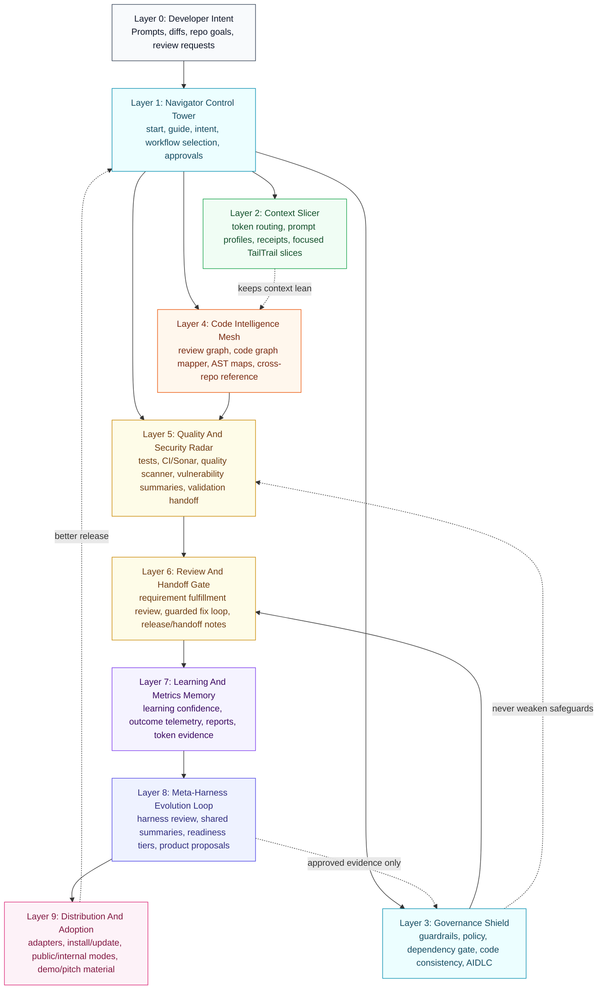
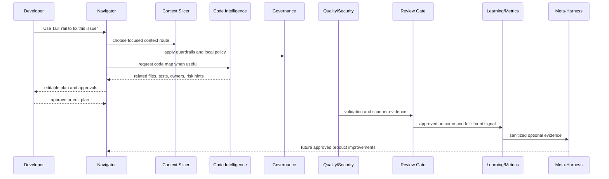

# TailTrail Layered Architecture

TailTrail is a local-first control layer around AI-assisted development. It does not try to replace the model, the IDE, CI, scanners, tests, or human review. It gives those pieces a disciplined path: plan first, load focused context, preserve safeguards, validate honestly, and improve through approved evidence.

## Architecture Map



Read the diagram as a loop, not a stack of isolated features. Navigator routes the task. Context Slicer keeps the prompt small. Governance and code intelligence shape the work. Quality, review, learning, and Meta-Harness turn the result into evidence. Distribution sends better TailTrail behavior back to teams.

## Layer Details

| Layer | Scope | Key Features | Operations |
|---|---|---|---|
| 0. Developer Intent | The user's real goal and current repo state. | Natural prompts, changed files, pasted logs, review requests, repo paths. | Capture the exact request, identify target repo/files, preserve explicit requirements. |
| 1. Navigator Control Tower | Decides the smallest useful TailTrail path. | `start`, `guide`, intent expansion, approval prompts, workflow routing. | Classify task, choose features, list context to load/avoid, ask before scans/writes/heavy reads. |
| 2. Context Slicer | Reduces token noise without hiding facts. | Token Autopilot, Token Slicer, prompt profiles, context receipts, token budget coach. | Select relevant slices, avoid roadmap/release docs for normal coding, record loaded/avoided context when approved. |
| 3. Governance Shield | Keeps AI work within enterprise-safe boundaries. | `GUARDRAILS.md`, `GOVERNANCE.md`, `DEPENDENCY-GATE.md`, policy packs, guardrail layers, AIDLC. | Enforce read-before-change discipline, dependency approval, code consistency, validation truth, security/privacy boundaries. |
| 4. Code Intelligence Mesh | Helps the agent understand code faster. | Code Review Graph Lite, Code Graph Mapper, AST Lite/V1/Semantic V2, cross-repo reference mode. | Map related files, callers, tests, endpoints, tables, config usage, owners, release paths, scanner overlays. |
| 5. Quality And Security Radar | Turns logs and scanners into usable action. | Test Precision, CI/Sonar intelligence, Quality Signal Scanner, vulnerability summaries, validation handoff. | Summarize failures, plan focused tests, ask before scanners, connect findings to graph impact, avoid unsupported claims. |
| 6. Review And Handoff Gate | Checks the result before calling it done. | TailTrail Review, requirement fulfillment review, review lenses, guarded fix loop, handoff notes. | Review uncommitted/branch/path scopes, compare work to user intent, ask clarifying questions, propose fixes only with approval. |
| 7. Learning And Metrics Memory | Stores only useful, approved, confidence-gated memory. | Learning Agent V2, graph-aware learning, learning refresh, outcome telemetry, value reports, measured token telemetry. | Capture accepted/rejected outcomes, score learning confidence, suppress stale patterns, report evidence with measured/local/estimated labels. |
| 8. Meta-Harness Evolution Loop | Improves TailTrail itself through approved evidence. | Harness Review, shared summaries, aggregate analysis, proposals, readiness tiers. | Detect repeated TailTrail behavior issues, generate reviewable product proposals, validate before/after, record rollback outcomes. |
| 9. Distribution And Adoption | Gets the right TailTrail shape into the right environment. | Codex plugin, adapters for Claude/Cursor/Copilot/ChatGPT/Gemini, install/update scripts, internal/public release modes. | Install locally, update safely, export public/internal packages, keep demo and pitch materials aligned. |

## Operational Flow



## Future Growth Path

TailTrail should grow in layers, not as a pile of unrelated commands.

| Horizon | Growth Theme | What It Adds | Why It Matters |
|---|---|---|---|
| Near | One obvious command surface | Better `start`, future `next`, cleaner packaging, Core vs Extended profiles. | New users get value without memorizing commands. |
| Near | Stronger proof | Measured efficacy fixtures, exact telemetry import, value reports with confidence labels. | Enterprise buyers can trust claims. |
| Mid | Deeper code understanding | Richer AST/semantic providers, endpoint-to-table flow, cross-repo service graph. | Agents understand large systems faster with fewer broad reads. |
| Mid | Better guardrail precision | Guardrail false-positive baseline, optional enforcement, CI/PR evidence checks. | Governance becomes practical without becoming noisy. |
| Mid | Meta-Harness readiness tiers | Developer mode, repo maintainer mode, central maintainer mode. | TailTrail knows when to stay quiet and when evidence is ready for product improvement. |
| Later | Opt-in runtime integrations | MCP guardrail server, optional language-server/Roslyn/SCIP enrichers. | Stronger multi-agent and language-specific support without forcing a background service. |
| Later | Central improvement program | Sanitized cross-team aggregation, evidence-gated proposals, release rollout loop. | Many teams benefit from approved collective evidence without sharing code. |

## Meta-Harness North Star

The long-term picture is a controlled improvement loop:

```text
central TailTrail repo
  -> teams install TailTrail
  -> developers use it locally
  -> teams approve sanitized evidence
  -> central maintainers aggregate repeated patterns
  -> Meta-Harness proposes product changes
  -> maintainers validate, merge, and release
  -> teams update to a better TailTrail
```

That is the "collective conscience" of TailTrail: useful signals from many local workflows improve the central tool, while raw source code, raw prompts, user identity, repo names, scanner logs, secrets, and hidden telemetry stay out of the shared evidence path.

## Design Boundaries

- TailTrail does not replace tests, CI, scanners, code review, security review, or human approval.
- TailTrail does not upload telemetry or project data by default.
- TailTrail does not silently run heavy scanners, builds, or vulnerability tools.
- TailTrail does not claim exact token savings without measured model/API usage.
- TailTrail does not let learning or Meta-Harness history override source, policy, tests, CI, scanners, guardrails, or explicit user instructions.
- TailTrail should stay useful when used only as Markdown guidance, and become stronger when teams opt into local deterministic scripts.
