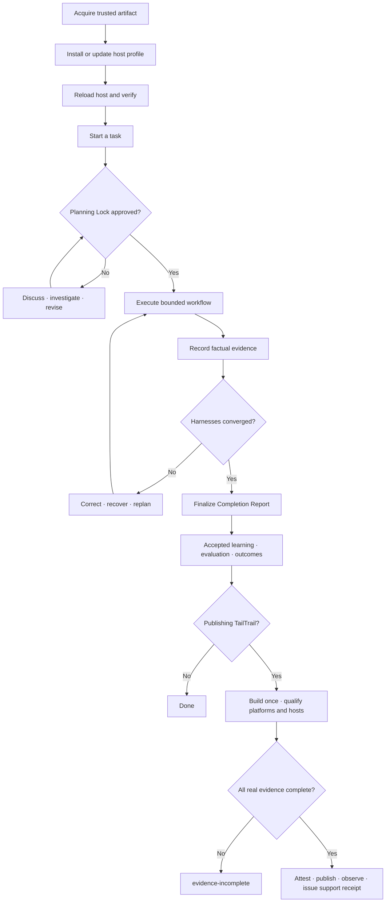
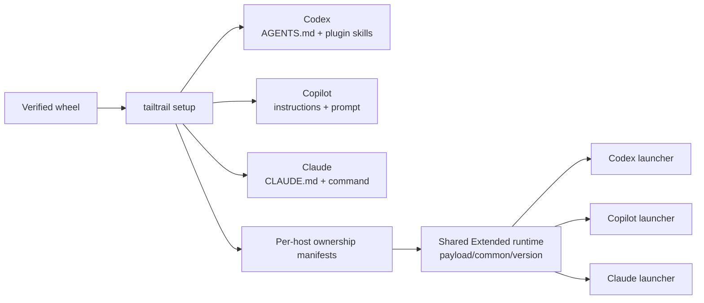
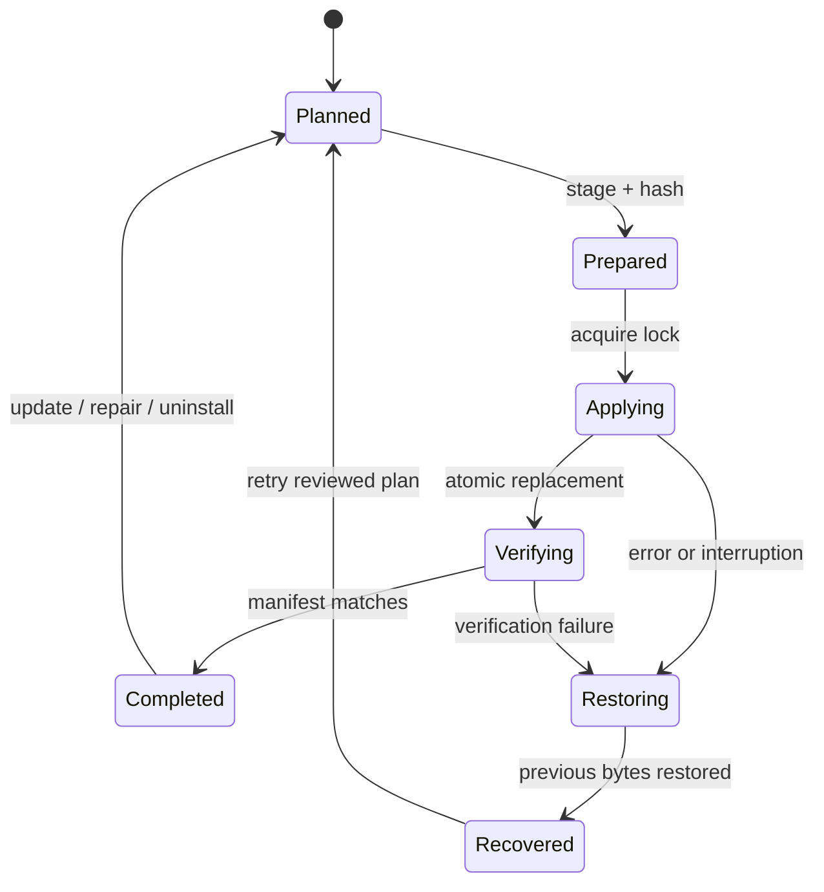
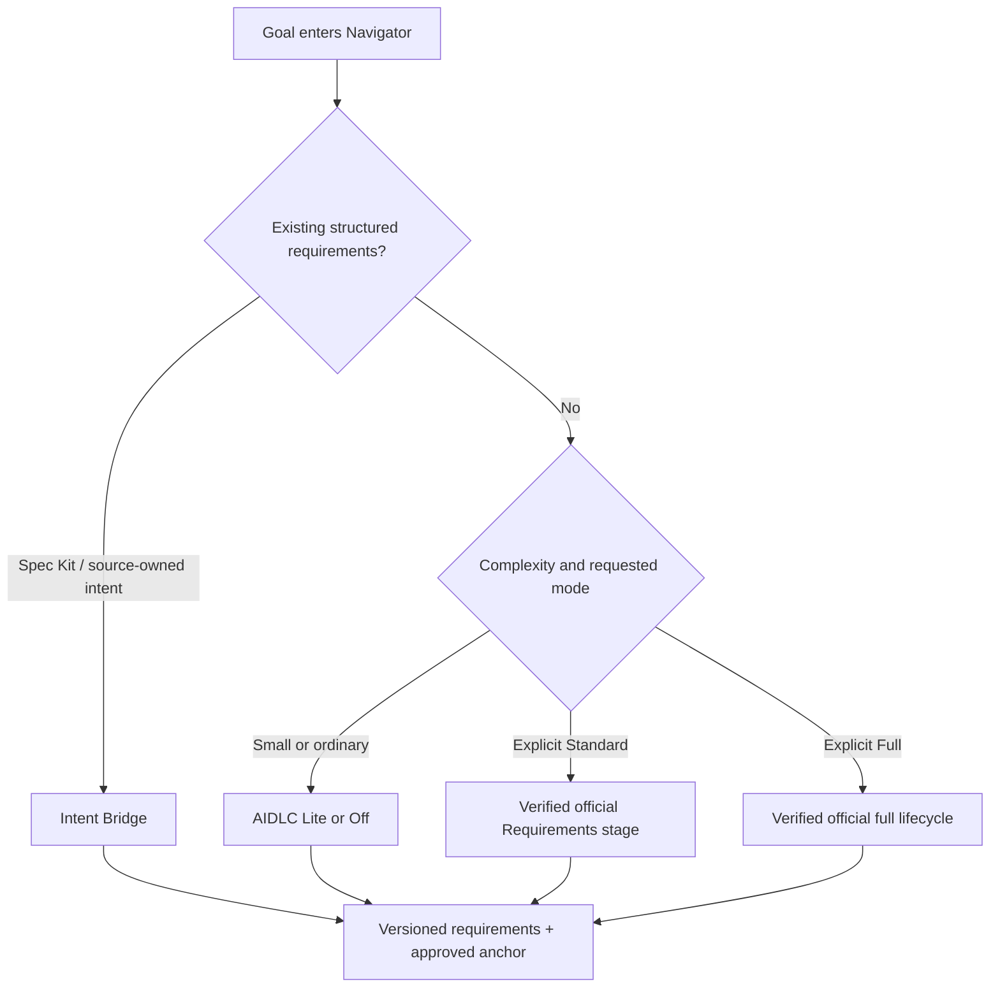
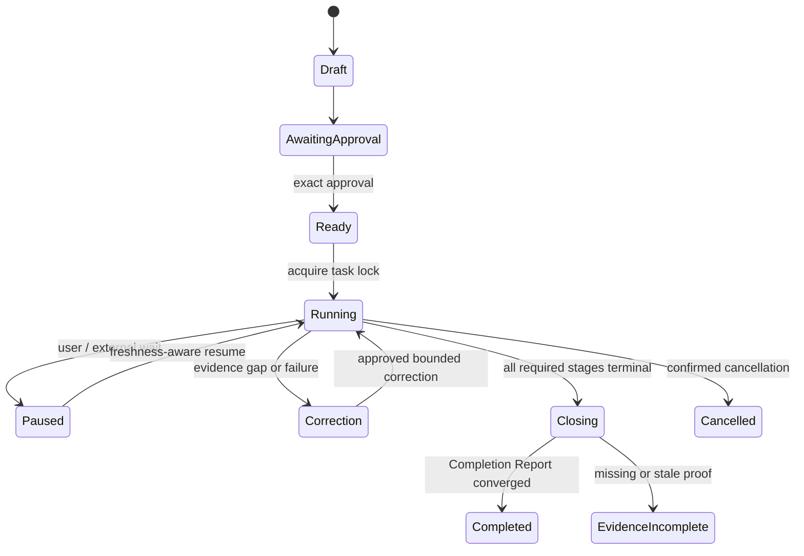
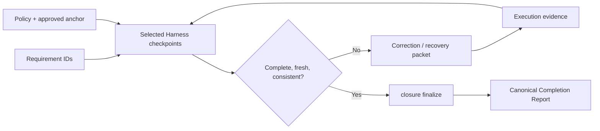
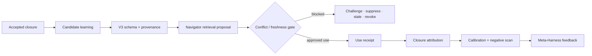
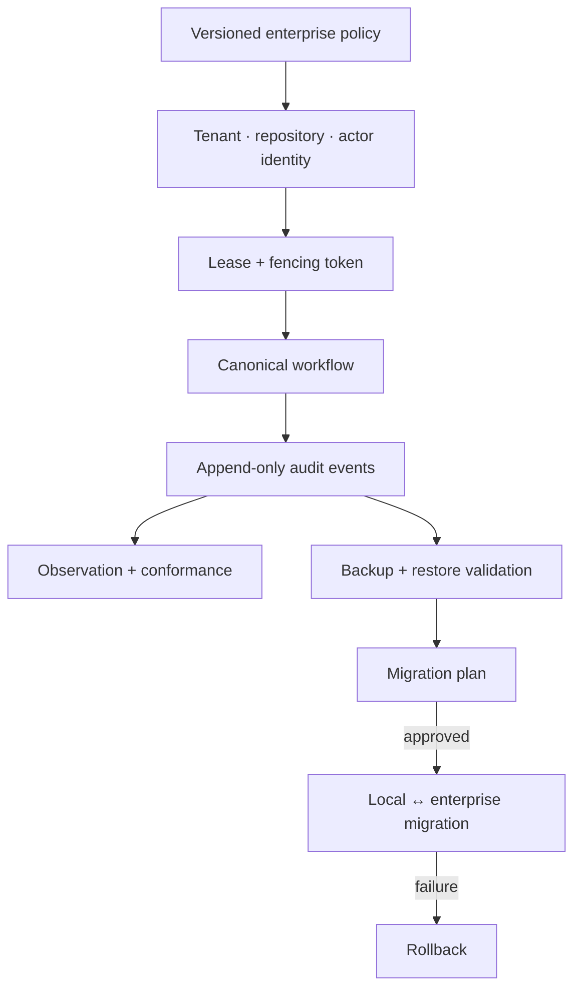
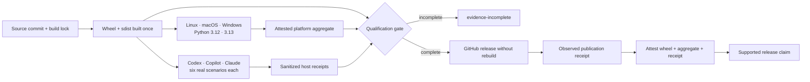

# TailTrail Complete End-to-End Workflow

This is the canonical map of how TailTrail's product features fit together from
trusted installation to task closure, learning, enterprise operation, and
release qualification. It explains the complete journey; it does not duplicate
every flag.

- Use [INSTALL.md](INSTALL.md) for exact installation, update, recovery, and
  platform commands.
- Use [TAILTRAIL-COMMANDS.md](TAILTRAIL-COMMANDS.md) for the complete command
  reference.
- Use `tailtrail registry list` for the machine-readable inventory of every
  registered feature and `tailtrail registry validate --strict` to detect drift.
- Use [USER-GUIDE.md](USER-GUIDE.md) for detailed feature guidance.

## The Whole Product In One Picture

```mermaid
flowchart LR
    subgraph Trust["1 · Trust and distribution"]
        RC[Trusted release channel]
        PKG[Self-contained package]
        AT[Checksums + attestations]
        RC --> PKG --> AT
    end

    subgraph Install["2 · Transactional installation"]
        SETUP[setup / install]
        OWN[Ownership manifest]
        LIFE[verify · doctor · update<br/>repair · recover · rollback · uninstall]
        SETUP --> OWN --> LIFE
    end

    subgraph Host["3 · Host-native entry"]
        CX[Codex<br/>tailtrail start]
        CP[Copilot<br/>/tailtrail-start]
        CL[Claude<br/>/tailtrail-start]
    end

    subgraph Plan["4 · Intent and authority"]
        NAV[Navigator]
        LOCK[Planning Lock]
        REQ[Requirements + approved anchor]
        NAV --> LOCK --> REQ
    end

    subgraph Run["5 · Durable delivery"]
        DWR[Durable Workflow Runtime]
        WORK[Bounded implementation]
        EVID[Typed execution evidence]
        DWR --> WORK --> EVID
    end

    subgraph Assure["6 · Assurance and closure"]
        HAR[Selected Harnesses]
        FIX[Correction / recovery]
        CLOSE[Canonical Completion Report]
        HAR -->|gap| FIX --> WORK
        HAR -->|converged| CLOSE
    end

    subgraph Improve["7 · Improvement and proof"]
        LEARN[Learning V3]
        EVAL[Evaluation + Meta-Harness]
        REPORT[Outcome and enterprise reports]
        LEARN --> EVAL --> REPORT
    end

    AT --> SETUP
    LIFE --> CX & CP & CL
    CX & CP & CL --> NAV
    REQ --> DWR
    EVID --> HAR
    CLOSE --> LEARN
```



The arrows are evidence and authority boundaries, not a promise that every
feature runs on every task. Navigator selects the smallest useful set. Core
safeguards remain active, while Extended capabilities activate only when their
trigger and evidence requirements apply.

## Two Connected Journeys

TailTrail has two complete loops. Product users follow the delivery loop.
Maintainers additionally follow the distribution and release-proof loop.



## Journey A — Install And Activate TailTrail

### 1. Discover the trusted release

```bash
tailtrail release info
```

This prints the configured repository, expected artifact, identity-verification
command, and installation command. It identifies the trusted channel; it does
not claim a release exists.

Before installation, verify the downloaded wheel's SHA-256 and GitHub identity
attestation. The self-contained wheel supports CPython 3.12 and 3.13 and has no
runtime package dependencies.

### 2. Install into an isolated Python environment

```bash
python3.12 -m venv .venv
.venv/bin/python -m pip install tailtrail-0.6.0-py3-none-any.whl
.venv/bin/tailtrail package-info --format json
.venv/bin/tailtrail hello
.venv/bin/tailtrail doctor
```

On Windows, use `.venv\Scripts\python` and `.venv\Scripts\tailtrail`.
`package-info` verifies packaged resource hashes; `hello` is the fast command
smoke check; `doctor` is the deeper package validation.

### 3. Project the correct host profile

The guided command installs or updates, verifies ownership, runs diagnostics,
and prints the exact first action and reload instruction:

```bash
tailtrail setup --host codex --profile core --target /path/to/project
tailtrail setup --host copilot --profile core --target /path/to/project
tailtrail setup --host claude --profile core --target /path/to/project
```

Use `--host auto` only when exactly one host is detectable. It fails without
mutation for zero or multiple matches. Use `--host all` only for a repository
that intentionally supports Codex, Copilot, and Claude together.



| Host | Core first action | Required refresh | Stronger stale fallback |
| --- | --- | --- | --- |
| Codex | `tailtrail start "<goal>"` | Start a new task. | Reopen the project. |
| GitHub Copilot | `/tailtrail-start <goal>` | Start a new chat. | Reload the IDE window. |
| Claude | `/tailtrail-start <goal>` | Start a new session. | Restart Claude Code. |

Core is the first-run surface. Extended stores one full versioned runtime at
`.tailtrail/install/payload/common/<version>/` and small per-host launchers at
`.tailtrail/install/payload/<host>/`. Shared files remain while another host
manifest references them.

### 4. Verify lifecycle ownership

```bash
tailtrail verify --host codex --target .
tailtrail doctor --host codex --target .
tailtrail status --host codex --target .
```

The transactional lifecycle stages files, hashes their bytes, atomically
replaces owned paths, records an ownership manifest and journal, and restores
the prior state on failure. Existing unowned or locally modified files are
preserved. `--force` is the explicit reviewed backup-and-replace path.



### 5. Update or recover safely

```bash
tailtrail update --host codex --target . --dry-run
tailtrail update --host codex --target .
tailtrail repair --host codex --target .
tailtrail recover --target .
tailtrail rollback --to <transaction-id> --target .
tailtrail uninstall --host codex --target . --dry-run
```

For a reviewed package upgrade, use one local hash-pinned wheel for the Python
environment and all selected project payloads:

```bash
tailtrail upgrade --artifact tailtrail-0.6.0-py3-none-any.whl \
  --sha256 <exact-sha256> --host all --target . --dry-run
tailtrail upgrade --artifact tailtrail-0.6.0-py3-none-any.whl \
  --sha256 <exact-sha256> --host all --target . --approved
```

Upgrade checks the digest and embedded integrity, preflights every project,
updates project payloads transactionally, then calls pip with `--no-index
--no-deps`. If pip fails, completed project transactions are rolled back.

## Journey B — Deliver One Task Completely

### 1. Start at the host-native entry

For an ordinary task, the six-verb façade is the shortest complete path:

```bash
tailtrail start "add retry handling to payment capture"
tailtrail discuss --run-id <run-id> --question "Why was this scope selected?"
tailtrail approve --run-id <run-id>
tailtrail continue --run-id <run-id>
tailtrail status --run-id <run-id>
tailtrail close --run-id <run-id>
```

`start` is planning-only. Navigator resolves the target workspace, classifies
the task, creates stable requirement IDs, chooses relevant features and focused
validation, and persists a Planning Lock. It never turns words such as
“implement,” “hands-free,” or “end-to-end” into write authority.

### 2. Choose the requirements authority



- AIDLC Lite is the local compact lifecycle.
- Standard uses the pinned, integrity-verified official requirements workflow.
- Full continues through the complete official lifecycle.
- Intent Bridge keeps a detected structured requirement source authoritative
  while TailTrail manages slices, evidence, amendments, drift, and convergence.
- Question Orchestrator grounds only material decisions in known repository and
  policy evidence.

### 3. Review and approve the exact plan

While the lock awaits approval, use Interactive Plan Mode without touching
source:

```bash
tailtrail planning explain --run-id <run-id> --question "Why this file?"
tailtrail planning discuss --run-id <run-id> --question "Why this test tier?"
tailtrail planning investigate --run-id <run-id> --path src/payment.py --approved-read-only
tailtrail planning revise --run-id <run-id> --changes '<json>' --approved-proposal
tailtrail planning feature-controls-show --run-id <run-id>
tailtrail planning activate --run-id <run-id> --approved
```

Discussion, investigation, revision, optional feature customization, AIDLC mode
switches, and question correction are versioned. Approval binds the exact
revision and creates the execution handoff; it does not silently widen scope.

### 4. Run the durable workflow

For lean work, the host can perform the approved local slice and report it
through `continue`. Larger work compiles into the Durable Workflow Runtime:



The runtime owns workflow identity, append-only state, deterministic templates,
task reservations, freshness, approvals, capability adapters, retry limits,
pause/resume, CI continuation, retention, migration, and replay. `next`,
`status`, and resume commands read persisted state instead of relying on chat
memory.

### 5. Activate only the needed capabilities

Navigator and the workflow compiler select capabilities based on the task:

| Trigger | Capability family | What it contributes |
| --- | --- | --- |
| Unknown project shape or impact | Bootstrap Snapshot, Target Workspace Resolver, Code Graph Mapper, AST maps, Cross-Repo Reference | Correct root, callers, tests, ownership, graph freshness, and reference evidence. |
| Requirements must be proven | Requirement Completion, Behaviour, Architecture Fitness, Maintainability | Requirement-to-path traceability, user behavior, boundary integrity, and small maintainable diffs. |
| Tests or releases are risky | Test Precision, Evidence-Aware Testing, Higher-Tier/Release Confidence | Focused test plan, typed receipts, CI evidence, flaky posture, contracts, migration, rollback, and release gates. |
| Security, dependency, CI, or Sonar work | Guardrails, Dependency Gate, Repository Enforcement, Quality Signals, Vulnerability Intelligence | Policy-preserving review, approved scanners, structured findings, SARIF/JSON output, and CI enforcement. |
| UI change | UI Consistency Guardrail | Existing components, tokens, responsive behavior, accessibility, and visual-test reuse. |
| Failure or repeated correction | Debug Harness, Failure Intake, Mode B Diagnostician, Safe Git Recovery | Reproduction, hypotheses, experiments, proven cause, bounded correction, and selective recovery. |
| Large context or long-running work | Token Harness, Context Engine, Context Continuity | Exactness-aware reduction, budgets, receipts, telemetry, continuity reminders, and compact resume state. |
| Multi-feature hands-free program | Program Delivery Harness | Dependency-ordered features, slices, checkpoints, and resumable orchestration. |
| Remote, graph, cloud, or model execution | Advanced Runtime Boundaries, MCP | Explicit capability contracts, approvals, and factual receipts without hidden shell or write authority. |

### 6. Record facts, not conversational claims

For an approved run, record events only when the host actually observes them:

```bash
tailtrail execution-evidence record --root . --run-id <run-id> \
  --event '{"kind":"source-edit","requirement_uids":["<requirement-uid>"],"changed_paths":["src/payment.py"]}' \
  --approved
tailtrail execution-evidence record --root . --run-id <run-id> \
  --event '{"kind":"command-result","requirement_uids":["<requirement-uid>"],"changed_paths":["src/payment.py"],"tier":"unit","command_label":"payment tests","command":"python -m unittest tests.test_payment","outcome":"pass"}' \
  --approved
```

Evidence can include exact source edits, command outcomes, deterministic
Harness artifacts, and CI receipts. A test name, assistant statement, configured
workflow, or planned scanner is not evidence that it ran.

### 7. Converge, correct, and close



```bash
tailtrail closure finalize --root . --run-id <run-id>
tailtrail close --run-id <run-id>
```

The Completion Report is the one delivery truth. It separates complete,
incomplete, stale, skipped, unavailable, and inapplicable controls; preserves
unresolved risks; and does not convert partial unit evidence into end-to-end
success. Safe Git checkpoints and correction boundaries preserve completed and
unrelated work.

## Journey C — Learn Without Polluting Future Work

Learning is acceptance-gated and advisory. Source, current tests, active policy,
and explicit user direction always outrank a prior learning.



The Learning V3 family includes inventory and ownership, V2-to-V3 migration,
retrieval proposals, conflict gates, use receipts, closure attribution,
refresh, negative learning, calibration, and evaluation. It never captures raw
prompts automatically or lets old advice override current evidence.

```bash
tailtrail learn retrieve --root . --task-types implementation --tags payment \
  --path src/payment.py
tailtrail learn governance conflict --root . --learning-id <learning-id> \
  --reason "Conflicts with the current payment policy" --approved
tailtrail learn receipt validate --root . --run-id <run-id>
tailtrail learn calibration evaluate --root .
tailtrail learn governance negative-scan --root .
tailtrail eval learning validate --root . <calibration-report.json>
```

After closure, opt-in outcome telemetry, value reports, adoption validation,
the Evaluation Harness, benchmark efficacy, and Meta-Harness can assess workflow
fit. Estimates remain labelled estimates; measured token claims require real
linked telemetry; public performance claims require the real evaluation gate.

## Journey D — Enterprise Operation And CI

Enterprise controls extend the same local workflow rather than creating a
second source of truth.



Key enterprise layers are:

- target workspace and input-role resolution before planning;
- policy, identity, tenant/repository/actor binding, leases, and fencing;
- append-only audit, replay, observation, backup, restore, migration, rollback,
  and conformance;
- repository enforcement with versioned policy, baseline, suppressions, JSON,
  SARIF, and a pinned reusable CI action;
- policy-backed CI receipt ingestion that resumes the same workflow without
  treating a configured check as a passing result;
- retention plans, denial evidence, security/privacy inspection, and negative
  assurance;
- offline enterprise-readiness conformance and sanitized support bundles.

```bash
tailtrail enforce validate
tailtrail enforce check --root .
tailtrail enterprise-readiness --root . conformance
tailtrail workflow assurance inspect --root . --workflow-id <workflow-id>
tailtrail workflow ci ingest --root . --workflow-id <workflow-id> \
  --receipt-ref .tailtrail/incoming/ci-receipt.json \
  --policy-ref .tailtrail/workflow-ci-policy-v1.json --approved
```

MCP remains a thin inspection and controlled-execution surface. It records
supplied authority or factual evidence; it does not secretly inspect production,
run arbitrary shell commands, edit source, commit, push, merge, deploy, or turn
missing proof into success.

## Journey E — Qualify And Release TailTrail

The release loop builds once and promotes the same bytes. Local tests,
configured workflows, contract conformance, and real-host/platform evidence are
reported separately.



### Maintainer sequence

```bash
python3 scripts/release-check.py
tailtrail registry validate --strict
tailtrail maturity maintainability validate
tailtrail adapters conformance
tailtrail qualify prepare --host all --root .
```

Run the six prepared scenarios in each real host and record sanitized receipts
with `tailtrail adapters runtime record`. Hosted CI must produce the exact
Windows/macOS/Linux × CPython 3.12/3.13 aggregate for the same artifact.

```bash
tailtrail qualify report --host all --root . \
  --platform-report <hosted-platform-report.json> \
  --publication-receipt <observed-publication-receipt.json> \
  --artifact <downloaded-wheel>
```

Qualification verifies GitHub attestations for the wheel, platform aggregate,
and observed publication receipt. Only a complete aggregate can set
`supported: true`; otherwise the honest result is `evidence-incomplete`.

## Practical Examples

### Example 1 — Small bug, minimum useful workflow

> “Fix the null retry count in payment capture and keep the public API stable.”

```text
Navigator
  └─ Planning Lock (REQ-001)
      └─ focused source + caller inspection
          └─ bounded edit
              └─ focused regression test receipt
                  └─ Requirement Completion + Maintainability
                      └─ Completion Report
```

Expected behavior: no AIDLC Full lifecycle, no new dependency, no broad scanner,
and no learning capture unless the completed result is explicitly accepted.

### Example 2 — Hands-free enterprise feature

> “End-to-end: add tenant-aware retry policy, migrate configuration safely,
> validate CI, and prepare release evidence.”

```text
Program Delivery Harness
  ├─ F1 requirements + tenant boundary
  ├─ F2 architecture + policy design
  ├─ F3 implementation slices
  ├─ F4 migration and rollback proof
  ├─ F5 behavior, integration, and CI receipts
  └─ F6 release-confidence convergence
```

Each feature has stable requirements, dependency order, a first active slice,
an approval boundary, and separate evidence. “Hands-free” makes the plan
comprehensive; it does not remove the Planning Lock or material approval gates.

### Example 3 — Failing production-like integration test

> “The payment callback contract test fails after the schema change.”

The Debug Harness preserves one run from reproduction through correction:

```text
intake → reproduction approval → orientation → ranked hypotheses
       → approved experiment → root-cause proof → correction proposal
       → correction approval → bounded edit → convergence → closure
```

A passing test alone is not root-cause proof. Production access, network calls,
security testing, and cloud mutations stay outside the local Debug authority
unless separately authorized.

### Example 4 — Existing Spec Kit requirements

TailTrail detects the source read-only, imports a versioned snapshot, maps its
requirements into an approved anchor, advances one active task slice at a time,
records evidence against source IDs, checks amendments and drift, and converges
closure without rewriting the source-owned specification.

## Complete Feature Coverage Map

This map groups every current Feature Registry entry. The registry remains the
machine authority for exact status, surface, owner, commands, docs, tests, MCP
exposure, dependencies, approval posture, and evidence label.

| Product layer | Registered feature IDs |
| --- | --- |
| Package, install, hosts, and supply chain | `self-contained-package`, `transactional-installer-lifecycle`, `cross-platform-supply-chain`, `enterprise-host-adapters`, `host-runtime-conformance`, `install-surfaces`, `assistant-adapters`, `release-admin`, `command-surface` |
| Start, planning, requirements, and targeting | `navigator`, `planning-lock`, `interactive-plan-mode-ip0`, `target-workspace-resolver`, `canonical-local-state`, `bootstrap-snapshot`, `question-orchestrator`, `aidlc`, `official-aidlc-compatibility`, `official-aidlc-bridge` |
| Intent Bridge / Spec Kit | `spec-kit-bridge-contract`, `spec-kit-read-only-detection`, `spec-kit-canonical-import`, `spec-kit-navigator-integration`, `spec-kit-anchor-task-slice-bridge`, `spec-kit-harness-evidence-integration`, `spec-kit-amendment-drift-recovery`, `spec-kit-closure-convergence`, `spec-kit-mcp-host-ci-integration`, `spec-kit-evaluation-governance-release` |
| Durable Workflow Runtime | `durable-workflow-ownership-dwr-a`, `durable-workflow-capability-bridge-dwr-b`, `durable-workflow-task-scope-dwr-c`, `durable-workflow-storage-dwr-minus`, `durable-workflow-state-engine-dwr-1`, `durable-workflow-compiler-dwr-1-5`, `durable-workflow-start-integration-dwr-2`, `durable-workflow-evidence-closure-dwr-3`, `durable-workflow-proven-vertical-dwr-4`, `durable-workflow-documentation-phase-0`, `durable-workflow-contract-dwr-0`, `durable-workflow-deferred-phase-2`, `durable-workflow-deferred-phase-3`, `durable-workflow-deferred-phase-4`, `durable-workflow-deferred-phase-5`, `durable-workflow-deferred-phase-6`, `durable-workflow-deferred-phase-7`, `durable-workflow-deferred-phase-8`, `durable-workflow-deferred-phase-9`, `durable-workflow-deferred-phase-10`, `durable-workflow-deferred-phase-11`, `durable-workflow-deferred-phase-12` |
| Completion and assurance Harnesses | `requirement-completion-harness`, `architecture-fitness-harness`, `behavior-harness`, `maintainability-harness`, `evidence-aware-testing`, `higher-tier-testing-release-confidence`, `context-continuity-harness`, `program-delivery-orchestrator`, `mode-b-recovery-and-diagnosis`, `safe-git-checkpoints-and-recovery`, `ui-consistency-guardrail`, `advanced-runtime-boundaries`, `debug-harness` |
| Code, quality, security, review, and policy | `code-graph-mapper`, `cross-repo-reference`, `review`, `testing`, `quality-signals`, `security-vulnerability`, `guardrails`, `governance`, `repository-ci-enforcement`, `context-engine` |
| Context, learning, evaluation, and reporting | `token-harness`, `learning`, `evaluation-harness`, `meta-harness`, `benchmark-efficacy`, `public-evidence-portfolio`, `reporting` |
| Enterprise and product governance | `enterprise-readiness-program`, `product-maturity-pm0`, `registry`, `mcp` |

Run these after any feature addition or workflow change:

```bash
tailtrail registry list
tailtrail registry validate --strict
tailtrail registry drift
tailtrail maturity maintainability validate
```

## Non-Negotiable Truth Boundaries

- Planning is not implementation authority.
- A configured test, scanner, workflow, or CI job is not a passing receipt.
- Contract-tested host instructions are not real-host observation.
- Local platform success is not cross-platform qualification.
- A checksum proves byte identity, not publisher identity.
- A published artifact is not supported until host, platform, artifact, and
  observed-publication evidence converge for the same release.
- A learning is advisory and cannot outrank current source, policy, tests, or
  explicit user direction.
- Estimated token savings are not measured usage.
- MCP and enterprise adapters do not imply hidden remote execution.
- An evidence-incomplete Completion Report is not successful closure.

That is the complete TailTrail loop: install trusted bytes, enter through the
native host, lock intent, execute bounded work, record facts, converge all
selected assurance, close once, learn only from accepted evidence, and publish
only after real release proof.
