# TailTrail Debug Harness

## Document status and reading guide

**Status:** native implementation phases DI-0 through DI-12 are implemented;
release remains evidence-blocked pending genuine supported-host receipts.
The local CLI/MCP control plane, schemas, focused tests, failure intake,
reproduction approval, hypothesis/experiment ledger, correction approval, and
canonical Debug closure evidence exists. Native Navigator routing, canonical
Planning Lock/reproduction ownership, and the DWR `debug-investigation`
workflow, selected-Harness convergence, and canonical closure are implemented.
Token/privacy/continuity, candidate-only learning, and equivalent Codex,
Copilot, and Claude host instruction contracts are complete. DI-12 now provides
deterministic evaluation and a fail-closed release gate; genuine hosted runtime
receipts are external evidence and remain absent. Section 21
is the authoritative integration plan. Earlier sections describe the target
design unless they explicitly say **implemented prototype**.

This document is the source of truth for: the problem the Debug Harness
solves, how it fits the existing nine-layer TailTrail model, the run
lifecycle and confidence state machine, the data model (schemas), the CLI/MCP
surface, the integration points with existing harnesses (Program Delivery,
Behaviour, Architecture Fitness, Evidence-Aware Testing, Drift Control, Safe
Git Recovery, Context Continuity, Learning Governance, Token Harness, Durable
Workflow Runtime), guardrails, phased delivery plan, and open risks.

---

## 1. Problem statement

> "Something is broken, but I don't know the project well enough to identify
> the responsible component, reproduce the failure reliably, or judge whether
> the agent's fix is correct."

Today a user can already ask an agent to "fix this bug." Without structure,
that produces a well-known failure mode:

1. The agent reads the stack trace and guesses a cause.
2. The agent edits code near the guess.
3. The agent reruns whatever test is nearby.
4. If the test goes green, the agent declares victory — even if the test was
   weakened, the path bypassed, or the fix only hides the symptom.
5. The user, unfamiliar with the codebase, cannot independently judge whether
   the real defect was found.

TailTrail is already strong at **fresh implementation**: turning an approved
requirement into evidence-backed, drift-controlled, regression-tested code
(Program Delivery Harness, Requirement Completion, Behaviour Harness,
Architecture Fitness). It has **no equivalent structure for diagnosis** — the
step that happens *before* a requirement can even be written, when the
"requirement" is simply "make the reported symptom stop happening for the
right reason."

The Debug Harness closes that gap. It is not a replacement for IDE debuggers,
language runtimes, or breakpoint-based tools — it is the missing **evidence
discipline layer** that turns a vague symptom into a reproducible failure, the
reproducible failure into a proven root cause, and the root cause into a
correction that TailTrail's existing harnesses can validate.

## 2. Positioning: what it is and is not

| It IS | It is NOT |
| --- | --- |
| An evidence-driven investigation workflow for coding agents | A traditional IDE debugger (breakpoints, watch windows, step execution) |
| A structured way to turn "it's broken" into a reproduction, a ranked hypothesis set, and a proven cause | A guarantee that any bug can be found automatically |
| A consumer of Navigator, Code Graph Mapper, Context Continuity, Drift Control | A new orchestration engine that duplicates those systems |
| A producer of evidence and requirements that feed the existing Program Delivery / Harness / Closure pipeline | A parallel closure/reporting system that bypasses Completion Report and Learning Governance |
| Bounded, cycle-limited, and fail-closed on ambiguity | An unbounded "keep trying things" loop |
| Reproduce-first, in a sandboxed/local context by default | A tool that calls production systems, real payment/3rd-party providers, or mutates production state |

The key discipline the Debug Harness adds is a hard separation between
**"tests pass"** and **"root cause proven."** A test can pass because the
agent weakened an assertion, deleted a call, or routed around the failing
path. TailTrail must never let those two states collapse into each other.

## 3. Fit assessment against the existing TailTrail model

TailTrail's architecture is a nine-layer stack from developer intent to
distribution (see [ARCHITECTURE.md](ARCHITECTURE.md), [DESIGN.md](DESIGN.md)).
The Debug Harness is designed not to become a tenth, disconnected layer. Its
target form is a **workflow type** that reuses seven of the nine layers and introduces two new
artifacts (a failure fingerprint and a hypothesis ledger) that plug into the
existing evidence/requirement/drift machinery.

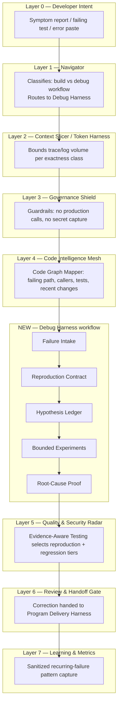

| Existing TailTrail capability | Current implementation | Role in Debug Harness |
| --- | --- | --- |
| Navigator | `scripts/navigator.py`, `navigator_core.py` | Classifies a request as a **debug** workflow (symptom-first, no approved requirement yet) instead of a **build** workflow, and selects the smallest trustworthy investigation path |
| Code Graph Mapper | `scripts/code-graph-mapper.py` | Produces the failing-path map: entry point, callers, downstream effects, covering tests, recent-change context |
| Context Continuity | `scripts/context-continuity.py`, `.tailtrail/runs/<run-id>/context-continuity.json` | Remembers eliminated hypotheses and failed experiments across cycles so the agent never re-tries a disproven idea |
| Requirement Completion | `scripts/requirement-completion.py`, `requirement-impact-map.py` | Converts "expected behavior" (from the reproduction contract) into the same completion-state tracking used for normal requirements |
| Architecture Fitness | `scripts/architecture-fitness.py` | Confirms the correction touches the actually-responsible layer, not a nearby symptom |
| Behaviour Harness | `scripts/behavior-harness.py` | Proves the original user journey is restored, not just that a narrow unit test passes |
| Evidence-Aware Testing | `scripts/test-precision.py`, `test-tier-selector.py` | Selects the bounded reproduction tier and the regression tier after the fix |
| Drift Control | `scripts/change-intent-anchor.py`, `requirement-impact-map.py` | Extended with an **investigation drift** signal: is the agent still inside the approved investigation scope? |
| Safe Git Recovery | `scripts/git-readiness.py`, `recovery-*.py` | Recovers failed correction attempts without losing the proven root cause |
| Token Harness | `scripts/token-harness.py`, `token-harness-ledger.py` | Bounds trace/log capture using the existing exactness classes (`must-be-exact` for the failing stack frame, `summary-safe` for surrounding noise) |
| Durable Workflow Runtime | `scripts/workflow_runtime/*` | Hosts the debug run as a workflow instance so pause/resume/cancel/replay work identically to build workflows |
| Learning Governance | `scripts/learning-*.py`, `LEARNING-GOVERNANCE.md` | Captures the sanitized failure-pattern → root-cause mapping only after a **trusted closure**, same confidence gates (0–100) as everywhere else |
| Completion Report / Closure | `scripts/completion-report.py`, `closure-*.py` | Debug runs close through the same fail-closed Completion Report, with a debug-specific evidence section |

**Conclusion of the fit assessment:** the Debug Harness is additive, not
parallel. DI-1 through DI-9 removed the parallel routing and completion
authority. Two genuinely new artifacts are
required (failure fingerprint and hypothesis ledger); the remaining target
behavior composes existing TailTrail mechanisms.

## 4. Vocabulary

| Term | Definition |
| --- | --- |
| **Debug run** | A `tailtrail debug` invocation, identified by the same `run_id` convention as a build run, living under `.tailtrail/runs/<run-id>/debug/` |
| **Failure fingerprint** | A normalized, deduplicated identity for a reported failure (symptom text hash + stack signature + affected entry point), used to detect "have we seen this before" via Learning Governance and Context Continuity |
| **Reproduction contract** | The debug analogue of an approved anchor: trigger, expected, actual, reproduction method, preserve rules, safety boundary — approved before any code is touched |
| **Hypothesis ledger** | An append-only, ranked list of candidate causes, each with supporting evidence, contradicting evidence, and the next discriminating experiment |

The ledger keeps two evidence classes separate. `supporting_evidence` and
`contradicting_evidence` contain only experiment-linked evidence that can
change proof state. `advisory_evidence` contains labeled source, orientation,
or heuristic observations used to choose the next experiment. Each advisory
item preserves its direction, label, summary, and artifact reference. It may
explain a ranking recommendation but cannot prove or eliminate a hypothesis.
The ledger also saves evidence gaps and the expected discriminating signal.

`tailtrail debug hypothesis show` renders this distinction as a stable
four-column Markdown table by default. `--format json` returns the exact
machine contract. Empty formal evidence is displayed as `none recorded`, not
`null`, and does not hide any saved advisory observation.

Read-only MCP lifecycle inspection treats an artifact that is not yet expected
as state, not an exception. Correction, convergence, governance, and completion
show tools return `status: not-created`, the lifecycle stage after which the
artifact is expected, a reason, and the safest next action. Convergence returns
the three unconditional controls as a preview and defers conditional lenses
until correction scope exists. `workflow_current` also explains that projected
Debug artifacts do not advance the canonical DWR stage without a linked,
authorized stage result.
| **Experiment** | A single bounded, deterministic action whose sole purpose is to eliminate or strengthen one hypothesis (not to fix anything) |
| **Root-cause proof** | The evidence artifact that a specific, named defect — not merely "the test now passes" — explains the reproduction |
| **Correction packet** | The bounded fix proposal handed to the existing Program Delivery / Harness pipeline once root cause is proven |
| **Confidence state** | One of eight ordered states (Section 8) tracking how far the investigation has progressed; distinct from pass/fail test status |
| **Diagnosis domain** | The system layer a hypothesis belongs to — code, architecture, database, cloud/infrastructure, security, API integration, or network (Section 7) |

## 5. Debug run lifecycle

The native Debug Harness will run as a **workflow type** inside the existing
Durable Workflow Runtime (`scripts/workflow_runtime/`), analogous to today's
`template_id` values (`small-change`, `delivery`, `risk-sensitive`,
`review-only`, `ci-scanner-remediation`, `repository-discovery`). It adds a
new template: **`debug-investigation`**, implemented by DI-4.

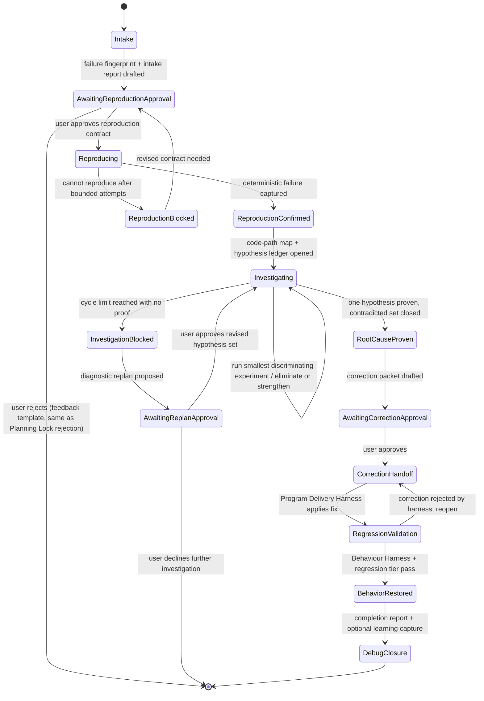

State transitions are recorded on the same append-only run ledger used today
(`scripts/run-ledger.py`), with new event types (Section 10).

## 6. Detailed phase walkthrough

### Phase 0 — Failure Intake

Entry points:

```bash
tailtrail debug "Orders sometimes charge twice when payment times out"
tailtrail debug --error error.txt
tailtrail debug --command "python3 -m unittest tests.integration.test_payment"
tailtrail debug --run-id <existing-run>          # attach to an active build run
tailtrail debug --recent-change                   # anchor to the latest approved change
```

**Navigator-driven entry point (implemented).** `tailtrail start "<goal>"` is
also a debug entry point, not only a build one: `classify_start_intent()` in
`scripts/tailtrail.py` routes a goal to the Debug Harness instead of the
normal build workflow when it carries an unambiguous bug-report signal
(`--error`/`--command` present, or high-precision phrasing such as "charged
twice", "crashes when", "stopped working") — otherwise it falls through to
the existing build path unchanged. `--debug`/`--build` force one or the
other explicitly. This mirrors how Navigator already selects features for
build runs; ambiguous goals default to build rather than guessing, and the
routing decision is always printed, never silent (see `tests/test_navigator_debug_routing.py`).

A pasted error, log, or stack trace attached to an **existing** approved run
must never silently create a new Planning Lock or a new debug run — this
mirrors the "current-turn Start boundary" rule TailTrail already enforces for
build runs (see the adapter contracts in [AGENTS.md](AGENTS.md),
[CLAUDE.md](CLAUDE.md)). The same boundary applies here: only an explicit
`tailtrail debug ...` invocation in the current message opens a new debug run.

Intake captures, and reuses Context Continuity's four-layer state shape
(`scripts/context-continuity.py`) rather than inventing a new memory model:

- observed behavior, expected behavior
- error / stack trace / failed command (verbatim, `must-be-exact`)
- reproduction frequency (always / intermittent / once)
- environment and recent-change context (via Code Graph Mapper freshness check)
- affected user journey (feeds Behaviour Harness scenario selection later)
- safety impact (blast radius: read-only, write, external call, payment, PII)
- known vs assumed (explicit — this is what most agent debugging skips)

Output: a **Debug Intake Report** (not an implementation plan):

```
Failure understood: partial
Reproduction: not yet confirmed
Likely path: API -> order service -> payment adapter -> repository
Safety boundary: no external payment call
Next investigation: reproduce timeout-after-acceptance locally
Approval needed: allow the proposed read-only investigation
```

### Phase 1 — Project orientation

Navigator + Code Graph Mapper (existing, unchanged) resolve:

- entry point and the responsible service/module path
- callers and downstream effects
- tests already covering that path
- recent changes when Git evidence is available
- configuration/environment boundaries
- logging/observability surfaces already in the code

This becomes a compact "how this path works" explanation attached to the
Debug Intake Report — the mechanism that helps a user unfamiliar with the
repository without forcing them to read the whole codebase.

### Phase 2 — Reproduction contract (the debug analogue of an approved anchor)

Nothing is changed in source until this contract is approved. It uses the
same anchor discipline as `change-intent-anchor.schema.json`, adapted to
diagnosis:

| Field | Example |
| --- | --- |
| Trigger | Payment gateway times out after accepting the charge |
| Expected | One charge and one order |
| Actual | Retry creates a second charge |
| Reproduction method | Integration test with a timeout-after-acceptance adapter double |
| Preserve | Successful order creation remains unchanged |
| Safety boundary | Do not call a real payment provider |
| Approval | Required before any experiment or code edit |

If the failure cannot be reproduced deterministically within a bounded number
of attempts, the run enters `ReproductionBlocked` and returns to the user for
a revised contract — TailTrail must never proceed to "fix" an unreproduced
symptom.

**Turn-by-turn approval boundary (mirrors `tailtrail start`'s Planning Lock
stop-and-wait behavior).** A host/agent must draft the reproduction contract,
show it to the user with status `awaiting-approval`, and **stop** — it must
not call `reproduction approve` in the same turn, even if the user's original
message described the whole investigation end-to-end. Only a separate,
explicit follow-up message (for example: "I approve the reproduction contract
for run `<run-id>`") may trigger approval. The identical rule applies before
`correction approve` in Phase 5: propose the correction packet, show it, stop,
and require a second explicit approval message before implementing the fix.
A single upfront message must never be treated as pre-authorizing every gate
it happens to mention.

### Phase 3 — Hypothesis ledger

An append-only ledger (mirrors the append-only evidence stream pattern of
`execution-evidence.py`), ranked by likelihood:

| Hypothesis | Supporting evidence | Contradicting evidence | Next experiment |
| --- | --- | --- | --- |
| Retry lacks an idempotency key | Duplicate charge occurs after timeout | Not yet confirmed at adapter boundary | Trace both payment calls |
| Repository saves too late | Order state absent during retry | Successful path saves normally | Inspect timeout ordering |
| Client retries twice | Two service calls may be present | No request receipt yet | Add request-correlation evidence |

Rule: the agent may never jump from a stack trace directly to a fix. Every
proposed correction must trace back to a ledger row that reached
`RootCauseProven`.

### Phase 4 — Bounded experiment loop

Each experiment is a single, deterministic, reversible action whose only goal
is to eliminate or strengthen exactly one hypothesis:

1. Reproduce the failure.
2. Capture a failure fingerprint (Section 9.2).
3. Map the failing path (Code Graph Mapper, cached).
4. Rank hypotheses.
5. Run the smallest discriminating experiment.
6. Eliminate or strengthen hypotheses; update the ledger.
7. Repeat until one hypothesis reaches proof, or the cycle limit is hit.

A hard, configurable cycle limit (default suggested: 5 experiments per
investigation phase, matching the general TailTrail preference for bounded
cycles seen in Program Delivery checkpoints) triggers a **diagnostic
replan**, never silent, indefinite retries.

### Phase 5 — Root cause proof and correction handoff

Root cause proof requires an explicit, named defect statement plus the
evidence that eliminates every contradicting alternative — not merely "tests
now pass." Once proven, a **correction packet** is drafted and handed to the
existing Program Delivery / Harness pipeline exactly like an approved
requirement: Architecture Fitness checks the fix lands in the right layer,
Behaviour Harness proves the user journey is restored, Evidence-Aware Testing
selects the regression tier, Drift Control watches for scope creep beyond the
proven cause. The correction packet is proposed, shown, and left
`awaiting-approval`; the same turn-by-turn boundary above applies before it is
approved and before the fix is implemented.

### Phase 6 — Debug closure

Closes through the same fail-closed Completion Report contract
(`completion-report.schema.json`) with a debug-specific evidence section
(Section 9.6), and — only on a trusted, evidence-backed closure — offers a
sanitized recurring-failure-pattern candidate to Learning Governance, subject
to the exact same confidence gates (0–39 blocked, 40–59 weak, 60–79
candidate, 80–100 trusted) used everywhere else in TailTrail.

## 7. Diagnosis domains: debugging across levels

A single symptom rarely lives in one layer. "Orders sometimes double-charge"
could originate in application code, in how two services agree on retry
semantics, in a database transaction/isolation setting, in autoscaling lag
that delays a worker, in a leaked credential enabling replay, in a
third-party payment API's own retry behavior, or in a network partition that
duplicates a request. TailTrail cannot pretend to have equal evidence access,
equal safety margin, or equal authority at every one of those layers — and it
should not collapse them into one undifferentiated "debug everything" loop.
This section is the honest answer to that open challenge.

### 7.1 Design decision: domain adapters, not one monolithic debugger

The Debug Harness generalizes the same way Code Graph Mapper already
generalizes across languages (Python/Java/.NET/SQL/Terraform adapters
normalizing into one metadata cache): a **Diagnosis Domain Adapter**
interface. Every domain adapter answers the same five questions, so the
harness's spine (Intake -> Reproduction/Observation Contract -> Hypothesis
Ledger -> Bounded Experiments -> Root-Cause Proof -> Correction Handoff ->
Closure, Sections 5-6) stays identical across domains. Only the *contents* of
each stage differ per domain:

1. What read-only evidence can this domain actually expose?
2. What does a "bounded, deterministic, discriminating experiment" mean here?
3. What is the default safety boundary, and what requires human elevation?
4. What evidence combination counts as root-cause proof in this domain?
5. Which existing harness or human owner does a correction hand off to?

### 7.2 Domain table

| Domain | Evidence source | Experiment type | Safety default | Correction owner | Reproducibility ceiling |
| --- | --- | --- | --- | --- | --- |
| Code | source, stack trace, unit/integration tests | run instrumented test locally | local, fully sandboxed | Program Delivery Harness | High — usually reproducible locally |
| Architecture | Code Graph Mapper caller/service graph, module boundaries | trace a request across service boundaries via correlated logs | read-only | Architecture Fitness | Medium |
| Database | query plan (`EXPLAIN`), schema, migration history, lock/transaction logs | run plan/read-replica query, inspect isolation level | read-only, never writes against primary | new **Data Layer Fitness** (proposed, Section 7.5) | Medium — often data/load dependent |
| Cloud / infrastructure | Terraform/IaC diff, provider `describe`-only calls, autoscaling/quota logs | read-only describe calls, IaC-vs-live config diff | strictly read-only; any mutating action is human-executed, never agent-executed | Platform/SRE owner (human handoff) | Low — environment/load dependent |
| Security | dependency/vulnerability scan, IAM policy read, secret-scan, auth logs | read-only policy/permission diff, scoped log query | read-only; no exploit generation, no credential use beyond least-privilege inspection | Security owner (mandatory human handoff) | Low — often cannot be reproduced ethically |
| API integration | contract/schema diff, recorded request/response traces, versioned docs | replay recorded traffic against a sandboxed provider double | no real third-party calls with production credentials | Program Delivery Harness + external-owner escalation | Medium |
| Network | DNS/traceroute/latency logs, firewall/security-group config, TLS status | read-only diagnostics (`dig`, `curl -v`, `traceroute`) against non-production targets by default | never targets production without explicit approval | Platform/SRE owner (human handoff) | Low |

This table is the actual answer to "how do we tackle it": TailTrail does not
promise uniform rigor everywhere. It promises to be explicit, per domain,
about what it can prove, what it can only observe, and what it must hand to a
human.

### 7.3 Cross-domain triage: outward elimination, not domain guessing

Most real incidents are ambiguous across two or three domains at once. Rather
than guessing which domain to start in, the harness applies an
**outward-elimination order** from the symptom's observable boundary:

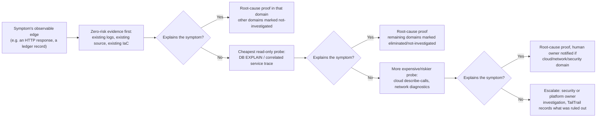

Rule: **never** attempt an expensive or risky probe (cloud describe calls,
live DB inspection, network diagnostics against anything resembling
production) before cheaper, zero-risk evidence (existing code, existing logs,
existing IaC source) has been checked and found insufficient.

Every domain's hypotheses live in the **same** hypothesis ledger
(Section 9.4), tagged with a `domain` field, so multi-domain causality (for
example "network retry policy *combined with* a code-level idempotency gap")
stays representable in one artifact instead of being split across
disconnected reports.

### 7.4 Domain classification at intake, and honest coverage reporting

Failure Intake (Phase 0, Section 6) is extended with a domain-classification
step: using Code Graph Mapper's language/IaC inventory plus any declared
architecture docs, the harness proposes a **ranked list of candidate
domains** — never a single confident guess. The intake report must track
three explicit buckets at all times:

- `domains_investigated` — evidence was gathered and a hypothesis reached a
  verdict (proven or eliminated)
- `domains_eliminated` — cheap evidence ruled the domain out without a deep
  probe
- `domains_not_investigated` — never touched, because a cheaper domain
  already explained the symptom, or investigation was out of authorized scope

A debug completion report (Section 9.6) must always show all three buckets.
This is a deliberate design choice to prevent false confidence — "root cause
proven" must never silently imply "every possible layer was checked."

### 7.5 Domain-aware confidence ceilings

Not every domain can reach the same proof rigor as Code. Reproducing a live
cloud autoscaling delay or a transient network partition safely and
deterministically is frequently infeasible, and security investigations
often cannot be "reproduced" without doing something unethical or
unauthorized. The confidence-state model (Section 8) therefore carries a
per-domain ceiling:

| Domain | Achievable ceiling without a human owner's sign-off |
| --- | --- |
| Code | `BehaviorRestored` (full loop) |
| Architecture | `BehaviorRestored`, via Architecture Fitness |
| Database | `RegressionValidated` — behavior restoration on shared data stores needs an owning-team sign-off |
| Cloud / infrastructure | `RootCauseProven` at most — correction is always a human-executed change |
| Security | `HypothesisSupported` at most — corrections always require a named security owner before any change |
| API integration | `RegressionValidated` — third-party behavior can't be unilaterally declared "restored" |
| Network | `RootCauseProven` at most — correction is always a human-executed change |

The Debug Completion Report (Section 9.6) must render the domain's ceiling
next to the achieved confidence state, so a `RootCauseProven` result on a
Cloud investigation is never visually confused with the fuller
`BehaviorRestored` result a Code investigation can reach.

### 7.6 Domain-specific safety additions (extends Section 12)

- Cloud, network, and security domains: TailTrail only **proposes** a change
  backed by read-only evidence; it never executes a mutating cloud API call,
  firewall change, IAM edit, or credential rotation itself. That execution is
  always a human action, logged as a `command-result` evidence event supplied
  by the human/owning system — never inferred.
- Security domain: diagnosis only. No generation of exploit payloads, no
  automated penetration/attack techniques, no use of credentials beyond the
  least privilege already granted for read-only inspection — consistent with
  this assistant's standing security policy.
- Database domain: experiments run against a read replica or `EXPLAIN`-only
  plans by default; any experiment touching the primary requires the same
  explicit escalation as a mutating cloud action.
- API integration domain: replay/experiment traffic must run against a
  recorded fixture or sandbox double, never live third-party production
  endpoints with real credentials, mirroring the existing payment-adapter
  safety boundary in the Section 6/20 worked example.

### 7.7 What this defers (and why that's honest, not a gap)

Full automated diagnosis of live distributed, cloud, network, and security
incidents is **explicitly out of scope for V1** (already reflected as DH-8 in
Section 16). Section 7's domain model exists so that when TailTrail *does*
touch those domains, it is honest about a lower reproducibility ceiling and
mandatory human ownership, rather than silently pretending code-level rigor
applies everywhere. Treating this as a deferred, clearly-labeled limitation —
rather than quietly ignoring it — is the intended answer to "this is an open
challenge": TailTrail's job is to be precise about what it proved, what it
only observed, and what it could not touch at all.

## 8. Confidence states (must stay separate from test pass/fail)

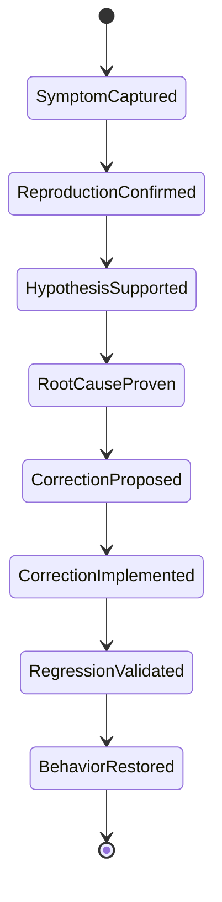

A test suite going green only ever advances state as far as
`RegressionValidated`. It can **never**, by itself, prove `RootCauseProven` —
that requires the hypothesis ledger's discriminating evidence. This
distinction is the harness's central value proposition and must be visible in
every report the harness produces (never collapse "tests pass" and "root
cause proven" into one status field).

## 9. Data model (native through DI-9; later-phase schemas remain planned)

All new schemas follow the existing TailTrail schema conventions found across
`schemas/*.schema.json`: a `$schema` draft reference, a `schema_version`
string, a `type` constant, `run_id`, ISO-8601 UTC timestamps, and — where the
artifact is meant to be immutable once approved — a `fingerprint` field.

### 9.1 `debug-intake.schema.json`

```json
{
  "$schema": "https://json-schema.org/draft/2020-12/schema",
  "schema_version": "1",
  "type": "tailtrail-debug-intake",
  "run_id": "string",
  "reported_symptom": "string",
  "attached_error": "string|null",
  "attached_command": "string|null",
  "reproduction_frequency": "always|intermittent|once|unknown",
  "safety_impact": "read-only|write|external-call|payment|pii|unknown",
  "known_vs_assumed": {
    "known": ["string"],
    "assumed": ["string"]
  },
  "likely_path": ["string"],
  "candidate_domains": ["code|architecture|database|cloud-infrastructure|security|api-integration|network"],
  "domains_eliminated": ["string"],
  "domains_not_investigated": ["string"],
  "created_at": "date-time"
}
```

### 9.2 `failure-fingerprint.schema.json`

```json
{
  "schema_version": "1",
  "type": "tailtrail-failure-fingerprint",
  "run_id": "string",
  "domain": "code|architecture|database|cloud-infrastructure|security|api-integration|network",
  "fingerprint": "sha256-hex",
  "symptom_hash": "sha256-hex",
  "stack_signature": ["string"],
  "entry_point": "string",
  "first_seen_at": "date-time",
  "matched_learning_ids": ["string"]
}
```

`matched_learning_ids` is how the harness queries `.tailtrail/learnings.md`
for a previously trusted recurring pattern, following the exact retrieval
rule already documented in [LEARNING-GOVERNANCE.md](LEARNING-GOVERNANCE.md)
(at most 3 matches, confidence-gated, never automatic below 60).

### 9.3 `reproduction-contract.schema.json`

```json
{
  "schema_version": "1",
  "type": "tailtrail-reproduction-contract",
  "run_id": "string",
  "domain": "code|architecture|database|cloud-infrastructure|security|api-integration|network",
  "max_achievable_confidence_state": "string",
  "status": "awaiting-approval|approved|rejected",
  "trigger": "string",
  "expected": "string",
  "actual": "string",
  "reproduction_method": "string",
  "preserve_rules": ["string"],
  "safety_boundary": "string",
  "revision": 1,
  "approved_at": "date-time|null"
}
```

Mirrors `change-intent-anchor.schema.json`'s `revision`/`approved_state`
pattern so the same anchor-freezing logic can be reused rather than
reimplemented.

### 9.4 `hypothesis-ledger.schema.json`

```json
{
  "schema_version": "1",
  "type": "tailtrail-hypothesis-ledger",
  "run_id": "string",
  "hypotheses": [
    {
      "hypothesis_id": "string",
      "domain": "code|architecture|database|cloud-infrastructure|security|api-integration|network",
      "statement": "string",
      "rank": "integer",
      "supporting_evidence": ["string"],
      "contradicting_evidence": ["string"],
      "next_experiment": "string|null",
      "status": "open|eliminated|proven"
    }
  ],
  "sequence": "integer"
}
```

### 9.5 `debug-experiment.schema.json` (append-only, same shape family as `execution-evidence.schema.json`)

```json
{
  "schema_version": "1",
  "type": "tailtrail-debug-experiment",
  "run_id": "string",
  "sequence": "integer",
  "hypothesis_id": "string",
  "action": "string",
  "deterministic": true,
  "outcome": "eliminates|strengthens|inconclusive",
  "evidence_boundary": "string"
}
```

### 9.6 `debug-completion-report.schema.json` (section consumed by `completion-report.schema.json`)

```json
{
  "schema_version": "1",
  "type": "tailtrail-debug-closure-section",
  "run_id": "string",
  "domain_confidence_ceiling": "string",
  "confidence_state": "symptom-captured|reproduction-confirmed|hypothesis-supported|root-cause-proven|correction-proposed|correction-implemented|regression-validated|behavior-restored",
  "root_cause_statement": "string|null",
  "correction_packet_ref": "string|null",
  "regression_tier": "string",
  "behavior_restored": "boolean",
  "domains_investigated": ["string"],
  "domains_eliminated": ["string"],
  "domains_not_investigated": ["string"],
  "debug_status": "pass|evidence-incomplete",
  "authority": "section-only"
}
```

The section deliberately has no `acceptance_state`. Canonical closure embeds
it and retains the existing acceptance vocabulary and learning gates, avoiding
a second delivery authority.

### 9.7 `diagnosis-domain-profile.schema.json`

```json
{
  "schema_version": "1",
  "type": "tailtrail-diagnosis-domain-profile",
  "domain": "code|architecture|database|cloud-infrastructure|security|api-integration|network",
  "evidence_sources": ["string"],
  "experiment_types": ["string"],
  "safety_default": "string",
  "correction_owner": "string",
  "max_achievable_confidence_state": "string"
}
```

One static profile per domain (Section 7.2/7.5), referenced by
`reproduction-contract.schema.json`'s `domain` field and rendered next to the
achieved `confidence_state` in the Debug Completion Report so a reader never
confuses a Cloud/Network/Security ceiling with a Code-domain full loop.

## 10. Persistence layout

Follows the existing `.tailtrail/runs/<run-id>/` convention, adding a
`debug/` subtree:

```
.tailtrail/runs/<run-id>/
  debug/
    intake/
      debug-intake-v1.json
    fingerprint/
      failure-fingerprint-v1.json
    reproduction/
      reproduction-contract-v1.json      # immutable once approved
    hypotheses/
      hypothesis-ledger.json             # updated in place, sequence-numbered
    experiments/
      debug-experiments.jsonl            # append-only
    correction/
      correction-packet-v1.json
    completion/
      debug-closure-section-v1.json
```

The debug run reuses the existing `run_id` identity and the same
`.tailtrail/workflows/<workflow-id>/` runtime state when it is promoted to a
`debug-investigation` workflow template, so pause/resume/cancel/replay work
without new runtime code.

## 11. CLI and MCP surface (native local CLI; full host convergence pending DI-11)

### CLI

```bash
tailtrail debug "<symptom>" [--error <file>] [--command "<cmd>"] [--run-id <id>] [--recent-change]
tailtrail debug reproduction approve --run-id <id> --revision <N> --approved
tailtrail debug reproduction reject  --run-id <id> --feedback '{"expected":"<reason>"}'
tailtrail debug hypothesis show      --run-id <id>
tailtrail debug experiment record    --run-id <id> --hypothesis-id <hid> --result <file> --approved
tailtrail debug replan               --run-id <id>            # after cycle-limit block
tailtrail debug correction approve   --run-id <id>
tailtrail debug completion-report    --run-id <id>
```

### MCP tools (extends `MCP-SERVER.md`'s existing R0/R2 tier model)

R0 read-only:

- `debug_intake_show(run_id)`
- `debug_reproduction_show(run_id)`
- `debug_hypothesis_ledger_show(run_id)`
- `debug_completion_report_show(run_id)`

R2 controlled (require `approved: true` + the exact active debug run):

- `debug_start(symptom, error=None, command=None, run_id=None)`
- `debug_reproduction_approve(run_id)`
- `debug_experiment_record(run_id, hypothesis_id, action, outcome, evidence_boundary)`
- `debug_correction_approve(run_id)`

These follow the same "never execute or reinterpret the command itself"
constraint already documented for `execution_evidence_record` — the harness
records host-reported outcomes; it does not run untrusted commands on the
model's behalf.

## 12. Guardrails and safety controls

Section 7.6 lists the domain-specific safety additions (cloud/security/DB/API
boundaries) on top of the general controls below.

Directly answering the risks named in [debug-intial.md](debug-intial.md),
each mapped to an enforceable control:

| Risk | Control |
| --- | --- |
| Agent invents a root cause from a stack trace | Root-cause proof requires a ledger row with discriminating evidence; a bare stack trace read alone cannot reach `RootCauseProven` |
| Excessive logging exposes secrets/customer data | Token Harness exactness classes apply to trace capture; `must-be-exact` only for the failing frame, never full request/response bodies containing PII/secrets |
| Broad repository scanning (token/latency overhead) | Reuses the existing Code Graph Mapper cache and freshness check instead of a fresh full-repo scan per debug run |
| Non-deterministic experiments produce false conclusions | Every experiment schema field `deterministic` must be true; non-deterministic actions are rejected at the schema level |
| Debug instrumentation leaks into production code | Correction packets are reviewed by Architecture Fitness before handoff; instrumentation-only changes are flagged, not silently merged |
| Fixing the symptom, not the shared cause | Correction packet must reference a `hypothesis_id` with `status: proven`; unlinked corrections are rejected |
| Endless hypothesis loops | Hard cycle limit triggers `InvestigationBlocked` -> mandatory diagnostic replan approval, never silent continuation |
| Modifying production state during reproduction | Reproduction contract's `safety_boundary` field is mandatory and enforced; external-call reproduction requires explicit escalation, off by default |
| Confusing correlation with causation | Ledger requires both supporting *and* contradicting evidence columns populated before a hypothesis can be marked `proven` |

Additionally, the Debug Harness inherits every safeguard already required by
[GUARDRAILS.md](GUARDRAILS.md) and the governance block synchronized across
[AGENTS.md](AGENTS.md)/[CLAUDE.md](CLAUDE.md)/`.github/copilot-instructions.md`:
no claiming tests passed without running them, no removing safeguards to
"simplify" a fix, exact preservation of diffs/commands/logs, and local policy
(`tailtrail-policy.md`) never weakens these rules.

## 13. Evidence, drift, and closure integration

- **Evidence kinds:** the existing five kinds in `execution-evidence.schema.json`
  (`source-edit`, `command-result`, `harness-result`, `drift-finding`,
  `ci-receipt`) are reused unchanged for the correction phase. The debug-only
  `debug-experiment` events (Section 9.5) live in their own append-only stream
  and are summarized — not duplicated — into `execution-evidence` once a
  correction packet is drafted, so closure tooling only ever reads one
  evidence contract at close time.
- **Drift control extension:** a new drift dimension, **investigation drift**,
  answers "is the agent still inside the approved reproduction contract's
  scope?" — the debug analogue of scope drift, evaluated the same way
  `change-intent-anchor.schema.json` evaluates scope drift for build runs.
- **Closure:** `tailtrail closure finalize` runs the same selected Harnesses
  (Architecture Fitness, Behaviour, Maintainability) against the correction,
  then `debug completion-report` emits `debug-completion-report.schema.json`
  instead of the generic build one, adding `confidence_state` and
  `root_cause_statement`.

## 14. Learning Governance integration

A debug run may propose a learning candidate only when:

1. Closure reached `accept-user` (trusted, evidence-backed), and
2. `confidence_state` reached `BehaviorRestored`, and
3. The candidate contains no secrets, PII, full prompts, or raw customer data
   (identical filter to today's capture rules), and
4. The candidate is reusable (recurring failure-pattern -> root-cause mapping,
   not a one-off).

The candidate is scored with the existing 0–100 confidence model and stored
through the existing `learn promote` path — no new storage format, no new
review command. This keeps a second bug of the same class recognizable via
`failure-fingerprint.schema.json`'s `matched_learning_ids` lookup on a future
debug run's intake.

## 15. Sequence view: end-to-end interaction

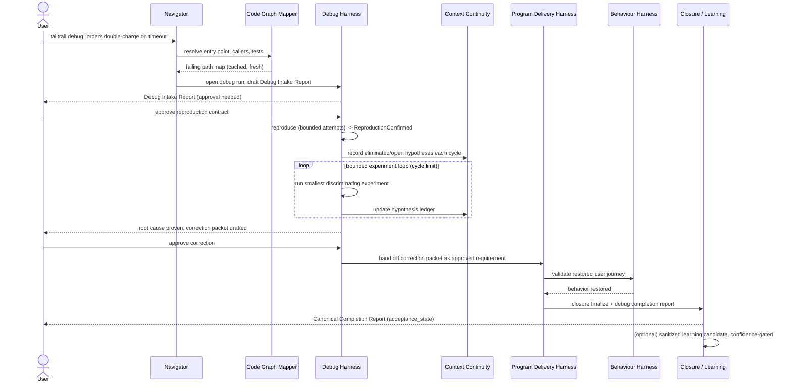

## 16. Phased delivery plan

Following the same committed-slice / conditional-phase pattern used in
[EVALUATION-HARNESS.md](EVALUATION-HARNESS.md):

| Phase | Scope | Status / gate |
| --- | --- | --- |
| **DH-0** | Debug Intake artifact + failure fingerprint; `tailtrail debug` read-only intake, no code changes | Prototype implemented |
| **DH-1** | Reproduction contract + approval gate; bounded reproduction attempts | Prototype implemented |
| **DH-2** | Code-path map reuse (Code Graph Mapper wiring, no new analysis engine) | Native DI-5 integration implemented |
| **DH-3** | Hypothesis ledger + bounded experiment loop + cycle-limit replan | Native DI-6 evidence, continuity, and Recovery/Replan integration implemented |
| **DH-4** | Root-cause proof gate + correction packet handoff to Program Delivery Harness | Native DI-7 scoped D-08 implementation handoff implemented |
| **DH-5** | Debug-specific closure section + confidence-state reporting | Native DI-9 canonical closure integration implemented |
| **DH-6 (conditional)** | Learning Governance integration (recurring failure-pattern capture) | Not connected; evidence-gated DI-10 |
| **DH-7 (conditional)** | MCP tool surface (`debug_*` R0/R2 tools) for host adapters | Partial prototype; host convergence pending DI-11 |
| **DH-8 (deferred)** | Production telemetry ingestion, distributed tracing, live-service debugging, IDE protocol integration, autonomous multi-agent debugging | Separate design doc/RFC — different risk class (live systems, secrets, blast radius), must not be folded into the committed slice |

Prototype V1 slice: **DH-0 through DH-5**. It demonstrates the local artifact
sequence without touching production systems, live telemetry, or multi-agent
orchestration. DI-1 through DI-9 now connect routing, authority, DWR, Harness
evidence, and canonical closure into one native delivery loop.

## 17. Testing and validation strategy for the harness itself

Consistent with TailTrail's existing pattern of testing its own harnesses
(e.g. `tests/test_behavior-harness.py`, `tests/test_architecture_fitness.py`):

- Schema validation tests for each new `*.schema.json` (structure, required
  fields, enum boundaries) — same style as existing schema tests.
- State-machine tests asserting illegal transitions are rejected (e.g. cannot
  reach `RootCauseProven` without at least one `proven` hypothesis row with
  both supporting and contradicting evidence populated).
- A synthetic "double-charge" fixture (matching the worked example in
  [debug-intial.md](debug-intial.md)) as the canonical end-to-end scenario
  test, reusable as an Evaluation Harness scenario per
  [EVALUATION-HARNESS.md](EVALUATION-HARNESS.md).
- A negative test proving that a weakened/bypassed test cannot advance
  `confidence_state` past `RegressionValidated`.
- Cycle-limit tests proving `InvestigationBlocked` fires and requires
  explicit replan approval rather than looping indefinitely.
- Enterprise registry disposition entries for every new script/test file,
  per this repository's own untracked-file governance
  (`enterprise-closure-registry.json`).

## 18. Success metrics

| Metric | What it demonstrates |
| --- | --- |
| % of debug runs reaching `RootCauseProven` vs. only `RegressionValidated` | Whether the harness is actually preventing symptom-only fixes |
| Reproduction confirmation rate on first contract | Quality of intake and Code Graph Mapper grounding |
| Cycle count to root-cause proof | Efficiency of hypothesis ranking |
| Recurring-pattern hit rate via `matched_learning_ids` | Value of Learning Governance integration over time |
| Correction reopen rate after Behaviour Harness validation | Whether "proven" causes actually restore the real journey |
| Token/log volume per debug run vs. an unstructured agent debugging session | Token Harness effectiveness at bounding trace capture |
| % of multi-domain incidents where `domains_not_investigated` is non-empty but disclosed | Whether the harness stays honest about coverage instead of implying full-stack certainty |

## 19. Open risks and questions

- **Reproduction feasibility for flaky/intermittent failures** — the contract
  model assumes a deterministic reproduction is achievable; a bounded
  "best-effort intermittent" mode may be needed rather than blocking forever.
- **Cross-service/distributed failures** are explicitly out of scope for V1
  (DH-8, deferred) but are the most common real-world "I don't understand
  this codebase" case — worth an early follow-up design once V1 ships.
- **Domain classification accuracy** — Section 7.4's candidate-domain ranking
  is only as good as Code Graph Mapper's IaC/language inventory; a repo with
  undeclared or externally-hosted infrastructure will under-detect Cloud and
  Network domains, and the harness must fail closed (report "unknown" scope)
  rather than assume Code is the only relevant domain.
- **Who has authority to approve Cloud/Security/Network experiments** — even
  read-only describe calls may need scoped credentials TailTrail's local
  context does not have; the harness must degrade to "cannot investigate this
  domain without access to X" instead of fabricating evidence.
- **Cycle-limit tuning** — a fixed default (e.g. 5) may be wrong for very
  large or very small investigations; likely needs to be configurable per
  `tailtrail-policy.md`, consistent with how other bounded controls are
  already made locally configurable.
- **Correction packet vs. full Program Delivery Harness overhead** — for a
  one-line proven fix, routing through the full Program Delivery pipeline may
  be disproportionate; DH-4 should confirm the "small-change" workflow
  template is reused rather than always the heavier `delivery` template.
- **Who owns the "expected behavior" when it's ambiguous** — same rule as
  everywhere else in TailTrail: only a human approves a changed desired
  state; the harness must never let the agent redefine "expected" mid-loop.

## 20. Worked example (from debug-intial.md, expanded)

```
User: tailtrail debug "Orders sometimes charge twice when payment times out"

Debug Intake Report
  Failure understood: partial
  Reproduction: not yet confirmed
  Likely path: API -> order service -> payment adapter -> repository
  Safety boundary: no external payment call
  Next investigation: reproduce timeout-after-acceptance locally
  Approval needed: allow the proposed read-only investigation

[user approves]

Reproduction Contract (approved)
  Trigger: payment gateway times out after accepting the charge
  Expected: one charge and one order
  Actual: retry creates a second charge
  Reproduction: integration test with timeout-after-acceptance adapter double
  Preserve: successful order creation remains unchanged
  Safety boundary: no real payment provider calls

Hypothesis Ledger
  H1 retry lacks idempotency key      -> proven (both payment calls traced, no key sent)
  H2 repository saves too late        -> eliminated (order state present at retry time)
  H3 client retries twice             -> eliminated (single request correlation ID observed)

Root cause proven: H1 — retry path omits an idempotency key on the payment adapter call.

Correction packet -> Program Delivery Harness (small-change template)
  Architecture Fitness: fit (fix lands in payment adapter, correct layer)
  Behaviour Harness: user journey "checkout with timeout" restored
  Regression tier: integration (payment adapter + order service)

Debug Completion Report
  confidence_state: behavior-restored
  debug_status: pass
  authority: section-only
Canonical Completion Report
  overall_status: complete
  acceptance_state: accept-user
  learning candidate: "idempotency key required on retried payment calls" (confidence 84, trusted)
```

## 21. Native TailTrail integration plan

### 21.1 What is integrated and what remains

The current Debug Harness is a working local prototype. Its intake,
fingerprint, reproduction contract, hypothesis ledger, bounded experiments,
correction packet, confidence ceilings, CLI commands, MCP foundations, and
focused tests are implemented. That does **not** yet make it a fully blended
TailTrail workflow.

DI-0 through DI-10 now provide registry ownership, native Navigator routing,
the canonical Debug Start Plan, versioned reproduction approval and anchor,
the ten-stage `debug-investigation` Durable Workflow Runtime, and versioned
D-03 project orientation backed by freshness-checked Code Graph evidence.
The hypothesis loop now binds deterministic probes to exact saved evidence,
prevents unchanged repeats, and preserves exhausted cycles for replan.
DI-7 through DI-9 now provide the scoped implementation handoff, typed selected
Harness convergence, and the canonical closure bridge. `debug-completion.py`
is a section-only evidence producer and cannot approve delivery. DI-10 adds the
exact/local versus sanitized/portable privacy split, canonical Token Harness
exactness, continuity deduplication, and acceptance-gated candidate learning.
Remaining gaps begin with DI-11/DI-12 host and release conformance.

The integration must preserve the working domain engine and connect it to the
existing control plane. It must not create a second Navigator, requirements
system, execution authority model, workflow runtime, drift system, closure
authority, or learning pipeline.

### 21.2 Target end-to-end workflow

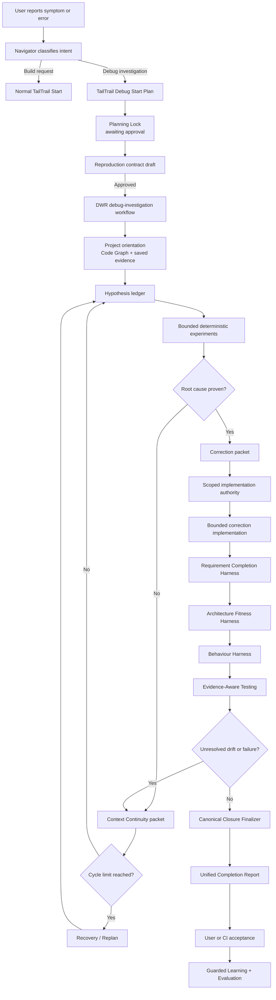

### 21.3 Canonical ownership contract

| Information or decision | Canonical owner | Debug Harness responsibility |
| --- | --- | --- |
| Build-versus-debug classification | Navigator | Supplies debug-specific classification signals only |
| Target identity and planning state | Planning Lock | Supplies symptom, unknowns, and reproduction proposal |
| Reproduction boundary | Debug Harness | Owns the versioned reproduction contract |
| Workflow stages and resume state | Durable Workflow Runtime | Supplies the `debug-investigation` template and stage inputs |
| Hypotheses and experiments | Debug Harness | Owns hypothesis state and evidence-linked experiment results |
| Command and Harness receipts | Execution Evidence | References existing exact saved events; never fabricates results |
| Correction scope | Requirement Completion Harness | Converts a proven cause into a bounded correction proposal |
| Architecture/behaviour/maintainability checks | Existing Harness lenses | Supplies root-cause and correction context |
| Drift and correction cycles | Harness checkpoint + Context Continuity | Supplies debug-cycle deltas and eliminated hypotheses |
| Final delivery status | Canonical Completion Report | Contributes a debug investigation section |
| Learning and evaluation | Learning Governance + Evaluation Harness | Contributes sanitized candidate evidence after trusted acceptance |

### 21.4 Implementation phases

#### Phase DI-0 — Contract and status reconciliation — implemented

**Goal:** make the repository state honest before runtime integration.

Implementation:

- Mark the registry feature `prototype-implemented` until the canonical
  closure path is complete.
- Record the ownership table above in the registry/design contract.
- Separate implemented prototype capabilities, integration work, deferred
  diagnosis domains, and live-system future scope.
- Remove or qualify statements that currently imply DWR, canonical closure,
  Token Harness, recovery, or governed learning are already connected.

Likely files:

- `DEBUG-HARNESS.md`
- `tailtrail-registry.json`
- `ROADMAP.md`
- `TAILTRAIL-COMMANDS.md`
- `enterprise-closure-registry.json`

Completion proof:

- Documentation and registry status agree with executable behavior.
- Each authoritative field has exactly one owner.

Implementation record (2026-08-29):

- Kept the Feature Registry's packaging status as `implemented` so the working
  prototype remains installable, and added the orthogonal integration status
  `prototype-implemented` so packaging availability is not confused with
  native workflow completion.
- Added a machine-readable integration contract containing implemented local
  capabilities, remaining integration, deferred diagnosis domains, future
  live-system scope, and one canonical owner for each authoritative state.
- Reconciled this document, the Roadmap, command catalog, and enterprise
  exception declaration with that boundary.
- Added focused contract tests that fail if the Debug Harness returns to an
  unqualified integrated claim or loses a canonical owner.

#### Phase DI-1 — Native Navigator classification — implemented

**Goal:** make Navigator—not the CLI wrapper—the workflow router.

Implementation:

- Add `debug-investigation` to Navigator's typed workflow decisions.
- Distinguish a symptom-first investigation from an already-understood
  implementation request.
- Preserve explicit `--debug` and `--build` overrides.
- Default ambiguous requests to the normal build workflow while showing the
  debug alternative.
- Return the classification reason, known symptom, unknown evidence, selected
  features, deferred features, and approval posture in Navigator output.
- Reduce `scripts/tailtrail.py` to delegation; it must not maintain a competing
  intent classifier.

Examples:

| User wording | Expected route |
| --- | --- |
| `Fix payment retry logic` | Build workflow |
| `Payments are sometimes charged twice after timeout` | Debug investigation |
| `Investigate why cancellation publishes two events` | Debug investigation |
| `Add cancellation validation` | Build workflow |
| Ambiguous failure wording | Build by default; show debug alternative |

Implementation record (2026-08-29):

- Added the immutable `WorkflowClassification` decision contract to
  `scripts/navigator_core.py`; it owns workflow type, reason code and prose,
  known symptom, missing evidence, selected/deferred feature posture,
  approval posture, and the optional alternative route.
- Moved all phrase and ambiguity rules into Navigator core. The CLI retains a
  compatibility projection only and delegates explicit `--debug`, explicit
  `--build`, `--error`, and `--command` signals to the native classifier.
- Added `debug-investigation` to normal `navigator.decide()` output and made
  debug-specific selected/deferred controls visible in Navigator Markdown.
- Kept ambiguous `fix`, `issue`, `bug`, `failure`, and `problem` wording on the
  normal build route unless a concrete symptom, reproduction command, failure
  artifact, or explicit debug override exists.
- Added focused regression coverage for strong symptom routing, ordinary build
  work, ambiguous build fallback, investigation wording, evidence flags,
  explicit overrides, compatibility forwarding, and typed Navigator output.

Files changed for DI-1:

- `scripts/navigator_core.py`
- `scripts/navigator.py`
- `scripts/navigator_render.py`
- `scripts/tailtrail.py`
- `tests/test_navigator_debug_routing.py`
- `tailtrail-registry.json`
- `DEBUG-HARNESS.md`
- `ROADMAP.md`

Boundary retained: DI-1 decides the workflow but does not yet replace the
prototype Debug Intake response with the canonical Debug Start Plan. Planning
Lock rendering and persistence remain DI-2.

Likely files:

- `scripts/navigator.py`
- `scripts/navigator_core.py`
- `scripts/navigator_render.py`
- `scripts/task-start.py`
- `scripts/tailtrail.py`
- `tests/test_navigator_debug_routing.py`
- new `tests/test_debug_start_planning.py`

Completion proof:

- CLI, MCP, and host adapters receive the same saved Navigator decision.
- No debug routing logic can disagree with Navigator.

#### Phase DI-2 — Canonical Debug Start Plan — implemented

**Goal:** keep `tailtrail start` planning-only for debug requests.

The report must include:

- Planning Lock and run ID;
- workflow type and classification evidence;
- known symptom and material unknowns;
- target identity and likely scope from saved Code Graph evidence;
- selected and deferred TailTrail features;
- proposed reproduction questions;
- intended evidence tiers and safety boundary;
- token estimate and exactness posture; and
- explicit approval options.

Opening the plan may create only run-local planning metadata. It must not run
tests, scan the repository, approve a reproduction contract, approve source
writes, or edit code.

Likely files:

- `scripts/task-start.py`
- `scripts/planning-lock.py`
- `scripts/debug-intake.py`
- `scripts/navigator_render.py`
- `schemas/debug-intake.schema.json`
- host Start instructions and `skills/tailtrail-start/SKILL.md`

Completion proof:

- The report satisfies the same mandatory Start sections as build planning.
- The complete report is rendered outside host tool-result dropdowns.
- No implementation authority exists before a later explicit approval.

Implementation record (2026-08-29):

- `tailtrail start` now always delegates to `task-start.py`; the CLI no longer
  opens Debug Intake as a classification side effect.
- Added `--debug`, `--build`, `--error`, and `--command` planning inputs to the
  canonical Start parser. Error/command values are not copied into the saved
  plan; only their presence is retained as sanitized classification evidence.
- Added a persisted debug planning payload and renderer with Planning Lock/run
  ID, target identity, classification reason, symptom, unknowns, saved-only
  Code Graph scope, one investigation requirement, selected/deferred controls,
  reproduction questions, evidence tiers, token estimate, exactness/safety
  posture, guided-delivery boundary, and approval options.
- Debug Start reads only an existing graph-cache artifact when available and
  labels it `saved-unverified`; it does not hash current source, refresh the
  cache, execute the mapper, or infer freshness during Planning Lock.
- DWR is explicitly `deferred-to-di-4`; approval authority for reproduction
  remains DI-3. DI-2 creates neither workflow execution authority nor
  `.tailtrail/runs/<run-id>/debug/` artifacts.
- Generic `planning activate` fails closed for a saved Debug Start Plan until
  DI-3 supplies the reproduction-contract transition; it cannot accidentally
  convert Debug Start approval into normal implementation authority.
- Updated Codex, Copilot, Claude, and TailTrail Start skill instructions to
  require the complete `# TailTrail Debug Start Plan` outside collapsed output.
- Extended the atomic MCP `tailtrail_start` schema with one build/debug override
  and sanitized evidence-presence booleans; it delegates to the same
  `task-start.py` path and never transports raw error or command content.
- Added focused tests for plan-only construction, canonical persistence,
  mandatory headings, sanitized evidence flags, explicit build override,
  saved graph reuse, public CLI output, and absence of Debug Intake.

Files changed for DI-2:

- `scripts/task-start.py`
- `scripts/tailtrail.py`
- `scripts/navigator.py`
- `scripts/planning-lock.py`
- `scripts/mcp-server.py`
- `MCP-SERVER.md`
- `tests/test_debug_start_planning.py`
- `skills/tailtrail-start/SKILL.md`
- `AGENTS.md`, `CLAUDE.md`, `.github/copilot-instructions.md`, and
  `adapters/copilot-instructions.md`
- `tailtrail-registry.json`
- `DEBUG-HARNESS.md`
- `ROADMAP.md`

#### Phase DI-3 — Reproduction approval and anchor bridge — implemented

**Goal:** make the reproduction contract the debug analogue of an approved
requirement anchor without conflating investigation approval with correction
approval.

Flow:

1. Approve the Debug Start Plan.
2. Draft the reproduction contract from approved planning evidence.
3. Allow read-only discussion, clarification, and revision through Interactive
   Plan Mode.
4. Approve a specific reproduction revision.
5. Freeze an investigation requirement UID and validation contract.
6. Create the DWR workflow proposal and execution handoff for investigation
   actions only.

Example approved investigation requirement:

```json
{
  "requirement_uid": "req-debug-<stable-id>",
  "kind": "debug-investigation",
  "statement": "Prove the root cause of duplicate payment effects after timeout.",
  "preserve_rules": [
    "Successful single-attempt payment remains unchanged.",
    "No real payment provider may be called."
  ],
  "validation_contract": {
    "tiers": ["integration", "behaviour"]
  }
}
```

Likely files:

- `scripts/debug-reproduction.py`
- `scripts/planning-lock.py`
- `scripts/change-intent-anchor.py`
- `scripts/planning-discussion.py`
- `scripts/planning-revision.py`
- reproduction and anchor schemas

Completion proof:

- Reproduction rejection preserves the same run and collects field-specific
  feedback.
- Reproduction approval never silently approves a future correction.
- The approved revision, requirement UID, and evidence contract remain stable.

**Implemented design:**

- Activating a canonical Debug Start Plan records `debug-plan-only` approval,
  keeps `writes_allowed: false`, and drafts reproduction revision 1 from saved
  planning evidence only. Unknown expected behaviour and reproduction steps
  remain explicitly unresolved instead of being guessed.
- Every revision is saved under
  `.tailtrail/runs/<run-id>/debug/reproduction/draft-v<N>.json`. Approval names
  the exact current revision and fails when any field is unresolved or stale.
- The requirement UID is created with the first draft and remains stable across
  revisions, including revisions that refine the trigger or reproduction
  command. A caller cannot replace that identity by supplying a different UID.
  The immutable identity continues through the approved reproduction, anchor,
  investigation handoff, evidence, drift, and closure.
- `tailtrail debug reproduction show` renders a concise approval report by
  default. It shows run/revision identity, the observable failure boundary,
  before-fix and after-fix expectations, preserve rules, and the exact
  approval phrase. Automation can request the unchanged machine contract with
  `tailtrail debug reproduction show --format json`.
- The report deliberately separates three proof states: **failure
  reproduced**, **root cause proven**, and **behavior restored**. A failing
  reproduction is not causal proof, and causal proof is not post-correction
  validation. Before investigation all three remain `not run`.
- Validation contracts may record deterministic pre-fix and post-fix exit
  codes and observable output. For example, a duplicate-effect fixture can
  require exit `1` plus `charge_count=2` before correction, then exit `0` plus
  `charge_count=1` after correction.
- The approved anchor uses kind `debug-investigation` and retains the approved
  reproduction, root-cause, regression, and behaviour evidence tiers.
- The Planning Lock becomes `debug-investigation-only`: evidence may be
  recorded, but `source_writes_allowed` remains false. MCP patch enforcement
  checks this narrower authority and fails closed.
- The handoff allows approved-scope reading, the exact reproduction, evidence
  recording, and hypothesis management. It forbids source edits, corrections,
  commits, pushes, deployments, production calls, and implied correction
  approval.

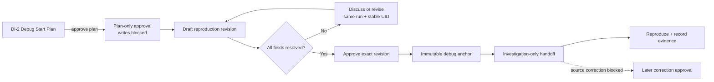

Implemented files include `scripts/debug-reproduction.py`,
`scripts/planning-lock.py`, `scripts/change-intent-anchor.py`,
`scripts/mcp-server.py`, both DI-3 schemas, and focused Debug Start/Harness
tests.

#### Phase DI-4 — Durable Workflow Runtime template

**Status: implemented.**

**Goal:** implement debugging as a native resumable workflow.

Required `debug-investigation` stages:

```text
D-01 Intake
D-02 Reproduction
D-03 Project orientation
D-04 Hypothesis generation
D-05 Experiment
D-06 Root-cause proof
D-07 Correction proposal
D-08 Correction implementation
D-09 Regression validation
D-10 Closure
```

The workflow must support pause, resume, cancel, replay, freshness checks,
cycle tracking, scoped approvals, and task-specific execution authority. The
workflow journal is canonical; debug artifacts are projections linked to its
stage and requirement identifiers.

Likely files:

- `scripts/workflow_runtime/templates.py`
- `scripts/workflow_runtime/compiler.py`
- `scripts/workflow_runtime/state.py`
- `scripts/workflow_runtime/approvals.py`
- `scripts/workflow_runtime/resume.py`
- `scripts/workflow_runtime/correction.py`
- workflow schemas and tests

Completion proof:

- `tailtrail workflow current` displays the exact debug stage.
- Resume returns the shortest safe next action.
- Replay reconstructs the same state from the journal.
- Stale reproduction/source evidence blocks further experiments.

Implementation reuses the existing DWR journal as the only lifecycle owner.
Approval of an exact reproduction revision now compiles and activates the
`debug-investigation` template automatically. It grants one hash-bound
investigation approval for D-01 through D-07; D-08 remains a separate
correction gate, and D-09/D-10 require factual validation and closure evidence.

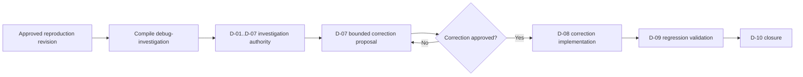

The runtime exposes both the stable machine stage ID and its exact display
name, for example `d-05-experiment` / `D-05 Experiment`. Pause, resume, cancel,
replay, correction-cycle tracking, and shortest-safe resume use the existing
DWR controls. Operational checkpoints now fingerprint the approved debug
reproduction artifact. A changed reproduction contract invalidates D-02 and
all downstream stages; changed approved source scope invalidates orientation
and downstream work. Typed debug adapters refuse preparation when their stage
is affected by stale operational evidence.

Implemented files:

- `scripts/workflow_runtime/templates.py` — deterministic ten-stage graph.
- `scripts/workflow_runtime/adapter_catalog.py` — typed debug stage adapters.
- `scripts/workflow_runtime/start_integration.py` — reproduction-to-DWR bridge
  and D-01..D-07 investigation authority.
- `scripts/debug-reproduction.py` — automatic runtime activation in the
  canonical investigation handoff.
- `scripts/workflow_runtime/state.py` — exact stage display projection.
- `scripts/workflow_runtime/freshness.py` and freshness schemas — reproduction
  and debug-stage invalidation.
- compiler/handoff schemas, deterministic fixture, and focused runtime tests.

This phase does not implement DI-6 hypothesis-loop convergence, source
correction itself, or canonical debug closure. It supplies
their durable stages and authority boundaries without claiming those later
capabilities are complete.

#### Phase DI-5 — Project orientation and Code Graph integration

**Status: implemented.**

**Goal:** reuse fresh graph evidence and avoid silent broad rescans.

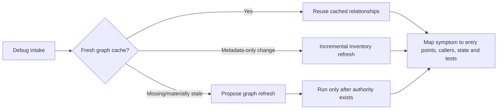

The orientation artifact must distinguish confirmed paths, heuristic
candidates, stale graph evidence, missing callers, tests, endpoints, database
boundaries, external dependencies, and unsupported domains.

Likely files:

- `scripts/debug-intake.py`
- `scripts/code-graph-mapper.py`
- `scripts/code_graph_inventory.py`
- `scripts/graph-learning.py`
- new `schemas/debug-orientation.schema.json`

Completion proof:

- A fresh cache is reused automatically.
- New/untracked files update or invalidate relevant relationships.
- No full graph refresh happens during the Planning Lock.

DI-5 reuses `code-graph-mapper.py` and `code_graph_inventory.py`; it does not
introduce another repository scanner. After the reproduction revision and
native debug handoff exist, `debug orientation create` writes a versioned local
projection linked to the same run ID, workflow ID, D-03 stage ID, reproduction
revision, and stable requirement UID.

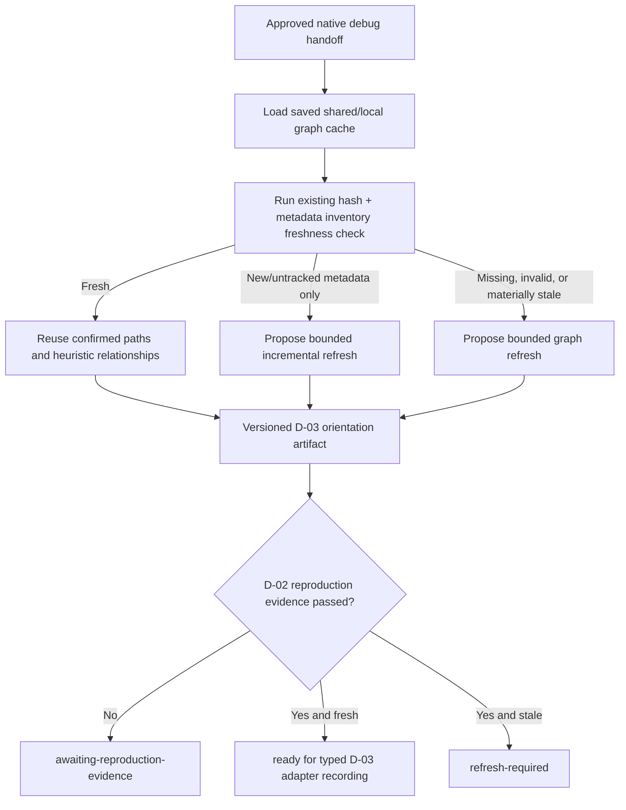

The artifact separates evidence deliberately:

| Orientation data | Evidence label | Meaning |
| --- | --- | --- |
| Existing cache path plus matching saved SHA-256 | `confirmed-local-path-and-hash` | The exact local file still matches the graph cache; behavior is not proven. |
| Read order, callers, tests, endpoints, tables, service edges, manifests | `heuristic` | Local mapper relationship hints that must be confirmed against exact source. |
| Unsupported domain list | explicit boundary | Cloud infrastructure, network, and security diagnosis remain outside this release. |
| Refresh proposal | approval required | TailTrail provides the exact bounded command but never executes it during orientation. |

New and untracked relevant files are detected through the existing
`path-size-mtime-ns-v1` repository inventory. An inventory-only mismatch yields
an `incremental` refresh proposal; changed/missing hashed files, incompatible
cache data, or absent scope yields a bounded refresh proposal. Re-running
orientation after an approved external graph refresh creates the next artifact
revision and retains the earlier orientation for review.

Implemented files:

- `scripts/debug-orientation.py` — cache selection, freshness reuse,
  evidence-labelled normalization, versioning, and adapter handoff.
- `schemas/debug-orientation.schema.json` — closed orientation contract.
- `scripts/tailtrail.py` — `debug orientation create|show` CLI route.
- `scripts/mcp-server.py` — `debug_orientation_show` and approval-gated
  `debug_orientation_create` tools.
- `scripts/run-ledger.py` — append-only `debug_orientation_recorded` event.
- `tests/test_debug_orientation.py` — fresh reuse, new/untracked-file
  invalidation, versioning, schema, and missing-handoff coverage.
- Feature Registry, enterprise closure registry, command reference, roadmap,
  and MCP documentation.

The D-03 adapter handoff is prepared but not self-recorded: the host/runtime
must still record the factual typed adapter result and advance the stage under
existing DWR controls. DI-5 does not parse source bodies, execute the proposed
refresh, prove a caller relationship, generate hypotheses, or claim root cause.

#### Phase DI-6 — Evidence-driven bounded hypothesis loop

**Implementation status:** implemented.

**Goal:** connect hypotheses to exact execution evidence, continuity, drift,
and recovery controls.

Every experiment must carry:

```json
{
  "hypothesis_id": "HYP-02",
  "requirement_uid": "req-debug-<stable-id>",
  "action": "Run timeout-after-acceptance adapter test",
  "expected_signal": "Two calls use different idempotency keys",
  "outcome": "strengthens",
  "evidence_event_id": "evt-<id>",
  "failure_fingerprint": "sha256:<digest>",
  "cycle": 2
}
```

Loop rules:

- Default to three experiment cycles, configurable within bounded policy.
- Reject an identical experiment against the same unchanged failure
  fingerprint.
- Record strengthened, eliminated, unchanged, regressed, and new-drift states.
- Update Context Continuity after inconclusive or failed experiments.
- On cycle exhaustion, enter Recovery/Replan while preserving the reproduction
  contract, evidence, eliminated hypotheses, and prior mistakes.
- Never let a hypothesis silently redefine expected behavior.

Likely files:

- `scripts/debug-hypothesis.py`
- `scripts/execution-evidence.py`
- `scripts/context-continuity.py`
- `scripts/execution-failure.py`
- `scripts/harness-checkpoint.py`
- `scripts/workflow_runtime/correction.py`

Completion proof:

- Every outcome points to a real saved execution event.
- Duplicate loops are prevented deterministically.
- Replan resumes the same investigation rather than erasing history.

DI-6 upgrades the original local hypothesis prototype without creating another
debug engine. The canonical experiment record now carries the reproduction's
stable `requirement_uid` and sanitized failure fingerprint, a discriminating
`expected_signal`, the exact Execution Evidence fingerprint, and the active
cycle number. The default budget is three experiments per cycle. The old
`inconclusive` input remains a compatibility alias but is persisted as the
more precise `unchanged` state.

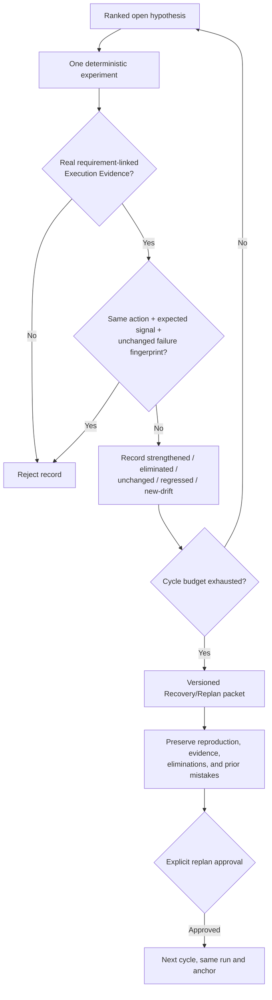

For `unchanged`, `regressed`, and `new-drift` outcomes, TailTrail also renders
a bounded Context Continuity packet. Failure to render that supporting packet
is reported as unavailable and never changes the factual experiment outcome.
On exhaustion, `recovery-replan-vN.json` retains all hypothesis states,
experiment references, and failed/repeated approaches. Replan increments the
cycle but does not delete the ledger, reset the approved reproduction, clear
eliminated alternatives, or manufacture new evidence.

Implemented files and surfaces:

- `scripts/debug-hypothesis.py` — requirement/failure identity, precise
  outcomes, duplicate fingerprints, continuity, three-cycle gate, and replan.
- `schemas/hypothesis-ledger.schema.json` and
  `schemas/debug-experiment.schema.json` — closed DI-6 contracts.
- `scripts/mcp-server.py` — controlled experiment input includes an explicit
  expected signal and all DI-6 outcome classes.
- `tests/test_debug_hypothesis_integration.py` — duplicate, identity,
  continuity, exhaustion, preservation, and same-run resume proof.

#### Phase DI-7 — Correction-to-implementation bridge

**Implementation status:** implemented.

**Goal:** turn a proven cause into the smallest normal TailTrail implementation
slice.

A correction packet must contain:

- the proven root cause and supporting/eliminating evidence;
- affected requirement UID;
- expected changed files and symbols;
- preservation rules and architecture constraints;
- focused validation tiers and behaviour scenarios;
- rollback/recovery boundary; and
- unresolved assumptions.

Correction approval creates scoped implementation authority. It must not claim
that implementation, tests, Harnesses, or closure have already happened.

Likely files:

- `scripts/debug-correction.py`
- `scripts/requirement-impact-map.py`
- `scripts/requirement-completion.py`
- `scripts/workflow_runtime/task_scope.py`
- `scripts/workflow_runtime/approvals.py`
- `scripts/git-readiness.py`
- `schemas/debug-correction-packet.schema.json`

Completion proof:

- Actual changed files are compared with the approved correction scope.
- Unjustified expansion is recorded as drift.
- Dependencies, recovery, publishing, and deployment retain separate authority.

DI-7 replaces the prototype's sentence-only correction approval with a closed,
fingerprinted implementation contract. A proposal is linked to the same run,
workflow, requirement UID, failure fingerprint, proven hypothesis, supporting
evidence, and eliminated alternatives. It carries approved file and symbol
scope, preservation rules, architecture constraints, validation tiers,
behaviour scenarios, Git readiness posture, and unresolved assumptions.

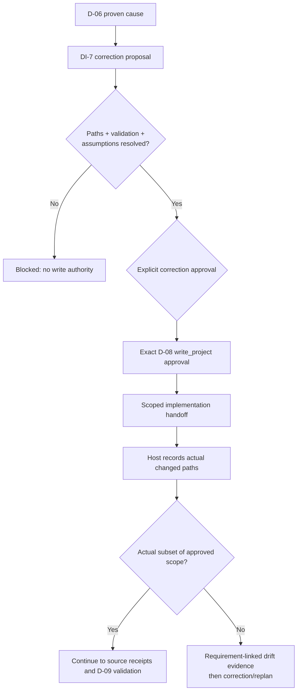

Approval does not edit a file or imply that implementation occurred. The DWR
approval ledger records only `d-08-correction-implementation`, action class
`write_project`, and operation kind `fix-application` against the exact packet.
It does not authorize a dependency, test/build, scanner, Git mutation,
publishing, deployment, merge, or closure. Git readiness is read-only: a clean
repository selects Mode A posture; otherwise the packet requires the existing
task-scoped Mode B recovery boundary.

After edits, `debug correction scope-check --changed ... --approved` compares
actual paths with the immutable correction scope. Unexpected paths produce a
requirement-linked `drift-finding`; an in-scope result produces a factual
Harness receipt. Neither result edits, reverts, stages, or validates code.

Implemented surfaces:

- `scripts/debug-correction.py` — proposal, exact approval/handoff, recovery
  posture, requirement impact map reuse, and scope/drift comparison.
- `schemas/debug-correction-packet.schema.json` — closed DI-7 packet contract.
- `scripts/mcp-server.py` — controlled proposal, approval, and scope-check
  tools; none executes project work.
- `tests/test_debug_correction_integration.py` — authority, schema, incomplete
  scope, preservation boundary, and drift coverage.

#### Phase DI-8 — Harness convergence

**Implementation status:** implemented.

**Goal:** use existing TailTrail Harnesses to judge the correction.

| Trigger | Selected control |
| --- | --- |
| Every approved correction | Requirement Completion Harness |
| Caller, layer, API, schema, or database impact | Architecture Fitness Harness |
| User-visible journey or externally observable effect | Behaviour Harness |
| Refactor, duplication, workaround, or scope growth | Maintainability Harness |
| Unit/integration/contract/E2E proof | Evidence-Aware Testing |
| Unexpected files, symbols, requirements, or behavior | Drift Control |
| Repeated failure or inconclusive loop | Context Continuity Harness |
| Unsafe rollback or overlapping work | Safe Git Recovery |

The current string check for a `harness-result` containing `restored` must be
replaced by typed, requirement-linked Harness assessments. Missing selected
Harness evidence must remain `evidence-incomplete`.

Likely files:

- `scripts/harness-review.py`
- `scripts/architecture-fitness.py`
- `scripts/behavior-harness.py`
- `scripts/maintainability-harness.py`
- `scripts/testing-profile.py`
- `scripts/closure-finalizer.py`

Completion proof:

- Debug confidence cannot advance from an arbitrary textual label.
- Requirement and Harness statuses are visible per requirement ID.

DI-8 adds one debug-specific convergence projection over existing Harness
owners. It does not duplicate their analysis. Selection is deterministic:
Requirement Completion, Evidence-Aware Testing, and Drift are always required;
Architecture, Behaviour, Maintainability, Context Continuity, and Safe Git
Recovery are selected from the approved correction's domain, scope, scenarios,
intent, loop history, and recovery posture.

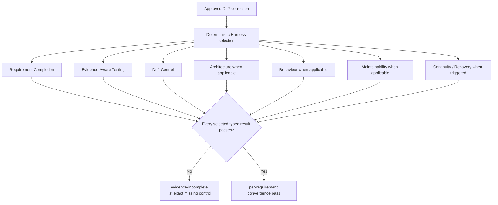

The finalizer runs only the existing deterministic local Architecture Fitness
and Maintainability assessments. It consumes saved Execution Evidence,
DI-7 scope checks, typed Behaviour assessments, Continuity state, and Recovery
Boundary artifacts. It never runs a project command or invents a behaviour
scenario. A plain `harness-result` string containing words such as `restored`
is ignored for Behaviour confidence.

The convergence artifact exposes `selected_controls`, `control_results`, and
`requirement_results`. Missing evidence remains `required-evidence-missing`;
unexpected scope remains `drift-unresolved`; overall state stays
`evidence-incomplete`. Debug completion now requires this typed convergence and
a requirement-linked Behaviour pass before reaching `behavior-restored`.

Implemented surfaces:

- `scripts/debug-harness-convergence.py` — selection, typed evidence
  convergence, per-requirement results, and bounded next action.
- `schemas/debug-harness-convergence.schema.json` — closed DI-8 contract.
- `scripts/debug-completion.py` — consumes convergence instead of textual
  `restored` matching.
- CLI `debug convergence select|finalize|show` and corresponding read-only /
  approval-gated MCP tools.
- `tests/test_debug_correction_integration.py` and `test_debug_harness.py` —
  arbitrary-text rejection, incomplete evidence, typed behaviour, and complete
  convergence coverage.

#### Phase DI-9 — Canonical closure and Completion Report

**Status: implemented (2026-08-30).**

**Goal:** remove parallel closure authority.

`tailtrail closure finalize` must consume the debug intake, reproduction,
hypotheses, experiments, correction, changed scope, Harness results, drift,
failures, and token posture. `debug-completion.py` becomes a debug-section
producer, not the final delivery authority.

The unified report must show:

| Debug control | Example status | Required evidence |
| --- | --- | --- |
| Symptom captured | pass | intake + sanitized fingerprint |
| Reproduction | pass | approved reproduction revision |
| Root cause | proven | supported hypothesis + eliminated competitor |
| Correction | implemented | approved scope + source-edit receipts |
| Regression | pass | requirement-linked computational receipts |
| Behaviour restored | pass | typed Behaviour Harness result |
| Drift | none unresolved | final checkpoint |

It must also retain normal TailTrail requirement completion, architecture,
maintainability, recovery, token, learning, acceptance, and evidence-boundary
sections.

Likely files:

- `scripts/debug-completion.py`
- `scripts/closure-finalizer.py`
- `scripts/completion-report.py`
- `scripts/closure-recorder.py`
- completion schemas and tests

Completion proof:

- One canonical overall result exists.
- Incomplete evidence routes to correction/replan instead of acceptance.
- Debug confidence and delivery completion remain distinct fields.

Implemented design:

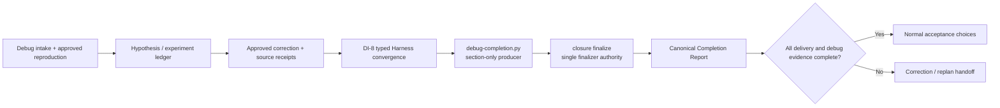

`scripts/debug-completion.py` now writes
`debug/completion/debug-closure-section-v1.json`. It reports domain-capped
debug confidence, evidence gaps, eliminated competitors, and the seven typed
debug controls. It deliberately has `authority: section-only` and contains no
acceptance state. This prevents a proven diagnosis from being confused with a
fully delivered, tested, drift-free correction.

`scripts/closure-finalizer.py` detects a Debug run from its saved intake,
generates that section before building the normal report, and includes the
DI-8 convergence fingerprint in finalizer identity so new convergence evidence
cannot accidentally reuse a stale closure. `scripts/completion-report.py`
then embeds the section, renders its control table, and requires
`debug_status: pass` in addition to the existing requirements, scope, tests,
architecture, behaviour, drift, failures, and canonical-state checks.

Fail-closed example:

```text
Root cause: proven
Correction: implemented
Regression: pass
Behaviour restored: required-evidence-missing

Debug confidence: regression-validated
Canonical overall: evidence-incomplete
Next authority: correction/replan; acceptance is not offered
```

Implemented files:

- `scripts/debug-completion.py` — non-authoritative debug section producer.
- `scripts/closure-finalizer.py` — automatic debug-section convergence before
  the canonical report.
- `scripts/completion-report.py` — unified debug table and single overall
  delivery result.
- `schemas/debug-completion-report.schema.json` — section-only contract.
- `schemas/completion-report.schema.json` and
  `schemas/closure-finalizer.schema.json` — canonical integration contracts.
- `tests/test_debug_harness.py` plus canonical closure suites — confidence,
  authority separation, and closure regression coverage.

#### Phase DI-10 — Token, privacy, continuity, and learning

**Status: implemented (2026-08-31).**

**Goal:** make long investigations bounded, safe, and useful to future runs.

Exactness classes:

| Content | Handling |
| --- | --- |
| Failing stack frame, command, code, diff, config, IDs | `must-be-exact` |
| Repeated surrounding log noise | reducer allowed with retrieval pointer |
| Unknown or security-sensitive content | exact local evidence; never summarized into learning |
| Token savings | estimated unless linked provider telemetry exists |

Privacy controls must sanitize secrets, credentials, authorization headers,
PII, and unsafe payloads before creating portable fingerprints or learning
candidates. Exact local diagnostic evidence and the sanitized signature must be
separate artifacts.

Only a trusted accepted closure may create a candidate-only learning record.
It may store a sanitized failure pattern, proven cause class, validation tiers,
acceptance source, and confidence. Raw prompts, logs, source, customer data,
repository identity, and credentials must never enter curated learning.

Likely files:

- `scripts/debug-intake.py`
- `scripts/token-harness.py`
- `scripts/token-harness-ledger.py`
- `scripts/context-continuity.py`
- `scripts/closure-learning.py`
- `scripts/learning-agent.py`
- `LEARNING-GOVERNANCE.md`

Completion proof:

- Repeated evidence is deduplicated without losing exact retrieval.
- Actual token usage is shown only when telemetry is linked to the run.
- Debug learning remains candidate-only until normal governance promotion.

Implemented design:

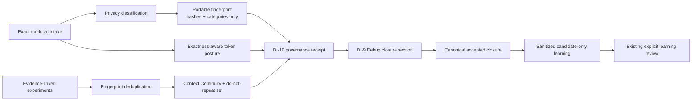

Privacy is a two-artifact contract. Exact symptom, supplied command, and error
stay in `debug/intake/debug-intake-v1.json`, marked
`local-sensitive-exact` and non-portable. The portable failure fingerprint
contains the symptom hash, hashes of non-empty stack lines, entry-point
metadata, and detected sensitivity categories. It contains no raw stack line,
secret, email, prompt, command, or symptom value.

`scripts/debug-governance.py` writes
`debug/governance/governance-v1.json` and can be inspected with:

```bash
tailtrail debug governance build --root . --run-id <run-id>
tailtrail debug governance show --root . --run-id <run-id>
```

| Area | Saved result | Authority boundary |
| --- | --- | --- |
| Privacy | categories, exact local references, sanitized fingerprint reference | never copies exact values |
| Tokens | byte-derived estimate, exactness classes, linked measured telemetry when present | estimate never becomes measured |
| Continuity | unique experiment fingerprints, eliminated hypothesis IDs, continuity/replan references | metadata only; no source or command execution |
| Learning | allowed/forbidden field contract and candidate-only rule | canonical accepted closure remains mandatory |

Repeated experiments continue to be rejected against the unchanged failure
fingerprint. DI-10 exposes that history as a compact do-not-repeat set while
retaining exact retrieval references to the local experiment stream. Failed,
unchanged, regressed, and new-drift outcomes still invoke existing Context
Continuity; the three-cycle Recovery/Replan history is not cleared.

At closure, `debug-completion.py` refreshes and embeds the governance receipt.
Actual token usage remains `unavailable` unless `.tailtrail/token-usage.jsonl`
contains provider/host telemetry whose `task_id` exactly equals the run ID.
No monetary cost is calculated and no estimated saving is presented as exact.

After canonical acceptance, the existing `closure-learning.py` path may add a
Debug profile to the normal positive-learning candidate. It is limited to the
sanitized failure fingerprint, proven cause domain, domain-capped confidence,
validation tiers, and acceptance source. It remains candidate-only and cannot
alter future behavior until explicit Learning Governance review promotes it.

Implemented files:

- `scripts/debug-privacy.py` and `scripts/debug-governance.py`.
- Automatic refreshes in Debug intake, experiment, and closure paths.
- Accepted sanitized candidate integration in `scripts/closure-learning.py`.
- `schemas/debug-governance.schema.json`, updated Debug schemas, CLI/install/
  registry surfaces, and `tests/test_debug_governance.py`.

#### Phase DI-11 — Complete MCP and host integration

**Status:** implemented on 2026-08-31. DI-12 measured runtime conformance and
release evaluation remain separate; DI-11 does not promote the feature from
prototype to released/integrated status by itself.

**Goal:** expose one equivalent lifecycle across Codex, Copilot, and Claude.

Required MCP coverage:

- Start and intake inspection;
- reproduction draft/show/revise/approve;
- project orientation show;
- hypothesis add/show/reprioritize;
- experiment propose/record;
- root-cause proof;
- correction propose/show/approve;
- workflow current/resume/replay;
- closure finalize and unified report show.

Controlled MCP operations record authority and supplied truthful receipts;
they do not secretly execute project commands. CLI and MCP artifacts must be
schema-equivalent and linked to the same run/workflow/requirement IDs.

Likely files:

- `scripts/mcp-server.py`
- `MCP-SERVER.md`
- `AGENTS.md`, `CLAUDE.md`, Copilot instructions, and generated adapters
- `scripts/install-copilot.py`
- `scripts/install_surfaces.py`
- MCP and host-conformance tests

Completion proof:

- Every supported host renders the same Debug Start/approval/closure contract.
- Installation and update packs contain every required script, schema, skill,
  instruction, and registry entry.

Implementation delivered:

- Completed the read-only MCP view with intake, reproduction, orientation,
  hypothesis ledger, correction, governance, convergence, Debug section, the
  shared DWR `workflow_current`/`workflow_resume`/`workflow_replay` tools, and
  the canonical `completion_report_show` surface.
- Completed the controlled MCP lifecycle with reproduction revision,
  hypothesis add/reprioritize, experiment propose/record, root-cause proof,
  correction proposal/approval/scope comparison, Harness convergence, and
  canonical closure finalization. Every controlled tool requires
  `approved: true`.
- Added versioned `tailtrail-debug-experiment-proposal` and
  `tailtrail-debug-hypothesis-ranking` artifacts. A proposal records an action
  and discriminating signal but never executes it; a ranking must name every
  open hypothesis exactly once and preserves the previous order.
- `debug_closure_finalize` delegates to the existing Closure Finalizer. It
  gathers saved evidence and emits the unified report reference; it does not
  run project commands or record acceptance.
- Codex (`AGENTS.md`), Copilot, and Claude now carry an identical marked host
  contract. The precedence is host safety, explicit user request, approved
  reproduction/correction authority, then TailTrail evidence/closure rules.
- Extended installation/update packs already copy the complete `schemas/`
  directory and all Debug scripts. Registry projection now includes every
  DI-11 tool and both new schemas, so installed MCP discovery matches source.

```mermaid
flowchart LR
    H["Codex / Copilot / Claude"] --> S["Debug Start + same run ID"]
    S --> R["Reproduction revise / approve"]
    R --> W["Shared DWR current / resume / replay"]
    W --> O["Orientation + hypotheses + ranking"]
    O --> P["Experiment proposal"]
    P --> X["Host executes separately approved probe"]
    X --> E["Factual evidence + outcome"]
    E --> C["Root cause + bounded correction"]
    C --> V["Scope + Harness convergence"]
    V --> F["Canonical closure finalize"]
    F --> U["Unified Completion Report"]
```

The MCP/host equivalence tests verify that controlled tools are approval-gated,
the three primary hosts publish the same marked contract, schemas validate the
new artifacts, and registry/MCP ordering remains exact. These tests are local
conformance evidence, not proof of real hosted runtime behavior; that proof is
owned by DI-12.

#### Phase DI-12 — Evaluation, governance, and release

**Status:** implementation complete on 2026-08-31; release gate currently
blocked until genuine Codex, Copilot, and Claude runtime receipts are linked to
accepted, evidence-complete Debug vertical runs.

**Goal:** prove that the integrated feature works and does not overclaim.

Minimum deterministic scenarios:

1. code-level reproducible defect;
2. missed service caller or wrong-layer cause;
3. database transaction failure;
4. API contract mismatch;
5. repeated inconclusive experiment;
6. correction introduces scope drift;
7. regression test passes but the user journey remains broken;
8. sensitive data appears in a supplied error log;
9. debug run pauses and resumes after interruption;
10. an approved build run receives an in-scope post-implementation failure.

Measure reproduction success, proven-cause rate, false hypothesis rate,
correction cycles, duplicate experiment prevention, unresolved drift, false
debug routing, review time, evidence completeness, and token-estimate
calibration. Do not publish quality, time, or token-saving claims without
measured artifacts.

The registry status may move from `prototype-implemented` to `integrated` only
after the full vertical scenario passes through Navigator, Planning Lock, DWR,
correction implementation, selected Harnesses, canonical closure, and
acceptance on the supported host matrix.

Implementation delivered:

- Added `benchmarks/debug-harness/scenarios-v1.json` with the exact ten
  deterministic scenarios named above. Each fixture declares observable
  control outcomes rather than raw prompts, source, logs, secrets, or model
  transcripts.
- Added `scripts/debug-evaluation.py` with `catalog`, `run`, `report`, and
  `release-gate`. Preview evaluation is read-only; saving a report requires
  `--approved`.
- Added deterministic metrics for reproduction, proven cause, false
  hypotheses, correction cycles, duplicate-probe prevention, unresolved
  drift, false Debug routing, fixture review duration, evidence completeness,
  and token-estimate calibration.
- Token calibration remains `unavailable` when no exact paired model telemetry
  exists. Fixture review duration is explicitly not represented as measured
  developer-time savings.
- Added a sensitive-log negative scenario which fails if any sensitive value
  is retained. The evaluation contract stores only the count `0`; it does not
  contain example credentials or raw error content.
- Reused `host-runtime-conformance.py` for real-host identity and receipt
  validation. The Debug release gate then adds a stronger vertical probe: each
  host needs a passed receipt linked to a run with an approved reproduction,
  project orientation, proven root cause, approved correction, passing Harness
  convergence, complete canonical report, and explicit acceptance.
- Added read-only MCP `debug_evaluation_report` and `debug_release_gate`, plus
  approval-gated `debug_evaluation_run`. None makes model calls, network calls,
  or project-command executions.
- Added schemas for the deterministic report and release gate, registry and
  Extended installer coverage, and focused governance/release tests.

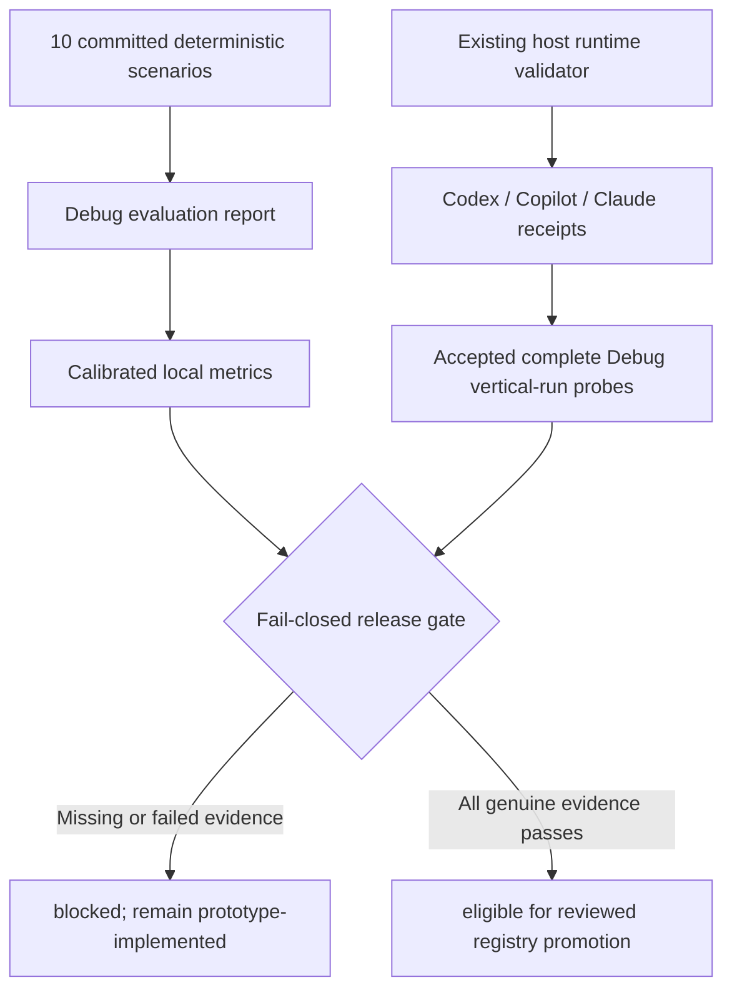

Passing local scenarios therefore means the deterministic controls behave as
specified. It does not mean TailTrail improved agent quality, reduced review
time, saved tokens, or works on a hosted product. Those claims require measured
external evidence and remain prohibited until supplied.

### 21.5 Recommended delivery order and release gates

```text
DI-0 Contract
  -> DI-1 Navigator
  -> DI-2 Debug Start Plan
  -> DI-3 Reproduction approval
  -> DI-4 DWR workflow
  -> DI-5 Project orientation
  -> DI-6 Hypothesis loop
  -> DI-7 Correction handoff
  -> DI-8 Harness convergence
  -> DI-9 Canonical closure
  -> DI-10 Token/privacy/learning
  -> DI-11 MCP/hosts
  -> DI-12 Evaluation/release
```

DI-0 through DI-10 produce the evidence-converged, privacy-bounded native local
implementation slice. DI-11 and DI-12 make it host-portable, measured, and
releasable rather than functional on one local CLI path only.

---

This document intentionally keeps the harness composed of existing TailTrail
primitives rather than introducing a parallel system, per the project's own
governance rule to prefer the smallest maintainable addition that solves the
real problem.
