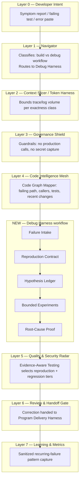
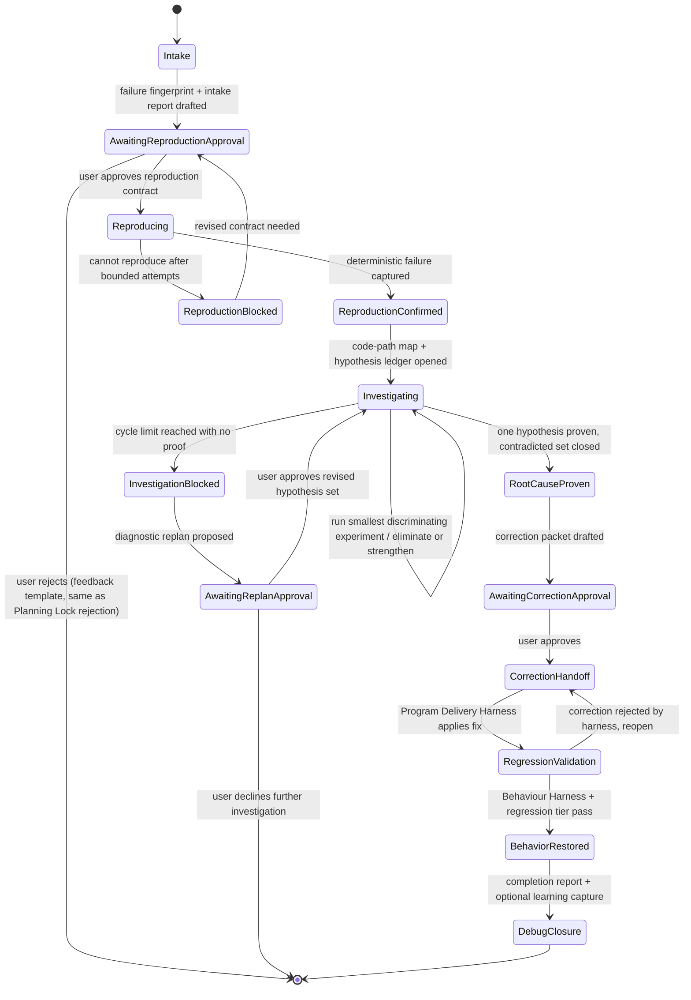
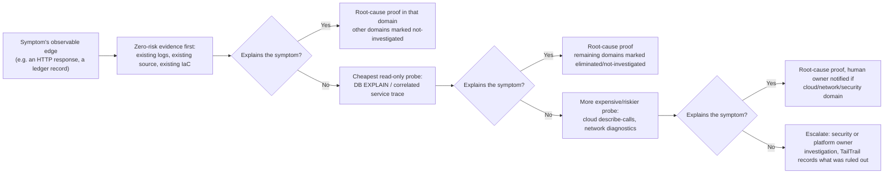
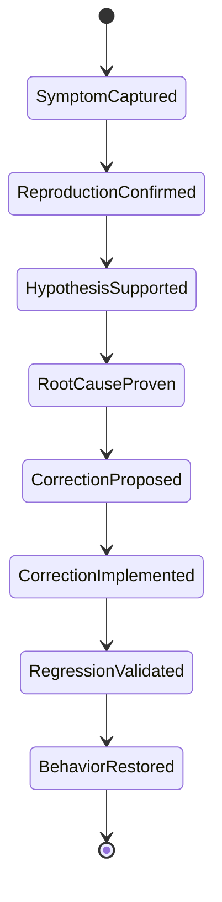

# TailTrail Debug Harness

## Document status and reading guide

**Status:** design proposal, expanded from the working notes captured in
[debug-intial.md](debug-intial.md). This document describes a future TailTrail
capability; it does not claim that the commands, schemas, event kinds, or
runtime states below already exist. Where it reuses an existing TailTrail
mechanism, the mechanism and its current file are named explicitly so the gap
between "exists today" and "proposed" stays visible.

This document is the source of truth for: the problem the Debug Harness
solves, how it fits the existing nine-layer TailTrail model, the run
lifecycle and confidence state machine, the data model (schemas), the CLI/MCP
surface, the integration points with existing harnesses (Program Delivery,
Behaviour, Architecture Fitness, Evidence-Aware Testing, Drift Control, Safe
Git Recovery, Context Continuity, Learning Governance, Token Harness, Durable
Workflow Runtime), guardrails, phased delivery plan, and open risks.

---

## 1. Problem statement

> "Something is broken, but I don't know the project well enough to identify
> the responsible component, reproduce the failure reliably, or judge whether
> the agent's fix is correct."

Today a user can already ask an agent to "fix this bug." Without structure,
that produces a well-known failure mode:

1. The agent reads the stack trace and guesses a cause.
2. The agent edits code near the guess.
3. The agent reruns whatever test is nearby.
4. If the test goes green, the agent declares victory — even if the test was
   weakened, the path bypassed, or the fix only hides the symptom.
5. The user, unfamiliar with the codebase, cannot independently judge whether
   the real defect was found.

TailTrail is already strong at **fresh implementation**: turning an approved
requirement into evidence-backed, drift-controlled, regression-tested code
(Program Delivery Harness, Requirement Completion, Behaviour Harness,
Architecture Fitness). It has **no equivalent structure for diagnosis** — the
step that happens *before* a requirement can even be written, when the
"requirement" is simply "make the reported symptom stop happening for the
right reason."

The Debug Harness closes that gap. It is not a replacement for IDE debuggers,
language runtimes, or breakpoint-based tools — it is the missing **evidence
discipline layer** that turns a vague symptom into a reproducible failure, the
reproducible failure into a proven root cause, and the root cause into a
correction that TailTrail's existing harnesses can validate.

## 2. Positioning: what it is and is not

| It IS | It is NOT |
| --- | --- |
| An evidence-driven investigation workflow for coding agents | A traditional IDE debugger (breakpoints, watch windows, step execution) |
| A structured way to turn "it's broken" into a reproduction, a ranked hypothesis set, and a proven cause | A guarantee that any bug can be found automatically |
| A consumer of Navigator, Code Graph Mapper, Context Continuity, Drift Control | A new orchestration engine that duplicates those systems |
| A producer of evidence and requirements that feed the existing Program Delivery / Harness / Closure pipeline | A parallel closure/reporting system that bypasses Completion Report and Learning Governance |
| Bounded, cycle-limited, and fail-closed on ambiguity | An unbounded "keep trying things" loop |
| Reproduce-first, in a sandboxed/local context by default | A tool that calls production systems, real payment/3rd-party providers, or mutates production state |

The key discipline the Debug Harness adds is a hard separation between
**"tests pass"** and **"root cause proven."** A test can pass because the
agent weakened an assertion, deleted a call, or routed around the failing
path. TailTrail must never let those two states collapse into each other.

## 3. Fit assessment against the existing TailTrail model

TailTrail's architecture is a nine-layer stack from developer intent to
distribution (see [ARCHITECTURE.md](ARCHITECTURE.md), [DESIGN.md](DESIGN.md)).
The Debug Harness is not a tenth, disconnected layer — it is a **workflow
type** that reuses seven of the nine layers directly and introduces two new
artifacts (a failure fingerprint and a hypothesis ledger) that plug into the
existing evidence/requirement/drift machinery.



| Existing TailTrail capability | Current implementation | Role in Debug Harness |
| --- | --- | --- |
| Navigator | `scripts/navigator.py`, `navigator_core.py` | Classifies a request as a **debug** workflow (symptom-first, no approved requirement yet) instead of a **build** workflow, and selects the smallest trustworthy investigation path |
| Code Graph Mapper | `scripts/code-graph-mapper.py` | Produces the failing-path map: entry point, callers, downstream effects, covering tests, recent-change context |
| Context Continuity | `scripts/context-continuity.py`, `.tailtrail/runs/<run-id>/context-continuity.json` | Remembers eliminated hypotheses and failed experiments across cycles so the agent never re-tries a disproven idea |
| Requirement Completion | `scripts/requirement-completion.py`, `requirement-impact-map.py` | Converts "expected behavior" (from the reproduction contract) into the same completion-state tracking used for normal requirements |
| Architecture Fitness | `scripts/architecture-fitness.py` | Confirms the correction touches the actually-responsible layer, not a nearby symptom |
| Behaviour Harness | `scripts/behavior-harness.py` | Proves the original user journey is restored, not just that a narrow unit test passes |
| Evidence-Aware Testing | `scripts/test-precision.py`, `test-tier-selector.py` | Selects the bounded reproduction tier and the regression tier after the fix |
| Drift Control | `scripts/change-intent-anchor.py`, `requirement-impact-map.py` | Extended with an **investigation drift** signal: is the agent still inside the approved investigation scope? |
| Safe Git Recovery | `scripts/git-readiness.py`, `recovery-*.py` | Recovers failed correction attempts without losing the proven root cause |
| Token Harness | `scripts/token-harness.py`, `token-harness-ledger.py` | Bounds trace/log capture using the existing exactness classes (`must-be-exact` for the failing stack frame, `summary-safe` for surrounding noise) |
| Durable Workflow Runtime | `scripts/workflow_runtime/*` | Hosts the debug run as a workflow instance so pause/resume/cancel/replay work identically to build workflows |
| Learning Governance | `scripts/learning-*.py`, `LEARNING-GOVERNANCE.md` | Captures the sanitized failure-pattern → root-cause mapping only after a **trusted closure**, same confidence gates (0–100) as everywhere else |
| Completion Report / Closure | `scripts/completion-report.py`, `closure-*.py` | Debug runs close through the same fail-closed Completion Report, with a debug-specific evidence section |

**Conclusion of the fit assessment:** the Debug Harness is additive, not
parallel. Two genuinely new artifacts are required (failure fingerprint,
hypothesis ledger); everything else is composition of existing, already-shipped
mechanisms. This lowers implementation risk considerably compared with a
from-scratch debugging product.

## 4. Vocabulary

| Term | Definition |
| --- | --- |
| **Debug run** | A `tailtrail debug` invocation, identified by the same `run_id` convention as a build run, living under `.tailtrail/runs/<run-id>/debug/` |
| **Failure fingerprint** | A normalized, deduplicated identity for a reported failure (symptom text hash + stack signature + affected entry point), used to detect "have we seen this before" via Learning Governance and Context Continuity |
| **Reproduction contract** | The debug analogue of an approved anchor: trigger, expected, actual, reproduction method, preserve rules, safety boundary — approved before any code is touched |
| **Hypothesis ledger** | An append-only, ranked list of candidate causes, each with supporting evidence, contradicting evidence, and the next discriminating experiment |
| **Experiment** | A single bounded, deterministic action whose sole purpose is to eliminate or strengthen one hypothesis (not to fix anything) |
| **Root-cause proof** | The evidence artifact that a specific, named defect — not merely "the test now passes" — explains the reproduction |
| **Correction packet** | The bounded fix proposal handed to the existing Program Delivery / Harness pipeline once root cause is proven |
| **Confidence state** | One of eight ordered states (Section 8) tracking how far the investigation has progressed; distinct from pass/fail test status |
| **Diagnosis domain** | The system layer a hypothesis belongs to — code, architecture, database, cloud/infrastructure, security, API integration, or network (Section 7) |

## 5. Debug run lifecycle

The Debug Harness runs as a **workflow type** inside the existing Durable
Workflow Runtime (`scripts/workflow_runtime/`), analogous to today's
`template_id` values (`small-change`, `delivery`, `risk-sensitive`,
`review-only`, `ci-scanner-remediation`, `repository-discovery`). It adds a
new template: **`debug-investigation`**.



State transitions are recorded on the same append-only run ledger used today
(`scripts/run-ledger.py`), with new event types (Section 10).

## 6. Detailed phase walkthrough

### Phase 0 — Failure Intake

Entry points:

```bash
tailtrail debug "Orders sometimes charge twice when payment times out"
tailtrail debug --error error.txt
tailtrail debug --command "python3 -m unittest tests.integration.test_payment"
tailtrail debug --run-id <existing-run>          # attach to an active build run
tailtrail debug --recent-change                   # anchor to the latest approved change
```

**Navigator-driven entry point (implemented).** `tailtrail start "<goal>"` is
also a debug entry point, not only a build one: `classify_start_intent()` in
`scripts/tailtrail.py` routes a goal to the Debug Harness instead of the
normal build workflow when it carries an unambiguous bug-report signal
(`--error`/`--command` present, or high-precision phrasing such as "charged
twice", "crashes when", "stopped working") — otherwise it falls through to
the existing build path unchanged. `--debug`/`--build` force one or the
other explicitly. This mirrors how Navigator already selects features for
build runs; ambiguous goals default to build rather than guessing, and the
routing decision is always printed, never silent (see `tests/test_navigator_debug_routing.py`).

A pasted error, log, or stack trace attached to an **existing** approved run
must never silently create a new Planning Lock or a new debug run — this
mirrors the "current-turn Start boundary" rule TailTrail already enforces for
build runs (see the adapter contracts in [AGENTS.md](AGENTS.md),
[CLAUDE.md](CLAUDE.md)). The same boundary applies here: only an explicit
`tailtrail debug ...` invocation in the current message opens a new debug run.

Intake captures, and reuses Context Continuity's four-layer state shape
(`scripts/context-continuity.py`) rather than inventing a new memory model:

- observed behavior, expected behavior
- error / stack trace / failed command (verbatim, `must-be-exact`)
- reproduction frequency (always / intermittent / once)
- environment and recent-change context (via Code Graph Mapper freshness check)
- affected user journey (feeds Behaviour Harness scenario selection later)
- safety impact (blast radius: read-only, write, external call, payment, PII)
- known vs assumed (explicit — this is what most agent debugging skips)

Output: a **Debug Intake Report** (not an implementation plan):

```
Failure understood: partial
Reproduction: not yet confirmed
Likely path: API -> order service -> payment adapter -> repository
Safety boundary: no external payment call
Next investigation: reproduce timeout-after-acceptance locally
Approval needed: allow the proposed read-only investigation
```

### Phase 1 — Project orientation

Navigator + Code Graph Mapper (existing, unchanged) resolve:

- entry point and the responsible service/module path
- callers and downstream effects
- tests already covering that path
- recent changes when Git evidence is available
- configuration/environment boundaries
- logging/observability surfaces already in the code

This becomes a compact "how this path works" explanation attached to the
Debug Intake Report — the mechanism that helps a user unfamiliar with the
repository without forcing them to read the whole codebase.

### Phase 2 — Reproduction contract (the debug analogue of an approved anchor)

Nothing is changed in source until this contract is approved. It uses the
same anchor discipline as `change-intent-anchor.schema.json`, adapted to
diagnosis:

| Field | Example |
| --- | --- |
| Trigger | Payment gateway times out after accepting the charge |
| Expected | One charge and one order |
| Actual | Retry creates a second charge |
| Reproduction method | Integration test with a timeout-after-acceptance adapter double |
| Preserve | Successful order creation remains unchanged |
| Safety boundary | Do not call a real payment provider |
| Approval | Required before any experiment or code edit |

If the failure cannot be reproduced deterministically within a bounded number
of attempts, the run enters `ReproductionBlocked` and returns to the user for
a revised contract — TailTrail must never proceed to "fix" an unreproduced
symptom.

**Turn-by-turn approval boundary (mirrors `tailtrail start`'s Planning Lock
stop-and-wait behavior).** A host/agent must draft the reproduction contract,
show it to the user with status `awaiting-approval`, and **stop** — it must
not call `reproduction approve` in the same turn, even if the user's original
message described the whole investigation end-to-end. Only a separate,
explicit follow-up message (for example: "I approve the reproduction contract
for run `<run-id>`") may trigger approval. The identical rule applies before
`correction approve` in Phase 5: propose the correction packet, show it, stop,
and require a second explicit approval message before implementing the fix.
A single upfront message must never be treated as pre-authorizing every gate
it happens to mention.

### Phase 3 — Hypothesis ledger

An append-only ledger (mirrors the append-only evidence stream pattern of
`execution-evidence.py`), ranked by likelihood:

| Hypothesis | Supporting evidence | Contradicting evidence | Next experiment |
| --- | --- | --- | --- |
| Retry lacks an idempotency key | Duplicate charge occurs after timeout | Not yet confirmed at adapter boundary | Trace both payment calls |
| Repository saves too late | Order state absent during retry | Successful path saves normally | Inspect timeout ordering |
| Client retries twice | Two service calls may be present | No request receipt yet | Add request-correlation evidence |

Rule: the agent may never jump from a stack trace directly to a fix. Every
proposed correction must trace back to a ledger row that reached
`RootCauseProven`.

### Phase 4 — Bounded experiment loop

Each experiment is a single, deterministic, reversible action whose only goal
is to eliminate or strengthen exactly one hypothesis:

1. Reproduce the failure.
2. Capture a failure fingerprint (Section 9.2).
3. Map the failing path (Code Graph Mapper, cached).
4. Rank hypotheses.
5. Run the smallest discriminating experiment.
6. Eliminate or strengthen hypotheses; update the ledger.
7. Repeat until one hypothesis reaches proof, or the cycle limit is hit.

A hard, configurable cycle limit (default suggested: 5 experiments per
investigation phase, matching the general TailTrail preference for bounded
cycles seen in Program Delivery checkpoints) triggers a **diagnostic
replan**, never silent, indefinite retries.

### Phase 5 — Root cause proof and correction handoff

Root cause proof requires an explicit, named defect statement plus the
evidence that eliminates every contradicting alternative — not merely "tests
now pass." Once proven, a **correction packet** is drafted and handed to the
existing Program Delivery / Harness pipeline exactly like an approved
requirement: Architecture Fitness checks the fix lands in the right layer,
Behaviour Harness proves the user journey is restored, Evidence-Aware Testing
selects the regression tier, Drift Control watches for scope creep beyond the
proven cause. The correction packet is proposed, shown, and left
`awaiting-approval`; the same turn-by-turn boundary above applies before it is
approved and before the fix is implemented.

### Phase 6 — Debug closure

Closes through the same fail-closed Completion Report contract
(`completion-report.schema.json`) with a debug-specific evidence section
(Section 9.6), and — only on a trusted, evidence-backed closure — offers a
sanitized recurring-failure-pattern candidate to Learning Governance, subject
to the exact same confidence gates (0–39 blocked, 40–59 weak, 60–79
candidate, 80–100 trusted) used everywhere else in TailTrail.

## 7. Diagnosis domains: debugging across levels

A single symptom rarely lives in one layer. "Orders sometimes double-charge"
could originate in application code, in how two services agree on retry
semantics, in a database transaction/isolation setting, in autoscaling lag
that delays a worker, in a leaked credential enabling replay, in a
third-party payment API's own retry behavior, or in a network partition that
duplicates a request. TailTrail cannot pretend to have equal evidence access,
equal safety margin, or equal authority at every one of those layers — and it
should not collapse them into one undifferentiated "debug everything" loop.
This section is the honest answer to that open challenge.

### 7.1 Design decision: domain adapters, not one monolithic debugger

The Debug Harness generalizes the same way Code Graph Mapper already
generalizes across languages (Python/Java/.NET/SQL/Terraform adapters
normalizing into one metadata cache): a **Diagnosis Domain Adapter**
interface. Every domain adapter answers the same five questions, so the
harness's spine (Intake -> Reproduction/Observation Contract -> Hypothesis
Ledger -> Bounded Experiments -> Root-Cause Proof -> Correction Handoff ->
Closure, Sections 5-6) stays identical across domains. Only the *contents* of
each stage differ per domain:

1. What read-only evidence can this domain actually expose?
2. What does a "bounded, deterministic, discriminating experiment" mean here?
3. What is the default safety boundary, and what requires human elevation?
4. What evidence combination counts as root-cause proof in this domain?
5. Which existing harness or human owner does a correction hand off to?

### 7.2 Domain table

| Domain | Evidence source | Experiment type | Safety default | Correction owner | Reproducibility ceiling |
| --- | --- | --- | --- | --- | --- |
| Code | source, stack trace, unit/integration tests | run instrumented test locally | local, fully sandboxed | Program Delivery Harness | High — usually reproducible locally |
| Architecture | Code Graph Mapper caller/service graph, module boundaries | trace a request across service boundaries via correlated logs | read-only | Architecture Fitness | Medium |
| Database | query plan (`EXPLAIN`), schema, migration history, lock/transaction logs | run plan/read-replica query, inspect isolation level | read-only, never writes against primary | new **Data Layer Fitness** (proposed, Section 7.5) | Medium — often data/load dependent |
| Cloud / infrastructure | Terraform/IaC diff, provider `describe`-only calls, autoscaling/quota logs | read-only describe calls, IaC-vs-live config diff | strictly read-only; any mutating action is human-executed, never agent-executed | Platform/SRE owner (human handoff) | Low — environment/load dependent |
| Security | dependency/vulnerability scan, IAM policy read, secret-scan, auth logs | read-only policy/permission diff, scoped log query | read-only; no exploit generation, no credential use beyond least-privilege inspection | Security owner (mandatory human handoff) | Low — often cannot be reproduced ethically |
| API integration | contract/schema diff, recorded request/response traces, versioned docs | replay recorded traffic against a sandboxed provider double | no real third-party calls with production credentials | Program Delivery Harness + external-owner escalation | Medium |
| Network | DNS/traceroute/latency logs, firewall/security-group config, TLS status | read-only diagnostics (`dig`, `curl -v`, `traceroute`) against non-production targets by default | never targets production without explicit approval | Platform/SRE owner (human handoff) | Low |

This table is the actual answer to "how do we tackle it": TailTrail does not
promise uniform rigor everywhere. It promises to be explicit, per domain,
about what it can prove, what it can only observe, and what it must hand to a
human.

### 7.3 Cross-domain triage: outward elimination, not domain guessing

Most real incidents are ambiguous across two or three domains at once. Rather
than guessing which domain to start in, the harness applies an
**outward-elimination order** from the symptom's observable boundary:



Rule: **never** attempt an expensive or risky probe (cloud describe calls,
live DB inspection, network diagnostics against anything resembling
production) before cheaper, zero-risk evidence (existing code, existing logs,
existing IaC source) has been checked and found insufficient.

Every domain's hypotheses live in the **same** hypothesis ledger
(Section 9.4), tagged with a `domain` field, so multi-domain causality (for
example "network retry policy *combined with* a code-level idempotency gap")
stays representable in one artifact instead of being split across
disconnected reports.

### 7.4 Domain classification at intake, and honest coverage reporting

Failure Intake (Phase 0, Section 6) is extended with a domain-classification
step: using Code Graph Mapper's language/IaC inventory plus any declared
architecture docs, the harness proposes a **ranked list of candidate
domains** — never a single confident guess. The intake report must track
three explicit buckets at all times:

- `domains_investigated` — evidence was gathered and a hypothesis reached a
  verdict (proven or eliminated)
- `domains_eliminated` — cheap evidence ruled the domain out without a deep
  probe
- `domains_not_investigated` — never touched, because a cheaper domain
  already explained the symptom, or investigation was out of authorized scope

A debug completion report (Section 9.6) must always show all three buckets.
This is a deliberate design choice to prevent false confidence — "root cause
proven" must never silently imply "every possible layer was checked."

### 7.5 Domain-aware confidence ceilings

Not every domain can reach the same proof rigor as Code. Reproducing a live
cloud autoscaling delay or a transient network partition safely and
deterministically is frequently infeasible, and security investigations
often cannot be "reproduced" without doing something unethical or
unauthorized. The confidence-state model (Section 8) therefore carries a
per-domain ceiling:

| Domain | Achievable ceiling without a human owner's sign-off |
| --- | --- |
| Code | `BehaviorRestored` (full loop) |
| Architecture | `BehaviorRestored`, via Architecture Fitness |
| Database | `RegressionValidated` — behavior restoration on shared data stores needs an owning-team sign-off |
| Cloud / infrastructure | `RootCauseProven` at most — correction is always a human-executed change |
| Security | `HypothesisSupported` at most — corrections always require a named security owner before any change |
| API integration | `RegressionValidated` — third-party behavior can't be unilaterally declared "restored" |
| Network | `RootCauseProven` at most — correction is always a human-executed change |

The Debug Completion Report (Section 9.6) must render the domain's ceiling
next to the achieved confidence state, so a `RootCauseProven` result on a
Cloud investigation is never visually confused with the fuller
`BehaviorRestored` result a Code investigation can reach.

### 7.6 Domain-specific safety additions (extends Section 12)

- Cloud, network, and security domains: TailTrail only **proposes** a change
  backed by read-only evidence; it never executes a mutating cloud API call,
  firewall change, IAM edit, or credential rotation itself. That execution is
  always a human action, logged as a `command-result` evidence event supplied
  by the human/owning system — never inferred.
- Security domain: diagnosis only. No generation of exploit payloads, no
  automated penetration/attack techniques, no use of credentials beyond the
  least privilege already granted for read-only inspection — consistent with
  this assistant's standing security policy.
- Database domain: experiments run against a read replica or `EXPLAIN`-only
  plans by default; any experiment touching the primary requires the same
  explicit escalation as a mutating cloud action.
- API integration domain: replay/experiment traffic must run against a
  recorded fixture or sandbox double, never live third-party production
  endpoints with real credentials, mirroring the existing payment-adapter
  safety boundary in the Section 6/20 worked example.

### 7.7 What this defers (and why that's honest, not a gap)

Full automated diagnosis of live distributed, cloud, network, and security
incidents is **explicitly out of scope for V1** (already reflected as DH-8 in
Section 16). Section 7's domain model exists so that when TailTrail *does*
touch those domains, it is honest about a lower reproducibility ceiling and
mandatory human ownership, rather than silently pretending code-level rigor
applies everywhere. Treating this as a deferred, clearly-labeled limitation —
rather than quietly ignoring it — is the intended answer to "this is an open
challenge": TailTrail's job is to be precise about what it proved, what it
only observed, and what it could not touch at all.

## 8. Confidence states (must stay separate from test pass/fail)



A test suite going green only ever advances state as far as
`RegressionValidated`. It can **never**, by itself, prove `RootCauseProven` —
that requires the hypothesis ledger's discriminating evidence. This
distinction is the harness's central value proposition and must be visible in
every report the harness produces (never collapse "tests pass" and "root
cause proven" into one status field).

## 9. Data model (proposed schemas)

All new schemas follow the existing TailTrail schema conventions found across
`schemas/*.schema.json`: a `$schema` draft reference, a `schema_version`
string, a `type` constant, `run_id`, ISO-8601 UTC timestamps, and — where the
artifact is meant to be immutable once approved — a `fingerprint` field.

### 9.1 `debug-intake.schema.json`

```json
{
  "$schema": "https://json-schema.org/draft/2020-12/schema",
  "schema_version": "1",
  "type": "tailtrail-debug-intake",
  "run_id": "string",
  "reported_symptom": "string",
  "attached_error": "string|null",
  "attached_command": "string|null",
  "reproduction_frequency": "always|intermittent|once|unknown",
  "safety_impact": "read-only|write|external-call|payment|pii|unknown",
  "known_vs_assumed": {
    "known": ["string"],
    "assumed": ["string"]
  },
  "likely_path": ["string"],
  "candidate_domains": ["code|architecture|database|cloud-infrastructure|security|api-integration|network"],
  "domains_eliminated": ["string"],
  "domains_not_investigated": ["string"],
  "created_at": "date-time"
}
```

### 9.2 `failure-fingerprint.schema.json`

```json
{
  "schema_version": "1",
  "type": "tailtrail-failure-fingerprint",
  "run_id": "string",
  "domain": "code|architecture|database|cloud-infrastructure|security|api-integration|network",
  "fingerprint": "sha256-hex",
  "symptom_hash": "sha256-hex",
  "stack_signature": ["string"],
  "entry_point": "string",
  "first_seen_at": "date-time",
  "matched_learning_ids": ["string"]
}
```

`matched_learning_ids` is how the harness queries `.tailtrail/learnings.md`
for a previously trusted recurring pattern, following the exact retrieval
rule already documented in [LEARNING-GOVERNANCE.md](LEARNING-GOVERNANCE.md)
(at most 3 matches, confidence-gated, never automatic below 60).

### 9.3 `reproduction-contract.schema.json`

```json
{
  "schema_version": "1",
  "type": "tailtrail-reproduction-contract",
  "run_id": "string",
  "domain": "code|architecture|database|cloud-infrastructure|security|api-integration|network",
  "max_achievable_confidence_state": "string",
  "status": "awaiting-approval|approved|rejected",
  "trigger": "string",
  "expected": "string",
  "actual": "string",
  "reproduction_method": "string",
  "preserve_rules": ["string"],
  "safety_boundary": "string",
  "revision": 1,
  "approved_at": "date-time|null"
}
```

Mirrors `change-intent-anchor.schema.json`'s `revision`/`approved_state`
pattern so the same anchor-freezing logic can be reused rather than
reimplemented.

### 9.4 `hypothesis-ledger.schema.json`

```json
{
  "schema_version": "1",
  "type": "tailtrail-hypothesis-ledger",
  "run_id": "string",
  "hypotheses": [
    {
      "hypothesis_id": "string",
      "domain": "code|architecture|database|cloud-infrastructure|security|api-integration|network",
      "statement": "string",
      "rank": "integer",
      "supporting_evidence": ["string"],
      "contradicting_evidence": ["string"],
      "next_experiment": "string|null",
      "status": "open|eliminated|proven"
    }
  ],
  "sequence": "integer"
}
```

### 9.5 `debug-experiment.schema.json` (append-only, same shape family as `execution-evidence.schema.json`)

```json
{
  "schema_version": "1",
  "type": "tailtrail-debug-experiment",
  "run_id": "string",
  "sequence": "integer",
  "hypothesis_id": "string",
  "action": "string",
  "deterministic": true,
  "outcome": "eliminates|strengthens|inconclusive",
  "evidence_boundary": "string"
}
```

### 9.6 `debug-completion-report.schema.json` (extends `completion-report.schema.json`)

```json
{
  "schema_version": "1",
  "type": "tailtrail-debug-completion-report",
  "run_id": "string",
  "domain_confidence_ceiling": "string",
  "confidence_state": "symptom-captured|reproduction-confirmed|hypothesis-supported|root-cause-proven|correction-proposed|correction-implemented|regression-validated|behavior-restored",
  "root_cause_statement": "string|null",
  "correction_packet_ref": "string|null",
  "regression_tier": "string",
  "behavior_restored": "boolean",
  "domains_investigated": ["string"],
  "domains_eliminated": ["string"],
  "domains_not_investigated": ["string"],
  "acceptance_state": "accept-user|wait-ci|reopen|evidence-incomplete"
}
```

Reuses the existing `acceptance_state` vocabulary so downstream tooling
(closure, learning) does not need a second code path.

### 9.7 `diagnosis-domain-profile.schema.json`

```json
{
  "schema_version": "1",
  "type": "tailtrail-diagnosis-domain-profile",
  "domain": "code|architecture|database|cloud-infrastructure|security|api-integration|network",
  "evidence_sources": ["string"],
  "experiment_types": ["string"],
  "safety_default": "string",
  "correction_owner": "string",
  "max_achievable_confidence_state": "string"
}
```

One static profile per domain (Section 7.2/7.5), referenced by
`reproduction-contract.schema.json`'s `domain` field and rendered next to the
achieved `confidence_state` in the Debug Completion Report so a reader never
confuses a Cloud/Network/Security ceiling with a Code-domain full loop.

## 10. Persistence layout

Follows the existing `.tailtrail/runs/<run-id>/` convention, adding a
`debug/` subtree:

```
.tailtrail/runs/<run-id>/
  debug/
    intake/
      debug-intake-v1.json
    fingerprint/
      failure-fingerprint-v1.json
    reproduction/
      reproduction-contract-v1.json      # immutable once approved
    hypotheses/
      hypothesis-ledger.json             # updated in place, sequence-numbered
    experiments/
      debug-experiments.jsonl            # append-only
    correction/
      correction-packet-v1.json
    completion/
      debug-completion-report-v1.json
```

The debug run reuses the existing `run_id` identity and the same
`.tailtrail/workflows/<workflow-id>/` runtime state when it is promoted to a
`debug-investigation` workflow template, so pause/resume/cancel/replay work
without new runtime code.

## 11. CLI and MCP surface (proposed)

### CLI

```bash
tailtrail debug "<symptom>" [--error <file>] [--command "<cmd>"] [--run-id <id>] [--recent-change]
tailtrail debug reproduction approve --run-id <id>
tailtrail debug reproduction reject  --run-id <id> --reason "<reason>"
tailtrail debug hypothesis show      --run-id <id>
tailtrail debug experiment record    --run-id <id> --hypothesis-id <hid> --result <file> --approved
tailtrail debug replan               --run-id <id>            # after cycle-limit block
tailtrail debug correction approve   --run-id <id>
tailtrail debug completion-report    --run-id <id>
```

### MCP tools (extends `MCP-SERVER.md`'s existing R0/R2 tier model)

R0 read-only:

- `debug_intake_show(run_id)`
- `debug_reproduction_show(run_id)`
- `debug_hypothesis_ledger_show(run_id)`
- `debug_completion_report_show(run_id)`

R2 controlled (require `approved: true` + the exact active debug run):

- `debug_start(symptom, error=None, command=None, run_id=None)`
- `debug_reproduction_approve(run_id)`
- `debug_experiment_record(run_id, hypothesis_id, action, outcome, evidence_boundary)`
- `debug_correction_approve(run_id)`

These follow the same "never execute or reinterpret the command itself"
constraint already documented for `execution_evidence_record` — the harness
records host-reported outcomes; it does not run untrusted commands on the
model's behalf.

## 12. Guardrails and safety controls

Section 7.6 lists the domain-specific safety additions (cloud/security/DB/API
boundaries) on top of the general controls below.

Directly answering the risks named in [debug-intial.md](debug-intial.md),
each mapped to an enforceable control:

| Risk | Control |
| --- | --- |
| Agent invents a root cause from a stack trace | Root-cause proof requires a ledger row with discriminating evidence; a bare stack trace read alone cannot reach `RootCauseProven` |
| Excessive logging exposes secrets/customer data | Token Harness exactness classes apply to trace capture; `must-be-exact` only for the failing frame, never full request/response bodies containing PII/secrets |
| Broad repository scanning (token/latency overhead) | Reuses the existing Code Graph Mapper cache and freshness check instead of a fresh full-repo scan per debug run |
| Non-deterministic experiments produce false conclusions | Every experiment schema field `deterministic` must be true; non-deterministic actions are rejected at the schema level |
| Debug instrumentation leaks into production code | Correction packets are reviewed by Architecture Fitness before handoff; instrumentation-only changes are flagged, not silently merged |
| Fixing the symptom, not the shared cause | Correction packet must reference a `hypothesis_id` with `status: proven`; unlinked corrections are rejected |
| Endless hypothesis loops | Hard cycle limit triggers `InvestigationBlocked` -> mandatory diagnostic replan approval, never silent continuation |
| Modifying production state during reproduction | Reproduction contract's `safety_boundary` field is mandatory and enforced; external-call reproduction requires explicit escalation, off by default |
| Confusing correlation with causation | Ledger requires both supporting *and* contradicting evidence columns populated before a hypothesis can be marked `proven` |

Additionally, the Debug Harness inherits every safeguard already required by
[GUARDRAILS.md](GUARDRAILS.md) and the governance block synchronized across
[AGENTS.md](AGENTS.md)/[CLAUDE.md](CLAUDE.md)/`.github/copilot-instructions.md`:
no claiming tests passed without running them, no removing safeguards to
"simplify" a fix, exact preservation of diffs/commands/logs, and local policy
(`tailtrail-policy.md`) never weakens these rules.

## 13. Evidence, drift, and closure integration

- **Evidence kinds:** the existing five kinds in `execution-evidence.schema.json`
  (`source-edit`, `command-result`, `harness-result`, `drift-finding`,
  `ci-receipt`) are reused unchanged for the correction phase. The debug-only
  `debug-experiment` events (Section 9.5) live in their own append-only stream
  and are summarized — not duplicated — into `execution-evidence` once a
  correction packet is drafted, so closure tooling only ever reads one
  evidence contract at close time.
- **Drift control extension:** a new drift dimension, **investigation drift**,
  answers "is the agent still inside the approved reproduction contract's
  scope?" — the debug analogue of scope drift, evaluated the same way
  `change-intent-anchor.schema.json` evaluates scope drift for build runs.
- **Closure:** `tailtrail closure finalize` runs the same selected Harnesses
  (Architecture Fitness, Behaviour, Maintainability) against the correction,
  then `debug completion-report` emits `debug-completion-report.schema.json`
  instead of the generic build one, adding `confidence_state` and
  `root_cause_statement`.

## 14. Learning Governance integration

A debug run may propose a learning candidate only when:

1. Closure reached `accept-user` (trusted, evidence-backed), and
2. `confidence_state` reached `BehaviorRestored`, and
3. The candidate contains no secrets, PII, full prompts, or raw customer data
   (identical filter to today's capture rules), and
4. The candidate is reusable (recurring failure-pattern -> root-cause mapping,
   not a one-off).

The candidate is scored with the existing 0–100 confidence model and stored
through the existing `learn promote` path — no new storage format, no new
review command. This keeps a second bug of the same class recognizable via
`failure-fingerprint.schema.json`'s `matched_learning_ids` lookup on a future
debug run's intake.

## 15. Sequence view: end-to-end interaction


## 16. Phased delivery plan

Following the same committed-slice / conditional-phase pattern used in
[EVALUATION-HARNESS.md](EVALUATION-HARNESS.md):

| Phase | Scope | Gate |
| --- | --- | --- |
| **DH-0** | Debug Intake artifact + failure fingerprint; `tailtrail debug` read-only intake, no code changes | None — pure capture |
| **DH-1** | Reproduction contract + approval gate; bounded reproduction attempts | Requires DH-0 |
| **DH-2** | Code-path map reuse (Code Graph Mapper wiring, no new analysis engine) | Requires DH-0 |
| **DH-3** | Hypothesis ledger + bounded experiment loop + cycle-limit replan | Requires DH-1, DH-2 |
| **DH-4** | Root-cause proof gate + correction packet handoff to Program Delivery Harness | Requires DH-3 |
| **DH-5** | Debug-specific Completion Report + confidence-state reporting | Requires DH-4 |
| **DH-6 (conditional)** | Learning Governance integration (recurring failure-pattern capture) | Evidence-gated: only after DH-5 shows real trusted closures |
| **DH-7 (conditional)** | MCP tool surface (`debug_*` R0/R2 tools) for host adapters | Evidence-gated: after CLI path (DH-0..DH-5) is stable |
| **DH-8 (deferred)** | Production telemetry ingestion, distributed tracing, live-service debugging, IDE protocol integration, autonomous multi-agent debugging | Separate design doc/RFC — different risk class (live systems, secrets, blast radius), must not be folded into the committed slice |

Committed V1 slice: **DH-0 through DH-5**. This delivers the full local-failure
debugging loop (intake -> reproduction -> hypothesis -> experiment ->
root-cause proof -> correction handoff -> debug completion report) without
touching production systems, live telemetry, or multi-agent orchestration.

## 17. Testing and validation strategy for the harness itself

Consistent with TailTrail's existing pattern of testing its own harnesses
(e.g. `tests/test_behavior-harness.py`, `tests/test_architecture_fitness.py`):

- Schema validation tests for each new `*.schema.json` (structure, required
  fields, enum boundaries) — same style as existing schema tests.
- State-machine tests asserting illegal transitions are rejected (e.g. cannot
  reach `RootCauseProven` without at least one `proven` hypothesis row with
  both supporting and contradicting evidence populated).
- A synthetic "double-charge" fixture (matching the worked example in
  [debug-intial.md](debug-intial.md)) as the canonical end-to-end scenario
  test, reusable as an Evaluation Harness scenario per
  [EVALUATION-HARNESS.md](EVALUATION-HARNESS.md).
- A negative test proving that a weakened/bypassed test cannot advance
  `confidence_state` past `RegressionValidated`.
- Cycle-limit tests proving `InvestigationBlocked` fires and requires
  explicit replan approval rather than looping indefinitely.
- Enterprise registry disposition entries for every new script/test file,
  per this repository's own untracked-file governance
  (`enterprise-closure-registry.json`).

## 18. Success metrics

| Metric | What it demonstrates |
| --- | --- |
| % of debug runs reaching `RootCauseProven` vs. only `RegressionValidated` | Whether the harness is actually preventing symptom-only fixes |
| Reproduction confirmation rate on first contract | Quality of intake and Code Graph Mapper grounding |
| Cycle count to root-cause proof | Efficiency of hypothesis ranking |
| Recurring-pattern hit rate via `matched_learning_ids` | Value of Learning Governance integration over time |
| Correction reopen rate after Behaviour Harness validation | Whether "proven" causes actually restore the real journey |
| Token/log volume per debug run vs. an unstructured agent debugging session | Token Harness effectiveness at bounding trace capture |
| % of multi-domain incidents where `domains_not_investigated` is non-empty but disclosed | Whether the harness stays honest about coverage instead of implying full-stack certainty |

## 19. Open risks and questions

- **Reproduction feasibility for flaky/intermittent failures** — the contract
  model assumes a deterministic reproduction is achievable; a bounded
  "best-effort intermittent" mode may be needed rather than blocking forever.
- **Cross-service/distributed failures** are explicitly out of scope for V1
  (DH-8, deferred) but are the most common real-world "I don't understand
  this codebase" case — worth an early follow-up design once V1 ships.
- **Domain classification accuracy** — Section 7.4's candidate-domain ranking
  is only as good as Code Graph Mapper's IaC/language inventory; a repo with
  undeclared or externally-hosted infrastructure will under-detect Cloud and
  Network domains, and the harness must fail closed (report "unknown" scope)
  rather than assume Code is the only relevant domain.
- **Who has authority to approve Cloud/Security/Network experiments** — even
  read-only describe calls may need scoped credentials TailTrail's local
  context does not have; the harness must degrade to "cannot investigate this
  domain without access to X" instead of fabricating evidence.
- **Cycle-limit tuning** — a fixed default (e.g. 5) may be wrong for very
  large or very small investigations; likely needs to be configurable per
  `tailtrail-policy.md`, consistent with how other bounded controls are
  already made locally configurable.
- **Correction packet vs. full Program Delivery Harness overhead** — for a
  one-line proven fix, routing through the full Program Delivery pipeline may
  be disproportionate; DH-4 should confirm the "small-change" workflow
  template is reused rather than always the heavier `delivery` template.
- **Who owns the "expected behavior" when it's ambiguous** — same rule as
  everywhere else in TailTrail: only a human approves a changed desired
  state; the harness must never let the agent redefine "expected" mid-loop.

## 20. Worked example (from debug-intial.md, expanded)

```
User: tailtrail debug "Orders sometimes charge twice when payment times out"

Debug Intake Report
  Failure understood: partial
  Reproduction: not yet confirmed
  Likely path: API -> order service -> payment adapter -> repository
  Safety boundary: no external payment call
  Next investigation: reproduce timeout-after-acceptance locally
  Approval needed: allow the proposed read-only investigation

[user approves]

Reproduction Contract (approved)
  Trigger: payment gateway times out after accepting the charge
  Expected: one charge and one order
  Actual: retry creates a second charge
  Reproduction: integration test with timeout-after-acceptance adapter double
  Preserve: successful order creation remains unchanged
  Safety boundary: no real payment provider calls

Hypothesis Ledger
  H1 retry lacks idempotency key      -> proven (both payment calls traced, no key sent)
  H2 repository saves too late        -> eliminated (order state present at retry time)
  H3 client retries twice             -> eliminated (single request correlation ID observed)

Root cause proven: H1 — retry path omits an idempotency key on the payment adapter call.

Correction packet -> Program Delivery Harness (small-change template)
  Architecture Fitness: fit (fix lands in payment adapter, correct layer)
  Behaviour Harness: user journey "checkout with timeout" restored
  Regression tier: integration (payment adapter + order service)

Debug Completion Report
  confidence_state: behavior-restored
  acceptance_state: accept-user
  learning candidate: "idempotency key required on retried payment calls" (confidence 84, trusted)
```

---

This document intentionally keeps the harness composed of existing TailTrail
primitives rather than introducing a parallel system, per the project's own
governance rule to prefer the smallest maintainable addition that solves the
real problem.
