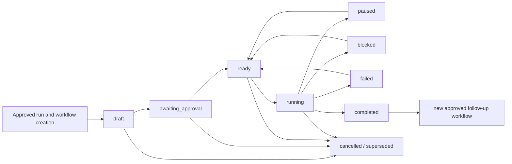
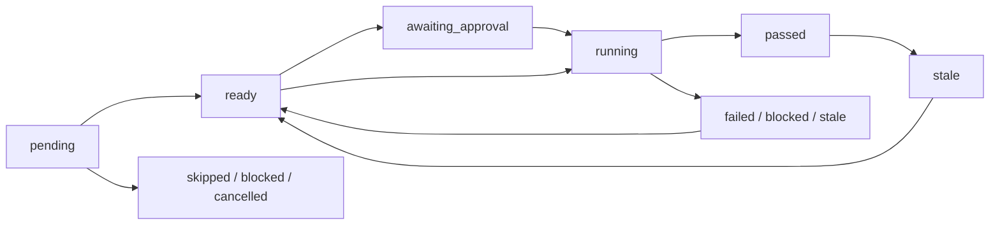
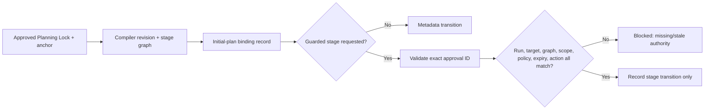
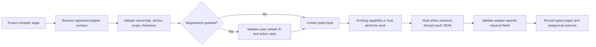
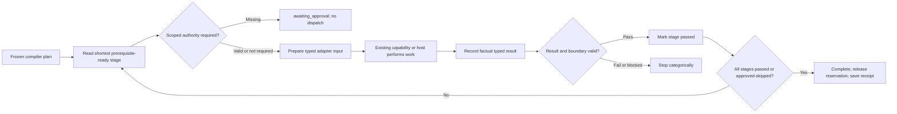
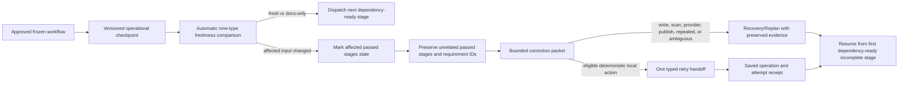

# TailTrail Durable Workflow Runtime — Revised Design

Status: phased implementation in progress. DWR-A, DWR-B, DWR-C, DWR-minus,
DWR-0, DWR-1, DWR-1.5, DWR-2, DWR-3, DWR-4, and Deferred Phases 0–3 are implemented.
Deferred Phases 4 through 11 remain required for the complete local runtime;
Deferred Phase 12 is implemented as an evidence-gated optional adapter; local mode remains supported and default.
Revision basis: implemented runtime evidence and documentation reconciliation
through August 20, 2026.
Changes from original: canonical ownership, capability declaration, task scope,
append-only storage, local state, deterministic compilation, controlled Start,
evidence/closure, and one small-change vertical are implemented. The remaining
runtime contract is tracked in the Deferred Implementation master plan below.

---

## What Changed From The Original And Why

| Section | Change | Reason |
|---|---|---|
| Implementation Phases | Added **DWR-minus** before DWR-0 | Prove storage model before building the engine |
| Delivery template | Defined `clarify` explicitly | Was undefined — every stage must have a capability ID |
| Module layout | Added 300-line size contract | Prevent monolith recurrence by design |
| Plan invalidation | Replaced vague rule with 3 explicit triggers | Vague rule causes user frustration and workarounds |
| Approval model | Added session approval + policy pre-approval | Approval fatigue is listed as a risk but had no real mitigation |
| Migration | Added `--no-workflow` flag | Existing Codex/Copilot integrations break when output format changes |
| Each phase | Added "Phase exit criteria" | Phases had deliverables but no measurable done condition |
| Risks table | Added approval fatigue concrete mitigations | Original mitigation was advice, not mechanism |

The problem statement and product boundaries remain. Runtime descriptions,
commands, storage names, template inventory, phase statuses, and completion
gates are reconciled with the implemented source and Feature Registry.

---

## Executive Summary

TailTrail already knows how to recommend AIDLC, code mapping, testing, review, security, quality,
learning, token optimization, evaluation, and handoff. Today, those capabilities can still feel
like separate commands and documents. The Durable Workflow Runtime will give them one shared lifecycle.

The proposed runtime will:

- convert an approved Navigator plan into a typed workflow instance
- execute or recommend only registered TailTrail capabilities
- preserve stage status without storing raw prompts, source code, or secrets
- pause before writes, scanners, broad reads, external providers, or other guarded actions
- resume interrupted work without repeating completed discovery
- invalidate stale evidence when relevant code changes
- retry only eligible failed stages
- produce a compact user-facing status and a detailed machine-readable receipt
- feed sanitized outcome evidence to Evaluation Harness and Meta-Harness
- remain deterministic and local-only by default

The initial implementation should use the Python standard library and JSON files. It should not
require a model API, background service, database, message broker, container runtime, or
distributed systems platform.

---

## Problem Being Solved

Navigator can recommend a strong workflow, but a recommendation alone does not guarantee that the
workflow is followed. Several gaps remain:

- the selected stages do not share one durable status record
- an interrupted task may require rediscovery on the next session
- implementation, testing, review, and fulfilment evidence can become disconnected
- users cannot always see why a stage was skipped or blocked
- retries may repeat earlier work unnecessarily
- Meta-Harness must reconstruct behavior from separate event sources
- multiple assistants may interpret the same Navigator plan differently
- there is no single lifecycle contract for CLI, MCP, hooks, and future integrations

The runtime closes these gaps without changing TailTrail's human-approval model.

---

## Product Principle

Use deterministic orchestration for the lifecycle and intelligent assistance only inside bounded stages.

The runtime decides lifecycle mechanics such as stage order, prerequisites, approval, state
transitions, evidence requirements, retries, freshness, and completion. An assistant may still
help classify a task, clarify requirements, implement code, explain findings, or suggest a fix,
but it must return results through a defined stage contract.

---

## Scope

### In Scope

- local workflow creation from Navigator output
- predefined workflow templates
- typed stage and capability contracts
- explicit state transitions
- approval gates
- stage evidence and artifact references
- resumability and staleness detection
- bounded retries
- cancellation and supersession
- compact event journal
- CLI integration
- Navigator and Start integration
- Feature Registry validation
- MCP read and approval-aware action tools
- Evaluation Harness and Meta-Harness evidence adapters
- deterministic tests and fixtures
- optional CI continuation for approved, non-interactive stages

### Out of Scope for the First Release

- autonomous agents communicating without a fixed workflow
- mandatory model or inference API calls
- automatic code-changing retries
- silent approval of guarded actions
- background daemons
- distributed queues or Pub/Sub
- Redis, graph databases, or vector databases
- mandatory containers or Kubernetes
- automatic upload of workflow data
- storing raw prompts, source bodies, scanner logs, secrets, or user identity
- replacing AIDLC, Navigator, Feature Registry, Learning, Evaluation Harness, or Meta-Harness

---

## Relationship To Existing TailTrail Features

The runtime coordinates existing features; it does not absorb their responsibilities.

| TailTrail component | Existing responsibility | Runtime responsibility |
|---|---|---|
| Navigator | classify the task and recommend the route | turn an approved route into a workflow instance |
| Feature Registry | define available features, commands, evidence, and maturity | validate that every requested capability exists and is permitted |
| AIDLC | manage lifecycle depth and development artifacts | represent AIDLC activities as workflow stages and references |
| Code Graph Mapper | provide repository relationships and read order | record graph version, freshness, and stage use |
| Token Harness | budget, route, reduce, and prove context use | attach budget and context receipts to stages |
| Guardrails and policy | define restrictions and approvals | enforce gates before stage transition or action execution |
| Test Precision | plan and report focused validation | produce validation evidence for the test stage |
| Review | identify code and requirement-fulfilment findings | produce review evidence and guarded fix-loop transitions |
| Learning Agent | retain governed repository patterns | receive post-task capture suggestions after completion |
| Evaluation Harness | assess outcome quality | consume completed workflow evidence |
| Meta-Harness | improve TailTrail behavior from repeated evidence | evaluate workflow fit, failure patterns, and routing quality |
| MCP server | expose TailTrail capabilities to assistants | expose workflow status and guarded lifecycle operations |

---

## Canonical State And Ownership Boundary *(implementation prerequisite)*

The Durable Workflow Runtime is an execution **projection** over TailTrail's existing
task state. It is not a second task system and must never decide that a requirement is
complete, approved, recoverable, or accepted independently of the canonical artifacts.

| Concern | Canonical owner | Runtime role |
|---|---|---|
| task identity and user goal | Planning Lock / active TailTrail run | bind the workflow to the same run ID |
| approved intent and requirement IDs | immutable approved anchor and requirement matrix | reference the approved revision; never copy-and-edit it |
| AIDLC Standard / Full lifecycle decisions | official AIDLC bridge artifacts | record sanitized stage references and wait for their approval state |
| changed scope, checkpoints, drift, and recovery | requirement/harness and recovery artifacts | attach evidence references and sequence the next allowed stage |
| test, review, and CI receipts | existing evidence and closure recorders | index receipts; do not rewrite their result |
| final completion and acceptance | Completion Report and closure lifecycle | show the result and prevent premature workflow completion |

Every persisted workflow therefore carries these mandatory references:

```json
{
  "workflow_id": "ttw-20260818-001",
  "tailtrail_run_id": "start-20260818-...",
  "planning_lock_ref": ".tailtrail/runs/start-20260818-.../planning/lock-v1.json",
  "approved_anchor_ref": ".tailtrail/runs/start-20260818-.../approved.md",
  "requirement_matrix_ref": ".tailtrail/runs/start-20260818-.../requirement-matrix.json"
}
```

If any required reference is absent, stale, or belongs to another target workspace, the
runtime must enter `blocked` with a structured reason. It must not create a substitute
anchor, infer approval, or start a second code-changing lifecycle.

---

## Architecture

```text
User task
   |
   v
Navigator classification and proposed plan
   |
   v
User approval or edited plan
   |
   v
Approved TailTrail anchor (canonical)
   |
   v
Workflow Compiler (projection over canonical run)
   |-- validates Feature Registry IDs
   |-- resolves policy and guardrail gates
   |-- expands a workflow template
   |-- freezes the approved execution contract
   v
Local Workflow Runtime
   |-- State Store
   |-- Transition Engine
   |-- Approval Manager
   |-- Evidence Manager
   |-- Freshness Manager
   |-- Retry Controller
   |-- Event Journal
   |
   +--> TailTrail capabilities and assistant actions
   |
   v
Completion Receipt
   |-- user summary
   |-- Evaluation Harness event
   |-- optional Learning capture suggestion
   +-- sanitized Meta-Harness evidence
```

---

## Runtime Model

### Workflow

A workflow is one approved TailTrail task lifecycle. It has a stable ID, selected template,
repository identity hash, task classification, status, stage list, policy snapshot reference,
and evidence summary.

### Stage

A stage is a bounded unit such as discovery, planning, implementation, testing, review,
fulfilment, security, handoff, or learning suggestion.

Every stage declares:

- stable stage ID
- registered TailTrail capability IDs
- prerequisites
- input schema
- output schema
- evidence requirements
- approval class
- retry policy
- freshness inputs
- completion rule
- skip rule
- failure behavior

### Action

An action is an individual operation inside a stage. Actions are classified as:

- `read_local`: bounded local read with no project execution
- `write_tailtrail_state`: write only TailTrail runtime state
- `write_project`: modify project source, tests, configuration, or documentation
- `execute_project`: run tests, builds, linters, or project commands
- `scan_local`: run approved local quality or vulnerability scanners
- `external_provider`: use a network service, model, CI provider, or semantic provider
- `publish`: push, deploy, merge, upload, or otherwise change external state

Approval policy is evaluated against action class, repository policy, workflow stage, and
current user approval.

### Evidence

Evidence proves that a stage satisfied its completion rule. Evidence stores compact facts and
references, not raw content.

Examples:

- file paths and content hashes for inspected targets
- code-graph version and freshness hash
- test command, exit code, and report path
- review finding IDs and severity counts
- requirement IDs and fulfilment status
- scanner report path and normalized finding summary
- context receipt ID and measured or estimated token label
- approval event ID
- changed-file list and diff hash

---

## State Machine

Workflow statuses:

- `draft`: generated but not approved
- `awaiting_approval`: waiting for initial or stage approval
- `ready`: approved and able to start
- `running`: one stage is active
- `paused`: intentionally stopped and resumable
- `blocked`: cannot continue without external change or user decision
- `failed`: terminal failure under the current contract
- `cancelled`: intentionally ended by the user
- `superseded`: replaced by a newer workflow
- `completed`: all required stages passed or were validly skipped

Stage statuses:

- `pending`
- `ready`
- `awaiting_approval`
- `running`
- `passed`
- `failed`
- `blocked`
- `skipped`
- `stale`
- `cancelled`

Allowed high-level transitions:

```text
draft -> awaiting_approval -> ready -> running
running -> awaiting_approval -> running
running -> paused -> ready
running -> blocked -> ready
running -> failed
running -> completed
draft/ready/running/paused/blocked -> cancelled
draft/ready/running/paused/blocked -> superseded
```

Illegal transitions must fail closed with a structured error. A completed workflow must never
return to running; a follow-up creates a linked workflow.

---

## Workflow Template Inventory

The deterministic compiler and executor implement seven frozen
templates. Every stage resolves to an existing typed adapter or an explicit
runtime approval gate.

| Template ID | Current status | Implemented terminal stage | Expansion boundary |
| --- | --- | --- | --- |
| `small-change` | implemented; DWR-4 proven vertical | `fulfilment` | completion is composed through the canonical closure bridge |
| `delivery` | compiled and executable | `handoff` | factual adapter evidence remains host/capability-owned |
| `risk-sensitive` | compiled and executable | `handoff` | classified risks require matching approved authority before implementation |
| `review-only` | compiled and executable | `optional-fix-proposal` | no source-writing stage; a fix is a separate approved workflow |
| `repository-discovery` | compiled and executable | `architecture-summary` | read-only; project changes require a follow-up workflow |
| `ci-scanner-remediation` | compiled and executable | `fulfilment` | saved CI/scanner intake through focused recheck and fulfilment |
| `debug-investigation` | compiled and resumable | `d-10-closure` | reproduction approval covers D-01 through D-07; source correction remains separately gated |

The diagrams below describe the implemented graphs. The frozen compiler plan
and replayed journal are authoritative for a particular workflow.

### Debug Investigation

```text
d-01-intake -> d-02-reproduction -> d-03-project-orientation
 -> d-04-hypothesis-generation -> d-05-experiment
 -> d-06-root-cause-proof -> d-07-correction-proposal
 -> d-08-correction-implementation -> d-09-regression-validation
 -> d-10-closure
```

The `d-03-project-orientation` stage consumes TailTrail's versioned
`debug-orientation` projection. It reuses a fresh shared or local Code Graph
cache, labels path-and-hash confirmation separately from heuristic callers and
tests, and emits an approval-gated bounded refresh proposal when repository
inventory changed. It never refreshes the graph or inspects source bodies as a
side effect of orientation.

This native template is activated only after exact reproduction approval. It
reuses the canonical DWR journal, replay, pause/resume/cancel, freshness,
correction, and scoped-approval controls. The reproduction approval cannot
authorize D-08 source correction. Operational freshness fingerprints the
approved reproduction and invalidates its downstream stages when it changes.

### Small Change

```text
bootstrap -> discover -> implement -> focused-test -> review -> fulfilment -> complete
```

Use for a bounded bug fix or small feature. AIDLC and broad scanners remain absent unless
task signals or policy require them.

### Delivery

```text
bootstrap -> discover -> clarify -> plan -> implement
          -> focused-test -> review -> fulfilment -> handoff -> complete
```

**`clarify` stage definition** *(revised — was undefined in the original)*

The `clarify` stage maps to the registered `aidlc` capability. Its authority
depends on the approved AIDLC mode; the runtime stores only sanitized
references to the authority-owned artifacts.

- Capability ID: `aidlc`
- Approval class: `read_local` (no source edits; reads goal and Navigator plan only)
- Input schema: Navigator plan, goal statement, known facts from the discovery stage
- Output schema: approved requirement boundary, AIDLC questions and answers, assumptions,
  non-goals, and acceptance criteria
- Completion rule: at least one requirement accepted by the user and a non-empty acceptance
  criteria list recorded
- Skip rule: may be skipped when the task is a direct bug fix with a single well-defined
  acceptance criterion already stated in the goal — requires an explicit skip reason code
- Failure behavior: `blocked`; the workflow pauses for requirement clarification

| AIDLC mode | Clarification authority represented by the stage |
| --- | --- |
| Off | no AIDLC stage; already-approved canonical requirements remain authoritative |
| Lite | TailTrail's local deterministic requirement brief |
| Standard | pinned official AI-DLC Requirements stage and its approved artifact references |
| Full | pinned official AI-DLC lifecycle stage references; TailTrail remains the assurance/control layer |

This stage is optional for the Small Change template and required for Delivery, Risk-Sensitive,
and any template where the acceptance criteria are not stated in the initial goal.

### Risk-Sensitive

```text
bootstrap -> discover -> clarify -> threat-or-risk-plan -> implement
          -> tests -> security -> quality -> review -> fulfilment
          -> approval -> handoff -> complete
```

Use when authentication, authorization, privacy, secrets, regulated data, dependencies,
migrations, or high-impact infrastructure are involved.

### Review Only

```text
bootstrap -> scope-diff -> graph-impact -> review
          -> requirement-fulfilment -> optional-fix-approval -> complete
```

No implementation occurs unless the user approves a fix-loop workflow.

### CI Or Scanner Remediation *(deferred; not compiled today)*

```text
bootstrap -> ingest-findings -> graph-overlay -> root-cause
          -> fix-plan -> approval -> implement -> focused-validation
          -> finding-recheck -> review -> complete
```

### Repository Discovery

```text
bootstrap -> graph-freshness -> bounded-discovery -> architecture-summary -> complete
```

This remains read-only unless the user starts a follow-up change workflow.

---

## Workflow Compilation

The Workflow Compiler receives the Navigator plan and performs these deterministic steps:

1. Validate the plan schema.
2. Resolve every selected feature to a Feature Registry ID.
3. Reject unavailable, disabled, or contradictory features.
4. Select the smallest matching workflow template.
5. Add mandatory stages from active policy and guardrail layers.
6. Resolve stage prerequisites into an acyclic graph.
7. Detect duplicate stages and merge only compatible evidence requirements.
8. Determine approval classes.
9. Attach context budgets and graph/bootstrap references.
10. Produce a frozen draft with a stable plan hash.
11. Present the compact plan and meaningful approval questions.
12. Start only after approval of the current plan hash.

**Plan invalidation triggers** *(revised — original was vague)*

A new revision is created and previous approval is invalidated when one or more of these
three conditions occurs:

1. The user explicitly changes the stage list or stage order.
2. A policy or guardrail file changes in a way that affects an unstarted guarded stage.
3. The repository identity hash changes (different branch, different repository, or a forced
   commit that changes the HEAD SHA).

Nothing else triggers a revision. Task description edits, comment changes, token budget
adjustments, and non-guarded metadata updates do not create a new revision. This makes the
invalidation rule predictable and prevents the user from losing approval for trivial reasons.

If the user edits the plan in any way that does not meet the above three conditions, the change
is recorded as a plan annotation but does not reset approval.

---

## Approval Model *(revised — original mitigation for approval fatigue was insufficient)*

Approval is scoped, revocable by plan change, and never inferred from silence.

### Initial Approval

Approves the compiled plan revision, selected stages, listed files or scopes, and explicitly
named actions. It does not automatically approve later scanner, publish, dependency, or
destructive actions.

### Mode-aware post-approval execution *(implemented)*

Initial plan approval is converted into exactly one auditable execution route:

| Requirement authority | Post-approval behavior | Additional material gates |
| --- | --- | --- |
| AIDLC Off or Lite | Write a hash-bound `plan-derived` grant for `read_local`, `write_tailtrail_state`, `write_project`, and `execute_project` stages inside the immutable anchor. | Material scope or requirement change, dependency, recovery, scanner, provider, publish, deploy, or merge. |
| Official AI-DLC Standard or Full | Preserve official lifecycle-stage authority; do not create a plan-derived project grant. Commands inside an already authorized stage should be batched by the host rather than approved one by one. | Official material stage transition, requirement/design amendment, and every sensitive action. |
| Intent Bridge | Preserve source revision and active delivery-slice authority; do not infer project authority from a rewritten local copy. | Source revision change, slice amendment, and every sensitive action. |

The grant is bound to the canonical run, target identity, approved-anchor
fingerprint, requirement IDs, compiler revision and graph, policy fingerprint,
and covered stages. A mismatched or stale record fails closed. Activation
records authority but dispatches no command. For Lite/Off, the host consumes
the Execution Handoff internally and proceeds directly; the Completion Report
is the first user-facing authority/handoff summary. Standard/Full and Intent
Bridge show the defensive handoff because another material gate remains.
Closure reports prior authority and never retroactively creates it.

Before any of these routes can be approved, each explicit `--changed` path must
exist inside the resolved target repository. Missing or escaping paths produce
a non-persisted Pre-Target report and no Planning Lock. Completion separately
reports `complete`, `incomplete`, or `blocked` implementation status. An
unavailable target or command is rendered with its factual blocker and is not
presented as a failed test execution.

### Stage Approval

Required when a stage introduces a guarded action not covered by the initial approval, such as:

- adding or changing dependencies
- running a broad build or test suite
- running Sonar, vulnerability, secret, container, or infrastructure scanners
- using external semantic providers
- modifying security-sensitive code
- applying review fixes
- publishing, pushing, deploying, or merging

### Session Approval *(new)*

The Phase 3 authority layer records bounded session-source approval for
compiler-declared read-only or TailTrail-state stages:

```text
tailtrail workflow approvals session --root . --workflow-id <workflow-id> \
  --session-id <host-session> --action-class read_local --approved
```

- Session-source approval records are written to `stage-approvals-v1.json` and
  bound to the workflow, canonical run, target, scope, policy hash, stage graph,
  and compiler revision/fingerprint.
- They never cover `write_project`, `execute_project`, `scan_local`, `external_provider`,
  or `publish` actions.
- A session approval cannot be used to pre-approve a stage whose action class is unknown
  at compile time.
- Session end and workflow pause explicitly expire matching records. Target
  identity/HEAD changes and material plan revisions make them ineffective;
  material compiler revision also writes expiry metadata.

### Policy Pre-Approval *(new)*

A local `.tailtrail/workflow-compiler-policy-v1.json` may pre-approve specific
well-understood, low-risk stages without a runtime interactive prompt:

```json
{
  "schema_version": "1",
  "type": "tailtrail-workflow-compiler-policy",
  "required_capabilities": [],
  "forbidden_capabilities": [],
  "stage_prerequisites": {},
  "pre_approved_stages": ["bootstrap", "discover"]
}
```

Pre-approved stages still write an approval event. The event records the policy reference,
not a user interaction. This gives teams control over which stages are interactive without
making any stage approval-free in the audit trail.

### Approval Record

An approval record contains:

- approval ID
- workflow and plan revision
- approved stage and action classes
- exact command or bounded operation when relevant
- scope and expiry condition
- timestamp
- decision: approved, rejected, or edited
- approval source: interactive, plan-derived, session, or policy

No raw user message is required.

---

## Data Storage

Recommended local structure:

```text
.tailtrail/
  workflows/
    ttw-<stable-run-derived-id>/
      ownership-v1.json
      capability-plan-v1.json       # present after DWR-B declaration
      scope-v1.json                 # present after DWR-C capture
      journal-v1.jsonl
      projection-v1.json
      compiler-plan-v1.json         # present after compilation
      stage-approvals-v1.json       # present when an approval is recorded
      evidence-v1.json              # present after evidence collection
      completion-receipt-v1.json    # present only after closure recording
  workflow-active-code-change-v1.json  # optional repository-wide reservation
```

`journal-v1.jsonl` is the append-only hash-chained record.
`projection-v1.json` is the separately atomic read model. `workflow storage
replay` rebuilds the projection in memory and never silently repairs the
journal. These files are local runtime state and should not be committed by
default.

Shareable project context remains in the existing reviewed locations, such as committed
code-map artifacts or sanitized `tailtrail-meta` summaries. Workflow records must not
silently become shared metadata.

### Workflow Schema Draft

```json
{
  "schema_version": "1",
  "workflow_id": "ttw-2026-0818-001",
  "tailtrail_run_id": "start-20260818-...",
  "workflow_revision": 1,
  "template_id": "delivery",
  "status": "awaiting_approval",
  "created_at": "2026-08-18T10:00:00Z",
  "updated_at": "2026-08-18T10:00:00Z",
  "repository_ref": "sha256:REDACTED",
  "planning_lock_ref": ".tailtrail/runs/start-20260818-.../planning/lock-v1.json",
  "approved_anchor_ref": ".tailtrail/runs/start-20260818-.../approved.md",
  "requirement_matrix_ref": ".tailtrail/runs/start-20260818-.../requirement-matrix.json",
  "task_class": ["feature"],
  "plan_hash": "sha256:REDACTED",
  "policy_hash": "sha256:REDACTED",
  "current_stage_id": null,
  "stages": [
    {
      "stage_id": "discover",
      "capability_ids": ["bootstrap-snapshot", "code-graph-mapper"],
      "status": "pending",
      "requires": [],
      "approval_class": "read_local",
      "attempt": 0,
      "max_attempts": 1,
      "evidence_ids": []
    }
  ],
  "claim_boundaries": [
    "Completion means required workflow stages passed; it does not prove production correctness."
  ]
}
```

### Event Schema Draft

Each event is append-only and includes:

- schema version
- event ID
- workflow ID and revision
- sequence number
- timestamp
- event type
- stage ID when relevant
- capability IDs
- categorical reason code
- evidence references
- previous and next state

Allowed event types:

- `workflow_created`
- `plan_revised`
- `approval_requested`
- `approval_granted`
- `approval_rejected`
- `stage_ready`
- `stage_started`
- `stage_passed`
- `stage_failed`
- `stage_blocked`
- `stage_skipped`
- `stage_stale`
- `workflow_paused`
- `workflow_resumed`
- `workflow_cancelled`
- `workflow_superseded`
- `workflow_completed`

The journal must be append-only. Current state is a projection that can be rebuilt and
validated from events.

---

## Resume And Freshness

The DWR-3 compatibility continuation command remains:

```text
tailtrail workflow evidence resume --root . --workflow-id <workflow-id>
```

Deferred Phase 6 adds automatic operational freshness and the canonical
read-only continuation command:

```text
tailtrail workflow freshness apply --root . --workflow-id <workflow-id>
tailtrail workflow resume --root . --workflow-id <workflow-id>
```

It uses the explicit workflow identity, verifies saved binding/compiler/evidence
references, preserves unaffected passed stages, and returns the shortest saved
continuation. The implemented behavior is to:

1. locate the latest resumable workflow for the repository
2. verify schema and event integrity
3. compare repository, policy, graph, bootstrap, dependency-manifest, and changed-file hashes
4. mark affected passed stages stale
5. preserve unaffected passed stages
6. show the shortest valid continuation plan
7. request approval if the plan or guarded scope changed

Freshness dependencies should be stage-specific. A documentation edit should not invalidate
a completed dependency scan. A manifest change should invalidate dependency, token-context,
build, and relevant security evidence. A policy change should require recompilation of all
pending guarded stages.

---

## Retry And Failure Rules

Retries must be explicit and bounded.

- read-only deterministic stages may retry automatically once for transient file races
- TailTrail state writes may retry only when atomic-write recovery is safe
- project commands may retry only with user approval or an active policy rule
- code-changing actions never retry automatically
- external provider calls never retry unless explicitly enabled and bounded
- publish actions never retry automatically

A retry creates a new attempt record. It must not overwrite previous evidence.

Failure classes:

- `validation_failure`: command completed and behavior failed
- `tool_failure`: tool could not execute
- `policy_block`: active policy prohibited the action
- `approval_required`: user decision is needed
- `stale_input`: required evidence changed
- `contract_error`: stage output did not satisfy schema
- `capability_unavailable`: registry feature or command is missing
- `external_failure`: provider, CI, or network dependency failed

---

## Concurrency And Locking

V1 should allow only one running code-changing workflow per repository. Read-only discovery
or reporting may run concurrently if it does not alter shared runtime projections.

Use an atomic lock file containing workflow ID, process ID, creation time, and repository
hash. Stale locks should be diagnosed, not silently deleted. `workflow doctor` can recommend
a recovery action.

---

## CLI Design

Primary user commands:

```text
tailtrail start "<task>"
tailtrail start "<task>" --no-workflow
tailtrail next
tailtrail workflow state status --root . --workflow-id <workflow-id>
tailtrail workflow evidence resume --root . --workflow-id <workflow-id>
tailtrail workflow state pause --root . --workflow-id <workflow-id>
tailtrail workflow state cancel --root . --workflow-id <workflow-id> --confirmed
```

**`--no-workflow` flag** *(new — see Migration section)*

When `--no-workflow` is passed, `start` behaves exactly as it did before the Durable Workflow
Runtime was introduced: it returns a Navigator compact plan and Planning Lock without creating
or mutating any workflow state. Remove this flag only after DWR-4 is complete and validated.

Implemented workflow command families:

```text
tailtrail workflow bind|show|validate
tailtrail workflow capabilities propose|show|validate
tailtrail workflow capabilities preapprove|preapproval-show|preapproval-validate
tailtrail workflow task scope-init|scope-show|freshness|acquire|lock-show|diagnose
tailtrail workflow storage init|capture|status|replay|validate
tailtrail workflow state create|list|show|status|pause|resume|cancel|replay|doctor
tailtrail workflow compile plan|show|validate
tailtrail workflow approvals show|session|validate
tailtrail workflow evidence collect|show|refresh|resume|correction|close|validate
tailtrail workflow vertical status|finalize
```

Exact arguments are maintained in `TAILTRAIL-COMMANDS.md` and checked against
the public dispatcher by `tests/test_workflow_documentation.py`. Retry, skip,
reject, receipt, generic event, and broad executor commands shown in earlier
design drafts are not implemented command paths.

`start` remains the obvious entry point. Users should not need to learn the detailed commands
for normal work.

### Compact Status Example

```text
TailTrail workflow ttw-2026-0818-001
Delivery: 5 of 8 stages complete
Current: focused validation
Waiting: approval to run the repository test command
Next: test -> review -> requirement fulfilment
Context: within approved budget
```

---

## Suggested Python Module Layout *(revised — module size contract added)*

```text
scripts/
  workflow-runtime.py              # thin CLI wrapper; no business logic

  workflow_runtime/
    __init__.py
    cli.py          # argument parsing and output formatting only
    compiler.py     # Workflow Compiler — step 1 through 12
    engine.py       # Transition Engine — state machine and stage sequencing
    models.py       # typed dataclasses for Workflow, Stage, Action, Evidence
    transitions.py  # legal transition table and transition validator
    templates.py    # template definitions and template selector
    approvals.py    # approval records, session approval, policy pre-approval
    evidence.py     # evidence collection, schema validation, size enforcement
    freshness.py    # hash computation and stale-stage detection
    retries.py      # retry eligibility and attempt records
    events.py       # event schema, append-only journal, replay, sequence check
    storage.py      # atomic file I/O, lock management, path validation
    policy.py       # policy loading, pre-approval resolution, guardrail enforcement
    registry.py     # Feature Registry capability lookup and drift validation
    receipts.py     # completion receipt generation and sanitization

schemas/workflow/
  workflow.schema.json
  plan.schema.json
  stage.schema.json
  event.schema.json
  approval.schema.json
  evidence.schema.json
  completion-receipt.schema.json

context/workflows/
  small-change.json
  delivery.json
  risk-sensitive.json
  review-only.json
  ci-remediation.json
  repo-discovery.json
```

**Module size contract** *(new)*

No module inside `workflow_runtime/` may exceed 300 lines. Each module's docstring must
state its single responsibility in one sentence. This is an acceptance criterion for DWR-0.

When a module approaches 250 lines during development, split it before the pull request is
merged. The Compiler (`compiler.py`) and Engine (`engine.py`) are the highest-risk modules
for size growth. If either exceeds 200 lines before DWR-2 is complete, treat it as a scope
signal and split immediately.

Keep wrappers as pure import-and-call shims. Business logic belongs in importable
underscore-named modules so unit tests do not require subprocesses.

---

## Implementation Phases

### DWR-minus: Storage Proof *(implemented)*

**Purpose:** prove the storage model and file structure in isolation before the engine is built.
No orchestration, no compiler, no transitions, no approval manager.

Deliverables:

- stable workflow ID derived from the approved TailTrail run
- `ownership-v1.json` canonical binding
- append-only, hash-chained `journal-v1.jsonl`
- separately atomic `projection-v1.json`
- event replay through `tailtrail workflow storage replay`
- read-only status and validation through `workflow storage status|validate`

Acceptance:

- storage events and projections validate against their implemented schemas
- replay of a valid `journal-v1.jsonl` produces the same state as the saved projection
- an interrupted write (simulated by truncating the file) does not corrupt the last valid state
- storage validation on a sequence gap in `journal-v1.jsonl` reports the gap,
  not a wrong status

Phase exit criteria:

> **Passed.** Replay, sequence/hash validation, interrupted journal handling,
> cross-run binding, and last-valid-projection behavior are covered by
> `tests/test_workflow_storage.py`.

---

### DWR-0: Contract And Inventory *(implemented by Deferred Phase 1)*

Deliverables:

- map existing Navigator routes and Feature Registry IDs to stage types
- define schemas, state transitions, action classes, and reason codes
- define workflow storage and privacy boundary
- add registry entry for the runtime
- add architecture and command documentation
- **module size contract documented and enforced** (no module > 300 lines)
- **`clarify` stage capability ID and schema defined**

Acceptance:

- every initial stage maps to existing TailTrail behavior
- no duplicate feature taxonomy is introduced
- schemas reject illegal status and transition values
- no module in `workflow_runtime/` exceeds 300 lines at end of phase

Phase exit criteria:

> **Passed through Deferred Phase 1.** The runtime now has closed, versioned
> workflow/stage/action/transition/approval/evidence/context/completion/event
> contracts, real fixtures for every AIDLC mode, registry-backed template-stage
> validation, and an enforced 300-line runtime-module limit.

---

### DWR-1: Local State Engine *(implemented)*

Deliverables:

- workflow models and atomic JSON storage (building on DWR-minus)
- transition engine with legal/illegal validation
- workflow create, list, show, status, pause, cancel, and events commands
- lock and doctor behavior

Implemented surface:

- `tailtrail workflow state create` binds only an already approved canonical
  TailTrail run, initializes DWR-minus storage when needed, and appends the
  immutable `workflow-created` event. It creates no second requirement record
  and invokes no declared capability.
- `list`, `show`/`status`, `replay`, and `doctor` are read-only views. Status
  joins canonical run references, current requirement, lifecycle state, safe
  evidence references, optional capability/scope state, reservation state, and
  fail-closed blocked/stale reasons.
- `pause`, `resume`, and confirmed `cancel` append lifecycle events through
  DWR-minus. Cancellation may release only a reservation owned by the same
  workflow; it never deletes the artifact, reverses a project edit, retries a
  command, or begins recovery.

Acceptance:

- projection can be rebuilt from events
- illegal transitions fail closed with a structured error
- interrupted writes recover without corrupting the last valid state

Phase exit criteria:

> DWR-1 is complete: tests cover legal and illegal pause/resume/cancel
> transitions, journal replay, stale-scope doctor output, and confirmed release
> of only the owning workflow reservation. Doctor never deletes or repairs it.

---

### DWR-1.5: Workflow Compiler *(implemented — split from DWR-2)*

**Purpose:** build and validate the Workflow Compiler independently before connecting it to
`start`. This is the highest-risk component. If the compiler is wrong, every downstream
workflow is wrong.

Deliverables:

- all 12 compiler steps implemented and individually testable
- acyclic prerequisite graph resolver
- duplicate-stage detection and compatible-evidence merge
- plan hash and revision generation
- compiler test suite with deterministic fixtures (no live Navigator calls)

Implemented surface:

- `tailtrail workflow compile plan` consumes only a valid DWR-A ownership
  binding and valid DWR-B declarative capability plan. It writes a frozen,
  non-executable `compiler-plan-v1.json` beside that workflow.
- The compiler records all twelve deterministic decisions: input validation,
  registry resolution, conflict rejection, smallest-template selection,
  optional local policy additions, prerequisite resolution, duplicate merge,
  approval classification, reference attachment, stable hash, approval
  question, and an explicit no-execution boundary.
- `show` and `validate` are read-only. A compiler policy may add registered
  required capabilities, forbid capabilities, or add prerequisites; it cannot
  contain command text or grant an executor.
- Same compiled stages produce the same hash even when the saved goal text
  changes. A policy/template/stage change creates the next revision. The
  compiler does not yet attach to `tailtrail start`; that belongs to DWR-2.

Acceptance:

- each of the 12 steps has at least one passing unit test
- the prerequisite resolver rejects a cycle with a structured error
- the plan hash changes when the stage list changes and does not change when
  only the task description changes
- contradictory features (e.g. `aidlc-off` and `aidlc-standard`) cause a structured
  rejection, not a silent merge

Phase exit criteria:

> DWR-1.5 is complete: focused tests cover all 12 trace steps, deterministic
> duplicate merging, cycle and conflict rejection, policy-driven revision,
> description-independent hash stability, and public CLI compile/validate.

---

### DWR-2: Navigator And Approval Integration *(implemented)*

Deliverables:

- wire Workflow Compiler (from DWR-1.5) to `start`
- `start` draft and approval flow (in-memory draft; persist only after approval)
- plan revisions and hashes
- stage approval records
- session approval (`--session --action-class`)
- policy pre-approval (`pre_approved_stages` in policy file)
- concise status and `next` output
- `--no-workflow` flag on `start`

Implemented surface:

- `tailtrail start` now places a compact DWR draft inside the existing saved
  Start proposal. Before approval it records only a suggested workflow ID and
  Navigator registry feature IDs; it creates no `.tailtrail/workflows` data.
- Activation of that exact run and immutable anchor creates the DWR-A binding,
  DWR-B capability declaration, DWR-1 state/journal, and DWR-1.5 compiled
  graph. The graph remains `not-executing`; DWR-2 does not dispatch a stage.
- `--no-workflow` is a compatibility escape hatch. It leaves the Start Report
  on its existing compact path and activation deliberately creates no workflow
  artifacts.
- `tailtrail workflow approvals session --action-class read_local|write_tailtrail_state
  --approved` writes a hash-bound session approval record. Optional local
  compiler policy `pre_approved_stages` writes the same record with source
  `policy`; neither form authorizes project actions.

Acceptance:

- `guide` remains read-only and never creates workflow state
- no workflow persists before approval
- edited plans invalidate previous approval only on the three defined triggers
- Navigator output does not become noisier than the current compact mode
- session approval writes an approval event with `approval_source: session`
- policy pre-approval writes an approval event with `approval_source: policy`

Phase exit criteria:

> DWR-2 is complete: focused tests prove guide remains read-only; a Start run
> has only an in-report draft before approval; activation creates the binding,
> declaration, state, and compiler plan without execution; policy/session
> approvals are hash-bound; and `--no-workflow` creates no DWR artifacts.

---

### DWR-3: Evidence, Resume, Correction, And Closure Bridge — Implemented

DWR-3 composes existing TailTrail evidence; it does not create a second test,
review, recovery, or closure system. `tailtrail workflow evidence collect`
captures only local artifact references and SHA-256 hashes for execution
evidence, selected Harness assessments, drift/checkpoint data, correction and
recovery artifacts, CI receipts, and the canonical Completion Report. It first
captures the DWR-C task scope because this is the first approved execution
checkpoint—not during planning.

`tailtrail workflow evidence refresh --change-type <type>` applies a bounded,
deterministic invalidation matrix. The eight supported categorical changes are
`source-edit`, `manifest-change`, `policy-change`, `graph-stale`,
`doc-only-edit`, `branch-change`, `dependency-add`, and `security-finding`.
Only the affected stage and its downstream stages become `stale`; unrelated
passed stages remain passed. Documentation-only edits deliberately stale no
stage. The record is task-scoped: unrelated repository dirtiness is not an
input.

`tailtrail workflow evidence resume` renders the shortest safe continuation:
the first stale stage, otherwise the first pending stage. It is advisory only.
Neither it nor `evidence correction` executes a stage, source edit, test,
scanner, Git action, recovery action, or command retry. Correction simply
attaches the existing requirement-scoped `closure correct` packet and marks its
implementation path stale. A repeated or ambiguous failure therefore stays in
the existing bounded correction/replan flow rather than becoming an autonomous
retry loop.

The canonical closure finalizer now calls the bridge for an already activated
workflow. It writes a schema-bound completion receipt whose state is
`completed` only when the existing Completion Report is complete. An incomplete
report remains `evidence-incomplete`; it can be explicitly recorded as
`evidence-incomplete-accepted` only through `workflow evidence close
--accept-evidence-incomplete --approved`, and is never represented as success.
Legacy/non-DWR runs do not gain workflow state during closure.

Delivered files:

- `scripts/workflow_runtime/evidence.py`
- `schemas/workflow-evidence.schema.json`
- `schemas/workflow-completion-receipt.schema.json`
- `tests/test_workflow_evidence.py`

Phase exit criteria: **passed.** The focused matrix covers all eight change
types, proves source-edit stales `implement` while preserving `bootstrap`,
proves documentation-only changes stale nothing, validates fail-closed receipt
states, and checks both schemas are closed.

---

### DWR-4.5: Core Capability Adapters — Deferred

Deliverables:

- bootstrap and graph discovery adapters
- implementation boundary adapter
- focused testing adapter
- review and requirement-fulfilment adapter
- security and quality approval adapters
- handoff adapter

Acceptance:

- small, delivery, risk, review-only, CI-remediation, and discovery templates run end to end
  using deterministic fixtures
- every adapter uses Feature Registry IDs and typed outputs

Phase exit criteria:

> The later DWR-4.5 expansion begins only after the `small change -> focused test -> review -> fulfilment ->
> completion receipt` vertical path passes an Evaluation Harness deterministic scenario,
> and `tailtrail start "task" --no-workflow` is confirmed still working before removing the flag.

---

### DWR-5: Token, Learning, Evaluation, And Meta-Harness

Deliverables:

- stage context budgets and receipts
- learning capture suggestions
- normalized evaluation events
- sanitized Meta-Harness workflow signals

Acceptance:

- resume uses summaries and references instead of full history
- token claims retain estimated or measured labels
- no raw task or source content enters shared evidence

Phase exit criteria:

> DWR-5 is complete when: token label test confirms no `measured` claim without telemetry,
> the learning capture proposal test confirms only post-completion trigger, and the
> Meta-Harness signal test confirms no raw prompt or source body is present.

---

### DWR-6: MCP And CI Continuation

Deliverables:

- minimal MCP workflow tools
- optional CI continuation for explicitly approved non-interactive stages
- registry and governance drift checks

Acceptance:

- MCP cannot forge approvals or bypass transition rules
- CI cannot perform project writes, fixes, publish actions, or external scans unless
  explicitly configured and approved by policy

Phase exit criteria:

> DWR-6 is complete when: the forged-approval negative test passes for all MCP state-changing
> tools, and the CI continuation test confirms no project writes occur without a policy-backed
> approval record.

---

### DWR-7: Optional Enterprise Runtime Adapter

Evidence-gated and deferred.

Possible deliverables:

- pluggable state-store interface
- durable distributed-workflow adapter
- event transport adapter
- cross-repository parent and child workflow IDs
- centralized observability projection

Entry criteria:

- real adoption shows local workflow state is insufficient
- teams need long-running or cross-repository continuation
- operational ownership, security review, tenancy, retention, and cost controls are defined
- local mode remains supported and default

---

## Test Strategy

### Unit Tests

- schema validation for all 7 schemas
- every legal and illegal state transition
- event ordering and replay
- plan hashing and revision invalidation — three triggers and no others
- approval scope and expiry
- session approval expiry on pause and plan revision
- policy pre-approval resolution and event record
- retry eligibility per action class
- freshness invalidation matrix (8 change types minimum)
- atomic storage recovery
- lock handling (stale lock diagnosis, not silent deletion)
- registry capability validation and drift detection
- privacy redaction and event size limits
- compiler steps 1 through 12 individually
- acyclic graph resolver — cycle detection
- module size guard (no module > 300 lines)

### Integration Tests

- `start -> approve -> execute -> validate -> review -> complete`
- `start --no-workflow` returns compact plan without workflow state
- pause and resume after repository change
- failed test followed by approved fix loop
- rejected scanner approval
- stale graph refresh
- policy change during a paused workflow
- missing capability and registry drift
- MCP status and guarded transition behavior
- Evaluation and Meta-Harness event production
- session approval covers read_local stages, blocked on write_project

### Deterministic Scenarios

- small bug fix with focused unit test
- feature requiring AIDLC (`clarify` stage) and handoff
- review-only request with optional fixes rejected
- CI failure with graph overlay and recheck
- vulnerability finding requiring explicit scan and fix approval
- dependency request rejected by policy
- cross-repo reference workflow
- interrupted workflow resumed after changed files

### Negative Tests

- forged approval ID
- modified plan after approval (only the three defined triggers cause revision)
- non-trigger edit (task description change) does not invalidate approval
- event journal sequence gap
- attempted transition from `completed` to `running`
- imported workflow containing path traversal
- event containing a secret-like value
- retry of code-changing action without approval
- command reconstructed from an untrusted event
- external provider invoked without opt-in
- session approval used for a `write_project` action (must be rejected)
- `start` with DWR active changes output format (regression guard until `--no-workflow` removed)

---

## Migration And Compatibility *(revised — `--no-workflow` escape hatch added)*

- Existing commands continue to work.
- `start`, `guide`, `next`, review, test, scanner, graph, and handoff commands become
  adapters gradually.
- No existing workflow history is migrated automatically.
- Existing `.tailtrail` files remain authoritative for their current features.
- The runtime stores references to existing artifacts rather than copying them.
- Compatibility aliases should print the corresponding workflow stage only after the runtime
  is stable.
- Feature Registry and documentation drift checks must cover the new command surface.

**`--no-workflow` transition period:**

The `--no-workflow` flag on `start` must be available from the moment the Durable Workflow
Runtime changes `start` output in DWR-2. It must not be removed until all of the following
are true:

1. DWR-4 is complete and the small-change vertical path has passed an Evaluation Harness
   scenario.
2. The installed SKILL.md and AGENTS.md in Codex/Copilot integrations have been updated to
   handle the new output format.
3. At least one real project has used the workflow runtime through a complete task cycle.

Until the flag is removed, every release note must mention that `--no-workflow` is available
for integrations that depend on the pre-DWR compact output format.

---

## Risks And Mitigations *(revised — approval fatigue row updated)*

| Risk | Mitigation |
|---|---|
| More process slows small tasks | smallest matching template; tiny tasks may remain direct and read-only via `--no-workflow` |
| Navigator output becomes noisy | compact default status; verbose details on demand |
| Runtime duplicates existing features | adapters and registry IDs; no parallel feature taxonomy |
| Stale state creates wrong decisions | stage-specific hashes and explicit stale status |
| Approval fatigue | **Session approval** covers low-risk action classes for a session; **policy pre-approval** covers idempotent read-only stages without interactive prompts; both still write approval events |
| Hidden autonomy | deterministic transitions and explicit approval records |
| Workflow files leak sensitive data | strict schemas, redaction, size caps, local-only default |
| Retrying creates unwanted changes | no automatic retries for project writes or publish actions |
| State corruption | atomic writes, append-only events, replay validation, doctor command |
| Distributed design overwhelms local use | defer enterprise adapter until measured need exists |
| Workflow Compiler correctness | DWR-1.5 treats the compiler as its own phase with independent tests before wiring to `start` |
| Module monolith recurrence | 300-line module size contract enforced from DWR-0 with a line-count check |
| Existing integrations break when output format changes | `--no-workflow` escape hatch maintained through DWR-4 |

---

## Decisions Required Before Implementation

1. Should `start` create a draft workflow immediately, or only after the user approves the
   displayed plan?
   **Recommended:** create an in-memory draft, persist only after approval.

2. Should tiny informational tasks create workflow state?
   **Recommended:** no; use read-only Navigator guidance and optional discovery receipts.

3. Should local workflow records ever be committed?
   **Recommended:** no; only explicitly sanitized summaries may be shared.

4. How long should completed local workflows be retained?
   **Recommended:** configurable count-based retention with manual cleanup, no background
   deletion in V1.

5. Should a successful code-changing workflow require both review and requirement fulfilment?
   **Recommended:** yes for default templates, with explicit policy-backed skip reasons.

6. Can CI advance a workflow?
   **Recommended:** only approved non-interactive validation/reporting stages; never code
   fixes or publishing by default.

7. Should multiple active workflows be allowed?
   **Recommended:** multiple drafts/read-only workflows, but one code-changing workflow per
   repository.

8. *(new)* Should the `clarify` stage be skippable without a reason code for tasks with
   clear acceptance criteria?
   **Recommended:** yes, but only with an explicit skip reason code recorded in the event
   journal. Silent skip is not allowed.

9. *(new)* Should session approval be available before the user approves the initial plan?
   **Recommended:** no. Session approval may only be granted after the initial plan approval
   is on record.

---

## Operational Metrics

Measure runtime usefulness before considering distributed execution:

- workflows started, approved, completed, cancelled, and blocked
- median stages per workflow
- stage failure and skip rates
- resume success rate
- stale-stage recomputation rate
- approval prompt count per workflow
- session approval usage rate (signals whether interactive approval is too frequent)
- policy pre-approval usage rate (signals which stages teams routinely approve)
- percentage of completed code changes with focused validation and review
- requirement-fulfilment pass rate
- context budget expansion rate
- measured or estimated token evidence coverage
- workflow fit findings from Meta-Harness

These metrics must remain categorical or aggregate unless real measured evidence is available.
Do not claim productivity, quality, or token improvement from workflow completion alone.

---

## Implementation Sequence And Phase Gates *(revised integration plan)*

The runtime must be introduced as a thin coordination layer around the current TailTrail
run model. The order below is intentional: it removes ambiguity before durable state or
execution controls are added.

### DWR-A: Canonical ownership contract

**Status: implemented (DWR-A only).** The delivered surface is
`tailtrail workflow bind|show|validate`, backed by
`scripts/workflow_runtime/ownership.py` and
`schemas/workflow-ownership.schema.json`. It writes one local binding under
`.tailtrail/workflows/<workflow-id>/ownership-v1.json`, references the existing
Planning Lock and approved anchor, and derives the requirement matrix through
the anchor's `#/requirements` JSON pointer. It cannot run stages, create a
parallel anchor, resume work, or mark work complete.

**Goal:** establish that a workflow is always attached to one existing TailTrail run.

- Define the required `workflow_id -> tailtrail_run_id` binding and artifact-reference schema.
- Document artifact ownership for Planning Lock, approved anchor, requirement matrix,
  AIDLC artifacts, drift records, recovery records, execution receipts, and closure.
- Reject creation, resume, or completion when the target workspace identity or a canonical
  reference is absent or mismatched.
- Add fixtures for a normal run, an AIDLC Standard run, an AIDLC Full run, and a stale/mixed
  workspace reference.

**Exit gate:** a workflow cannot be created, approved, resumed, or completed without a
valid canonical TailTrail run binding. No state is duplicated as editable workflow data.

**DWR-A validation evidence:** focused ownership tests cover approved binding,
unapproved/anchorless rejection, and fingerprint tamper detection. The future
create/approve/resume/complete runtime commands are not implemented until their
respective lifecycle phases; DWR-A exposes binding validation so those commands
can later fail closed against the same contract.

### DWR-B: Declarative capability and approval bridge

**Status: implemented (DWR-B declarative bridge).** The delivered surface is
`tailtrail workflow capabilities propose|show|validate|preapprove|preapproval-show|preapproval-validate`,
backed by `scripts/workflow_runtime/capabilities.py`. A capability plan is
stored beside its DWR-A binding as `capability-plan-v1.json`; it contains only
registered TailTrail feature IDs, derived typed inputs (approved requirement
UIDs, anchor reference, and target fingerprint), declared evidence outputs,
and `execution_authority: not-implemented`. It has no command-text field and
does not dispatch a command.

The bridge references the still-approved Planning Lock and, when present, the
existing official AI-DLC Requirements approval. It therefore creates no second
implementation approval. A time-bound `preapproval-v1.json` can cover only
declared `read-only` or `tailtrail-state` stages. Its scope is bound to the
workflow/run, capability-plan fingerprint, target fingerprint, selected stage
IDs, and expiry; it cannot authorize managed execution.

**DWR-B validation evidence:** focused tests prove a registered capability
declaration, public CLI round trip, canonical approval binding, scope-bound
pre-approval, rejection of unknown capability IDs, and rejection of tampered
command text. A valid plan remains explicitly non-executable: source edits,
tests, scanners, Git, provider actions, publishing, and arbitrary shell work
continue through their existing TailTrail controls only.

**Goal:** ensure the runtime sequences only registered TailTrail capabilities and cannot
bypass current approvals.

- Define stage capability IDs, typed inputs, declared evidence outputs, and action classes.
- Prohibit arbitrary shell command text in workflow records; commands remain resolved by the
  existing capability/CLI adapter under policy.
- Map Planning Lock approval, AIDLC Standard/Full approval, and existing stage gates to
  runtime states without creating a second implementation approval.
- Limit session and policy pre-approval to read-only or TailTrail-state actions; bind their
  scope to target workspace, run ID, plan hash, and expiry.

**Exit gate:** a forged workflow approval cannot start source editing, tests, scans, Git,
provider, or publish work; conformance tests show the canonical gate remains authoritative.

### DWR-C: Task-scoped identity, locking, and freshness

**Status: implemented (DWR-C coordination boundary).** The delivered surface is
`tailtrail workflow task scope-init|scope-show|freshness|acquire|lock-show|diagnose`,
backed by `scripts/workflow_runtime/task_scope.py`. It creates one
`scope-v1.json` per workflow from the approved requirement matrix. Each
requirement receives a fingerprinted record of its approved paths, a
requirement-level context anchor, and an anchor evidence reference. Only the
declared paths are content-fingerprinted; no raw source is persisted.

`acquire` creates the single repository-level
`.tailtrail/workflow-active-code-change-v1.json` reservation only while the
DWR-A binding, DWR-B plan, and DWR-C scope are valid and fresh. Another
workflow cannot replace it. `freshness`, `lock-show`, and `diagnose` are
read-only. A diagnosis explains whether the reservation is held elsewhere or
the approved scoped state changed; it never deletes a reservation, retries a
command, or starts recovery.

**DWR-C validation evidence:** focused tests prove that a change to an
unrelated already-known source file does not make the workflow stale, a change
to an approved scoped file does, one workflow blocks another from reserving
code-changing work, and the public CLI captures scope without executing a
stage. DWR-C does not add pause, cancellation, release, replay, or recovery;
those lifecycle actions remain for later DWR phases.

**Goal:** preserve unrelated local work and prevent a workflow from acting on the wrong task.

- Reuse the existing target-workspace identity and active-run lock semantics.
- Permit one active code-changing workflow per target repository while allowing read-only
  status and discovery operations.
- Store scope fingerprints by approved requirement ID, paths, symbols/context anchors, and
  evidence references; do not use repository dirtiness alone as an invalidation signal.
- Define a strict stale-lock diagnosis path that never deletes a lock or retries project
  changes silently.

**Exit gate:** a second task with unrelated uncommitted work remains intact when the active
workflow pauses, becomes stale, or enters recovery.

### DWR-minus: Storage proof

**Status: implemented (DWR-minus storage proof).** The delivered surface is
`tailtrail workflow storage init|capture|status|replay|validate`, backed by
`scripts/workflow_runtime/storage.py`. It creates a workflow-local
`journal-v1.jsonl` and atomically replaces `projection-v1.json` only after a
hash-chained journal event has been flushed and synced. Journal events contain
only safe `.tailtrail` artifact references and SHA-256 hashes. They never store
source, prompts, command text, or raw outputs.

Replay builds the projection deterministically from the journal and compares it
with the saved projection. It detects invalid JSON/trailing interrupted writes,
sequence gaps or duplicates, incorrect event IDs/hashes, and cross-workflow or
cross-run events. `status` continues to expose the last valid atomic projection
when later journal data is invalid; replay and validation are read-only and do
not repair, truncate, delete, or rewrite storage.

**DWR-minus validation evidence:** focused tests prove initialization and
snapshot replay, interrupted journal detection with last-projection preservation,
cross-run/sequence tamper rejection, references-and-hashes-only storage, and
the public CLI round trip. It intentionally does not add projection repair,
event compaction, or lifecycle execution; those belong to later phases.

**Goal:** prove append-only workflow journaling after the ownership and schema contracts are
known, but before stage execution exists.

- Implement atomic workflow projection writes and append-only journal writes.
- Replay events to the same projected state; detect sequence gaps and interrupted writes.
- Persist references and hashes only, subject to existing sanitization and size limits.

**Exit gate:** corruption, duplicate sequence, cross-run binding, and interrupted-write tests
fail closed while the last valid projection remains readable.

### DWR-0: Runtime contract and inventory *(implemented through Deferred Phase 1)*

**Goal:** publish the schemas, reason codes, transition table, feature mappings, privacy
boundary, and module-size rule.

- Reconcile the existing DWR-0 deliverables with the DWR-A/B contracts above.
- Make every stage an adapter to an existing TailTrail capability, not a parallel taxonomy.
- Add schema fixtures for AIDLC Off, Lite, Standard, and Full mode references.

**Exit gate:** every template stage resolves to a registered capability and every persisted
field has one authoritative owner.

### DWR-1: Local state engine and read-only product surface *(implemented)*

**Goal:** add lifecycle visibility without changing how `tailtrail start` behaves.

- Implement create, list, show, status, pause, cancel, event replay, and doctor operations.
- Make `workflow state show` report canonical run, current requirement, current stage, evidence
references, and blocked/stale reason without exposing sensitive source or raw prompts.
- Keep the standard Start Report unchanged at this phase.

**Implemented contract:** `workflow state create` derives lifecycle identity
from the approved DWR-A binding and DWR-minus journal. `workflow state
list|show|status|replay|doctor` only reads canonical artifacts. `pause`,
`resume`, and `cancel --confirmed` are event-only controls; cancellation may
release the matching metadata reservation but cannot roll back files or invoke
an executor. A missing optional DWR-B plan or DWR-C scope is reported as
`not-declared`/`not-captured`, not a false blocker. A corrupt journal,
ownership mismatch, or stale captured scope remains blocked.

### DWR-1.5: Deterministic compiler *(implemented)*

**Goal:** compile an approved Navigator route into the smallest valid stage graph.

- Validate selected features, policy/guardrail requirements, prerequisites, duplicate-stage
merges, approval classes, and plan hash stability.
- Compile from Navigator selections only; do not independently reclassify the task.
- Treat a changed stage list, affected policy/guardrail change, or changed target identity as
revision triggers. One or more simultaneous triggers still invalidate the prior approval.

**Exit gate:** deterministic fixtures prove graph selection, conflict rejection, cycle
rejection, and no-op annotation behavior.

**Implemented contract:** compilation is an explicit, non-executing operation
over the canonical DWR-A/DWR-B artifacts. `workflow compile plan` selects one
of the small-change, delivery, risk-sensitive, review-only, or repository
discovery graphs; confirms every capability is implemented and non-conflicting;
normalizes and topologically orders the stage graph; and freezes a hash-bound
revision. `workflow compile show|validate` never repair, approve, or execute
the graph. DWR-2 now uses this frozen result through the controlled Start bridge.

### DWR-2: Controlled Start integration *(implemented)*

**Goal:** attach the runtime to normal Start without breaking host adapters.

- Create an in-memory workflow draft from the current Planning Lock; persist it only after
canonical plan approval.
- Render compact workflow status as an addition to—not a replacement for—the Start Report.
- Preserve `--no-workflow` as a compatibility escape hatch until one real vertical path has
passed evaluation.

**Implemented contract:** Start keeps its exact Planning Lock and report
sections. For normal anchored Start runs it adds a compact workflow draft to
the saved report only; no durable workflow directory exists before approval.
Activation under the same run creates the DWR-A/DWR-B/DWR-1/DWR-1.5 artifacts
and includes their compact status in the execution handoff. `--no-workflow`
omits that addition and prevents runtime activation. `workflow approvals`
records only explicit session or bounded policy references for non-executing
stage classes. Codex, Copilot, and Claude continue to consume the normal Start
Report; the runtime does not replace or abbreviate it.

### DWR-3: Evidence, resume, correction, and closure bridge

**Implemented outcome:** DWR-3 now sequences the existing focused-test,
architecture, behaviour, maintainability, drift, correction, recovery, CI, and
completion artifacts as hash-bound stage evidence. Its categorical freshness
matrix recomputes only affected stage paths and preserves unrelated passed
stages. `workflow evidence resume` emits the shortest valid continuation, and
an existing failed correction can only be attached as a bounded packet—never
re-executed automatically. The closure bridge agrees with the canonical
Completion Report: only a complete report produces `completed`; an explicit
evidence-incomplete receipt stays visibly incomplete.

### DWR-4: One Proven Vertical Path — Implemented

**Goal:** prove value before integrating broad delivery, scanners, CI continuation, or an
enterprise runtime adapter.

```text
approved small change
  -> focused validation
  -> review
  -> requirement-completion assessment
  -> canonical completion report
```

The delivered `tailtrail workflow vertical` adapter supports only the compiled
`small-change` template. `vertical status` checks for already saved factual
`source-edit` evidence and a passing `unit`/`focused` receipt. `vertical
finalize` then composes the existing Closure Recorder, Completion Review,
Requirement Completion gate, selected finalizer assessments, canonical
Completion Report, and DWR-3 completion receipt. It does **not** run the source
edit, test, review, or fulfilment stage; those remain host-visible facts with
their existing evidence boundary.

If required evidence is absent, it returns `evidence-incomplete` without
creating a closure record, retrying a command, or changing project work. It
rejects delivery, risk, review-only, and discovery templates rather than
quietly broadening the first proven path. An incomplete final result remains in
the existing bounded correction/replan flow.

Evaluation Harness now includes the deterministic
`dwr-small-change-vertical` scenario with baseline and TailTrail saved
artifacts. It scores approved scope, factual focused evidence, review and
fulfilment, canonical closure, and no-retry safety. It is fixture proof of the
composition contract only—not live-model performance, production correctness,
or token savings.

**Exit gate: passed.** Focused tests prove a complete path, a missing-evidence
fail-closed path, and non-small-template rejection. The deterministic scenario
passes with `tailtrail` as the winner. `tailtrail start --no-workflow` remains
covered by the DWR-2 compatibility tests and has not been retired.

### DWR-5+: Deferred expansion

Token, learning, Meta-Harness, MCP continuation, CI continuation, scanner-heavy flows,
cross-repository delivery, and any enterprise/distributed adapter remain adapters added only
after DWR-4 evidence. They must reuse the canonical binding and declarative capability
contract above.

---

## Recommended First Release

Implement DWR-A, DWR-B, DWR-C, DWR-minus, DWR-0, DWR-1, DWR-1.5, DWR-2, and DWR-3 first. This provides:

- proven storage model (DWR-minus)
- durable contract and schemas (DWR-0)
- local state engine (DWR-1)
- validated Workflow Compiler independent of `start` (DWR-1.5)
- approval flow and `--no-workflow` escape hatch (DWR-2)
- evidence, resume, freshness (DWR-3)

The DWR-4 vertical path is now connected:

```text

small change -> focused test -> review -> requirement fulfilment -> completion receipt
```

The deterministic Evaluation Harness scenario validates that path before later
risk, scanner, cross-repository, and CI workflow adapters. `--no-workflow`
remains available; its retirement needs broader real-run evidence.

---

## Deferred Implementation — Master Completion Plan

### Purpose And Status

This section is the canonical backlog for everything in this document that is
not delivered by DWR-A, DWR-B, DWR-C, DWR-minus, DWR-1, DWR-1.5, DWR-2,
DWR-3, or the narrow DWR-4 small-change vertical. It replaces vague phrases
such as "later adapter" with dependency-ordered implementation phases,
artifacts, tests, and exit gates.

Completing DWR-4 does **not** mean the full Durable Workflow Runtime is
complete. It proves only this composition path:

```text
approved small change
  -> host-recorded source edit
  -> host-recorded focused validation
  -> existing review and requirement-completion controls
  -> canonical Completion Report
  -> DWR-3 completion receipt
```

The runtime is complete only after every phase and every item in the final
coverage matrix below is implemented, registered, documented, and validated.

### Canonical Phase Status

| Phase | Status | Registry feature |
| --- | --- | --- |
| DWR-A — canonical ownership | implemented | `durable-workflow-ownership-dwr-a` |
| DWR-B — capability bridge | implemented | `durable-workflow-capability-bridge-dwr-b` |
| DWR-C — task scope and reservation | implemented | `durable-workflow-task-scope-dwr-c` |
| DWR-minus — storage proof | implemented | `durable-workflow-storage-dwr-minus` |
| DWR-0 — complete runtime contract | implemented; Deferred Phase 1 | `durable-workflow-contract-dwr-0` |
| DWR-1 — local state engine | implemented | `durable-workflow-state-engine-dwr-1` |
| DWR-1.5 — deterministic compiler | implemented | `durable-workflow-compiler-dwr-1-5` |
| DWR-2 — controlled Start integration | implemented | `durable-workflow-start-integration-dwr-2` |
| DWR-3 — evidence and closure bridge | implemented | `durable-workflow-evidence-closure-dwr-3` |
| DWR-4 — small-change vertical | implemented | `durable-workflow-proven-vertical-dwr-4` |
| Deferred Phase 0 — documentation reconciliation | implemented | `durable-workflow-documentation-phase-0` |
| Deferred Phase 1 — complete DWR-0 contract | implemented | `durable-workflow-contract-dwr-0` |
| Deferred Phase 2 — complete state machine | implemented | `durable-workflow-deferred-phase-2` |
| Deferred Phase 3 — approval enforcement | implemented | `durable-workflow-deferred-phase-3` |
| Deferred Phase 4 — capability adapters | implemented | `durable-workflow-deferred-phase-4` |
| Deferred Phase 5 — full template execution | implemented | `durable-workflow-deferred-phase-5` |
| Deferred Phase 6 — freshness/correction/recovery | implemented | `durable-workflow-deferred-phase-6` |
| Deferred Phase 7 — token/learning/evaluation adapters | implemented | `durable-workflow-deferred-phase-7` |
| Deferred Phase 8 — MCP and host conformance | implemented | `durable-workflow-deferred-phase-8` |
| Deferred Phase 9 — CI continuation | implemented | `durable-workflow-deferred-phase-9` |
| Deferred Phase 10 — negative assurance | implemented | `durable-workflow-deferred-phase-10` |
| Deferred Phase 11 — real-run release proof | implemented | `durable-workflow-deferred-phase-11` |
| Deferred Phase 12 — enterprise adapter | implemented, optional/evidence-gated | `durable-workflow-deferred-phase-12` |

### Non-Negotiable Boundaries For All Deferred Phases

- The Planning Lock, approved anchor, requirement matrix, existing evidence
  recorders, recovery artifacts, and Completion Report remain canonical.
- The runtime may reference canonical artifacts but may not create a parallel
  approval, requirement, test, drift, recovery, or completion truth.
- Arbitrary command text must never become trusted because it appears in a
  workflow file or event. Commands resolve from approved repository policy,
  registered adapters, or exact host receipts.
- Source-changing, destructive, publish, deployment, dependency, scanner, and
  external-provider actions remain explicitly authority-gated.
- No code-changing or publish action retries automatically.
- Session or policy pre-approval may cover only read-only and TailTrail-state
  operations.
- Workflow state remains local by default and stores references, hashes,
  categorical facts, and sanitized summaries—not raw prompts, source bodies,
  logs, secrets, user identity, customer data, or credentials.
- Missing, stale, ambiguous, or malformed evidence fails closed.
- Estimated token evidence must never be labelled measured. Measured claims
  require linked host/provider telemetry.
- The Python standard library and current project dependencies remain the
  default. Any new dependency must pass `DEPENDENCY-GATE.md`.
- Every phase must preserve `tailtrail start --no-workflow` until the explicit
  retirement gate in Deferred Phase 11 is satisfied.

### Deferred Phase 0 — Documentation And Contract Reconciliation *(implemented)*

**Goal:** make this document and the public product surface describe one
runtime before more behavior is added.

Requirements:

1. Replace the stale document-level `not implemented` status with a phase-aware
   status showing implemented and deferred phases.
2. Remove the duplicated Test Strategy section.
3. Reconcile legacy DWR-minus examples (`workflow.json`, `events.jsonl`, and
   `workflow events`) with the implemented `journal-v1.jsonl`,
   `projection-v1.json`, and `workflow storage` commands.
4. Reconcile all command examples with `TAILTRAIL-COMMANDS.md` and actual CLI
   dispatch.
5. Reconcile template names, stage names, and counts. The design names six
   templates, while the compiler currently implements five and omits the
   CI/scanner-remediation template.
6. Reconcile `aidlc-requirements` versus the registered AIDLC capability IDs
   and document how Off, Lite, Standard, and Full references are represented.
7. Mark DWR-0 explicitly incomplete until Deferred Phase 1 passes.
8. Add a phase/status table to this document and `ROADMAP.md`.
9. Ensure the Feature Registry has one entry per runtime phase with accurate
   commands, scripts, schemas, tests, dependencies, evidence labels, and
   approval posture.
10. Add a documentation drift test that compares documented commands and phase
    statuses to CLI and registry data.

Implemented files:

- `DURABLE-WORKFLOW-RUNTIME-REVISED.md`
- `ROADMAP.md`
- `TAILTRAIL-COMMANDS.md`
- `ARCHITECTURE.md`
- `tailtrail-registry.json`
- `tests/test_workflow_documentation.py`

Exit gate:

> **Passed.** Public/design documentation now uses the implemented storage
> names and command families, distinguishes five compiled templates from the
> deferred sixth template, records AIDLC mode authority, and exposes one
> phase-status table backed by Feature Registry entries. Strict registry and
> `tests/test_workflow_documentation.py` checks enforce the reconciled
> contract.

Implemented files:

- `DURABLE-WORKFLOW-RUNTIME-REVISED.md`
- `ROADMAP.md`
- `TAILTRAIL-COMMANDS.md`
- `ARCHITECTURE.md`
- `tailtrail-registry.json`
- `tests/test_workflow_documentation.py`

### Deferred Phase 1 — DWR-0 Runtime Contract, Schemas, And Module Boundary *(implemented)*

**Goal:** finish the typed contract that every later adapter and transition
must obey.

Requirements:

1. Define a canonical workflow-instance schema.
2. Define a canonical stage-instance schema containing:
   - stable stage ID;
   - registered capability IDs;
   - prerequisites;
   - input and output schema references;
   - required evidence types;
   - approval class;
   - action classes;
   - retry policy;
   - freshness inputs;
   - completion rule;
   - skip rule and reason code;
   - failure behavior.
3. Define a canonical action schema for `read_local`,
   `write_tailtrail_state`, `write_project`, `execute_project`, `scan_local`,
   `external_provider`, and `publish`.
4. Define workflow and stage transition schemas and a machine-readable legal
   transition table.
5. Define structured reason codes for approval, block, failure, skip, stale,
   retry, replan, recovery, cancellation, supersession, and completion.
6. Define typed approval, evidence, context-budget, completion, and sanitized
   workflow-event contracts.
7. Add fixtures covering AIDLC Off, Lite, Standard, and Full references without
   copying official or sensitive artifacts.
8. Validate real example artifacts against the schemas; checking only
   `additionalProperties: false` is insufficient.
9. Add schema-version compatibility and unknown-version rejection.
10. Add privacy-field allowlists, safe relative-path validation, event/artifact
    size limits, and categorical-summary boundaries.
11. Enforce the documented 300-line maximum for every file in
    `scripts/workflow_runtime/`. Split modules by responsibility where needed;
    `evidence.py` currently exceeds this limit.
12. Map every stage in every supported template to one implemented Feature
    Registry capability—no parallel feature taxonomy.

Likely files:

- `scripts/workflow_runtime/contracts.py`
- `scripts/workflow_runtime/reason_codes.py`
- `scripts/workflow_runtime/evidence.py` split into focused modules
- `schemas/workflow-instance.schema.json`
- `schemas/workflow-stage.schema.json`
- `schemas/workflow-action.schema.json`
- `schemas/workflow-transition.schema.json`
- `schemas/workflow-approval-record.schema.json`
- `schemas/workflow-runtime-event.schema.json`
- `schemas/workflow-context-receipt.schema.json`
- `tests/fixtures/workflow_runtime/`
- `tests/test_workflow_contracts.py`
- `tests/test_workflow_module_boundaries.py`

Exit gate:

> **Passed.** Real persisted workflow artifacts and contract fixtures validate
> through the standard-library DWR-0 validator. Unknown versions/types/fields,
> unsafe paths, disallowed privacy fields, illegal transitions, and oversized
> artifacts fail closed. Every compiled template stage resolves to one
> implemented Feature Registry capability, and every module in
> `scripts/workflow_runtime/` is at most 300 lines.

Implemented files:

- `scripts/workflow_runtime/contracts.py`
- `scripts/workflow_runtime/reason_codes.py`
- `scripts/workflow_runtime/evidence_completion.py`
- `scripts/install-copilot.py` Extended-pack runtime inventory
- `schemas/workflow-{instance,stage,action,transition,approval-record,evidence-record,context-receipt,completion-contract,runtime-event}.schema.json`
- `schemas/workflow-transition-table-v1.json`
- `tests/fixtures/workflow_runtime/aidlc-{off,lite,standard,full}.json`
- `tests/test_workflow_contracts.py`
- `tests/test_workflow_module_boundaries.py`

### Deferred Phase 2 — Complete Workflow And Stage State Machine *(implemented)*

**Goal:** replace advisory stage inference with a deterministic, replayable
stage lifecycle.

Requirements:

1. Implement all workflow states: `draft`, `awaiting_approval`, `ready`,
   `running`, `paused`, `blocked`, `failed`, `cancelled`, `superseded`, and
   `completed`.
2. Implement all stage states: `pending`, `ready`, `awaiting_approval`,
   `running`, `passed`, `failed`, `blocked`, `skipped`, `stale`, and
   `cancelled`.
3. Implement every legal transition and reject every illegal transition with a
   structured reason code.
4. Add append-only events for workflow/stage ready, start, pass, fail, block,
   skip, stale, cancel, supersede, and complete transitions.
5. Project complete workflow and stage state deterministically from the event
   journal.
6. Prevent a completed workflow from returning to running.
7. Create a linked follow-up workflow for new work after completion.
8. Make pause/resume preserve current requirement, stage, evidence,
   reservation, approvals, and freshness state.
9. Make cancellation end workflow metadata only; it must not imply source
   rollback or command cancellation that did not occur.
10. Implement supersession with parent/successor references and no silent
    deletion of the old record.
11. Add `workflow state events` or an equivalent read-only journal surface.
12. Make doctor distinguish corruption, stale evidence, missing authority,
    external dependency, and terminal states without repairing them.

Likely files:

- `scripts/workflow_runtime/transitions.py`
- `scripts/workflow_runtime/state.py`
- `scripts/workflow_runtime/storage.py`
- `scripts/workflow-runtime.py`
- workflow and event schemas from Deferred Phase 1
- `tests/test_workflow_transitions.py`
- `tests/test_workflow_stage_replay.py`

Exit gate:

> **Passed.** Exhaustive transition-table tests cover every legal and illegal
> workflow/stage edge. Journal replay reproduces the saved projection exactly;
> completed workflows cannot reopen; pause/resume preserve requirement, stage,
> evidence, scope, reservation, and artifact references; cancellation and
> supersession are metadata-only and preserve unrelated artifacts.

#### Implemented design

`scripts/workflow_runtime/transitions.py` is the only transition authority. It
checks the frozen tables in `reason_codes.py`, validates a registered reason
code, checks stage prerequisites, and asks storage to append one sanitized
event. It neither calls a capability nor grants execution authority.
`projection.py` is a pure reducer: the same binding and ordered event list
always produce the same workflow and stage projection.



Compiled stages are registered once from the frozen compiler graph. A stage
cannot enter `ready`, `awaiting_approval`, or `running` until every prerequisite
is `passed` or explicitly `skipped`. A completed, cancelled, or superseded
workflow rejects every stage transition. When a registered graph exists, the
workflow cannot become `completed` while any stage is outside `passed` or
explicitly `skipped`.



Illegal transitions fail with a structured diagnostic such as:

```text
transition-rejected reason_code=illegal-workflow-transition
scope=workflow subject_id=ttw-example from_state=completed to_state=running
```

Follow-up work never reopens a completed record. It requires another approved
TailTrail run, creates a new workflow ID, and appends reciprocal parent and
successor references. Supersession follows the same preservation rule: the old
journal remains intact and no workflow directory is deleted.

Pause and resume append only a workflow-state event. Requirement references,
stage projections, artifact hashes, evidence references, approval artifacts,
scope freshness, and the code-change reservation remain unchanged. Cancellation
marks unfinished stages and workflow metadata cancelled, then releases only
the reservation owned by that workflow. It never claims source rollback or
host-command cancellation.

`workflow state doctor` is read-only and categorizes `corruption`,
`stale-evidence`, `missing-authority`, `external-dependency`, and
`terminal-state`. It reports but never truncates a journal, clears a lock,
retries a command, or invokes recovery.

Implemented command surface:

```text
tailtrail workflow state transition --workflow-id <id> --to <state> --reason-code <code>
tailtrail workflow state stage --workflow-id <id> --stage-id <stage> --to <state> --reason-code <code>
tailtrail workflow state events --workflow-id <id>
tailtrail workflow state follow-up --parent-workflow-id <id> --run-id <approved-run>
tailtrail workflow state supersede --workflow-id <old> --successor-workflow-id <new>
```

Implemented files:

- `scripts/workflow_runtime/transitions.py`
- `scripts/workflow_runtime/projection.py`
- `scripts/workflow_runtime/state.py`
- `scripts/workflow_runtime/storage.py`
- `scripts/workflow-runtime.py`
- `schemas/workflow-storage-event.schema.json`
- `schemas/workflow-projection.schema.json`
- `tests/test_workflow_transitions.py`
- `tests/test_workflow_stage_replay.py`

### Deferred Phase 3 — Complete Approval And Policy Enforcement *(implemented)*

**Goal:** make every guarded stage transition depend on canonical, scoped,
auditable authority.

Requirements:

1. Implement full initial-plan approval binding to run ID, target identity,
   compiler plan revision, stage graph, and approved scope.
2. Implement stage approval for dependency, broad test/build, scanner,
   security-sensitive, external-provider, fix-application, publish, deploy,
   merge, and other guarded actions.
3. Expand approval records with approval ID, workflow revision, stage IDs,
   action classes, bounded operation reference, scope, expiry, decision,
   source, policy reference, and rationale.
4. Implement explicit approved, rejected, and edited decisions.
5. Expire session approvals when the host session ends, the workflow pauses,
   the target identity changes, or a material plan revision occurs.
6. Invalidate affected policy approvals when their policy/guardrail hash
   changes.
7. Limit policy and session pre-approval to `read_local` and
   `write_tailtrail_state`; reject project execution, scan, provider, and
   publish classes.
8. Record explicit skip approvals and categorical reason codes. Silent skips
   are forbidden.
9. Enforce the three plan invalidation triggers and prove non-trigger metadata
   edits do not invalidate approval.
10. Reject forged IDs, stale hashes, cross-run approvals, cross-target
    approvals, expired approvals, and approval reuse against a new revision.
11. Ensure runtime approval never substitutes for Planning Lock, AIDLC,
    dependency, recovery, or closure acceptance.

Likely files:

- `scripts/workflow_runtime/approvals.py`
- `scripts/workflow_runtime/start_integration.py`
- `scripts/workflow_runtime/compiler.py`
- `scripts/workflow_runtime/transitions.py`
- `scripts/workflow_runtime/state.py`
- `scripts/workflow-runtime.py`
- `schemas/workflow-approval-record.schema.json`
- `schemas/workflow-stage-approvals.schema.json`
- `tests/test_workflow_approvals.py`
- `tests/test_workflow_start_integration.py`
- `tests/test_workflow_contracts.py`

Exit gate:

> Forged, expired, stale, cross-run, cross-target, and over-broad approvals are
> rejected; pause/revision expiry works; valid low-risk session/policy approvals
> reduce prompts without granting project action authority.

#### Implemented authority model

Phase 3 now uses `scripts/workflow_runtime/approvals.py` as the single runtime
approval authority. Start activation records an initial-plan decision bound to
the exact TailTrail run, Planning Lock target fingerprint, approved-anchor
fingerprint, compiler revision and fingerprint, ordered stage graph, approved
scope, requirement IDs, and policy/guardrail fingerprint. That record proves
which plan was approved, but is deliberately rejected if supplied as authority
to start a guarded stage.

The immutable approved anchor is the stable approval scope. Capturing the
derived DWR-C file-level scope does not revoke an otherwise valid approval;
however, every guarded authority check consumes DWR-C freshness when that
scope exists and blocks if an approved operational path is stale.

Every later decision is an append-only record in
`.tailtrail/workflows/<workflow-id>/stage-approvals-v1.json` with:

- a content-derived `wfauth-*` approval ID;
- explicit `approved`, `rejected`, or `edited` decision;
- compiler revision, stage graph, target, anchor, scope, and requirement IDs;
- stage IDs, canonical action classes, guarded-operation kind, and bounded
  repository-relative operation reference;
- source, rationale, optional session/expiry, policy reference and hash;
- a separate authority boundary stating that runtime approval cannot replace
  Planning Lock, AIDLC, Dependency Gate, recovery, closure acceptance, or host
  safety approval.

Guarded `ready/awaiting_approval -> running` transitions now require the exact
effective approval ID. The ID must cover the stage and its compiler-declared
action class. An `initial-plan`, rejected, edited, expired, stale, cross-run,
cross-target, wrong-stage, wrong-action, or forged record fails closed.
`skipped` requires a dedicated `skip` approval plus one categorical reason:
`not-applicable`, `superseded-by-approved-stage`, `duplicate-proof`,
`policy-exempt`, or `user-declined`; there is no silent skip path.



Session and policy pre-approval are restricted to `read_local` and
`write_tailtrail_state`. The API rejects `write_project`, `execute_project`,
`scan_local`, `external_provider`, and `publish` for those sources. Interactive
stage decisions support dependency, broad test/build, scanner,
security-sensitive, provider, fix-application, publish, deploy, merge, skip,
and other guarded operation classes. A dependency operation additionally
requires a separate approved `tailtrail-dependency-decision` artifact; the
runtime record cannot manufacture or replace it.

Session authority expires explicitly at host-session end, automatically when
the workflow pauses, and when a material compiler revision is written. Target
identity/HEAD changes, stage graph/order changes, and policy/guardrail changes
make prior authority ineffective. Changes to a run description, token budget,
or other non-guarded metadata do not alter the compiler revision or invalidate
approval.

#### Public commands

```text
tailtrail workflow approvals show --root . --workflow-id <id>
tailtrail workflow approvals validate --root . --workflow-id <id>
tailtrail workflow approvals session --root . --workflow-id <id> \
  --session-id <host-session> --action-class read_local --approved
tailtrail workflow approvals session-end --root . --workflow-id <id> \
  --session-id <host-session>
tailtrail workflow approvals decide --root . --workflow-id <id> \
  --stage-id <stage> --action-class execute_project \
  --operation-kind broad-test-build --operation-ref <safe-artifact-ref> \
  --decision approved --rationale <bounded-reason>
tailtrail workflow approvals skip --root . --workflow-id <id> \
  --stage-id <stage> --operation-ref <safe-artifact-ref> \
  --reason-code not-applicable --rationale <bounded-reason> --approved
tailtrail workflow state stage --root . --workflow-id <id> \
  --stage-id <stage> --to running --reason-code approval-granted \
  --approval-id <wfauth-id>
```

These commands record and validate control-plane authority only. Capability
execution remains owned by the adapters introduced in later phases.

#### Files and validation proof

- `scripts/workflow_runtime/approvals.py` owns records, hashing, expiry,
  effective-authority checks, and stage authorization.
- `start_integration.py` records the initial binding and safe policy decisions;
  `compiler.py` expires session authority on material revision.
- `transitions.py` and `state.py` enforce approval IDs, skip authority, and
  pause expiry without executing project work.
- `workflow-approval-record.schema.json` and
  `workflow-stage-approvals.schema.json` define the closed artifacts.
- `tests/test_workflow_approvals.py` covers initial/stage separation,
  rejected/edited/expired decisions, forged IDs, cross-run reuse, policy drift,
  explicit skips, low-risk limits, pause/revision expiry, and non-trigger
  metadata edits. Start, contract, transition, replay, and installer regression
  suites preserve the earlier DWR behavior.

### Deferred Phase 4 — Core Capability Adapter Contracts *(implemented)*

**Goal:** make existing TailTrail capabilities callable as typed workflow
stages without copying their business logic.

Implement these adapters:

1. **Bootstrap adapter**
   - reads approved target identity and repository readiness;
   - returns policy, manifest, language, host, and canonical-state references;
   - performs no project command.
2. **Graph discovery adapter**
   - reads or refreshes the approved graph through the existing mapper;
   - records graph version, inventory fingerprint, freshness, likely callers,
     tests, and read order;
   - never treats heuristic graph evidence as proof.
3. **Clarification/AIDLC adapter**
   - represents Lite, Standard, and Full authority correctly;
   - records approved requirement references and lifecycle stage status;
   - never creates a parallel TailTrail questionnaire for Standard/Full.
4. **Planning adapter**
   - consumes approved requirements and impact mapping;
   - emits typed implementation slices and evidence requirements;
   - cannot approve or execute a slice.
5. **Implementation-boundary adapter**
   - provides exact requirement IDs, allowed paths, preserve rules, current
     evidence gaps, and authority to the host agent;
   - accepts only factual source-edit receipts after host-visible changes;
   - prevents duplicate source-action dispatch through idempotency keys.
6. **Focused-testing adapter**
   - resolves commands only from repository-native approved configuration;
   - records exact command, outcome, tier, environment, asserted behavior, and
     artifact reference;
   - distinguishes failed, blocked, skipped, timeout, and unavailable results.
7. **Review adapter**
   - invokes the existing TailTrail Review contract;
   - returns requirement-linked findings, severity, scope, architecture,
     behavior, maintainability, and preservation evidence;
   - does not apply fixes without a separate guarded transition.
8. **Requirement-fulfilment adapter**
   - consumes approved anchor, checkpoints, receipts, and review;
   - returns complete/incomplete per requirement and one bounded next action;
   - cannot weaken required proof tiers.
9. **Security and quality adapters**
   - route dependency, secret, vulnerability, quality, and scanner controls;
   - require applicable approval and policy;
   - retain exact external/local evidence boundaries.
10. **Handoff adapter**
    - emits sanitized implementation, validation, remaining-risk, rollout,
      rollback, and operations references;
    - cannot publish or deploy.

Shared adapter requirements:

- use Feature Registry IDs and typed inputs/outputs;
- declare action class, authority, idempotency, retry, timeout, freshness,
  evidence, skip, and failure rules;
- never persist raw command output or source bodies;
- reject unregistered capabilities and arbitrary command construction;
- wrappers remain small import-and-call shims.

Likely files:

- `scripts/workflow_runtime/adapters/`
- existing TailTrail capability scripts reused by those adapters
- `schemas/workflow-adapter-input.schema.json`
- `schemas/workflow-adapter-output.schema.json`
- `tests/test_workflow_adapters.py`

Exit gate:

> Every core adapter returns a schema-valid typed result, maps to one registered
> capability, preserves the existing feature's authority boundary, and passes
> idempotency, missing-evidence, invalid-output, and no-arbitrary-command tests.

#### Implemented adapter architecture

Phase 4 adds one closed catalog in
`scripts/workflow_runtime/adapter_catalog.py` and one shared exchange engine in
`scripts/workflow_runtime/adapters.py`. The catalog is the only place that maps
a runtime adapter ID to an implemented Feature Registry capability, action
class, authority owner, required output fields, retry limit, timeout,
freshness rule, skip rule, and failure rule. The exchange engine prepares
typed inputs and records typed factual outputs; it does not copy or invoke the
feature's business logic.

| Adapter | Registered capability | Action class | Authority preserved |
| --- | --- | --- | --- |
| `bootstrap` | `canonical-local-state` | `read_local` | approved run, target, and canonical state |
| `graph-discovery` | `code-graph-mapper` | `write_tailtrail_state` | existing mapper and graph freshness |
| `clarification-aidlc` | `aidlc` | `write_tailtrail_state` | Lite or pinned official Standard/Full authority |
| `planning` | `navigator` | `write_tailtrail_state` | approved requirements and impact mapping |
| `implementation-boundary` | `requirement-completion-harness` | `write_project` | host agent inside exact approved scope |
| `focused-testing` | `evidence-aware-testing` | `execute_project` | repository-approved test configuration |
| `review` | `review` | `read_local` | TailTrail Review findings only |
| `requirement-fulfilment` | `requirement-completion-harness` | `write_tailtrail_state` | anchor, receipts, review, and proof tiers |
| `security` | `security-vulnerability` | `scan_local` | security policy and explicit scanner authority |
| `quality` | `quality-signals` | `scan_local` | quality policy and explicit scanner authority |
| `handoff` | `program-delivery-orchestrator` | `write_tailtrail_state` | sanitized delivery/operations handoff |

The compiler now freezes `adapter_id` and `adapter_action_class` beside the
legacy declarative capability classification. Approval enforcement therefore
uses the real operation boundary: implementation requires `write_project`,
testing requires `execute_project`, and a scanner requires `scan_local`. A
metadata-only approval cannot start one of those adapter exchanges.



#### Input, output, and idempotency contract

`workflow-adapter-input.schema.json` closes the prepared handoff around the
workflow and compiler revision, plan fingerprint, stage and adapter IDs,
registered capability, canonical action class, approval ID, approved
requirement IDs, anchor and scope references, freshness, evidence needs,
timeout, and retry posture. It contains no shell command, source body, or raw
prompt. Preparing the same frozen stage returns `already-prepared`; its
`wfidem-*` key is derived from workflow, revision, plan, stage, capability,
requirements, and scope. A changed frozen identity cannot reuse the old input.

`workflow-adapter-output.schema.json` records the same dispatch identity plus
one categorical outcome: `pass`, `fail`, `blocked`, `skipped`, `timeout`, or
`unavailable`. Adapter-specific validation requires every evidence field in
the catalog. Duplicate recording for the same idempotency key returns
`duplicate-suppressed`; a different dispatch cannot overwrite the result.

The implementation-boundary adapter never edits source. It hands the host
exact requirement IDs, allowed-path/preserve information from the approved
matrix, current scope, evidence requirements, and approved action boundary;
after a host-visible edit it accepts only factual source-edit references and
changed paths. This prevents duplicate source-action dispatch without
pretending that metadata itself changed code.

The focused-testing adapter never runs an arbitrary command. The existing
testing capability and host resolve a command from approved repository-native
configuration. The result records the exact command that actually ran, tier,
environment, asserted behavior, outcome, and artifact reference. Raw
stdout/stderr is not retained in the adapter artifact.

#### Authority and evidence boundaries

- Standard and Full AIDLC results must name `official-aidlc-pack` as their
  authority source; a parallel TailTrail questionnaire is rejected.
- Graph output may record local, provider-backed, or heuristic posture, but
  `proof` is rejected because graph relationships remain advisory.
- Review findings cannot apply fixes; a fix requires a separate guarded
  implementation transition.
- Requirement fulfilment cannot remove or lower the evidence tiers frozen in
  the approved stage.
- Security and quality results require scanner-class approval and preserve
  whether evidence was local or external.
- Handoff contains references and remaining risks only; it has no publish,
  deploy, merge, or rollout execution authority.
- Closed schemas and DWR privacy validation reject raw prompts, source bodies,
  raw logs, credentials, unsafe references, unknown fields, and oversized
  artifacts.

#### Public commands

```text
tailtrail workflow adapters list
tailtrail workflow adapters contract --adapter-id <adapter>
tailtrail workflow adapters prepare --root . --workflow-id <id> \
  --stage-id <stage> --adapter-id <adapter> [--approval-id <wfauth-id>]
tailtrail workflow adapters record --root . --workflow-id <id> \
  --stage-id <stage> --adapter-id <adapter> --result-ref <safe-json-ref>
tailtrail workflow adapters show --root . --workflow-id <id> --stage-id <stage>
tailtrail workflow adapters validate --root . --workflow-id <id> --stage-id <stage>
```

`list`, `contract`, `show`, and `validate` are read-only. `prepare` writes only
the typed TailTrail handoff after canonical and approval checks. `record`
writes only a validated factual result supplied by the existing capability or
host. Deferred Phase 5 composes those boundaries into deterministic stage
advancement; the adapter commands themselves still do not execute capabilities.

#### Files and validation proof

- `adapter_catalog.py` owns the eleven closed mappings and stage resolution;
  `adapters.py` owns preparation, result validation, recording, status, and
  integrity checks.
- `compiler.py` freezes adapter identity/action class; `approvals.py` includes
  that boundary in stage-graph fingerprints and authority decisions.
- The two adapter schemas are installed with the Extended pack and registered
  by DWR contract validation.
- `tests/test_workflow_adapters.py` covers every typed result, official AIDLC
  authority, graph evidence labels, exact action approval, privacy/schema
  rejection, idempotent preparation, duplicate suppression, capability
  mismatch, missing evidence, and non-executing command boundaries.
- Compiler, approval, contract, Start, installer, registry, module-boundary,
  and documentation tests protect earlier DWR behavior and public surfaces.

### Deferred Phase 5 — Full Template Execution And Deterministic Fixtures *(implemented)*

**Goal:** expand beyond the proven small-change composition path.

Requirements by template:

1. **Small Change**
   - connect bootstrap, discovery, implementation boundary, focused test,
     review, fulfilment, and completion through real stage transitions;
   - retain current DWR-4 fixture and add a sanitized real local run.
2. **Delivery**
   - bootstrap → discover → clarify → plan → implement → focused test → review
     → fulfilment → handoff → completion;
   - require AIDLC clarification when acceptance criteria are insufficient;
   - permit skip only with an explicit approved reason code.
3. **Risk-Sensitive**
   - include AIDLC, threat/risk plan, implementation, tiered tests, security,
     quality, review, fulfilment, approval, handoff, and completion;
   - block dependency, migration, privacy, auth, secret, or infrastructure work
     until corresponding policy/authority exists.
4. **Review Only**
   - scope diff → graph impact → review → requirement fulfilment → optional-fix
     proposal;
   - rejected fixes end without source change.
5. **CI Or Scanner Remediation**
   - ingest finding → graph overlay → root cause → fix plan → approval →
     implementation boundary → focused validation → finding recheck → review →
     completion;
   - distinguish saved CI/scanner receipts from a live provider action.
6. **Repository Discovery**
   - graph freshness → bounded discovery → architecture summary → completion;
   - remain read-only and require a follow-up workflow for project changes.

Cross-template requirements:

- compiler graphs exactly match documented templates;
- prerequisites are acyclic and deterministic;
- selected policy stages are inserted predictably;
- every skip, block, failure, correction, recovery, and completion is
  requirement-linked;
- template-specific handoff and closure evidence are defined;
- replay/resume yields the shortest valid continuation without repeating passed
  unaffected stages.

Likely files:

- `scripts/workflow_runtime/templates.py`
- `scripts/workflow_runtime/compiler.py`
- `scripts/workflow_runtime/executor.py`
- adapter modules from Deferred Phase 4
- `tests/fixtures/workflow_runtime/templates/`
- `tests/test_workflow_templates.py`
- `tests/test_workflow_template_execution.py`

Exit gate:

> All six templates pass deterministic end-to-end fixtures; required guarded
> stages cannot run without valid authority; rejected/blocked paths terminate
> safely; replay produces the same result; no template invents evidence.

#### Implemented runtime design

Phase 5 does not copy Navigator, AIDLC, graph, testing, review, security,
quality, fulfilment, or handoff logic into the runtime. `templates.py` defines
the exact DAGs, `compiler.py` freezes every stage's capability, typed adapter,
action class, prerequisites, evidence requirement, and approval posture, and
`executor.py` advances that graph. The existing capability or host performs the
real work and returns a sanitized typed result through the Phase 4 adapter.



| Template | Deterministic path | Specific control |
| --- | --- | --- |
| Small Change | bootstrap → discover → implement → focused-test → review → fulfilment | bounded local proof and smallest complete path |
| Delivery | bootstrap → discover → clarify → plan → implement → focused-test → review → fulfilment → handoff | approved AIDLC boundary and delivery handoff |
| Risk-Sensitive | bootstrap → discover → clarify → risk-plan → implement → tests → security → quality → review → fulfilment → release-approval → handoff | matching risk authority plus explicit release gate |
| Review-Only | scope-diff → graph-impact → review → fulfilment → optional-fix-proposal | no implementation adapter; rejection remains source-read-only |
| CI/Scanner Remediation | ingest-finding → graph-overlay → root-cause → fix-plan → fix-approval → implement → focused-validation → finding-recheck → review → fulfilment | saved CI/scanner intake; no inferred live provider action |
| Repository Discovery | bootstrap → graph-freshness → bounded-discovery → architecture-summary | read-only; project writes need a new approved workflow |

Risk classification reads immutable approved requirement statements for
dependency, migration, privacy, authentication/authorization, secret, and
infrastructure signals. Before `risk-sensitive:implement`, `risk-plan` must
classify every detected risk and reference an approved, schema-valid
`tailtrail-workflow-risk-authority` covering the same classes. Missing,
rejected, malformed, or partial authority blocks both stage and workflow.

`workflow execute status` replays and validates the journal, derives the same
next stage, and writes nothing. `start` initializes operational scope when
execution begins, checks exact `wfauth-*` authority, and prepares one idempotent
adapter handoff. The host/capability records a factual typed result. `finish`
maps that result to the canonical state machine. `skip` requires a separate
current approval whose operation kind is `skip`; ordinary approval cannot
substitute. Passed/skipped stages never dispatch again, so replay returns the
shortest unaffected continuation.

```text
tailtrail workflow execute status --root . --workflow-id <id>
tailtrail workflow execute start --root . --workflow-id <id> [--stage-id <stage>] [--approval-id <wfauth-id>]
tailtrail workflow adapters record --root . --workflow-id <id> --stage-id <stage> --adapter-id <adapter> --result-ref <safe-json-ref>
tailtrail workflow execute finish --root . --workflow-id <id> --stage-id <stage>
tailtrail workflow execute skip --root . --workflow-id <id> --stage-id <stage> --approval-id <skip-wfauth-id>
```

#### Implemented files and proof

- `scripts/workflow_runtime/templates.py`: six exact DAGs, selection, and stable
  topological ordering.
- `scripts/workflow_runtime/compiler.py`: implicit template capabilities,
  approval gates, typed execution authority, and frozen hashes.
- `scripts/workflow_runtime/executor.py`: read-only status, start/finish/skip,
  risk/CI boundaries, completion validation, reservation release, and events.
- `scripts/workflow_runtime/adapter_catalog.py`: mappings for every stage.
- `schemas/workflow-template-execution.schema.json` and
  `schemas/workflow-risk-authority.schema.json`: closed persisted contracts.
- `tests/fixtures/workflow_runtime/templates/`: six fixtures; Small Change is
  the sanitized local composition fixture.
- `tests/test_workflow_templates.py`: exact selection/order, acyclicity,
  adapter coverage, policy precedence, and read-only discovery.
- `tests/test_workflow_template_execution.py`: six complete workflows, stable
  replay, missing authority, saved-CI boundary, rejected-fix containment,
  categorical failure, and approved skip.

The persisted
`.tailtrail/workflows/<workflow-id>/template-execution-v1.json` contains the
frozen plan fingerprint, requirement UIDs, stage statuses and typed artifact
references, next stage, and terminal posture. It contains no raw source, raw
logs, model claims, or invented evidence.

### Deferred Phase 6 — Automatic Freshness, Bounded Retry, Correction, And Recovery

**Status:** implemented end to end.

**Goal:** turn DWR-3's explicit evidence bridge into a complete safe feedback
loop.

Requirements:

1. Automatically classify freshness changes from approved inputs:
   - scoped source edit;
   - manifest/configuration change;
   - policy/guardrail hash change;
   - graph inventory/cache staleness;
   - documentation-only edit;
   - repository/branch/HEAD identity change;
   - dependency addition/change;
   - security finding.
2. Preserve unrelated passed stages and completed requirements.
3. Recompute only affected stages and downstream dependants.
4. Record why each stage became stale and which evidence hash changed.
5. Implement retry eligibility by action class:
   - bounded deterministic read/TailTrail-state retry only;
   - explicit maximum attempts and backoff category;
   - no automatic retry for source writes, broad project execution, scanners,
     external providers, publish, deploy, merge, or destructive actions.
6. Prevent duplicate source-action dispatch with stable operation IDs and saved
   attempt receipts.
7. Route fresh actionable failure to one bounded correction packet.
8. Route repeated/ambiguous/regressed failure to Recovery/Replan while
   preserving anchor, actual state, drift, evidence, attempts, and unaffected
   completed requirements.
9. Integrate Task Recovery Boundary and conflict classification without
   silently overwriting unrelated work.
10. Resume from the first stale/failed dependency-ready stage.
11. Add correction/recovery exhaustion and needs-decision states.
12. Ensure accepted evidence-incomplete closure never becomes success or a
    retry trigger.

Likely files:

- `scripts/workflow_runtime/freshness.py`
- `scripts/workflow_runtime/retry.py`
- `scripts/workflow_runtime/resume.py`
- `scripts/workflow_runtime/correction.py`
- existing Context Continuity, correction, and recovery modules
- `tests/test_workflow_freshness.py`
- `tests/test_workflow_retry.py`
- `tests/test_workflow_recovery.py`

Exit gate:

> Automatic nine-type freshness tests pass, including approved debug
> reproduction drift; unaffected work remains passed;
> eligible deterministic retries are bounded and idempotent; code-changing and
> publish actions never retry automatically; repeated failure routes to
> preserved-state Recovery/Replan.

#### Implemented design

Phase 6 extends the frozen compiler graph; it does not create another
orchestrator or requirement authority.



Implemented responsibilities:

- `freshness.py` captures versioned local checkpoints and compares scoped
  source/docs, manifests, dependencies, policy/guardrails, graph evidence,
  security evidence, and branch/HEAD identity. It records changed hashes and
  invalidates only affected graph stages and their dependants.
- `retry.py` creates stable `wfop-*` operation IDs, immutable initial/retry
  attempt rows, maximum attempts, and typed host handoffs. Only deterministic
  `read_local` and safe `write_tailtrail_state` actions can qualify; TailTrail
  never runs the action itself.
- `correction.py` creates one requirement-linked bounded correction packet for
  fresh actionable failure. Repeated, ambiguous, regressed, new-drift,
  conflict, or exhausted cycles route to preserved-state Recovery/Replan or
  `needs-decision`.
- `resume.py` replays the graph and journal, preserves passed work, and selects
  the first incomplete dependency-ready stage with an explicit approval,
  retry, correction, or replan action.
- `executor.py` captures the baseline, checks freshness before dispatch,
  records attempts, checkpoints every passing stage/retry, and routes failures
  without claiming success.
- `task_scope.py` recognizes a later versioned checkpoint after a legitimate
  in-scope edit while immutable approved path ownership remains authoritative.

Persisted artifacts:

```text
.tailtrail/workflows/<workflow-id>/operational-checkpoint-v1.json
.tailtrail/workflows/<workflow-id>/freshness/checkpoint-<revision>.json
.tailtrail/workflows/<workflow-id>/freshness/assessment-<n>.json
.tailtrail/workflows/<workflow-id>/retry-attempts-v1.json
.tailtrail/workflows/<workflow-id>/corrections/packet-<n>.json
```

All persisted types have closed schemas and contain hashes, IDs, safe local
references, classifications, and factual outcomes—not raw source, prompts,
logs, secrets, credentials, or identity.

Source writes, project execution, scanners, providers, publish, deploy, merge,
and destructive actions never retry automatically. Existing Task Recovery
Boundary and reconciliation artifacts are referenced, never overwritten or
silently applied. An accepted `evidence-incomplete` closure becomes
`needs-decision`; it cannot become success or a retry trigger.

```text
tailtrail workflow freshness show|capture|assess|apply ...
tailtrail workflow retry show|decide|prepare|record ...
tailtrail workflow resume --root . --workflow-id <workflow-id>
tailtrail workflow correction show|route ...
```

`tests/test_workflow_freshness_recovery.py` covers all eight automatic change
types, documentation-only preservation, dependency-scoped invalidation,
versioned checkpoints, stable operation IDs, bounded low-risk retry, prohibited
project-write retry, repeated-failure escalation, preserved requirement IDs,
and read-only status/resume behavior. Existing execution, replay, approval,
evidence, contract, CLI, installer, registry, and documentation suites remain
the regression boundary.

### Deferred Phase 7 — Token, Learning, Evaluation, And Meta-Harness Adapters

**Goal:** attach existing improvement systems to workflow stages without
making them lifecycle authorities.

Requirements:

1. Attach per-stage context budget, selected context references, exactness
   class, reduction status, and retrieval pointers.
2. Record estimated token posture separately from measured host/provider usage.
3. Link measured telemetry by run/workflow/stage ID and reject unlinked claims.
4. Make resume consume compact summaries and retrieval references instead of
   replaying full history.
5. Create learning suggestions only after canonical completion and acceptance.
6. Keep incomplete-delivery learning separate from positive learning.
7. Keep learning candidate-only until existing governance promotes it.
8. Emit normalized Evaluation Harness events for template choice, stage
   outcomes, stale recomputation, correction cycles, approval counts,
   requirement completion, and closure.
9. Emit sanitized Meta-Harness signals for workflow fit, repeated failures,
   false intervention, missing evidence, approval burden, and adapter quality.
10. Never include raw prompts, source bodies, logs, secrets, customer data,
    repository identity, or user identity in shared learning/evaluation data.
11. Ensure current source, policy, tests, CI, scanners, and user instructions
    always override learned suggestions.

Likely files:

- `scripts/workflow_runtime/context.py`
- `scripts/workflow_runtime/outcomes.py`
- existing Token Harness, Learning, Evaluation, and Meta-Harness modules
- normalized workflow-event schema
- `tests/test_workflow_context.py`
- `tests/test_workflow_learning.py`
- `tests/test_workflow_evaluation.py`
- `tests/test_workflow_meta_harness.py`

Exit gate:

> No measured token label appears without linked telemetry; no learning
> candidate appears before accepted completion; normalized evaluation and
> Meta-Harness outputs contain no raw prompt/source/log or identifying data.

**Implemented.** `workflow context` stores stage budget, selected/retrieval
references, exactness, and reduction posture as compact local receipts; resume
returns those receipts rather than history. `workflow context telemetry` accepts
only a run/workflow/stage-linked host/provider usage receipt before emitting a
measured label. `workflow outcomes learning` delegates accepted completed
closures to the existing candidate-only learning governance, while incomplete
delivery remains categorically separate. `workflow outcomes emit` writes closed,
sanitized Evaluation and Meta-Harness artifacts for template/stage/freshness,
correction, approval, requirement, and closure facts. These signals remain
advisory and never override current source, policy, tests, CI, scanners, or user
instructions.

### Deferred Phase 8 — MCP Workflow Surface And Host Conformance

**Goal:** expose one runtime contract consistently to Codex, Copilot, Claude,
and other MCP-capable hosts.

Read-only MCP tools:

- workflow list/show/status;
- current requirement and stage;
- compiler plan and approval posture;
- freshness and stale reasons;
- evidence and completion receipt;
- resume recommendation;
- doctor and event replay.

Controlled MCP tools:

- create/activate from an approved canonical run;
- grant/reject a scoped stage approval;
- pause/resume/cancel/supersede;
- record a host stage result;
- request a bounded correction/replan;
- finalize canonical closure.

Requirements:

1. Controlled tools require explicit approval where their action class demands
   it and always revalidate run, target, plan, policy, scope, and freshness.
2. MCP cannot forge Planning Lock, AIDLC, dependency, recovery, or closure
   authority.
3. Read-only tools never create workflow state.
4. Tool schemas reject unknown fields and unsafe paths.
5. Codex, Copilot, and Claude adapters render the same lifecycle outcome and
   preserve host-specific safety precedence.
6. Installed packs include the complete runtime surface and upgrade cleanly.
7. Host conformance receipts cover Start, approval, execution handoff,
   evidence, failure, correction, resume, and closure.

Likely files:

- `scripts/mcp-server.py`
- `scripts/workflow_runtime/mcp_bridge.py`
- Codex, Copilot, and Claude adapter assets
- installer manifests and pack inventories
- `tests/test_workflow_mcp.py`
- `tests/test_workflow_host_conformance.py`

Exit gate:

> All read-only and controlled MCP tools pass forged-approval, stale-plan,
> cross-run, cross-target, path, and unknown-field tests; all three hosts show
> the same canonical workflow status and closure boundary.

**Implemented.** The `workflow_*` MCP surface uses closed schemas and delegates
only to canonical runtime state, compiler, approval, evidence, correction, and
closure controls. Read-only calls never initialize state; controlled calls need
`approved: true`, safe references, and the underlying canonical checks.
`workflow_create` can finish only the enabled workflow draft in an approved
saved Start report; it rejects substituted IDs and legacy/partial runs, captures
the canonical task scope, and validates existing artifacts before retry writes. Codex,
Copilot, and Claude composed surfaces state the same workflow-MCP authority
boundary, while receipt-based host conformance remains distinct from instruction
conformance. The Extended installer ships the runtime bridge and contracts.

### Deferred Phase 9 — Policy-Backed CI Continuation

**Goal:** allow CI to advance only explicitly approved non-interactive
validation and reporting stages.

Requirements:

1. Ingest linked CI receipts with workflow, run, requirement, stage, revision,
   commit, environment, command label, outcome, artifact, and provenance.
2. Verify CI receipt freshness against target/plan/scope identity.
3. Permit CI continuation only for policy-approved non-interactive validation,
   evidence-ingestion, reporting, or closure-readiness stages.
4. Prohibit CI source fixes, dependency changes, infrastructure changes,
   scanner activation, external-provider use, publish, deployment, merge, and
   recovery unless a separate explicit policy and approval contract exists.
5. Handle duplicate, delayed, out-of-order, failed, cancelled, and stale CI
   receipts deterministically.
6. Record no credential, raw log, or provider secret.
7. Fail closed when provenance or commit/run binding is missing.

Likely files:

- `scripts/workflow_runtime/ci.py`
- existing CI evidence and host-runtime conformance modules
- CI receipt/provenance schemas
- `tests/test_workflow_ci_continuation.py`

Exit gate:

> CI can advance an approved validation/reporting stage from a valid linked
> receipt and cannot perform or authorize project writes, scans, providers,
> publication, deployment, merge, or recovery.

**Implemented.** Closed CI policy, receipt, and continuation-index contracts
bind every accepted result to the canonical workflow, run, requirements, stage,
compiler revision/fingerprint, target, scope, Git commit, environment, artifact
hash, and trusted provenance. Only explicitly listed validation,
evidence-ingestion, reporting, and closure-readiness metadata stages may
advance. Duplicate, delayed, out-of-order, late-terminal, failed, cancelled,
stale, forged, and cross-boundary receipts have deterministic fail-closed
outcomes. CI never runs commands, scanners, providers, fixes, dependencies,
infrastructure, publication, deployment, merge, recovery, or canonical closure.

### Deferred Phase 10 — Security, Privacy, Governance, And Negative Assurance *(implemented)*

**Goal:** prove the runtime remains safe when artifacts, approvals, adapters,
or hosts are malicious, stale, malformed, or ambiguous.

Required negative coverage:

1. forged approval ID;
2. modified plan after approval;
3. non-trigger annotation that must not invalidate approval;
4. cross-run and cross-target artifact substitution;
5. event sequence gap, duplicate sequence, invalid hash, and interrupted write;
6. completed-to-running transition;
7. path traversal and absolute/out-of-root path;
8. secret-like, credential, identity, raw prompt, source body, and oversized
   event content;
9. arbitrary command reconstructed from an untrusted event;
10. automatic retry of a code-changing, scanner, provider, or publish action;
11. external provider without explicit opt-in;
12. session approval used for project write or execution;
13. stale policy, graph, scope, CI, or completion evidence;
14. unknown schema version, capability, action class, stage, reason code, or
    template;
15. another workflow's reservation, evidence, approval, or completion receipt;
16. cancellation or recovery falsely claiming a source rollback;
17. incomplete/failed evidence represented as pass;
18. measured token claim without telemetry;
19. learning/evaluation artifact containing disallowed raw data;
20. runtime output breaking the Start Report or host stop rule.

Governance requirements:

- registry ownership and duplicate-script checks;
- adapter synchronization and installed-pack manifest verification;
- schema and command documentation drift checks;
- explicit retention and manual cleanup policy;
- no background deletion or upload;
- categorical audit records for blocked/denied actions;
- dependency gate for any added package.

Likely files:

- runtime schemas and validators
- `scripts/check-tailtrail.py`
- `scripts/tailtrail-registry.py`
- `scripts/sync-adapters.py`
- `tests/test_workflow_security.py`
- `tests/test_workflow_privacy.py`
- `tests/test_workflow_negative.py`

Exit gate:

> Every negative case fails closed without project/external mutation, registry
> and adapter drift checks pass, retained local data follows the documented
> policy, and no runtime artifact crosses the privacy boundary.

Implemented with categorical denial audits, read-only integrity/privacy and
governance assurance, and fingerprint-bound count-based retention whose cleanup
is manual, explicit, terminal-workflow-only, local-only, and preserves canonical
run history. The focused security, privacy, and negative suites exercise all 20
required cases without adding a dependency.

### Deferred Phase 11 — Evaluation, Real-Run Proof, Migration, And Release Gate *(implemented)*

**Goal:** prove the full runtime helps real delivery before making it the only
path or removing compatibility controls.

Deterministic scenarios required:

1. small bug with focused unit proof;
2. Delivery task using AIDLC clarification and handoff;
3. Risk-Sensitive auth/privacy/dependency or migration task;
4. review-only task with optional fix rejected;
5. CI failure with graph overlay and recheck;
6. vulnerability finding with scan/fix approval;
7. dependency request rejected by policy;
8. repository discovery/read-only architecture summary;
9. interrupted workflow resumed after source change;
10. stale graph refresh;
11. policy change during pause;
12. repeated correction routed to Recovery/Replan;
13. recovery conflict preserving unrelated work;
14. cross-repository reference workflow;
15. incomplete closure and explicit accepted-incomplete audit path.

Real-run proof required:

- at least one sanitized real local project per supported template;
- complete Start-to-closure host receipts;
- requirement completion and preservation evidence;
- approval prompt count and false-approval observations;
- stale-stage recomputation and resume accuracy;
- duplicate-execution and false-intervention count;
- correction/recovery safety;
- review effort and unresolved drift;
- estimated versus measured token evidence coverage;
- no unsupported productivity, quality, time, or token-savings claim.

Migration and compatibility requirements:

1. Existing commands and `.tailtrail` artifacts remain authoritative.
2. No old workflow history is migrated automatically.
3. New runtime reads old artifacts only through explicit compatible adapters.
4. Codex, Copilot, and Claude installed guidance handles runtime output.
5. Release notes continue to document `--no-workflow` while it exists.
6. Retention is configurable and count-based with explicit/manual cleanup; no
   background deletion.
7. Compatibility aliases are introduced only after the canonical runtime is
   stable and map to one stage without bypassing authority.

`--no-workflow` retirement requires all of these:

1. every deterministic scenario above passes;
2. all supported host conformance suites pass;
3. at least one complete real task cycle succeeds for each supported template;
4. no material unresolved false-approval, duplicate-execution, privacy, or
   recovery-safety issue remains;
5. installed skills/instructions and release notes are updated;
6. the user-facing Start report remains concise and compatible;
7. a documented rollback path restores compatibility if rollout fails.

Exit gate:

> Deterministic and sanitized real-run evidence satisfies the release policy;
> all hosts and templates converge on the same canonical completion; measured
> claims remain calibrated; compatibility removal is separately approved.

Implemented as a closed 15-scenario catalog, fingerprinted scenario and
six-template real-run receipts, calibrated count/categorical metrics, read-only
migration/compatibility assessment, and a release evaluator that remains
blocked until genuine template and Codex/Copilot/Claude receipts pass. A passing
gate still cannot remove `--no-workflow`; only a separate exact-fingerprint
approval records authority for a later reviewed release change.

### Deferred Phase 12 — Optional Enterprise And Distributed Runtime Adapter

**Goal:** add distributed continuation only when local runtime evidence proves
it is necessary.

Entry criteria:

- teams demonstrate long-running or cross-repository continuation needs that
  the local JSON runtime cannot satisfy;
- operational ownership, threat model, tenancy, retention, backup, disaster
  recovery, audit, availability, and cost controls are approved;
- local mode remains supported and default.

Possible deliverables:

- pluggable state-store interface;
- durable distributed workflow adapter;
- event transport adapter;
- parent/child workflow identities across repositories;
- centralized read-only observability projection;
- concurrency leases and fencing tokens;
- tenant isolation and authorization;
- retention, backup, restore, and disaster-recovery controls;
- migration and rollback between local and enterprise adapters.

Explicit exclusions without a separate approved design:

- autonomous free-form agent communication;
- mandatory model API;
- hidden background execution;
- raw workflow/source/log upload;
- automatic code or publish retries;
- mandatory Redis, graph/vector database, queues, containers, or Kubernetes.

Exit gate:

> Distributed execution preserves the same canonical ownership, approval,
> evidence, privacy, retry, recovery, and closure contracts as local mode;
> isolation, failover, replay, migration, rollback, and cost tests pass.

Implemented with a provider-neutral metadata state-store protocol, a
dependency-free local conformance adapter, explicit receipt transport,
monotonic leases and fencing tokens, tenant/actor/repository isolation,
cross-repository read-only parent/child identities, centralized sanitized
observability, bounded backup/restore validation, exact-fingerprint migration
and rollback, and a closed conformance report. Activation remains impossible
until the Phase 11 release gate and every enterprise entry control pass; local
ownership, journal, approvals, evidence, recovery, and closure stay canonical.

### Final Coverage Matrix — Nothing May Be Omitted

| Document promise | Required implementation phase | Completion proof |
| --- | --- | --- |
| Correct public status and non-contradictory documentation | Phase 0 | documentation drift test |
| Versioned workflow/stage/action/event/approval schemas | Phase 1 | real fixture schema validation |
| Seven action classes and structured reason codes | Phase 1 | allowlist and unknown-value tests |
| Privacy allowlist, path safety, size limits | Phases 1 and 10 | negative security/privacy suite |
| Module size maximum | Phase 1 | automated line-count gate |
| Full workflow and stage state machine | Phase 2 | exhaustive transition matrix |
| Append-only replayable stage events | Phase 2 | replay/equivalence tests |
| Cancel, supersede, terminal completion, linked follow-up | Phase 2 | lifecycle integration tests |
| Initial, stage, session, and policy approvals | Phase 3 | authority and expiry tests |
| Three invalidation triggers and no others | Phase 3 | plan revision matrix |
| Bootstrap and graph adapters | Phase 4 | typed adapter fixtures |
| AIDLC clarification and planning adapters | Phase 4 | Lite/Standard/Full authority tests |
| Implementation boundary and idempotency | Phase 4 | duplicate-dispatch negative test |
| Focused test, review, fulfilment, security, quality, handoff adapters | Phase 4 | adapter contract suite |
| Small Change template | Phase 5 | deterministic plus real sanitized run |
| Delivery template | Phase 5 | AIDLC/handoff scenario |
| Risk-Sensitive template | Phase 5 | guarded risk scenario |
| Review-Only template | Phase 5 | rejected-fix scenario |
| CI/Scanner Remediation template | Phase 5 | ingest/recheck scenario |
| Repository Discovery template | Phase 5 | read-only scenario |
| Automatic nine-type freshness detection, including debug reproduction drift | Phase 6 / DI-4 | freshness matrix |
| Bounded eligible retry and prohibited write retry | Phase 6 | retry/action-class matrix |
| Correction, continuity, recovery, and safe resume | Phase 6 | repeated-failure/recovery scenarios |
| Per-stage Token Harness context and receipts | Phase 7 | estimated/measured boundary tests |
| Governed learning after accepted completion | Phase 7 | lifecycle eligibility tests |
| Evaluation and Meta-Harness workflow signals | Phase 7 | normalized sanitized event tests |
| MCP read and controlled lifecycle tools | Phase 8 | forged/stale/cross-run tests |
| Codex, Copilot, and Claude convergence | Phase 8 | host conformance receipts |
| Policy-backed CI continuation | Phase 9 | no-write CI continuation suite |
| Comprehensive negative assurance | Phase 10 | security/privacy/governance suite |
| Deterministic scenario portfolio | Phase 11 | scenario threshold reports |
| Real sanitized project proof and calibrated metrics | Phase 11 | accepted release evidence |
| Compatibility, retention, rollout, and rollback | Phase 11 | migration/release checklist |
| Optional enterprise/distributed runtime | Phase 12 | evidence-gated enterprise conformance |

### Final Definition Of Done

The Durable Workflow Runtime is fully implemented only when:

1. Deferred Phases 0 through 11 are complete; Phase 12 is either implemented
   after its entry criteria or remains explicitly out of the local product.
2. Every row in the Final Coverage Matrix has a linked implementation artifact
   and passing proof.
3. All six templates pass deterministic fixtures and sanitized real runs.
4. All action, approval, evidence, retry, freshness, recovery, privacy, and
   closure negative tests fail closed.
5. Codex, Copilot, Claude, CLI, MCP, and approved CI continuation produce the
   same canonical state and Completion Report outcome.
6. No workflow can approve itself, invent evidence, retry a project write,
   bypass policy, weaken proof, expose disallowed content, or report incomplete
   work as complete.
7. The registry, docs, schemas, installed packs, host guidance, and actual CLI
   surface agree.
8. Any quality, productivity, time, or token claim is supported by appropriately
   labelled deterministic, sanitized real-run, or measured telemetry evidence.

---

## End-State Vision

The end state is one coherent TailTrail development lifecycle:

```text
Describe the goal
  -> TailTrail plans the smallest suitable route
  -> the user approves or edits it
  -> registered capabilities execute through bounded stages
  -> progress survives interruptions
  -> tests, review, safeguards, and requirements provide completion evidence
  -> token and outcome receipts show what happened
  -> governed learning helps the repository
  -> aggregated evidence helps improve TailTrail itself
```

The user should experience one clear workflow, while TailTrail retains the precision,
guardrails, evidence, and reversibility needed for enterprise AI-assisted development.
