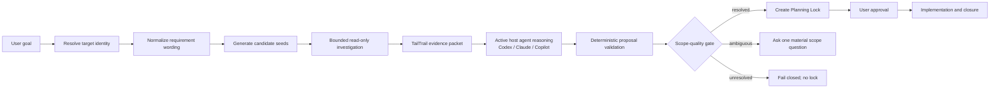

# Navigator Evidence-First Scope Discovery
### NS-1 — Requirement normalization and stable query framing
## Implementation plan

Status: implemented and validated through NS-9
Owner: `tailtrail-core`
Primary product area: Navigator and Task Start
Affected lifecycle boundary: target resolution -> requirement framing -> bounded read-only investigation -> scope-quality gate -> Planning Lock

Companion lifecycle control:
`TAILTRAIL-STOP-RESUME-CONTROL-IMPLEMENTATION-PLAN.md` defines the common
TailTrail kill switch and exact-run reattachment. A stop invalidates late host
scope proposals by attachment generation; it does not make interruption
host-specific.

## 1. Outcome

TailTrail must never freeze implementation scope from filename or goal-word
matching alone. For code-change work, it must combine bounded deterministic
repository evidence with the active host agent's reasoning before creating a
Planning Lock. Codex, Claude, or Copilot should inspect the evidence, reason
about implementation ownership, callers, tests, alternatives, and uncertainty,
and return a typed proposal. TailTrail then validates that proposal against the
repository evidence and its safety rules. If the combined process cannot
identify a supported implementation owner, Start must return
`scope-unresolved` without creating a Planning Lock.

The corrected lifecycle is:



This plan is complete only when CLI, MCP, Codex, Copilot, and Claude produce
the same scope decision from the same repository state and cannot regress to
unsafe lexical-only locking.

## 2. The confirmed defect

This is an architecture problem, not a single ranking-weight bug.

| Current component | Confirmed behavior | Why it fails |
| --- | --- | --- |
| `scripts/navigator_discovery.py::goal_discovered_paths` | Scores path/body word matches, adds fixed `src` and test bonuses, truncates to two paths | Lexical similarity is treated as ownership evidence; `scripts/` receives no source-owner preference and two tests can consume the complete result |
| `scripts/navigator.py::decide` | Promotes discovered paths directly to `likely_impacted_files` with reason `goal-matched target` | A candidate seed becomes proposed scope without a definition, import, caller, registration, or test-to-owner edge |
| `scripts/navigator.py::decide` | Disables deeper graph handling for some `focused_goal_discovery` bug tasks | The exact class of small bug that needs a fast owner trace may skip the control that could disprove a shallow match |
| `scripts/target_workspace.py::assess_plan_fit` | Treats non-`host-cwd` target selection as verified without assessing discovered scope | `--root` proves repository identity, but is incorrectly allowed to stand in for scope confidence |
| `scripts/planning-investigation.py` | Reads only paths already present in the saved Start report and requires a pre-existing run | It can explain a flawed selection but cannot find an implementation owner omitted by that selection |
| `scripts/planning-discussion.py::explain` | Repeats the saved impact reason | It can honestly reveal `goal-matched target`, but it cannot repair the evidence that should have existed before the lock |
| `scripts/requirement_discovery.py::statements` | Treats each non-empty physical line as a requirement boundary | Soft-wrapped natural-language requirements can be fragmented before scope discovery begins |
| `scripts/task-start.py::main` | Creates the Planning Lock after only the current target-fit check | The persistence boundary has no mandatory scope-evidence contract |

The current flow is therefore:

```text
goal words -> top lexical files -> optional graph around those files ->
weak target-fit check -> Planning Lock -> user discovers the scope is wrong
```

The important distinction is:

- `target_identity_confidence` answers: “Is this the intended repository?”
- `scope_confidence` answers: “Do these files own or prove this change?”

They are independent. `--root` may make the first high while the second is
still unresolved.

## 3. Reproduction that must become a permanent regression fixture

Goal:

```text
fix multiline requirement splitting
```

Correct evidence-led result in this repository:

- implementation owner: `scripts/requirement_discovery.py`;
- direct runtime callers: `scripts/task-start.py` and
  `scripts/planning-lock.py`;
- focused proof: `tests/test_requirement_discovery.py`;
- `tests/test_aidlc_requirements.py` is not an implementation owner and must
  not be selected merely because its filename contains `requirements`;
- any additional regression suite must be labelled secondary proof and must
  have a demonstrated affected-contract edge.

The multiline input below must remain one requirement:

```text
Add delivery-address validation without breaking valid
addresses.
```

Explicit bullets, numbered items, blank-line-separated paragraphs,
semicolons, and completed sentences remain legitimate requirement boundaries.

## 4. Product invariants

1. Lexical matches are candidate seeds, never scope evidence by themselves.
2. No code-change Planning Lock is created without at least one supported
   implementation-owner path per change requirement.
3. A test file cannot be the sole implementation scope unless the request is
   explicitly test-only.
4. A documentation file cannot be the sole implementation scope unless the
   request is explicitly documentation-only.
5. Explicit `--changed` paths are authoritative user candidates, not proof
   that every supplied file must be edited.
6. Explicit `--root`, host workspace, and target aliases prove target
   selection only; they never waive the scope-quality gate.
7. Bounded local source reads are permitted before the Planning Lock; source
   edits, tests, builds, scanners, package managers, external calls, Git
   mutations, and generated caches remain prohibited.
8. No raw source body, secret-like content, or raw prompt is persisted in a
   scope receipt. Persist paths, bounded symbols, evidence edges, hashes, and
   decision reasons only.
9. Every included path has a typed role and evidence chain. Every excluded
   high-ranking candidate has an exclusion reason.
10. Explanation, rendering, revision, activation, and closure consume the
    same saved scope decision; none recomputes a different truth.
11. Old saved runs remain immutable. New scope rules never rewrite or silently
    upgrade an existing Planning Lock.
12. If safe discovery cannot resolve ownership, fail closed. Operational
    rollback may disable locking, but must never restore lexical-only locking.

## 5. Requirements

| ID | Requirement | Acceptance condition |
| --- | --- | --- |
| NS-01 | Join soft-wrapped prose before requirement splitting | A newline inside one sentence does not create two `REQ-*` rows; explicit list and paragraph boundaries still split |
| NS-02 | Separate candidate generation from scope selection | `goal_discovered_paths` output cannot be passed directly to `likely_impacted_files` |
| NS-03 | Add bounded pre-lock investigation | Start can read a bounded set of local text files and derive sanitized evidence without creating a run or executing project code |
| NS-04 | Classify repository path roles correctly | Source-checkout `scripts/*.py` can be an implementation owner; installed TailTrail payloads remain managed tooling and are excluded from application scope |
| NS-05 | Trace tests back to implementation | Imports, loader paths, referenced symbols, and module names in a matched test can identify the production module it exercises |
| NS-06 | Trace implementation impact outward | Direct callers, registrations, focused tests, relevant configuration, and manifests are classified separately from the owner |
| NS-07 | Enforce per-requirement scope confidence | Every change requirement has an owner or an explicit unresolved/conflicting decision before locking |
| NS-08 | Keep target identity and scope confidence independent | All resolution sources, including explicit `--root`, pass through the same scope-quality gate |
| NS-09 | Fail closed before persistence | `scope-unresolved` and `scope-conflicting` create no Planning Lock, workflow draft, target receipt, or run directory |
| NS-10 | Persist an exact scope evidence contract | A lockable Start report contains a versioned, schema-valid decision and fingerprint tied to requirements and target identity |
| NS-11 | Explain from the same evidence | “Why this file?” returns its role, evidence chain, confidence, alternatives, and exclusion state without inventing source facts |
| NS-12 | Preserve explicit and non-code requests | Test-only, docs-only, review-only, imported Intent Bridge, and explicit path workflows retain their intended boundaries without unsafe exemptions |
| NS-13 | Preserve Debug Harness safety | Debug Start may perform bounded static orientation, but never reproduction, tests, commands, experiments, or correction before their existing approvals |
| NS-14 | Provide host and MCP parity | CLI and `tailtrail_start` return equivalent scope states, evidence, exit codes, and no-lock behavior across Codex, Copilot, and Claude |
| NS-15 | Add negative learning and evaluation proof | This incident becomes a governed negative example and deterministic evaluation scenario, not an unverified positive learning |
| NS-16 | Bound cost and privacy | Discovery has deterministic file, byte, time, hop, and result caps and never reads sensitive or out-of-root paths |
| NS-17 | Remain dependency-free | Use the standard library and existing graph helpers; add no package or service |
| NS-18 | Ship with migration, observability, rollback, and release proof | Versioned contracts, compatibility readers, metrics, rollback behavior, package proof, and real-run fixtures all pass before enforcement |
| NS-19 | Use active host-agent reasoning | Codex, Claude, or Copilot receives the same bounded evidence contract and proposes requirement scope, ownership, callers, proof, alternatives, and uncertainty without hidden model calls |
| NS-20 | Validate host reasoning deterministically | No host proposal can enter a Planning Lock unless every path is safe, every material claim references evidence, every change requirement has supported ownership, and unresolved uncertainty is preserved |

## 6. Proposed data model

Add `schemas/navigator-scope-evidence.schema.json` with this top-level contract:

```json
{
  "schema_version": "2",
  "type": "tailtrail-navigator-scope-evidence",
  "target_identity_fingerprint": "sha256:...",
  "goal_fingerprint": "sha256:...",
  "state": "resolved",
  "requirements": [],
  "candidates": [],
  "edges": [],
  "host_reasoning": {},
  "limits": {},
  "summary": {},
  "decision_fingerprint": "sha256:..."
}
```

### 6.1 Requirement scope row

Each requirement contains:

- `requirement_id` and durable UID when available;
- `kind`: `change`, `preserve`, `constraint`, or existing supported kind;
- `scope_state`: `resolved`, `needs-confirmation`, `unresolved`,
  `conflicting`, or `not-applicable`;
- `implementation_owners`;
- `inspection_only_paths`;
- `proof_paths`;
- `excluded_candidates`;
- `confidence`: `high`, `medium`, `low`, or `none`;
- `reason_codes`.

The requirement matrix must no longer assign the complete global path list to
every requirement. `requirement_discovery.matrix` should accept a
requirement-to-scope mapping, while a compatibility overload supports old
callers until they are migrated.

### 6.2 Candidate row

Each candidate contains:

- normalized repository-relative `path`;
- `role`: `implementation-owner`, `caller`, `test`, `configuration`,
  `manifest`, `documentation`, `reference`, `generated`, `managed-tooling`, or
  `unknown`;
- `status`: `included`, `inspection-only`, `proof-only`, `excluded`, or
  `rejected`;
- `seed_sources`: `explicit-path`, `fresh-graph`, `lexical-path`,
  `lexical-body`, `module-name`, `symbol-name`, or `repository-structure`;
- `evidence_edge_ids`;
- `confidence` and machine-readable `reason_codes`;
- optional bounded symbol names and content hash;
- no raw source text.

### 6.3 Evidence edges

Supported initial edge types:

| Edge | Strength | Intended use |
| --- | --- | --- |
| `declared-by-user` | strong candidate authority | Honor an explicit path while still classifying its role |
| `defines-symbol` | strong | Identify implementation ownership |
| `imports-module` / `loads-module` | strong | Trace a test or caller to implementation |
| `calls-symbol` | strong or medium by parser confidence | Establish caller impact |
| `registered-by` / `configured-by` | medium | Include wiring/configuration as inspection-only unless a change is required |
| `tested-by` | strong proof relationship | Select focused proof without treating the test as owner |
| `fresh-graph-reference` | strength from saved graph | Reuse current evidence without re-reading unrelated source |
| `same-module-name` | medium seed | Escalate investigation; not sufficient alone to lock |
| `lexical-path-match` / `lexical-body-match` | weak seed | Rank what to inspect only; never satisfy owner confidence |

Evidence strength is rule-based, not an opaque aggregate score. A numeric
diagnostic score may rank reads, but lock eligibility is determined by explicit
rules and reason codes.

### 6.4 Host reasoning proposal

Add `schemas/navigator-host-scope-proposal.schema.json`. TailTrail prepares one
sanitized evidence packet and the active host agent returns:

- `host`: `codex`, `claude`, or `copilot`;
- `proposal_version` and evidence-packet fingerprint;
- per-requirement implementation owners, callers, inspection paths, proof
  paths, excluded candidates, and preservation boundaries;
- an evidence-edge reference for every path and material claim;
- alternatives considered and why they were rejected;
- explicit assumptions and unresolved questions;
- confidence with evidence-grounded reasoning, not unsupported certainty;
- `scope_state`: `proposed-resolved`, `needs-confirmation`, `unresolved`, or
  `conflicting`;
- no raw chain-of-thought. Store only concise decision reasons and evidence
  references.

TailTrail validates the proposal independently. The host cannot approve its own
proposal, create a Planning Lock directly, invent files, waive evidence, or
convert uncertainty into confidence. A missing, malformed, or unsupported host
proposal fails closed.

### 6.5 Scope states and exit behavior

| State | CLI exit | Planning Lock | User-facing result |
| --- | --- | --- | --- |
| `resolved` | `0` | Created | Complete Start report with evidence-backed scope |
| `needs-confirmation` | `2` | Not created | One material question and top differentiated candidates |
| `unresolved` | `2` | Not created | Bounded investigation summary, missing evidence, and safe next input |
| `conflicting` | `2` | Not created | Competing owners and evidence needed to choose |
| `not-applicable` | `0` | Created when the task is legitimately non-code | Docs/test/review boundary stated explicitly |

## 7. Discovery architecture

Create `scripts/navigator_scope.py` as the single owner of evidence collection,
host-proposal validation, and the final scope decision. Keep filesystem candidate enumeration in
`scripts/navigator_discovery.py`; keep task/workflow classification in
`scripts/navigator_core.py`; keep rendering in `scripts/navigator_render.py` or
`scripts/task-start.py`.

This is a hybrid architecture:

```text
TailTrail deterministic kernel
    -> bounded evidence packet
    -> active Codex/Claude/Copilot reasoning
    -> typed host proposal
    -> TailTrail deterministic validation
    -> lockable scope or fail-closed result
```

TailTrail should leverage the reasoning capability already present in the
platform. It must not make a separate hidden model/API call. The same evidence
and output schema keep the three hosts interoperable while allowing each agent
to use its native reasoning quality.

### 7.1 Pipeline

1. Normalize the goal and create requirement statements.
2. Resolve and fingerprint the target repository.
3. Inventory safe text candidates using Git tracking when available, with the
   existing filesystem fallback and managed-pack exclusions.
4. Generate seeds from explicit paths, fresh graph evidence, module/symbol
   terms, repository layout, and lexical matches.
5. Classify each seed's path role before it may influence scope.
6. Read the smallest candidate batch and extract definitions, imports, dynamic
   loader paths, registrations, and referenced symbols.
7. When a seed is a test, follow its import/loader edges to implementation
   before following callers or other tests.
8. When a seed is implementation, follow a maximum of two reverse-reference
   hops to callers and proof paths.
9. Build a bounded host-reasoning packet containing requirements, candidates,
   typed edges, relevant source excerpts or host-readable locations, limits,
   and explicit questions.
10. Ask the active host agent to investigate semantic ownership, compare
    alternatives, and return the typed scope proposal. This is planning work,
    not implementation authority.
11. Validate every host claim against paths, roles, evidence references,
    requirement coverage, and safety boundaries.
12. Produce the final per-requirement scope decision.
13. Run the scope-quality gate.
14. Only a resolved/not-applicable decision flows to Planning Lock creation.

### 7.2 Repository-role classification

Role classification must be repository-aware:

- `tests`, `test`, `spec`, `fixtures`, and test filename conventions are proof
  roots unless the request is test-only;
- `docs`, examples, and Markdown are non-production unless docs-only;
- generated, vendor, build, virtual environment, cache, and dependency trees
  are excluded;
- a source checkout's `scripts/` directory is production when files are
  registered by `tailtrail-registry.json`, packaged by `MANIFEST.in` or
  installation manifests, imported by runtime entry points, or directly
  called by the CLI;
- an installed payload identified by `.tailtrail-install.json` remains managed
  tooling when the surrounding target is an application repository;
- monorepo partitions use the nearest manifest and package root; evidence may
  cross partitions only through an explicit import/configuration edge.

This replaces hard-coded “`src` means production” assumptions with a typed
role decision while retaining `src` as a useful ranking hint.

### 7.3 Safety and cost limits

The pre-lock investigation is static and local:

- at most 20 source files read initially and 12 on one broad escalation;
- at most 12 cache-validation reads (1 MiB) and eight reserved direct-neighbor
  relationship reads, accounted separately from broad source discovery;
- at most 256 KiB per file and 3 MiB total decoded text;
- at most two relationship hops;
- at most 10 implementation-owner candidates retained per requirement and
  three validated evidence-backed alternatives shown in one scope question;
- stop after the first unambiguous owner and sufficient caller/proof evidence;
- reject binary, non-UTF-8, symlink-escaped, credential-named, key/certificate,
  out-of-root, generated, vendored, and managed payload files;
- no subprocess except existing read-only Git inventory/identity commands with
  fixed arguments;
- no project import execution, AST plugin execution, shell expansion, network,
  TailTrail-initiated model/API call, test, build, scanner, package manager,
  cache write, or Git mutation;
- the active host agent may reason over the bounded local packet using its
  existing session; it may use only read-only inspection tools permitted by the
  host and may not execute project commands;
- return the actual limit reached when discovery stops.

The exact constants live in one `InvestigationLimits` dataclass and are emitted
in the evidence contract. Tests override the dataclass, not module globals.

## 8. Planning Lock integration

`scripts/task-start.py` must order operations as follows:

```text
resolve target
enforce enterprise target policy
normalize requirements
run Navigator classification and bounded evidence collection
obtain a typed scope proposal from the active host agent
validate the host proposal against TailTrail evidence and policy
assess target identity and scope quality separately
return no-lock boundary if unresolved/conflicting
build requirement-specific plan and selected controls
create Planning Lock
persist scope evidence + target receipt + Start report atomically
render the complete report
```

Required changes:

- replace `likely_impacted_files` construction from raw `changed` paths with a
  projection of the scope-evidence decision;
- remove the `focused_goal_discovery` rule that suppresses graph escalation;
- keep graph creation/refresh prohibited during Planning Lock, but allow reuse
  of a fresh cache and bounded in-memory static tracing;
- make `target_workspace.assess_plan_fit` always evaluate scope quality,
  regardless of `resolution_source`;
- rename the current fit concepts internally to `target_identity` and
  `scope_quality` so callers cannot confuse them;
- prevent `planning_lock.create`, workflow draft, target-resolution receipt,
  or `.tailtrail/runs/<id>` creation until the decision is lockable;
- include `scope_evidence`, its fingerprint, and schema version in the saved
  Start report and approved anchor;
- validate that fingerprint again during activation; a missing v2 decision on
  a new v2 run is blocking;
- update `input_roles` wording from
  `navigator-discovery-after-planning-lock` to the accurate bounded pre-lock
  inspection boundary.

### 8.1 Rendering

Normal Start output remains concise:

- Scope shows owner, callers/inspection targets, and proof separately;
- each path gets a short evidence label such as `defines target behavior`,
  `direct runtime caller`, or `focused test via import edge`;
- unresolved output does not display an Approval section because there is no
  plan to approve;
- `--verbose` adds the candidate exclusions, evidence edges, limits, graph
  freshness, confidence reasons, and investigation fingerprint;
- Markdown tables use the existing renderer and conformance tests so pipes and
  alignment remain stable.

## 9. Existing feature integration

### 9.1 Interactive Plan Mode

Keep post-lock `planning investigate` for examining already planned paths, but
do not use it as the primary scope-discovery mechanism.

Update it to consume the saved v2 scope evidence:

- allowed paths come from included, inspection-only, and proof-only candidates;
- explanation includes edge IDs and role;
- a requested new path remains a material revision/investigation proposal;
- post-lock investigation cannot silently change scope;
- old v1 runs retain the current planned-path-only behavior.

Update `tailtrail-interactive-plan-mode.md` because its current lifecycle puts
the Planning Lock before all source investigation. The new document must
distinguish automatic bounded pre-lock scope evidence from optional approved
post-lock investigation.

### 9.2 Code Review Graph Lite and Code Graph Mapper

- extract shared path normalization, test detection, token formation, and
  import parsing into reusable helpers without executing project code;
- let Navigator use import/loader evidence in memory without writing a graph
  cache;
- a fresh mapper cache may seed strong evidence only when root, source hashes,
  inventory metadata, and relevant scope match;
- stale/invalid cache is labelled unusable; it is not refreshed before the
  Planning Lock;
- after activation, the existing graph-refresh rule remains in force;
- graph algorithms must support reverse tracing from a test seed to its loaded
  implementation module, not only tracing outward from an assumed changed
  file.

### 9.3 Requirement discovery

Implement soft-wrap normalization before scope terms are derived:

- join adjacent non-empty prose lines when the earlier line does not terminate
  a sentence and neither line is an explicit list item;
- retain bullets, numbered lists, blank lines, semicolons, and complete sentence
  boundaries;
- preserve original goal text in canonical artifacts while using normalized
  text for display and discovery;
- map scope per requirement instead of copying one global path list to all
  rows;
- test POSIX, CRLF, tabs, Markdown bullets, numbered lists, and pasted terminal
  wrapping.

### 9.4 Debug Harness

Debug Start keeps its separate reproduction and correction approvals. The only
change is static orientation quality:

- bounded pre-lock reads may identify investigation candidates and the likely
  owning module;
- they do not prove root cause, approve reproduction, select correction
  symbols, or grant implementation authority;
- Debug reports use `orientation candidate`, never `correction scope`, before
  root-cause proof;
- unresolved static orientation does not invent files; the symptom Planning
  Lock may remain scope-unresolved only if the Debug contract explicitly
  permits a later approved orientation stage;
- build Start remains stricter: code-change scope must resolve before locking.

### 9.5 Intent Bridge and official AIDLC

- imported and official requirement wording remains authority-owned;
- TailTrail may map evidence-backed local paths to those IDs but cannot rewrite
  the requirements;
- Standard/Full question generation remains host-owned;
- unresolved local scope is surfaced as repository evidence, not converted
  into a substitute AIDLC requirement;
- approval of requirements does not waive scope resolution before an
  implementation-stage lock/handoff.

### 9.6 Learning and evaluation

Record this incident as negative evidence only after the new behavior is
validated:

- anti-pattern: lexical test-only matches promoted to implementation scope;
- invalidator: any direct owner/import/caller evidence that changes the result;
- applicability: Navigator code-change scope discovery;
- privacy: no prompt body or source body in the learning record;
- use receipt: future retrieval must show whether the learning actually
  affected a decision;
- evaluation: compare expected and actual owner, excluded false positive,
  scope state, lock creation, and evidence reason codes.

## 10. CLI, MCP, and host contracts

### 10.1 CLI

`tailtrail start` keeps its normal command shape. No new user flag is required.
JSON output gains `scope_evidence`; Markdown renders its concise projection.
Optional diagnostic commands:

```text
tailtrail navigator scope --root <root> --goal <goal> --format json
tailtrail navigator scope explain --root <root> --evidence <artifact-or-run> --path <path>
```

The first is read-only and non-persisting unless it is part of a successful
Start transaction. The second reads a supplied or saved evidence artifact.

### 10.2 MCP

Update `tailtrail_start` and `navigator_plan` schemas and handlers:

- return the same scope states and evidence object as CLI;
- report `local_metadata_only: true` only when a resolved Start actually
  persists metadata;
- report `execution_blocked: true` for every Start outcome;
- on unresolved/conflicting scope, return exit code `2`, `persisted: false`,
  and no `run_id`;
- never mark the read-only investigation itself as project execution;
- add a read-only `navigator_scope_inspect` tool only if `navigator_plan`
  cannot expose the contract without breaking compatibility;
- add a controlled metadata-only `navigator_scope_proposal_record` operation so
  the host can submit the typed proposal against the exact evidence fingerprint;
  it does not approve scope or create a Planning Lock by itself;
- update the legacy controlled-tool registry and MCP conformance fixture
  together if a tool is added.

### 10.3 Codex, Copilot, and Claude

Generated adapters and source templates must state:

- Start prepares bounded deterministic repository evidence before producing the
  plan;
- the active host must use its reasoning capability to investigate ownership,
  callers, proof, preservation boundaries, alternatives, and uncertainty;
- the host must return the same typed proposal contract on Codex, Copilot, and
  Claude, without exposing private chain-of-thought;
- the host must not synthesize unsupported scope or override an unresolved
  TailTrail validation result;
- the host must copy the complete Start or unresolved report;
- no implementation, tests, scanners, or Git work occurs before approval;
- “why this file?” uses saved evidence from the same run;
- all hosts preserve the same run/no-run boundary and exit status.

Run `scripts/sync-adapters.py` through the project-owned update workflow and
validate generated files rather than editing generated adapters independently.

## 11. Implementation phases

Every phase below includes code, schemas, tests, documentation, and exit proof.
No phase is considered complete with TODOs or deferred correctness work.

### NS-0 — Baseline, ownership, and executable reproductions

Status: **implemented and validated (2026-09-02)**. The deterministic fixtures,
passing known-gap comparisons, privacy-safe sealed baseline, shipped schema,
registry ownership projection, package inventory, and freeze-policy approval are
in place. This phase intentionally records the unsafe behavior without changing
Navigator selection or requirement normalization; those corrections begin in
NS-1 and NS-2.

Changes:

- add deterministic fixtures for the TailTrail multiline-splitting incident;
- capture current unsafe behavior as an expected-failure comparison without
  making the release suite permanently red;
- document canonical owners: Navigator owns scope decisions, Target Workspace
  owns repository identity, Code Graph owns relationship evidence, Planning
  Lock persists only validated decisions;
- add a baseline report under `tailtrail-meta/` containing fixture inputs,
  current result, expected result, and versioned fingerprints.

Files:

- new `tests/fixtures/navigator-scope/` fixtures;
- new `tests/test_navigator_scope.py` baseline tests;
- new `tailtrail-meta/navigator-scope-baseline-v1.json` plus schema if it is a
  shipped evidence artifact;
- `tailtrail-registry.json` ownership projection.

Exit criteria:

- fixture reproduces the two false-positive tests;
- fixture asserts the omitted implementation owner and callers;
- no source product behavior changes yet;
- baseline artifact validates and contains no raw source.

### NS-1 — Requirement normalization and stable query framing

Status: **implemented and validated (2026-09-02)**. Soft-wrapped prose is
normalized consistently across LF, CRLF, and CR inputs; explicit list,
paragraph, sentence, and semicolon boundaries remain distinct. Navigator now
uses requirement-specific query frames while persisted Start/Planning Lock
artifacts retain the exact goal. Stable frame IDs and query terms survive every
Start presentation and the approved anchor.

Changes:

- add soft-wrap normalization to `scripts/requirement_discovery.py`;
- preserve explicit structural boundaries;
- expose normalized statements to scope discovery without altering the saved
  exact goal;
- add requirement-specific query terms and stable IDs.

Tests:

- extend `tests/test_requirement_discovery.py` with LF, CRLF, prose wrap,
  bullet, numbered list, blank paragraph, semicolon, and mixed cases;
- assert compact, normal, verbose, Planning Lock, and approved anchor display
  the same rows;
- negative test: “valid” plus newline “addresses” cannot become an orphan
  requirement.

Exit criteria:

- all requirement framing is stable across hosts and newline conventions;
- no existing explicit multi-requirement fixture regresses.

### NS-2 — Typed scope evidence and repository roles

Status: **implemented and validated (2026-09-02)**. Navigator discovery now
returns typed lexical or repository-structure seeds. A central scope domain
normalizes and safety-checks paths, assigns repository roles and candidate
statuses, records bounded provenance, and produces a deterministic v2 evidence
artifact. Compatibility `likely_impacted_files` rows are projections of those
typed candidates; raw lexical strings can no longer enter that surface.

Changes:

- add `scripts/navigator_scope.py` domain types, canonical serialization, and
  deterministic fingerprinting;
- add the v2 JSON schema;
- implement path roles and managed-pack/source-checkout distinction;
- make lexical discovery return seeds with reasons instead of selected paths;
- centralize limits and sensitive-path rejection.

Tests:

- source/test/docs/config/manifest/generated/vendor/managed-tooling roles;
- `scripts/requirement_discovery.py` is production in TailTrail source;
- installed `tailtrail/scripts/*.py` is managed tooling in an application;
- Windows separators, symlinks, case behavior, Unicode names, oversized files,
  binary files, credentials, and traversal attempts;
- schema and fingerprint determinism.

Exit criteria:

- no raw lexical result can construct `likely_impacted_files`;
- every candidate has a role, status, reason code, and evidence provenance.

Implementation notes:

- weak lexical production candidates remain `inspection-only`, while lexical
  tests are `proof-only`; neither establishes an implementation owner;
- explicit source paths may be `included`, but generated, vendor, sensitive,
  unsafe, and installed managed-tooling paths fail closed;
- TailTrail's own `scripts/*.py` files are production only in a source checkout
  identified by package and registry markers;
- architecture, behaviour, and UI inventory additions are reclassified at the
  same typed boundary before Start scope is rendered or persisted.

### NS-3 — Bounded implementation-owner investigation

Status: **implemented and validated (2026-09-02)**. Navigator now performs a
dependency-free, capped static relationship investigation across Python,
JavaScript/TypeScript, Java, C#, and Go. It traces tests to owners, expands
direct callers and focused proof, rejects unrelated lexical matches, consumes
only root/hash-valid graph caches, and emits a source-body-free host packet.
Codex, Claude, and Copilot proposals share one schema and deterministic
validator; unsupported confidence or missing evidence is rejected, proposal
recording writes nothing and grants no authority, and the complete fixture
suite proves file/byte/hop limits and ambiguous/no-owner fail-closed behavior.

Changes:

- implement safe definition/import/loader/registration extraction for the
  languages already supported by graph tooling;
- add reverse test-to-owner tracing;
- add caller/test/config expansion after ownership is found;
- reuse existing graph parsing helpers through a shared module;
- implement fresh-cache reuse and stale-cache rejection without cache writes;
- prepare the versioned host-reasoning evidence packet;
- add host proposal recording and deterministic validation;
- require alternatives, uncertainties, and evidence references in every
  proposal while explicitly excluding private chain-of-thought.

Minimum language fixtures:

- Python import and `importlib.util.spec_from_file_location`;
- JavaScript/TypeScript ES import and CommonJS `require`;
- Java package/import;
- C# namespace/using;
- Go package/import;
- one ambiguous same-name monorepo case;
- one no-owner case.

Exit criteria:

- the core reproduction resolves the implementation module and direct callers;
- irrelevant AIDLC tests are excluded with `lexical-only-no-owner-edge`;
- Codex, Claude, and Copilot independently produce schema-valid proposals from
  the same fixture and converge on the same normalized scope fingerprint;
- a confident but unsupported host proposal is rejected;
- investigation stops within declared caps;
- no code is imported or executed.

### NS-4 — Scope-quality gate and atomic Start integration

Status: **implemented and validated (2026-09-02)**. Target identity and scope
quality are now independent gates. Weak-only, ambiguous, conflicting, or
unresolved code scope cannot reach Planning Lock creation; ambiguity returns
one bounded question, while tests-only and documentation-only requests retain
role-correct valid paths. Resolved Starts bind one verified v2 decision to the
target, requirement matrix, focused validation, saved report, activation, and
approved anchor. Initial persistence rolls back the exact new unapproved run
on failure, and activation rejects evidence tampering or target drift before
creating authority artifacts.

Changes:

- integrate v2 discovery into `navigator.decide` and `task-start.py`;
- split target identity assessment from scope-quality assessment;
- remove explicit-root bypass and focused-bug graph suppression;
- project resolved evidence into requirement-specific scope and validation;
- block persistence on unresolved/conflicting scope;
- persist decision and fingerprint atomically on resolved Start;
- validate the fingerprint during activation and anchor creation.

Tests:

- explicit `--root` plus test-only false matches blocks with no run directory;
- implicit root behaves identically;
- valid explicit `--changed` owner resolves;
- explicit `--changed` test is proof-only unless test-only was requested;
- docs-only and tests-only requests remain valid;
- ambiguous owners ask one bounded question;
- unresolved Start creates no Planning Lock, workflow draft, target receipt,
  learning receipt, or cache;
- a resolved Start contains required sections and v2 evidence fingerprint;
- tampering or target drift blocks activation.

Exit criteria:

- there is no execution path from weak-only code candidates to
  `planning_lock.create`;
- Start persistence is all-or-nothing.

### NS-5 — Explanation, revision, and rendering convergence

Status: **implemented and validated (2026-09-02)**. Saved v2 candidates now
produce one canonical role projection across Start, Navigator, explanation,
bounded investigation, revision, activation, approved anchor, and execution
handoff. Explanations name exact evidence edges and confidence; excluded
lexical candidates and investigation limits appear only in verbose evidence.
Versioned revisions cannot promote proof-only tests, cannot add an unsupported
owner without explicit user scope authority and confirmation, and bind their
new fingerprint to the original Planning Lock without rewriting its v1
artifact. Legacy immutable runs retain their prior discussion and revision
behavior.

Changes:

- update `planning-discussion.py`, `planning-investigation.py`, and
  `planning-revision.py` for v2 roles and evidence edges;
- render implementation owners, inspection paths, and proof paths separately;
- add verbose exclusions and limits;
- preserve v1 behavior for old immutable runs;
- ensure revisions cannot add a path as an owner without evidence or explicit
  user scope authority plus confirmation.

Tests:

- “why this file?” names exact edge and confidence;
- excluded lexical false positive remains visible in verbose evidence but not
  editable scope;
- revision cannot turn a proof-only test into owner silently;
- old v1 run discussion still loads;
- Markdown conformance, table pipes, ASCII banner isolation, and presentation
  policy remain stable.

Exit criteria:

- Start, explanation, revision, activation, and approved anchor agree on every
  path and role.

### NS-6 — Debug, AIDLC, Intent Bridge, and workflow integration

Status: **implemented and validated (2026-09-02)**. Debug Start now binds the
same v2 decision as orientation-only evidence while prohibiting project, test,
graph-helper, scanner, external-provider, and Git commands; reproduction and
correction authority remain separately gated. Intent Bridge and official AIDLC
requirements retain authority-owned IDs, wording, and source revisions while
receiving local owner/inspection/proof mappings by fingerprint. DWR Start
drafts, activation, execution handoffs, and Debug orientation consume that
binding without reclassification. Closure checkpoints compare factual changed
paths with the approved editable union and report unexpected paths as
unresolved drift rather than completion.

Changes:

- apply the static-orientation boundary to Debug Start;
- retain reproduction and correction gates;
- map official/imported requirement IDs to local scope evidence without
  rewriting them;
- bind v2 evidence into DWR start draft and execution handoff;
- add drift checks for actual edits outside included implementation scope.

Tests:

- Debug Start cannot call a command or claim root cause;
- build and debug labels cannot be confused;
- AIDLC Standard/Full question authority remains official-host owned;
- Intent Bridge wording and source revision remain unchanged;
- Lite automatic execution after approval still uses the exact validated
  scope;
- closure reports unresolved scope drift honestly.

Exit criteria:

- all authority routes preserve their existing approvals while consuming one
  scope truth.

### NS-7 — MCP and host conformance

Status: **implemented and validated (2026-09-02)**. MCP scope-aware tools now
compute one JSON transport object and render JSON/Markdown from that same
object while returning the canonical v2 scope contract. Codex, Copilot, and
Claude consume an identical normalized decision fingerprint and role
projection. The versioned host contract adds resolved, unresolved,
conflicting, docs-only, test-only, and Debug Start fixtures; synchronized and
generated adapters reject stale post-lock discovery guidance. Package and
release inventories explicitly include every scope/MCP/host runtime resource,
and transactional plus isolated wheel/sdist tests validate their presence.

Changes:

- update MCP tool schemas, handler metadata, and JSON/Markdown responses;
- update source adapters and regenerate Codex, Copilot, and Claude outputs;
- update package manifests for every new script/schema/fixture required at
  runtime;
- add host contract fixtures for resolved, unresolved, conflicting, docs-only,
  test-only, and Debug Start.

Tests:

- `tests/test_mcp_server.py`;
- `tests/test_host_adapter_conformance.py`;
- `tests/test_host_runtime_conformance.py`;
- `tests/test_enterprise_host_adapters.py`;
- `tests/test_start_entrypoints.py`;
- `tests/test_self_contained_package.py`;
- installation and upgrade tests for transactional Codex/Copilot/Claude
  payloads.

Exit criteria:

- identical normalized decision fingerprints across CLI and all hosts;
- no adapter contains stale “source discovery only after Planning Lock” text;
- packaged installation includes and validates every runtime file.

### NS-8 — Negative assurance, learning, calibration, and observability

Status: **implemented and validated (2026-09-02)**. A sealed, privacy-safe
decision-receipt corpus now covers every relationship language and all declared
negative boundaries. `tailtrail eval scope report` derives only aggregate
fixture metrics, applies zero-tolerance false-scope and host-fingerprint gates,
keeps safe refusal observable without treating it as failure, and produces a
review queue for every false positive or false negative. The incident learning
is an approval-gated Learning V3 `avoid-history` weak note; project retrieval,
conflict, freshness, invalidator, privacy, explicit-use receipt, and later
closure attribution remain mandatory before it can affect work.

Changes:

- add deterministic evaluation scenarios and expected outputs;
- add governed negative-learning candidate and use/closure attribution;
- emit sanitized product metrics only from factual decision receipts;
- add calibration thresholds and false-positive review.

Metrics:

- `weak_only_lock_count` must be zero;
- `test_only_false_scope_count` must be zero for non-test requests;
- `scope_unresolved_rate` by task/language, without treating safe refusal as a
  failure;
- `manual_scope_revision_rate`;
- `owner_precision` and `owner_recall` on committed fixtures;
- investigation files/bytes/hops/duration;
- fresh-graph reuse and stale-graph rejection counts;
- CLI/MCP/host fingerprint mismatch count must be zero.

Exit criteria:

- no metric claims user productivity or causal benefit;
- learning cannot influence a future plan without the existing conflict,
  freshness, invalidator, privacy, and use-receipt gates;
- calibration corpus covers every supported language and negative boundary.

### NS-9 — Migration, release, real-run proof, and rollback

Status: **implemented and validated (2026-09-02)**. New Starts remain v2-only;
the read-only migration audit classifies saved v1 runs as immutable saved
authority without reinterpreting lexical reasons. A sealed repository policy
and one-way emergency environment override can return
`scope-investigation-unavailable` before investigation or persistence, with no
lexical fallback. The versioned release fixture exercises real CLI and MCP
Start parity, exact roles, approval, bounded edit evidence, architecture
assessment, canonical closure, a complete Completion Report, and negative
no-artifact behavior. Transaction rollback restores prior managed payload bytes
without touching saved v2 runs. Package, host, platform, registry, schema, and
operator documentation include the NS-9 assets and WSL compatibility fixture.

Migration:

- new Start reports use scope schema v2;
- readers accept immutable v1 reports but never reinterpret their lexical
  reasons as v2 evidence;
- v1 runs can finish under their saved authority; revisions remain v1 unless a
  user explicitly creates a new Start;
- no background rewrite of `.tailtrail/runs`;
- shadow comparison may log sanitized aggregate differences during development,
  but v1 can never override a v2 unresolved decision.

Release proof:

- build the self-contained package;
- verify package manifest and checksums;
- install cleanly for Codex, Copilot, and Claude on macOS, Linux, Windows, and
  WSL fixtures;
- run fresh install and update-in-place scenarios;
- run the real TailTrail reproduction through CLI and MCP;
- verify resolved evidence, exact included/excluded paths, Planning Lock,
  approval, bounded implementation fixture, evidence recording, closure, and
  Completion Report;
- verify unresolved/conflicting cases produce no run artifacts;
- run full unit, schema, registry, package, host, negative, and release suites.

Rollback:

- a release/config kill switch may force Start to return
  `scope-investigation-unavailable` with no lock;
- it must not restore lexical-only scope or bypass the gate;
- old installed versions remain detectable by doctor/compatibility checks;
- update rollback restores the previous signed payload transactionally, while
  new v2 run artifacts remain readable and are never deleted;
- document operator diagnosis and recovery in `SUPPORT.md` and `INSTALL.md`.

Exit criteria:

- all release gates pass from packaged artifacts, not source-only imports;
- rollback is exercised, not merely documented;
- no TODO, deferred correctness item, unsupported host divergence, or missing
  ownership field remains.

## 12. File-level change map

| File or area | Planned responsibility |
| --- | --- |
| `scripts/requirement_discovery.py` | Soft-wrap normalization and requirement-specific scope input |
| `scripts/navigator_discovery.py` | Safe inventory and candidate seeds only |
| new `scripts/navigator_scope.py` | Evidence extraction, roles, edges, limits, per-requirement decisions, gate |
| new `schemas/navigator-host-scope-proposal.schema.json` | Common contract for Codex/Claude/Copilot reasoning output without private chain-of-thought |
| `scripts/review-graph.py` | Shared deterministic import/reverse-reference helpers; no independent scope truth |
| `scripts/code-graph-mapper.py` | Fresh-cache evidence and reverse test-to-owner support |
| `scripts/navigator.py` | Workflow classification and v2 scope orchestration |
| `scripts/task-start.py` | Correct operation order, no-lock boundaries, atomic persistence, rendering projection |
| `scripts/target_workspace.py` | Separate identity result from scope-quality result; remove explicit-root bypass |
| `scripts/planning-lock.py` | Validate and bind v2 evidence fingerprint into lock/anchor |
| `scripts/planning-discussion.py` | Evidence-backed explanations and exact unknowns |
| `scripts/planning-investigation.py` | Optional post-lock inspection over saved v2 candidates |
| `scripts/planning-revision.py` | Evidence-aware material scope revisions and v1 compatibility |
| `scripts/mcp-server.py` | Equivalent Start and Navigator contracts over MCP |
| `scripts/sync-adapters.py` and adapter sources | Host boundary text; regenerate host artifacts |
| new `schemas/navigator-scope-evidence.schema.json` | Canonical scope contract |
| `schemas/planning-lock.schema.json` and related schemas | v2 fingerprint/reference compatibility |
| `tailtrail-registry.json` | Ownership, files, commands, tests, MCP projection, version |
| `MANIFEST.in`, package metadata, release proof | Ship every new runtime/schema/doc artifact |
| `tailtrail-interactive-plan-mode.md` | Correct pre-lock vs post-lock investigation architecture |
| `USER-GUIDE.md`, `TAILTRAIL-COMMANDS.md`, `MCP-SERVER.md` | User, CLI, and MCP behavior |
| `AGENTS.md`, `CLAUDE.md`, adapter sources | Codex/Claude/Copilot host contract updates |
| focused and conformance tests | Permanent behavioral, security, host, and package proof |

## 13. Validation matrix

| Layer | Required proof |
| --- | --- |
| Unit | Requirement normalization, role classification, evidence edges, limits, confidence gate, serialization, fingerprints |
| Integration | Navigator -> Task Start -> Target Workspace -> Planning Lock ordering and no-lock behavior |
| Graph | Test-to-owner, owner-to-caller, owner-to-test, config wiring, fresh/stale cache behavior |
| Security | Path traversal, symlink escape, sensitive file, binary, oversized input, untrusted import text, command-injection strings |
| Negative | Lexical-only tests, docs-only false owner, ambiguous duplicate modules, no implementation source, stale graph, generated/vendor match |
| Compatibility | Immutable v1 runs, v2 activation, old package detection, upgrade and rollback |
| Presentation | Required sections, table integrity, concise normal output, complete verbose evidence |
| MCP | Tool schema, resolved/unresolved exit behavior, persistence metadata, no hidden execution |
| Host | Codex/Copilot/Claude evidence-packet consumption, typed reasoning proposal, deterministic validation, normalized parity, and complete report copying |
| Cross-platform | POSIX, Windows, WSL paths/newlines/process limits and packaged launchers |
| Performance | File/byte/hop caps, deterministic ordering, bounded duration, large monorepo fixture |
| Release | Registry, schema, package, checksum, install/update, full test suite, real-run proof |

Focused development commands:

```text
python3 -m unittest tests.test_requirement_discovery tests.test_navigator_scope tests.test_navigator_core tests.test_target_workspace -v
python3 -m unittest tests.test_planning_lock tests.test_planning_investigation tests.test_planning_discussion tests.test_planning_revision -v
python3 -m unittest tests.test_mcp_server tests.test_host_adapter_conformance tests.test_host_runtime_conformance tests.test_enterprise_host_adapters -v
python3 -m unittest tests.test_start_entrypoints tests.test_presentation_conformance tests.test_self_contained_package tests.test_installation_experience -v
python3 -m unittest discover -s tests -p 'test_*.py' -v
git diff --check
```

Project-owned registry, schema, packaging, release, and installation commands
must also run according to the current release documentation. Exact commands
and actual outcomes belong in implementation evidence; they must not be
claimed from this plan.

## 14. Definition of done

The work is done only when all of the following are true:

- the original multiline phrase becomes one requirement;
- the original wrong-file reproduction identifies
  `scripts/requirement_discovery.py` as implementation owner;
- direct callers and focused proof are labelled by role;
- `tests/test_aidlc_requirements.py` is excluded unless a real affected edge is
  demonstrated;
- lexical-only candidates cannot create a code-change Planning Lock;
- explicit `--root` cannot bypass scope confidence;
- unresolved/conflicting discovery leaves no run or planning metadata;
- resolved scope evidence is schema-valid, fingerprinted, persisted, rendered,
  explained, revised, activated, and closed consistently;
- Debug, AIDLC, and Intent Bridge authority boundaries remain intact;
- no project source, test, scanner, build, package, network, or Git action runs
  during pre-lock investigation;
- CLI, MCP, Codex, Copilot, and Claude are behaviorally conformant;
- new scripts/schemas/docs are included in clean install and update packages;
- negative learning and evaluation receipts are factual and privacy-safe;
- full test, package, installation, upgrade, rollback, and real-run release
  proof pass;
- documentation describes the shipped behavior with no obsolete post-lock-only
  discovery rule;
- there are no deferred correctness gaps, placeholder TODOs, or unsafe fallback
  paths.

## 15. Explicit non-goals

- No semantic vector database or background indexing service.
- No hidden TailTrail-owned model/API call. TailTrail deliberately uses the
  reasoning capability of the already active Codex, Claude, or Copilot host.
- No storage or demand for private chain-of-thought; only concise reasons,
  alternatives, uncertainty, and evidence references are recorded.
- No execution of repository code during discovery.
- No automatic implementation approval.
- No claim that a static evidence edge proves runtime behavior or root cause.
- No rewriting of old Planning Locks or external requirement sources.
- No new user-required prompt syntax; ordinary task wording remains the default.

## 16. Final architectural decision

TailTrail does not need a larger intent gateway or a second model service to
solve this defect. It should deliberately use the thinking capability of the
active Codex, Claude, or Copilot agent for semantic investigation and planning.
The product still needs a deterministic evidence and validation gateway because
approval, persistence, MCP parity, and release proof cannot depend on an
unsupported conversational judgment.

The durable boundary is therefore:

```text
natural-language intent
    -> normalized requirements
    -> deterministic bounded repository evidence packet
    -> active host-agent reasoning and alternatives
    -> deterministic TailTrail validation
    -> explicit scope-quality decision
    -> Planning Lock
```

That makes TailTrail add value beyond what a coding agent would do by itself:
the investigation becomes repeatable, explainable, approval-safe, portable
across hosts, and impossible to bypass with a shallow lexical match.
