# TailTrail Product Maturity Improvement Plan

Status: proposed for review  
Scope: improvements needed to raise every current product rating below `8/10`  
Principle: consolidate, prove, and simplify before adding another major subsystem

## Executive Summary

TailTrail now has a credible technical foundation: requirement anchors, planning
locks, harness-based verification, drift and recovery controls, AIDLC modes,
Intent Bridge, durable workflows, Debug Harness, MCP tools, token posture,
closure evidence, and guarded learning.

The main risk is no longer a missing idea. The risk is that the ideas appear as
separate commands, artifacts, identifiers, and host-specific behaviors. A user
can see the engineering depth and still struggle to answer three basic
questions:

1. What should I do next?
2. Did TailTrail actually protect this task?
3. Is TailTrail measurably better than using the agent alone?

This plan raises the sub-8 ratings by improving the product around the existing
engine. It intentionally does **not** propose another Harness or another
parallel state system.

```text
Current position
    strong controls + broad feature surface + uneven integration
                         |
                         v
Target position
    one workflow + one state model + consistent hosts + measured proof
```

## Rating Baseline And Targets

These are engineering targets, not marketing claims. A target is reached only
when its exit evidence exists.

| Area | Current | Target | Primary deficiency |
| --- | ---: | ---: | --- |
| Product adoption readiness | 6.3 | 8.2 | Too much product knowledge required from users |
| Developer experience | 5.9 | 8.5 | Commands, IDs, approvals, and artifacts leak into normal use |
| Demonstrated efficacy | 5.8 | 8.3 | Strong design, insufficient independent real-run evidence |
| Maintainability | 6.2 | 8.2 | Large routers, overlapping projections, broad regression risk |
| Host consistency | 6.5 | 8.5 | Codex, Copilot, and Claude can render or route the same intent differently |
| Enterprise readiness | 6.7 | 8.2 | Governance exists, but conformance, operations, and evidence need hardening |
| Learning effectiveness | 7.0 | 8.3 | Safe capture exists, but reuse outcomes and calibration are not yet a closed loop |

Features already rated at or above 8 should be protected from regression:

- core problem fit and product thesis;
- requirements and approval controls;
- Harness and drift architecture;
- evidence integrity and exactness boundaries;
- Debug Harness design;
- privacy-first, local-first operation.

## Product North Star

```text
Make coding agents reliably complete multi-file requirements:
approved intent -> scoped implementation -> computational evidence
-> drift detection -> bounded correction -> safe recovery -> integration proof
```

The daily experience should reduce to six verbs:

```text
start -> discuss -> approve -> continue -> status -> close
```

All advanced systems remain available, but they are selected and explained by
TailTrail. Users should not have to orchestrate AIDLC, Harness lenses, evidence
recorders, continuity packets, workflow transitions, or closure finalizers by
hand during a normal task.

## Target Architecture

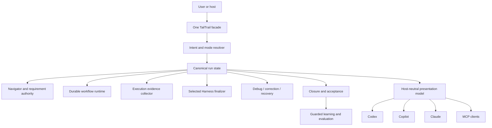

### Architectural rules

1. **One owner per fact.** Requirements, approval, workflow stage, evidence,
   drift, and closure each have one canonical owner. Markdown, dashboards, MCP,
   and host messages are projections.
2. **One mutation path.** CLI, MCP, and host adapters call the same service
   functions and cannot independently recreate lifecycle logic.
3. **One presentation contract.** Hosts render a structured view model; they do
   not summarize raw CLI output into incompatible plans.
4. **Progressive disclosure.** The normal view shows the decision and next
   action. `--verbose` reveals rationale and evidence without changing behavior.
5. **Evidence before learning.** Closure can create a learning candidate only
   from accepted, linked evidence.

## Improvement Stream 1: Developer Experience

### Problem

TailTrail exposes too many internal concepts during normal use: run IDs,
workflow IDs, requirement UIDs, revisions, fingerprints, individual evidence
commands, and lifecycle-specific approval phrases. These identifiers are useful
for audit and debugging, but they should not dominate the everyday path.

### Design

Add a single orchestration façade that resolves the active run and performs the
next legal transition while keeping every existing safety boundary.

```text
tailtrail start "goal"
tailtrail discuss "why is service.py included?"
tailtrail approve
tailtrail continue
tailtrail status
tailtrail close
```

Explicit advanced commands remain supported for automation and diagnosis.

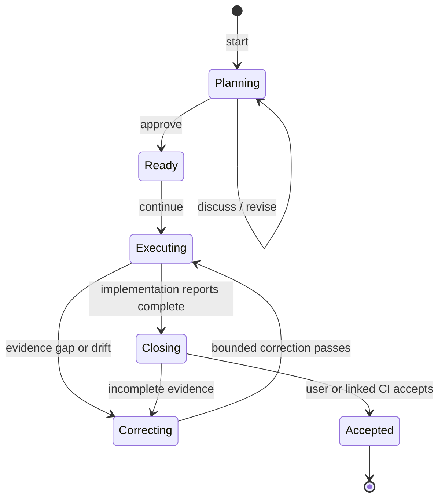

### Example

Before:

```text
tailtrail planning activate --run-id start-... 
tailtrail execution-evidence record ...
tailtrail closure finalize --run-id start-...
tailtrail harness completion-report --run-id start-...
```

Target:

```text
User: Approve this plan.
TailTrail: Plan approved. The first safe slice is ready.

User: Continue.
TailTrail: Implemented the approved slice, collected its receipts, and found
one missing service-path behavior proof. I am starting one bounded correction.

User: Status.
TailTrail: 5/6 requirements complete; one behavior proof is still open.
```

### Implementation details

- Add an application service such as `scripts/orchestration/facade.py`.
- Resolve zero or one active run from canonical state; never guess when several
  active runs exist.
- Map each verb to allowed durable-workflow transitions.
- Return structured `action`, `state`, `summary`, `next_actions`, `audit_refs`,
  and `advanced_refs` fields.
- Keep approval-specific wording in the presentation layer, not state logic.
- Add `--json` for hosts and stable Markdown for terminals.
- Preserve all existing low-level commands as compatibility routes.

### Exit evidence

- A new user completes small-fix and multi-file scenarios using only the six
  verbs.
- Median visible identifiers per normal response is at most one: the run ID.
- No approval, evidence, recovery, or closure boundary is bypassed.
- Usability test participants can identify the next action without reading the
  command reference.

## Improvement Stream 2: Host Consistency

### Problem

The same Start request has previously produced a complete TailTrail report, a
generic agent plan, a collapsed tool result, or a host-authored summary. This is
an integration defect, not merely presentation taste.

### Design

Create a versioned host-neutral response contract and golden conformance suite.

```json
{
  "contract": "tailtrail.presentation.v1",
  "run_id": "start-...",
  "surface": "start-plan",
  "state": "awaiting-approval",
  "sections": [
    {"id": "scope", "rows": []},
    {"id": "requirements", "rows": []},
    {"id": "selected-features", "rows": []},
    {"id": "validation", "rows": []},
    {"id": "approval", "rows": []}
  ]
}
```

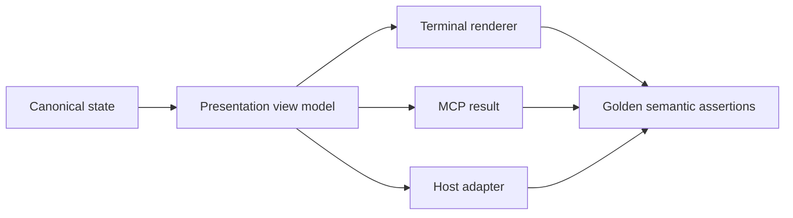

### Implementation details

- Define schemas for Start, AIDLC questions, interactive discussion, Debug,
  status, correction, and Completion Report surfaces.
- Centralize table wrapping, newline normalization, ASCII-banner selection, and
  terminal-width behavior.
- Test semantics, not pixel identity: required sections, row counts, status,
  identifiers, commands, and approval authority must match.
- Add host fixtures for Codex, Copilot, Claude, and raw MCP.
- Make adapters reject an incomplete projection rather than substitute a
  generic plan.
- Add compatibility version negotiation to MCP initialization/status.

### Exit evidence

- All supported hosts pass the same scenario matrix.
- `--verbose` changes detail only; it never removes required sections.
- No host may claim success without showing the canonical report.
- Narrow terminals degrade to lists without corrupting data or Markdown tables.

## Improvement Stream 3: Maintainability

### Problem

TailTrail has accumulated broad routers, many command modules, overlapping
documentation, and multiple state projections. A small change can break Start,
AIDLC, Debug, MCP, closure, or installed packs in unrelated ways.

### Design

Move from command-oriented modules to bounded domain services.

```text
domain/
  planning/
  requirements/
  workflow/
  evidence/
  harness/
  debug/
  recovery/
  closure/
application/
  orchestration/
presentation/
  markdown/
  json/
adapters/
  cli/
  mcp/
  hosts/
```

This is an incremental extraction, not a rewrite.

### Implementation details

- Characterize current behavior before extraction with golden and state-machine
  tests.
- Extract pure classification and rendering functions first.
- Introduce typed data contracts using standard-library dataclasses/TypedDict;
  do not add a framework solely for this refactor.
- Ensure CLI and MCP delegate to identical application services.
- Generate feature registry, command help, MCP inventory, and install manifests
  from canonical metadata where practical.
- Add a documentation reference checker for stale statuses and duplicate owners.
- Publish module budgets: maximum file size is a warning, while dependency
  direction and cyclomatic hotspots are actionable review signals.
- Require a characterization fixture for every migrated command.

### Example extraction

```text
Before:
task-start.py classifies + reads state + selects features + renders Markdown

After:
planning/classifier.py       -> PlanningDecision
application/start.py         -> StartPlanView
presentation/markdown.py     -> terminal text
adapters/cli/start.py        -> argument parsing only
```

### Exit evidence

- Critical CLI and MCP routes share one application call per capability.
- Core orchestration modules have clear import direction and no cycles.
- Changed behavior is covered by golden, schema, and state-transition tests.
- Installed-pack smoke tests run for all supported profiles.
- A feature can be added to registry, CLI, MCP, docs, and installation without
  editing several independent taxonomies.

## Improvement Stream 4: Demonstrated Efficacy

### Problem

Curated fixtures prove deterministic evaluation machinery, but they do not yet
prove TailTrail improves real agent delivery. Self-authored scenarios can hide
selection bias, false interventions, and workflow cost.

### Evaluation model

Run paired, blinded, repeatable tasks against real public repositories or
sanitized enterprise fixtures.

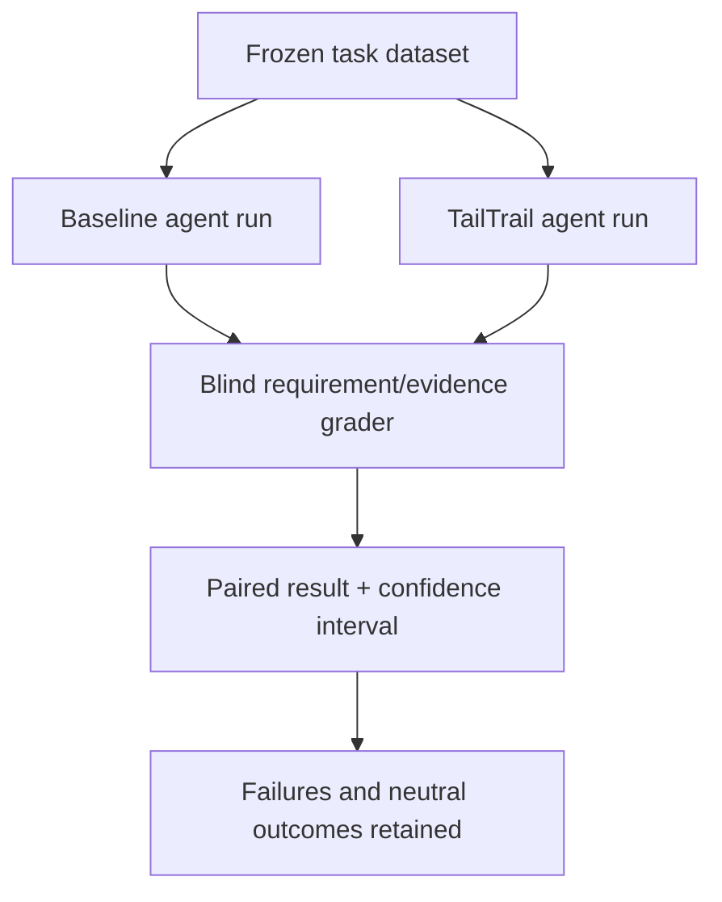

### Required task classes

1. focused bug fix;
2. multi-file feature;
3. API/contract change;
4. user-facing behavior journey;
5. refactor with preservation constraints;
6. dependency decision;
7. CI or release failure;
8. infrastructure/configuration change;
9. ambiguous requirement needing clarification;
10. Debug Harness investigation and bounded correction.

### Metrics

| Metric | Why it matters |
| --- | --- |
| Requirement completion | Measures the core product promise |
| Missed callers/tests/contracts | Measures impact-map effectiveness |
| Unapproved changed scope | Measures drift control |
| Correction cycles | Measures convergence cost |
| False interventions | Measures TailTrail-created friction |
| Human review minutes | Measures reviewer toil |
| Validation tiers completed | Measures proof quality |
| Tokens, when provider-measured | Measures context cost without guessing |
| Wall time and tool calls | Measures operational overhead |

### Implementation details

- Version task fixtures and expected requirement matrices.
- Randomize baseline/TailTrail ordering for graders.
- Preserve failures, timeouts, user interventions, and neutral results.
- Separate local token estimates from provider-measured usage.
- Record environment, model, host, version, repetition number, and dataset hash.
- Require multiple repetitions before claiming a trend.
- Publish raw sanitized receipts and scoring rules with the aggregate report.
- Add a `false_intervention` taxonomy: unnecessary approval, unnecessary AIDLC,
  irrelevant Harness, incorrect file selection, and avoidable recovery.

### Exit evidence

- At least 15 realistic tasks across at least 3 repositories.
- At least 3 repetitions per variant where cost permits.
- Blind grading and versioned rubrics.
- Both wins and regressions visible.
- Claims restricted to measured task classes and confidence level.

## Improvement Stream 5: Enterprise Readiness

### Problem

TailTrail has strong local governance concepts, but an enterprise needs
repeatable installation, policy ownership, access boundaries, upgrade safety,
CI evidence, compatibility statements, and operational support expectations.

### Design

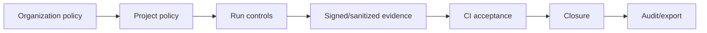

### Implementation details

- Define policy precedence and immutable safety minimums.
- Add install/update/rollback receipts with manifest hashes.
- Add a compatibility matrix covering OS, Python, host, pack profile, MCP
  protocol, and AIDLC pack revision.
- Add CI ingestion authenticity fields and reject unlinked receipts.
- Define retention and deletion controls for `.tailtrail` artifacts.
- Add sanitized export profiles for developer, reviewer, auditor, and platform
  owner.
- Add threat-model tests for path traversal, symlink escape, hostile artifacts,
  command injection, untrusted provider JSON, and sensitive-data leakage.
- Define support boundaries and migration policy for schemas and commands.
- Provide a deterministic conformance bundle enterprises can run offline.

### Exit evidence

- Clean install, update, verify, and rollback tests on Windows, macOS, and Linux.
- Codex, Copilot, Claude, and MCP compatibility receipts.
- Policy conflicts fail closed with an actionable explanation.
- Audit export contains no raw prompt, source, secret, PII, or unapproved log.
- Schema migrations are backward-compatible or have a tested migration path.

## Improvement Stream 6: Product Adoption Readiness

### Problem

TailTrail currently explains the system before letting users feel the value.
Adoption requires outcome-first onboarding and a clear escalation path from a
small task to advanced control.

### Three-layer experience

| Layer | Audience | Visible concepts |
| --- | --- | --- |
| Quick path | New user | run ID, goal, bifurcated requirements, selected AIDLC mode, likely scope, selected features, focused validation, compact token posture, approval, result |
| Guided path | Regular user | everything in Quick plus requirement-to-impact matrix, dependencies, preservation rules, evidence tiers, selected/deferred Harnesses, AIDLC reasoning/questions, Code Graph freshness, drift, recovery, implementation slices, and token breakdown |
| Expert path | Platform/reviewer | everything in Guided plus requirement UIDs, workflow/target identities, revisions, fingerprints, schemas, receipt references, MCP decisions, policy versions, detailed token ledger, and calibration history |

The layers change presentation depth only. They must use the same canonical
requirements, AIDLC mode, approved scope, selected controls, evidence
expectations, approval authority, and workflow state.

### `--verbose`: complete-plan contract

`--verbose` overrides the default presentation depth for **every** layer. It
must render the complete comprehensive canonical plan. It does not switch the
task into Expert control, change the selected AIDLC mode, grant approval, run a
tool, inspect additional source, or alter workflow authority.

```text
Quick + default    -> concise complete planning contract
Guided + default   -> explanatory planning contract
Expert + default   -> explanatory contract plus audit references
Any layer + verbose -> full comprehensive plan projection
```

The verbose Start plan must include every applicable section:

1. banner and report identity;
2. Planning Lock, run ID, target identity, and current state;
3. goal and normalized task classification;
4. bifurcated requirements with IDs and concise statements;
5. requirement dependencies, ordering, and delivery slices;
6. requirement-to-impact matrix;
7. likely files, callers, tests, contracts, configuration, infrastructure, and
   documentation scope;
8. preservation constraints and explicit exclusions;
9. AIDLC mode, authority, selection source, and selection reasoning;
10. AIDLC questions, options, recommendations, and recommendation reasoning
    when the active mode/stage requires them;
11. selected TailTrail features in a row-by-row table, including activation
    reason and intended use;
12. deferred/armed TailTrail features, trigger condition, and current reason
    they have not run;
13. Architecture, Behaviour, Maintainability, Requirement Completion,
    Evidence-Aware Testing, Context Continuity, Recovery, and Program Delivery
    posture when applicable;
14. Code Graph source, freshness, evidence labels, and refresh requirement;
15. implementation plan and first approved slice boundary;
16. focused validation commands plus required unit, integration, contract,
    behavior, infrastructure, migration, rollout, or release tiers;
17. evidence posture and exactness boundaries;
18. drift posture, correction policy, and recovery readiness;
19. token estimate, estimate range/basis, context budget, reduction strategy,
    exact content retained, actual-token telemetry availability, and later
    calibration path;
20. approval gate, permitted responses, and exact next action.

An inapplicable section must not silently disappear. It should render a compact
status such as `not selected`, `not applicable`, `not triggered yet`, or
`unavailable because host telemetry is not linked`, with its reason. This lets
the user distinguish an intentional boundary from a broken renderer.

Example token section in every verbose plan:

| Token measure | Value | Evidence / boundary |
| --- | --- | --- |
| Estimated focused context | `10K-14K` | Local pre-execution estimate |
| Context budget | `16K` | Active planning policy |
| Reduction strategy | Graph-scoped selection | Exact source remains retrievable |
| Must remain exact | Requirements, source, policy, diff, test evidence | No lossy reduction |
| Actual model tokens | Unavailable before linked telemetry | Never inferred from estimate |
| Calibration | Pending completion telemetry | Same run and comparable stage only |

### Verbose completeness validation

Do not validate verbose output by checking headings alone. Add a structured
completeness contract:

```json
{
  "surface": "start-plan",
  "verbosity": "verbose",
  "required_sections": ["planning-lock", "requirements", "impact-matrix", "aidlc", "selected-features", "deferred-features", "delivery", "validation", "evidence", "drift-recovery", "tokens", "approval"],
  "rendered_sections": ["..."],
  "missing_sections": [],
  "status": "complete"
}
```

The host adapter must fail clearly when `missing_sections` is non-empty. It
must not replace the incomplete TailTrail report with a generic host-authored
plan.

### Implementation details

- Installation ends with `hello`, `doctor`, and one repository-specific example.
- Add `tailtrail demo small-fix` that runs on a bundled safe fixture.
- Make README task-first: install, first task, plan approval, status, closure.
- Move deep architecture to linked docs.
- Add problem-to-command recipes rather than feature-first catalogs.
- Add `tailtrail explain this-report` for unfamiliar terms in current output.
- Treat `--verbose` as a complete-plan projection at every presentation layer;
  add structured missing-section validation and host conformance fixtures.
- Instrument local, privacy-safe friction metrics only when explicitly enabled:
  commands per completed run, approval count, abandoned runs, correction count,
  and time to first valid plan.

### Exit evidence

- A clean-machine user reaches a valid Start plan in under five minutes.
- A first task does not require reading AIDLC, Harness, MCP, or schema docs.
- Advanced evidence remains one command/link away.
- Abandoned-run and redundant-approval rates fall in usability trials.
- Quick, Guided, and Expert modes produce the same comprehensive canonical
  plan when `--verbose` is supplied.
- Every applicable verbose section contains data, while every inapplicable or
  unavailable section contains an explicit status and reason.

## Improvement Stream 7: Learning Effectiveness

### Honest current assessment

TailTrail's learning **governance** is stronger than its learning
**effectiveness**.

| Learning dimension | Current assessment | Reason |
| --- | ---: | --- |
| Privacy and safety | 8.8 | Local-first, sanitized candidates, explicit promotion, no raw prompt/source/log storage |
| Evidence gating | 8.2 | Closure, acceptance, confidence, and stale/suppression controls exist |
| Capture coverage | 7.4 | Closure, drift, Debug, quality, token, and graph signals exist, but use different paths |
| Retrieval precision | 6.8 | Tags, paths, task type, graph hints, and confidence help, but applicability is still coarse |
| Outcome feedback | 5.8 | Reusing a learning does not yet create a complete apply-to-outcome receipt |
| Calibration | 6.0 | Scores are deterministic but not sufficiently calibrated against later success or harm |
| Contradiction handling | 6.8 | Refresh and suppression exist, but conflicting lessons lack a first-class resolution lifecycle |
| Overall learning effectiveness | 7.0 | Safe foundation; incomplete evidence-backed improvement loop |

This distinction matters. A safe learning store that does not improve future
decisions is an archive. An aggressive learner without safety controls is a
liability. TailTrail needs both safety and demonstrated utility.

### Current learning flow

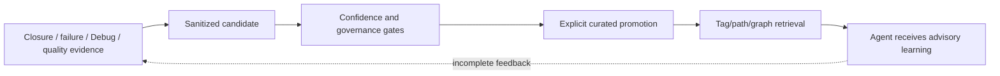

The dotted edge is the main weakness. TailTrail does not yet consistently know:

- whether the retrieved learning was actually shown to the agent;
- whether the agent used, ignored, or rejected it;
- which requirement or decision it influenced;
- whether the later requirement, test, drift, and review evidence improved;
- whether it caused a false intervention or repeated an obsolete pattern.

### Target learning loop

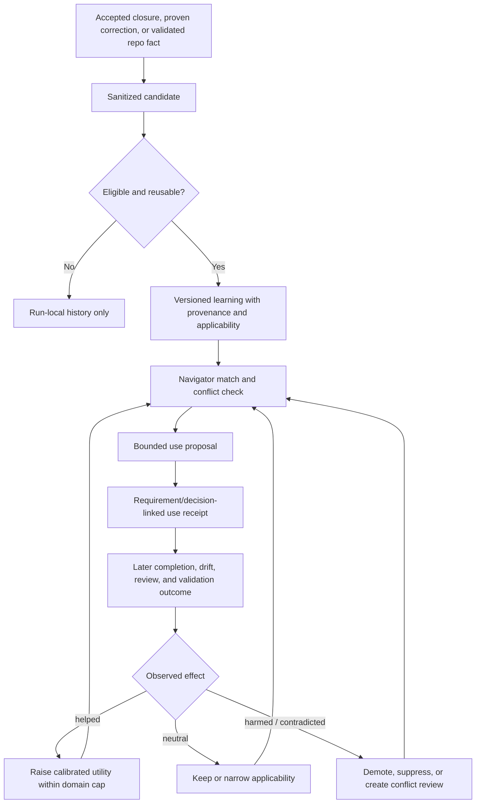

### Learning classes

Learning should not be treated as one undifferentiated confidence score.

| Class | Example | Default lifetime | Revalidation |
| --- | --- | --- | --- |
| Repository fact | `pytest` command and test directory | Until manifest/config fingerprint changes | Deterministic file/config check |
| Architecture constraint | Payments go through the existing adapter | Until mapped symbols or ownership change | Code Graph + architecture assessment |
| Requirement pattern | Retry effects require stable idempotency identity | Domain-capped | Similar accepted requirement and behavior proof |
| Failure avoidance | Do not retry after an accepted timeout with a new request key | Shorter, failure-domain scoped | Reproduction + regression evidence |
| Workflow guidance | This repo requires contract proof for API changes | Policy/workflow scoped | Policy and CI evidence |
| Product learning | Behaviour Harness missed a selected scenario | Cross-repo only after repeated sanitized evidence | Evaluation/Meta-Harness gate |

Each class needs its own applicability, expiry, evidence threshold, and
promotion ceiling. A confirmed local test command should not be scored like a
cross-repository design recommendation.

### Canonical learning contract

Add one versioned learning record that references source evidence without
copying sensitive bodies.

```json
{
  "schema": "tailtrail.learning.v3",
  "learning_id": "learn-5f2c9a",
  "version": 2,
  "class": "failure-avoidance",
  "statement": "Reuse the accepted payment request identity after an acknowledgement timeout.",
  "scope": {
    "project_frame": "project-sha256:...",
    "domains": ["payments", "idempotency"],
    "task_types": ["bug", "debug"],
    "symbols": ["payment-adapter:charge"],
    "requirement_kinds": ["behavior", "preservation"]
  },
  "provenance": [
    {
      "run_id": "start-...",
      "requirement_uid": "req-...",
      "closure_ref": "closure-sha256:...",
      "acceptance": "trusted-ci"
    }
  ],
  "utility": {
    "uses": 3,
    "helped": 2,
    "neutral": 1,
    "harmed": 0,
    "calibration": "limited-local-evidence"
  },
  "freshness": {
    "created_at": "...",
    "last_validated_at": "...",
    "invalidators": ["adapter-symbol-change", "payment-policy-change"]
  },
  "state": "candidate"
}
```

Safety rules:

- store references and categorical evidence, not raw source, prompts, logs,
  secrets, identities, or customer data;
- keep the source closure/checkpoint retrievable only inside its local run;
- use stable project frames, not repository names, in portable metadata;
- do not turn user acceptance alone into proof;
- never let a learning override current source, policy, tests, CI, security, or
  the user's explicit requirement.

### Requirement-linked use receipt

Retrieval alone is not evidence of value. When Navigator elects to use a
learning, record a small receipt:

```json
{
  "type": "tailtrail-learning-use",
  "run_id": "start-...",
  "learning_id": "learn-5f2c9a",
  "learning_version": 2,
  "requirement_uids": ["req-02"],
  "decision": "applied",
  "influence": "preservation-rule",
  "match_reasons": ["same-domain", "same-adapter-symbol", "same-failure-class"],
  "pre_use_confidence": "candidate",
  "content_exposed": "sanitized-statement-only"
}
```

Allowed decisions are `applied`, `advisory-only`, `ignored`, `rejected`, and
`blocked-stale`. Recording `ignored` or `rejected` prevents TailTrail from
mistaking retrieval count for usefulness.

### Outcome attribution

At closure, join each use receipt to requirement and control outcomes:

| Outcome signal | Interpretation |
| --- | --- |
| Requirement complete, relevant proof passes, no related drift | Potentially helped; still not causal proof |
| Requirement complete but learning did not affect a decision | Neutral |
| Same failure recurs | Learning insufficient, misapplied, or too broad |
| New related drift appears | Possible harm; demote pending review |
| User/agent rejects advice with evidence | Narrow, amend, or suppress |
| Current source/policy contradicts it | Immediately stale; do not retrieve |

TailTrail should use the term **observed association**, not causal improvement,
unless a controlled evaluation supports causality.

### Retrieval and applicability improvements

Navigator should retrieve at most three candidates after it has a task frame
and requirement boundary. Ranking should use:

```text
applicability = domain match
              + requirement-kind match
              + symbol/caller match
              + project-frame match
              + evidence strength
              + observed utility
              - age/invalidator risk
              - contradiction penalty
              - prior harm/false-intervention penalty
```

Required behavior:

- do not retrieve before the task and project frame are known;
- prefer exact project facts over general patterns;
- show why a learning matched;
- retrieve the sanitized statement, not full learning history;
- cap results and context size;
- if two high-ranked learnings conflict, retrieve neither as instruction—show
  a conflict decision instead;
- record zero-match explicitly so learning coverage can be measured honestly.

### Contradiction and amendment lifecycle

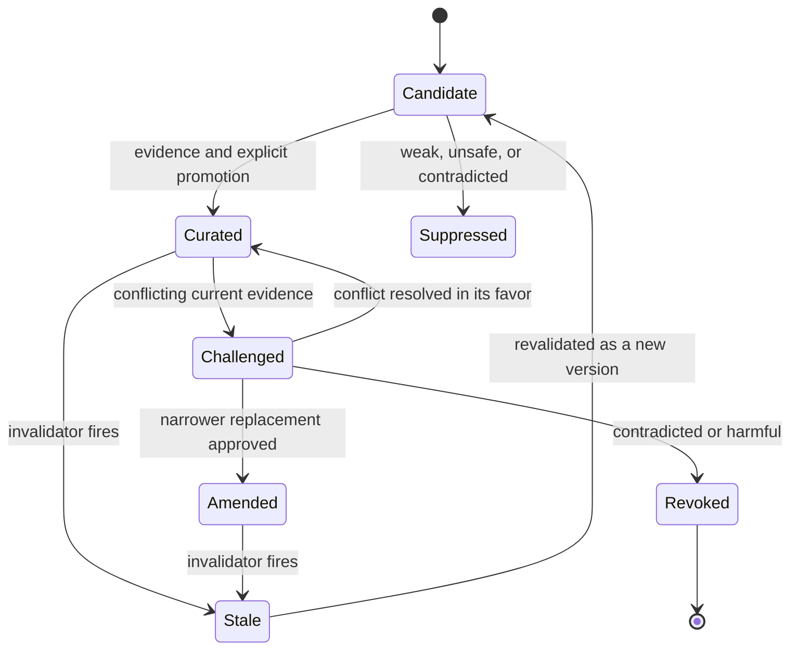

Do not edit a historical learning in place. An amendment creates a new version
and links `supersedes`; revocation preserves provenance and prevents retrieval.

### Integration points

| TailTrail system | Learning responsibility |
| --- | --- |
| Navigator | Retrieve after task framing; explain match; create use proposal |
| AIDLC | Reuse only validated project facts and prior approved decisions; never answer unresolved questions from learning |
| Intent Bridge | Source-owned requirements outrank learned patterns |
| Context Continuity | Same-run failed attempts stay continuity evidence until accepted closure; not cross-run learning |
| Requirement Completion Harness | Link use receipts to requirement outcomes |
| Architecture/Behaviour/Maintainability Harnesses | Supply domain-specific outcome and contradiction evidence |
| Debug Harness | Promote only proven cause/resolution class after accepted closure |
| Token Harness | Measure retrieval context cost and keep exactness boundaries |
| Closure | Attribute observed outcomes and create candidate updates |
| Evaluation Harness | Measure learning-on versus learning-off outcomes |
| Meta-Harness | Propose TailTrail product changes only from repeated sanitized findings |

### Learning-specific evaluation

Add controlled saved-artifact and real-run scenarios:

1. correct learning available and applicable;
2. correct learning available but irrelevant;
3. stale learning after source change;
4. two contradictory learnings;
5. prior learning caused a false intervention;
6. no learning exists;
7. same failure recurs after advice;
8. amended learning supersedes an older version.

Measure:

- retrieval precision and recall against labeled applicability;
- stale-learning block rate;
- conflict detection precision;
- requirement completion delta;
- correction-cycle delta;
- false-intervention delta;
- token/context overhead;
- human review time;
- percentage of retrieved learnings actually applied;
- percentage later narrowed, demoted, or revoked.

### Exit evidence

- Every retrieved learning has a match explanation and use decision.
- Closure links use receipts to observed requirement/control outcomes.
- Stale and conflicting learning cannot silently steer Navigator.
- Learning-on/off evaluation includes negative and neutral outcomes.
- At least 20 learning-use receipts exist across multiple task classes before
  claims about improved delivery are made.
- No private data or exact source is copied into portable learning artifacts.

## Cross-Cutting Correction: Canonical Stage Integration

This is the highest-leverage technical correction. TailTrail currently has
useful artifacts that may be created without advancing the canonical workflow.
That is honest, but confusing. Every authorized mutation should emit one stage
result consumed by the durable runtime.

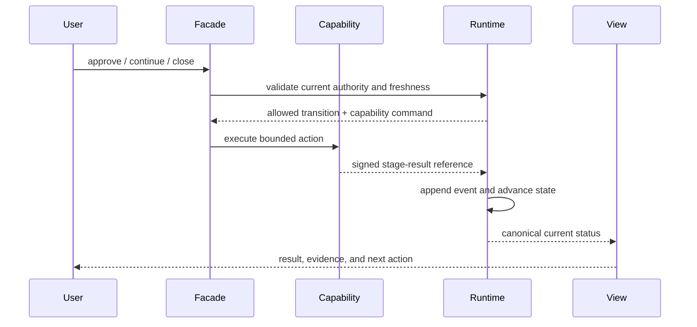

Required behavior:

- an artifact alone never advances state;
- an authorized stage result always records whether it advanced, stayed, or
  failed;
- retries are idempotent;
- stale results are rejected;
- projections never become a second source of truth;
- closure cannot skip incomplete selected controls.

## Implementation Phases

### PM-0 — Baseline And Freeze — implemented

Priority: P0  
Target ratings: all

- Freeze new top-level features during this program.
- Capture the current command, MCP, state, schema, and host inventories.
- Establish baseline usability and regression scenarios.
- Record the current sub-8 ratings and evidence behind them.
- Define deprecation rules and compatibility windows.

Exit: one signed/versioned baseline report and no ambiguous capability owner.

Delivered implementation:

- `scripts/product-maturity.py` provides `maturity baseline`, `inventory`,
  `validate`, and `status` through the public CLI.
- `tailtrail-meta/product-maturity-baseline-v1.json` is the committed,
  versioned baseline. It inventories top-level commands, MCP tools, schemas,
  state-related schemas, hosts, registered features, canonical ownership,
  ratings below 8, and baseline usability/regression scenarios.
- The baseline carries a deterministic SHA-256 integrity seal over canonical
  JSON. This detects modification but is deliberately not described as an
  organizational identity signature.
- `tailtrail-meta/product-maturity-policy-v1.json` freezes new commands, MCP
  tools, schemas, hosts, feature IDs, and ownership domains unless a named
  approval with a reason is recorded.
- The policy defines a minimum two-release compatibility window and requires a
  replacement and reason before a public surface is removed.
- `benchmarks/product-maturity/pm0-scenarios-v1.json` establishes Quick,
  Guided, Expert, verbose, AIDLC, hands-free correction, Debug, closure-gap,
  and host-conformance baselines.
- `schemas/product-maturity-baseline.schema.json` defines the baseline artifact
  contract.
- `tests/test_product_maturity.py` proves integrity, freeze drift detection,
  ownership uniqueness, scenario coverage, CLI routing, and approval-gated
  baseline replacement.
- The Feature Registry and installer/check surfaces include PM-0.

Commands:

```powershell
py -3 scripts\tailtrail.py maturity baseline
py -3 scripts\tailtrail.py maturity inventory --format json
py -3 scripts\tailtrail.py maturity validate
py -3 scripts\tailtrail.py maturity status
```

Replacement is an explicit governance action:

```powershell
py -3 scripts\tailtrail.py maturity baseline --write --approved
```

The freeze inventories public names rather than source-content hashes. PM-1
through PM-7 and PM-L0 through PM-L5 may therefore refactor or fix existing
implementations without false drift. New top-level product surfaces require an
approved policy entry first.

PM-0 exit interpretation: the local baseline is versioned and integrity-sealed
and every canonical domain has one owner. Organization-identity signing is not
fabricated; it remains part of configured enterprise release attestation.

### PM-1 — Canonical Ownership And Stage Results — Implemented

Priority: P0  
Target ratings: maintainability, host consistency, enterprise readiness

- Complete the owner matrix for requirements, approval, workflow, evidence,
  drift, recovery, closure, tokens, and learning.
- Define a common stage-result schema.
- Route mutations through the durable runtime.
- Add freshness, idempotency, and stale-result tests.

Exit: every production mutation has one canonical state transition or an
explicit non-transition result.

#### Implemented design

PM-1 reuses the Durable Workflow Runtime as the only transition authority. It
does not add a second state machine. The product-maturity inventory now requires
the canonical domains for requirements, approval, workflow, evidence, drift,
recovery, closure, tokens, and learning, and every owner row identifies the
Durable Workflow Runtime as its transition authority.

`schemas/workflow-stage-result.schema.json` defines the common closed result
envelope. A result contains the workflow/run/stage identities, capability and
requirement UIDs, idempotency key, categorical outcome, freshness posture,
evidence references, and exactly one of these forms:

- `transition`: references the exact append-only durable event, including its
  event ID/hash and before/after state;
- `non-transition`: records a stale or duplicate boundary without pretending
  that workflow state advanced.

Results are saved under:

```text
.tailtrail/workflows/<workflow-id>/stage-results/<stage-id>/wfsr-<digest>.json
```

The filename is deterministic from workflow, stage, idempotency key, and result
kind. Replaying the same result returns `duplicate-suppressed`; attempting to
reuse that key for different semantics fails closed. Adapter pass/fail/blocked
outcomes, approved skips, approval-gate completion, and stale dispatch attempts
now pass through this result recorder. Existing executor response contracts are
preserved.

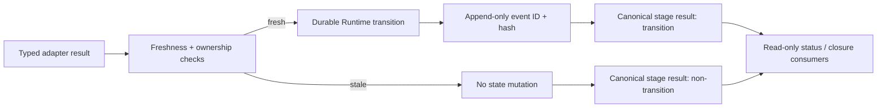

Focused coverage validates ownership completeness, closed schema enforcement,
transition result creation across workflow templates, explicit stale results,
approved skip results, and idempotent duplicate suppression. The installation
pack includes the runtime module and schema.

### PM-2 — One Orchestration Façade — Implemented

Priority: P0  
Target ratings: developer experience, adoption readiness

- Implement `start`, `discuss`, `approve`, `continue`, `status`, and `close` on
  the common application service.
- Resolve the active run safely.
- Preserve advanced commands as compatibility aliases.
- Add progressive disclosure and clean next-action messages.

Exit: representative workflows complete through the six-verb surface without
manual internal artifact commands.

#### Implemented design

`scripts/orchestration_facade.py` is the common application service for the
six normal verbs. It delegates to the existing canonical owners instead of
copying their state:

| Verb | Canonical service | Mutation boundary |
|---|---|---|
| `start` | Navigator + Planning Lock | planning artifacts only |
| `discuss` | Interactive Plan Mode | sanitized saved-plan receipt only |
| `approve` | Planning Lock or exact Durable Runtime stage approval | exact reviewed plan/stage only |
| `continue` | Durable Runtime executor and typed adapter bridge | one dependency-ready stage |
| `status` | Planning Lock + workflow projection | read-only |
| `close` | Closure Finalizer | evidence-backed closure and acceptance |

Users may use the explicit grouped surface:

```powershell
tailtrail flow start "fix the validation defect"
tailtrail flow discuss --run-id <run-id> --question "Why is this file selected?"
tailtrail flow approve --run-id <run-id>
tailtrail flow continue --run-id <run-id>
tailtrail flow status --run-id <run-id>
tailtrail flow close --run-id <run-id>
```

Direct aliases are also available for `start`, `discuss`, `approve`,
`continue`, and `close`. The existing installer meaning of bare `tailtrail
status` is preserved; task status uses `tailtrail status --run-id <run-id>` or
`tailtrail flow status`.

The resolver selects a run only when exactly one eligible local run exists.
Multiple candidates produce an explicit list and require `--run-id`; TailTrail
never guesses. `approve` is context-aware: it activates an awaiting Planning
Lock, or creates a requirement/action-bound approval for the exact next frozen
stage. `continue` prepares only the next dependency-ready stage. When a stage
is running, a host supplies a factual typed result with `--result-ref`; the
façade records and finalizes it through the existing adapter/executor path.

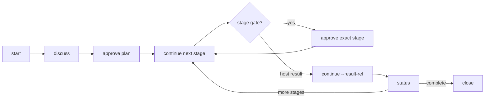

Advanced `planning`, `workflow`, `adapters`, `execution-evidence`, and
`closure` commands remain compatibility and diagnostic surfaces. PM-2 does not
remove them or weaken their approval, freshness, evidence, privacy, or closure
rules.

### PM-3 — Presentation And Host Conformance

Priority: P0  
Target ratings: host consistency, developer experience

Status: **Implemented**

- Add the presentation schema and shared renderers.
- Create host golden fixtures and semantic assertions.
- Cover narrow terminal, Markdown, collapsed tool output, and MCP JSON cases.
- Fail explicitly when a host cannot display the canonical report.
- Add a verbose completeness validator that compares applicable required
  sections with rendered sections and rejects silent omissions.
- Prove that Quick, Guided, and Expert routing render the same comprehensive
  plan data under `--verbose`.

Exit: all supported hosts pass the same plan/debug/closure scenario matrix.

#### Implemented design

PM-3 adds one semantic presentation contract and makes rendering a projection
of that contract. Hosts no longer decide which applicable sections are safe to
omit.

| Capability | Implementation | Boundary |
| --- | --- | --- |
| Canonical contract | `schemas/presentation-report.schema.json` defines report kind, experience mode, verbose posture, required section IDs, and explicit section availability. | Presentation metadata only; it does not own workflow state. |
| Shared renderer | `scripts/presentation.py` validates and renders Markdown, narrow-terminal Markdown, MCP JSON, and an explicit collapsed-output refusal. | Invalid or incomplete reports fail instead of being reconstructed. |
| PM-2 integration | `scripts/orchestration_facade.py` renders `discuss`, `approve`, `continue`, `status`, and `close` through the shared renderer. | The canonical PM-2 services still own actions and state. |
| Host semantics | Codex, Copilot, Claude, CLI, and MCP use the same section IDs and availability states. | Golden fixtures are deterministic conformance evidence, not proof of a live host session. |
| Verbose completeness | Every required applicable section must exist. Unavailable or inapplicable sections remain visible with a reason. | Quick, Guided, and Expert may differ in ordinary progressive disclosure, but `--verbose` may not lose semantic data. |
| MCP inspection | `presentation_conformance` returns the same deterministic matrix as `tailtrail presentation conformance`. | Read-only; it neither controls a host nor claims live display success. |

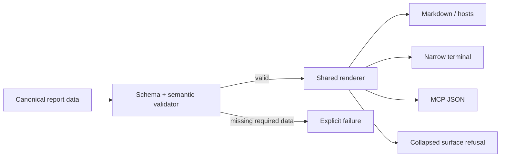

The committed plan, debug, and closure fixtures form the initial scenario
matrix. Each fixture is rendered for all supported surfaces and checked for the
same required semantic section set. Narrow output may wrap text but cannot drop
sections. A collapsed tool surface receives an explicit instruction to open the
canonical report; it never receives a misleading partial summary.

Verification commands:

```text
tailtrail presentation conformance
tailtrail presentation validate --input <canonical-report.json>
tailtrail presentation render --input <canonical-report.json> --surface narrow --width 44
```

### PM-4 — Maintainability Extraction

Priority: P1  
Target rating: maintainability

Status: **Implemented**

- Characterize current behavior.
- Extract domain services incrementally from broad routers.
- Merge duplicate state/rendering logic.
- Generate inventories from the Feature Registry.
- Add dependency-direction and documentation-owner validation.

Exit: bounded modules, shared CLI/MCP services, and full regression coverage.

#### Implemented design

PM-4 is an incremental extraction, not a rewrite of `tailtrail.py` or the
Durable Workflow Runtime. The phase first preserves characterized PM-2 and PM-3
behavior, then moves one stable responsibility at a time behind bounded
services.

| Area | Implementation | Result |
| --- | --- | --- |
| Run identity | `scripts/orchestration/run_resolution.py` owns active-run resolution and run-to-workflow binding. | The façade no longer duplicates filesystem discovery, ambiguity handling, or binding-path checks. |
| Presentation | PM-3's `scripts/presentation.py` remains the single renderer for façade responses. | State/action services do not carry host-specific Markdown wording. |
| Registry inventory | `scripts/product-maintainability.py` projects commands, MCP tools, docs, scripts, tests, and feature dependencies directly from `tailtrail-registry.json`. | Missing declared paths, unknown dependencies, cycles, and conflicting script ownership fail deterministically. |
| Documentation ownership | `tailtrail-meta/document-owners-v1.json` assigns one primary owner to canonical public and governance documents. | A feature may reference a shared document without falsely becoming its canonical owner. Duplicate or missing primary ownership fails. |
| Dependency direction | Python AST import inspection checks the bounded `orchestration` application package and `workflow_runtime` domain package. | Domain modules importing outward application/presentation layers are actionable failures. |
| Module budgets | The inventory records line counts with a 500-line warning budget. | Size is a review signal, not an arbitrary build failure; dependency violations remain failures. |
| Shared adapters | `tailtrail maturity maintainability ...` and read-only MCP `maintainability_inventory` call the same pure inventory service. | CLI and MCP cannot silently calculate different maintainability state. |
| Packaging | New modules, contracts, ownership policy, and committed inventory are included in installed profiles/manifests. | Installed packs retain the same inspection capability as a source checkout. |

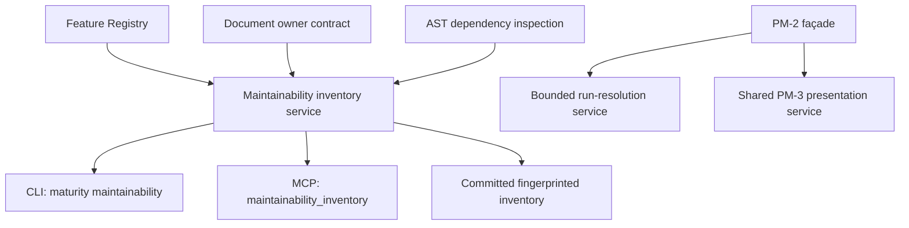

The committed inventory is local deterministic evidence. It does not execute
TailTrail source, calculate cyclomatic complexity, or claim that a large module
is defective. New frameworks were intentionally avoided; parsing uses Python's
standard-library `ast` module.

Verification commands:

```text
tailtrail maturity maintainability inventory
tailtrail maturity maintainability validate
tailtrail maturity maintainability status
```

### PM-5 — Real Evaluation Portfolio

Priority: P1  
Target rating: demonstrated efficacy

Status: **Implemented — protocol-ready; real observations not yet collected**

- Create the 15+ task multi-repository dataset.
- Add blind paired grading and repeated runs.
- Measure requirement completion, drift, false intervention, review time, and
  provider tokens when available.
- Publish negative and neutral outcomes.

Exit: a reproducible evidence report supports scoped claims and shows where
TailTrail does not help.

#### Implemented design

PM-5 now provides a versioned catalog of 18 tasks across five sanitized
repository fixtures. It covers focused fixes, multi-file delivery, API and
behavior contracts, refactoring, dependencies, CI/release, infrastructure,
ambiguity, debugging, security, migration, concurrency, UI consistency, Intent
Bridge, and recovery. Every task requires three independent paired
observations—54 total—before the report may enter `measured` state.

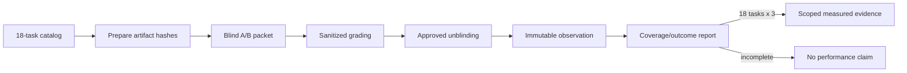

| Contract | Implementation |
| --- | --- |
| Portfolio | `benchmarks/evaluation/real-portfolio/v1.json` |
| Schema | `schemas/real-evaluation-portfolio.schema.json` |
| Runtime | `scripts/real-evaluation-portfolio.py` |
| CLI | `tailtrail eval real-portfolio validate|prepare|grade|unblind|report` |
| MCP | Read-only `real_evaluation_portfolio_report` |
| Storage | `.tailtrail/evaluation/pm5/packets`, `assignments`, and `observations` |
| Privacy | Hash identities and integer/null metrics only; raw prompt, response, source, code, credential, path, and repository URL fields are rejected |
| Honesty | Positive, neutral, and negative observations are retained; incomplete coverage always reports `no-performance-claim` |

Blind assignments are stored separately from grader packets. `prepare`,
`grade`, and `unblind` require explicit approval and write immutable artifacts.
Inputs stay inside the selected root. The report never infers developer time,
review results, or provider tokens.

```powershell
tailtrail eval real-portfolio validate --root .
tailtrail eval real-portfolio prepare --root . --task focused-validation --repetition 1 --baseline-hash <sha256> --tailtrail-hash <sha256> --approved
tailtrail eval real-portfolio grade --root . --packet <packet-ref> --input <sanitized-metrics.json> --approved
tailtrail eval real-portfolio unblind --root . --grade <grade-ref> --assignment <assignment-ref> --approved
tailtrail eval real-portfolio report --root .
```

The implementation exit is satisfied. The evidence exit remains intentionally
open: no live-model outcomes were fabricated. Until 54 valid observations
exist, PM-5 remains `protocol-ready` or `collecting`, not performance-proven.

### PM-6 — Enterprise Conformance And Operations

Priority: P1  
Target rating: enterprise readiness

Status: **Implemented — local/offline conformance passed; hosted matrix evidence pending**

- Complete compatibility, installer, update, rollback, policy, CI receipt,
  retention, export, migration, and threat-model conformance.
- Package an offline enterprise verification suite.

Exit: a target organization can verify installation and governance without
trusting a demo or a hosted service.

#### Implemented design

PM-6 consolidates existing enterprise controls behind one versioned,
standard-library-only offline verifier. It does not replace the transactional
installer, linked CI ingestion, retention engine, export boundary, migration
runtime, host adapters, or enterprise policy enforcement.

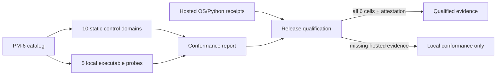

| Domain | Reused authority and proof boundary |
| --- | --- |
| Compatibility | Platform contract, host adapter v3 matrix, Codex/Copilot/Claude profiles, MCP protocol, pinned official AI-DLC revision |
| Installer | Transactional installer, package integrity, verification, host/profile surfaces |
| Update and rollback | Transaction receipts, update lifecycle, exact rollback target, uninstall boundary |
| Policy | Governance precedence, immutable safeguards, enterprise target policy, repository enforcement |
| CI receipts | Run/scope/commit/artifact/policy-linked ingestion; stale or unlinked receipts fail closed |
| Retention and export | Explicit local cleanup and public/internal export; no background upload or deletion |
| Migration and rollback | Backup validation, exact migration fingerprint, canonical ownership, approved rollback |
| Threat model | Path traversal, symlink escape, command injection, hostile provider JSON, sensitive-data leakage |
| Support/versioning | Supported-version window, deprecation/migration policy, public-claim boundaries |
| Offline verification | Catalog, closed schema, deterministic ZIP, manifest hashes, no network/model calls |

The five executable probes validate the enterprise closure registry, feature
registry, PM integrity baseline, host adapters, and MCP boundary. Raw output is
not copied into the report; only exit status, byte count, and SHA-256 are kept.

```text
tailtrail enterprise-readiness --root . conformance
tailtrail enterprise-readiness --root . conformance --platform-report <hosted-report.json>
tailtrail enterprise-readiness --root . offline-bundle --target tailtrail-enterprise-offline.zip --approved
```

The offline ZIP contains only the verifier, catalog, report schema, README, and
integrity manifest. It contains no source, prompts, logs, credentials, CI
receipts, `.tailtrail` state, or customer data. Creation is approval-gated and
refuses overwrite.

Local evidence currently passes all ten controls and five probes. Release
qualification remains `not-observed`: no genuine report covering Windows,
macOS, and Linux across Python 3.12 and 3.13 was supplied. Configured workflows
and local simulation never become hosted-support evidence.

### PM-7 — Adoption Validation

Priority: P2  
Target ratings: adoption readiness, developer experience

- Run new-user and experienced-user usability trials.
- Measure time-to-plan, approvals, abandoned runs, false interventions, and
  completion comprehension.
- Improve wording and defaults based on evidence, not anecdote.

Exit: usability metrics meet the thresholds in this document and no safety
boundary was weakened to reach them.

### PM-L0 — Learning Inventory And Ownership

Priority: P1  
Target rating: learning effectiveness

- Inventory Learning Agent, closure learning, Debug candidates, graph learning,
  refresh, Quality Loop, Evaluation Harness, and Meta-Harness artifacts.
- Assign one canonical owner to candidate, curated learning, use receipt,
  freshness action, conflict, and observed outcome.
- Define aliases/migrations for overlapping files and commands.

Exit: no learning fact has multiple mutable owners and no existing artifact is
silently discarded.

### PM-L1 — Learning V3 Contract And Migration

Priority: P1  
Target rating: learning effectiveness

- Add the versioned class/provenance/applicability/freshness/utility contract.
- Add append-only amendments, supersession, and revocation.
- Migrate existing sanitized candidates by reference; retain legacy readers
  during the compatibility window.
- Validate privacy and project-frame boundaries.

Exit: old and new learning stores can be read deterministically, while all new
writes use the canonical contract.

### PM-L2 — Navigator Retrieval And Conflict Gate

Priority: P1  
Target ratings: learning effectiveness, developer experience

- Retrieve only after task/project framing.
- Add applicability ranking, three-result cap, match explanations, invalidator
  checks, and contradiction handling.
- Create a use proposal instead of silently injecting advice.
- Keep Lite tasks quiet when no high-value match exists.

Exit: retrieval precision passes labeled fixtures and stale/conflicting advice
cannot become an implementation instruction.

### PM-L3 — Use Receipts And Closure Attribution

Priority: P1  
Target ratings: learning effectiveness, demonstrated efficacy

- Record applied/advisory/ignored/rejected/stale decisions.
- Link use to requirement IDs and decision types.
- Join receipts to closure, drift, Harness, failure, and validation evidence.
- Update utility as observed association with domain caps.

Exit: TailTrail can show exactly which learning influenced which requirement
and what later evidence occurred, without claiming causality.

### PM-L4 — Refresh, Conflict, And Negative Learning

Priority: P2  
Target ratings: learning effectiveness, enterprise readiness

- Implement first-class challenge, amend, supersede, revoke, and revalidate
  transitions.
- Trigger deterministic invalidators from policy, graph, symbol, manifest, and
  ownership changes.
- Preserve avoid-history for repeated failed approaches without copying raw
  failure content.

Exit: harmful, contradicted, and stale guidance is blocked and auditably
versioned rather than overwritten.

### PM-L5 — Learning Calibration And Proof

Priority: P2  
Target ratings: learning effectiveness, demonstrated efficacy

- Add learning-on/off Evaluation Harness scenarios.
- Calibrate class-specific confidence against later observed outcomes.
- Measure precision, false interventions, correction cycles, review time, and
  token overhead.
- Feed only repeated sanitized evidence to Meta-Harness proposals.

Exit: the learning score is evidence-calibrated for its class, and published
claims are limited to measured scenarios.

## Phase Dependency Graph

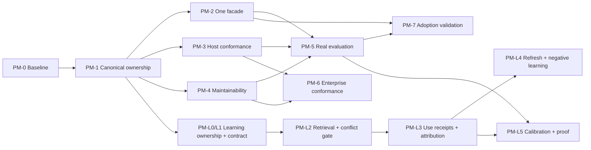

## Scorecard And Release Gates

| Gate | Required evidence | Rating affected |
| --- | --- | --- |
| Daily-path gate | Six-verb workflows, no manual artifact choreography | DX, adoption |
| Host gate | Shared semantic conformance across supported hosts | Host consistency |
| State gate | One owner and transition record per mutation | Maintainability, enterprise |
| Proof gate | Real paired runs with failures retained | Efficacy |
| Operations gate | Install/update/rollback/policy/CI/offline conformance | Enterprise |
| Friction gate | Measured approval and intervention overhead | DX, efficacy |
| Learning gate | Requirement-linked use receipts, stale/conflict blocking, and learning-on/off evidence | Learning, efficacy |

No rating should be moved above 8 merely because its phase is coded. It moves
only after the corresponding gate is demonstrated.

## What Not To Build During This Program

- another top-level Harness;
- another lifecycle or state store;
- an autonomous multi-agent graph by default;
- automatic source-writing MCP tools without the existing approval boundary;
- a hosted telemetry service;
- live-model evaluation by default;
- a visual dashboard before the canonical façade and status model stabilize;
- exact quality, time, or token-saving claims without measured evidence.

## Recommended First Delivery Slice

Start with PM-0 and a thin PM-1 vertical slice for one small bug-fix workflow:

```text
Start plan
  -> approval
  -> one source edit receipt
  -> one focused test receipt
  -> selected Harness finalization
  -> Completion Report
  -> acceptance
```

Prove that CLI and MCP produce the same canonical state and report. Then extend
the same contract to Standard/Full AIDLC, hands-free delivery, Intent Bridge,
Debug, correction, and recovery. This establishes the integration seam before
larger refactoring begins.

## Expected Outcome

If these phases are completed and their evidence gates pass, TailTrail should
move from a sophisticated engineering framework to a coherent product:

- powerful without requiring users to learn the internals;
- consistent across hosts;
- easier to change without regressions;
- credible through real measured outcomes;
- operationally reviewable by enterprise teams;
- honest about where it helps, where it adds cost, and where evidence is still
  unavailable.
