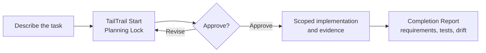

<p align="center">
  
</p>

<h1 align="center">TailTrail</h1>

<p align="center"><strong>Plan first. Change with evidence. Finish without drift.</strong></p>

TailTrail is a local, approval-first workflow for AI-assisted software delivery.
It helps an agent understand an existing project, propose a bounded change,
collect real validation evidence, and keep multi-file work tied to the approved
requirement.

It works with Codex, GitHub Copilot, Claude, Cursor, ChatGPT, and Gemini.

The self-contained `tailtrail` wheel and sdist support CPython 3.12 and 3.13,
have no runtime dependencies, verify their packaged resources before command
dispatch, and do not need a source checkout. See [INSTALL.md](INSTALL.md).

## Get a plan in two minutes

1. Install TailTrail into the project you want to work in. Use the one
   [installation guide](INSTALL.md)—it has Windows, macOS/Linux, update, and
   host-specific instructions.
2. Open a new chat in your AI host.
3. Ask TailTrail to plan the task:

```text
tailtrail start "add payment retry handling"
```

TailTrail returns a Planning Lock and run ID. It does not implement the task,
run tests, or change Git until you approve the plan.

### Choose your host

| Host | Fast path |
| --- | --- |
| Codex | [Codex quickstart](docs/hosts/codex.md) |
| GitHub Copilot | [Copilot quickstart](docs/hosts/copilot.md) |
| Claude | [Claude quickstart](docs/hosts/claude.md) |

## TailTrail in plain language

Coding agents can generate code quickly, but larger tasks often fail in less
obvious ways: a caller is missed, one requirement is forgotten, tests prove only
the easiest path, or repeated corrections move the implementation away from the
original request.

TailTrail adds a local control and evidence layer around the agent. It keeps the
approved intent visible, selects only the controls the task needs, checks the
result from several angles, and produces one completion report. It does not
replace the coding agent—the agent still reads and writes the code—but it makes
the delivery easier to inspect, correct, resume, and trust.

This is useful when you want to:

- keep a small fix small and avoid unnecessary refactoring;
- deliver a multi-file feature without missing callers, contracts, or tests;
- ask questions about a plan before approving it;
- recover from repeated failures without losing unrelated work;
- see what was actually validated instead of accepting a generic “tests pass”;
- run the same governed workflow from Codex, Copilot, Claude, CLI, or MCP.

## The daily flow



For a normal code change, the entire conversation can stay this simple:

```text
tailtrail start "fix the zero quantity validation defect"
```

```text
tailtrail discuss --question "Why was this scope selected?"
tailtrail approve
tailtrail continue
tailtrail flow status
tailtrail close
```

These six verbs use one orchestration façade. TailTrail resolves a run only
when it is unambiguous, approves only the exact plan or next frozen stage, and
keeps advanced workflow commands available for diagnostics. Bare `tailtrail
status` still means installer status; use `tailtrail flow status` for the
auto-resolved task or `tailtrail status --run-id <run-id>` for an explicit one.

Start plans support `--presentation quick`, `guided`, or `expert`. These modes
change display depth only. Add `--verbose` to any mode for the comprehensive
canonical projection; requirements, AIDLC mode, scope, controls, approval, and
workflow authority remain identical.

Reports use one canonical presentation contract across CLI, MCP, Codex,
Copilot, and Claude. Narrow terminals wrap without dropping sections, verbose
mode keeps all applicable sections, and a collapsed host surface must tell the
user to open the complete report instead of presenting a partial substitute.
Maintainers can verify the deterministic plan/debug/closure matrix with:

```bash
tailtrail presentation conformance
```

Maintainers can also check whether registered commands, MCP tools, files,
documentation ownership, and core module dependencies remain consistent:

```bash
tailtrail maturity maintainability validate
```

Use `hands-free:` or `end-to-end:` only when you deliberately want TailTrail
to break a larger delivery into approved slices.

## What TailTrail packs

The Evaluation Harness includes a real-evaluation portfolio protocol: 18 task
classes across five repository fixtures, blinded A/B grading, repeated runs,
immutable positive/neutral/negative observations, and an honest claim gate.
Run `tailtrail eval real-portfolio report --root .` to inspect coverage. Until
all required observations exist, it reports `no-performance-claim`.

Enterprise operations include an offline conformance suite for compatibility,
transactional installation/update/rollback, policy, linked CI,
retention/export, migration/recovery, threat controls, and support boundaries.
Run `tailtrail enterprise-readiness --root . conformance`; local success stays
separate from hosted Windows/macOS/Linux release qualification.

TailTrail does not run every feature for every task. Navigator selects the
smallest useful workflow during planning; other controls remain armed and
activate only when their trigger—such as drift, a failed correction, UI work, or
release risk—actually occurs.

### Harnesses and assurance loops

| Implemented Harness | What it checks or controls | Why it matters |
| --- | --- | --- |
| **Requirement Completion Harness V1–V4** | Maps stable requirement IDs to likely and actual code paths, preservation rules, evidence, checkpoints, convergence, closure, and recovery. | Prevents “code changed” from being mistaken for “the requirement is complete.” |
| **Architecture Fitness Harness** | Checks callers, layers, contracts, dependency direction, expected files, and unexpected architectural change. | Catches service-only fixes, missed callers, wrong-layer logic, and architecture drift. |
| **Behaviour Harness** | Compares approved user/API scenarios with observed behaviour evidence. | Proves the user-facing flow, including failures and side effects, rather than accepting unit tests alone. |
| **Maintainability Harness** | Looks for duplicate logic, unnecessary abstractions, test-chasing, excessive churn, and unjustified scope. | Keeps agent-generated changes understandable and aligned with existing project patterns. |
| **Context Continuity Harness V1–V3** | Carries forward the active requirement, prior decisions, failed attempts, drift, and “do not repeat” reminders; its watcher/advisory layer can remind the main agent when intervention signals appear. | Reduces repeated mistakes and keeps a long-running agent focused without reloading the entire history. |
| **Program Delivery Harness and deterministic orchestrator** | Breaks hands-free or end-to-end programmes into dependency-ordered features, slices, checkpoints, and approval gates. | Makes large deliveries resumable and prevents one uncontrolled implementation pass. |
| **Evidence-Aware Testing** | Selects a testing profile, minimum evidence tier, requirement links, receipts, CI inputs, flaky-test posture, and evidence metrics. | Matches proof to the task instead of running arbitrary tests or trusting a generic pass statement. |
| **Higher-Tier Testing and Release Confidence** | Covers integration, contract, behaviour/E2E, migration, environment, deployment, rollback, release policy, and calibration evidence. | Extends confidence beyond unit tests when the change crosses system or release boundaries. |
| **Token Harness and budgeting** | Routes and reduces safe context, preserves exact evidence, records estimates, and accepts measured telemetry only when linked. | Keeps context manageable without treating estimates as exact model usage or dropping critical source and policy. |
| **Evaluation Harness** | Runs deterministic scenarios, datasets, normalization, baseline comparisons, workflow outcomes, token evidence, and delivery evaluation. | Measures whether TailTrail improves completion and drift control instead of relying on product claims. |
| **Meta-Harness** | Reviews TailTrail’s own workflow fit, confidence, guardrails, context, metrics, learning, and proposal readiness. | Detects when TailTrail itself selected too much, too little, or the wrong control. |
| **Benchmark and Efficacy Harness** | Runs repeatable benchmark fixtures and analyzes captured efficacy results. | Provides measured local evidence for product evaluation while keeping live-model claims separate. |
| **Harness convergence, templates, and finalization** | Selects project-specific templates, compares checkpoints, bounds correction cycles, finalizes selected Harnesses, and creates one Completion Report. | Gives all Harnesses a shared lifecycle instead of producing disconnected assessments. |

### Other major product features

| Feature area | What is included | How it helps |
| --- | --- | --- |
| **Navigator and TailTrail Start** | Automatic task classification, feature selection, skipped/deferred explanations, focused validation, token estimate, and a Planning Lock. | Gives the user a TailTrail decision before implementation starts. |
| **Target and code intelligence** | Enterprise Target Workspace Resolver, input-role registry, Code Graph Mapper, caller/test discovery, cache freshness, semantic evidence labels, and cross-repository reference mapping. | Keeps the agent in the correct editable repository and makes impact decisions from local project evidence. |
| **Canonical requirements and anchors** | Versioned requirement IDs, requirement-to-impact matrix, immutable approved intent, phase/slice anchors, actual state, and amendment history. | Provides the stable reference used for implementation, drift detection, evaluation, and selective recovery. |
| **AIDLC integration** | Off, Lite, verified official Standard, and verified official Full modes; Question Orchestrator grounding and requirement traceability; official questions, recommendations, stage approvals, session resume/redo/jump/recovery, and evidence/closure adapters. | Matches lifecycle depth to task complexity, improves question relevance, and never presents a local questionnaire as official AIDLC. |
| **Intent Bridge** | Detects, imports, versions, maps, amends, and converges existing structured requirement sources. | Lets source-owned specifications remain authoritative while TailTrail manages delivery evidence and drift. |
| **Interactive Plan Mode** | Evidence-backed explain/discuss, bounded investigation, question clarification/challenge, plan revision, AIDLC mode switch, and Expert Plan Customization. | Lets users challenge any file, requirement, feature, risk, validation, token, or approval decision without rejecting the whole plan. |
| **Durable Workflow Runtime** | Canonical ownership, workflow identity, state machine, task locks, freshness, declarative capabilities, mode-aware execution authority, approvals, adapters, retries, pause/resume, CI continuation, replay, retention, and closure. Lite/Off can reuse one approved-plan grant for safe local work; official AI-DLC and Intent Bridge retain their material gates. | Moves long-running work from chat memory into deterministic local state while avoiding per-command approval fatigue without hiding sensitive authority. |
| **Advanced runtime boundaries** | Approval-gated contracts for multi-agent graphs, source-writing MCP operations, cloud/Kubernetes runners, model-based diagnosis, live evaluation, and externally measured claims. | Lets advanced execution be integrated explicitly without pretending a local contract is a running external service. |
| **Failure, drift, and bounded correction** | Failure intake receipts, classification, sanitized fingerprints, requirement/drift mapping, correction packets, repeated-cycle detection, and recovery/replan routing. | Acknowledges pasted failures, avoids infinite retry loops, and fixes the relevant requirement under the same run. |
| **Safe Git recovery and Mode B diagnosis** | Git readiness, task recovery boundaries, checkpoints, selective reconciliation, conflict classification, and an evidence-based Recovery Diagnostician. | Preserves completed and unrelated work while reverting or repairing only the active task’s owned delta. |
| **UI Consistency Guardrail** | Read-only discovery of components, tokens, layouts, responsive rules, accessibility patterns, and existing visual tests. | Makes UI agents reuse the repository’s design system instead of introducing a parallel one. |
| **Closure, dashboard, and guarded learning** | Execution-evidence recorder, selected-Harness finalizer, requirement/control status tables, token posture, acceptance choices, deterministic evaluation, candidate-only learning, and a local workflow dashboard. | Shows what is complete, missing, unresolved, measured, or unavailable before learning from the result. |
| **MCP and host adapters** | Inspection-first MCP tools, approval-gated controlled operations, and composed Codex, GitHub Copilot, Claude, Cursor, ChatGPT, and Gemini guidance with conformance receipts. | Makes the same workflow callable and debuggable across hosts without giving every tool unrestricted write authority. |
| **Guardrails and quality intelligence** | Dependency Gate, security/review lenses, Sonar and vulnerability evidence, CI summaries, policy checks, and versioned JSON/SARIF repository enforcement. | Preserves safety and makes heavy or state-changing checks explicit, reviewable, and evidence-labelled. |
| **Enterprise workflow controls** | Enterprise target policy, identity binding, tenant/repository/actor context, leases and fencing, audit events, backup/restore validation, migration/rollback, observability, and conformance. | Adds deterministic local enterprise contracts while keeping remote-service claims evidence-gated. |
| **Packaging, installation, and supply chain** | Transactional install/update/repair/uninstall, ownership manifests, rollback journals, self-contained package validation, platform qualification, host quickstarts, and release manifests. | Makes TailTrail installable and recoverable without requiring users to understand its internal schemas on day one. |
| **Reporting and product learning** | Outcome telemetry, quality loops, value reports, sanitized learning candidates, refresh/review, and public-claim boundaries. | Improves future routing from trusted evidence while current source, tests, policy, and user direction remain authoritative. |

### A simple mental model

```text
Navigator decides what matters
    -> AIDLC clarifies requirements when needed
    -> the agent implements the approved scope
    -> Harnesses check intent, architecture, behaviour, and evidence
    -> bounded loops correct gaps or recover safely
    -> one Completion Report shows what is complete and what is not
```

## Use the right page

- [INSTALL.md](INSTALL.md) — the only installation, update, and verification guide.
- [COMPLETE-END-TO-END-WORKFLOW.md](COMPLETE-END-TO-END-WORKFLOW.md) — the complete visual workflow from trusted artifact through task closure, learning, enterprise operation, and release qualification.
- [QUICKSTART.md](QUICKSTART.md) — shortest command path and common workflows.
- [CHEATSHEET.md](CHEATSHEET.md) — problem-to-command map.
- [USEFUL-PROMPTS.md](USEFUL-PROMPTS.md) — copyable assistant prompts.
- [TAILTRAIL-COMMANDS.md](TAILTRAIL-COMMANDS.md) — complete command reference.
- [REPOSITORY-ENFORCEMENT.md](REPOSITORY-ENFORCEMENT.md) — policy, CI action, baselines, suppressions, and SARIF.
- [USER-GUIDE.md](USER-GUIDE.md) — guided product concepts and advanced paths.

## Trust boundary

TailTrail is local and evidence-aware. It does not replace source inspection,
tests, CI, scanners, code review, security review, or release approval. It
never claims those checks passed unless it has their actual receipt.

For contributors, the repository CI validates Python compatibility, adapter
contracts, registry consistency, installer smoke behavior, selected guardrail
classes, and dependency decisions. See [IMPROVEMENT-PLAN.md](IMPROVEMENT-PLAN.md)
for the delivery roadmap and [context/guardrail-layers.md](context/guardrail-layers.md)
for the layered enforcement model.
