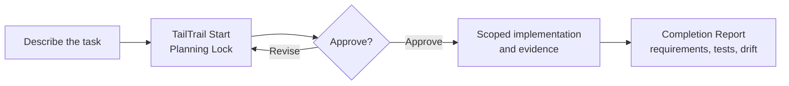

<p align="center">
  
</p>

<h1 align="center">TailTrail</h1>

<p align="center"><strong>Plan first. Change with evidence. Finish without drift.</strong></p>

TailTrail is a local, approval-first workflow for AI-assisted software delivery.
It helps an agent understand an existing project, propose a bounded change,
collect real validation evidence, and keep multi-file work tied to the approved
requirement.

It works with Codex, GitHub Copilot, Claude, Cursor, ChatGPT, and Gemini.

## Get a plan in two minutes

1. Install TailTrail into the project you want to work in. Use the one
   [installation guide](INSTALL.md)—it has Windows, macOS/Linux, update, and
   host-specific instructions.
2. Open a new chat in your AI host.
3. Ask TailTrail to plan the task:

```text
tailtrail start "add payment retry handling"
```

TailTrail returns a Planning Lock and run ID. It does not implement the task,
run tests, or change Git until you approve the plan.

### Choose your host

| Host | Fast path |
| --- | --- |
| Codex | [Codex quickstart](docs/hosts/codex.md) |
| GitHub Copilot | [Copilot quickstart](docs/hosts/copilot.md) |
| Claude | [Claude quickstart](docs/hosts/claude.md) |

## The daily flow



For a normal code change, the entire conversation can stay this simple:

```text
tailtrail start "fix the zero quantity validation defect"
```

```text
Approve the plan. Implement the smallest maintainable change and run the focused validation.
```

Use `hands-free:` or `end-to-end:` only when you deliberately want TailTrail
to break a larger delivery into approved slices.

## What TailTrail adds

| Capability | Outcome |
| --- | --- |
| Navigator | A scoped plan before edits begin. |
| Requirement Completion Harness | Requirement-to-code-to-proof traceability. |
| Architecture and Behaviour Harnesses | Protection against missed callers and unit-only confidence. |
| Evidence-aware testing | Focused, integration, or release evidence selected by task risk. |
| Context Continuity | Correction memory across repeated attempts. |
| Safe recovery | Bounded checkpoints that protect unrelated work. |
| Guard and dependency checks | Reviewable dependency decisions and CI enforcement. |

## Use the right page

- [INSTALL.md](INSTALL.md) — the only installation, update, and verification guide.
- [QUICKSTART.md](QUICKSTART.md) — shortest command path and common workflows.
- [CHEATSHEET.md](CHEATSHEET.md) — problem-to-command map.
- [USEFUL-PROMPTS.md](USEFUL-PROMPTS.md) — copyable assistant prompts.
- [TAILTRAIL-COMMANDS.md](TAILTRAIL-COMMANDS.md) — complete command reference.
- [USER-GUIDE.md](USER-GUIDE.md) — guided product concepts and advanced paths.

## Trust boundary

TailTrail is local and evidence-aware. It does not replace source inspection,
tests, CI, scanners, code review, security review, or release approval. It
never claims those checks passed unless it has their actual receipt.

For contributors, the repository CI validates Python compatibility, adapter
contracts, registry consistency, installer smoke behavior, selected guardrail
classes, and dependency decisions. See [IMPROVEMENT-PLAN.md](IMPROVEMENT-PLAN.md)
for the delivery roadmap.
