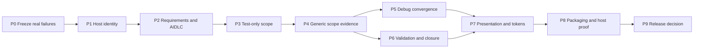

# TailTrail Current Issues and Implementation Plan

Status: active engineering backlog  
Baseline date: 2026-09-12  
Branch inspected: `tailtrail_V1.1`  
Baseline commit: `101322e`  
Owner: `tailtrail-core`  
Scope: requirement interpretation, Navigator scope discovery, AIDLC routing,
Debug, validation and closure, presentation, token reporting, installation, and
host conformance

## 1. Purpose

This document is the single current inventory of material TailTrail problems
observed through source inspection and real runs in the TailTrail test,
frontend, infrastructure, and ACT E2E repositories.

Earlier phase documents remain useful design history, but an earlier
“implemented” label is not treated as proof that an installed host currently
behaves correctly. A problem is closed here only when all of the following are
true:

1. An executable regression reproduces the original failure.
2. The smallest root-cause correction is implemented.
3. Focused and adjacent tests pass.
4. The packaged payload contains the correction.
5. A fresh installation is exercised through the real host entry point.
6. The resulting report satisfies semantic assertions, not merely exit-code or
   text-presence checks.

This is an issue and delivery plan. It does not claim that the open items below
are already fixed.

## 2. Status vocabulary

- **Open:** the defect remains in the current implementation or has no
  executable proof of correction.
- **Partially implemented:** supporting code exists, but a real observed path
  still fails or contradicts the intended contract.
- **Patched, release proof pending:** a correction and focused test exist in the
  working tree, but the complete packaged and installed release gate has not
  been recorded.
- **Closed, regression protected:** source, package, installed host, and
  negative-assurance evidence all pass.
- **Historical:** the incident appears corrected, but its regression must stay
  in the permanent suite.

## 3. Executive assessment

TailTrail has substantial safety and lifecycle machinery, but its weakest
boundary is still the transition from a user's natural request to an
approval-ready, evidence-backed plan.

The recurring failure pattern is:

```text
host identity or requirement authority is lost
        -> deterministic or weaker routing is accepted
        -> intent is classified incorrectly
        -> Navigator investigates the wrong repository role
        -> the read budget is spent on candidates
        -> TailTrail asks the user to perform repository discovery
        -> no Planning Lock or useful plan is produced
```

The product is usually safe when this happens because it refuses to grant
implementation authority. The problem is that it fails safely for avoidable
internal reasons. Safety without useful planning is not sufficient product
behavior.

The correction must not weaken the fail-closed gate. It must make the evidence
and routing before that gate accurate.

## 4. Current release-blocking issues

### TT-CUR-01 — Installed host identity can be silently lost

Priority: P0  
Status: **Open**

#### Observed behavior

An invocation launched from the installed Codex payload produced:

- `Plan detail: Expert (automatic for AIDLC Lite)`;
- `Interpretation evidence: deterministic normalization`;
- no host-assisted requirement boundary.

The request was made from Codex and explicitly used hands-free wording.

#### Root cause

`tailtrail/install/host_launcher.py` derives the active host from its own path,
but currently uses that value only to locate the manifest and shared payload.
It does not export the host identity for `task-start.py`. The `--host` argument
in `scripts/task-start.py` is optional. If the host agent omits that flag,
TailTrail accepts an unlabelled invocation and can enter deterministic
interpretation.

#### Why it matters

- A host-specific installation does not reliably use the host's reasoning
  contract.
- Fresh installation alone does not prevent degraded planning.
- The same user request can behave differently depending on how accurately the
  agent constructs the CLI call.

#### Required correction

1. Export `TAILTRAIL_ACTIVE_HOST=<codex|copilot|claude>` from the per-host
   launcher.
2. Let `task-start.py` resolve host identity in this order:
   explicit `--host`, trusted installed-launcher environment, then absent.
3. Reject a conflict between explicit and launcher-derived host identity.
4. Persist the host source as `explicit-flag` or `installed-launcher`.
5. Do not infer a host from arbitrary environment variables in a source
   checkout.

#### Acceptance criteria

- Starting through the Codex launcher without `--host` records host `codex`.
- Copilot and Claude do the equivalent.
- An installed agent-host Build Start cannot silently report deterministic
  normalization.
- An explicit mismatched host fails before requirements, graph work, or lock
  creation.
- Direct source-checkout CLI behavior remains backward compatible.

---

### TT-CUR-02 — Missing host interpretation can silently degrade instead of failing conformance

Priority: P0  
Status: **Open**

#### Observed behavior

The ACT hands-free request reached deterministic requirement normalization even
though Codex was available and the installed guidance required a typed host
interpretation.

#### Root cause

TailTrail validates a typed proposal when one is supplied, but the installed
host boundary does not make the proposal mandatory when the launcher already
proves an agent host is active. A missing host proposal can therefore look like
an ordinary non-agent CLI request.

#### Required correction

- When trusted launcher identity is present, require the matching typed host
  interpretation for ordinary Build Start or the verified official authority
  flow for Standard/Full.
- Return a typed `host-interpretation-required` boundary when it is missing.
- Never repair the omission with deterministic requirements.
- Keep non-agent clients supported through an explicit client classification,
  not by accidental absence of host metadata.

#### Acceptance criteria

- A Codex launcher invocation with no interpretation produces a clear
  host-contract boundary, not a Lite plan.
- Resubmission with the bound interpretation continues the same goal and
  artifact hashes.
- Spoofed, stale, mismatched, or unbound proposals create no scope or run.

---

### TT-CUR-03 — Automatic official AIDLC routing could be erased after interpretation

Priority: P0  
Status: **Patched, release proof pending**

#### Observed behavior

A hands-free request with a compatible official pack was interpreted under
official Standard authority, but a later sufficiency step routed it to
`lite-questions`. The saved intake then showed:

- route `lite-questions`;
- requested mode `null`;
- official interpretation fields inside the same artifact.

#### Root cause

`scripts/task-start.py` selected Standard before scope, then called
`navigator_requirement_route()` with only the raw `--aidlc` argument. Automatic
hands-free selection has no raw flag, so the second decision discarded the
already-selected authority.

#### Current correction

The working tree now preserves the selected official mode through sufficiency
routing and records that effective mode in the durable intake. A focused
automatic-hands-free regression passes.

#### Remaining exit evidence

- Run the complete Start and official bridge suites from a clean checkout.
- Build the distributable package.
- Install it into a clean fixture.
- Prove the exact hands-free artifact request remains Standard through the real
  Codex launcher.
- Prove open material questions stay under official authority and answered
  intake resumes into a Start Plan.

---

### TT-CUR-04 — Test-only intent classification is too narrow

Priority: P0  
Status: **Open**

#### Observed behavior

The request said to add new test cases, preserve existing test cases, follow the
current pattern, and create a new test file if necessary. TailTrail nevertheless
used request mode `code-change` and required a production implementation owner.

#### Root cause

`scripts/navigator_scope.py::requested_scope_mode()` recognizes only a small
set of literal phrases such as `add tests` and `test only`. Common equivalents
such as `add new test cases`, `new E2E scenarios`, and `create a new test file`
can miss the test-only branch. Generic phrases such as `end to end` can also be
misread as production-change evidence even when they describe E2E tests.

#### Required correction

1. Prefer typed requirement roles and constraints over raw goal substring
   matching.
2. Extend deterministic phrase coverage as a compatibility fallback.
3. Treat `end to end` in a test-case context as testing, not production work.
4. Treat an explicit prohibition on production changes as decisive unless it
   conflicts with another explicit outcome.
5. Expose the classification evidence in verbose output.

#### Acceptance criteria

- The exact ACT request is classified `test-only`.
- `add new test cases`, `create E2E scenarios`, and `tests only` converge on the
  same mode.
- `implement an endpoint and add tests` remains `code-change`.
- Debug and documentation-only requests do not regress.

---

### TT-CUR-05 — Test-only planning still uses production-owner semantics

Priority: P0  
Status: **Partially implemented**

#### Observed behavior

TailTrail asked:

> What concrete module, symbol, caller, or reproduction entry point owns this
> behavior?

The follow-up options focused on a summarizer Lambda, reconciler Lambda, event
producer, or Java test class. The repository's actual test conventions were
not presented.

#### Why the question is wrong

For a test-only task, the editable owner is a test artifact. Production code is
usually inspection context. Requiring a production owner before selecting a
test boundary reverses the requested scope and causes unnecessary failure.

#### Required correction

- Give every scope mode its own ownership contract:
  - code change -> production implementation owner required;
  - test-only -> exact editable test path or convention-grounded proposed new
    test path required;
  - documentation-only -> documentation owner required;
  - supporting-assets-only -> role-specific owners required.
- Existing feature, scenario, step, assertion, and fixture files begin as
  inspection paths unless the approved plan explicitly edits them.
- Shared `conftest.py` files remain inspection-only unless a demonstrated
  fixture gap requires a change.
- Production modules remain inspection-only unless testing exposes a separate
  production defect.

#### Acceptance criteria

- The ACT request never produces a production-owner scope question.
- Existing E2E tests are inspected for conventions.
- A proposed new test path is permitted only when its parent directory,
  framework, naming convention, and runner are evidenced.
- “Do not change existing tests” prevents existing test paths from becoming
  editable owners.
- The plan names an exact runnable test command.

---

### TT-CUR-06 — TailTrail asks users to perform repository discovery it should perform

Priority: P0  
Status: **Open**

#### Observed behavior

After the user selected “existing E2E test class,” TailTrail asked the user to
locate and provide its class or path. It later suggested Java and Maven/Gradle
examples in a Python/pytest repository.

#### Root cause

The scope question is generated after the wrong role contract has already
failed. The conversational host then explains the generic category without a
validated repository packet. It cannot safely name a path, so discovery is
offloaded to the user.

#### Required correction

- A category answer such as “existing E2E test” must trigger one bounded,
  repository-native investigation using known test roots, manifests, imports,
  markers, feature files, and runner configuration.
- Language and framework examples must come from repository evidence.
- Ask the user only when the repository and referenced artifacts genuinely lack
  the required information.
- Questions must present either evidence-backed path options or a concrete
  external fact that only the user can supply.

#### Acceptance criteria

- Python repositories never receive Java/Maven examples without Java/Maven
  evidence.
- A known test directory can be searched without asking the user for a path.
- No offered option mixes file ownership, runtime components, and commands as
  if they were equivalent answers.

---

### TT-CUR-07 — Explicit exclusions are not durable requirement facts

Priority: P0  
Status: **Open**

#### Observed behavior

The user explicitly said `process_to_process_links` was not required. The next
report omitted it, but did not record a durable exclusion explaining that the
table must remain out of scope.

#### Risk

An omitted name can reappear during artifact re-reading, scope revision,
implementation, or closure because omission is not equivalent to an approved
negative requirement.

#### Required correction

- Add typed `exclusions` to requirement interpretation and canonical
  requirements.
- Bind exclusions to the user clause or approved answer that created them.
- Show exclusions in normal plans when they materially prevent scope drift.
- Verify at closure that excluded targets were not changed or claimed.

#### Acceptance criteria

- `process_to_process_links` appears as an explicit exclusion in the same
  requirement boundary.
- It cannot become scope without a material revision and separate approval.
- Exclusions survive intake answer, planning revision, activation, and closure.

---

### TT-CUR-08 — Artifact evidence is consumed but reported as “0 inspected files”

Priority: P1  
Status: **Open**

#### Observed behavior

A requirement intake contained a hash-bound artifact input and artifact-derived
clauses, while the rendered report said:

> Inspected 0 decision-relevant file(s) across 0 bounded directories.

That line referred only to secondary repository requirement-evidence scanning,
but appeared to deny that the referenced document had been read.

#### Required correction

Report separate counters:

- Required artifacts inspected and hash-bound.
- Repository evidence files inspected.
- Scope investigation files inspected.

Never combine or substitute these measurements.

#### Acceptance criteria

- A read artifact is visibly listed by input ID, safe display name, status, and
  hash prefix.
- `0 repository evidence files` cannot be mistaken for `0 artifacts read`.
- Missing, unreadable, truncated, or stale artifacts remain blocking.

---

### TT-CUR-09 — Requirement decomposition still confuses outcomes, context, constraints, and plan choices

Priority: P1  
Status: **Partially implemented**

#### Observed behavior

Past reports have:

- split soft-wrapped prose into multiple requirements;
- turned an observed banner into a configuration requirement;
- represented explanatory context as a separate requirement;
- treated “a new test file may be created” as an outcome rather than a planning
  choice;
- used generic test evidence as the only requirement;
- retained removed requirement IDs in revised scope rows.

Multiline normalization and revision-ID issues have focused fixes, but real
host interpretation can still produce semantically weak boundaries.

#### Required correction

- Keep one canonical typed clause set: `outcome`, `constraint`, `scope`,
  `context`, `evidence`, `question`, and `exclusion`.
- Only outcomes, constraints, and explicit scope facts become requirement rows.
- Plan choices remain plan choices.
- Exact named tables, resources, UI literals, and paths must be retained.
- Removing or merging a requirement must re-key every scope, proof, workflow,
  and closure reference transactionally.
- TailTrail validates completeness and reference consistency; the host owns
  semantic interpretation.

#### Acceptance criteria

- Soft wraps remain one requirement while explicit lists remain separate.
- One UI removal request produces one outcome plus preservation criteria.
- A revision contains no dangling requirement IDs.
- Host and deterministic paths satisfy the same structural invariants.

---

### TT-CUR-10 — Graph freshness does not guarantee useful scope evidence

Priority: P1  
Status: **Partially implemented**

#### Observed behavior

Several Start reports said the graph cache was fresh or refreshed, yet scope
ended as `ambiguous`, `unresolved`, or `blocked-by-limits`. Candidates included
lexical matches, imported helpers, unrelated pages, or test files without a
complete ownership chain.

#### Root causes observed

- The graph can be used as a read hint without supplying the decisive edge.
- Alias and configuration-aware module resolution has historically been
  incomplete.
- Import edges can be overvalued as ownership.
- Candidate ranking and owner qualification are not fully separated in every
  route.
- Investigation budgets are spent before strong exact anchors are exhausted.

#### Required correction

- Label graph evidence as `authoritative-hash-bound-edge`, `advisory`, or
  `read-hint-only`.
- Prefer exact literals, symbols, routes, test references, and behavior chains
  before broad path/body terms.
- Never promote lexical or import evidence alone to ownership.
- Report the decisive edge used for each role.
- Refresh affected slices after source edits and invalidate stale hashes.
- Treat budget exhaustion as a diagnostic consequence, not the root cause,
  when a resolver or prioritization failure occurred first.

#### Acceptance criteria

- Fresh graph plus missing decisive edge is reported honestly.
- Exact-anchor fixtures resolve before broad scanning.
- False-owner and false-stop calibration suites meet committed thresholds.
- A file-read-limit result names which unresolved relation consumed the budget.

---

### TT-CUR-11 — Scope questions are generic, technical, and sometimes unsupported

Priority: P1  
Status: **Open**

#### Observed behavior

Questions have asked users for a “module, symbol, caller, or reproduction entry
point” and then offered unrelated or weakly grounded repository paths. In other
cases, no useful options were provided even though the host later described
likely categories.

#### Required correction

- Ask in the user's domain language.
- Ask one decision at a time.
- Include only alternatives supported by strong current evidence.
- State what TailTrail already inspected and why the remaining fact matters.
- Include an advisory recommendation only when evidence supports it.
- Never ask a scope question when requirement intake is still deferred.
- Never ask the user to supply information TailTrail can safely discover.

#### Acceptance criteria

- A non-technical user can answer without knowing repository architecture.
- Every offered path cites current edge IDs and hashes.
- Unsupported options are omitted rather than labelled evidence-backed.

---

### TT-CUR-12 — AIDLC mode, detail, and delivery labels can contradict one another

Priority: P1  
Status: **Partially implemented**

#### Observed combinations

- Full report detail with requested Standard, selected Lite, and hands-free
  delivery.
- Official pack present but reported not installed.
- Automatic Standard authority later rendered as Lite questions.
- Explicit Standard silently fell back to Lite in older behavior.

Official pack installation and no-fallback rules have been improved, but the
latest host-identity issue can still recreate contradictory output.

#### Required correction

Create one routing receipt before requirements with:

- requested intent;
- selected mode;
- selection reason;
- authority source;
- pack identity and integrity state;
- presentation detail;
- delivery style.

All later stages must consume that receipt. They may not independently infer a
different mode.

#### Acceptance criteria

- Explicit Standard/Full never silently downgrades.
- Automatic hands-free routing cannot be erased.
- Presentation detail does not imply a different authority mode.
- Missing official authority stops at one clear boundary before scope.

---

### TT-CUR-13 — Debug planning can be slow, verbose, and insufficiently diagnostic

Priority: P1  
Status: **Partially implemented**

#### Observed behavior

- Small defects took about five minutes to produce a plan.
- Reports repeated content and created large supporting files.
- Early plans listed generic lifecycle questions despite a concrete
  reproduction.
- Some plans proposed correction scope before proving the fault layer.
- Users expected the agent to trace evidence and attempt reproduction, while
  TailTrail stopped at orientation.

Behavior graphs, typed host diagnosis, partial-trace fallback, and fault-layer
proof selection have been implemented in parts. Installed real-run convergence
is still not consistently demonstrated.

#### Required correction

- Keep preflight bounded to supplied artifacts and exact anchors.
- Follow obvious local calls and preserve branching behavior graphs.
- Validate proposal completeness without claiming semantic truth.
- After reproduction approval, run the exact approved attempt and record factual
  evidence.
- If reproduction fails, request only missing environment or external input.
- Render a concise diagnosis summary by default; keep graph and investigation
  detail in verbose output.
- Measure stage duration and read counts, but do not impose the previously
  rejected strict performance budget.

#### Acceptance criteria

- A small deterministic defect produces a focused diagnosis without a broad
  repository scan.
- Reproduction steps appear in the plan and closure report.
- Root cause is not claimed from passing tests alone.
- Proof matches composition, rendering, end-user, or cross-layer fault evidence.

---

### TT-CUR-14 — Validation plans and closure reports can contradict actual evidence

Priority: P0  
Status: **Partially implemented**

#### Observed behavior

- Testing was described as deferred even though it is mandatory after changes.
- A plan selected `python3 -m pytest conftest.py` as proof.
- Existing proof was reported as absent while a new Cypress proof was also
  presented as resolved.
- The same validation command appeared three times in a closure report.
- Declared outcomes lacked exit code, duration, and output artifacts.
- Implemented, working changes were reported `0/N complete` because required
  authoritative evidence was missing or failed.
- Early closure reports aggregated saved labels rather than actual execution.

#### Correct boundary

It is correct to report implementation as unverified when required commands
fail or were not captured. It is not correct to duplicate evidence, treat
declared labels as execution, or obscure the first actionable failure.

#### Required correction

- Select tests from executable test modules, features, or specs; never a fixture
  provider alone.
- Represent required test cases separately from commands.
- Deduplicate commands by normalized command, environment, requirement set, and
  code snapshot.
- Execute approved commands only through managed evidence capture.
- Record exit code, duration, bounded stdout/stderr artifacts, and source hash.
- Separate implementation coverage, verification, and delivery status.
- Show one concise actionable result per command in normal output; retain every
  immutable receipt in verbose/JSON audit output.
- Compare pre-existing baseline failures when full build or lint is already
  broken.

#### Acceptance criteria

- No duplicate validation rows for identical evidence.
- A passing label without execution cannot complete a requirement.
- A changed requirement becomes verified only from current, trusted proof.
- Closure identifies the first relevant failure and exact next action.
- Focused proof, lint/type check, and build expectations are explicit where
  applicable.

---

### TT-CUR-15 — Normal reports remain too verbose and some tables render poorly

Priority: P2  
Status: **Partially implemented**

#### Observed behavior

- Wide Markdown tables wrap and visually shift in Codex.
- Long evidence strings such as “+3 more” hide material details.
- Important sections can appear below feature inventories and audit detail.
- Small changes receive plans or closure reports too long to scan.
- Raw receipt paths dominate the normal completion view.

Responsive stacked-record renderers now exist in several modules, but not every
surface uses one consistent presentation model.

#### Required correction

Normal Start order:

1. Goal and state.
2. Requirements and exclusions.
3. Scope and ownership evidence.
4. Requirement-to-behavior/UI contract when applicable.
5. Plan and testing plan.
6. Selected TailTrail controls.
7. Approval and next action.

Normal Closure order:

1. Overall delivery state.
2. What changed.
3. What passed or failed.
4. Requirement status.
5. Required next actions.

Use stacked records for prose-heavy data. Reserve tables for short cells.
Verbose output contains excluded candidates, complete edges, raw receipt
references, limits, audit metadata, and lifecycle internals.

#### Acceptance criteria

- Snapshot tests cover narrow Codex, Copilot, Claude, and terminal widths.
- No hidden `+N more` evidence in normal output without a readable expansion in
  verbose/JSON.
- Normal closure contains no repeated receipt list.

---

### TT-CUR-16 — Token estimates mix ceilings, forecasts, and actual usage

Priority: P2  
Status: **Partially implemented**

#### Observed behavior

- A small UI task displayed a 28,747-token focused ceiling because the largest
  file was counted in full.
- Repository-wide avoided-token estimates were presented as savings even
  without a legitimate paired baseline.
- Actual TailTrail host/API tokens were unavailable.
- Normal output exposed too much accounting detail.

#### Required correction

Maintain three separate values:

1. Planned working-set estimate from merged symbol/range slices.
2. Full scoped-file ceiling.
3. Actual consumed host context when telemetry or factual read receipts exist.

Normal output should show only the planned estimate, confidence, estimated
scoped-context reduction, and major techniques. Verbose output may show
ceilings, inventory, purpose breakdown, and evidence limitations.

Never call repository inventory reduction actual API savings. Actual savings
requires a provider/model-matched baseline.

#### Acceptance criteria

- Exact resolved ranges produce medium/high-confidence working-set estimates.
- Unresolved ranges show only an honest ceiling.
- Overlapping ranges are counted once.
- Host telemetry is linked by run ID when available.
- No percentage is presented as actual provider savings without a paired
  baseline.

---

### TT-CUR-17 — Installation success does not guarantee the active chat uses the installed version

Priority: P1  
Status: **Open**

#### Observed behavior

Repositories were updated or freshly reinstalled, but an already-open Codex or
IDE chat continued to follow older instructions. Users could not tell whether a
bad result came from stale host instructions, stale payload, or current source.

#### Required correction

- Include package version, build/source revision, payload digest, host adapter
  version, and instruction digest in Start JSON and verbose Markdown.
- Let `doctor` compare the active launcher and managed instruction digests with
  the installed manifest.
- Make post-install reload instructions explicit and host-specific.
- Detect mixed legacy and transactional installations and report which launcher
  wins.
- Do not imply that reinstalling refreshes an already-running host session.

#### Acceptance criteria

- A report can be traced to one exact installed payload.
- `doctor` identifies stale or mixed installations.
- New-session requirements are visible after install/update.
- Installed release proof invokes the same launcher users invoke.

---

### TT-CUR-18 — Cross-host and MCP conformance is specified more strongly than it is proven

Priority: P1  
Status: **Partially implemented**

#### Observed risk

CLI, MCP, Codex, Copilot, and Claude share contracts, but host orchestration can
still omit identity, fail to submit a typed proposal, summarize output, or use a
different sequence. Local contract tests do not prove runtime host behavior.

#### Required correction

- Run the same scenario corpus through CLI, MCP, and every installed host.
- Assert semantic equality of requirement route, authority, scope roles,
  fingerprint, validation plan, and approval state.
- Keep presentation differences separate from authority differences.
- Capture runtime receipts with host and version identity.
- Fail release qualification when a host silently degrades.

#### Acceptance criteria

- The exact same request has the same canonical decision on all surfaces.
- Host rendering cannot omit required Start sections.
- MCP records supplied authority/evidence only and never secretly executes
  project work.

## 5. Historical defects that must remain regression-protected

These are not the first implementation priority unless a regression fails.

### TT-HIST-01 — Multiline requirement splitting

Soft-wrapped prose was split into two requirements. Focused normalization and
tests now exist. Preserve cases for soft wraps, explicit bullets, numbered
items, blank paragraphs, and true separate requirements.

### TT-HIST-02 — Requirement revision left stale IDs

Removing or merging a requirement left old IDs in scope rows. Preserve
transactional referential-integrity tests across scope, proof, workflow, and
closure.

### TT-HIST-03 — `tailtrail stop` returned exit code 2

Stopping with no active run should be an idempotent success and return a Stop
Report. Preserve CLI and MCP zero-exit tests.

### TT-HIST-04 — Official AI-DLC pack reported absent after installation

Permanent pack installation, manifest discovery, and 35/35 integrity checking
now exist. Preserve fresh install, update, repair, and cross-host verification.

### TT-HIST-05 — Planning Lock missing in Guided/Lite output

Any lockable Lite plan must show the Planning Lock and run ID. Plans blocked
before persistence must clearly say no lock exists.

### TT-HIST-06 — Testing described as deferred

Testing may occur after approved implementation, but it is mandatory work in
the same run and must appear under required validation, not optional deferred
work.

### TT-HIST-07 — Self-referencing graph arrows confused users

In-file evidence should be rendered as `in-file behavior evidence`, not a
misleading `Page.tsx -> Page.tsx` relation.

## 6. Implementation strategy

The implementation must be incremental. Each phase has its own executable exit
gate. A later phase must not be used to hide a failure in an earlier one.



## 7. Detailed implementation phases

### Phase P0 — Freeze the observed failures

Objective: prevent another broad change from being called successful without
reproducing the actual incidents.

Work:

1. Add sanitized fixtures for:
   - ACT hands-free artifact-driven test request;
   - explicit exclusion of `process_to_process_links`;
   - CloudWatch banner UI removal;
   - AWS Secrets Manager infrastructure creation;
   - multiline requirement splitting;
   - repeated HTML report steps Debug scenario;
   - closure command deduplication.
2. Store expected semantic decisions, not full brittle Markdown snapshots.
3. Add a clean installed-launcher fixture for each host.
4. Record current failures before changing behavior.

Exit gate:

- Every issue above has a test that fails for the intended reason on the
  unfixed boundary.
- Fixtures contain no proprietary source, credentials, raw private logs, or
  inaccessible absolute paths.

### Phase P1 — Make installed host identity authoritative

Objective: close TT-CUR-01 and TT-CUR-02.

Primary files:

- `tailtrail/install/host_launcher.py`
- `scripts/task-start.py`
- host-launcher and host-conformance tests

Work:

1. Export trusted active-host identity from each launcher.
2. Add explicit precedence and mismatch rejection.
3. Require host interpretation when trusted identity exists.
4. Preserve explicit non-agent CLI behavior.
5. Add negative tests for spoofed environment and mismatched proposals.

Exit gate:

- Codex, Copilot, and Claude launcher tests pass without manually supplying
  `--host`.
- No trusted agent invocation reaches deterministic fallback.

### Phase P2 — Unify requirement authority, artifacts, questions, and exclusions

Objective: close TT-CUR-03, TT-CUR-07, TT-CUR-08, TT-CUR-09, and TT-CUR-12.

Primary files:

- `scripts/task-start.py`
- `scripts/requirement_discovery.py`
- `scripts/requirement_intake.py`
- requirement schemas and renderers
- official AIDLC bridge tests

Work:

1. Persist one immutable routing receipt before requirement interpretation.
2. Preserve automatic official authority through every later transition.
3. Add typed exclusions with source bindings.
4. Separate artifact, repository-evidence, and scope-read metrics.
5. Enforce clause-role and referential-integrity invariants.
6. Make material questions official-authority questions in Standard/Full.
7. Resume answered intake into the same goal, root, host, artifact hashes, and
   route.

Exit gate:

- The exact ACT request either produces an official question grounded in the
  document or proceeds to scope; it never becomes Lite/deterministic.
- Answered intake produces an approval-ready plan under the same authority.

### Phase P3 — Implement the test-only scope contract

Objective: close TT-CUR-04, TT-CUR-05, and TT-CUR-06.

Primary files:

- `scripts/navigator_scope.py`
- `scripts/navigator_discovery.py`
- `scripts/task-start.py`
- focused-validation and behavior-planning helpers

Work:

1. Classify scope from typed requirements first.
2. Add role-specific quality gates.
3. Discover repository-native test conventions before production ownership.
4. Support an exact proposed new test file only with directory, framework,
   naming, and runner evidence.
5. Keep existing tests and fixtures inspection-only when the user forbids
   editing them.
6. Generate test-specific clarification only when two supported test patterns
   genuinely conflict.

Exit gate:

- The ACT fixture produces no production-owner question.
- Its plan includes requirements, exclusions, inspection paths, exact editable
  test scope, concrete cases, and a runnable pytest command.

### Phase P4 — Finish evidence-first generic scope resolution

Objective: close TT-CUR-10 and TT-CUR-11 without weakening safety.

Work:

1. Complete configuration-aware resolution for supported ecosystems.
2. Keep candidates, inspections, callers, proofs, and owners distinct.
3. Prioritize exact anchors and behavior chains.
4. Consume fresh hash-bound graph edges when valid.
5. Explain unresolved relations and budget usage precisely.
6. Ask only evidence-backed, domain-readable questions.
7. Maintain negative fixtures for unrelated lexical and import matches.

Exit gate:

- UI, infrastructure, parser, and test-only fixtures select correct role maps.
- Unsupported ownership remains blocked with a genuinely answerable question.
- Calibration thresholds pass with no unsafe owner promotion.

### Phase P5 — Converge Debug from evidence to correction proof

Objective: close TT-CUR-13.

Work:

1. Validate bounded host diagnosis packets.
2. Preserve behavior-graph branches and partial traces.
3. Approve and execute reproduction separately from correction.
4. Bind root-cause proof to the fault layer.
5. Select matching proof boundaries.
6. Render concise default diagnosis and detailed verbose evidence.
7. Record duration and investigation metrics without a hard performance SLA.

Exit gate:

- The repeated-report-step fixture traces composition to rendered output,
  records pre-fix reproduction, applies bounded correction only after approval,
  and records post-fix restoration.

### Phase P6 — Make validation and closure evidence authoritative

Objective: close TT-CUR-14.

Primary files:

- execution-evidence service
- closure finalizer and completion report
- focused validation planner
- validation receipt schemas

Work:

1. Separate test cases from commands.
2. Reject non-tests such as `conftest.py` as a proof command target.
3. Deduplicate equivalent evidence.
4. Require factual managed execution for completion.
5. Add comparative baseline support for pre-existing failures.
6. Produce concise default closure with complete JSON audit retention.
7. Refresh changed graph slices before final mapping.

Exit gate:

- A current passing requirement reports verified delivery.
- Missing or failing proof reports implemented-unverified with one actionable
  next step.
- No duplicate commands or label-only completion claims appear.

### Phase P7 — Standardize presentation and token truth

Objective: close TT-CUR-15 and TT-CUR-16.

Work:

1. Route every report through one host-neutral view model.
2. Use consistent section order and stacked records.
3. Keep complete evidence accessible in verbose and JSON.
4. Calculate range-based planned working sets.
5. Separate estimates, ceilings, telemetry, and paired-baseline savings.
6. Add cross-surface golden semantic assertions and narrow-width snapshots.

Exit gate:

- Normal reports are short and actionable.
- No Markdown table corruption occurs on supported surfaces.
- Token labels cannot overstate actual usage or savings.

### Phase P8 — Prove installation, upgrade, and host conformance

Objective: close TT-CUR-17 and TT-CUR-18.

Work:

1. Build wheel/sdist from a clean checkout.
2. Install fresh and update existing fixtures for all hosts.
3. Verify official pack integrity and managed-file ownership.
4. Record source revision and payload digest.
5. Execute the scenario corpus through installed launchers and MCP.
6. Confirm reload guidance and mixed-install detection.
7. Exercise rollback to the prior transaction.

Exit gate:

- Every host produces the same canonical decisions.
- Installed payload—not source checkout—is proven.
- Rollback restores the preceding verified installation without touching project
  source or user-owned files.

### Phase P9 — Release decision and negative assurance

Objective: prevent “implemented” from being declared prematurely.

Work:

1. Run focused suites in parallel groups where they do not share state.
2. Run the full unit and integration suite.
3. Run package-manifest and self-contained-package checks.
4. Run installed release proofs.
5. Run negative assurance for authority, scope, artifacts, exclusions,
   validation, and closure.
6. Publish a release evidence index linking every issue to passing proof.

Exit gate:

- Every P0/P1 issue is closed and release-proven.
- No known P0/P1 item is waived silently.
- Any accepted residual P2 limitation has an owner, reason, workaround, and
  explicit release decision.

## 8. Required regression matrix

Every row must be executed against source and installed payload where
applicable.

| Scenario | Required result |
| --- | --- |
| Hands-free Codex request with document | Official Standard/Full authority is preserved; no deterministic fallback |
| Test-only E2E request | Test-only role contract; no production-owner question |
| Explicit exclusion | Exclusion persists through plan, revision, activation, and closure |
| Missing required document | Stop before scope with one artifact-specific action |
| UI literal removal | Renderer owner, emitter inspection path, focused UI proof |
| Infrastructure resource creation | Infrastructure convention owner; consumer reference is inspection evidence |
| Multiline prose | One requirement; explicit multiple items remain multiple |
| Debug with supplied report | Bounded trace, approved reproduction, fault-layer proof |
| Failed required test | Implemented-unverified; never complete |
| Passing current proof | Verified delivery with trusted receipt |
| Repeated closure invocation | Idempotent/deduplicated summary with immutable audit receipts |
| Host mismatch/spoof | Conformance failure before requirements or scope |
| Stale graph | Refresh or explicit stale posture; never current ownership |
| Narrow Markdown surface | Readable stacked records and required sections |

## 9. Delivery rules

1. Do not implement all phases in one patch.
2. Begin with P0 and close one root-cause boundary at a time.
3. Do not change ranking weights until a fixture proves the exact failure and a
   typed invariant defines the desired outcome.
4. Do not add dependencies for parsing, graphs, rendering, or telemetry unless
   the Dependency Gate approves them.
5. Preserve old run readability and never rewrite immutable saved locks.
6. Never use a real proprietary repository as the only regression proof; create
   sanitized local fixtures and then add installed real-run evidence.
7. A successful unit test is necessary but insufficient for host or release
   conformance.
8. Update this document after each phase with exact commands, results, artifact
   references, and remaining failures.

## 10. Recommended implementation order

The shortest path to a useful next ACT run is:

1. P0 fixture for the exact ACT request.
2. P1 automatic host identity and no-silent-fallback guard.
3. P2 official-route and exclusion persistence.
4. P3 test-only scope and repository-native test discovery.
5. Build and install a clean package.
6. Run the exact ACT request in a new Codex task.

Only after that real run succeeds should broader scope, Debug, closure,
presentation, and token refinements be treated as the next release increment.

## 11. Definition of product-level completion

TailTrail is not complete merely because it refuses unsafe work. For the
observed problem class, completion means:

- the host and requirement authority are never silently lost;
- referenced artifacts become visible planning inputs;
- the correct repository role is selected before investigation;
- Navigator performs bounded repository discovery instead of assigning it to
  the user;
- scope is supported by typed current evidence;
- plans include concrete requirements, exclusions, edit boundaries, test cases,
  commands, and approval state;
- Debug attempts and proves reproduction before correction claims;
- closure is derived from current factual changes and validation receipts;
- normal reports are readable;
- token claims are honest;
- source, package, installed host, MCP, rollback, and negative-assurance proof
  all agree.

Until those conditions are demonstrated by the release evidence index, the
corresponding issue remains open regardless of an earlier phase document's
status line.
