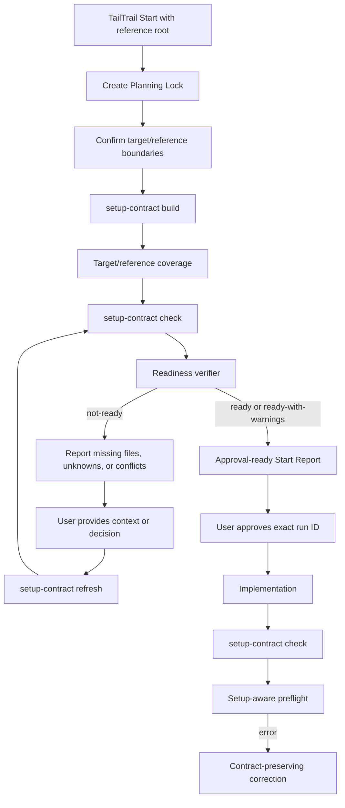
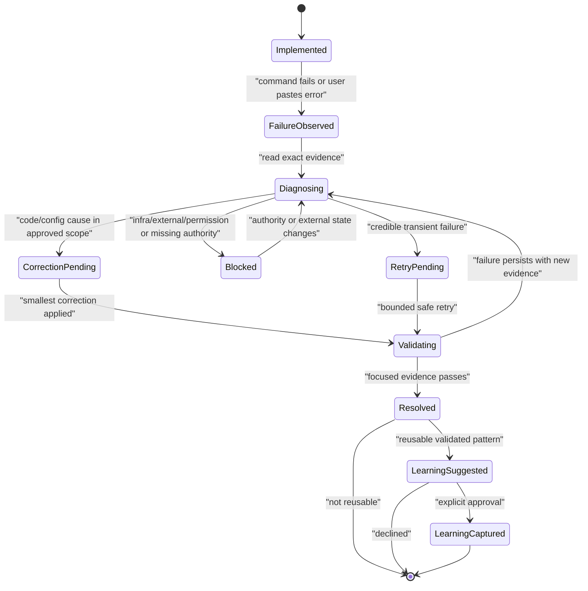

# TailTrail Prevention-First Implementation and Post-Implementation Failure Flow

## Document Status

- Status: finalized design; ready for phased implementation
- Finalized date: 2026-08-03
- Decision state: no open design decisions remain in this version; changes
  require a reviewed design amendment
- Scope: design only; no runtime implementation is included in this document
- Target branch: `master`
- Related local commit: `0314a99` (`Fix TailTrail Start context carryover`)
- Primary design objective: prevent avoidable implementation and CI/CD failures
  by gathering sufficient evidence from the target and approved reference files
  before implementation
- Secondary design objective: when an error still occurs, use it as exact
  correction evidence and an optional source of sanitized, approved learning
  without creating another Planning Lock

## Executive Summary

TailTrail should prevent avoidable failures before it handles them. When the
user supplies target files, a reference repository, or examples of an existing
organization setup, TailTrail must first inspect the relevant code and the
operational setup around it. It should extract an evidence-backed Organization
Setup Contract, compare the target with the reference, identify missing or
unknown CI/CD and infrastructure requirements, and run an independent
Implementation Readiness Review before asking the user to approve
implementation.

Only after the prevention gates pass should implementation begin. If an error
still occurs, TailTrail should treat it as a continuation of the approved run,
not as a new `tailtrail start` request. It should read the exact error, preserve
the approved Organization Setup Contract, apply the smallest compatible
correction, validate the result, and optionally propose sanitized learning.

The feature proposed here therefore has two ordered parts:

1. **Prevention path:** reference assimilation, setup-contract extraction,
   target/reference coverage, independent readiness verification, user
   approval, implementation, and preflight validation.
2. **Fallback path:** automatic error routing, sanitized failure records,
   classification, setup-preserving correction, focused validation, completion
   visibility, and separately approved learning capture.

The design intentionally reuses TailTrail's run ledger, Planning Lock,
Navigator, Learning Agent V2, graph-aware learning, adapter synchronization,
registry, and validation conventions. It does not add a dependency, store raw
logs, create a second learning database, or turn Git recovery into debugging.

## Mandatory Lifecycle Order

The implementation must preserve this order:

```mermaid
flowchart LR
    A["User requirement and provided files"] --> B["Target and reference discovery"]
    B --> C["Organization Setup Contract"]
    C --> D["Navigator plan"]
    D --> E["Independent readiness verifier"]
    E -->|"not ready"| B
    E -->|"ready"| F["User approval"]
    F --> G["Implementation"]
    G --> H["Setup-aware preflight validation"]
    H -->|"passes"| I["Completion"]
    H -->|"error"| J["Failure correction"]
    J --> K["Resolution validation"]
    K --> L["Optional approved learning"]
    L --> M["Next-iteration retrieval"]
```



Rules:

1. Learning and failure logging must not be implemented as a substitute for
   prevention.
2. Navigator must not ask for implementation approval until context coverage
   and readiness are visible.
3. Unknown required setup areas are blockers, not assumptions.
4. The approved setup checklist remains active during implementation,
   validation, failure correction, recovery, and learning.
5. A post-implementation fix must not silently revert or contradict the
   referenced organization setup.

## Primary Prevention Problem

The main failure mode is not always incorrect business logic. In organization
repositories, implementation can fail because planning inspected the obvious
source files but missed operational consumers and setup files such as:

- CI workflows and reusable workflow inputs.
- CD and environment-promotion configuration.
- Build, packaging, and artifact-publishing scripts.
- Runtime and toolchain versions.
- Container and image configuration.
- Terraform and infrastructure modules.
- IAM and permission assumptions.
- Quality gates and scanner configuration.
- Database and migration conventions.
- Repository-specific policy and validation commands.

Providing a reference repository does not solve this unless TailTrail proves
which reference files it inspected, which contracts it extracted, how they map
to the target, and which required areas remain missing or unknown.

## Reference Assimilation and Organization Setup Contract

TailTrail should analyze only target and reference roots explicitly placed in
scope. Reference roots remain read-only.

The discovery phase should produce:

```text
.tailtrail/runs/<run-id>/reference/setup-contract-v1.json
```

Each checklist item should contain:

```json
{
  "check_id": "ci-runtime-version",
  "category": "ci",
  "requirement": "Build jobs use the approved organization runtime setup.",
  "enforcement": "must-preserve",
  "reference_root": "../reference-service",
  "reference_commit": "abc123",
  "source_path": ".github/workflows/build.yml",
  "source_sha256": "...",
  "target_paths": [".github/workflows/build.yml"],
  "status": "matched",
  "evidence": "Reusable runtime workflow and version input were found.",
  "validation": "workflow contract check",
  "stale_when": "the referenced workflow or runtime version changes"
}
```

Required checklist categories:

- Business behavior and important callers.
- Build system and runtime/toolchain versions.
- CI workflows and reusable workflow contracts.
- CD, deployment, and environment promotion.
- Artifact packaging, naming, and publishing.
- Containers and runtime configuration.
- Infrastructure modules and resource assumptions.
- Identity, IAM, and permission boundaries.
- Configuration keys and providers; never secret values.
- Database, schema, and migration conventions.
- Test commands, quality gates, and scanner configuration.
- Ownership, local policy, and approval boundaries.

Enforcement values:

- `must-preserve`: cannot be contradicted without an explicit exception.
- `adaptable`: may be implemented differently if the required outcome and
  validation remain intact.
- `informational`: useful context that does not constrain the implementation.
- `unknown`: unresolved; blocks readiness when the category is required.

Coverage statuses:

- `matched`
- `missing`
- `intentionally-different`
- `not-applicable`
- `unknown`

The contract records evidence and unknowns; it does not claim that copying the
reference implementation is correct for the target.

## Setup Contract Command Lifecycle

The command namespace is a decided part of the design:

```text
tailtrail setup-contract
```

It converts approved target/reference evidence into one durable, deterministic
checklist shared by Navigator, the readiness verifier, implementation,
preflight, correction, completion, and learning. Without this artifact, each
agent or later iteration could inspect different files or forget an important
CI/CD rule from earlier chat context.

### Normal execution is automatic

The user normally does not run this command separately. When `tailtrail start`
includes an approved reference root, the atomic Start planning flow should:

1. Create the Planning Lock.
2. Confirm editable target and read-only reference boundaries.
3. Run `setup-contract build` internally.
4. Compare target and reference setup coverage.
5. Run `setup-contract check`.
6. Run the independent readiness verifier.
7. Return either blocking context questions or an approval-ready Start Report.



Building the contract is a planning operation. It may read only the approved
target/reference roots and write local `.tailtrail` planning metadata. It does
not edit project source, edit the reference, execute builds or scanners, run
Terraform or deployments, or approve implementation. The complete Start Report
remains the only response from the atomic Start invocation.

### Command operations

#### Build

```bash
tailtrail setup-contract build \
  --run-id <run-id> \
  --reference-root ../reference-service
```

Used during initial Start planning. It records repository identity, reference
commit, source paths, fingerprints, extracted requirements, target mappings,
coverage, preservation levels, validation, and stale conditions.

#### Show

```bash
tailtrail setup-contract show --run-id <run-id>
```

Read-only view for users, Navigator, the readiness verifier, or reviewers.

#### Check

```bash
tailtrail setup-contract check --run-id <run-id>
```

Runs automatically before implementation approval, before implementation,
after protected setup paths change, before completion, and before applying a
post-implementation correction. It verifies freshness, required coverage,
preservation rules, protected paths, and approved exceptions.

#### Refresh

```bash
tailtrail setup-contract refresh \
  --run-id <run-id> \
  --reference-root ../reference-service
```

Used when reference files change, the user provides more setup files, readiness
finds missing context, a required item remains unknown, or the target setup
changes materially. Refresh creates a new revision with provenance; it does not
silently overwrite approved evidence.

#### Exception

```bash
tailtrail setup-contract exception \
  --run-id <run-id> \
  --check-id <check-id> \
  --approved
```

Used only after TailTrail presents the exact conflict, reference evidence,
alternatives, proposed deviation, affected files, risks, and required
validation. The approved exception is append-only and does not rewrite the base
contract.

### When manual execution is appropriate

Manual use is optional and limited to:

- Reviewing the extracted checklist.
- Adding a reference after Start.
- Refreshing stale reference evidence.
- Investigating a `not-ready` result.
- Approving an unavoidable setup exception.
- Using setup-contract analysis outside the full Start workflow.

Implementation approval is available only after the contract is complete and
fresh, readiness is `ready` or `ready-with-warnings`, Navigator's plan is
verified, and the user approves the exact Planning Lock run ID.

## Independent Implementation Readiness Review

After Navigator drafts the plan, a separate verifier should evaluate the plan
against deterministic evidence. The verifier may be a separate agent, but the
gate must not rely only on another model's opinion.

Verifier inputs:

- Original requirement and acceptance criteria.
- Target repository map and important callers.
- Approved reference roots and commits.
- Organization Setup Contract.
- Target/reference coverage report.
- Navigator's proposed files and steps.
- Proposed validation commands and approval boundaries.
- Known unknowns and intentional deviations.

Verifier checks:

- Every requirement maps to implementation and validation.
- Required setup categories were inspected.
- CI/CD and infrastructure consumers are included.
- Reference-derived claims include source paths and commit evidence.
- Missing and unknown setup items are visible.
- Proposed changes preserve `must-preserve` rules.
- New dependencies and infrastructure mutations have the correct gates.
- The change can be validated before deployment.
- The plan addresses both local execution and CI/CD execution.

Readiness states:

- `ready`: no unresolved blockers.
- `ready-with-warnings`: risks are explicit and do not invalidate the plan.
- `not-ready`: required context, setup contracts, or validation remain missing.

Navigator must not ask for implementation approval while the verifier reports
`not-ready`.

## Setup Preservation During Error Correction

The approved setup contract is an invariant ledger for the rest of the run.
Every proposed correction must be classified as:

- `compatible`
- `unknown-impact`
- `contract-conflict`
- `requires-exception`

TailTrail must not silently:

- Revert referenced organization setup.
- Replace a reusable workflow with a simpler local workflow.
- Remove required inputs, checks, permissions, packaging, or validation.
- Apply broad Git recovery across protected setup paths.
- Change infrastructure, deployment, dependency, or data contracts to make an
  error disappear.

If no compatible correction exists, TailTrail should show the exact setup rule,
reference evidence, affected target files, alternatives considered, proposed
exception, risks, and validation requirement. It must then wait for explicit
user approval.

Approved exceptions are append-only:

```text
.tailtrail/runs/<run-id>/reference/setup-exceptions/exception-0001.json
```

The original approved contract is not rewritten. An exception contains the
check ID, conflict, alternatives, approved deviation, affected paths,
validation, owner/approval signal, and stale or expiry condition.

## User Problem

Development may be complete from the agent's perspective, but execution can
still expose mismatches such as:

- Incorrect implementation logic.
- Missing caller or integration behavior.
- Environment-specific configuration.
- Infrastructure or IAM differences.
- Dependency or runtime-version mismatches.
- Database or migration assumptions.
- External-service failures.
- Permission errors.
- Transient network or platform failures.

The failure may be discovered in either of two ways:

1. The agent runs an approved command and receives a non-zero exit code.
2. The user pastes an error, stack trace, or log excerpt into the conversation.

Today, TailTrail has safe Git recovery and a repeated-evidence diagnostician,
but it does not have one explicit flow for a first post-implementation runtime
failure. The general skill, Navigator, run ledger, completion reporting, and
learning pipeline have the required building blocks but are not connected into
this lifecycle.

## Goals

1. Gather sufficient evidence from the target and approved reference files
   before implementation.
2. Extract and preserve organization-specific CI/CD, infrastructure,
   configuration, validation, and ownership contracts.
3. Independently verify Navigator's plan before asking for user approval.
4. Block implementation when required context or setup remains unknown.
5. Run setup-aware preflight validation after implementation.
6. Diagnose remaining post-implementation failures without requiring a special
   prompt.
7. Never treat a pasted error as a new TailTrail Start invocation.
8. Continue under the same approved run when the failure is within its scope.
9. Prevent corrections and recovery from silently violating the approved setup
   contract.
10. Separate diagnosis from mutation authority.
11. Distinguish code, configuration, infrastructure, dependency, permission,
   data, external-service, transient, and unknown failures.
12. Preserve exact evidence during diagnosis without persisting sensitive raw
   logs by default.
13. Prevent completion claims while a recorded execution failure remains open.
14. Suggest durable learning only after a verified resolution.
15. Require explicit approval before writing Learning Agent events.
16. Retrieve a maximum of three relevant learnings in later iterations and
    verify them against current evidence.

## Non-Goals

- Automatically modifying cloud infrastructure, Terraform, deployments,
  databases, IAM, or external services.
- Automatically adding or changing dependencies.
- Persisting complete logs, raw prompts, secrets, environment variables, or
  source snippets.
- Replacing observability, APM, CI, or incident-management platforms.
- Polling a service or continuously monitoring execution.
- Automatically promoting every resolved error into curated learning.
- Reusing stale learning when current code, CI, policy, or scanner evidence
  disagrees.
- Replacing TailTrail's existing Mode A or Mode B Git recovery mechanisms.
- Creating a new Planning Lock for an ordinary follow-up error.

## Existing Components and Reuse Decisions

| Existing component | Current responsibility | Design decision |
|---|---|---|
| `scripts/cross-repo-reference.py` | Enforces editable-target/read-only-reference boundaries | Extend or reuse for explicit reference-root identity, commit, and file provenance |
| `scripts/code-graph-mapper.py` | Maps code relationships | Reuse for source impact; complement with setup/configuration contract discovery |
| `scripts/planning-lock.py` | Approves source mutation for one run | Reuse unchanged; an approved run remains the correction boundary |
| `scripts/run-ledger.py` | Append-only local run events | Extend with execution-failure lifecycle events |
| `scripts/recovery-diagnostician.py` | Diagnoses repeated structured architecture/behavior/scope findings | Keep unchanged for repeated harness findings; do not overload it with raw execution errors |
| `scripts/task-recovery.py` | Restores verified task-owned Git paths | Keep unchanged; Git restoration is not the normal debugging path |
| `scripts/navigator.py` | Selects features, context, commands, and approvals | Make setup assimilation and readiness evidence precede approval; then recognize post-implementation failure evidence |
| `hooks/learning-capture-hook.py` | Suggests or performs approved compact learning capture | Reuse; invoke only after validated resolution |
| `scripts/learning-agent.py` | Scores events and promotes curated learning | Reuse existing fields and confidence model |
| `scripts/graph-learning.py` | Matches learning by tags, files, and graph scope | Reuse unchanged for next-iteration retrieval |
| `scripts/workflow-dashboard.py` | Aggregates run status | Extend with open/resolved execution-failure status |
| `scripts/completion-report.py` | Reports evidence-backed completion | Treat unresolved execution failures as evidence-incomplete |
| Adapter sources and targets | Host-specific agent behavior | Add the same failure-routing and authority boundary across hosts |

## Terminology

- **Execution failure:** A command, runtime, integration, deployment precheck,
  or user-observed behavior that contradicts the implemented outcome.
- **Failure evidence:** Exact error information available in the current
  conversation or a user-approved local artifact.
- **Failure record:** A sanitized structured artifact under the existing run.
- **Correction cycle:** Diagnosis, bounded correction, and focused validation
  performed within the same approved run.
- **Git recovery:** Restoration of verified task-owned paths. This is different
  from correcting a runtime failure.
- **Learning candidate:** A sanitized reusable pattern proposed only after the
  correction is validated.

## User Experience

### Agent-run failure

Example:

```text
Agent runs: npm test -- auth
Command exits 1 with an authorization assertion failure.
```

Expected TailTrail behavior:

1. Preserve the exact failing command and relevant error in working context.
2. State that the existing implementation run is entering a correction cycle.
3. Classify the failure provisionally.
4. Inspect the failing test, implementation, callers, configuration, and recent
   diff.
5. Apply the smallest correction if it stays inside approved scope.
6. Rerun the exact focused command.
7. Record resolved or blocked status in local run metadata when a run ID exists.
8. Suggest sanitized learning capture only if the result is reusable.

### User-pasted failure

Example:

```text
TypeError: Cannot read properties of undefined (reading 'role')
    at authorize (...)
```

Expected TailTrail behavior:

1. Do not invoke `tailtrail start`.
2. Do not create a new Planning Lock.
3. Treat the pasted text as exact diagnostic evidence.
4. If the same conversation already authorized implementation, continue within
   that approved scope.
5. If no implementation authority exists, diagnose read-only and request
   approval before editing.
6. Do not persist the raw pasted text in learning or run metadata.

### External or infrastructure failure

Example:

```text
403 AccessDenied while applying an infrastructure change.
```

Expected TailTrail behavior:

1. Inspect code, configuration, role assumptions, and deployment inputs.
2. Classify the failure as permission, infrastructure, or external-service
   evidence rather than assuming a code defect.
3. Avoid unrelated code changes.
4. Request explicit approval before Terraform apply, cloud mutations, deploys,
   IAM changes, database changes, or destructive commands.
5. Record `blocked` when the correction requires unavailable authority or an
   external-state change.

## Conversational Trigger Rules

The flow is selected when the current message or command result contains a
credible execution-failure signal and the conversation has implementation or
validation context.

Positive signals include:

- Non-zero exit code from a focused project command.
- Stack trace or exception header.
- Compiler, test, runtime, configuration, database, permission, or deployment
  error.
- User wording such as “this failed,” “I get this error,” or “execution is
  broken.”

Negative rules:

- Never infer `tailtrail start` from history.
- Never create a run merely because text resembles an error.
- Never interpret an error excerpt as implementation approval when no prior
  implementation authority exists.
- Never record learning during initial diagnosis.
- Never broaden into infrastructure mutation because a log mentions cloud or
  Terraform.

No special phrase is required. Optional explicit aliases may be provided for
users who want deterministic routing:

```text
debug this failure
use failure flow
continue the correction cycle
```

## Failure Classification

The stored classification is provisional until evidence supports a root cause.

| Classification | Typical evidence | Default route |
|---|---|---|
| `code` | Exception in changed logic, failing focused behavior test | Inspect implementation and callers; correct in approved scope |
| `configuration` | Missing key, invalid config, environment mismatch | Inspect configuration sources and validation; avoid embedding environment values in code |
| `environment` | Toolchain, path, OS, runtime, or local setup mismatch | Compare declared and actual environment; avoid project changes when setup is the cause |
| `infrastructure` | Terraform plan/apply, network, service, or resource mismatch | Diagnose read-only; require approval for mutation |
| `dependency` | Import/module/version/API incompatibility | Apply Dependency Gate before manifest or lock-file changes |
| `permission` | 401, 403, IAM, filesystem, token scope | Inspect identity and authorization boundaries; never expose credentials |
| `data` | Schema, migration, constraint, serialization, or corrupt input | Preserve data-integrity safeguards; require approval for data mutation |
| `external-service` | Vendor outage, API failure, rate limit, unavailable service | Distinguish product defect from external blocker; use bounded retry only when safe |
| `transient` | Timeout or intermittent network/platform signal | Retry safely and finitely before changing code |
| `unknown` | Insufficient evidence | Preserve evidence, state hypotheses, and avoid speculative edits |

The classifier must not claim certainty from keywords alone. The artifact should
contain `classification_confidence` with one of:

- `observed`
- `supported-hypothesis`
- `unknown`

## Correction Authority Matrix

| Action | Same approved run | Awaiting-approval run | No active run |
|---|---:|---:|---:|
| Read pasted error and inspect source | Allowed | Allowed as read-only planning/diagnosis | Allowed read-only |
| Record sanitized failure metadata | Allowed | Do not record; reference pending run | Do not create a run automatically |
| Edit already-approved source paths | Allowed when root cause is in scope | Not allowed | Requires implementation authorization |
| Add new source area or requirement | Replan/amend scope first | Not allowed | Requires implementation authorization |
| Rerun same focused safe command | Allowed when project policy permits | Do not run project command | Requires normal command authorization |
| Run broad test/build/scanner | Follow existing explicit approval rules | Not allowed | Follow existing explicit approval rules |
| Change dependency or lock file | Dependency Gate and approval | Not allowed | Dependency Gate and approval |
| Terraform/deploy/cloud/database mutation | Explicit command-specific approval | Not allowed | Explicit command-specific approval |
| Destructive recovery | Existing recovery approval only | Not allowed | Existing recovery approval only |
| Capture durable learning | Separate explicit learning approval | Separate explicit learning approval | Separate explicit learning approval |

## State Model



Allowed persisted statuses:

- `observed`
- `diagnosing`
- `correction-pending`
- `validating`
- `blocked`
- `resolved`

Status transitions must be validated. A resolved failure cannot return to open;
a later recurrence creates a new failure record linked with `recurs_from`.

## Final Local Artifact Design

Location:

```text
.tailtrail/runs/<run-id>/execution-failures/failure-0001.json
```

Proposed schema shape:

```json
{
  "schema_version": "1",
  "type": "tailtrail-execution-failure",
  "failure_id": "failure-0001",
  "run_id": "start-...",
  "status": "observed",
  "observed_at": "2026-08-03T00:00:00+00:00",
  "source": "agent-command",
  "classification": "unknown",
  "classification_confidence": "unknown",
  "evidence": {
    "exit_code": 1,
    "command_label": "focused auth test",
    "artifact_reference": null,
    "artifact_sha256": null,
    "error_code": "AssertionError",
    "project_frame": "tests/auth.test.js",
    "raw_persisted": false
  },
  "scope": {
    "planning_lock_status": "approved",
    "approved_paths": ["src/auth.js", "tests/auth.test.js"],
    "suspected_paths": ["src/auth.js"]
  },
  "diagnosis": {
    "hypotheses": [],
    "root_cause": null,
    "evidence_label": "local-evidence"
  },
  "resolution": {
    "changed_paths": [],
    "validation_commands": [],
    "validation_outcome": "not-run",
    "resolved_at": null
  },
  "learning": {
    "suggested": false,
    "captured_event_id": null
  },
  "recurs_from": null,
  "boundary": "Raw logs, prompts, secrets, environment values, and source bodies are not stored."
}
```

### Evidence persistence rules

- Raw logs remain in current conversational/tool context or at a user-provided
  local path.
- TailTrail does not copy raw logs into `.tailtrail/`.
- `artifact_reference` must be project-relative unless policy explicitly allows
  an external local reference.
- If a local artifact is supplied, TailTrail may store its SHA-256 digest and
  line count for correlation without storing its contents.
- Do not persist full commands when they may contain tokens, passwords, headers,
  connection strings, or customer values.
- `command_label`, `error_code`, and `project_frame` must be compact and length
  limited.
- Sanitization is defense in depth, not permission to store raw text.

## Final CLI Design

```text
tailtrail failure record
tailtrail failure show
tailtrail failure diagnose
tailtrail failure resolve
```

Examples:

```bash
tailtrail failure record \
  --run-id start-20260803-abc123 \
  --source agent-command \
  --exit-code 1 \
  --command-label "focused auth test" \
  --error-code AssertionError \
  --project-frame tests/auth.test.js
```

```bash
tailtrail failure diagnose \
  --run-id start-20260803-abc123 \
  --failure-id failure-0001 \
  --classification code \
  --confidence supported-hypothesis \
  --suspected-path src/auth.js \
  --hypothesis "Authorization guard reads the role before request normalization."
```

```bash
tailtrail failure resolve \
  --run-id start-20260803-abc123 \
  --failure-id failure-0001 \
  --root-cause "Authorization ran before request normalization." \
  --changed-path src/auth.js \
  --validation-command "npm test -- auth" \
  --validation-outcome pass
```

CLI rules:

- `record` requires an existing run and an approved Planning Lock when that run
  has a Planning Lock.
- `record` never accepts a raw log body.
- `diagnose` writes hypotheses and classification only; it does not edit source.
- `resolve` requires a root cause and validation outcome.
- `resolve --validation-outcome pass` may emit a learning-capture suggestion.
- `resolve` must not execute the suggested learning command.
- `show` is read-only and returns the latest or requested failure.
- Unknown options and invalid transitions fail closed with exit code 2.

## Final Agent Behavior

The agent remains responsible for understanding exact source and evidence.
The deterministic tool records state; it does not pretend to infer a root cause
from arbitrary logs.

Agent algorithm:

1. Identify the current run and Planning Lock state from explicit conversation
   context or local run state. Do not guess a different run.
2. Preserve the exact error in current context.
3. Inspect the recent diff, failing path, callers, configuration, and focused
   tests.
4. Classify the failure provisionally.
5. State whether the correction is inside approved scope.
6. Record sanitized failure metadata only when an approved run exists.
7. Apply the smallest correction or report the authority/external blocker.
8. Rerun the exact focused failure command when safe.
9. Record resolution and evidence honestly.
10. Offer approved learning capture only for reusable validated patterns.

## Learning Integration

No second learning implementation is proposed. The resolved failure is mapped
into existing Learning Agent V2 fields:

| Failure information | Existing learning field |
|---|---|
| Failure domain | `task_type` and `tags` |
| Stable runtime/scanner/error identifiers | `issue_ids` |
| Corrected files/modules | `files` |
| Root-cause/fix summary | `solution_summary` |
| Reusable rule | `learning_candidate` |
| Focused validation | `validation_commands` and `validation_outcome` |
| User/reviewer acceptance | `acceptance` and `review_status` |
| Invalidation condition | `stale_when` |

Example suggested command after resolution:

```bash
python3 hooks/learning-capture-hook.py \
  "Resolved authorization failure after request normalization change" \
  --root . \
  --type bug \
  --tags bug,authorization,runtime \
  --file src/auth.js \
  --issue-ids AssertionError \
  --solution "Run request normalization before authorization guards." \
  --candidate "Authorization guards in this service require normalized request context." \
  --validation-command "npm test -- auth" \
  --validation-outcome pass \
  --stale-when "request middleware ordering or authorization ownership changes"
```

The suggestion omits `--approved`. Capture occurs only after the user approves
and the hook is rerun with `--approved`.

### Next-iteration retrieval

1. Navigator checks `.tailtrail/learning-index.md` and
   `.tailtrail/graph-learning-index.json` for meaningful non-tiny work.
2. Matching uses tags, files, task type, issue identifiers, and graph scope.
3. At most three candidate or trusted learnings are shown.
4. The user can choose `use learnings`, `ignore learnings`, or `edit plan`.
5. Current source, tests, CI, scanner results, policy, and guardrails override
   historical learning.
6. A contradicted or stale learning enters the existing Learning Refresh flow.

## Completion and Dashboard Semantics

An unresolved execution failure means the implementation cannot currently be
claimed complete.

Proposed dashboard fields:

```json
{
  "execution_failures": {
    "total": 2,
    "open": 1,
    "resolved": 1,
    "latest_failure_id": "failure-0002",
    "status": "correction-required"
  }
}
```

Rules:

- `workflow-dashboard` reports `none`, `correction-required`, `blocked`, or
  `resolved`.
- `completion-report` returns `evidence-incomplete` when any failure is open or
  blocked.
- Existing completion artifacts are append-only historical snapshots; do not
  rewrite them.
- A new completion report must be generated after resolution and validation.
- `task-start.py` should treat an unresolved execution failure for the explicit
  run ID as correction-cycle evidence.
- TailTrail must not search other runs for a convenient failure artifact.

## MCP Design

The first release adds three read-only tools:

```text
setup_contract_show
implementation_readiness_show
execution_failure_show
```

Inputs:

- `root`
- `run_id`
- optional `failure_id` for `execution_failure_show`

Output:

- Structured sanitized failure artifact.
- `execution.read_only: true`.

Do not add an MCP tool that ingests arbitrary raw logs. Recording and resolving
remain CLI/agent workflow operations in the first release. A controlled write
tool can be evaluated later if host demand justifies the extra approval surface.

## Detailed File Change Plan

### New files

#### `context/reference-assimilation.md`

Purpose: canonical discovery workflow for target/reference boundaries,
operational setup categories, provenance, coverage, unknowns, and drift.

#### `scripts/setup-contract.py`

Purpose: build, validate, show, fingerprint, and refresh the Organization Setup
Contract using approved target/reference evidence. It must not copy reference
files or edit the target.

Proposed commands:

```text
tailtrail setup-contract build
tailtrail setup-contract show
tailtrail setup-contract check
tailtrail setup-contract refresh
tailtrail setup-contract exception
```

#### `schemas/setup-contract.schema.json`

Purpose: validate checklist categories, enforcement, provenance, target mapping,
coverage status, validation, freshness, and protected paths.

#### `schemas/setup-contract-exception.schema.json`

Purpose: validate append-only approved deviations without rewriting the
original setup contract.

#### `tests/test_setup_contract.py`

Purpose: verify reference-root boundaries, completeness, provenance,
fingerprints, protected paths, freshness, and exceptions.

#### `scripts/implementation-readiness.py`

Purpose: deterministic readiness gate over requirements, Navigator output,
setup coverage, unknowns, preservation rules, and validation mapping.

Proposed commands:

```text
tailtrail readiness check
tailtrail readiness show
```

#### `schemas/implementation-readiness.schema.json`

Purpose: validate `ready`, `ready-with-warnings`, and `not-ready` reports,
blocking findings, warnings, evidence, and required plan changes.

#### `tests/test_implementation_readiness.py`

Purpose: prove that required unknowns and setup conflicts block approval while
documented non-blocking differences remain warnings.

#### `context/post-implementation-failure.md`

Purpose: canonical agent workflow for error intake, classification, authority,
correction, validation, and optional learning.

Required sections:

- Trigger and negative-trigger rules.
- Current-run reuse rule.
- Classification table.
- Authority matrix.
- Exact evidence and privacy rules.
- Code/configuration/infrastructure routing.
- Validation and completion rules.
- Learning suggestion and approval boundary.

#### `scripts/execution-failure.py`

Purpose: deterministic local artifact lifecycle.

Functions:

- `failure_dir(root, run_id)`
- `list_failures(root, run_id)`
- `next_failure_id(root, run_id)`
- `record(root, run_id, ...)`
- `show(root, run_id, failure_id=None)`
- `diagnose(root, run_id, failure_id, ...)`
- `resolve(root, run_id, failure_id, ...)`
- `validate_transition(current, requested)`
- `learning_suggestion(payload)`
- `main()`

Implementation requirements:

- Standard library only.
- Reuse `scripts/run-ledger.py` dynamic loader and `atomic_json` convention.
- Reuse `scripts/planning-lock.py` for write-boundary checks when applicable.
- Validate run ID and failure ID as single local identifiers.
- Reject path traversal and external artifact paths by default.
- Never accept or write raw log bodies.
- Bound free-text field lengths.
- Return JSON and exit code 2 for validation errors.

#### `schemas/execution-failure.schema.json`

Purpose: validate schema version, type, identifiers, enums, nested evidence,
diagnosis, scope, resolution, learning, recurrence, and the privacy boundary.

#### `tests/test_execution_failure.py`

Purpose: focused runnable behavior contract.

Coverage is listed in the Test Plan section below.

### Modified core behavior files

#### `skills/tailtrail/SKILL.md`

- Add Post-Implementation Failure Flow routing.
- State that pasted errors automatically enter diagnosis.
- Continue an approved run without Start.
- Preserve mutation approval boundaries.
- Suggest learning only after validated resolution.

#### `skills/tailtrail-start/SKILL.md`

- No new behavior is required if the current-turn negative trigger from commit
  `0314a99` remains intact.
- Add only a cross-reference to the failure flow if review finds it necessary.

#### `AGENTS.md`

- Add the portable failure-flow contract after the current-turn Start boundary.
- Keep the rule compact enough for installed project guidance.

#### `scripts/tailtrail.py`

- Add `setup-contract` and `readiness` to command help and dispatch.
- Add `failure` to command help.
- Dispatch `tailtrail failure ...` to `scripts/execution-failure.py`.
- Do not route arbitrary free-form errors through Start.

#### `scripts/run-ledger.py`

Add event types:

- `execution_failure_recorded`
- `execution_failure_diagnosed`
- `execution_failure_blocked`
- `execution_failure_resolved`

Update projections only if a compact activity count is useful; do not embed raw
failure bodies in ledger events.

#### `schemas/run-event.schema.json`

- Add the four execution-failure event names to the allowed enum.

#### `scripts/navigator.py`

- Select Reference Assimilation when approved reference roots are provided.
- Require setup-contract coverage before rendering the approval request.
- Integrate the readiness verifier and suppress implementation approval while
  status is `not-ready`.
- Show reference commits, missing setup files, unknowns, protected paths, and
  intentional differences.
- Detect execution-failure signals independently of TailTrail Start.
- Select `Post-Implementation Failure Flow` for meaningful error evidence.
- Load `context/post-implementation-failure.md` and exact relevant evidence.
- Reuse current-run evidence only when an explicit run ID is available.
- Suggest the `tailtrail failure` command only when a run exists.
- Do not run learning capture automatically.

#### `scripts/navigator_render.py`

- Add a compact Failure Correction section if the current generic feature
  renderer cannot present run, classification, authority, and next evidence
  clearly.
- Skip modification if existing generic sections are sufficient.

#### `scripts/task-start.py`

- Include setup-contract and readiness artifacts for the explicit run.
- Do not mark a run implementation-ready when readiness is `not-ready`.
- Include unresolved execution failures as correction-cycle evidence for the
  explicitly requested run.
- Do not scan other runs.

#### `scripts/workflow-dashboard.py`

- Report setup-contract freshness and readiness status.
- Report approved setup exceptions separately from the base contract.
- Aggregate sanitized failure artifacts.
- Report counts and latest status.
- Treat open/blocked failures as correction required.

#### `schemas/workflow-dashboard.schema.json`

- Add the optional `execution_failures` object while maintaining compatibility
  with runs created before this feature.

#### `scripts/completion-report.py`

- Require a non-stale setup contract and non-blocking readiness result when
  reference assimilation was selected.
- Verify that changed protected paths have approved exceptions.
- Add execution-failure evidence to source artifacts.
- Return `evidence-incomplete` while an open or blocked failure exists.
- Require resolution validation before a new complete report.

#### `schemas/completion-report.schema.json`

- Add an optional execution-failure summary and source reference.
- Keep `additionalProperties: true` compatibility where currently used.

### Modified intent and context files

#### `scripts/expand-intent.py`

- Add a `reference readiness` flow for explicit setup/reference requests.
- Keep automatic setup assimilation tied to provided reference roots and
  non-trivial operational work.
- Add a `failure` flow expansion for explicit aliases.
- Load the new context and exact failure evidence.
- Avoid raw-log persistence, broad scans, and infrastructure mutation.
- Include focused reproduction and validation order.

#### `context/intent-aliases.md`

Add aliases:

- `debug this failure`
- `use failure flow`
- `continue correction cycle`

These aliases are optional conveniences; automatic conversational routing does
not depend on them.

#### `context/flow-catalog.md`

- Add `reference-readiness` as the prevention flow.
- Add `failure` as a named flow for diagnosis, bounded correction, validation,
  and optional learning suggestion.

#### `context/TailTrail.map.md`

- Route reference-repository, CI/CD setup, deployment, and organization-pattern
  tasks to reference assimilation and readiness before implementation.
- Route execution/runtime/log failure tasks to the new context slice.

#### `context/slices.md`

- Add compact reference assimilation and implementation-readiness slices.
- Add one compact post-implementation failure slice.
- Explicitly avoid loading all recovery and learning history.

#### `context/navigator.md`

- Document prevention-first ordering and the `not-ready` approval block.
- Document automatic selection, current-run reuse, completion impact, and
  learning suggestion behavior.

### Modified adapter source files

Add one consistent **Post-implementation failure** contract to:

- `adapters/claude.md`
- `adapters/chatgpt-instructions.md`
- `adapters/copilot-instructions.md`
- `adapters/cursor.mdc`
- `adapters/gemini.md`

Contract requirements:

- Inspect approved reference roots and operational setup before implementation.
- Preserve `must-preserve` setup rules throughout the run.
- Do not ask for implementation approval while readiness is `not-ready`.
- Read agent-run or user-pasted error evidence without a special prompt.
- Do not invoke Start.
- Continue the same approved run when in scope.
- Diagnose read-only when authority is missing.
- Block corrections that conflict with the setup contract and request an exact
  exception from the user.
- Require explicit approval for infra/deploy/cloud/database mutation.
- Never persist raw logs as learning.
- Suggest sanitized learning only after validation.

Run the existing adapter synchronizer to update:

- `CLAUDE.md`
- `GEMINI.md`
- `.github/copilot-instructions.md`
- `.openai/chatgpt-instructions.md`
- `.cursor/rules/tailtrail.mdc`

Do not hand-edit synchronized targets.

### Modified MCP and registry files

#### `scripts/mcp-server.py`

- Add read-only `setup_contract_show` and `implementation_readiness_show` tools.
- Add read-only `execution_failure_show` definition and handler.
- Register it in `READ_ONLY_TOOLS` through the existing registry projection.
- Ensure no arbitrary file-read or raw-log input is exposed.

#### `MCP-SERVER.md`

- Document the read-only tool and its privacy boundary.

#### `tailtrail-registry.json`

Add two new core feature entries instead of overloading
`mode-b-recovery-and-diagnosis`:

1. `reference-assimilation-and-readiness`
2. `post-implementation-failure-flow`

The first feature must be implemented and listed as a dependency of the second
so registry metadata reflects the prevention-first delivery order.

Final failure-flow entry skeleton:

```json
{
  "id": "post-implementation-failure-flow",
  "title": "Post-Implementation Failure Flow",
  "status": "implemented",
  "surface": "core",
  "owner": "tailtrail-core",
  "governance_class": "governance",
  "commands": ["tailtrail failure"],
  "docs": [
    "context/post-implementation-failure.md",
    "USER-GUIDE.md",
    "TAILTRAIL-COMMANDS.md",
    "schemas/execution-failure.schema.json"
  ],
  "scripts": ["scripts/execution-failure.py"],
  "tests": ["tests/test_execution_failure.py"],
  "mcp_tools": ["execution_failure_show"],
  "requires_approval": true,
  "read_only": false,
  "evidence_label": "local-evidence",
  "depends_on": [
    "planning-lock",
    "canonical-local-state",
    "reference-assimilation-and-readiness",
    "learning"
  ],
  "since_version": "vNext",
  "deprecated_in_version": null
}
```

Final registry approval semantics:

- Use `requires_approval: true` for both new feature entries because their
  controlled operations require an explicit Start/reference request or an
  already approved run.
- Use `read_only: false` because the CLI writes local TailTrail metadata.
- Document operation-level behavior: `show` and `check` views are read-only;
  build/refresh/exception and failure state transitions are controlled by the
  exact run and approval rules defined in this design.
- MCP exposes only the separately registered read-only show tools.

#### `tailtrail-registry.schema.json`

- Do not change the schema in this release. Keep feature-level approval metadata
  and document operation-level boundaries in the registry entry and command
  documentation.

### Modified packaging files

#### `scripts/install_surfaces.py`

- Add `scripts/setup-contract.py` and `scripts/implementation-readiness.py` to
  the core script profile.
- Add `scripts/execution-failure.py` to the core script profile.
- Add the new context and schema through the registry/core file inventory.

#### `scripts/install-local.py`

- Include the new context/schema/script if this installer maintains explicit
  file lists beyond registry projection.
- Preserve `.tailtrail/` ignore behavior.

#### `scripts/install-copilot.py`

- Include the new script/context/schema in managed pack lists where required.
- Do not add a new prompt entrypoint; normal error messages should route without
  a command-specific prompt.

#### `scripts/install-launcher.py`

- No change expected because dispatch remains through `scripts/tailtrail.py`.

### Modified documentation files

#### `TAILTRAIL-COMMANDS.md`

- Add `tailtrail setup-contract` and `tailtrail readiness` commands before the
  failure commands.
- Add `tailtrail failure record|show|diagnose|resolve` examples and approval
  notes.

#### `USER-GUIDE.md`

- Lead with the prevention sequence: reference assimilation, setup coverage,
  readiness, approval, implementation, and preflight.
- Include an Organization Setup Contract checklist and exception example.
- Add end-to-end agent-run and user-pasted failure examples.
- Document classification, local artifacts, privacy, completion, and learning.

#### `README.md`

- Add one compact prevention-first capability summary and link to the User
  Guide.
- Do not duplicate the full design.

#### `LEARNING-GOVERNANCE.md`

- Clarify that resolved failures may create candidates, but raw logs and initial
  diagnosis never become learning events.

#### `GUARDRAILS.md`

- Add a short failure-evidence rule only if current Exactness, Validation Truth,
  Safeguards, and Approval Boundary sections are insufficient.
- Prefer no change if existing rules already cover the behavior.

### Modified test files

#### `tests/test_navigator_core.py`

- Provided reference roots select setup-contract discovery.
- Required setup unknowns suppress the implementation approval prompt.
- `ready` and `ready-with-warnings` allow the normal approval gate.
- Missing CI/CD target mappings appear in the plan.
- Error evidence selects the failure flow.
- Error evidence does not select Start.
- Explicit run ID scopes the suggested failure command.
- No run ID results in conversational diagnosis without local state creation.
- Learning capture is suggested only after resolution evidence.

#### `tests/test_run_ledger.py`

- New event types validate and project correctly.
- Ledger payloads do not contain raw logs.

#### `tests/test_workflow_dashboard.py`

- Setup-contract freshness and readiness are visible.
- Approved exceptions are distinguished from the base contract.
- Open failure reports correction required.
- Blocked failure reports blocked.
- All resolved failures report resolved.
- Legacy runs without failure artifacts remain compatible.

#### `tests/test_completion_report.py`

- Stale contracts and `not-ready` status prevent completion.
- Protected-path changes require an approved exception.
- Open or blocked failure prevents complete status.
- Resolved failure with passing validation permits a new completion report.
- Historical completion artifacts remain unchanged.

#### `tests/test_mcp_server.py`

- `setup_contract_show` and `implementation_readiness_show` are read-only and
  registry-projected.
- `execution_failure_show` is read-only and registry-projected.
- Unknown run/failure fails safely.
- Tool cannot read arbitrary paths or raw logs.

#### `tests/test_install_profiles.py`

- Core and extended installations include the new files.

#### `tests/test_tailtrail_registry.py` and `tests/test_registry_drift.py`

- Registry entry references existing docs, script, test, schema, and MCP tool.

#### `tests/test_start_entrypoints.py`

- Retain the current-turn boundary regression.
- Add a negative assertion that post-implementation failure guidance does not
  invoke Start.

## Focused Test Plan

### Reference discovery and setup contract

1. Only explicitly approved target and reference roots are inspected.
2. Reference roots remain read-only.
3. The contract records repository identity, commit, source path, and content
   hash for each reference-derived requirement.
4. Required setup categories are `matched`, `missing`,
   `intentionally-different`, `not-applicable`, or `unknown`.
5. Missing and unknown required CI/CD categories remain visible.
6. Secret values and environment values are never captured.
7. Reference changes mark the contract stale.
8. Protected paths and `must-preserve` rules are deterministic.
9. The base contract is immutable after approval.
10. Approved exceptions are append-only and reference an exact check ID.

### Implementation readiness

1. Every requirement must map to an implementation step and validation.
2. Required unknown setup items produce `not-ready`.
3. Missing reusable workflow inputs produce a blocking finding.
4. Intentional target/reference differences with evidence can be warnings.
5. Unsupported assumptions produce a blocker.
6. The verifier cannot approve work; it only reports readiness.
7. Navigator suppresses the approval request while status is `not-ready`.
8. Readiness consumes the explicit run's contract and does not search other
   runs.

### Setup-aware implementation and preflight

1. Planned changes preserve all `must-preserve` rules.
2. Protected-path changes without an exception are rejected.
3. Repository-native configuration and workflow checks are included.
4. Runtime, packaging, workflow input, and deployment contract mismatches fail
   preflight before completion.
5. Broad scanners, deployments, and infrastructure mutations retain their
   existing approval gates.

### Artifact lifecycle

1. Recording creates `failure-0001` under the explicit run.
2. A second record creates `failure-0002` without overwriting the first.
3. Invalid run IDs and path traversal are rejected.
4. Recording against an awaiting-approval Planning Lock is rejected.
5. Raw-log arguments are not accepted.
6. Artifact paths outside the project are rejected by default.
7. Allowed status transitions succeed.
8. Invalid transitions fail without modifying the artifact.
9. Resolve requires root cause and validation outcome.
10. Recurrence links to an earlier failure without reopening it.

### Classification and authority

1. Classification enums accept only documented values.
2. `unknown` remains valid when evidence is insufficient.
3. Infra/permission/data classifications produce mutation-approval guidance.
4. Dependency classification produces Dependency Gate guidance.
5. Transient classification recommends bounded retry, not immediate code edits.

### Privacy and exactness

1. Artifact never contains the supplied raw error body.
2. Token-like, authorization-header, connection-string, and environment-value
   fixtures are not persisted.
3. Ledger events contain identifiers and status only.
4. Project-relative evidence references are normalized.
5. Long text fields are rejected or bounded deterministically.

### Learning

1. Observed, diagnosing, blocked, and failed-validation states do not suggest
   learning capture.
2. Resolved plus passing validation may produce a suggestion.
3. Suggestion omits `--approved`.
4. No learning file changes occur during failure record/diagnose/resolve.
5. Existing learning scoring and promotion tests remain unchanged.

### Integration

1. Provided references create a setup contract before approval.
2. Readiness blocks implementation when CI/CD context is incomplete.
3. Implementation begins only after readiness and user approval.
4. Preflight checks the setup contract before completion.
5. User-pasted stack trace selects failure flow, not Start.
6. Agent command exit 1 selects failure flow.
7. Existing approved run continues without a new Planning Lock.
8. Correction candidates are checked against setup preservation rules.
9. Unavoidable conflicts prompt for an exact exception.
10. Awaiting-approval run remains read-only.
11. Dashboard and completion reflect open failure.
12. Resolving and validating clears correction-required status.
13. Learning capture occurs only after resolution and separate approval.
14. MCP show returns only sanitized artifact content.
15. Adapter, governance, registry, and installer checks pass.

## Acceptance Criteria

The feature is ready when all of the following are true:

1. TailTrail inspects relevant target and approved reference setup before
   implementation planning is approved.
2. The Organization Setup Contract records provenance, coverage, unknowns,
   validation, protected paths, and freshness.
3. Required missing or unknown CI/CD and infrastructure context produces
   `not-ready`.
4. An independent readiness review verifies Navigator's plan against the setup
   contract.
5. Navigator does not ask for implementation approval while status is
   `not-ready`.
6. User approval occurs before implementation and after readiness evidence.
7. Preflight validation checks the organization setup before completion.
8. A pasted execution error does not invoke TailTrail Start.
9. An agent-run focused command failure enters the same correction flow.
10. Approved run scope is reused; no duplicate Planning Lock is created.
11. Corrections preserve `must-preserve` setup rules and protected paths.
12. Unavoidable contract conflicts require an explicit append-only exception.
13. Code and configuration corrections can continue within approved scope.
14. Infrastructure, deployment, dependency, destructive, and data mutations
   retain their existing approval gates.
15. A sanitized failure artifact can be recorded, diagnosed, shown, and
    resolved.
16. Raw logs, prompts, secrets, environment values, and source bodies are absent
   from persisted artifacts and learning events.
17. Unresolved failures prevent a new completion claim.
18. Resolved validated failures may suggest—but never automatically perform—
   learning capture.
19. Later Navigator runs surface at most three relevant advisory learnings.
20. Existing recovery, learning, Start, CLI, MCP, registry, and installer tests
    continue to pass.

## Implementation Phases and Delivery Gates

Implementation is divided into release-oriented phases. A phase cannot begin
until the previous phase's exit criteria pass. The later file-level slices map
the exact files to these phases.

Priority meanings:

- **P0:** required to prevent avoidable errors and preserve organization setup;
  blocks all later work.
- **P1:** required for safe post-implementation correction and product release.
- **P2:** improves reuse, distribution, and long-term learning after the safe
  prevention/correction foundation exists.

| Phase | Priority | Outcome | Depends on |
|---|---|---|---|
| 0. Baseline and fixtures | P0 | Freeze existing behavior and representative target/reference scenarios | None |
| 1. Setup Contract foundation | P0 | Deterministic organization setup checklist with provenance and freshness | Phase 0 |
| 2. Readiness verification | P0 | Navigator cannot request approval while operational context is incomplete | Phase 1 |
| 3. Host and approval integration | P0 | All supported agents follow the same prevention-first contract | Phase 2 |
| 4. Setup-aware preflight and completion | P0 | Implementation cannot complete without fresh setup evidence | Phase 3 |
| 5. Failure lifecycle | P1 | Remaining errors become sanitized same-run failure records | Phase 4 |
| 6. Setup-preserving correction | P1 | Fixes cannot violate organization setup without an approved exception | Phase 5 |
| 7. Product surfaces and release integration | P1 | CLI, MCP read views, registry, installers, and docs are consistent | Phase 6 |
| 8. Error-derived learning | P2 | Validated resolutions can become separately approved reusable learning | Phase 7 |

### Phase 0: Baseline and representative fixtures

Purpose:

- Establish current Start, Navigator, recovery, completion, learning, registry,
  adapter, and installer behavior before adding new contracts.
- Create safe synthetic target/reference fixtures representing organization
  CI/CD patterns without using customer or internal production data.

Deliverables:

- Baseline focused test results.
- Fixture pair with source, CI, reusable workflow, packaging, deployment,
  runtime, configuration, and policy differences.
- Expected setup checklist and readiness outcomes.
- Explicit protected-path and unavoidable-exception scenarios.

Exit criteria:

- Existing focused suites pass or pre-existing failures are documented.
- Fixtures contain no secrets, organization identifiers, customer data, or
  proprietary workflow content.
- Expected `matched`, `missing`, `intentionally-different`, `not-applicable`,
  and `unknown` results are reviewable.

### Phase 1: Organization Setup Contract foundation

Purpose:

- Implement approved target/reference boundaries and deterministic setup
  extraction before changing Navigator behavior.

Deliverables:

- `tailtrail setup-contract build|show|check|refresh|exception`.
- Setup Contract and exception schemas.
- Provenance, commit, fingerprint, category, enforcement, coverage, validation,
  freshness, and protected-path fields.
- Append-only revision and exception handling.

Exit criteria:

- Reference roots remain read-only.
- Raw source bodies, secrets, and environment values are absent from artifacts.
- Required category unknowns remain visible.
- Reference changes mark the contract stale.
- Approved base contracts are never silently rewritten.

### Phase 2: Implementation Readiness Gate

Purpose:

- Check Navigator's requirements and plan against deterministic setup evidence
  before asking the user to approve implementation.

Deliverables:

- `tailtrail readiness check|show`.
- `ready`, `ready-with-warnings`, and `not-ready` schema and rendering.
- Hybrid deterministic checks plus an independent bounded verifier review.
- Requirement-to-implementation-to-validation mapping.

Exit criteria:

- Missing required setup, unsupported assumptions, and missing validation
  produce `not-ready`.
- Warnings never hide blockers.
- The verifier cannot approve implementation.
- Navigator suppresses the approval request until readiness is non-blocking.

### Phase 3: Host and approval integration

Purpose:

- Apply prevention-first behavior consistently across Codex, Claude, ChatGPT,
  Copilot, Cursor, and Gemini guidance.

Deliverables:

- Updated TailTrail skill and portable `AGENTS.md` contract.
- Updated adapter sources and synchronized targets.
- Atomic Start integration: setup build, setup check, readiness check, then
  complete Start Report and stop.

Exit criteria:

- All host guidance states that provided references are assimilated before
  approval.
- All hosts block approval on `not-ready`.
- The Start response boundary remains intact.
- Adapter and governance synchronization pass.

### Phase 4: Setup-aware implementation, preflight, and completion

Purpose:

- Keep the approved setup checklist active during implementation and prevent
  unsupported completion claims.

Deliverables:

- Protected-path checks before managed changes.
- Setup Contract checks after protected-path changes.
- Repository-native preflight planning for runtime, workflow, packaging,
  configuration, deployment contract, and validation expectations.
- Dashboard and completion-report integration.

Exit criteria:

- Stale contracts and `not-ready` status block new completion reports.
- Protected-path changes require a compatible rule or approved exception.
- Project-native focused checks pass for representative fixtures.
- Broad scanner, deployment, infrastructure, dependency, and destructive
  approval rules remain unchanged.

### Phase 5: Sanitized failure lifecycle

Purpose:

- Handle errors that remain after prevention and preflight without creating a
  new Planning Lock or persisting raw logs.

Deliverables:

- `tailtrail failure record|show|diagnose|resolve`.
- Execution-failure schema and run-ledger events.
- Current-turn error routing for agent-run and user-pasted failures.

Exit criteria:

- Only existing approved runs receive automatic sanitized failure records.
- Raw logs, prompts, source bodies, secrets, and environment values are absent.
- Awaiting-approval and no-run contexts remain read-only.
- Failure state transitions and recurrence links are deterministic.

### Phase 6: Setup-preserving correction and exceptions

Purpose:

- Ensure that a runtime correction cannot undo the organization setup used to
  approve the implementation.

Deliverables:

- Correction compatibility check against every relevant `must-preserve` rule.
- `compatible`, `unknown-impact`, `contract-conflict`, and
  `requires-exception` decisions.
- User-facing exception report with alternatives, risks, affected paths, and
  required validation.

Exit criteria:

- Compatible in-scope fixes can continue under the approved run.
- Conflicting fixes are blocked before mutation.
- Approved exceptions are append-only and traceable to exact check IDs.
- Existing Git recovery cannot silently restore protected setup paths outside
  task ownership.

### Phase 7: Product surfaces and release integration

Purpose:

- Make prevention and correction behavior consistent in source, installed
  packs, MCP read views, registry metadata, and user documentation.

Deliverables:

- Read-only setup, readiness, and failure MCP views.
- Registry feature entries and dependency order.
- Core/extended installer inventory updates.
- Command, User Guide, README, MCP, and governance documentation.

Exit criteria:

- MCP exposes no arbitrary raw-log reader or uncontrolled write tool.
- Registry strict validation passes.
- Installer profile and drift tests pass.
- Doctor, adapter, governance, and whitespace checks pass.

### Phase 8: Error-derived learning and next-iteration retrieval

Purpose:

- Reuse validated resolution patterns without allowing learning to replace
  prevention or override current evidence.

Deliverables:

- Failure-resolution mapping into existing Learning Agent V2 fields.
- Suggested capture command without `--approved`.
- Explicit approved capture and existing confidence/promotion behavior.
- Maximum-three next-iteration retrieval through existing indexes.

Exit criteria:

- Only resolved, validated, reusable, normal-sensitivity outcomes are suggested.
- Capture remains explicit.
- Raw logs are never learning input.
- Stale/contradicted learning is suppressed by existing refresh behavior.
- Current source, tests, CI, scanners, policy, and guardrails always win.

## Implementation Slices

The slices are deliberately ordered so prevention is implemented before
failure logging or learning integration.

### Slice 1: Reference boundaries and Organization Setup Contract

Files:

- `context/reference-assimilation.md`
- `scripts/setup-contract.py`
- `schemas/setup-contract.schema.json`
- `schemas/setup-contract-exception.schema.json`
- `scripts/cross-repo-reference.py` where existing boundary helpers can be
  reused or extended
- `tests/test_setup_contract.py`
- Relevant cross-repo reference tests

Outcome: TailTrail converts explicitly provided target/reference evidence into
a versioned setup checklist with provenance, coverage, protected paths,
freshness, and unknowns. No implementation is allowed yet.

### Slice 2: Independent Implementation Readiness Gate

Files:

- `scripts/implementation-readiness.py`
- `schemas/implementation-readiness.schema.json`
- `scripts/navigator.py`
- `scripts/navigator_render.py` only if the generic renderer is insufficient
- `scripts/task-start.py`
- `context/navigator.md`
- `context/TailTrail.map.md`
- `context/slices.md`
- `scripts/expand-intent.py`
- `context/intent-aliases.md`
- `context/flow-catalog.md`
- `tests/test_implementation_readiness.py`
- `tests/test_navigator_core.py`

Outcome: Navigator's plan is checked against requirements and setup evidence;
`not-ready` blocks the implementation approval request.

### Slice 3: Portable host guidance and approval behavior

Files:

- `skills/tailtrail/SKILL.md`
- `AGENTS.md`
- Five adapter source files.
- Five synchronized host targets.
- `tests/test_start_entrypoints.py`
- Adapter and governance synchronization tests.

Outcome: every supported host follows the same prevention-first order and
preserves setup invariants after approval.

### Slice 4: Setup-aware implementation preflight and completion

Files:

- `scripts/workflow-dashboard.py`
- `schemas/workflow-dashboard.schema.json`
- `scripts/completion-report.py`
- `schemas/completion-report.schema.json`
- Existing project-native validation planners where reuse is appropriate.
- `tests/test_workflow_dashboard.py`
- `tests/test_completion_report.py`

Outcome: implementation cannot be reported complete while the setup contract
is stale, readiness is blocking, protected paths lack approved exceptions, or
setup-aware preflight evidence is missing.

### Slice 5: Post-implementation failure contract and local lifecycle

This slice begins only after Slices 1–4 are implemented and validated.

Files:

- `context/post-implementation-failure.md`
- `scripts/execution-failure.py`
- `schemas/execution-failure.schema.json`
- `scripts/tailtrail.py`
- `scripts/run-ledger.py`
- `schemas/run-event.schema.json`
- `tests/test_execution_failure.py`
- `tests/test_run_ledger.py`

Outcome: deterministic sanitized failure records tied to an existing approved
run and evaluated against the approved setup contract.

### Slice 6: Failure correction routing and visibility

Files:

- `scripts/navigator.py`
- `scripts/navigator_render.py` only if needed
- `scripts/task-start.py`
- `scripts/workflow-dashboard.py`
- `schemas/workflow-dashboard.schema.json`
- `scripts/completion-report.py`
- `schemas/completion-report.schema.json`
- `tests/test_navigator_core.py`
- `tests/test_workflow_dashboard.py`
- `tests/test_completion_report.py`

Outcome: errors automatically enter the same-run correction cycle; incompatible
fixes are blocked or routed to explicit setup exceptions, and unresolved
failures block new completion claims.

### Slice 7: MCP, registry, packaging, and documentation

Files:

- `scripts/mcp-server.py`
- `MCP-SERVER.md`
- `tailtrail-registry.json`
- `scripts/install_surfaces.py`
- `scripts/install-local.py` if required by its explicit lists
- `scripts/install-copilot.py` if required by its explicit lists
- `TAILTRAIL-COMMANDS.md`
- `USER-GUIDE.md`
- `README.md`
- `LEARNING-GOVERNANCE.md`
- Related MCP, registry, drift, and installer tests.

Outcome: prevention, readiness, failure visibility, and correction behavior are
available consistently in source and installed distributions.

### Slice 8: Error-derived learning integration

This is the final implementation slice. No new learning storage is expected.
Validate the integration with:

- Existing `hooks/learning-capture-hook.py`.
- Existing `scripts/learning-agent.py`.
- Existing `scripts/graph-learning.py`.
- Existing learning and Navigator tests, plus failure-specific integration
  tests.

Outcome: only resolved, validated, reusable errors produce a separately approved
sanitized candidate; future work retrieves at most three relevant advisory
learnings. Learning never compensates for skipped context assimilation.

## Validation Commands

Proposed focused validation during implementation:

```bash
python3 -m unittest tests.test_setup_contract tests.test_implementation_readiness
python3 -m unittest tests.test_execution_failure tests.test_run_ledger
python3 -m unittest tests.test_navigator_core tests.test_start_entrypoints
python3 -m unittest tests.test_workflow_dashboard tests.test_completion_report
python3 -m unittest tests.test_mcp_server tests.test_install_profiles
python3 -m unittest tests.test_tailtrail_registry tests.test_registry_drift
python3 scripts/tailtrail.py adapters check
python3 scripts/tailtrail.py governance check
python3 scripts/tailtrail.py registry validate --strict
python3 scripts/tailtrail.py doctor
git diff --check
```

A broader test run should be considered after focused tests pass because the
change touches CLI dispatch, run events, Navigator, completion, MCP projection,
registry, and installation profiles. Any broad command must follow current
project approval and runtime guidance.

## Migration and Compatibility

- No migration is required for existing runs.
- Existing runs without a setup contract remain readable. A new setup contract
  is required only when the new reference-readiness flow is selected.
- Absence of readiness artifacts means `not-evaluated`, not `ready`.
- Absence of `execution-failures/` means `none` or `not-recorded`.
- Existing learning files remain valid.
- Existing Planning Locks remain valid.
- Existing recovery artifacts remain valid.
- Schema version starts at `1` for the new artifact.
- Dashboard and completion schemas should add optional fields to preserve old
  artifacts.
- CLI `start`, `do`, `run`, `harness recovery`, and `harness diagnose` retain
  their existing meanings.

## Rollout Plan

1. Implement Slice 1 reference boundaries and the Organization Setup Contract.
2. Validate completeness, provenance, freshness, protected paths, and
   append-only exceptions before integrating implementation behavior.
3. Implement Slice 2 readiness verification and prove that `not-ready` blocks
   Navigator's approval request.
4. Implement Slice 3 portable host guidance and synchronize all supported
   adapters.
5. Implement Slice 4 setup-aware preflight and completion gates.
6. Run prevention-path integration scenarios using representative target and
   reference fixtures.
7. Only after Slices 1–4 pass, implement Slice 5 sanitized failure lifecycle.
8. Implement Slice 6 setup-preserving correction routing and visibility.
9. Implement Slice 7 MCP, registry, packaging, and documentation surfaces.
10. Implement Slice 8 learning suggestions without enabling automatic capture.
11. Run focused and approved broader validation.
12. Gather reviewer feedback before considering controlled MCP writes,
    organization-wide contract sharing, or automatic learning policies.

## Risks and Mitigations

| Risk | Mitigation |
|---|---|
| Navigator still inspects only obvious source files | Required setup categories and readiness blockers prevent approval with incomplete operational context |
| Reference setup is copied blindly | Contract records outcomes and provenance; intentional target differences remain explicit |
| Reference repository changes after planning | Commit and content fingerprints mark the setup contract stale |
| A second agent repeats Navigator's assumptions | Verifier consumes deterministic coverage and contract evidence, not only plan prose |
| Error correction violates organization setup | Every correction is checked against `must-preserve` rules and protected paths |
| Unavoidable setup conflict is changed silently | Append-only exception requires explicit user approval and validation |
| Error text triggers false-positive routing | Require implementation/validation context; keep explicit aliases optional |
| Agent assumes code defect for infrastructure failure | Provisional classification and domain-specific authority matrix |
| Raw logs leak into local state or learning | Tool does not accept raw bodies; store only bounded structured fields and references |
| Correction silently expands approved scope | Compare suspected/changed paths with approved paths; amend/replan when needed |
| Infinite retry loop | Bounded retry guidance and one correction per evidence cycle |
| Completion remains incorrectly green | Dashboard and completion consume unresolved failure artifacts |
| Low-quality learning pollutes later tasks | Capture only after resolution, explicit approval, scoring, stale condition, and max-three retrieval |
| Old learning overrides current evidence | Preserve existing advisory precedence rules |
| “Recovery” terminology becomes ambiguous | Name the new command and artifact `failure`; reserve `recovery` for Git restoration and repeated harness recovery |
| Registry approval flag is too coarse | Document operation-level boundaries; consider schema expansion only after MVP evidence |

## Finalized Design Decisions

All decisions below are final for this design version. They are ordered by
implementation priority rather than by the order in which they were originally
discussed.

### P0 — Prevention and safety decisions

#### Decision P0.1: Use `tailtrail readiness`

Final decision:

- The command namespace is `tailtrail readiness`.
- Supported operations are `check` and `show`.
- Supported states are exactly `ready`, `ready-with-warnings`, and `not-ready`.

Why it is needed:

- Navigator currently produces a plan, but a plan is not proof that required
  reference, CI/CD, infrastructure, validation, and ownership context was
  gathered.
- A deterministic gate is required between planning and user approval.
- Three states keep the approval behavior understandable and avoid false
  confidence scores.

Execution stage and user behavior:

- It runs automatically after `setup-contract check` and before the Start
  Report asks for implementation approval.
- The user does not normally run it manually.
- Manual `show` is useful for review; manual `check` is useful after providing
  missing context or changing the plan.

Required behavior:

- `not-ready` suppresses the approval request.
- `ready-with-warnings` shows every warning and permits the normal user approval
  gate.
- `ready` means all required checks are satisfied; it is not a guarantee that
  execution cannot fail.

Implementation phase: Phase 2.

Acceptance gate:

- No code path can render an implementation approval request from a
  `not-ready` report.

#### Decision P0.2: Use a hybrid deterministic verifier plus independent agent review

Final decision:

- Readiness is computed from deterministic checklist rules.
- A separate bounded verifier agent reviews requirements, plan, contract,
  unknowns, deviations, and validation evidence.
- The verifier cannot approve, edit, execute, or silently expand the plan.

Why it is needed:

- A second unconstrained agent can repeat Navigator's assumptions.
- Deterministic checks catch missing mappings and required categories.
- Independent review challenges semantic gaps that a schema alone cannot find.

Execution stage and user behavior:

- The deterministic engine runs first.
- The verifier runs only for non-tiny implementation work after a setup contract
  exists.
- The user sees consolidated blockers and warnings, not two competing plans.

Verifier output is limited to:

- Blocking findings.
- Warnings.
- Unsupported assumptions.
- Missing requirement/validation mappings.
- Required plan changes.
- Evidence references.

Implementation phase: Phase 2.

Acceptance gate:

- Tests prove the verifier cannot produce an approval event or mutate the
  Navigator plan directly.

#### Decision P0.3: Use policy-aware required setup categories

Final decision:

- Default operational categories are business behavior/callers, runtime/build,
  CI, CD, packaging, container, infrastructure, identity/permissions,
  configuration, database/migration, validation/quality, and ownership/policy.
- Applicability is derived from repository evidence and task type.
- `tailtrail-policy.md` may make categories required or not applicable but may
  not weaken explicit safety requirements.

Why it is needed:

- A fixed scan of obvious source files misses operational consumers.
- Scanning every category for every typo would add noise and cost.
- Policy-aware applicability provides breadth for operational tasks and a light
  path for tiny work.

Execution stage and user behavior:

- Category selection occurs during `setup-contract build`.
- Required `missing` or `unknown` categories block readiness.
- The user may provide more context or explicitly confirm `not-applicable` with
  evidence; TailTrail must not invent that status.

Implementation phase: Phase 1.

Acceptance gate:

- Representative CI/CD fixtures cannot become ready while required workflow,
  runtime, packaging, or deployment categories remain unknown.

#### Decision P0.4: Preserve the base contract and use append-only setup exceptions

Final decision:

- The approved Organization Setup Contract is immutable.
- Unavoidable deviations use
  `.tailtrail/runs/<run-id>/reference/setup-exceptions/exception-<id>.json`.
- Every exception requires explicit approval for an exact check ID.

Why it is needed:

- Rewriting the contract would erase the evidence used for approval.
- Error correction must not silently redefine organization setup to make a
  failure disappear.
- Append-only exceptions preserve auditability and allow later refresh/review.

Execution stage and user behavior:

- Before a conflicting change, TailTrail presents the rule, reference evidence,
  alternatives, proposed deviation, affected paths, risks, validation, and
  stale/expiry condition.
- The user approves or rejects the exact exception.
- Rejection leaves source and contract unchanged.

Implementation phases: Phases 1, 4, and 6.

Acceptance gate:

- No protected-path mutation proceeds when its decision is
  `contract-conflict` or `requires-exception` without a valid approved exception.

#### Decision P0.5: Block only new completion claims; keep history immutable

Final decision:

- `not-ready`, stale setup evidence, unapproved protected-path changes, and open
  or blocked execution failures prevent a new `complete` report.
- Existing completion artifacts remain immutable historical snapshots.
- Resolution requires a new completion report with current evidence.

Why it is needed:

- Rewriting an old completion report destroys audit history.
- Leaving the current run green after a new failure is misleading.
- Append-only reports match TailTrail's existing run-ledger conventions.

Execution stage and user behavior:

- Dashboard status changes immediately when new run evidence is recorded.
- The user does not need to invalidate files manually.
- After correction and validation, TailTrail generates a new completion report.

Implementation phase: Phase 4, extended in Phase 6.

Acceptance gate:

- Tests show historical reports unchanged and current completion blocked until
  fresh readiness/failure evidence is non-blocking.

#### Decision P0.6: Ship setup readiness and failure correction in the core surface

Final decision:

- Setup Contract, readiness, preflight integration, and failure correction are
  core TailTrail capabilities.
- Graph-aware learning remains extended.

Why it is needed:

- Context completeness and safe correction are part of ordinary implementation,
  not optional analytics.
- A core Start experience must behave consistently across installations.
- Advanced graph retrieval can remain optional without weakening prevention.

Execution stage and user behavior:

- Core installations receive commands, schemas, minimal context, guidance, and
  focused tests.
- Extended installations additionally receive graph-aware learning and broader
  analysis tools.

Implementation phases: Phases 3 and 7.

Acceptance gate:

- Core installer tests demonstrate a functioning prevention and correction
  path without extended learning components.

### P1 — Correction and runtime decisions

#### Decision P1.1: Use `tailtrail failure`

Final decision:

- The command namespace is `tailtrail failure`.
- Supported operations are `record`, `show`, `diagnose`, and `resolve`.
- Do not use `debug` because it is too broad; do not use `correction` because a
  failure may be blocked or external rather than correctable.

Why it is needed:

- Existing `harness recovery` means safe Git restoration and must remain
  distinct.
- A deterministic namespace is needed for sanitized same-run failure state.

Execution stage and user behavior:

- Agent-run or user-pasted errors route conversationally without requiring the
  command from the user.
- TailTrail invokes the command only when an approved run exists.
- Manual operations support review and recovery of interrupted conversations.

Implementation phase: Phase 5.

Acceptance gate:

- CLI help, dispatch, registry, docs, and tests consistently use `failure`; no
  alias silently invokes Start or Git recovery.

#### Decision P1.2: Record automatically only for the exact approved run

Final decision:

- Sanitized failure metadata may be recorded automatically only when the exact
  run is known and its Planning Lock is approved.
- Awaiting-approval or no-run contexts remain conversational/read-only.
- TailTrail never searches other runs for one that allows writes.

Why it is needed:

- A failure record is run metadata, but attaching it to the wrong run can alter
  completion and correction behavior.
- Prior chat context is not sufficient evidence of run identity or approval.

Execution stage and user behavior:

- The agent reuses the explicit current run ID.
- If no approved run exists, it diagnoses and states what approval is missing.
- The user does not need to approve each sanitized record again inside an
  already approved run.

Implementation phase: Phase 5.

Acceptance gate:

- Tests prove that missing, ambiguous, and awaiting-approval run IDs cannot
  create failure artifacts.

#### Decision P1.3: Use hybrid failure detection, never regex-only execution

Final decision:

- Agent instructions interpret current conversational and command evidence.
- Deterministic aliases provide explicit routing.
- Lightweight keyword/shape signals may select guidance but cannot authorize
  commands or mutation.

Why it is needed:

- Errors vary across languages and platforms.
- Regex-only routing creates false positives and may execute unintended tools.
- Model-only routing is harder to test and can carry context incorrectly.

Execution stage and user behavior:

- Non-zero command results and credible current-turn error evidence enter the
  failure flow.
- Optional aliases are `debug this failure`, `use failure flow`, and
  `continue correction cycle`.
- The user normally just pastes the error.

Implementation phases: Phases 3, 5, and 6.

Acceptance gate:

- A pasted error selects failure guidance but cannot create a Planning Lock,
  run, failure artifact, or source change without the required state/authority.

#### Decision P1.4: Store a safe command label and exit code, not the full command

Final decision:

- Failure artifacts store `command_label`, `exit_code`, stable `error_code`, and
  optional project-relative frame.
- Full commands are not persisted by default.
- No `safe-to-store full command` option is included in the first release.

Why it is needed:

- Commands can contain tokens, authorization headers, connection strings,
  customer identifiers, environment values, and local paths.
- The exact command remains available in current tool/conversation evidence for
  diagnosis without becoming durable state.

Execution stage and user behavior:

- The agent creates a short semantic label such as `focused auth test`.
- The user does not need to redact a command before normal diagnosis.

Implementation phase: Phase 5.

Acceptance gate:

- Sensitive command fixtures never appear in failure artifacts or ledger
  events.

#### Decision P1.5: Permit project-relative artifact references only

Final decision:

- First-release failure artifacts may reference files only inside the target
  project root.
- References are normalized and project-relative.
- External paths, parent traversal, symlink escapes, and unresolved paths are
  rejected.

Why it is needed:

- Arbitrary paths could expose unrelated local or organization data.
- Project-relative evidence is portable and consistent with repository scope.

Execution stage and user behavior:

- External logs can still be inspected in current conversation/tool context,
  but their paths are not persisted.
- A future design amendment may add explicitly approved external references if
  real usage demonstrates the need.

Implementation phase: Phase 5.

Acceptance gate:

- Path traversal, absolute external paths, and symlink-escape fixtures fail
  closed without creating artifacts.

#### Decision P1.6: MCP exposes read-only setup, readiness, and failure views only

Final decision:

- Add `setup_contract_show`, `implementation_readiness_show`, and
  `execution_failure_show` as read-only MCP tools.
- Do not add MCP build, refresh, exception, record, diagnose, resolve, raw-log,
  source-edit, infrastructure, or learning-capture tools in this release.

Why it is needed:

- Agents benefit from structured state access across hosts.
- Write tools expand the approval and trust surface without being required for
  the first release.
- Existing CLI and atomic Start orchestration can own controlled state changes.

Execution stage and user behavior:

- MCP-capable hosts read current state when useful.
- Users use the normal TailTrail workflow for mutations and approvals.

Implementation phase: Phase 7.

Acceptance gate:

- MCP safety tests prove every new tool is read-only, path-bounded, and registry
  projected, with no arbitrary file access.

### P2 — Learning, sharing, and release-scope decisions

#### Decision P2.1: Keep learning capture explicitly approved

Final decision:

- Failure resolution may produce a suggested Learning Agent V2 command.
- The suggestion never includes `--approved`.
- Capture and promotion remain governed by existing explicit approval,
  confidence, sensitivity, validation, and stale-condition rules.

Why it is needed:

- Raw or premature failure conclusions create noisy and unsafe future guidance.
- A validated fix may still be target-specific rather than reusable.
- Learning is secondary to prevention and current evidence.

Execution stage and user behavior:

- Suggestion occurs only after `resolved` plus passing focused validation.
- The user reviews the sanitized candidate and explicitly approves capture.
- Declining capture does not affect completion.

Implementation phase: Phase 8.

Acceptance gate:

- Failure recording, diagnosis, correction, and resolution never modify learning
  files without a separate approved capture action.

#### Decision P2.2: Defer automatic organization-wide contract sharing

Final decision:

- Run contracts, exceptions, failure events, and learning history remain local
  under `.tailtrail/` by default.
- No automatic upload, cross-repository synchronization, or organization-wide
  promotion is included.
- A future reviewed design may define sanitized shared contracts under
  `tailtrail-meta/`.

Why it is needed:

- Reference-derived setup can contain internal names, topology, ownership, and
  security-sensitive operational detail.
- Local correctness and privacy must be proven before distribution.

Execution stage and user behavior:

- Teams may review local artifacts manually.
- The installer continues to ignore `.tailtrail/` by default.
- Shared metadata requires a separate explicit governance decision.

Implementation phase: deferred beyond Phase 8.

Acceptance gate:

- No implementation command performs network upload or writes shared metadata
  outside the target project.

#### Decision P2.3: Deliver all prevention phases before failure and learning phases

Final decision:

- Phases 0–4 are one prevention milestone and must complete first.
- Phases 5–7 deliver safe correction and product integration.
- Phase 8 adds learning last.
- MCP write operations, automatic organization sharing, automatic capture, and
  background monitoring remain out of scope.

Why it is needed:

- Logging failures before improving context would optimize the fallback rather
  than reduce failures.
- Learning from preventable failures can normalize incomplete planning.
- Phase gates keep the architecture reviewable and reversible.

Execution stage and user behavior:

- Users first receive better reference assimilation and approval readiness.
- Failure and learning behavior appears only after setup preservation and
  completion gates are proven.

Implementation phases: all phases in the declared order.

Acceptance gate:

- Phase 5 cannot be marked started until every Phase 4 exit criterion has
  evidence.

## Final Architecture Baseline

The finalized design uses these defaults:

- Prevention is the primary workflow; failure handling is the fallback.
- Explicit target/reference assimilation occurs before approval.
- A versioned Organization Setup Contract preserves required org conventions.
- Missing or unknown required setup produces `not-ready`.
- An independent evidence-backed verifier checks Navigator before user approval.
- Setup-aware preflight occurs after implementation and before completion.
- Corrections cannot violate `must-preserve` rules without an explicit
  append-only exception.
- `tailtrail failure` as the command surface.
- Same-approved-run correction without a new Planning Lock.
- Conversational diagnosis when no approved run exists.
- Sanitized structured local artifacts only.
- No raw-log persistence.
- No automatic infrastructure or dependency mutation.
- No automatic learning capture.
- Existing Learning Agent V2 for approved capture and next-iteration retrieval.
- Read-only MCP visibility only.
- Unresolved failures block new completion claims.

This ordering first reduces avoidable implementation and CI/CD failures through
better context and readiness evidence. Only then does it add a controlled
correction and learning loop for the failures that remain. It preserves
TailTrail's current safety, privacy, evidence, and reuse-first boundaries while
preventing error-derived learning from becoming a substitute for correct
pre-implementation discovery.
