# TailTrail Stop, Detach, and Resume Control

## Implementation plan

Status: implemented; focused regression and conformance proof recorded
Owner: `tailtrail-core`
Primary product areas: orchestration facade, intent routing, Planning Lock, Durable Workflow Runtime, MCP, and generated host adapters
Command contract: common across Codex, Claude, Copilot, and non-agent clients

Implementation note: the canonical attachment service is
`scripts/session_control.py`, with the public CLI wrapper at
`scripts/session-control.py`. Start creates an attachment, stop detaches it,
exact resume reattaches it without advancing work, and detached run resolution
cannot rediscover the dormant run. CLI, intent, MCP, workflow safe-point,
registry, package, and host-instruction surfaces share this contract.

## 1. Outcome

Users must be able to leave TailTrail immediately and return to ordinary agent
use without rejecting, cancelling, approving, deleting, or losing the TailTrail
run.

The public controls are common on every platform:

```text
tailtrail stop
tailtrail resume --run-id <exact-run-id>
```

Natural-language equivalents such as `stop tailtrail`, `exit TailTrail`, and
`leave TailTrail mode` resolve to the same common stop operation. Resume always
requires the exact run ID. It reattaches the saved run but does not approve a
plan, answer a requirement question, continue a workflow stage, or grant
execution authority.

After a successful stop:

- the current TailTrail run is preserved at its last safe logical point;
- temporary/session/stage authority is expired;
- no later ordinary prompt is interpreted as planning, requirements, AIDLC,
  debugging, or workflow input for that run;
- the user can use Codex, Claude, or Copilot normally;
- TailTrail becomes active again only after an explicit `tailtrail start ...`
  for a new run or `tailtrail resume --run-id ...` for the saved run.

## 2. Correct architectural boundary

The kill switch is not implemented separately by Codex, Claude, or Copilot.
TailTrail owns one common stop/resume state machine and exposes it through the
same CLI and MCP contracts everywhere. Host adapters only recognize the user
intent, invoke the common operation, obey its returned state, and stop routing
ordinary conversation into TailTrail.

Platform reasoning is a separate concern. TailTrail should leverage the active
host agent's thinking capability for plan design, scope definition, ownership,
alternatives, and uncertainty as specified in
`NAVIGATOR-EVIDENCE-FIRST-SCOPE-IMPLEMENTATION-PLAN.md`. That does not make the
kill switch host-specific.

```mermaid
flowchart LR
    U["User: stop TailTrail"] --> C["Common TailTrail stop control"]
    C --> S["Save last safe point"]
    S --> E["Expire temporary authority"]
    E --> D["Detach conversation routing"]
    D --> R["Regular agent mode"]
    R --> X["User: resume + exact run ID"]
    X --> V["Freshness and identity checks"]
    V --> A["Reattach saved run"]
    A --> P["Show resume report; do not advance"]
```



## 3. Confirmed baseline gaps — now closed

The following gaps were the executable baseline for this implementation. They
are retained as design history; the session attachment service, CLI/MCP
dispatch, intent routing, and attachment-aware resolution now close them.

| Baseline component | Previous behavior | Implemented resolution |
| --- | --- | --- |
| `scripts/workflow_runtime/state.py` | Supports pause/resume/cancel for an activated DWR workflow | Cannot stop an awaiting Planning Lock or detach conversation routing; pause is unavailable before activation |
| `scripts/planning-lock.py` | Uses `awaiting-approval` and `approved` canonical states | Has no session attachment concept, and its state should not be corrupted to represent conversational detachment |
| `scripts/orchestration/run_resolution.py` | Scans run directories and auto-selects one matching run when no ID is supplied | A preserved dormant run can be rediscovered and recapture later prompts |
| `scripts/expand-intent.py` | Knows `none`, `awaiting-approval`, `active`, `closure-ready`, and `ambiguous` | Has no `detached` state or `stop`/`ordinary-agent` action; generic task language can route to TailTrail Start |
| `scripts/orchestration_facade.py` | Exposes start, discuss, approve, continue, status, and close | Has no stop, detach, or exact-run resume facade |
| `scripts/tailtrail.py` | Dispatches Start and flow commands | Has no top-level common `stop` or run-attachment `resume` command |
| `scripts/mcp-server.py` | Exposes workflow pause/resume and TailTrail planning tools | Has no common TailTrail session stop/resume operation spanning pre- and post-activation states |
| Host instructions | Preserve and reuse an active run during planning questions and requirements | Do not define a durable detached state that returns subsequent prompts to ordinary agent behavior |

The defect is therefore broader than a missing command. TailTrail currently
conflates three different concepts:

1. canonical run state;
2. workflow execution state;
3. whether this conversation is currently attached to the run.

The fix separates them.

## 4. State model

### 4.1 Canonical run state

Planning Lock, approved anchor, requirements, Debug Harness, official AIDLC,
Intent Bridge, evidence, and closure retain their existing canonical states.
`stop` does not rewrite them.

### 4.2 Workflow execution state

For an activated DWR workflow, stop moves eligible `ready` or `running` work to
a safe paused boundary, expires temporary approvals, and releases the
code-change reservation. Completed, cancelled, and superseded workflows remain
terminal and cannot be resumed as active work.

### 4.3 Conversation attachment state

Add a separate common attachment state:

| State | Meaning |
| --- | --- |
| `none` | No TailTrail run has been attached in this context |
| `attached` | Exactly one run may receive run-specific follow-up input |
| `stop-pending` | Stop was requested while one atomic action was completing; no next action may start |
| `detached` | The saved run is dormant and ordinary prompts must bypass TailTrail |
| `resume-check` | Exact run was selected and freshness/identity validation is in progress |

Attachment is routing metadata, not requirement or execution authority.

## 5. Common artifact contract

Add `schemas/tailtrail-session-attachment.schema.json` and
`scripts/session-control.py`.

Store a bounded attachment record under:

```text
.tailtrail/session-attachments/<context-key>.json
```

The context key is a local opaque hash automatically supplied by the launcher,
MCP client, or adapter. The user never types it. If no client context is
available, use a documented `workspace-default` key. The schema and behavior
are identical across hosts.

Required fields:

- schema version and type;
- target workspace identity fingerprint;
- opaque context key hash, never a raw conversation transcript or user ID;
- `state`;
- attached or last detached TailTrail run ID;
- optional DWR workflow ID;
- canonical run status observed at the transition;
- last completed logical point and saved artifact references;
- temporary approvals expired;
- reservation release status;
- stop/resume reason code;
- monotonically increasing generation;
- previous-record fingerprint and current fingerprint;
- timestamps;
- boundary stating that the record grants no implementation authority.

Add append-only run-ledger events:

- `tailtrail_session_attached`;
- `tailtrail_stop_requested`;
- `tailtrail_session_detached`;
- `tailtrail_session_resumed`;
- `tailtrail_resume_blocked`.

Do not store raw prompts, chain-of-thought, source, logs, identities, secrets, or
command output.

## 6. Stop semantics

### 6.1 Public command

```text
tailtrail stop [--root <root>] [--run-id <id>]
```

The normal user form is only `tailtrail stop`. It resolves the attached run
from the attachment record, not by scanning every saved run. `--run-id` is an
explicit disambiguation/recovery option.

The explicit stop request is sufficient authority for this local metadata
transition. Do not ask for a second confirmation. Stop is idempotent.

### 6.2 Pre-activation Planning Lock

When the run is awaiting approval, feedback, revision, AIDLC questions, or
Debug reproduction approval:

- preserve the canonical run and exact run ID;
- record its last saved report/question/revision artifact;
- do not reject or answer any requirement;
- do not create a revised plan;
- do not activate the run;
- detach the context;
- return regular-agent routing immediately.

### 6.3 Activated workflow

When a DWR workflow exists:

- block dispatch of every new stage/action first;
- if the workflow is `ready`, pause it;
- if a stage is `running` without a factual result, mark the stage stale with
  `user-stop-before-result`, pause the workflow, and require retry/recovery
  review on resume;
- preserve already recorded source edits and factual evidence; never undo or
  invent them;
- expire all session and stage approvals;
- release the code-change reservation so ordinary agent work is not presented
  as TailTrail-controlled work;
- preserve the approved anchor and closure obligations;
- detach only after the state and ledger records commit atomically.

### 6.4 Atomic logical point

“Instant” means no new TailTrail action starts after the stop request is
recognized. An already committing TailTrail metadata transaction may finish so
state is not corrupted. A project command or host tool already in flight is not
reported as cancelled unless the host actually cancelled it and a factual
receipt exists. If its outcome is unknown, record `interrupted-outcome-unknown`
and mark dependent evidence stale.

The common stop contract does not depend on platform hooks or proprietary
session APIs.

### 6.5 Stop report

Return one canonical report:

```text
# TailTrail Stopped

- Run ID: <exact-id>
- Saved at: <logical point>
- Canonical run: preserved
- Workflow: paused / not activated / terminal
- Temporary approvals: expired / none
- Code-change reservation: released / not held
- TailTrail routing: detached
- Regular agent mode: active
- Resume: tailtrail resume --run-id <exact-id>
```

The host copies this report completely. Subsequent ordinary prompts are not
forced into TailTrail.

## 7. Resume semantics

### 7.1 Public command

```text
tailtrail resume --run-id <exact-run-id> [--root <root>]
```

The exact run ID is mandatory even when only one dormant run exists. This
prevents accidental attachment to stale or unrelated work.

Resume performs no project action. It:

1. resolves the exact saved run;
2. validates target identity and policy;
3. verifies ledger, attachment, Planning Lock, anchor, and workflow integrity;
4. rechecks scope/source/requirement/Intent Bridge/AIDLC freshness as
   applicable;
5. confirms that no other run owns an incompatible active reservation;
6. keeps expired approvals expired;
7. reacquires a reservation only through the existing governed path when the
   next approved action actually requires it;
8. attaches the conversation;
9. returns the saved current report and next permissible action;
10. does not advance that action.

Resume outcomes:

| Outcome | Attachment | Behavior |
| --- | --- | --- |
| `resumed-awaiting-approval` | attached | Show exact saved Start/revision/requirements report; approval remains separate |
| `resumed-paused-workflow` | attached | Show workflow resume report; next stage approval/retry remains separate |
| `resume-stale` | detached | Show changed identity/scope/evidence and required recovery; do not continue |
| `resume-conflict` | detached | Show conflicting reservation/run and safe choices |
| `resume-terminal` | detached | Show terminal status; use a new Start for new work |
| `resume-invalid` | detached | Fail closed with integrity category; do not repair silently |

## 8. Prompt-routing correction

The stop feature must correct over-capture, not merely add a dormant flag.

### 8.1 Routing precedence

`scripts/expand-intent.py` and every host adapter use this order:

1. stop/exit/leave TailTrail;
2. explicit resume with exact run ID;
3. explicit TailTrail Start/hello/status command;
4. exact expected response for an attached run, such as explicit approval,
   rejection, a named AIDLC question answer, plan discussion, or continue;
5. ordinary-agent request.

An attached run is context, not ownership of the whole conversation. Generic
questions, explanations, code work, email drafting, unrelated planning, and
new tasks do not automatically become TailTrail requirements.

### 8.2 Detached behavior

Add `detached` to the intent envelope and add actions `stop`, `resume`, and
`ordinary-agent`.

While detached:

- `fix`, `add`, `change`, `implement`, `review`, and similar ordinary task
  language routes to `ordinary-agent`, not TailTrail Start;
- `approve`, `continue`, requirement answers, and “why this file?” do not bind
  to the dormant run without its exact explicit resume;
- explicit `tailtrail start ...` creates and attaches a new run;
- explicit `tailtrail resume --run-id ...` reattaches the saved run;
- `hello tailtrail` remains the installation smoke check.

### 8.3 Run resolution

Change `scripts/orchestration/run_resolution.py`:

- facade operations without `--run-id` resolve only the current attached run;
- they no longer scan all awaiting/approved run directories as conversational
  context;
- list/status diagnostics may enumerate saved runs but cannot attach one;
- legacy runs created before attachment records require one explicit resume;
- ambiguity always fails closed.

This prevents a dormant Planning Lock from recapturing the conversation after
stop, app restart, installation update, or a new host session.

## 9. Interaction with TailTrail planning and reasoning

Stop can occur at every TailTrail control-plane point:

- Start Plan awaiting approval;
- plan discussion or investigation proposal;
- rejection feedback;
- Lite requirements;
- official Standard/Full AIDLC requirements;
- Intent Bridge amendment/question boundary;
- Debug reproduction, hypothesis, experiment, or correction gate;
- activated workflow, validation, CI continuation, or closure acceptance.

The host agent's reasoning work must honor the stop state. A host reasoning
proposal that finishes after detachment is not attached to the run and cannot
be persisted without a new exact resume/freshness check. TailTrail must discard
or quarantine late proposals using the attachment generation and evidence
fingerprint.

## 10. CLI, MCP, and host contract

### 10.1 CLI

Add top-level dispatch:

```text
tailtrail stop
tailtrail resume --run-id <id>
tailtrail session status
```

Do not overload installer rollback, DWR `workflow resume`, or façade
`continue`. Their meanings remain separate.

### 10.2 MCP

Add common tools:

- `tailtrail_stop` — controlled local metadata transition; explicit user stop
  must be supplied as `confirmed: true` by the host;
- `tailtrail_resume` — controlled attachment transition requiring exact
  `run_id`; no approval or execution grant;
- `tailtrail_session_status` — read-only attachment and safe-point view.

All return the same normalized result as CLI. MCP operations do not cancel host
tools secretly, inspect source, execute project commands, edit code, or approve
plans.

### 10.3 Codex, Claude, and Copilot

Use one generated instruction contract:

- recognize stop wording with highest TailTrail routing precedence;
- invoke the common TailTrail stop operation;
- do not continue requirements, planning, implementation, or explanation after
  the stop report;
- treat subsequent prompts as ordinary agent requests;
- require exact run ID for resume;
- after resume, return the saved Resume Report and wait for the next explicit
  TailTrail action;
- never reconstruct stopped state from conversation memory when the common
  attachment record says detached.

Host-specific hooks are not required for correctness. TailTrail may later use
available platform integrations as optional transport conveniences, but the
common CLI/MCP state machine, tests, and semantics remain authoritative and
complete without them.

## 11. Requirements

| ID | Requirement | Acceptance condition |
| --- | --- | --- |
| SR-01 | Common stop command | The same `tailtrail stop` behavior works through source, installed payload, and MCP on all supported hosts |
| SR-02 | Immediate no-next-action boundary | After stop recognition, no new TailTrail planning, question, tool, stage, or execution action starts |
| SR-03 | Preserve run | Stop keeps the exact run ID, canonical artifacts, evidence, and last safe point |
| SR-04 | Separate attachment from canonical state | Awaiting/approved/terminal run states are not rewritten merely to represent detachment |
| SR-05 | Expire temporary authority | Session/stage approvals cannot be reused after stop |
| SR-06 | Release active edit reservation | Ordinary agent work is not held behind a dormant TailTrail reservation; resume revalidates before reacquisition |
| SR-07 | Ordinary-agent routing | Every unrelated prompt after stop bypasses TailTrail until explicit Start or exact-run resume |
| SR-08 | Exact resume | Resume requires one exact run ID and never auto-selects from saved directories |
| SR-09 | Freshness-gated resume | Identity, scope, source, requirement, authority, and workflow drift block unsafe reattachment |
| SR-10 | No implicit advancement | Resume attaches and reports; it does not approve or continue |
| SR-11 | Late-result protection | Results/proposals from an older attachment generation cannot mutate the resumed or detached run |
| SR-12 | Idempotency | Repeated stop/resume requests cannot duplicate transitions or corrupt ledgers |
| SR-13 | Cross-platform parity | POSIX, Windows, WSL, Codex, Claude, Copilot, CLI, and MCP normalize to the same state and fingerprint |
| SR-14 | Privacy and integrity | Attachment state contains no raw chat, identity, source, logs, secrets, or chain-of-thought and is hash-linked/atomic |
| SR-15 | Legacy migration | Existing runs remain readable and require explicit resume once; none silently recaptures a conversation |
| SR-16 | Package and update completeness | Clean install and update ship commands, schemas, adapters, docs, and tests for every host |
| SR-17 | Negative assurance | Tests prove dormant runs, vague prompts, stale approvals, forged IDs, delayed events, and corrupted records cannot bypass stop |
| SR-18 | Real-run release proof | Stop and resume are demonstrated at planning, AIDLC, Debug, active workflow, and closure boundaries before release |

## 12. Implementation phases

### SR-0 — Baseline and state ownership

Changes:

- add fixtures reproducing an awaiting run capturing later ordinary prompts;
- record current behavior and desired routing;
- define canonical ownership for run, workflow, attachment, reservation, and
  authority state;
- add a migration inventory of every instruction/adapter that mentions active
  runs.

Exit criteria:

- the regression is deterministic;
- no product behavior changes yet;
- there is one agreed state owner per concern.

### SR-1 — Attachment schema and atomic service

Changes:

- add the attachment schema and `scripts/session-control.py`;
- implement atomic read/write, generation, fingerprint, idempotency, context
  key hashing, and run-ledger events;
- implement status and integrity checks;
- reject traversal, mismatched roots, forged run IDs, and corrupt records.

Exit criteria:

- state transitions are deterministic and schema-valid;
- no canonical run artifact is changed by attachment-only operations.

### SR-2 — Stop orchestration and safe points

Changes:

- implement pre-activation detach;
- integrate DWR pause, stage staleness, approval expiry, and reservation release;
- add stop-pending and late-result generation checks;
- render the canonical Stop Report;
- make stop idempotent and confirmation-free after explicit user invocation.

Exit criteria:

- stop works at every listed lifecycle point;
- no new action begins after stop;
- unknown in-flight outcomes remain explicitly unknown.

### SR-3 — Exact resume and freshness convergence

Changes:

- implement exact-run resume;
- validate target, policy, lock/anchor, ledger, scope, source, requirement,
  external intent/AIDLC, workflow, evidence, and reservation freshness;
- keep approvals expired;
- render one Resume Report without advancing work;
- route stale/conflicting/terminal/corrupt outcomes safely.

Exit criteria:

- exact saved state is recoverable;
- stale state never resumes silently;
- resume itself performs no implementation action.

### SR-4 — Intent routing and over-capture removal

Changes:

- extend the intent envelope with detached/stop/resume/ordinary-agent;
- implement routing precedence and expected-response recognition;
- replace directory-scanning conversational resolution with attachment-only
  resolution;
- require explicit resume for legacy and detached runs;
- add natural-language stop aliases without broad false matches.

Exit criteria:

- ordinary prompts after stop remain ordinary;
- attached runs capture only clear run-specific interaction;
- generic task verbs do not create TailTrail runs unless TailTrail is invoked.

### SR-5 — CLI, MCP, and adapter parity

Changes:

- add top-level CLI and common MCP tools;
- update source adapter templates and regenerate Codex, Claude, and Copilot
  instructions;
- add entrypoint, MCP schema, host conformance, and raw-report tests;
- update command help, user guide, MCP docs, and interactive plan docs.

Exit criteria:

- normalized state and fingerprints match across all surfaces;
- no generated adapter contains the old always-active routing behavior;
- no host-specific hook is required.

### SR-6 — Negative assurance and migration

Changes:

- migrate existing runs to legacy-unbound behavior without rewriting them;
- add delayed result, stale approval, forged context, multiple runs, corrupt
  attachment, target drift, update, and cross-host tests;
- add governed negative-learning and deterministic evaluation scenarios;
- add doctor diagnostics and support recovery instructions.

Exit criteria:

- dormant runs cannot recapture conversation;
- unsafe state always fails detached;
- migration and rollback preserve user data.

### SR-7 — Package, installation, and real-run release proof

Changes:

- include every script/schema/doc/adapter in package manifests;
- test clean install and update for Codex, Claude, and Copilot on macOS, Linux,
  Windows, and WSL fixtures;
- exercise stop/resume at Planning Lock, requirements, AIDLC, Debug, active DWR,
  CI wait, and closure;
- run full unit, schema, registry, MCP, host, package, negative, upgrade, and
  rollback suites;
- capture factual linked release receipts.

Exit criteria:

- installed payload behavior matches source checkout;
- real runs prove ordinary-agent routing after stop and exact safe resume;
- no TODO, deferred correctness gap, or host divergence remains.

## 13. File-level change map

| File or area | Planned responsibility |
| --- | --- |
| new `scripts/session-control.py` | Common attachment, stop, resume, safe-point, integrity, and reports |
| new `schemas/tailtrail-session-attachment.schema.json` | Canonical attachment state |
| `scripts/expand-intent.py` | Stop/resume/ordinary-agent actions and detached routing |
| `schemas/intent-envelope.schema.json` | Versioned routing contract |
| `scripts/orchestration/run_resolution.py` | Attachment-only default run resolution |
| `scripts/orchestration_facade.py` | Stop and exact resume facade operations |
| `scripts/tailtrail.py` | Top-level dispatch and help |
| `scripts/planning-lock.py` | Read-only run status integration; no attachment-state ownership |
| `scripts/workflow_runtime/state.py` | Safe pause and resume coordination |
| `scripts/workflow_runtime/approvals.py` | Stop-driven session/stage expiry |
| `scripts/workflow_runtime/task_scope.py` | Reservation release and freshness-gated reacquisition |
| `scripts/run-ledger.py` | New attachment lifecycle event types |
| `scripts/mcp-server.py` | Common stop/resume/status tools |
| adapter sources and `scripts/sync-adapters.py` | Common host behavior and regenerated surfaces |
| `tailtrail-registry.json` | Ownership, commands, schemas, tests, MCP tools, version |
| `MANIFEST.in` and package metadata | Self-contained distribution |
| user, command, MCP, support, install, and lifecycle docs | Public semantics, migration, diagnosis, rollback |
| focused, host, package, and release tests | End-to-end proof |

## 14. Validation matrix

| Layer | Required proof |
| --- | --- |
| State unit | Attachment transitions, generation, fingerprint, idempotency, atomic writes |
| Intent unit | Stop precedence, detached ordinary-agent routing, exact resume, false-positive phrases |
| Planning integration | Stop at Start, discussion, rejection, revision, requirements, and approval states |
| DWR integration | Pause/stale stage, approval expiry, reservation release, resume freshness |
| AIDLC/Intent | Stop and exact resume without rewriting authority-owned requirements |
| Debug | Stop at reproduction/hypothesis/experiment/correction gates without inventing results |
| Concurrency | Stop racing proposal/result/approval/closure; late generation rejected |
| Security | Traversal, symlink, forged ID/context, target mismatch, corrupt hash/journal, secret-free artifacts |
| MCP | Tool schemas, explicit confirmation, identical result, no hidden execution |
| Host | Codex/Claude/Copilot invoke common control and return to ordinary-agent routing |
| Cross-platform | POSIX/Windows/WSL path, locking, atomic replace, newline, launcher parity |
| Package | Source, clean install, update, rollback, manifest, checksum, doctor |
| Real run | Stop/resume across every logical point with linked factual receipts |

Focused commands during implementation:

```text
python3 -m unittest tests.test_session_control tests.test_expand_intent tests.test_orchestration_facade -v
python3 -m unittest tests.test_planning_lock tests.test_planning_discussion tests.test_aidlc_requirements tests.test_debug_start_planning -v
python3 -m unittest tests.test_workflow_state tests.test_workflow_approvals tests.test_workflow_task_scope tests.test_workflow_mcp -v
python3 -m unittest tests.test_mcp_server tests.test_host_adapter_conformance tests.test_host_runtime_conformance tests.test_enterprise_host_adapters -v
python3 -m unittest tests.test_start_entrypoints tests.test_self_contained_package tests.test_installation_experience -v
python3 -m unittest discover -s tests -p 'test_*.py' -v
git diff --check
```

## 15. Definition of done

The feature is complete only when:

- `tailtrail stop` works identically across CLI, MCP, Codex, Claude, and
  Copilot;
- it stops new TailTrail actions at the next atomic logical boundary;
- it preserves the exact run and last factual state;
- it expires temporary authority and releases edit reservations safely;
- all later ordinary prompts bypass TailTrail;
- saved run-directory scanning cannot reactivate a dormant run;
- `tailtrail resume --run-id <id>` is the only reattachment path;
- resume performs complete freshness/integrity checks and no workflow advance;
- late results and reasoning proposals from an older generation are rejected;
- planning, Lite, official AIDLC, Intent Bridge, Debug, DWR, CI, and closure
  states all stop/resume correctly;
- old runs remain immutable and require explicit first resume;
- generated adapters and installed payloads contain the same common contract;
- negative, concurrency, security, cross-platform, package, upgrade, rollback,
  and real-run release proof pass;
- documentation has no claim that every later prompt belongs to an active run;
- no host-specific kill-switch dependency, unsafe fallback, TODO, or deferred
  correctness gap remains.

## 16. Explicit non-goals

- Stop is not rejection, cancellation, closure, deletion, undo, rollback, or
  approval.
- Resume is not continue, approve, retry, recovery, or execution.
- TailTrail does not forcibly claim an in-flight command stopped without a
  factual host result.
- TailTrail does not require proprietary host hooks for correctness.
- The attachment record does not store chat history or private reasoning.
- Ordinary agent work after stop is not silently added to the dormant run.

## 17. Final decision

The durable model is:

```text
canonical run state       = what TailTrail has saved and approved
workflow execution state  = what controlled delivery is doing
conversation attachment   = whether this context is currently talking to that run
```

`tailtrail stop` changes the third state and safely pauses the second when it
exists. It does not corrupt the first. `tailtrail resume --run-id ...` validates
all three, reattaches the conversation, and waits. This gives the user a real
kill switch while preserving TailTrail's auditability and the agent's normal
usefulness.
