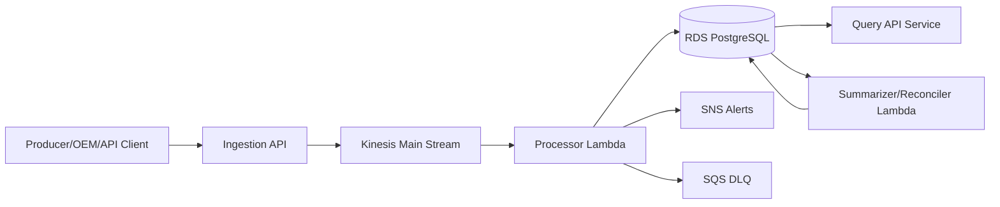

# TRACE — Tracking, Reconciliation, Audit & Compliance Engine TRACE — Tracking, Reconciliation, Audit & Compliance Engine Platform Blueprint, Process, and Costing

Scope: Demoable, extensible TRACE that preserves core business functionality while reducing infrastructure complexity and cost.

## 1) Objective

Bulilding TRACE — Tracking, Reconciliation, Audit & Compliance Engine

- Preserves core functional behavior end-to-end
- Is demo-ready
- Is cost-efficient for small event ingestion
- Can be expanded later with minimal redesign

## 2) Core Functionality to Preserve

The following capabilities are considered essential and are retained:

1. Event ingestion
2. Event validation and normalization
3. Event enrichment
4. Audit persistence in relational store
5. Invalid/errored event handling
6. Summarization and reconciliation
7. Query/report API for demonstration and verification
8. Monitoring and alerting

## 3) TRACE Architecture

## 4) Process Flow

1. Ingestion API receives audit event payload.
2. Event is placed on a single Kinesis stream.
3. Processor Lambda consumes events and runs internal pipeline stages:
   - Parse
   - Validate
   - Normalize/hash/idempotency
   - Enrich
   - Persist
   - Route invalid/error outcomes
4. Successful records are stored in PostgreSQL.
5. Invalid/errored events are routed to DLQ and alerting paths.
6. Scheduled summarizer/reconciler updates reporting aggregates.
7. Query API reads data for dashboards/demo endpoints.
8. CloudWatch alarms + SNS notifications provide operational visibility.

## 6) Database Decision for TRACE

Amazon RDS PostgreSQL

Why this is appropriate:

1. Lower cost
2. Simpler operations for demo
3. Sufficient throughput for small/medium-low event volumes
4. Easy upgrade path to stronger HA profiles later

## 7) AWS Services Used in TRACE

1. Amazon API endpoint (via service/API layer)
2. Amazon Kinesis Data Streams (1 stream)
3. AWS Lambda (processor + scheduler)
4. Amazon RDS PostgreSQL (single instance)
5. Amazon ECS Fargate (query API service)
6. Application Load Balancer (single)
7. Amazon SQS (DLQ)
8. Amazon SNS (alerts)
9. Amazon CloudWatch (logs/metrics/alarms)
10. AWS Secrets Manager
11. AWS KMS
12. Amazon ECR
13. Amazon Route 53
14. AWS Systems Manager Parameter Store
15. Optional VPC interface endpoints (if required by network policy)

## 8) Costing Assumptions

1. Region: us-east-1
2. Single environment
3. Small to medium-low event ingestion
4. On-demand style pricing estimate (no RI/Savings Plan applied)
5. 30-day month approximation for monthly view

## 9) RDS Option Breakout (Initial, Daily, Monthly)

| Option | RDS Shape | HA Mode | Storage | Initial Setup (One-time) | Per Day | Per Month |
|---|---|---|---|---:|---:|---:|
| 1. Cheapest Demo | db.t4g.medium | Single-AZ | 100 GB gp3 | $10 - $30 | $2.0 - $2.8 | $60 - $84 |
| 2. Balanced Demo | db.t4g.large | Single-AZ | 200 GB gp3 | $15 - $40 | $3.8 - $5.2 | $114 - $156 |
| 3. Near-Prod Mini | db.r6g.large | Multi-AZ | 200 GB gp3 | $30 - $80 | $11.5 - $15.5 | $345 - $465 |

## 10) Full TRACE Costing (All Services)

Includes RDS + Kinesis + Lambda + ECS + ALB + SQS + SNS + CloudWatch + ECR + KMS + Secrets + Route53 + transfer baseline.

| Option | Initial Setup (One-time) | Per Day | Per Month |
|---|---:|---:|---:|
| 1. Cheapest Demo | $35 - $110 | $4.5 - $8.0 | $135 - $240 |
| 2. Balanced Demo | $45 - $140 | $6.5 - $10.5 | $195 - $315 |
| 3. Near-Prod Mini | $70 - $220 | $14 - $22 | $420 - $660 |

## 11) AWS Service Cost Breakout (TRACE, 1 Environment)

Approximate range for steady-state low-medium demo usage.

| AWS Service | Initial Setup (One-time) | Per Day | Notes |
|---|---:|---:|---|
| RDS PostgreSQL | $10 - $80 | $2.0 - $15.5 | Depends on chosen option |
| Kinesis (1 shard) | $1 - $3 | $0.35 - $1.20 | Traffic-dependent PUT units |
| Lambda | $0.5 - $2 | $0.15 - $1.20 | Invocation and duration sensitive |
| ECS Fargate (1 task) | $1 - $4 | $0.25 - $1.00 | Depends on cpu/memory profile |
| ALB (1) | $1 - $3 | $0.60 - $1.20 | LCU and request volume dependent |
| SQS DLQ | <$1 | $0.01 - $0.08 | Typically very low |
| SNS alerts | <$1 | $0.01 - $0.10 | Typically very low |
| CloudWatch | $2 - $8 | $0.30 - $1.50 | Log volume and retention sensitive |
| ECR | $0.5 - $2 | $0.02 - $0.12 | Mainly storage |
| Secrets Manager | $1 - $3 | $0.04 - $0.15 | By secret count |
| KMS | $1 - $3 | $0.03 - $0.12 | Key + API requests |
| SSM Parameter Store | $0 - $1 | $0 - $0.05 | Standard tier mostly negligible |
| Route 53 | <$1 | $0.02 - $0.08 | Low DNS query volume |
| VPC Endpoints (optional) | $1 - $3 | $0.70 - $1.30 | Only if needed |
| Data Transfer | $2 - $10 | $0.20 - $2.00 | Depends on egress and cross-AZ traffic |

## 12) Summary

This TRACE design keeps all core business flow intact while reducing infrastructure footprint and cost for demo and early adoption. It is intentionally structured to scale out to full TRACE architecture later without major rework.
