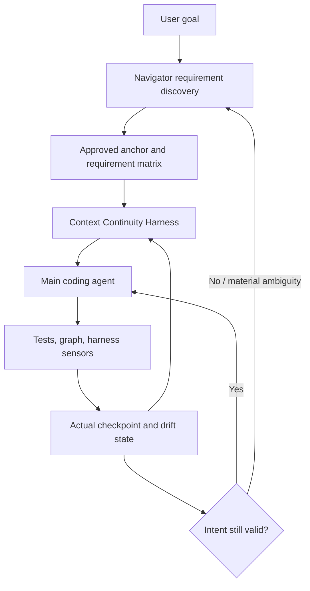
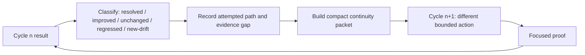
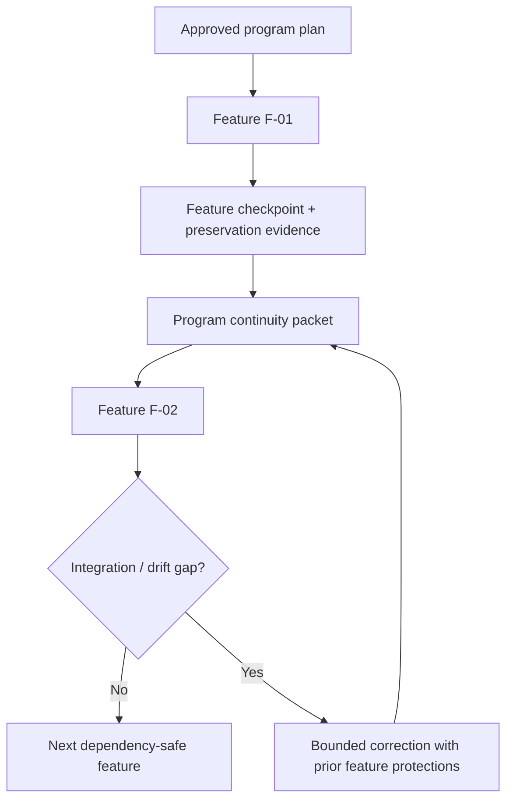
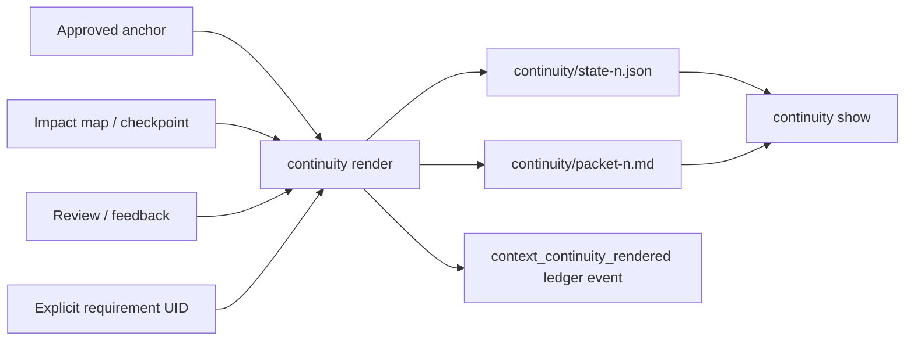
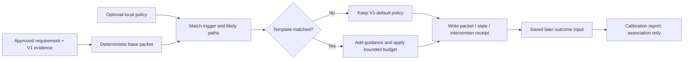
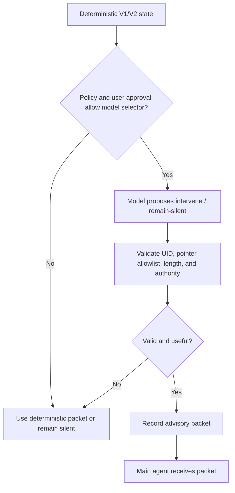
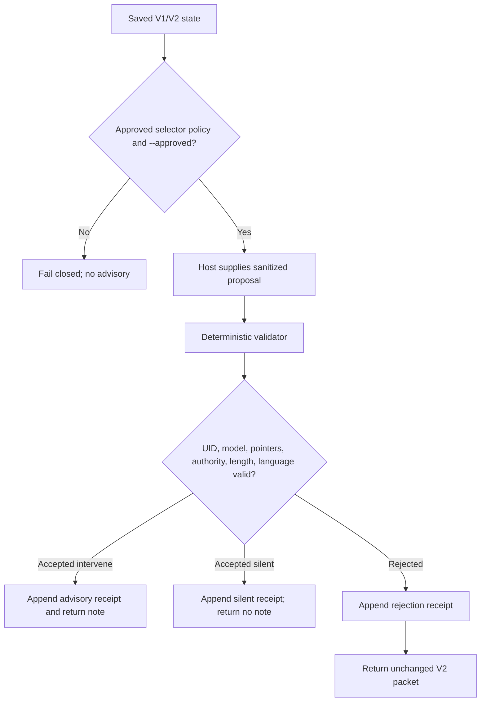

# Context Continuity Harness

## Purpose

Coding agents can receive the original task, repository guidance, a plan, and
many tool results yet still drift. Long trajectories bury requirements, prior
decisions, failed approaches, preservation rules, and unresolved evidence gaps.
The **Context Continuity Harness** keeps the approved task state usable at the
moment it matters.

It is not a second implementation agent, a replacement for Navigator, or a
permanent copy of the entire conversation. It is a selective continuity layer:

```text
approved intent + current cycle + relevant prior evidence
    -> compact next-cycle guidance
    -> main agent acts
    -> computational evidence updates continuity state
```

The design is informed by the selective-reminder pattern described in
[_Remember When It Matters: Proactive Memory Agent for Long-Horizon Agents_](https://arxiv.org/abs/2607.08716).
The useful idea is **selective, memory-grounded intervention**, not an
always-on second model or a larger prompt.

## The problem it solves

An agent commonly loses the task in four ways:

1. **Requirement decay:** it changes the obvious function and forgets an
   approved caller, preservation rule, or acceptance criterion.
2. **Iteration amnesia:** a correction loop repeats the same failed approach
   because the next attempt does not know why the previous one failed.
3. **Program amnesia:** in hands-free work, a later feature undoes a completed
   feature or ignores a dependency and prior integration evidence.
4. **Discovery amnesia:** after a user rejects a requirement proposal, Navigator
   asks the same question or proposes the same architecture again.

More raw context does not reliably solve these problems. It can make the active
constraint harder to find. The harness therefore keeps a small, structured,
provenance-linked state and injects only the slice relevant to the next action.

## Position in TailTrail



Navigator owns **what matters**. The Context Continuity Harness owns **keeping
that truth present through a long trajectory**. The Requirement Completion
Harness owns **proving whether the change fulfilled it**.

## Compact continuity state

The harness has four memory layers. Each layer must be compact, exact where
needed, and linked to a durable artifact rather than duplicating full source or
raw tool output.

| Layer | Contains | Source of truth | Used when |
| --- | --- | --- | --- |
| Active intent | Requirement UID, statement, criteria, preserve rules, allowed scope | Immutable approved anchor | Every implementation/correction cycle |
| Iteration memory | Attempt number, changed symbols, outcome, gap, rejected approach, next proof | Checkpoint, review, feedback, receipts | After a failed or incomplete cycle |
| Evidence pointers | Anchor version, impact map, checkpoint, receipt, test, drift artifact paths | Run ledger | The agent needs detail without loading all history |
| Program memory | Active feature, completed features, dependencies, pending integration proof, correction budget | Program plan and checkpoints | Explicit hands-free/end-to-end delivery |

### Recommended minimum record

```json
{
  "run_id": "claim-validation",
  "requirement_uid": "req-02",
  "statement": "Reject zero claim amounts across validation and submission.",
  "allowed_scope": ["src/claims_api/validation.py", "src/claims_api/service.py", "tests/test_claim_validation.py"],
  "preserve_rules": ["Positive claim amounts remain valid."],
  "cycle": 2,
  "previous_attempt": {
    "changed_symbols": ["validate_claim_amount"],
    "result": "incomplete",
    "gap": "Service-path evidence is missing.",
    "do_not_repeat": ["Do not make a validation-only fix."]
  },
  "next_action": "Trace service.py to validate_claim and add focused service-path proof.",
  "evidence_pointers": [
    ".tailtrail/runs/claim-validation/anchors/approved-v1.json",
    ".tailtrail/runs/claim-validation/impact-maps/map-1.json",
    ".tailtrail/runs/claim-validation/checkpoints/checkpoint-1.json"
  ]
}
```

The record must not contain raw prompts, full source, secrets, credentials,
large logs, or a lossy paraphrase of exact configuration/security evidence.

## The continuity packet

The main agent receives a short packet before an intervention-worthy action.
It must have a stable format so it is easy to inspect and test.

```text
Active requirement: REQ-02 — reject zero claim amounts.

Approved outcome:
- Reject zero across validation and claim submission.
- Preserve positive amounts as valid.

Current scope:
- validation.py, service.py, focused claim tests.

Previous iteration:
- validate_claim_amount was updated.
- Service-path behavior was not proven.
- Do not repeat a validation-only correction.

Use prior context:
- Load the approved anchor, latest impact map, and checkpoint listed below.
- Reuse the current validate_claim service flow.

Next smallest action:
- Trace service.py -> validate_claim(...) and add/fix the focused proof.

Do not:
- Refactor unrelated claim models.
- Weaken a test assertion to turn a failure green.
```

The packet names **what to load**, rather than pasting every prior artifact into
the model context. This keeps the token cost bounded while preserving exactness
through retrieval pointers.

## Selective intervention policy

The harness should not inject a reminder after every tool call. It intervenes
when a deterministic signal says the main agent may be losing task state.

| Trigger | Continuity response |
| --- | --- |
| New implementation cycle | Active intent + allowed scope + first proof plan |
| Correction cycle | Active intent + previous gap + `do_not_repeat` + next focused action |
| Unexpected file/symbol | Scope warning, impact-map pointer, requirement UID, expansion rule |
| Test edited after a failure | Preserve rule + test-integrity reminder + failed evidence pointer |
| Drift regresses/new-drift | Previous checkpoint delta + missing requirement/caller/path evidence |
| Recovery/replan | Active requirement boundary + recovery ownership + preservation proof |
| Hands-free feature transition | Feature dependency summary + completed feature preservation rules |
| User rejects requirement proposal | Rejection feedback + unresolved question list + forbidden assumption |

The harness should remain silent when there is no state change or risk signal.
That prevents “reminder fatigue” and avoids making the packet another ignored
context block.

## Iteration memory: stop repeating failed work

Every implementation cycle writes a small learning record for the *current
task*, not a global unverified learning:

```text
Attempt 1
  hypothesis: validation function alone controls submission
  action: changed validate_claim_amount
  evidence: focused unit test passed
  gap: service caller was not exercised
  status: incomplete
  next rule: require service-path evidence before completion
```

The next cycle is therefore different by construction:



`do_not_repeat` is not a vague instruction such as “be careful.” It must name
the previous failed hypothesis, for example:

- “Do not change only `validate_claim_amount`; the service caller remains
  unproven.”
- “Do not treat an unavailable staging receipt as passing release evidence.”
- “Do not revert the whole file; REQ-01 has valid uncommitted work.”

Only computational evidence or a clear review finding may create such a rule.
The harness must not turn an uncertain model guess into durable truth.

## Hands-free Program Delivery

Hands-free mode needs a larger but still compact **program continuity packet**.
It applies only after the user explicitly selects `hands-free` or `end-to-end`.



Example:

```text
Program: checkout modernization
Completed: F-01 schema migration; F-02 service validation
Active: F-03 API compatibility
Dependencies: F-03 must preserve F-01 backward compatibility
Known history: previous F-03 attempt changed response shape but missed consumer contract proof
Current allowed action: repair consumer compatibility and run declared contract evidence
Do not: modify migration semantics or treat a unit pass as contract proof
```

### Hands-free autonomy contract

The agent may resolve without interruption when the approved intent already
gives one safe answer:

- missed caller, focused test, declared contract, declared environment check;
- a clear implementation defect supported by a checkpoint or receipt;
- a bounded correction within approved scope and correction budget.

It must not silently decide a material ambiguity:

- changing a public API or data contract;
- weakening an approved preservation rule;
- adding a dependency, security exception, or new external system;
- choosing between incompatible business behaviors.

Hands-free means **no unnecessary interruption for solvable evidence gaps**;
it does not grant authority to redefine user intent.

## Requirement Discovery Memory

Continuity starts before implementation. When the user rejects Navigator’s
requirement proposal, retain feedback at requirement granularity.

```json
{
  "proposal_version": 1,
  "requirement_uid": "req-03",
  "decision": "rejected",
  "user_feedback": "Extend the existing claim flow; do not add a new endpoint.",
  "navigator_interpretation": "Reuse the service path; public API expansion is disallowed.",
  "unresolved_question": "Which existing response field communicates the validation error?",
  "next_gathering_rule": "Ask only the unresolved acceptance question."
}
```

On the first material rejection, Navigator asks targeted questions
requirement-by-requirement and may offer AIDLC Requirements mode. On the second
material rejection, it enters minimal AIDLC requirement gathering automatically.
The continuity record prevents repeated proposals and makes the reason for the
new gathering mode inspectable.

## Relationship to existing TailTrail systems

| Existing system | Context Continuity Harness use |
| --- | --- |
| Navigator / `start` auto-selection | Supplies approved requirements, scope, preserve rules, phase/feature structure, and rejection feedback. `start` selects continuity only when the user names an exact run ID with feedback/checkpoint evidence; it never borrows state from an unrelated run. |
| Requirement-to-Impact Matrix | Supplies likely path/symbol/caller/test pointers. |
| Requirement Completion Harness | Supplies checkpoint delta, review finding, feedback packet, and correction budget. |
| Architecture/Behaviour/Maintainability Harnesses | Supply precise drift and preservation signals. |
| Token Harness | Selects exact artifact pointers and limits packet size without compressing material facts. |
| Program Delivery Harness | Supplies active feature, dependencies, completed-feature protections, and resume state. |
| Evaluation Harness | Measures reminder usefulness with saved artifacts before broad claims. |

## Benefits

- Keeps a multi-file agent focused on the *current* requirement rather than the
  most recent error message.
- Makes each correction cycle evidence-aware and different from the last.
- Preserves completed feature behavior during hands-free program delivery.
- Reduces repeated user questions after requirement rejection.
- Limits context growth through pointers and selective retrieval rather than
  repeatedly injecting the full history.
- Produces inspectable artifacts: a reviewer can see why a reminder appeared
  and what evidence it relied on.

## Risks and guardrails

| Risk | Guardrail |
| --- | --- |
| Reminder becomes stale | Anchor/version/checkpoint IDs are mandatory; invalidated anchors cannot produce active packets. |
| Too much intervention | Trigger only on cycle, drift, scope, test-integrity, or feature-transition signals. |
| Wrong lesson becomes permanent | Task-local iteration memory is not promoted to global learning without explicit validation and approval. |
| Agent obeys reminder over user | Explicit current user instruction and approved amendments always win. |
| Hidden model judgement | V1 packets are deterministic from approved artifacts and receipts. Model-based reminder selection is optional later. |
| Context packet grows indefinitely | Fixed budget, structured fields, and retrieval pointers; preserve exact source only at the pointer. |

## Implementation roadmap

### V1 — deterministic continuity packets

**Status: implemented end to end (local deterministic V1).**

V1 is intentionally a narrow continuity substrate. The main challenge was to
preserve prior iteration value without creating a second source of truth or
reloading the full conversation into every cycle. The implementation therefore
derives compact guidance only from existing immutable/append-only TailTrail run
artifacts. A rendered packet is a convenience view; the approved anchor,
checkpoints, reviews, feedback, and receipts remain authoritative.

#### Delivered V1 implementation

| Changed file | Delivered responsibility |
| --- | --- |
| `scripts/context-continuity.py` | Implements `render` and `show`, validates the active approved anchor and requirement UID, chooses deterministic triggers, selects relevant artifact pointers, writes append-only state/packet files, and records a ledger event. |
| `scripts/tailtrail.py` | Exposes `tailtrail harness continuity render/show`. |
| `scripts/mcp-server.py` | Exposes read-only `context_continuity_show` and preview-only `context_continuity_render`; MCP rendering does not write a state artifact. |
| `scripts/run-ledger.py` and `schemas/run-event.schema.json` | Add `context_continuity_rendered` to the durable event vocabulary. |
| `schemas/context-continuity-state.schema.json` | Defines the local continuity-state contract. |
| `tests/test_context_continuity.py` | Covers implementation-start, correction-cycle, packet lookup, and unknown-UID refusal. |
| `tailtrail-registry.json`, `scripts/install-copilot.py`, `TAILTRAIL-COMMANDS.md` | Register, distribute, and document the V1 command surface. |

#### Delivered artifact lifecycle



`render` refuses an absent approved anchor or an unknown requirement UID. It
does not silently fall back to a draft, another run, or a guessed requirement.
When a bounded correction packet already identifies a requirement, V1 may use
that requirement automatically; otherwise the caller must provide
`--requirement-uid`.

#### Implemented trigger behavior

| Trigger | V1 selection rule | Packet result |
| --- | --- | --- |
| `correction-cycle` | Latest feedback packet identifies the active requirement. | Includes the evidence gap, `do_not_repeat`, and focused next validation/action. |
| `unexpected-scope` | Explicit caller trigger or latest requirement drift is `new-drift`. | Includes the scope warning and prohibits unapproved expansion. |
| `implementation-start` | No correction packet or higher-priority local signal exists. | Includes approved criteria, scope, preservation rules, and initial focused action. |
| Other documented triggers | Accepted explicitly as stable trigger values for host orchestration. | Rendered from the approved requirement and available local pointers; V1 does not infer unsupported semantic state. |

This is deliberately conservative. V1 does not guess a recovery condition,
parse raw agent text, inspect a model’s hidden reasoning, or claim that an
incomplete artifact proves a behavior.

#### V1 failure and recovery posture

- Missing/invalid anchor, requirement UID, or run artifacts return an error and
  create no continuity state.
- Packet history is append-only: a failed rendering attempt cannot overwrite a
  prior valid packet.
- The command writes only under `.tailtrail/runs/<run-id>/continuity/` plus the
  append-only run ledger event.
- Packet text contains artifact pointers, not full source, logs, secrets, or
  credentials.
- A packet has no execution authority. It cannot edit source, run tests, amend
  requirements, invoke a model, or cause an MCP patch application.

#### V1 verification

The focused test suite proves that a start packet contains approved preservation
rules and anchor pointers, a correction packet carries the prior evidence gap
and a non-repetition warning, `show` reads a saved packet/state pair, and an
unknown requirement is rejected. Registry validation confirms the command is
claimed by exactly one implemented feature; installer tests confirm its pack
integration.

**Goal:** make every implementation or correction cycle start from the current
approved intent and the last relevant computational evidence, without a model
call, a database, a background worker, or a source edit.

#### V1 files and artifacts

| File or location | Responsibility |
| --- | --- |
| `scripts/context-continuity.py` | Read existing run artifacts, classify a deterministic trigger, render a packet, and write append-only state. |
| `.tailtrail/runs/<run-id>/continuity/state-<n>.json` | Exact trigger, selected requirement/feature, source artifact pointers, packet fingerprint, and recommendation. |
| `.tailtrail/runs/<run-id>/continuity/packet-<n>.md` | Human- and agent-readable compact packet. It is derived output, never the authority. |
| `schemas/context-continuity-state.schema.json` | Contract for state, source pointers, trigger, selected fields, and packet budget. |
| `tests/test_context_continuity.py` | Deterministic fixture tests for every trigger and precedence rule. |

`approved-v<n>.json`, program plans, checkpoints, reviews, feedback packets,
impact maps, receipts, and drift records remain the sources of truth. V1 must
not copy their full contents into a new store.

#### V1 state contract

```json
{
  "schema_version": "1",
  "type": "tailtrail-context-continuity-state",
  "run_id": "claim-validation",
  "sequence": 4,
  "trigger": "correction-cycle",
  "requirement_uid": "req-02",
  "feature_id": null,
  "anchor_fingerprint": "sha256:...",
  "checkpoint": 1,
  "previous_delta": "unchanged",
  "selected_artifacts": [
    {"kind": "approved-anchor", "path": "anchors/approved-v1.json"},
    {"kind": "impact-map", "path": "impact-maps/map-1.json"},
    {"kind": "completion-review", "path": "reviews/review-1.json"}
  ],
  "do_not_repeat": ["Do not make a validation-only correction."],
  "next_action": "Trace the service caller and add focused proof.",
  "packet_fingerprint": "sha256:...",
  "evidence_label": "local-evidence"
}
```

Rules:

- `requirement_uid` must exist in the active approved anchor.
- The packet must fail closed if the anchor was invalidated or the selected
  checkpoint belongs to a different anchor fingerprint.
- `do_not_repeat` can come only from a review/feedback finding, a checkpoint
  delta, or a deterministic classifier. It cannot be an uncited model opinion.
- State is append-only. A later cycle creates `state-<n+1>.json`; it never
  overwrites the history needed to explain a reminder.

#### V1 trigger algorithm

```text
1. Load active approved anchor and latest program state when hands-free is active.
2. Read the latest checkpoint, completion review, feedback, impact map, and
   feature checkpoint only when their run/anchor identifiers match.
3. Select one highest-priority trigger:
   invalidated-anchor > material-replan > recovery > new/regressed drift >
   correction-cycle > unexpected-scope > test-integrity > feature-transition >
   implementation-start.
4. Select the active requirement UID. Prefer the bounded feedback packet;
   otherwise use the active program feature; otherwise require an explicit UID.
5. Render only the fields allowed by that trigger and the configured packet
   budget. Preserve exact artifact paths and identifiers.
6. Write state and packet artifacts, append a ledger event, and return the
   packet. Do not execute code, tests, Git, MCP writes, or model calls.
```

The priority order matters. A recovery packet must not be hidden by a generic
“next feature” reminder; an invalidated anchor must never produce a normal
implementation packet.

#### V1 packet rendering rules

| Trigger | Required packet fields | Intentionally omitted |
| --- | --- | --- |
| Implementation start | Requirement, scope, preserve rules, acceptance proof | Previous-failure section when none exists |
| Correction cycle | Requirement, prior hypothesis/action, evidence gap, `do_not_repeat`, next focused proof | Full test output and unrelated requirements |
| Unexpected scope | Requirement, unexpected path/symbol, expansion rule, impact-map pointer | Permission to expand material scope |
| Test integrity | Requirement, preserve rule, changed-test warning, original evidence pointer | A suggestion to weaken/assertion-change the test |
| Recovery | Ownership boundary, preservation requirement, recovery plan pointer | Generic retry advice |
| Feature transition | Completed feature protections, active feature, dependencies, integration gap | Full completed-feature source/diff |
| Proposal rejection | Requirement row, user comment, unresolved question, gathering mode | A rewritten requirement presented as approved |

The default packet should target roughly 120–250 words. If the exact evidence
needed to act cannot fit, the packet must provide a pointer and say “load this
artifact before editing,” not summarize the exact content inaccurately.

#### V1 command and MCP surface

```powershell
py -3 scripts/tailtrail.py harness continuity render --root . --run-id claim-validation --requirement-uid req-02
py -3 scripts/tailtrail.py harness continuity show --root . --run-id claim-validation --sequence 4
```

The first MCP surface should be read-only:

```text
context_continuity_show(run_id, requirement_uid?, sequence?)
context_continuity_render(run_id, requirement_uid?, trigger?)
```

`render` writes only under the local run artifact directory. It never applies a
patch or invokes an implementation agent. A host can place the rendered packet
into the main agent’s next prompt, but that host-level injection is explicit and
auditable.

#### V1 acceptance tests

1. A failed service-path proof produces a correction packet that contains the
   missing caller evidence and excludes unrelated requirements.
2. An unexpected `src/models.py` change produces a scope warning, not approval
   to edit the file.
3. A modified test following a failure produces the preserve-rule/test-integrity
   packet.
4. A completed F-01 and active F-02 hands-free run includes F-01 preservation
   constraints and F-02 dependency evidence.
5. A rejected REQ-03 proposal carries the exact user feedback into the next
   Navigator gathering packet.
6. Invalidated/mismatched anchors, missing artifacts, or unknown UIDs return a
   no-packet error rather than stale guidance.

### V2 — context selection and calibration

**Status: implemented end to end (local deterministic V2).**

**Goal:** make V1 packets smaller and more task-aware using inspectable local
policy, while preserving the approved anchor as the only authority and keeping
calibration explicitly non-causal.

#### Challenge V2 solves

V1 has one safe packet shape. That is an excellent baseline, but a repeated
service-path correction and an implementation start do not need precisely the
same extra reminder. The challenge is to make that difference useful without
allowing a project template to silently suppress an acceptance criterion,
preservation rule, or recovery constraint. The second challenge is learning
whether a reminder appears useful without inventing a claim that the reminder
*caused* the next result.

V2 solves both with CPU-only, JSON-backed artifacts:

- a policy selects at most one matching template by trigger and approved likely
  paths;
- a template is additive: it may contribute short guidance and a smaller budget,
  but it cannot delete base fields or mutate the approved anchor;
- every saved render produces an intervention receipt with the exact selection
  and packet size; and
- a separate `calibrate` command aggregates supplied saved outcomes and labels
  them as local association, never causal proof.

#### Delivered V2 files and scope

| Changed file or location | Delivered responsibility | Boundary |
| --- | --- | --- |
| `scripts/context-continuity.py` | Loads/validates local policy JSON; selects one additive template; records selected/omitted fields, policy version, template ID, budget, and intervention receipt; implements `calibrate`. | Does not call a model, run tests, edit source, or amend an anchor. |
| `schemas/context-continuity-policy.schema.json` | Defines the policy/template contract. | Templates are local configuration, not an approval authority. |
| `schemas/context-continuity-calibration.schema.json` | Defines saved-artifact calibration output. | Reports association only. |
| `schemas/context-continuity-state.schema.json` | Extends V1 state with V2 policy, selection, budget, and receipt fields. | V1 packet authority remains unchanged. |
| `templates/context-continuity-policy.example.json` | Provides a reviewable service-change example. | It adds caller-path guidance only. |
| `scripts/mcp-server.py` | Lets the read-only packet preview accept a repository-relative policy. | Preview still writes no artifacts and cannot execute work. |
| `scripts/run-ledger.py`, `schemas/run-event.schema.json` | Adds the calibration event to the append-only event vocabulary. | No event records source or raw prompts. |
| `tests/test_context_continuity.py` | Proves template addition/preservation and calibration arithmetic. | Focused local fixture coverage. |
| `tailtrail-registry.json`, `TAILTRAIL-COMMANDS.md`, `ROADMAP.md` | Registers and documents the V1-V2 surface. | V3 remains explicitly optional/planned. |

#### V2 selection and receipt lifecycle



The selection order is deterministic: templates are evaluated in JSON order;
the first one whose `triggers` (when present) and `path_prefixes` (when present)
both match is selected. An absent policy or no match gives `v1-default` and no
template ID. This makes a run reproducible from the saved policy and state.

Base fields are always selected: active requirement, acceptance criteria,
approved likely paths, preserve rules, artifact pointers, and next action.
The current evidence gap and `do_not_repeat` rule are added when available.
V2 records `deep_history` as omitted because history stays behind an exact
artifact pointer. A template can append `additional_guidance`; it cannot replace
or remove any of these base fields.

#### Policy contract and example

```json
{
  "schema_version": "1",
  "type": "tailtrail-context-continuity-policy",
  "version": "service-change-v1",
  "max_words": 200,
  "templates": [
    {
      "id": "service-change",
      "triggers": ["implementation-start", "correction-cycle"],
      "path_prefixes": ["src/"],
      "max_words": 180,
      "additional_guidance": [
        "Trace the approved caller path before declaring the service behavior complete."
      ]
    }
  ]
}
```

The effective packet budget is the smallest of the command `--max-words`, the
policy `max_words`, and the selected template `max_words`. Every allowed budget
is at least 80 words. Budget trimming compacts prose; it never changes the
approved source artifacts or makes a model judgement.

#### V2 receipt and calibration contract

Each render writes an append-only receipt below the same run:

```json
{
  "schema_version": "1",
  "type": "tailtrail-context-continuity-intervention",
  "run_id": "claim-validation",
  "packet_sequence": 4,
  "trigger": "correction-cycle",
  "requirement_uid": "req-02",
  "policy_version": "service-change-v1",
  "selected_template_id": "service-change",
  "words": 184,
  "selected_fields": ["requirement", "preserve_rules", "previous_gap"],
  "omitted_fields": ["deep_history"],
  "next_checkpoint_delta": null,
  "assessment": "unknown",
  "evidence_label": "local-evidence"
}
```

When a saved evaluation associates a later checkpoint with a packet, it may
supply `resolved`, `improved`, `unchanged`, `regressed`, `new-drift`, or
`needs-decision`, plus `useful`, `not-useful`, or `unknown`. `calibrate` records
intervention count, average packet words, outcome and assessment totals,
resolved-or-improved count, false-intervention count, and explicitly supplied
missed-intervention count. It does not mutate the original receipt or infer
causality.

#### Commands

```powershell
py -3 scripts/tailtrail.py harness continuity render --root . --run-id claim-validation --requirement-uid req-02 --policy templates/context-continuity-policy.example.json
py -3 scripts/tailtrail.py harness continuity show --root . --run-id claim-validation --sequence 1
py -3 scripts/tailtrail.py harness continuity calibrate --root . --run-id claim-validation --input saved-interventions.json
```

`saved-interventions.json` is deliberately a local supplied artifact rather
than a live model trace. This permits deterministic fixture testing and protects
the default data boundary.

#### V2 safeguards and intentionally deferred work

- Invalid policy shape, a budget below 80 words, an unknown requirement, or a
  missing approved anchor fails closed and writes no new packet.
- MCP supports only read-only preview with an optional repository-relative
  policy; it writes no receipt, source, test result, or anchor.
- The policy is not a generic rules engine. V2 supports trigger/path matching
  and additive string guidance only—no source inspection, script execution,
  network access, or model call.
- Calibration is saved-artifact arithmetic. Controlled baseline comparisons,
  broader scenario fixtures, and template promotion rules belong to Evaluation
  Harness work, not to V2 runtime selection.

#### V2 verification

Focused tests verify that a matched template records `service-v2`, applies its
180-word bound, retains the approved positive-claim preservation rule, adds the
template guidance, and writes an intervention receipt. Calibration fixtures
verify the deterministic counts for useful/not-useful interventions and
resolved/regressed outcomes. Registry validation and MCP tests cover the
registered command and read-only preview surface.

### V3 — optional model-based reminder policy

**Status: implemented end to end as an opt-in host-supplied advisory boundary.**

**Goal:** allow an explicitly approved host model to propose whether a reminder
is useful after V1/V2, while TailTrail deterministically validates that proposal
against saved local state and falls back safely when it is invalid.

V3 is opt-in, policy-gated, and advisory. The host may select or phrase a
packet; TailTrail cannot approve intent, add scope, execute tools, write source,
amend an anchor, change a test, or claim completion. TailTrail does not invoke
a model, create network requests, manage credentials, or own host retention.

#### V3 input and output boundary

```text
Allowed input:
- structured V1/V2 state
- approved requirement row and preserve rules
- latest checkpoint/review summaries and exact artifact pointers
- explicit packet budget and policy version

Forbidden input by default:
- raw repository source, secrets, credentials, full terminal logs,
  unrelated conversation history, or unredacted user data

Required output:
- intervene: true/false
- trigger/risk rationale
- requirement UID
- selected artifact pointers
- compact reminder text
- uncertainty label
```

```json
{
  "intervene": true,
  "requirement_uid": "req-02",
  "reason": "Previous correction addressed only validation while the approved service path remains unproven.",
  "artifact_pointers": ["checkpoints/checkpoint-1.json", "reviews/review-1.json"],
  "reminder": "Do not repeat a validation-only correction; trace the service caller.",
  "uncertainty": "inferred",
  "authority": "advisory-only"
}
```

#### V3 runtime flow



The deterministic validator rejects an output that references an unknown UID,
a pointer outside the current local allowlist, or a source-writing instruction.
It falls back to V1/V2 rather than trusting the model.

#### V3 evaluation gate

Before enabling a model selector for a project:

1. run it against saved, sanitized V1/V2 scenarios;
2. compare against deterministic-only packets and a no-reminder baseline;
3. measure false intervention, missed intervention, repeated-error rate,
   requirement completion, and packet length;
4. require an explicit project policy approval naming the model, data boundary,
   retention boundary, and rollback switch;
5. keep the selector disabled by default and reversible per project.

V3 therefore adds intelligence only where it can be evaluated. It never turns a
reminder policy into an autonomous implementation or product-decision agent.

#### Delivered V3 implementation, file scope, and challenge

The hard V3 problem is not producing a reminder. It is preventing a reminder
from becoming an unreviewed new plan, a source-edit instruction, or a hidden
model integration with unknown credentials and data retention. The delivered
implementation divides responsibility cleanly: a host may invoke any approved
model, but TailTrail accepts only a sanitized local proposal and validates it
against the current V1/V2 state.

| Changed file or location | Delivered responsibility | Deliberate boundary |
| --- | --- | --- |
| `scripts/context-continuity.py` | Adds selector-policy validation, `advise`, `advisory-show`, deterministic proposal validation, append-only advisory artifacts, and V2 fallback. | No model call, network request, test command, source write, or anchor mutation. |
| `schemas/context-continuity-selector-policy.schema.json` | Requires explicit enablement/approval, model label, bounded reminder length, and reviewable data/retention/rollback metadata. | The policy grants no implementation authority. |
| `schemas/context-continuity-advisory.schema.json` | Defines accepted, silent, and fallback advisory records. | Stores validation result and pointers, not raw source or model prompt. |
| `templates/context-continuity-selector-policy.example.json` and `templates/context-continuity-advisory-proposal.example.json` | Provide reviewable host-policy and sanitized-proposal contracts. | Proposal pointers must be selected by the actual V1/V2 state. |
| `scripts/mcp-server.py` | Adds `context_continuity_advisory_show`. | Inspection only; MCP cannot submit a proposal or create an advisory. |
| `scripts/run-ledger.py` and `schemas/run-event.schema.json` | Add advisory-recorded and advisory-rejected events. | No raw model output is added to the ledger. |
| `tests/test_context_continuity.py` | Proves accepted advisory and invalid-proposal fallback behavior. | Uses local fixtures; no live model is required. |
| `tailtrail-registry.json`, `TAILTRAIL-COMMANDS.md`, and `ROADMAP.md` | Register and document V3. | There is no quality/time/token-gain claim. |

#### Implemented V3 runtime flow



The validator requires the proposal's `requirement_uid` and model label to
match the selected state and approved policy. Artifact pointers must be an exact
subset of the V1/V2 selected pointers. A proposal must declare
`authority: advisory-only`; an intervening proposal also needs a non-empty
reason/reminder, a valid `inferred` or `uncertain` label, and a reminder within
the policy's 20–120-word bound. It rejects unknown fields and source-writing or
execution terms such as `edit`, `patch`, `run`, `commit`, or `deploy`.

When validation fails, TailTrail saves only the deterministic rejection reason
and current V2 state/packet paths. It does not persist the rejected free text.
The returned packet is the existing V2 packet, not a newly invented fallback.

#### Implemented policy, command, and artifact contracts

```json
{
  "schema_version": "1",
  "type": "tailtrail-context-continuity-selector-policy",
  "version": "selector-v1",
  "enabled": true,
  "approved": true,
  "model": "host-supplied-model-output",
  "max_reminder_words": 70,
  "data_boundary": "Structured V1/V2 state and approved pointers only.",
  "retention_boundary": "The host owns model retention.",
  "rollback_switch": "Remove this policy or set enabled false."
}
```

```powershell
py -3 scripts/tailtrail.py harness continuity advise --root . --run-id claim-validation --input sanitized-model-proposal.json --policy templates/context-continuity-selector-policy.example.json --approved
py -3 scripts/tailtrail.py harness continuity advisory-show --root . --run-id claim-validation --sequence 1
```

Each attempt creates `.tailtrail/runs/<run-id>/continuity/advisories/advisory-<n>.json`:

- `accepted` includes an advisory fingerprint and allowlisted pointers;
- `silent` records a valid choice not to intervene; and
- `fallback` records the rejection reason plus the V2 state/packet paths.

`context_continuity_advisory_show(run_id, sequence?)` is the only V3 MCP tool;
it is read-only. A host can inject an accepted advisory into its next agent turn,
but no V3 surface can edit source or start an implementation action.

#### V3 evaluation and deferred integration boundary

The implementation is ready for saved, sanitized scenario comparison against
deterministic-only and no-reminder baselines. Measure false and missed
intervention, repeated-error rate, requirement completion, and packet length.
Those are associations unless Evaluation Harness provides a controlled
comparison. A bundled model provider, automatic prompt transport, live model
evaluation by default, and always-on model diagnostician remain intentionally
out of scope because they would widen the credential, data, and operational
boundary.

Focused tests prove a valid proposal is auditable and a proposal with
source-writing language is rejected and replaced by the V2 packet. Registry and
MCP validation cover the new command, schemas, templates, and read-only tool.

## Success measures

Do not claim quality or token gains without measured artifacts. Useful future
measures are:

- repeated failed-hypothesis rate before versus after packet use;
- number of correction cycles per requirement;
- missed-caller and preservation-rule detection rate;
- user-rejection repetition rate during requirement gathering;
- packet size and exactness-preserving retrieval cost;
- hands-free program regressions of completed features;
- false-intervention and missed-intervention rates.

## Non-goals

- A hidden always-on model watching every agent token.
- A substitute for user approval on material product decisions.
- A general vector database or raw conversation archive.
- A claim that reminders alone prove requirement completion.
- Automatic global learning from a single task failure.
