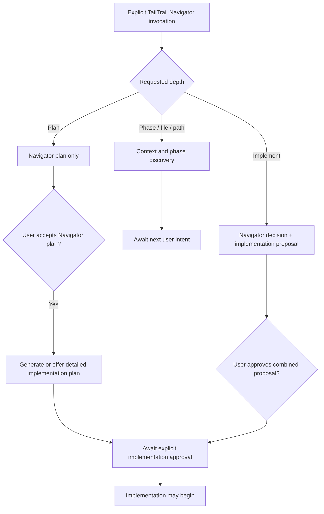

# TailTrail Navigator

TailTrail Navigator is the single orchestration layer for choosing TailTrail features.

It prevents every feature from auto-triggering independently. Navigator should inspect the user goal, changed files, risk signals, and existing TailTrail state, then recommend the smallest useful workflow.

## Inputs

- user goal or task description
- optional changed files
- optional repo root
- existing `aidlc-docs/`
- existing `.tailtrail/learnings.md`
- existing `.tailtrail/learning-index.md`
- existing `.tailtrail/graph-learning-index.json`
- existing `.tailtrail/learning-refresh-actions.json`
- installed pack manifest
- local policy file when present

## Explicit Navigator Invocation And Request Depth

An explicit user reference to **TailTrail Navigator** is a control instruction,
not ordinary task text. It must take priority over keyword classification. For
example, `using TailTrail Navigator`, `tailtrail navigator`, and `navigator:`
mean that TailTrail must return a Navigator decision with selected and skipped
features. It must not silently replace that response with a generic
implementation plan because the prompt contains words such as `plan`, `phase`,
or `implementation`.

Navigator uses the request wording to choose the response depth. The user does
not need flags, internal feature names, or a long prompt.

| User intent | Example short prompt | Navigator response | Authority granted |
| --- | --- | --- | --- |
| Context / discovery | `navigator Phase 1` | Resolve the named phase/file/path, verify supplied paths, show selected/skipped TailTrail features, relevant context, dependencies, and next action. | Read-only discovery only. |
| Navigator plan | `navigator plan Phase 1` | Return the TailTrail workflow decision, scope, selected/skipped features, approval approach, suggested commands, and validation posture. | Plan review only; no detailed code plan or edits. |
| Implementation proposal | `navigator implement Phase 1` | Return both the Navigator decision and a detailed project implementation proposal in distinct sections. | Proposal review only; no edits. |

`Phase`, a filename, or a path is primarily a **context selector**. Navigator
should read and verify that exact material before inferring broad repository
context. If `Phase 1` is ambiguous across known TailTrail documents, Navigator
must name the possible matches and ask the smallest clarification question; it
must not invent which phase the user meant.



### Output contract by depth

Every explicit Navigator response must contain a **TailTrail Navigator
Decision** section with:

- selected TailTrail features and a reason for each;
- skipped TailTrail features and a reason for each;
- relevant files/context to load and context intentionally avoided;
- risk, policy, approval, and validation posture; and
- an explicit statement that no source files were changed.

The remaining output depends on depth:

| Depth | Include | Do not include by default |
| --- | --- | --- |
| Context / discovery | Phase/file verification, phase purpose, dependencies, likely existing files, and recommended next prompt. | Detailed implementation steps, edit plan, test execution, scans, or approval to code. |
| Navigator plan | Recommended workflow, task phases, likely scope, commands, validation approach, and Navigator-plan approval request. | Detailed file-by-file implementation design unless the user asks for `implement`. |
| Implementation proposal | Navigator decision **and** a separately labeled project implementation plan: requirements, reuse candidates, expected files, ordered steps, tests, risks, and non-goals. | Source edits, command execution, scans, or implementation itself. |

### Approval states

Approval must be precise. Accepting one artifact must not accidentally grant
authority for the next action.

| User approval | Meaning | Does not authorize |
| --- | --- | --- |
| `approve Navigator plan` | Navigator selected the right TailTrail workflow and scope. | Editing source or running implementation commands. |
| `generate implementation plan` | Generate the detailed project plan from the accepted Navigator plan. | Editing source. |
| `approve implementation` | Begin the approved implementation within the stated scope and policy. | Material scope/contract/dependency/security expansion. |

Example user prompts:

```text
using TailTrail Navigator, Phase 1
using TailTrail Navigator, plan Phase 1
using TailTrail Navigator, implement Phase 1
tailtrail navigator: plan src/claims_api/validation.py
navigator implement buildweek-demo-project/README.md
```

Example end-of-response prompts:

```text
Navigator context is ready. Say `navigator plan Phase 1` to create the
TailTrail workflow decision.

Navigator plan is ready. Say `approve Navigator plan` to generate the detailed
implementation plan. No code will be changed by that approval.

Implementation proposal is ready. Say `approve implementation` only when
TailTrail may begin editing the approved scope.
```

## Decision Rules

- Tiny typo, comment, or docs-only work: use lean TailTrail, skip AIDLC, review graph, handoff, and learning capture.
- Bug fix, refactor, implementation, review, validation, auth, CI/Sonar, dependency, or shared-helper work: recommend Code Review Graph Lite when changed files are known or can be supplied.
- Meaningful code-change work: check Code Graph Mapper cache status before broad source reads. If missing, recommend graph map. If stale or invalid, recommend refresh or recreate. If fresh, recommend using cached read order before exact source inspection. Skip this for tiny typo or docs-only work.
- Broad, risky, regulated, production, migration, release, or multi-file work: recommend AIDLC standard unless the user skips it.
- Dependency/package/library/upgrade work: recommend Dependency Gate.
- CI, Sonar, pipeline, quality gate, test, or validation work: recommend QA / CI-Sonar lens and exact validation evidence.
- PR, release, approval, transfer, or handoff work: recommend Handoff.
- Existing project learnings: suggest at most relevant curated notes, never raw history by default.
- Matching graph-aware learnings: show them in the plan with `use learnings`, `ignore learnings`, and `edit plan` choices.
- Missing or unusable learning context: explain the skip reason as `no index`, `tiny task`, `stale graph`, or `no matching tags/files/rules`.
- Stale, weak, contradictory, or user-reported bad learning signals: suggest Learning Refresh, but do not run it.
- Meaningful completed work: trigger a post-task learning capture section in the plan with a suggested `hooks/learning-capture-hook.py` command, but do not run it automatically or write learning files without user approval.

## Approval Rule

Navigator returns a plan first. It does not edit files.

The Navigator Decision must tell the user:

- selected features
- skipped features
- likely impacted files
- load and avoid lists
- suggested commands
- validation expectations
- learning approval choices when learnings are surfaced
- learning skip reasons when learning context is skipped
- post-task learning capture trigger when useful
- approval instructions

A detailed implementation plan is required only for the explicit
`navigator implement ...` depth or after the user accepts a Navigator plan and
asks to generate it. It must be presented separately from the Navigator
Decision so the user can see which TailTrail workflow was selected and why.

The user can edit the plan before implementation.

## Overrides

Respect explicit user intent:

- `use AIDLC only`
- `skip review graph`
- `skip AIDLC`
- `without AIDLC`
- `review only`
- `skip handoff`

## Boundaries

- no background service
- no hidden implementation
- no autonomous edits
- no model calls
- no raw prompt logging
- no automatic learning capture
- no automatic learning refresh actions
- learnings are advisory only and never override current source, CI, scanner, policy, guardrails, or explicit user instructions
- no feature auto-triggering outside Navigator
