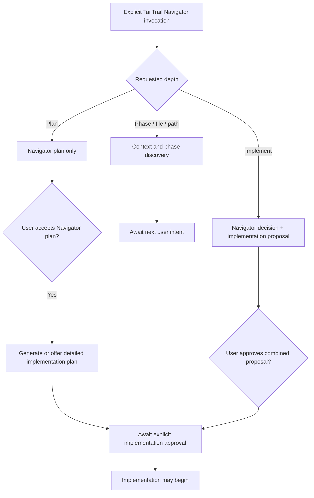

# TailTrail Navigator

TailTrail Navigator is the single orchestration layer for choosing TailTrail features.

It prevents every feature from auto-triggering independently. Navigator should inspect the user goal, changed files, risk signals, and existing TailTrail state, then recommend the smallest useful workflow.

## Inputs

- user goal or task description
- optional changed files
- optional repo root
- existing `aidlc-docs/`
- existing `.tailtrail/learnings.md`
- existing `.tailtrail/learning-index.md`
- existing `.tailtrail/graph-learning-index.json`
- existing `.tailtrail/learning-refresh-actions.json`
- installed pack manifest
- local policy file when present

## Explicit Navigator Invocation And Request Depth

An explicit user reference to **TailTrail Navigator** is a control instruction,
not ordinary task text. It must take priority over keyword classification. For
example, `using TailTrail Navigator`, `tailtrail navigator`, and `navigator:`
mean that TailTrail must return a Navigator decision with selected and skipped
features. It must not silently replace that response with a generic
implementation plan because the prompt contains words such as `plan`, `phase`,
or `implementation`.

Navigator uses the request wording to choose the response depth. The user does
not need flags, internal feature names, or a long prompt.

| User intent | Example short prompt | Navigator response | Authority granted |
| --- | --- | --- | --- |
| Context / discovery | `navigator Phase 1` | Resolve the named phase/file/path, verify supplied paths, show selected/skipped TailTrail features, relevant context, dependencies, and next action. | Read-only discovery only. |
| Navigator plan | `navigator plan Phase 1` | Return the TailTrail workflow decision, scope, selected/skipped features, approval approach, suggested commands, and validation posture. | Plan review only; no detailed code plan or edits. |
| Implementation proposal | `navigator implement Phase 1` | Return both the Navigator decision and a detailed project implementation proposal in distinct sections. | Proposal review only; no edits. |

`Phase`, a filename, or a path is primarily a **context selector**. Navigator
should read and verify that exact material before inferring broad repository
context. If `Phase 1` is ambiguous across known TailTrail documents, Navigator
must name the possible matches and ask the smallest clarification question; it
must not invent which phase the user meant.



### Output contract by depth

Every explicit Navigator response must contain a **TailTrail Navigator
Decision** section with:

- selected TailTrail features and a reason for each;
- skipped TailTrail features and a reason for each;
- relevant files/context to load and context intentionally avoided;
- risk, policy, approval, and validation posture; and
- an explicit statement that no source files were changed.

The remaining output depends on depth:

| Depth | Include | Do not include by default |
| --- | --- | --- |
| Context / discovery | Phase/file verification, phase purpose, dependencies, likely existing files, and recommended next prompt. | Detailed implementation steps, edit plan, test execution, scans, or approval to code. |
| Navigator plan | Recommended workflow, task phases, likely scope, commands, validation approach, and Navigator-plan approval request. | Detailed file-by-file implementation design unless the user asks for `implement`. |
| Implementation proposal | Navigator decision **and** a separately labeled project implementation plan: requirements, reuse candidates, expected files, ordered steps, tests, risks, and non-goals. | Source edits, command execution, scans, or implementation itself. |

### Approval states

Approval must be precise. Accepting one artifact must not accidentally grant
authority for the next action.

| User approval | Meaning | Does not authorize |
| --- | --- | --- |
| `approve Navigator plan` | Navigator selected the right TailTrail workflow and scope. | Editing source or running implementation commands. |
| `generate implementation plan` | Generate the detailed project plan from the accepted Navigator plan. | Editing source. |
| `approve implementation` | Begin the approved implementation within the stated scope and policy. | Material scope/contract/dependency/security expansion. |

Example user prompts:

```text
using TailTrail Navigator, Phase 1
using TailTrail Navigator, plan Phase 1
using TailTrail Navigator, implement Phase 1
tailtrail navigator: plan src/claims_api/validation.py
navigator implement buildweek-demo-project/README.md
```

Example end-of-response prompts:

```text
Navigator context is ready. Say `navigator plan Phase 1` to create the
TailTrail workflow decision.

Navigator plan is ready. Say `approve Navigator plan` to generate the detailed
implementation plan. No code will be changed by that approval.

Implementation proposal is ready. Say `approve implementation` only when
TailTrail may begin editing the approved scope.
```

## Decision Rules

### Requirement query framing

Navigator separates the exact user goal from the normalized text used for
repository discovery. The Start report and Planning Lock retain the exact goal,
including its original line endings and wording. Requirement framing follows
these deterministic rules:

- LF, CRLF, and CR line endings are equivalent for requirement discovery;
- a newline inside prose is treated as a soft wrap and joined with one space;
- blank paragraphs, Markdown bullets, numbered items, sentences, and
  semicolons remain explicit requirement boundaries;
- a user-visible literal has one canonical value whether the host presents it
  as plain text, emphasis (`*text*` or `_text_`), strong emphasis
  (`**text**` or `__text__`), quoted text, or inline code;
- canonical `quoted_literals` feed lexical seeding, graph lifecycle discovery,
  exact-emitter detection, and bounded renderer tracing; those stages do not
  independently reinterpret host presentation markup;
- each normalized requirement receives a content-derived
  `req-frame-<12 hex>` ID and its own bounded `query_terms` list;
- human-facing `REQ-01` labels remain positional compatibility labels; the
  approved anchor additionally assigns its existing run-bound durable UID;
- Quick, compact, normal, verbose, saved Planning Lock, and approved-anchor
  projections consume the same normalized rows rather than parsing the goal
  again.

The query frame can guide read-only scope discovery. It cannot grant approval,
replace the exact goal, or turn a lexical match into implementation ownership.

### Typed scope evidence and repository roles

Navigator discovery produces evidence seeds, not selected files. Before a path
can appear on a Start surface, the v2 scope domain normalizes it relative to the
repository, applies bounded read and sensitive-path rules, and assigns:

- a repository role such as `implementation-owner`, `test`, `configuration`,
  `manifest`, `documentation`, `generated`, or `managed-tooling`;
- a status such as `included`, `inspection-only`, `proof-only`, `excluded`, or
  `rejected`;
- reason codes, seed sources, confidence, and evidence provenance; and
- a deterministic candidate ID and scope-decision fingerprint.

Lexical matches are weak evidence. A lexical source match remains
`inspection-only`, and a lexical test match remains `proof-only`; neither is
implementation ownership. Explicit paths can establish an included candidate,
but installed TailTrail payloads, generated/vendor paths, credentials, binary
or oversized files, symlinks, traversal, and out-of-root paths fail closed.
TailTrail's own `scripts/*.py` files are production source in a TailTrail source
checkout, while `tailtrail/scripts/*.py` under an application installation is
managed tooling rather than application scope.

### Bounded implementation-owner investigation

For code-change work, typed seeds now enter a bounded static investigation
before scope is proposed. It extracts definitions, imports, dynamic loader
paths, registrations, packages, and namespaces for Python, JavaScript,
TypeScript, Java, C#, and Go without importing or executing project code.
Tests are traced back to production owners first; only then are direct callers
and focused proof expanded. Unrelated lexical tests are excluded with
`lexical-only-no-owner-edge`.

For JavaScript/TypeScript UI visibility work, an import edge alone is not
renderer ownership. Navigator joins the resolved module reference to sanitized
in-file call, returned-value, catch, state-write, and render-use facts. It
accepts only bounded call-to-render, call-to-catch-to-state-to-render, or
call-to-catch-to-render chains. Incomplete, indirect, dynamic, and conflicting
flows remain explicitly uncertain; a filename or definition match cannot
override an incomplete chain. A directly linked test is preferred as focused
proof, with same-module naming used only when no direct test edge exists.

An explicit UI visibility statement remains `ui-visibility` even when a host
proposal labels it `general`; a host cannot weaken that deterministic public
behavior boundary. Words inside exact quoted UI text are excluded from task
and architecture routing, so a banner containing terms such as `endpoint` or
`service` does not select backend ownership or Architecture Fitness by itself.
The resulting plan names the renderer as editable scope, keeps the literal
emitter inspection-only, uses the directly linked page/component proof, and
states preservation of the primary flow and unrelated error feedback.
Suppressing one named UI message also records the preservation risk
`over-broad UI feedback suppression`; the approved proof must demonstrate that
unrelated genuine errors and the primary flow remain intact.

Approval-critical scope never hides relationship evidence behind a `+N more`
summary. Every distinct relationship type supporting an implementation owner,
inspection path, or proof path is rendered. Verbose output additionally lists
the canonical evidence-edge IDs for exact audit lookup.

The Start report turns that contract into a concrete **Testing plan**. For a
targeted banner/message removal it names the exact-message absence assertion,
preservation of genuine errors, preservation of the successful primary flow,
and preservation of unrelated warnings or notifications. It identifies whether
the linked page/component proof already exists or must be added, permits an
existing proof to be edited only after plan approval and only when assertions
are missing, and lists the runnable focused proof, project lint, and one
project-owned build/type-check command when those package scripts exist.
Each assertion receives its own stable display ID (`TC-01`, `TC-02`, and so
on) while retaining the requirement link separately, for example `TC-01`
covers `REQ-01`. Requirement IDs are never reused as test-case numbering.

### Context-slice token forecast

Navigator derives typed context slices from the already-selected owner,
literal, handler/import, configuration, and proof evidence. Each slice records
its path, purpose, symbols, bounded line range, reason, confidence, and an
expansion trigger. Overlapping ranges are merged before estimation. The normal
Start percentage compares this planned working set only with the complete
bodies of the same scoped files; repository size is never used as the savings
baseline. If any required range remains low-confidence, TailTrail reports only
the full scoped-file ceiling. Completion keeps factual range reads separate
from exact host/API telemetry.

The investigation uses separate deterministic budgets: at most 20 initial
broad reads plus 12 broad escalation reads, 12 cache-validation reads capped at
1 MiB, and eight reserved direct-neighbor/relationship reads. Resolver
configuration has its own 16-file, 256 KiB ceiling. Source reads remain capped
at 256 KiB per file and 3 MiB total, with two relationship hops and ten retained
owner candidates. Unsafe, sensitive, generated, managed, binary, non-UTF-8,
oversized, symlinked, and out-of-root paths fail closed. A Code Graph Mapper
cache is reused only when its root and saved file hashes still match; stale or
invalid caches are reported and never refreshed during planning.

Read-loop termination and scope resolution are different facts. Investigation
evidence records the broad/relationship/configuration limit state separately
from `decision_reason` and `resolution_failure_reason`. A complete owner chain
therefore reports `owner-resolved` even when broad inventory remains unread;
a true stop identifies the missing renderer edge, behavior chain, alias, or
owner evidence instead of presenting a generic file-limit symptom.

The active Codex, Claude, or Copilot host receives the same source-body-free
evidence packet. Its typed proposal must cover every requirement and cite edge
IDs for owners, callers, and proof; it must include alternatives,
preservation boundaries, concise decision reasons, and explicit uncertainty.
TailTrail independently validates the proposal and excludes private
chain-of-thought. Proposal recording creates no Planning Lock and grants no
execution authority.

### Scope-quality gate and atomic Start

Target selection and implementation ownership are separate decisions. An
explicit `--root`, host workspace, alias, or current working directory proves
only where bounded inspection may occur; it never makes a lexical match an
implementation owner. Before Start persistence, TailTrail validates the v2
decision fingerprint and requires every code-change requirement to have a
supported owner. Explicit test paths remain proof-only unless the request is
tests-only. Documentation-only and tests-only requests use their own valid
repository-role boundaries.

`proof-only` is a repository role, not an unusable read-only state. A Start
plan's exact validation contract names which linked existing or proposed proof
paths become validation-editable after that plan is approved. They may be
changed only to add or maintain requirement-linked assertions; they never
become implementation owners. Inspection-only paths remain read-only.

Unresolved, conflicting, weak-only, or capped code scope returns a
non-persisted Scope Confirmation report. It asks exactly one bounded `SCOPE-Q1`
question. At most three paths may appear, and each must be an included,
high-confidence implementation owner with a strong evidence edge and explicit
owner-qualification rule. Callers, emitters, tests, read hints, and lexical-only
matches are excluded. If no option passes validation, TailTrail asks for a
module, symbol, caller, or reproduction clue without suggesting paths. No
Planning Lock, workflow draft, target receipt,
learning receipt, or authority is created. Navigator may already have atomically
created or refreshed metadata-only graph state, and the boundary report must say
so without presenting it as implementation authority. A resolved Start binds
the scope fingerprint to the target identity and saved report; activation and
anchor creation revalidate both and fail closed on tampering or target drift.
Its report also explains the resolved state from canonical saved evidence:
implementation-owner count and confidence, covered requirement IDs, strong
relationship-edge count when present, and the absence of an unresolved owner
conflict. This explanation discloses evidence; it does not make a new scope
decision or grant implementation authority.
If any post-lock Start persistence step fails, the new unapproved run is rolled
back so callers never receive partial Start state.

The standard blocked report shows the actionable decision and next question.
`--verbose` additionally exposes exact gate, cache, resolver, behavior-chain,
candidate, and separate read-budget diagnostics without changing authority.

### Active-host evidence refinement

Deterministic investigation remains the source of repository truth. When it
leaves two or more included, high-confidence implementation owners that each
have a current content fingerprint and strong edge, Navigator marks host
reasoning `requested` and emits a source-body-free packet. Resolved scope is
`not-required`; unresolved scope without supported alternatives is
`unavailable`, so host confidence cannot promote weak evidence.

Codex, Copilot, or Claude may return one schema-v2 public-evidence proposal.
Every proposal is bound to the exact packet, scope-decision, target, goal,
requirement-statement, candidate, file-content, and edge fingerprints. Every
material owner, caller, inspection, and proof claim has one typed path claim;
owners must come from the packet's eligible set, callers and proof paths must
retain their repository roles, and cited edges must touch the claimed
candidate. Current files are hashed again before acceptance.

Accepted host selection changes only the canonical requirement-to-owner
mapping: the selected strong owner remains included and the other supported
owners become inspection-only alternatives. Host identity is excluded from the
normalized decision, so equal proposals across all three hosts produce equal
scope fingerprints. The validator never persists a run. Atomic Start reruns
the same evidence, applies the still-current proposal before scope quality, and
only then may create an awaiting-approval Planning Lock. Invented paths,
unsupported or missing edges, stale packets/files, incomplete requirements,
extra fields, and approval/write/execution requests are rejected with no run.

### Explanation, revision, and rendering convergence

Saved v2 scope evidence has one canonical role projection. Start, Navigator,
Interactive Plan explanation, bounded investigation, versioned revision,
activation, approved anchor, and execution handoff must agree on
implementation owners, inspection paths, proof paths, exclusions, confidence,
and the decision fingerprint. Standard reports separate the first three roles;
verbose reports additionally show excluded/rejected candidates and the exact
investigation limits.

`planning explain` names exact saved `edge-*` relationships and confidence; it
does not inspect source or reclassify paths. `planning investigate` may inspect
only already-saved candidates after read-only approval and records typed roles
and edges without granting authority. A v2 revision may use saved owner
evidence, or explicit user scope authority plus confirmation for an otherwise
unsupported production owner. It never promotes a proof-only test into code
ownership. The revised fingerprint is version-bound to the original immutable
Planning Lock and revalidated before anchor creation. Legacy v1 runs keep their
immutable flat explanation and revision behavior.

### Debug, authority, workflow, and closure convergence

Debug Start consumes v2 scope evidence only as static orientation. It may read
bounded local text and extract static relationships, but it does not spawn
project, test, review-graph, scanner, package-manager, external-provider, or
Git commands. Every displayed path is an orientation candidate—not correction
scope or root-cause proof. The same decision fingerprint is retained through
reproduction-gated DWR orientation; correction remains separately approved.

Intent Bridge and official AIDLC keep their authority-owned IDs, wording, and
source revision. TailTrail maps local implementation-owner, inspection, and
proof roles onto those IDs by reference without rewriting them. An unresolved
authority-to-local mapping blocks implementation handoff. Standard/Full
question generation remains owned by the configured host using the pinned
official rules.

DWR Start drafts, activation, and execution handoffs carry one fingerprinted
scope binding. Lite automatic execution is limited to its exact editable
paths; official AIDLC and Intent Bridge retain their material gates. Closure
compares factual changed paths with the approved editable union. Any unexpected
path is unresolved scope drift and prevents a complete report until an
approved revision or correction route resolves it.

- Tiny typo, comment, or docs-only work: use lean TailTrail, skip AIDLC, review graph, handoff, and learning capture.
- Bug fix, refactor, implementation, review, validation, auth, CI/Sonar, dependency, or shared-helper work: recommend Code Review Graph Lite when changed files are known or can be supplied.
- Meaningful code-change work: let Navigator judge the Code Graph lifecycle before broad source reads. It reuses a fresh relevant cache, creates one for a proven task scope, incrementally refreshes stale or newly relevant scope, rebuilds invalid metadata, or defers when no relevant scope exists. Explicit `--graph reuse|refresh|rebuild|off` overrides remain available. Debug Start is reuse-only until reproduction approval.
- Broad, risky, regulated, production, migration, release, or multi-file work: recommend AIDLC standard unless the user skips it.
- Dependency/package/library/upgrade work: recommend Dependency Gate.
- CI, Sonar, pipeline, quality gate, test, or validation work: recommend QA / CI-Sonar lens and exact validation evidence.
- PR, release, approval, transfer, or handoff work: recommend Handoff.
- Existing project learnings: suggest at most relevant curated notes, never raw history by default.
- Matching graph-aware learnings: show them in the plan with `use learnings`, `ignore learnings`, and `edit plan` choices.
- Missing or unusable learning context: explain the skip reason as `no index`, `tiny task`, `stale graph`, or `no matching tags/files/rules`.
- Stale, weak, contradictory, or user-reported bad learning signals: suggest Learning Refresh, but do not run it.
- Meaningful completed work: trigger a post-task learning capture section in the plan with a suggested `hooks/learning-capture-hook.py` command, but do not run it automatically or write learning files without user approval.

## Approval Rule

Navigator returns a plan first. It does not edit files.

The Navigator Decision must tell the user:

- selected features
- skipped features
- likely impacted files
- load and avoid lists
- suggested commands
- validation expectations
- learning approval choices when learnings are surfaced
- learning skip reasons when learning context is skipped
- post-task learning capture trigger when useful
- approval instructions

A detailed implementation plan is required only for the explicit
`navigator implement ...` depth or after the user accepts a Navigator plan and
asks to generate it. It must be presented separately from the Navigator
Decision so the user can see which TailTrail workflow was selected and why.

The user can edit the plan before implementation.

## Overrides

Respect explicit user intent:

- `use AIDLC only`
- `skip review graph`
- `skip AIDLC`
- `without AIDLC`
- `review only`
- `skip handoff`

## Boundaries

- no background service
- no hidden implementation
- no autonomous edits
- no model calls
- no raw prompt logging
- no automatic learning capture
- no automatic learning refresh actions
- learnings are advisory only and never override current source, CI, scanner, policy, guardrails, or explicit user instructions
- no feature auto-triggering outside Navigator

## FSR-6 calibration and release gate

Navigator scope release readiness is measured by executable committed fixtures,
not by declared candidate receipts alone. The gate runs both expected-resolution
and expected-safe-stop scenarios, then reports false-stop rate, irrelevant-option
rate, unsafe-lock count, reason-code accuracy, owner precision/recall, and the
delta from the sealed FSR-0 baseline. Unsafe locks have zero tolerance.

The six supported static relationship profiles (Python, JavaScript, TypeScript,
Java, C#, and Go) must all pass their noisy synthetic fixture contracts. A safe
stop is a passing protected outcome only when the fixture declares genuine
ambiguity. Failed calibration blocks release proof; it never relaxes scope
quality or enables lexical fallback.

## FSR-7 installed decision proof

The final Navigator release checkpoint runs the sealed alias-and-renderer
incident, including an emphasized user-visible message, through the actual
Codex Extended payload installed from the candidate wheel. A fresh persistent
graph is created in the temporary external fixture, then Start must consume
that graph, the canonical literal, and bounded static investigation to select
only the rendering page. The literal-emitting service remains
`inspection-only`, the page component test remains `proof-only`, and no scope
question is allowed.

The proof contains the complete parsed Start report, its exact stdout SHA-256,
the scope decision fingerprint, graph posture, role projection, and a concise
evidence-chain explanation. It creates an awaiting-approval Planning Lock only;
it never approves or implements the synthetic task.
