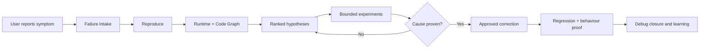

i was thinking an additional feature in the tailtrail, right now tailtrail is more focused on implementing fresh new implementation, i was thinking of adding a debugger into it, as if user want to debug it.
right now user can debug with agentic AI but it can tiring if user doest have full idea about project.  
 
we can build a framework and using tailtrail capabilities we can help user to debug the code.
what u think about it

9:53 PM

Worked for 10s

I think this is a strong and natural expansion for TailTrail.
But I would not position it as a traditional debugger that competes with IDE breakpoints, stack inspection, or language-specific debugging tools. TailTrail’s stronger opportunity is an evidence-driven debugging framework for coding agents.
The problem it solves is:
“Something is broken, but I don’t know the project well enough to identify the responsible component, reproduce the failure reliably, or judge whether the agent’s fix is correct.”

Proposed feature: TailTrail Debug Harness
The Debug Harness would turn a vague symptom, error, failed test, or production receipt into a controlled investigation:

1. Failure intake
A user could write:
tailtrail debug "Orders sometimes charge twice when payment times out"
TailTrail would capture:
- observed behavior;
- expected behavior;
- error, stack trace or failed command;
- reproduction frequency;
- environment and recent-change context;
- affected user journey;
- safety impact;
- what is known versus assumed.
It should acknowledge pasted errors and attach them to the active debugging run rather than treating them as new requirements.
2. Project orientation
This is where TailTrail helps someone unfamiliar with the repository.
Navigator and Code Graph Mapper would identify:
- entry point;
- relevant service path;
- callers and downstream effects;
- tests covering that path;
- recent changes when Git evidence is available;
- configuration and environment boundaries;
- logging and observability surfaces;
- important architecture and behaviour constraints.
The user receives a small “how this path works” explanation instead of being forced to understand the whole repository.
3. Reproduction contract
Before changing code, TailTrail should define what proves the bug exists:
Item	Example
Trigger	Payment gateway times out after accepting charge
Expected	One charge and one order
Actual	Retry creates a second charge
Reproduction	Integration test with timeout-after-acceptance adapter
Preserve	Successful order creation remains unchanged
Safety	Do not call a real payment provider

A reproducible failure becomes the debugging anchor.
4. Hypothesis ledger
The agent should not jump from an error directly to a fix. It records ranked hypotheses:
Hypothesis	Supporting evidence	Contradicting evidence	Next experiment
Retry lacks idempotency key	Duplicate charge occurs after timeout	Not yet confirmed at adapter boundary	Trace both payment calls
Repository saves too late	Order state absent during retry	Successful path saves normally	Inspect timeout ordering
API retries twice	Two service calls may be present	No request receipt yet	Add request correlation evidence

Each experiment should be bounded, deterministic where possible, and designed to eliminate hypotheses.
5. Debugging loop
The loop should be computational-first:
1. Reproduce the failure.
2. Capture a failure fingerprint.
3. Map the failing path.
4. Rank hypotheses.
5. Run the smallest discriminating experiment.
6. Eliminate or strengthen hypotheses.
7. Prove the root cause.
8. Propose the smallest correction.
9. Run regression, integration and behavioural proof.
10. Close only when the original reproduction no longer fails for the correct reason.
This avoids the common agent pattern of repeatedly editing code and rerunning tests without learning anything.
Existing TailTrail capabilities it can reuse
A large part of the foundation already exists:
Existing capability	Debugging role
Navigator	Selects the investigation path
Code Graph Mapper	Maps failing callers, symbols and tests
Failure Intake	Captures and classifies reported failures
Context Continuity	Remembers failed attempts and prevents repeated mistakes
Requirement Completion	Converts expected behavior into the correction contract
Architecture Fitness	Detects wrong-layer fixes and missed callers
Behaviour Harness	Proves the real user journey is repaired
Evidence-Aware Testing	Selects reproduction and regression tiers
Drift Control	Detects investigation or fix scope expansion
Safe Git Recovery	Recovers failed correction attempts
Token Harness	Keeps logs and traces manageable without losing exact evidence
Learning	Records sanitized recurring failure patterns after trusted closure
Durable Workflow	Supports pause, resume, correction and long investigations

So this is not a disconnected feature. It is a new workflow that composes TailTrail’s existing machinery around root-cause discovery.
Important distinction
TailTrail should report different confidence states:
Symptom captured
Reproduction confirmed
Hypothesis supported
Root cause proven
Correction proposed
Correction implemented
Regression validated
Behaviour restored
“Tests pass” must not automatically mean “root cause proven.” A test may pass because the agent weakened the assertion, bypassed the path, or masked the error.
User experience
A beginner-friendly command could be:
tailtrail debug "Checkout fails after payment timeout"
Optional inputs:
tailtrail debug --error error.txt
tailtrail debug --command "py -3 -m unittest tests.integration.test_payment"
tailtrail debug --run-id <existing-run>
tailtrail debug --recent-change
The first output should be a Debug Intake Report, not an implementation plan:
Failure understood: partial
Reproduction: not yet confirmed
Likely path: API → order service → payment adapter → repository
Safety boundary: no external payment call
Next investigation: reproduce timeout-after-acceptance locally
Approval needed: allow the proposed read-only investigation
Risks to control
- Agents inventing a root cause from a stack trace.
- Excessive logging or exposure of secrets and customer data.
- Broad repository scanning that creates token and latency overhead.
- Non-deterministic experiments producing false conclusions.
- Debug instrumentation accidentally remaining in production code.
- Fixing the visible symptom while leaving the shared cause.
- Endless hypothesis loops.
- Modifying production state during reproduction.
- Confusing correlation with causation.
A bounded cycle limit should trigger a diagnostic replan—not more blind edits.
Honest assessment
This could become one of TailTrail’s most valuable features. New implementation planning is crowded; many agents already do it reasonably well. Reliable debugging—especially for users unfamiliar with a large repository—is substantially harder.
The strongest positioning would be:
TailTrail Debug Harness turns symptoms into reproducible evidence, evidence into a proven root cause, and the root cause into a bounded, regression-tested correction.

I would build V1 around local failures only:
1. Debug Intake artifact.
2. Reproduction contract.
3. Code-path map.
4. Hypothesis ledger.
5. Bounded computational experiments.
6. Root-cause confidence states.
7. Correction handoff to the existing Harness workflow.
8. Debug-specific Completion Report.
Production telemetry ingestion, distributed tracing, live services, IDE protocol integration, and autonomous multi-agent debugging should come later.