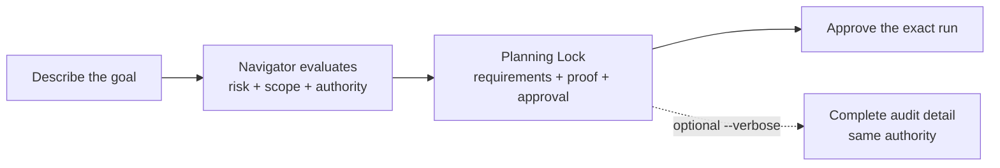

# TailTrail Test Lab — Current Demo Prompts

This is the canonical copy/paste demo book for the order-fulfilment Test Lab.
It demonstrates the current TailTrail product through the normal six-verb
experience first, then progressively exposes advanced controls.

## Demo operating rules

- Run prompts from the exact `TailTrail_Test` project root.
- Start a fresh host task after install or update so project instructions reload.
- `tailtrail start` is planning-only. It never implements, tests, scans, or
  mutates Git before approval.
- Do not implement from a Start report; wait for the exact Planning Lock
  approval and the typed execution handoff.
- TailTrail automatically resolves the active run when exactly one eligible run
  exists. Normal prompts therefore omit `--run-id`.
- Use an explicit run ID only when multiple eligible runs exist, when automation
  needs a stable identity, or when an auditor requests an exact reference.
- Users describe the task; TailTrail chooses the appropriate plan content from
  task risk, AIDLC routing, selected controls, and execution authority. Normal
  prompts need only the goal and any lifecycle choice the user actually wants.
- Text inside each **Example** fence is the complete user prompt. Presenter
  checks belong in the surrounding **Expected** text, never in the prompt.
- A real Start must create and display its Planning Lock unless the prompt
  explicitly demonstrates the non-persisted `--no-planning-lock` boundary.
  `--verbose` requests the complete audit view without changing requirements,
  approval, or execution authority.
- Return Start stdout verbatim. Preserve the fenced banner, run ID, every table
  pipe and separator row, backticks, and spacing; never reconstruct or
  HTML-escape the report.
- Never apply the Terraform fixture or claim external CI, cloud, scanner, host,
  token, or adoption evidence without a genuine linked receipt.

## Host command forms

| Host | Start form | Daily follow-ups |
| --- | --- | --- |
| Codex | `tailtrail start "goal"` | `tailtrail discuss`, `approve`, `continue`, `flow status`, `close` |
| GitHub Copilot | `/tailtrail-start "goal"` | ask the host to run the same six TailTrail verbs |
| Claude | `/tailtrail-start "goal"` | ask the host to run the same six TailTrail verbs |
| CLI / PowerShell | `tailtrail start "goal"` | identical six-verb flow |

When more than one eligible run exists, TailTrail fails closed and lists the
candidates. Repeat the command with `--run-id <exact-id>`; never guess.

## Task-first planning



| User intent | TailTrail response | User action |
| --- | --- | --- |
| Focused fix | bounded scope, requirements, selected controls, focused proof, approval | review and approve the exact Planning Lock |
| Routine delivery | persisted run, impact and preservation evidence, validation, recovery posture | discuss, approve, continue, status, close |
| Program or authority-heavy work | dependency order, delivery slices, Harness and authority boundaries | approve only the exact program boundary |
| Explicit `--verbose` audit | complete canonical plan with unavailable or inapplicable reasons | inspect detail; authority remains unchanged |

---

## Level 1 — Installation, hello, and project readiness

**Level purpose:** Prove that the correct project, launcher, payload, and host
instructions are active before the product demo begins.

**What this teaches:** A beautiful plan is meaningless when the host loaded the
wrong folder or stale instructions.

### Prompt 1: hello and installation identity

**Purpose:** Run the real smoke check and display the fixed-width banner.

**Why it helps:** Confirms launcher resolution and prevents a conversational
greeting from being mistaken for a TailTrail result.

**Example:**

```text
hello tailtrail
```

Expected: the command-emitted `text` fence, aligned ASCII banner, installation
result, mode, location, and command—verbatim as the complete response.

### Prompt 2: full local readiness

**Purpose:** Validate the installed Codex adapter and Extended payload.

**Why it helps:** Finds incomplete updates before a live demo reaches AIDLC,
Debug, MCP, or closure.

**Example:**

```text
Check that TailTrail is installed correctly and ready in this Codex project.
```

Expected: TailTrail runs project verification, host doctor, and MCP doctor and
reports their real status without upgrading local evidence into hosted support.

---

## Level 2 — Task-scaled Planning Locks

**Level purpose:** Demonstrate that users can describe the work directly while
TailTrail scales planning content to the task and lifecycle authority.

**What this teaches:** Normal prompts need no presentation flags. Focused work
stays approachable, routine work receives a persisted Planning Lock,
authority-heavy work exposes its program boundary, and `--verbose` adds audit
detail without changing authority.

### Prompt 3: ask for a safe approach

**Purpose:** Let a new user ask for help before starting a governed run.

**Why it helps:** Navigator explains the likely scope, controls, and proof
without requiring the user to know TailTrail options.

**Example:**

```text
tailtrail guide "Reject negative metric increments while preserving zero and
positive increments."
```

Expected: concise advisory guidance with likely impact and focused proof. No
Planning Lock or execution authority is created.

### Prompt 4: start a routine fix

**Purpose:** Create the real Planning Lock for a routine AIDLC Lite task.

**Why it helps:** Users receive a reviewable scope, preservation boundary,
selected controls, focused proof, and approval gate without learning display
commands.

**Example:**

```text
tailtrail start: reject zero order quantity while preserving positive quantities
```

Expected: a persisted Planning Lock with an inferred validation scope,
requirements, selected TailTrail features, focused validation, and approval.
The host returns the complete report exactly; the user does not ask for its
format or internal sections.

### Prompt 5: start a hands-free program

**Purpose:** Expose the complete delivery boundary for a hands-free program.

**Why it helps:** Program dependencies, Harness details, authority, evidence,
recovery, and approval boundaries remain visible from the task itself.

**Example:**

```text
tailtrail start: hands-free order amendments across the API, service, audit,
tests, rollout, and rollback; preserve existing create and cancel behavior
```

Expected: a comprehensive Program Delivery Planning Lock with dependency order,
first active slice, Harness and evidence posture, and explicit approval gates.

### Prompt 6: request complete audit detail

**Purpose:** Prove `--verbose` requests the comprehensive canonical audit plan.

**Why it helps:** Prevents a host from silently dropping requirements or
approval sections when output is narrow or collapsed.

**Example:**

```text
tailtrail start "reject negative metric increments while preserving zero and
positive increments" --verbose
```

Expected: the complete audit view, including explicit unavailable or
inapplicable controls. `--verbose` changes detail only, never authority.

---

## Level 3 — The six-verb daily workflow

**Level purpose:** Complete a focused change using `start -> discuss -> approve
-> continue -> status -> close` without manually carrying a run ID.

**What this teaches:** TailTrail owns lifecycle bookkeeping while the user still
controls every material approval.

### Prompt 7: confirm the real focused lock

**Purpose:** Reuse the persisted Planning Lock created by Prompt 4.

**Why it helps:** Proves the task-first planning sequence did not create
competing runs and keeps the six-verb workflow on one stable identity.

**Example:**

```text
tailtrail flow status
```

Expected: the zero-quantity Planning Lock from Prompt 4, still awaiting
approval, with no second run created.

### Prompt 8: discuss without a run ID

**Purpose:** Explain saved scope and feature decisions before approval.

**Why it helps:** Shows Interactive Plan Mode without inspecting source or
starting a second Planning Lock.

**Example:**

```text
tailtrail discuss --question "Why did you choose this scope and validation?"
```

### Prompt 9: approve the only active plan

**Purpose:** Activate the exact Planning Lock through the orchestration façade.

**Why it helps:** The user says what they mean; TailTrail resolves the only
eligible run and does not require copying an identifier.

**Example:**

```text
tailtrail approve
```

Expected: approval of the exact saved plan only. No project command or source
edit is implied by approval itself.

### Prompt 10: continue and inspect status

**Purpose:** Advance only the next dependency-ready stage and inspect canonical
state.

**Why it helps:** Demonstrates typed handoff, factual result recording, and
read-only status without manual workflow commands.

**Example:**

```text
tailtrail continue
```

Expected: only the next legal action or typed handoff. TailTrail stops at any
approval or evidence gap and records only work that actually occurs.

### Prompt 11: close from evidence

**Purpose:** Produce the Completion Report through the normal façade.

**Why it helps:** Closure cannot replace missing proof with a success narrative.

**Example:**

```text
tailtrail close
```

Expected: requirement status, selected Harness results, drift and evidence
posture, plus Accept / Wait for CI / Reopen choices.

---

## Level 4 — Every AIDLC mode

**Level purpose:** Compare Off, Lite, Standard, and Full requirement authority.

**What this teaches:** More ceremony is not automatically safer; each mode has a
specific boundary and Standard/Full use the pinned official authority.

### Prompt 12: AIDLC Off

**Purpose:** Plan an explicit deterministic rule without elicitation.

**Why it helps:** Keeps bounded work lightweight while retaining approval and
Requirement Completion.

**Example:**

```text
tailtrail start "Reject negative metric increments but keep zero and positive
increments valid." --aidlc off
```

### Prompt 13: AIDLC Lite

**Purpose:** Use compact local clarification for a routine change.

**Why it helps:** Material ambiguity is caught without loading the official
lifecycle.

**Example:**

```text
tailtrail start "Add delivery-address validation without breaking valid
addresses." --aidlc lite
```

### Prompt 14: official AIDLC Standard

**Purpose:** Invoke official Requirements Analysis for a cross-layer contract.

**Why it helps:** Normalization, rejection behavior, compatibility, and proof
are decided before implementation.

**Example:**

```text
tailtrail start "Add delivery-address validation across the API, order service,
and customer journey." --aidlc standard
```

Expected: official host-generated questions with options, requirement IDs,
decision impact, evidence, TailTrail recommendation, and reasoning—then a
separate requirements approval.

### Prompt 15: official AIDLC Full

**Purpose:** Start a broad order-amendment program under the complete official
lifecycle.

**Why it helps:** Concurrency, inventory, payment, notification, audit,
migration, operations, rollout, and rollback cannot be flattened safely.

**Example:**

```text
tailtrail start "Hands-free order amendments across API, data, inventory,
payments, notifications, and operations; preserve create and cancel behavior."
--aidlc full
```

---

## Level 5 — Harness selection and proof

**Level purpose:** Show that TailTrail selects computational lenses by
requirement risk instead of running every Harness indiscriminately.

**What this teaches:** Passing unit tests do not prove architecture, behavior,
maintainability, or higher-tier delivery.

### Prompt 16: Requirement Completion and Architecture Fitness

**Purpose:** Map a payment retry requirement through callers, layers, contracts,
and focused proof.

**Why it helps:** Architecture Fitness catches wrong-layer clients and missed
callers even when a helper test passes.

**Example:**

```text
tailtrail start: add idempotent payment retries without changing successful
order creation or introducing another payment abstraction
```

### Prompt 17: Behaviour Harness

**Purpose:** Prove the customer-visible create-to-shipment journey.

**Why it helps:** Behaviour Harness checks outputs, state transitions, ordering,
and exactly-once side effects across connected components.

**Example:**

```text
tailtrail start: add a customer-visible order journey from creation through
shipment without duplicate notifications
```

### Prompt 18: Maintainability Harness and Safe Git Recovery

**Purpose:** Reduce duplicate orchestration without speculative abstractions.

**Why it helps:** Maintainability Harness rejects test-chasing and scope creep;
Safe Git Recovery protects unrelated and previously completed work.

**Example:**

```text
tailtrail start: remove duplicate payment and notification orchestration while
preserving behavior, audit, and idempotency
```

### Prompt 19: UI consistency and Higher-Tier Testing

**Purpose:** Add an audit review page using the repository's UI baseline.

**Why it helps:** Navigator discovers design tokens, components, responsive and
accessibility patterns while Behaviour and Higher-Tier Testing prove the user
journey.

**Example:**

```text
tailtrail start: add an accessible Validate & Review page for audit events using
the project's existing UI patterns
```

---

## Level 6 — Interactive planning and customization

**Level purpose:** Revise an awaiting plan without losing its identity or
silently mutating approved requirements.

**What this teaches:** Clarification, rejection, official question challenge,
feature customization, and revision have different governed paths.

### Prompt 20: requirement feedback and AIDLC escalation

**Purpose:** Reject or approve individual requirement rows.

**Why it helps:** TailTrail preserves accepted rows and records exact feedback
instead of guessing why a plan was rejected.

**Example:**

```text
Approve REQ-01. Reject REQ-02 because partial allocation must release only the
excess reservation. Leave the other requirements pending.
```

### Prompt 21: clarify and challenge an official question

**Purpose:** Separate unclear wording from a substantively wrong premise.

**Why it helps:** Clarification preserves the official artifact; challenge
routes replacement back to official authority and requires question approval.

**Example:**

```text
Explain Q5 in plain language. Its synchronous-payment assumption looks wrong
because inventory can change before payment acknowledgment.
```

### Prompt 22: Expert Plan Customization and revision

**Purpose:** Propose optional control changes through one versioned catalog.

**Why it helps:** Users can see scope, evidence, token, and approval effects
without disabling locked safeguards.

**Example:**

```text
Customize this plan to use Standard AIDLC and Behaviour Harness. Keep API
compatibility, prove partial allocation, treat Terraform as reference-only, and
reuse the existing notification abstraction.
```

---

## Level 7 — Program Delivery and source-owned intent

**Level purpose:** Demonstrate dependency-ordered delivery and integration with
an existing structured specification.

**What this teaches:** Program Delivery and Intent Bridge preserve one approved
anchor without creating a competing requirement source.

### Prompt 23: all-Harness returns program

**Purpose:** Exercise Program Delivery, Context Continuity, Evidence-Aware
Testing, Token Harness, Evaluation Harness, and Meta-Harness in one program.

**Why it helps:** Returns and exchanges combine state, concurrency, money,
inventory, shipping, customer behavior, migration, CI, and release risk.

**Example:**

```text
tailtrail start: hands-free returns, exchanges, and replacement shipments with
safe money, inventory, notification, audit, rollout, and recovery behavior
```

### Prompt 24: Intent Bridge

**Purpose:** Use `014-order-amendment` as the source-owned requirement set.

**Why it helps:** Imported IDs and decisions remain authoritative while
TailTrail adds impact, slices, evidence, drift, recovery, and closure.

**Example:**

```text
tailtrail start "Implement the approved order-amendment specification."
--intent-feature 014-order-amendment
```

---

## Level 8 — Failure, Debug Harness, correction, and recovery

**Level purpose:** Prove TailTrail responds to real failures with bounded,
evidence-backed investigation instead of repeated guesses.

**What this teaches:** Root-cause proof, correction authority, loop protection,
and recovery are distinct from “tests pass.”

### Prompt 25: failure intake and bounded correction

**Purpose:** Attach a duplicate side-effect failure to the active approved run.

**Why it helps:** Working inventory and single-worker behavior become explicit
preservation constraints.

**Example:**

```text
Run the approved retry test. If payment and notification happen twice, diagnose
the failure and propose a bounded correction.
```

### Prompt 26: native Debug Harness

**Purpose:** Demonstrate reproduction, orientation, competing hypotheses,
experiment evidence, root-cause proof, and separately approved correction.

**Why it helps:** A hypothesis cannot be proven from conversation or one
supporting result; a competitor must be eliminated with recorded evidence.

**Example:**

```text
tailtrail start: debug duplicate charges and notifications after a payment
acknowledgment timeout; reproduce and prove the cause before changing code
```

### Prompt 27: scoped recovery

**Purpose:** Recover only a failed requirement slice after bounded correction is
exhausted.

**Why it helps:** Previously completed inventory work and unrelated user edits
remain untouched; broad reset is forbidden.

**Example:**

```text
Recover only the failed payment requirement. Preserve completed inventory work
and unrelated edits.
```

---

## Level 9 — Durable Workflow Runtime, MCP, and host parity

**Level purpose:** Show durable canonical state and one control plane across
CLI, MCP, Codex, Copilot, and Claude.

**What this teaches:** Hosts and tools project the same state; they cannot invent
approval, evidence, transitions, or support claims.

### Prompt 28: resume durable state

**Purpose:** Inspect and resume the only active workflow from its latest fresh
checkpoint.

**Why it helps:** A host restart does not recreate completed work or lose the
approved anchor.

**Example:**

```text
tailtrail flow status
tailtrail continue
```

### Prompt 29: MCP and three-host parity

**Purpose:** Compare read-only MCP state with CLI and adapter contracts.

**Why it helps:** MCP is a thin typed surface, not an alternate source of truth.

**Example:**

```text
Compare the active run's TailTrail MCP status with its CLI status.
```

---

## Level 10 — Closure, tokens, evaluation, and Learning V3

**Level purpose:** End delivery with evidence truth and demonstrate governed
improvement without causal overclaiming.

**What this teaches:** Actual tokens require telemetry; candidate learning
requires accepted evidence; evaluation remains deterministic and bounded.

### Prompt 30: evidence-incomplete and accepted closure

**Purpose:** Show both blocked and successful Completion Report paths.

**Why it helps:** Missing migration or behavior proof remains visible instead of
being summarized away.

**Example:**

```text
tailtrail close
```

### Prompt 31: evaluation, receipts, conflict, and learning

**Purpose:** Exercise Learning V3 retrieval, use receipts, conflict gate,
calibration, and candidate-only capture.

**Why it helps:** Advice is project-framed, default-deny, non-causal, and never
promoted automatically.

**Example:**

```text
Show relevant learning for payment idempotency and whether it helped this run.
```

---

## Level 11 — Enterprise, repository, release, and negative assurance

**Level purpose:** Exercise fail-closed policy and evidence boundaries around
dependencies, security, CI, distribution, and enterprise operation.

**What this teaches:** Local conformance is not hosted support, and hostile or
untrusted inputs never weaken canonical controls.

### Prompt 32: dependency, security, and repository enforcement

**Purpose:** Plan a signed webhook with replay protection and repository gates.

**Why it helps:** Dependency, security, privacy, CI, rollout, and rollback proof
stay explicit while standard library and existing capabilities are preferred.

**Example:**

```text
tailtrail start "Add a secure outbound shipment webhook with replay protection,
safe retries, audit, and metrics." --aidlc standard
```

### Prompt 33: enterprise conformance and negative assurance

**Purpose:** Run offline enterprise validation and adversarial boundary tests.

**Why it helps:** Tenant/actor/fencing, retention, export, migration, hostile
artifacts, path traversal, command injection, and sensitive-data leakage must
fail closed with sanitized categorical results.

**Example:**

```text
Check TailTrail enterprise, repository, release, and negative-assurance
readiness for this project.
```

---

## Level 12 — Product maturity and Adoption Validation

**Level purpose:** Demonstrate sealed ownership and honest evidence gates for
real evaluation and adoption.

**What this teaches:** Protocol-ready is not measured success. Zero observations
and a nonzero gate are correct until genuine trials exist.

### Prompt 34: maturity, real portfolio, and adoption truth

**Purpose:** Validate PM-0–PM-7 and PM-L0–PM-L5 without inventing observations.

**Why it helps:** The demo finishes by proving TailTrail applies its evidence
standards to itself.

**Example:**

```text
Show TailTrail product-maturity, learning, real-evaluation, and adoption
readiness without inventing evidence.
```

---

## Level 13 — Manager showcase: natural requests with governed control

**Level purpose:** Demonstrate the new intent layer with short prompts that a
developer can use without knowing TailTrail commands, flags, run IDs, file
paths, or internal feature names.

**What this teaches:** TailTrail can make the experience simple without making
the authority boundary vague. Natural task language starts planning, advisory
language stays read-only, active-run questions reuse saved evidence, and casual
agreement never becomes approval.

### Prompt 35: start planning in one sentence

**Purpose:** Turn an ordinary task request into a real Planning Lock.

**Why it helps:** Opens the demo with the visible developer benefit: the user
states the outcome while TailTrail discovers scope, requirements, controls, and
focused validation.

**Example:**

```text
Use TailTrail to reject zero order quantity while preserving positive quantities.
```

Expected: the host resolves a planning-only `start`, creates one persisted
Planning Lock, and returns its complete Start Report. Approval and execution
remain false.

### Prompt 36: ask for advice without starting a run

**Purpose:** Show that approach-seeking language routes to read-only guidance.

**Why it helps:** A developer can explore TailTrail's value before committing
to a governed run, without creating duplicate Planning Locks.

**Example:**

```text
Show me how TailTrail would safely add payment retries before starting any work.
```

Expected: a `guide` recommendation with likely scope and proof. No run,
approval, source edit, project command, or execution authority is created.

### Prompt 37: explain the active plan naturally

**Purpose:** Ask a saved-plan question without a run ID or discussion syntax.

**Why it helps:** Demonstrates that state-aware routing makes governance easier:
the explanation comes from the existing Planning Lock instead of starting a
second run or inspecting unrelated source.

**Example:**

```text
Why did TailTrail choose these files and tests?
```

Expected: read-only plan discussion for the single active run, preserving its
run ID, requirements, approval state, and implementation boundary.

### Prompt 38: prove casual agreement is not approval

**Purpose:** Demonstrate the fail-closed approval boundary in one memorable
interaction.

**Why it helps:** Shows managers that a friendly conversational phrase cannot
silently authorize code changes; approval must be explicit and bound to the
eligible saved plan.

**Example:**

```text
Looks good
```

Expected: TailTrail asks for explicit approval and records no approval or
execution authority. Continue with Prompt 9 only when the presenter intends to
approve the exact plan.

## Recommended live routes

### Five-minute manager showcase

1. Prompt 1 — installation identity and aligned banner.
2. Prompt 35 — natural task to a governed Planning Lock.
3. Prompt 37 — explain the active plan without syntax or a run ID.
4. Prompt 38 — casual agreement fails closed.
5. Prompt 9 — explicit approval, if implementation is part of the demo.

### Ten-minute route

1. Prompt 1 — aligned banner.
2. Prompt 2 — readiness.
3. Prompts 3–6 — advisory, routine, program, and verbose planning scenarios.
4. Prompts 7–11 — six-verb focused fix and Completion Report.

### Thirty-minute route

1. Prompts 1–11 — product entry and focused delivery.
2. Prompts 14–15 — official Standard versus Full.
3. Prompts 20–22 — interactive planning.
4. Prompts 25–27 — failure, Debug, correction, recovery.
5. Prompts 30–31 — closure and learning.

### Full capability route

Run all 13 levels. Use a fresh clone or archive completed runs between Start
scenarios so auto-resolution remains unambiguous. If you intentionally retain
multiple runs, demonstrate the fail-closed error and then provide the exact ID
TailTrail listed.

## Presenter checklist

- [ ] Exact project root is open in a fresh host task.
- [ ] Hello banner is fenced and aligned.
- [ ] Codex adapter is Extended, verified, and healthy.
- [ ] Normal prompts use goals and lifecycle choices, not output-view flags.
- [ ] Natural requests route to typed actions without granting authority.
- [ ] `--verbose` adds complete audit detail without changing authority.
- [ ] The daily flow omits run IDs when one run is eligible.
- [ ] Ambiguous runs fail closed and list candidates.
- [ ] No implementation occurs before approval.
- [ ] Every command result shown actually ran.
- [ ] Completion Report exposes missing evidence honestly.
- [ ] No Terraform, cloud, deployment, scanner, CI, token, host-support,
      performance, or adoption claim is invented.
