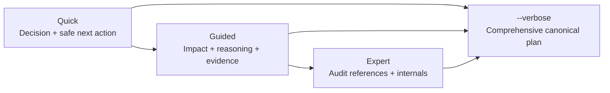

# TailTrail Test Lab — Current Demo Prompts

This is the canonical copy/paste demo book for the order-fulfilment Test Lab.
It demonstrates the current TailTrail product through the normal six-verb
experience first, then progressively exposes advanced controls.

## Demo operating rules

- Run prompts from the exact `TailTrail_Test` project root.
- Start a fresh host task after install or update so project instructions reload.
- `tailtrail start` is planning-only. It never implements, tests, scans, or
  mutates Git before approval.
- TailTrail automatically resolves the active run when exactly one eligible run
  exists. Normal prompts therefore omit `--run-id`.
- Use an explicit run ID only when multiple eligible runs exist, when automation
  needs a stable identity, or when an auditor requests an exact reference.
- Quick, Guided, and Expert change presentation depth only. They never change
  requirements, AIDLC mode, selected controls, evidence, approval, or workflow
  authority. `--verbose` shows the comprehensive plan in every mode.
- Never apply the Terraform fixture or claim external CI, cloud, scanner, host,
  token, or adoption evidence without a genuine linked receipt.

## Host command forms

| Host | Start form | Daily follow-ups |
| --- | --- | --- |
| Codex | `tailtrail start "goal" --presentation guided` | `tailtrail discuss`, `approve`, `continue`, `flow status`, `close` |
| GitHub Copilot | `/tailtrail-start "goal" --presentation guided` | ask the host to run the same six TailTrail verbs |
| Claude | `/tailtrail-start "goal" --presentation guided` | ask the host to run the same six TailTrail verbs |
| CLI / PowerShell | `tailtrail start "goal" --presentation guided` | identical six-verb flow |

When more than one eligible run exists, TailTrail fails closed and lists the
candidates. Repeat the command with `--run-id <exact-id>`; never guess.

## Presentation layers



| Layer | Best for | Default view |
| --- | --- | --- |
| Quick | New users and focused fixes | run, goal, requirements, mode, likely scope, controls, proof, tokens, approval |
| Guided | Regular delivery | Quick plus impact, preservation, evidence tiers, deferred controls, drift/recovery, slices |
| Expert | Platform owners and reviewers | Guided plus identities, revisions, receipts, policy and calibration references |
| Any + `--verbose` | Deep review and conformance | complete canonical plan with explicit unavailable/inapplicable reasons |

---

## Level 1 — Installation, hello, and project readiness

**Level purpose:** Prove that the correct project, launcher, payload, and host
instructions are active before the product demo begins.

**What this teaches:** A beautiful plan is meaningless when the host loaded the
wrong folder or stale instructions.

### Prompt 1: hello and installation identity

**Purpose:** Run the real smoke check and display the fixed-width banner.

**Why it helps:** Confirms launcher resolution and prevents a conversational
greeting from being mistaken for a TailTrail result.

**Example:**

```text
hello tailtrail
```

Expected: the command-emitted `text` fence, aligned ASCII banner, installation
result, mode, location, and command—verbatim as the complete response.

### Prompt 2: full local readiness

**Purpose:** Validate the installed Codex adapter and Extended payload.

**Why it helps:** Finds incomplete updates before a live demo reaches AIDLC,
Debug, MCP, or closure.

**Example:**

```text
Run TailTrail verify and doctor for this exact project and Codex host. Then run
presentation conformance and MCP doctor from the installed payload. Report real
exit codes and do not convert contract-tested status into live-host support.
```

---

## Level 2 — Quick, Guided, Expert, and verbose plans

**Level purpose:** Demonstrate the three selectable presentation layers without
creating three competing active runs.

**What this teaches:** Presentation depth is independent from planning authority
and `--verbose` never changes task behavior.

### Prompt 3: Quick plan preview

**Purpose:** Show the concise complete contract for a new user.

**Why it helps:** Keeps a small defect approachable while preserving the
Planning Lock, requirements, proof, and approval boundary.

**Example:**

```text
Run a display-only TailTrail Start preview for "reject zero order quantity while
preserving positive quantities" using --presentation quick,
--changed src/order_service/validation.py, and --no-planning-lock. Do not
implement or create an active run.
```

### Prompt 4: Guided plan preview

**Purpose:** Show impact, preservation, evidence tiers, and delivery reasoning.

**Why it helps:** Regular users see why files and Harnesses are selected without
the full audit ledger.

**Example:**

```text
Run the same display-only Start preview with --presentation guided and
--no-planning-lock. Compare its visible information with Quick. Confirm that
the goal, requirements, AIDLC mode, scope, controls, evidence, and authority are
unchanged.
```

### Prompt 5: Expert plan preview

**Purpose:** Expose detailed audit and platform references.

**Why it helps:** Reviewers can inspect identities, revisions, receipt posture,
policy, and calibration without changing the plan.

**Example:**

```text
Run the same display-only Start preview with --presentation expert and
--no-planning-lock. Highlight only the additional audit detail; do not claim
that Expert grants broader execution authority.
```

### Prompt 6: verbose completeness and host conformance

**Purpose:** Prove every layer can render the comprehensive canonical plan.

**Why it helps:** Prevents a host from silently dropping requirements or
approval sections when output is narrow or collapsed.

**Example:**

```text
Run the display-only preview in Quick, Guided, and Expert with --verbose and
--no-planning-lock, then run `tailtrail presentation conformance`. Verify the
same required semantic sections across all modes and explain the explicit
collapsed-output refusal. Do not create project runs.
```

---

## Level 3 — The six-verb daily workflow

**Level purpose:** Complete a focused change using `start -> discuss -> approve
-> continue -> status -> close` without manually carrying a run ID.

**What this teaches:** TailTrail owns lifecycle bookkeeping while the user still
controls every material approval.

### Prompt 7: start the real focused fix

**Purpose:** Create one persisted Planning Lock for the seeded validation defect.

**Why it helps:** Provides a clean, auditable demo run after the display-only
comparisons.

**Example:**

```text
tailtrail start "fix the zero quantity validation defect, add focused proof,
preserve positive quantities and existing order creation behavior" --changed
src/order_service/validation.py --presentation guided
```

### Prompt 8: discuss without a run ID

**Purpose:** Explain saved scope and feature decisions before approval.

**Why it helps:** Shows Interactive Plan Mode without inspecting source or
starting a second Planning Lock.

**Example:**

```text
tailtrail discuss --question "Why were these files, AIDLC mode, TailTrail
features, and validation tiers selected, and what would activate each deferred
control?"
```

### Prompt 9: approve the only active plan

**Purpose:** Activate the exact Planning Lock through the orchestration façade.

**Why it helps:** The user says what they mean; TailTrail resolves the only
eligible run and does not require copying an identifier.

**Example:**

```text
tailtrail approve
```

Expected: approval of the exact saved plan only. No project command or source
edit is implied by approval itself.

### Prompt 10: continue and inspect status

**Purpose:** Advance only the next dependency-ready stage and inspect canonical
state.

**Why it helps:** Demonstrates typed handoff, factual result recording, and
read-only status without manual workflow commands.

**Example:**

```text
Use `tailtrail continue` for the only active run. Perform only the typed host
handoff it returns, record the factual result reference, continue once, and then
show `tailtrail flow status`. Stop at any approval or evidence gap.
```

### Prompt 11: close from evidence

**Purpose:** Produce the Completion Report through the normal façade.

**Why it helps:** Closure cannot replace missing proof with a success narrative.

**Example:**

```text
tailtrail close
```

Expected: requirement status, selected Harness results, drift and evidence
posture, plus Accept / Wait for CI / Reopen choices.

---

## Level 4 — Every AIDLC mode

**Level purpose:** Compare Off, Lite, Standard, and Full requirement authority.

**What this teaches:** More ceremony is not automatically safer; each mode has a
specific boundary and Standard/Full use the pinned official authority.

### Prompt 12: AIDLC Off

**Purpose:** Plan an explicit deterministic rule without elicitation.

**Why it helps:** Keeps bounded work lightweight while retaining approval and
Requirement Completion.

**Example:**

```text
tailtrail start "reject negative metric increments, preserve zero and positive
increments, and add one focused unit test" --aidlc off --changed
src/order_service/metrics.py --presentation quick
```

### Prompt 13: AIDLC Lite

**Purpose:** Use compact local clarification for a routine change.

**Why it helps:** Material ambiguity is caught without loading the official
lifecycle.

**Example:**

```text
tailtrail start "add a focused delivery-address validation rule and preserve the
current valid-address path" --aidlc lite --changed
src/order_service/validation.py --presentation guided
```

### Prompt 14: official AIDLC Standard

**Purpose:** Invoke official Requirements Analysis for a cross-layer contract.

**Why it helps:** Normalization, rejection behavior, compatibility, and proof
are decided before implementation.

**Example:**

```text
tailtrail start "using AIDLC, add delivery-address validation across the API,
order service, and customer journey; clarify normalization, rejection behavior,
backward compatibility, and required evidence" --aidlc standard --presentation
guided
```

Expected: official host-generated questions with options, requirement IDs,
decision impact, evidence, TailTrail recommendation, and reasoning—then a
separate requirements approval.

### Prompt 15: official AIDLC Full

**Purpose:** Start a broad order-amendment program under the complete official
lifecycle.

**Why it helps:** Concurrency, inventory, payment, notification, audit,
migration, operations, rollout, and rollback cannot be flattened safely.

**Example:**

```text
tailtrail start "hands-free: using full AIDLC, add idempotent order amendments
across API, service, repository, inventory, payments, notifications, audit,
metrics, migration, rollout, and rollback; preserve create-order and cancellation
behavior; do not apply Terraform" --aidlc full --presentation expert --verbose
```

---

## Level 5 — Harness selection and proof

**Level purpose:** Show that TailTrail selects computational lenses by
requirement risk instead of running every Harness indiscriminately.

**What this teaches:** Passing unit tests do not prove architecture, behavior,
maintainability, or higher-tier delivery.

### Prompt 16: Requirement Completion and Architecture Fitness

**Purpose:** Map a payment retry requirement through callers, layers, contracts,
and focused proof.

**Why it helps:** Architecture Fitness catches wrong-layer clients and missed
callers even when a helper test passes.

**Example:**

```text
tailtrail start "add idempotent payment retry behind the existing payment
adapter, preserve successful order creation, map every API/service caller, add
unit and integration proof, and do not add a dependency or second payment
abstraction" --presentation guided
```

### Prompt 17: Behaviour Harness

**Purpose:** Prove the customer-visible create-to-shipment journey.

**Why it helps:** Behaviour Harness checks outputs, state transitions, ordering,
and exactly-once side effects across connected components.

**Example:**

```text
tailtrail start "add a customer-visible order-status journey from creation
through allocation and shipment; preserve API responses; publish no duplicate
notification; prove the connected journey, not only unit functions"
--presentation guided
```

### Prompt 18: Maintainability Harness and Safe Git Recovery

**Purpose:** Reduce duplicate orchestration without speculative abstractions.

**Why it helps:** Maintainability Harness rejects test-chasing and scope creep;
Safe Git Recovery protects unrelated and previously completed work.

**Example:**

```text
tailtrail start "refactor duplicate payment and notification orchestration;
reuse existing boundaries; preserve public behavior, audit, idempotency, and
tests; avoid new dependencies; keep recovery task-scoped" --presentation expert
```

### Prompt 19: UI consistency and Higher-Tier Testing

**Purpose:** Add an audit review page using the repository's UI baseline.

**Why it helps:** Navigator discovers design tokens, components, responsive and
accessibility patterns while Behaviour and Higher-Tier Testing prove the user
journey.

**Example:**

```text
tailtrail start "add a Validate & Review page for audit events with summary,
status, export controls, and JSON preview; discover and reuse existing UI
patterns; preserve accessibility and responsiveness; do not add a UI library"
--presentation guided
```

---

## Level 6 — Interactive planning and customization

**Level purpose:** Revise an awaiting plan without losing its identity or
silently mutating approved requirements.

**What this teaches:** Clarification, rejection, official question challenge,
feature customization, and revision have different governed paths.

### Prompt 20: requirement feedback and AIDLC escalation

**Purpose:** Reject or approve individual requirement rows.

**Why it helps:** TailTrail preserves accepted rows and records exact feedback
instead of guessing why a plan was rejected.

**Example:**

```text
For the only awaiting TailTrail plan, show the blank requirement feedback form.
Do not infer any answers. Then record: REQ-01 approve; REQ-02 reject — partial
allocation must release only excess reservation; keep remaining rows pending.
```

### Prompt 21: clarify and challenge an official question

**Purpose:** Separate unclear wording from a substantively wrong premise.

**Why it helps:** Clarification preserves the official artifact; challenge
routes replacement back to official authority and requires question approval.

**Example:**

```text
Clarify official AIDLC question Q5 from the active run in plain language without
changing it. Then challenge Q5 because it assumes synchronous payment although
inventory may change before payment acknowledgment. Show the replacement
candidate and wait for question-level approval.
```

### Prompt 22: Expert Plan Customization and revision

**Purpose:** Propose optional control changes through one versioned catalog.

**Why it helps:** Users can see scope, evidence, token, and approval effects
without disabling locked safeguards.

**Example:**

```text
For the active plan, show Expert Plan Customization. Propose Standard AIDLC and
Behaviour Harness, explain scope/evidence/token effects, then revise the plan to
keep API compatibility, add partial-allocation behavior proof, treat Terraform
as reference-only, and remove a new notification abstraction. Wait for approval
of the exact revision.
```

---

## Level 7 — Program Delivery and source-owned intent

**Level purpose:** Demonstrate dependency-ordered delivery and integration with
an existing structured specification.

**What this teaches:** Program Delivery and Intent Bridge preserve one approved
anchor without creating a competing requirement source.

### Prompt 23: all-Harness returns program

**Purpose:** Exercise Program Delivery, Context Continuity, Evidence-Aware
Testing, Token Harness, Evaluation Harness, and Meta-Harness in one program.

**Why it helps:** Returns and exchanges combine state, concurrency, money,
inventory, shipping, customer behavior, migration, CI, and release risk.

**Example:**

```text
tailtrail start "hands-free: using full AIDLC, add returns, exchanges, and
replacement shipment with idempotent refund/charge/inventory/allocation/
notification/audit effects, stable customer and operations APIs, dependency-
ordered slices, bounded correction, continuity, recovery, closure, evaluation,
and guarded learning; do not apply Terraform" --presentation expert --verbose
```

### Prompt 24: Intent Bridge

**Purpose:** Use `014-order-amendment` as the source-owned requirement set.

**Why it helps:** Imported IDs and decisions remain authoritative while
TailTrail adds impact, slices, evidence, drift, recovery, and closure.

**Example:**

```text
tailtrail start "Use Intent Bridge feature 014-order-amendment, map its approved
requirements to API, service, repository, inventory, payment, notification,
audit, and tests, and propose the first delivery slice without rewriting the
source" --intent-feature 014-order-amendment --presentation guided
```

---

## Level 8 — Failure, Debug Harness, correction, and recovery

**Level purpose:** Prove TailTrail responds to real failures with bounded,
evidence-backed investigation instead of repeated guesses.

**What this teaches:** Root-cause proof, correction authority, loop protection,
and recovery are distinct from “tests pass.”

### Prompt 25: failure intake and bounded correction

**Purpose:** Attach a duplicate side-effect failure to the active approved run.

**Why it helps:** Working inventory and single-worker behavior become explicit
preservation constraints.

**Example:**

```text
For the only active run, execute the approved retry test. Record its real exit
code and sanitized output. If payment and notification occur twice while
inventory releases once, map the failure to requirements, fingerprint it, and
propose one bounded correction. Do not start another run.
```

### Prompt 26: native Debug Harness

**Purpose:** Demonstrate reproduction, orientation, competing hypotheses,
experiment evidence, root-cause proof, and separately approved correction.

**Why it helps:** A hypothesis cannot be proven from conversation or one
supporting result; a competitor must be eliminated with recorded evidence.

**Example:**

```text
tailtrail start "debug: payment is accepted but its acknowledgment times out,
then retry records two charges and two notifications; preserve first-attempt
behavior; reproduce and prove the cause before correction" --debug --changed
debug_lab/retry_race.py --command "python3
debug_lab/run_duplicate_effect_failure.py" --presentation guided
```

### Prompt 27: scoped recovery

**Purpose:** Recover only a failed requirement slice after bounded correction is
exhausted.

**Why it helps:** Previously completed inventory work and unrelated user edits
remain untouched; broad reset is forbidden.

**Example:**

```text
For the active run, preserve completed inventory behavior and all unrelated
user edits. Build a recovery plan for only the failed payment requirement,
prefer its clean local Git checkpoint, use patch-level reconciliation only as a
fallback, and rerun preservation evidence. Do not execute a broad reset.
```

---

## Level 9 — Durable Workflow Runtime, MCP, and host parity

**Level purpose:** Show durable canonical state and one control plane across
CLI, MCP, Codex, Copilot, and Claude.

**What this teaches:** Hosts and tools project the same state; they cannot invent
approval, evidence, transitions, or support claims.

### Prompt 28: resume durable state

**Purpose:** Inspect and resume the only active workflow from its latest fresh
checkpoint.

**Why it helps:** A host restart does not recreate completed work or lose the
approved anchor.

**Example:**

```text
Use `tailtrail flow status` to show stage, checkpoint freshness, requirement
progress, evidence gaps, and legal next actions. Resume with `tailtrail
continue`; fail closed if the lock is stale or the next stage needs approval.
```

### Prompt 29: MCP and three-host parity

**Purpose:** Compare read-only MCP state with CLI and adapter contracts.

**Why it helps:** MCP is a thin typed surface, not an alternate source of truth.

**Example:**

```text
Using TailTrail read-only MCP tools, inspect the active Planning Lock,
requirements, workflow, Harness state, evidence, closure boundary, and host
conformance. Compare with CLI status. Do not invoke controlled mutation or call
Codex/Copilot/Claude runtime-passed without genuine six-scenario receipts.
```

---

## Level 10 — Closure, tokens, evaluation, and Learning V3

**Level purpose:** End delivery with evidence truth and demonstrate governed
improvement without causal overclaiming.

**What this teaches:** Actual tokens require telemetry; candidate learning
requires accepted evidence; evaluation remains deterministic and bounded.

### Prompt 30: evidence-incomplete and accepted closure

**Purpose:** Show both blocked and successful Completion Report paths.

**Why it helps:** Missing migration or behavior proof remains visible instead of
being summarized away.

**Example:**

```text
Run `tailtrail close` using only saved evidence. First show the real
evidence-incomplete result if any required receipt is absent. After recording
genuine missing proof, close again and show requirement, Architecture Fitness,
Behaviour Harness, Maintainability Harness, testing, drift, continuity,
recovery, token, and acceptance status.
```

### Prompt 31: evaluation, receipts, conflict, and learning

**Purpose:** Exercise Learning V3 retrieval, use receipts, conflict gate,
calibration, and candidate-only capture.

**Why it helps:** Advice is project-framed, default-deny, non-causal, and never
promoted automatically.

**Example:**

```text
For an accepted run, retrieve at most three current payment-idempotency Learning
V3 proposals scoped to service.py and the active requirement. Record whether
advice was used, ignored, or rejected only if genuinely decided. Join later
closure evidence without a causal claim, show conflict/negative-learning state,
run deterministic calibration, and create only an uncurated candidate.
```

---

## Level 11 — Enterprise, repository, release, and negative assurance

**Level purpose:** Exercise fail-closed policy and evidence boundaries around
dependencies, security, CI, distribution, and enterprise operation.

**What this teaches:** Local conformance is not hosted support, and hostile or
untrusted inputs never weaken canonical controls.

### Prompt 32: dependency, security, and repository enforcement

**Purpose:** Plan a signed webhook with replay protection and repository gates.

**Why it helps:** Dependency, security, privacy, CI, rollout, and rollback proof
stay explicit while standard library and existing capabilities are preferred.

**Example:**

```text
tailtrail start "add an outbound shipment webhook with signature verification,
replay protection, bounded retry, audit, and metrics; prefer existing and
standard-library capabilities; gate any dependency; include repository, CI,
contract, behavior, security, rollout, and rollback evidence; call no real
cloud service" --aidlc standard --presentation expert --verbose
```

### Prompt 33: enterprise conformance and negative assurance

**Purpose:** Run offline enterprise validation and adversarial boundary tests.

**Why it helps:** Tenant/actor/fencing, retention, export, migration, hostile
artifacts, path traversal, command injection, and sensitive-data leakage must
fail closed with sanitized categorical results.

**Example:**

```text
Run TailTrail enterprise conformance, repository enforcement, release check,
and negative-assurance tests locally. Show passing local probes and every
missing hosted/platform receipt. Do not echo hostile payloads, claim provider
readiness, publish, deploy, merge, or apply Terraform.
```

---

## Level 12 — Product maturity and Adoption Validation

**Level purpose:** Demonstrate sealed ownership and honest evidence gates for
real evaluation and adoption.

**What this teaches:** Protocol-ready is not measured success. Zero observations
and a nonzero gate are correct until genuine trials exist.

### Prompt 34: maturity, real portfolio, and adoption truth

**Purpose:** Validate PM-0–PM-7 and PM-L0–PM-L5 without inventing observations.

**Why it helps:** The demo finishes by proving TailTrail applies its evidence
standards to itself.

**Example:**

```text
Run `tailtrail maturity validate`, `maturity learning-inventory`, `eval real-
portfolio report`, `eval adoption report`, and `eval adoption gate`. Preserve
real exit codes, observation counts, claim boundaries, and privacy rules. Then
show new-user and experienced-user trial templates without recording a trial.
```

## Recommended live routes

### Ten-minute route

1. Prompt 1 — aligned banner.
2. Prompt 2 — readiness.
3. Prompts 3–6 — Quick/Guided/Expert/verbose comparison.
4. Prompts 7–11 — six-verb focused fix and Completion Report.

### Thirty-minute route

1. Prompts 1–11 — product entry and focused delivery.
2. Prompts 14–15 — official Standard versus Full.
3. Prompts 20–22 — interactive planning.
4. Prompts 25–27 — failure, Debug, correction, recovery.
5. Prompts 30–31 — closure and learning.

### Full capability route

Run all 12 levels. Use a fresh clone or archive completed runs between Start
scenarios so auto-resolution remains unambiguous. If you intentionally retain
multiple runs, demonstrate the fail-closed error and then provide the exact ID
TailTrail listed.

## Presenter checklist

- [ ] Exact project root is open in a fresh host task.
- [ ] Hello banner is fenced and aligned.
- [ ] Codex adapter is Extended, verified, and healthy.
- [ ] Quick, Guided, and Expert outputs differ in depth.
- [ ] `--verbose` retains comprehensive semantics in all modes.
- [ ] The daily flow omits run IDs when one run is eligible.
- [ ] Ambiguous runs fail closed and list candidates.
- [ ] No implementation occurs before approval.
- [ ] Every command result shown actually ran.
- [ ] Completion Report exposes missing evidence honestly.
- [ ] No Terraform, cloud, deployment, scanner, CI, token, host-support,
      performance, or adoption claim is invented.
