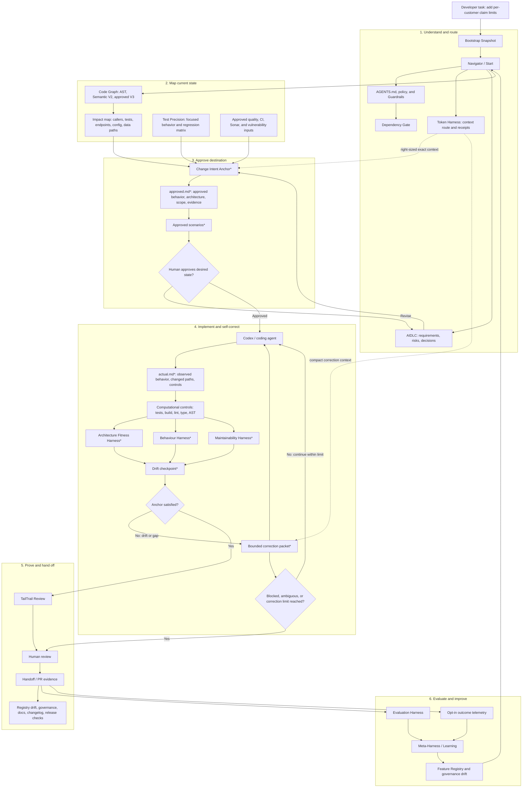

# TailTrail Harness Engineering: Maximum-Coverage Workflow

## Purpose

This review document shows how nearly every TailTrail feature family can work
together with Harness Engineering. It is a deliberately broad reference
scenario, not the default workflow for every task.

Scenario: introduce a per-customer claim limit without breaking existing claim
flows. The change can affect validation, services, API errors, policy/config,
tests, documentation, and release evidence.

Items marked `*` are proposed Harness Engineering capabilities; this document
does not claim that the corresponding runtime already exists.

## End-to-end workflow



## 1. Navigator chooses the route

Navigator is the router. It does not automatically run every TailTrail feature.
For this scenario it should choose an AIDLC-assisted, full-harness route because
the work has business, multi-file, test, and potential public-contract or
data/configuration risk.

| Navigator input | Likely route |
| --- | --- |
| One known source file, no behavior change | Normal lean workflow. |
| Small logic fix with a clear outcome | Light Change Intent Anchor. |
| Multiple callers, tests, or behavior paths | Requirement Completion Harness. |
| API, schema, dependency, security, architecture, or workflow-state change | Full three-lens harness. |
| Broad, ambiguous, or multi-team work | AIDLC-assisted anchor proposal. |

For a small validation fix, Navigator should skip AIDLC, broad scenarios,
scanners, and release work unless a concrete signal justifies them.

## 2. Map the current project state

Before editing, Code Graph, Test Precision, policy, exact source inspection, and
approved local quality/security evidence establish:

```text
- current validation and service behavior
- callers that submit claims
- focused tests and fixtures
- API, configuration, data, and dependency boundaries
- known baseline failures and unresolved decisions
```

This prevents a direct validation fix that misses service, API, event,
configuration, or workflow paths.

## 3. Approve the desired destination

`approved.md` is the human-approved target. It records desired behavior,
architecture expectations, allowed scope, preserved invariants, known unknowns,
and required evidence.

```text
Desired behavior:
- claims over the customer limit are rejected
- claims within limit still succeed
- existing claim behavior remains compatible where required

Architecture:
- service uses shared policy and validation path
- controller does not implement duplicate business logic
- public contract changes require explicit approval

Evidence:
- validation scenario
- submission workflow scenario
- positive/regression scenario
- selected architecture and focused test checks
```

The anchor defines outcomes and boundaries, not line-by-line implementation. The
agent remains free to choose the smallest compatible solution.

## 4. Implement and self-correct

After Codex edits code, TailTrail produces `actual.md`, runs selected fast
controls, and compares actual state to the approved anchor.

```text
Checkpoint 2 of 3

Requirement coverage:
- over-limit claim rejected: validated
- within-limit claim accepted: validated
- batch claim submission respects limit: failed

Architecture:
- shared validation path: preserved
- new controller-only special case: none

Scope:
- no unexpected dependency or protected-path change

Next correction:
Apply the shared limit policy in the batch submission service path.
Do not change API behavior or introduce a dependency.
```

The agent receives one precise correction task, not "run it again and fix
everything." The loop stops when the anchor is satisfied or when timeout,
repeated failure, ambiguity, material scope expansion, or the correction-cycle
limit requires human judgment.

## 5. The three harness lenses

| Harness | Main question | Typical evidence |
| --- | --- | --- |
| Maintainability Harness | Is the change consistent, scoped, understandable, testable, and free of unnecessary complexity? | Reuse/diff review, changed-test rationale, dependency checks, focused tests, lint/type/build controls. |
| Architecture Fitness Harness | Did the change preserve intended paths, layers, module boundaries, dependency direction, and contracts? | Imports/calls, AST graph, structural rules, changed-path rules, focused contract tests. |
| Behaviour Harness | Does the system behave according to approved user-visible outcomes and preserved invariants? | Approved scenarios, unit/service/integration tests, fixtures, manual evidence where required. |

All three compare actual work to the same approved anchor. They do not run as
disconnected review tools.

## 6. Approved scenarios protect behavior

For behavior-heavy work, approved scenarios provide a human-readable oracle:

```text
approved.md or <scenario>.approved.md = approved expected behavior
actual.md   or <scenario>.actual.md   = generated observed behavior
comparison-report.md                   = behavior and architecture gap
```

The agent can regenerate actual state but cannot silently overwrite approved
state. A changed expected outcome must be proposed and approved by a human.
This prevents behavior-level test-chasing.

Approved scenarios are particularly useful for API contracts, event payloads,
workflow transitions, CLI output, generated reports, service-call sequences, and
structured domain output. They are not a good fit for large opaque snapshots,
unstable output, performance claims, or purely internal implementation details.

## 7. Review and human judgment

Once focused computational controls and the drift checkpoint are satisfied,
TailTrail Review performs requirement and maintainability judgment:

- Did the implementation fulfill the approved request?
- Did it preserve safeguards and existing project patterns?
- Did it introduce duplicate logic, unnecessary abstraction, or an avoidable
  dependency?
- Are changed tests linked to the requirement and meaningful?
- Is there a business, API, architecture, or behavior decision only a human can
  make?

Human review receives an evidence handoff rather than raw logs:

```text
- approved desired state
- actual observed state
- drift checkpoint history
- focused validation results
- architecture and behavior status
- changed-test rationale
- unresolved decisions and accepted risks
```

## 8. Token Harness keeps the loop efficient

Token Harness supports the loop by loading only exact context needed for the
current checkpoint. It does not decide requirement correctness.

| Stage | Context to load |
| --- | --- |
| Anchor creation | Goal, relevant policy, selected files/callers/tests, graph summary, known unknowns. |
| Implementation | Relevant approved rows, exact source, required helpers, focused tests, allowed commands. |
| Correction | One unmet requirement row, relevant diff, exact failure output, affected source/caller/test, next action. |
| Review | Compact diff summary, changed-test rationale, checkpoint status, unresolved risks, retrieval pointers. |

Token Harness must keep approved requirements, current diff, policy/security
constraints, dependency/lock evidence, and exact failure output available in
full. It may compact safe bulky logs or reports only with retrieval pointers and
without losing a material fact.

Exact token/cost savings remain measured claims only when before/after provider
telemetry exists.

## 9. Evaluation Harness evaluates TailTrail itself

Completion Harness asks whether this task reached its approved target.
Evaluation Harness asks whether TailTrail Harness Engineering improves outcomes
across repeatable scenarios.

```text
Baseline artifact:
- agent changes direct validation only
- service caller missed
- one unit test passes
- required submission behavior incomplete

TailTrail Harness artifact:
- approved behavior and service-path rule
- missing caller detected at checkpoint
- bounded correction packet issued
- focused service test passes
- requirement matrix complete
```

Evaluation should assess:

- requirement completion;
- architecture preservation;
- behavior evidence;
- scope discipline;
- test integrity;
- correction efficiency;
- escalation quality;
- review readiness; and
- context discipline.

It should begin with saved sanitized artifacts and deterministic scenario
scoring, not live-model calls. It must not claim defect reduction, review-time
reduction, or token savings without credible measured evidence.

## 10. Continuous improvement and release hygiene

Opt-in local outcome evidence and Evaluation Harness results can reveal recurring
problems: missed service callers, absent approved scenarios, noisy architecture
rules, context growth, or unclear guidance.

Meta-Harness and Learning should only propose improvements. Human approval,
focused tests, registry updates, governance sync, documentation, and release
hygiene prevent those improvements from becoming a new source of drift.

## Key principle

> Navigator chooses the smallest appropriate harness. The approved anchor
> defines the destination. TailTrail detects drift with computational and
> inferential controls. Codex corrects one bounded gap at a time. Evaluation
> Harness proves whether the system is improving outcomes.
