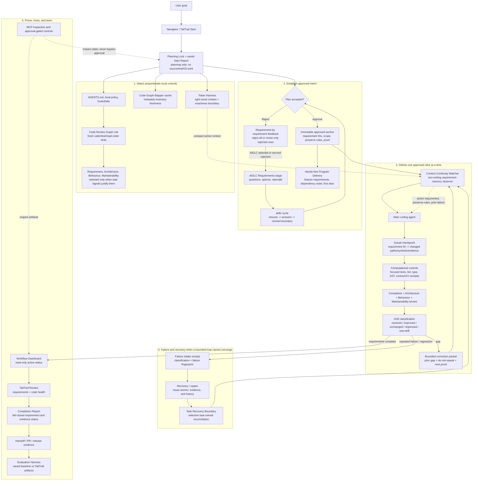
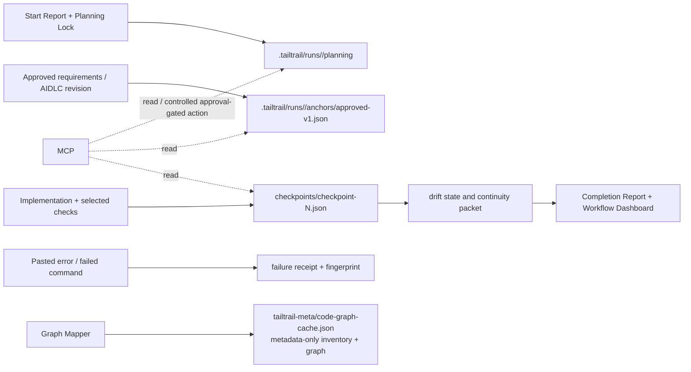
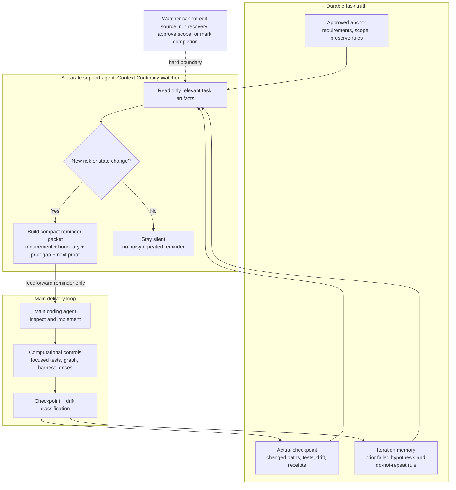

# TailTrail Harness Engineering: Maximum-Coverage Workflow

## Purpose

This review document shows how nearly every TailTrail feature family can work
together with Harness Engineering. It is a deliberately broad reference
scenario, not the default workflow for every task.

Scenario: introduce a per-customer claim limit without breaking existing claim
flows. The change can affect validation, services, API errors, policy/config,
tests, documentation, and release evidence.

This is a maximum-coverage reference flow, not an instruction to run every
control. The implemented V1 controls are selected by Navigator/Start and run
only after the appropriate approval and repository-owned command decisions.
For the exact automatic-selection rules, required evidence, and execution
boundaries, see [TailTrail Automatic Routing and Trigger Guide](tailtrail-automation-guide.md).

## End-to-end workflow


```mermaid
flowchart TB
    U["User goal"] --> N["Navigator / TailTrail Start"]
    N --> P["Planning Lock + saved Start Report\nplanning only; no source/test/Git work"]

    subgraph Route["1. Select proportionate local controls"]
        POL["AGENTS.md, local policy, Guardrails"]
        LITE["Code Review Graph Lite\nfresh caller/test/read-order hints"]
        CACHE["Code Graph Mapper cache\nmetadata inventory freshness"]
        TP["Token Harness\nright-sized context + exactness boundary"]
        SEL["Requirement, Architecture, Behaviour, Maintainability\nselected only when task signals justify them"]
    end

    P --> POL --> LITE --> SEL
    P --> CACHE
    P --> TP

    subgraph Intent["2. Establish approved intent"]
        FB{"Plan accepted?"}
        FEED["Requirement-by-requirement feedback\nreject all or revise only rejected rows"]
        AIDLC["AIDLC Requirements stage\nquestions, options, rationale"]
        CYCLE["aidlc-cycle\nresume -> answers -> revised boundary"]
        ANCHOR["Immutable approved anchor\nrequirement IDs, scope, preserve rules, proof"]
        HF["Hands-free Program Delivery\nfeature requirements, dependency order, first slice"]
    end

    P --> FB
    FB -->|"Reject"| FEED
    FEED -->|"AIDLC selected or second rejection"| AIDLC --> CYCLE --> FB
    FB -->|"Approve"| ANCHOR
    ANCHOR --> HF

    subgraph Deliver["3. Deliver one approved slice at a time"]
        AG["Main coding agent"]
        WATCH["Context Continuity Watcher\nnon-writing requirement-memory observer"]
        ACT["Actual checkpoint\nrequirement ID -> changed paths/symbols/evidence"]
        FAST["Computational controls\nfocused tests, lint, type, AST, contract/CI receipts"]
        LENSES["Completion + Architecture + Behaviour + Maintainability lenses"]
        DRIFT["Drift classification\nresolved / improved / unchanged / regressed / new-drift"]
        CORR["Bounded correction packet\nprior gap + do-not-repeat + next proof"]
    end

    ANCHOR --> WATCH --> AG --> ACT --> FAST --> LENSES --> DRIFT
    TP -. "compact active context" .-> WATCH
    WATCH -. "active requirement, preserve rules, prior failure" .-> AG
    DRIFT -->|"gap"| CORR --> WATCH

    subgraph Recover["4. Failure and recovery when a bounded loop cannot converge"]
        INTAKE["Failure intake receipt\nclassification + failure fingerprint"]
        REPLAN["Recovery / replan\nreuse anchor, evidence, and history"]
        SAFE["Task Recovery Boundary\nselective task-owned reconciliation"]
    end

    DRIFT -->|"repeated failure / regression"| INTAKE --> REPLAN --> SAFE --> WATCH

    subgraph Close["5. Prove, close, and learn"]
        DASH["Workflow Dashboard\nread-only active status"]
        REVIEW["TailTrail Review\nrequirements + code health"]
        COMP["Completion Report\nfail-closed requirement and evidence status"]
        HAND["Handoff / PR / release evidence"]
        EVAL["Evaluation Harness\nsaved baseline vs TailTrail artifacts"]
        MCP["MCP inspection and approval-gated controls"]
    end

    DRIFT -->|"requirements complete"| DASH --> REVIEW --> COMP --> HAND --> EVAL
    MCP -. "inspect state; never bypass approval" .-> P
    MCP -. "inspect artifacts" .-> DASH
```

## What changed in this workflow

The diagram above reflects the current implementation and recent design
decisions. It makes the following rules explicit:

| Area | Current rule |
| --- | --- |
| Start | `tailtrail start` always creates planning only. It returns a persisted Planning Lock and full Start Report when the host can execute the local command. |
| Graphs | Graph Lite is fresh per meaningful plan. The reusable Code Graph Mapper cache carries a lightweight file-inventory fingerprint, so new or untracked relevant files make it stale automatically. Cache refresh occurs after approval, never during Planning Lock. |
| Requirement rejection | The first rejection requires requirement-by-requirement feedback; the second material rejection requires AIDLC Requirements mode before another material proposal. |
| AIDLC | `planning aidlc-cycle` resumes gathering, records answers, or activates an approved revised boundary on the same run ID. It reduces control-plane command churn but does not bypass material approval. |
| Hands-free | An explicit `hands-free` or `end-to-end` goal selects Program Delivery. The first report shows atomic requirement rows, dependency order, first active slice, and approval gate; it does not begin broad source edits. |
| Failure | Pasted error output becomes a failure intake record and requirement/drift mapping, not a new Start run. Repeated fingerprints stop blind retry loops. |
| Recovery | Recovery preserves the approved anchor and prior evidence. It reconciles task-owned deltas rather than resetting the worktree and losing earlier valid uncommitted work. |
| Completion | The Workflow Dashboard is visibility only. The Completion Report is the authoritative fail-closed closure surface and lists selected harness outcomes. |

## Current artifact and control flow


```mermaid
flowchart LR
    S["Start Report + Planning Lock"] --> R[".tailtrail/runs/<run-id>/planning"]
    A["Approved requirements / AIDLC revision"] --> N[".tailtrail/runs/<run-id>/anchors/approved-v1.json"]
    I["Implementation + selected checks"] --> C["checkpoints/checkpoint-N.json"]
    F["Pasted error / failed command"] --> X["failure receipt + fingerprint"]
    C --> D["drift state and continuity packet"]
    D --> H["Completion Report + Workflow Dashboard"]
    G["Graph Mapper"] --> M["tailtrail-meta/code-graph-cache.json\nmetadata-only inventory + graph"]
    T["MCP"] -. "read / controlled approval-gated action" .-> R
    T -. "read" .-> N
    T -. "read" .-> C
```

## 1. Navigator chooses the route

Navigator is the router. It does not automatically run every TailTrail feature.
For this scenario it should choose an AIDLC-assisted, full-harness route because
the work has business, multi-file, test, and potential public-contract or
data/configuration risk.

| Navigator input | Likely route |
| --- | --- |
| One known source file, no behavior change | Normal lean workflow. |
| Small logic fix with a clear outcome | Light Change Intent Anchor. |
| Multiple callers, tests, or behavior paths | Requirement Completion Harness. |
| API, schema, dependency, security, architecture, or workflow-state change | Full three-lens harness. |
| Broad, ambiguous, or multi-team work | AIDLC-assisted anchor proposal. |

For a small validation fix, Navigator should skip AIDLC, broad scenarios,
scanners, and release work unless a concrete signal justifies them.

## 2. Map the current project state

Before editing, Code Graph, Test Precision, policy, exact source inspection, and
approved local quality/security evidence establish:

```text
- current validation and service behavior
- callers that submit claims
- focused tests and fixtures
- API, configuration, data, and dependency boundaries
- known baseline failures and unresolved decisions
```

This prevents a direct validation fix that misses service, API, event,
configuration, or workflow paths.

## 3. Approve the desired destination

The human-approved target is an immutable approved anchor. It records desired
behavior, architecture expectations, allowed scope, preserved invariants, known
unknowns, and required evidence. In the current V1 implementation it is saved
as `anchors/approved-v1.json` in the run artifact directory; `approved.md` is
the readable conceptual name used in this design document.

```text
Desired behavior:
- claims over the customer limit are rejected
- claims within limit still succeed
- existing claim behavior remains compatible where required

Architecture:
- service uses shared policy and validation path
- controller does not implement duplicate business logic
- public contract changes require explicit approval

Evidence:
- validation scenario
- submission workflow scenario
- positive/regression scenario
- selected architecture and focused test checks
```

The anchor defines outcomes and boundaries, not line-by-line implementation. The
agent remains free to choose the smallest compatible solution.

## 4. Implement and self-correct

After Codex edits code, TailTrail produces an actual checkpoint, runs selected
fast controls, and compares actual state to the approved anchor. In V1, the
checkpoint is `checkpoints/checkpoint-N.json`; `actual.md` below remains a
readable conceptual equivalent.

```text
Checkpoint 2 of 3

Requirement coverage:
- over-limit claim rejected: validated
- within-limit claim accepted: validated
- batch claim submission respects limit: failed

Architecture:
- shared validation path: preserved
- new controller-only special case: none

Scope:
- no unexpected dependency or protected-path change

Next correction:
Apply the shared limit policy in the batch submission service path.
Do not change API behavior or introduce a dependency.
```

The agent receives one precise correction task, not "run it again and fix
everything." The loop stops when the anchor is satisfied. Repeated failure,
ambiguity, material scope expansion, or the correction-cycle limit first routes
to AI recovery/replan using the preserved anchor and evidence. A human decision
is requested only when approved intent cannot determine one safe answer.

## 4a. Context Continuity Watcher prevents trajectory drift

The **Context Continuity Watcher** is the separate observer in the workflow.
It is deliberately non-writing: it does not implement code, approve its own
plan, rewrite requirements, run recovery, or turn missing evidence into a
pass. Its job is to keep the main coding agent oriented to approved intent as
the task becomes long or a failing test becomes distracting.

It receives the approved anchor before implementation and the actual checkpoint
after each evidence cycle. From those saved artifacts, it sends the main agent
only a compact, requirement-level reminder when a deterministic risk signal
appears:

```text
Active requirement: REQ-02 — reject zero claim amounts.
Allowed scope: validation.py, service.py, focused tests.
Must preserve: positive amounts remain valid.
Previous gap: service-path evidence was missing.
Do not repeat: do not weaken the focused test to hide the missing caller.
Next proof: run the service-path focused test after the smallest correction.
```

The Watcher stays silent when there is no new risk. It intervenes at a new
implementation cycle, unexpected file or symbol, test change after failure,
checkpoint regression/new drift, recovery/replan, hands-free feature
transition, or repeated rejection during requirement gathering. This makes it a
feedforward reminder plus feedback observer, not a second competing coder.

### Support-agent feedback loop


```mermaid
flowchart TB
    subgraph Truth["Durable task truth"]
        A["Approved anchor<br/>requirements, scope, preserve rules"]
        P["Actual checkpoint<br/>changed paths, tests, drift, receipts"]
        H["Iteration memory<br/>prior failed hypothesis and do-not-repeat rule"]
    end

    subgraph Support["Separate support agent: Context Continuity Watcher"]
        W["Read only relevant task artifacts"]
        R{"New risk or state change?"}
        Q["Build compact reminder packet<br/>requirement + boundary + prior gap + next proof"]
        S["Stay silent<br/>no noisy repeated reminder"]
    end

    subgraph Delivery["Main delivery loop"]
        M["Main coding agent<br/>inspect and implement"]
        C["Computational controls<br/>focused tests, graph, harness lenses"]
        D["Checkpoint + drift classification"]
    end

    A --> W
    P --> W
    H --> W
    W --> R
    R -->|"Yes"| Q -->|"feedforward reminder only"| M
    R -->|"No"| S
    M --> C --> D --> P
    D --> H

    X["Watcher cannot edit source, run recovery, approve scope, or mark completion"] -. "hard boundary" .-> W
```

The Watcher is therefore not another coder working in parallel. It is a
requirement-memory and drift-observation support agent positioned *outside* the
implementation loop: it receives durable truth, produces a minimal reminder
only when needed, and sends control back to the main coding agent.

### What the Watcher owns — and what it does not

The main agent and Watcher have intentionally different responsibilities. The
main agent needs freedom to inspect code and make the smallest correct change.
The Watcher needs a stable, external view of the task so that it can notice
when the main agent has become focused on the most recent error, file, or test
instead of the approved outcome.

| Concern | Main coding agent | Context Continuity Watcher |
| --- | --- | --- |
| Understand and edit implementation | Owns it | Does not edit source or choose an implementation. |
| Preserve approved requirements | Applies them while coding | Repeats only the active requirement and preservation rules when evidence says they are at risk. |
| Run repository checks | Host/agent runs approved commands | Reads the resulting receipts and checkpoint classification. |
| Decide whether work is complete | Supplies implementation and evidence | Cannot declare completion; it exposes gaps to the Completion Harness and evidence gate. |
| Learn from a failed cycle | May diagnose the immediate fault | Records task-local `do_not_repeat` evidence so the next cycle is not a blind retry. |
| Change desired behavior | May propose a design question | Cannot amend the anchor; Navigator and the approval process own that decision. |

### How one Watcher cycle works

1. **Start from approved state.** The Watcher loads the active requirement ID,
   allowed/forbidden scope, preserved invariants, required proof, and pointers
   to the relevant source, callers, and tests. It does not paste unrelated
   project history into the prompt.
2. **Observe the completed action.** After implementation or a check, it reads
   the actual checkpoint and evidence labels from the Requirement Completion,
   Architecture, Behaviour, and Maintainability Harnesses.
3. **Classify the change.** The checkpoint is `resolved`, `improved`,
   `unchanged`, `regressed`, `new-drift`, or `needs-decision`. Only a changed
   risk state warrants a reminder.
4. **Create the smallest correction context.** The packet names the active
   requirement, the exact prior failed hypothesis, the allowed next action, and
   the proof that will decide the cycle. It uses artifact pointers for anything
   large or exact.
5. **Return control to the main agent.** The agent makes one bounded correction
   and runs the selected proof. The Watcher observes the new checkpoint rather
   than trying to solve the bug itself.
6. **Escalate by state, not by panic.** Repeated unchanged/regressed cycles use
   recovery or Navigator replan with prior evidence preserved. A material
   change to business intent still goes through the defined approval boundary.

### Where it is useful

| Situation | Likely main-agent drift | Watcher intervention | Benefit |
| --- | --- | --- | --- |
| Multi-file validation fix | Fixes only the validation function after a unit test goes green | Reminds it of the required service caller and service-path proof | Prevents a superficially green but incomplete change. |
| Test failure after code change | Edits an assertion to make a test pass | Reasserts the preservation rule and links the original failure receipt | Reduces test-chasing and weakened coverage. |
| Hands-free feature delivery | Treats a completed earlier feature as irrelevant while implementing the next one | Carries completed-feature preservation rules and dependency evidence | Protects valid uncommitted work and cross-feature contracts. |
| Requirement rejection | Repeats a rejected assumption in the next plan | Carries requirement-level feedback and unresolved questions | Produces a different, more focused next proposal. |
| Recovery after repeated failure | Tries the same incomplete fix again | Names the previous hypothesis, evidence gap, and safe recovery boundary | Makes correction/replan evidence-driven rather than repetitive. |

### Benefits and guardrails

The Watcher improves **requirement completion**, not merely code style. It
creates a small feedback loop before incomplete work reaches a human reviewer:
it remembers missed callers, preservation rules, and failed proof attempts;
keeps the main context focused; and makes the reason for each correction
inspectable later. It can also reduce wasted tokens indirectly because the
agent receives one relevant packet instead of repeatedly reloading full plans,
logs, and conversation history. That is a design benefit, not an unmeasured
token-savings claim.

It must remain bounded. It is silent without a deterministic risk signal;
current user instructions and approved amendments always override its memory;
every reminder is traceable to an anchor/checkpoint/receipt; and it never acts
as an autonomous implementation or approval authority. Those limits prevent a
second agent from becoming another source of drift or noisy, competing advice.

The full packet format, selective-intervention policy, iteration memory, and
hands-free boundary are in [Context Continuity Harness](context-continuity-harness.md).

## 5. The three harness lenses

| Harness | Main question | Typical evidence |
| --- | --- | --- |
| Maintainability Harness | Is the change consistent, scoped, understandable, testable, and free of unnecessary complexity? | Reuse/diff review, changed-test rationale, dependency checks, focused tests, lint/type/build controls. |
| Architecture Fitness Harness | Did the change preserve intended paths, layers, module boundaries, dependency direction, and contracts? | Imports/calls, AST graph, structural rules, changed-path rules, focused contract tests. |
| Behaviour Harness | Does the system behave according to approved user-visible outcomes and preserved invariants? | Approved scenarios, unit/service/integration tests, fixtures, manual evidence where required. |

All three compare actual work to the same approved anchor. They do not run as
disconnected review tools.

## 6. Approved scenarios protect behavior

For behavior-heavy work, approved scenarios provide a human-readable oracle:

```text
approved.md or <scenario>.approved.md = approved expected behavior
actual.md   or <scenario>.actual.md   = generated observed behavior
comparison-report.md                   = behavior and architecture gap
```

The agent can regenerate actual state but cannot silently overwrite approved
state. A changed expected outcome must be proposed and approved by a human.
This prevents behavior-level test-chasing.

Approved scenarios are particularly useful for API contracts, event payloads,
workflow transitions, CLI output, generated reports, service-call sequences, and
structured domain output. They are not a good fit for large opaque snapshots,
unstable output, performance claims, or purely internal implementation details.

## 7. Review, automated reconciliation, and material decisions

Once focused computational controls and the drift checkpoint are satisfied,
TailTrail Review performs requirement and maintainability judgment:

- Did the implementation fulfill the approved request?
- Did it preserve safeguards and existing project patterns?
- Did it introduce duplicate logic, unnecessary abstraction, or an avoidable
  dependency?
- Are changed tests linked to the requirement and meaningful?
- Is there a business, API, architecture, or behavior decision only a human can
  make?

TailTrail attempts automated reconciliation against approved intent before
asking for a person. A human receives an evidence handoff only for a material
business, API, security, compliance, or scope decision that has no uniquely
safe answer in the approved anchor. The handoff is not raw logs:

```text
- approved desired state
- actual observed state
- drift checkpoint history
- focused validation results
- architecture and behavior status
- changed-test rationale
- unresolved decisions and accepted risks
```

## 8. Token Harness keeps the loop efficient

Token Harness supports the loop by loading only exact context needed for the
current checkpoint. It does not decide requirement correctness.

| Stage | Context to load |
| --- | --- |
| Anchor creation | Goal, relevant policy, selected files/callers/tests, graph summary, known unknowns. |
| Implementation | Relevant approved rows, exact source, required helpers, focused tests, allowed commands. |
| Correction | One unmet requirement row, relevant diff, exact failure output, affected source/caller/test, next action. |
| Review | Compact diff summary, changed-test rationale, checkpoint status, unresolved risks, retrieval pointers. |

Token Harness must keep approved requirements, current diff, policy/security
constraints, dependency/lock evidence, and exact failure output available in
full. It may compact safe bulky logs or reports only with retrieval pointers and
without losing a material fact.

Exact token/cost savings remain measured claims only when before/after provider
telemetry exists.

## 9. Evaluation Harness evaluates TailTrail itself

Completion Harness asks whether this task reached its approved target.
Evaluation Harness asks whether TailTrail Harness Engineering improves outcomes
across repeatable scenarios.

```text
Baseline artifact:
- agent changes direct validation only
- service caller missed
- one unit test passes
- required submission behavior incomplete

TailTrail Harness artifact:
- approved behavior and service-path rule
- missing caller detected at checkpoint
- bounded correction packet issued
- focused service test passes
- requirement matrix complete
```

Evaluation should assess:

- requirement completion;
- architecture preservation;
- behavior evidence;
- scope discipline;
- test integrity;
- correction efficiency;
- escalation quality;
- review readiness; and
- context discipline.

It should begin with saved sanitized artifacts and deterministic scenario
scoring, not live-model calls. It must not claim defect reduction, review-time
reduction, or token savings without credible measured evidence.

## 10. First-run guidance, visible state, and explicit closure

TailTrail should be approachable before a developer learns anchors, harnesses,
or artifact schemas. `tailtrail first-run --target .` verifies the installed
profile, runs a tiny local smoke check, and gives one profile-appropriate next
command. It does not edit the target source or run the project's test suite.

During a run, the read-only Workflow Dashboard turns saved artifacts into a
compact view of the active requirement, checkpoint, drift, validation evidence,
and recovery posture. It is status visibility, not an orchestrator. A task is
closed intentionally through the fail-closed Completion Report, which gathers
the anchor, checkpoints, review/gate posture, selected harness results,
validation receipts, and recovery availability:

```text
approved anchor -> implementation -> checkpoint -> dashboard (as needed)
                -> review + evidence gate -> Completion Report -> handoff
```

Missing, blocked, or unassessed evidence stays visible in the Completion Report;
it cannot become a pass simply because an edit exists.

## 11. Continuous improvement and release hygiene

Opt-in local outcome evidence and Evaluation Harness results can reveal recurring
problems: missed service callers, absent approved scenarios, noisy architecture
rules, context growth, or unclear guidance. The first product-level comparison
is the paired delivery dataset: curated local baseline-versus-TailTrail
artifacts across realistic multi-file tasks. It measures the shape of
requirement completion, missed callers/tests, correction cycles, scope drift,
false interventions, and review time without making live-model or productivity
claims.

Meta-Harness and Learning should only propose improvements. Human approval,
focused tests, registry updates, governance sync, documentation, and release
hygiene prevent those improvements from becoming a new source of drift.

## Key principle

> Navigator chooses the smallest appropriate harness. The approved anchor
> defines the destination. TailTrail detects drift with computational and
> inferential controls. Codex corrects one bounded gap at a time. The dashboard
> makes saved evidence visible, the Completion Report closes deliberately, and
> Evaluation Harness proves whether the system is improving outcomes.
