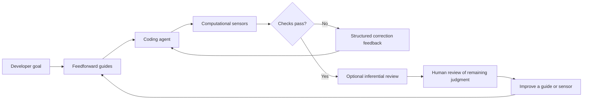
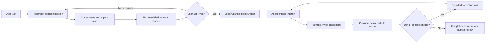
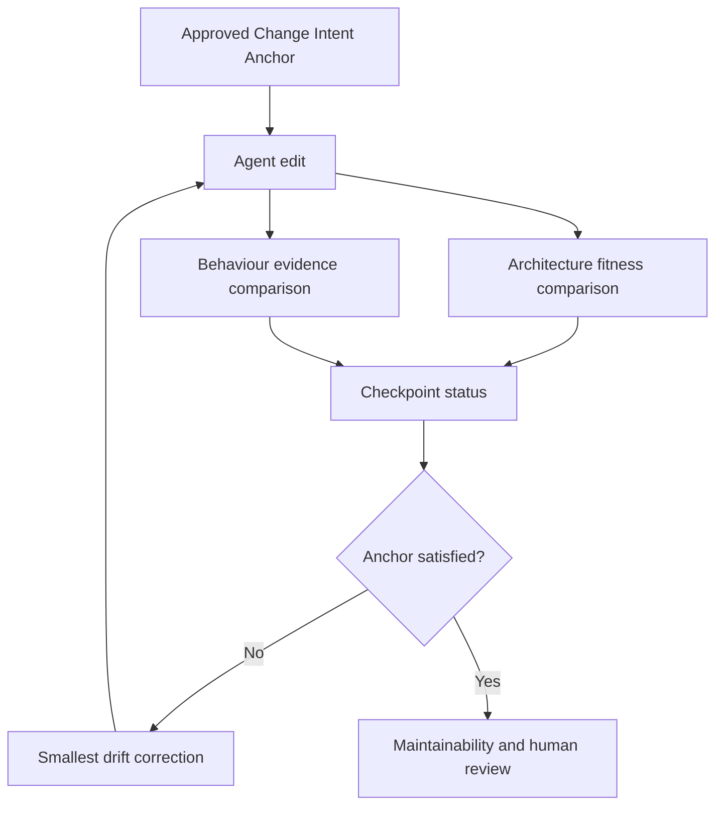
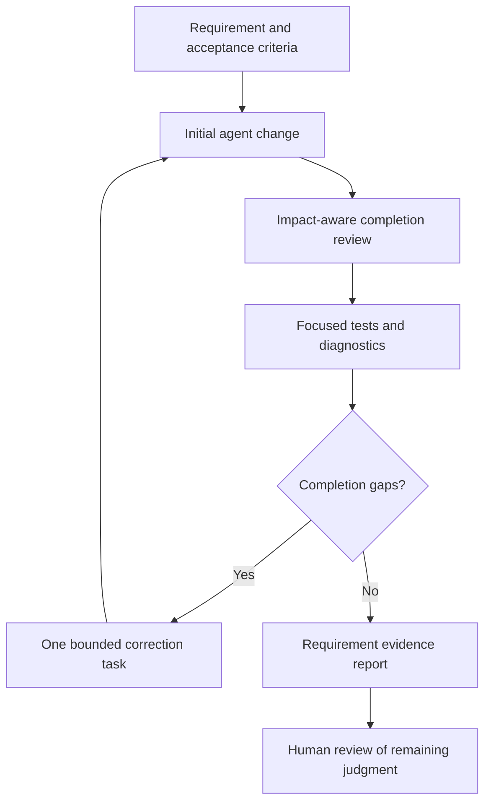

# TailTrail Harness Engineering

## Purpose

TailTrail's harness engineering work builds an outer quality harness around a
coding agent. It should increase the chance that an agent gets a change right on
the first attempt, then provide fast feedback that lets the agent correct issues
before they reach human review.

```text
TailTrail Harness = feedforward guides
                  + feedback sensors
                  + bounded self-correction loop
```

The harness is not a replacement for the coding model, developer judgment,
existing tests, CI, security review, or repository policy. It makes those
controls available to the agent at the right time and turns their results into
actionable feedback.

This design is informed by Birgitta Böckeler's
[Harness engineering for coding agent users](https://martinfowler.com/articles/harness-engineering.html).

## Outcome

A well-built harness should:

- improve first-pass agent quality with relevant rules, examples, tools, and
  acceptance checks before editing;
- catch deterministic problems quickly through local computational checks;
- present findings in a compact form an agent can use to self-correct;
- reserve human review for requirements and judgment automation cannot reliably
  decide; and
- improve its guides and sensors when the same failure happens repeatedly.

## Model



### Feedforward guides

Guides reduce the likelihood of a poor first implementation.

| Guide | TailTrail role |
| --- | --- |
| `AGENTS.md`, policy, skills, and guardrails | Explain repository rules, safeguards, conventions, and constraints. |
| Navigator plan | Turns a goal into a small, explicit plan and likely validation path. |
| Code Graph and context routing | Selects relevant source, callers, tests, and policy rather than loading an entire repository. |
| Test Precision | Identifies the smallest reliable checks before the agent edits. |
| Structural rules and harness templates | Define architecture boundaries, forbidden dependencies, and topology conventions. |

### Feedback sensors

Sensors observe the agent's change and report whether it is moving toward the
desired state.

| Sensor | Execution type | Feedback |
| --- | --- | --- |
| Focused tests | Computational | Failing test, expected/actual behavior, and relevant source and test paths. |
| Lint, format, type, and build checks | Computational | Rule ID, location, exact diagnostic, and next action. |
| AST and structural checks | Computational | Boundary violations, dependency drift, changed symbols, and affected tests. |
| Dependency and security checks | Computational | Exact component/finding, severity, and relevant policy gate. |
| TailTrail Review | Inferential | Requirement gaps, unnecessary complexity, weak validation, and missed project patterns. |
| Semantic/provider-backed analysis | Inferential or provider-backed | Advisory relationship evidence, explicitly labeled by source. |

## Computational first

| Execution type | Characteristics | Examples |
| --- | --- | --- |
| **Computational** | Deterministic, CPU-run, fast, and reliable enough for each relevant change. | Tests, linters, type checkers, builds, AST analysis, structural and architecture checks. |
| **Inferential** | Richer semantic judgment but slower, costlier, and non-deterministic. | Agent reasoning, AI code review, semantic analysis, LLM-as-judge. |

Computational controls should run first whenever they can answer the question.
They catch mechanical and structural problems without consuming model reasoning.
Inferential controls should then focus on requirements, overengineering,
trade-offs, and semantic intent.

## Correction loop

1. TailTrail selects applicable guides and computational sensors for the task.
2. The coding agent makes a small change.
3. TailTrail runs the smallest approved local checks.
4. TailTrail returns a compact correction packet with the exact command,
   affected path/symbol, evidence, failure reason, and next action.
5. The agent corrects the change and the selected checks run again.
6. The loop stops on pass, timeout, repeated failure, ambiguous output, scope
   expansion, or human escalation.
7. After fast checks pass, TailTrail Review can inspect semantic and
   requirement-level issues.

The loop must be bounded. TailTrail should never retry indefinitely or turn an
unrun, skipped, timed-out, or ambiguous control into a passing result.

## Change Intent Anchor

Drift awareness needs an anchor. Without an approved reference for the desired
result, a coding agent and a reviewer can only compare the latest diff with the
latest test output. That makes it easy to confuse "the suite is green" with
"the requested change is complete."

TailTrail should create a versioned, local **Change Intent Anchor** before
implementation. It is an approved contract connecting the current project
state, the desired project state, the allowed change boundary, and the evidence
required to demonstrate completion.

```text
Current state -> approved desired state -> observed result and evidence
```

The anchor is not a copy of the whole repository and should not be described as
only a cache. It is a small, reviewable change contract. Caching can make its
local representation fast to retrieve; the important property is that the user
approved the intent before an agent starts correcting toward it.



### Creating the anchor

For a small task, Navigator, Code Graph, Test Precision, local policy, and exact
source inspection should produce the first anchor proposal. For a broad, risky,
or ambiguous task, AIDLC can deepen requirement gathering before the proposal is
shown to the user. AIDLC is not required for every small fix; the anchor must be
small enough to remain useful.

The user approves the desired state, not an implementation recipe. The agent
may choose a different small implementation if it still reaches the approved
behavior and preserves the approved architectural boundaries and invariants.

| Anchor element | Purpose | Example for a claim-validation change |
| --- | --- | --- |
| Goal | Compact statement of intended outcome | Reject zero-dollar claims while keeping positive claims valid. |
| Current state | Relevant observed baseline, including known failures | `validate_claim_amount(0)` is currently accepted; service behavior relies on it. |
| Desired behavior | Observable outcomes that must become true | Zero rejected through validation and submission; positive amount still accepted. |
| Architecture expectations | Required path, boundaries, and places that must not be bypassed | Submission continues through service to shared validation; no controller-only workaround. |
| Impact boundary | Expected source, caller, test, config, and public-contract scope | Validation, service, and focused claim tests; no dependency/API/schema change. |
| Invariants | Behavior that must remain true | Preserve error type/response contract and existing positive-amount flow. |
| Evidence plan | Focused checks that can prove each outcome | Validation and service-path tests; configured type/lint checks if relevant. |
| Known unknowns | Decisions the agent must not invent | Whether service maps validation errors into a public response. |
| Approval fingerprint | Inputs that make this exact approval valid | Goal/requirements, policy version, baseline revision, relevant paths, and selected controls. |

### Example anchor

```yaml
anchor_version: 1
run_id: claim-zero-amount-001
goal: Reject zero-dollar claim amounts while keeping positive claim amounts valid.

current_state:
  - validate_claim_amount accepts 0
  - claim submission calls validate_claim through the service path

desired_state:
  behaviour:
    - Zero amount raises ClaimValidationError.
    - Positive amount remains accepted.
    - Submission flow preserves the validation failure contract.
  architecture:
    - Use the existing shared validation path.
    - Do not implement a controller-only or caller-specific special case.

expected_scope:
  source:
    - src/claims_api/validation.py
    - src/claims_api/service.py
  tests:
    - tests/test_claim_validation.py
    - tests/test_claim_service.py
  prohibited_without_reapproval:
    - public API change
    - dependency change
    - schema/data migration

evidence_plan:
  - focused validation test for zero and positive amounts
  - focused submission-path test
  - diff review for unrelated scope expansion

known_unknowns:
  - Confirm expected public error mapping if the service currently catches validation errors.
```

The human-facing view should be Markdown, concise, and approval-ready. The
machine-readable view should be sanitized JSON or YAML that supports stable
comparison throughout the correction loop.

### Desired state is not a frozen implementation

The anchor must not overconstrain good engineering. It should state outcomes,
invariants, and important boundaries, not prescribe exact line-by-line edits.

For example, the anchor can require that every claim submission uses shared
validation. It should not require a specific `if amount <= 0` expression if a
project's existing validation helper already provides the correct behavior.

This separation makes the anchor useful for both drift detection and reuse:

| Anchor says | Agent remains free to |
| --- | --- |
| Zero claims are rejected in all submission paths | Choose the smallest compatible validation implementation. |
| Shared validation path is preserved | Refactor within the validation layer when it reduces duplication. |
| Positive claims remain valid | Add the most focused regression coverage matching local test conventions. |
| No public API change without re-approval | Improve internal error handling without changing the external contract. |

### Checkpoints: detect drift during the loop

After each meaningful agent edit, TailTrail should create a **drift checkpoint**.
The checkpoint compares the actual diff, current source path, test results, and
review findings against the approved anchor. It should report explicit state and
reasons, not a single opaque "drift score."



Example checkpoint:

```text
Checkpoint 2 of 3

Anchor status: partially satisfied

Behaviour:
- Zero rejected by validation: validated
- Positive amount accepted: validated
- Submission preserves validation failure: failed

Architecture:
- Shared validation path: preserved
- Unexpected dependency or protected-path change: none

Drift:
- src/claims_api/service.py converts ClaimValidationError into a success result.

Next correction:
Preserve the validation error in the service path. Re-run the focused service
and validation tests. Do not expand into an API-contract change.
```

The checkpoint should separate these categories:

| Checkpoint category | Question | Typical response |
| --- | --- | --- |
| Requirement coverage | Is every approved outcome validated, failed, blocked, or awaiting a decision? | Correct the unmet outcome or ask the user a focused question. |
| Architecture fitness | Does the actual change preserve required paths and boundaries? | Move logic to the approved layer or request re-approval for a boundary change. |
| Behaviour evidence | Do tests and direct observations demonstrate the desired behavior and preserved invariants? | Add/run focused coverage or fix the behavior. |
| Scope drift | Did the diff move beyond the approved impact boundary? | Classify as required, regression, optional hardening, or unrelated; re-approve if material. |
| Evidence drift | Did a test change, skipped control, or weak assertion make proof less trustworthy? | Require a requirement-linked rationale or escalate. |

### Anchor invalidation and re-approval

An approval only applies to the precise desired state that was reviewed. TailTrail
must invalidate the anchor and request re-approval when a material input changes:

- the developer clarifies, narrows, or expands a requirement;
- a correction needs a new important source path, caller path, or test domain;
- the work changes a public API, security boundary, data model, schema, or
  dependency;
- project policy, an approved architectural rule, or a protected-path rule has
  changed since approval;
- a baseline failure previously considered unrelated is found to affect the
  requested behavior; or
- new evidence exposes two reasonable but incompatible interpretations of the
  desired behavior.

Minor implementation movement within an approved boundary should not force
re-approval. The point is to preserve developer control over material intent
changes, not to interrupt every normal correction.

Example invalidation:

```text
Anchor requires re-approval.

Reason: correction requires changing the public submission response contract.
The approved anchor preserved the existing error-response behavior.

New decision needed:
1. Return the validation error to callers as a client error.
2. Preserve the current response and narrow the requirement to internal validation.
```

### Local storage and privacy

The anchor should live with the local run as an approved/actual document pair:

```text
.tailtrail/runs/<run-id>/approved.md
.tailtrail/runs/<run-id>/actual.md
.tailtrail/runs/<run-id>/checkpoints/checkpoint-01.json
```

The stored form must be compact and privacy-preserving. It should retain exact
requirements, controlled paths, result summaries, approval state, and evidence
pointers. It should not automatically copy raw prompts, full source files,
secrets, customer data, or unredacted logs into durable learning or telemetry.

The approval fingerprint should include a stable baseline revision or diff
identity, applicable policy fingerprint, normalized requirement text, selected
paths, and selected controls. If these inputs materially change, TailTrail can
tell the developer exactly why the anchor is no longer valid.

### Approved and actual documents

`approved.md` is the human-approved desired-state anchor. `actual.md` is the
current observed state generated after an agent edit and its selected checks.
Together they combine the Change Intent Anchor and approved-scenario concepts:

```text
approved.md = what the project is approved to become
actual.md   = what the project currently does after this agent attempt
comparison  = where behavior, architecture, scope, or evidence has drifted
```

`approved.md` is not merely a test fixture. It may contain the goal, behavioral
scenarios, architecture expectations, invariants, expected scope, evidence plan,
known unknowns, and approval fingerprint. `actual.md` uses the same scenario
structure where possible, but records observed results, actual changed paths,
checks run, and unresolved gaps.

Example `approved.md`:

```md
# TailTrail Change Intent Anchor

## Goal

Reject zero-dollar claim amounts while keeping positive claim amounts valid.

## Approved behaviour

### Scenario: zero-dollar claim submission

**Input**

Claim amount: `0`

**Expected result**

Submission: rejected
Error type: `ClaimValidationError`
Message: `Claim amount must be greater than zero`

### Scenario: positive claim submission

**Input**

Claim amount: `100`

**Expected result**

Submission: accepted

## Architecture expectations

- Submission uses the existing service to shared-validation path.
- No controller-only special case.
- No public response-contract change without re-approval.

## Allowed scope

- `src/claims_api/validation.py`
- `src/claims_api/service.py`
- focused claim tests

## Required evidence

- Zero-value validation and submission scenarios pass.
- Positive-value regression scenario passes.
```

Example `actual.md` after an incomplete agent attempt:

```md
# TailTrail Actual State

## Scenario: zero-dollar claim submission

**Observed result**

Validation: rejected
Submission: accepted

## Scenario: positive claim submission

**Observed result**

Submission: accepted

## Architecture observation

- Shared validation rejects zero.
- Service converts the validation error into a success result.

## Evidence run

- Validation test: passed
- Positive-value test: passed
- Submission-path test: failed
```

The comparison report can then state the gap without requiring a reviewer to
read all test assertion code or an agent to reread the whole task history:

```text
Anchor status: partially satisfied

Behaviour drift:
- Approved: zero-dollar submission is rejected.
- Actual: zero-dollar submission is accepted.

Architecture drift:
- Approved: service preserves the shared-validation outcome.
- Actual: service converts the validation error to success.

Next correction:
Fix service error propagation. Do not change approved behavior or public API.
```

For a larger feature, the root `approved.md` can link to focused approved
scenarios, while `actual/` contains generated counterparts:

```text
.tailtrail/runs/<run-id>/
  approved.md
  scenarios/
    checkout.approved.md
    refund.approved.md
  actual.md
  actual/
    checkout.actual.md
    refund.actual.md
  comparison-report.md
```

Only a human can change an approved expected behavior. An agent may create a
proposal or regenerate `actual.md`, but it must never silently overwrite an
approved document. This prevents the scenario equivalent of test-chasing: an
agent cannot make a failing behavior check pass merely by rewriting the expected
output to match an incorrect implementation.

## Architecture Fitness Harness

The **Architecture Fitness Harness** compares the actual shape of a change to
the architectural expectations in the approved Change Intent Anchor. It answers:

> Did the agent achieve the desired behavior through the intended system path,
> while preserving the boundaries that make the project maintainable?

This matters because a change can appear to work in one test while being placed
in the wrong layer, bypassing shared validation, duplicating business logic, or
creating a forbidden dependency direction.

```text
Approved path:
request -> service -> shared validation -> domain error

Architecture drift:
request -> controller-only special case -> success response
```

The first path keeps the business rule reusable and consistent across callers.
The second may satisfy one local test while allowing other callers to bypass the
rule entirely.

### Architecture rules belong in the anchor

Architecture fitness is project-specific. TailTrail should not invent a universal
layering model. Instead, the user/team defines a small set of relevant rules in
policy, a harness template, or the anchor itself.

| Architecture expectation | Computational evidence | Example drift |
| --- | --- | --- |
| Layer direction | Import/call graph, AST rule, architecture test | Controller directly imports repository/database module. |
| Required business path | Call graph and focused integration test | Submission bypasses shared validation helper. |
| Forbidden dependency | Manifest/import diff and dependency gate | Small validation change adds a new validation package. |
| Protected boundary | Changed-path check and policy | Agent modifies auth, schema, or generated code without approval. |
| Module ownership | File structure, symbols, and local conventions | Domain logic is added to UI/controller instead of service/domain layer. |
| Public contract stability | API/schema diff and focused contract test | Error response shape changes unexpectedly. |

Architecture sensor output must name the boundary and the proof, not merely say
"architecture issue."

```text
Architecture drift: the zero-amount rule was added in the HTTP controller.

Anchor expectation:
All claim submissions use src/claims_api/validation.py through the service path.

Evidence:
- controller now checks amount == 0 directly
- service path remains unchanged
- another claim caller does not use the controller path

Required correction:
Move the rule to the shared validation path, then run the focused caller tests.
```

### Architecture fitness states

| State | Meaning | Next action |
| --- | --- | --- |
| `preserved` | Actual code follows approved boundaries and paths. | Continue behavior/completion review. |
| `drifted` | Actual code violates an approved boundary or bypasses a required path. | Issue bounded correction task. |
| `expanded-needs-approval` | A legitimate solution requires a new boundary, dependency, API, or data-model change. | Re-anchor and obtain approval. |
| `unknown` | Static evidence cannot establish the path or boundary. | Inspect exact source or run an approved focused check. |

Architecture fitness should begin with deterministic, explainable local signals:
changed paths, imports, AST relationships, known module rules, and focused
contract tests. Inferential review can then decide whether an unusual structure
is justified, but it should not replace direct source and structural evidence.

## Behaviour Harness

The **Behaviour Harness** compares the observed user- or system-visible behavior
to the desired behavior and invariants in the anchor. It answers:

> Does the system now do what the user requested across the relevant flows, and
> does it still preserve the behavior the change was not allowed to break?

It is the main defense against a change that passes a narrow unit test but fails
through a caller, adapter, serializer, API response, state transition, or edge
case that the agent missed.

### Behaviour contract

The desired-state behavior should be written as observable claims, not internal
implementation guesses. For the claims example:

```text
Requirement: zero-dollar claims are invalid.

Behaviour contract:
1. Direct amount validation rejects zero.
2. Claim submission also rejects zero.
3. Positive claims still succeed.
4. The expected validation error/response contract is preserved.
5. Unrelated claim flows retain their prior behavior.
```

TailTrail tracks the contract as a requirement-to-evidence matrix:

| Behaviour | Evidence | State |
| --- | --- | --- |
| Zero rejected by validator | Focused unit test passes | `validated` |
| Zero rejected by submission path | No service-path check has run | `implemented-not-validated` |
| Positive value accepted | Regression test passes | `validated` |
| Error response preserved | Service test shows success instead of expected error | `failed` |
| Unrelated claim flow unchanged | Pre-existing failure in another test | `blocked` or baseline issue |

The task cannot be marked complete merely because two rows are green. Every
required row must be `validated`, `not-applicable` with a reason, or explicitly
accepted as `blocked`/`needs-decision` by a human.

### Behaviour evidence hierarchy

Different requirements need different kinds of proof. TailTrail should state the
strength and limit of the evidence it has.

| Evidence type | Best for | Limitation |
| --- | --- | --- |
| Focused unit test | Local rules, edge cases, error types | May miss caller integration and public behavior. |
| Service/integration test | Cross-module flow and error propagation | May still miss deployment/runtime configuration. |
| Approved fixture or contract test | Stable API, serialization, event, or data-shape behavior | Requires a trusted fixture/contract. |
| Existing regression suite | Preserving nearby known behavior | May not cover the new requirement. |
| Manual verification | Ambiguous UX or externally visible behavior | Human evidence should be recorded as manual, not inferred. |

Tests generated or changed by the agent are evidence, not automatic truth. The
test-chasing protections in the Requirement Completion Harness apply to every
behavior row.

### Behaviour drift output

```text
Behaviour drift: requirement is only partially fulfilled.

Validated:
- validate_claim_amount rejects zero
- positive amount remains accepted

Missing/failed:
- claim submission returns success after ClaimValidationError

Anchor rule:
- zero-dollar claims must be rejected through every approved submission path

Next correction:
Repair error propagation in the service path. Do not alter the positive-amount
path or weaken the zero-value assertion. Re-run the two focused tests.
```

Behaviour harnessing is harder than maintainability or architecture fitness:
clear requirements and trusted tests are essential. When the desired behavior is
ambiguous, TailTrail must surface a decision rather than fabricate a test or
choose the easiest implementation path.

## Requirement Completion Harness

Fast computational feedback is necessary, but it is not the most difficult
agent-coding problem. Modern coding agents usually resolve syntax, formatting,
and straightforward type errors quickly. The harder failure mode is incomplete
requirement fulfillment across a real change path:

- a new rule changes the primary implementation but an important caller still
  assumes the old behavior;
- a test fails because the implementation is wrong, or because an existing test
  encodes behavior that the new requirement intentionally replaces;
- a fix for one failing test creates a regression in another flow; or
- the agent makes tests green by weakening an assertion rather than correcting
  the behavior.

For this class of work, TailTrail should provide a **Requirement Completion
Harness**. It sits after an initial implementation and before human review. Its
job is to determine whether the requested behavior is complete across impacted
code and tests, then give the agent the smallest useful correction task.



### The completion question

The completion harness does not ask only, "Are tests green?" It asks:

> For every requested outcome, what implementation path, caller behavior, test
> evidence, and unresolved decision show that this change is actually complete?

Every requirement should end in one of these explicit states:

| State | Meaning | Human action |
| --- | --- | --- |
| `validated` | Implementation and focused evidence support the requirement. | Review the result, not a missing proof. |
| `implemented-not-validated` | Code appears present, but no adequate focused evidence has run. | Run or approve the required check. |
| `failed` | A test, check, or direct observation contradicts the requirement. | Send one bounded correction task to the agent. |
| `needs-decision` | Requirement, expected behavior, or test expectation is ambiguous. | Make the decision; do not let the agent invent it. |
| `not-applicable` | Requirement does not apply to this path, with a recorded reason. | Confirm the reason during review. |
| `blocked` | A required environment, fixture, dependency, or permission prevents proof. | Resolve the blocker or accept explicit risk. |

Green tests are strong evidence, but they are not a complete requirement state
by themselves. A focused suite can be incomplete, an agent can update a test to
match incorrect logic, and some requirements depend on behavior in callers that
the selected test did not exercise.

### Requirement-to-evidence matrix

Before implementation, Navigator should transform the task into a small,
reviewable matrix. The matrix remains the completion harness's source of truth
after the agent edits code.

Example task:

> Reject zero-dollar claim amounts while keeping positive claim amounts valid.

| Requirement | Likely implementation path | Impacted caller or behavior | Required evidence | Completion state |
| --- | --- | --- | --- | --- |
| Zero amount is rejected | `validate_claim_amount` | `validate_claim` and claim submission | Zero-value test passes after the fix | Pending |
| Positive amount remains accepted | `validate_claim_amount` | Normal claim submission | Positive-value test passes | Pending |
| Error is preserved through the service | Validation/service path | Submission response | Focused service-path test or contract check | Pending |
| No unrelated behavior changes | Changed diff and existing suite | Nearby claims flows | Diff review and selected regression tests | Pending |

The matrix is deliberately small. It is not a speculative test plan for the
whole repository. Each row must tie directly to requested behavior, a meaningful
regression risk, or an explicit human decision.

### Impact-aware completion review

After the initial edit, the harness compares four local signals:

1. **Requirement matrix** - what had to become true.
2. **Actual diff** - which files, symbols, tests, and expectations changed.
3. **Impact map** - direct callers, validation paths, likely tests, and relevant
   contracts identified by Code Graph and exact source inspection.
4. **Focused evidence** - test, type, lint, build, structural, and review
   outcomes that actually ran.

This lets TailTrail ask useful completion questions:

| Observation | Completion interpretation | Next action |
| --- | --- | --- |
| Validation function changed but its main service caller was not inspected | Possible incomplete behavior path | Inspect the caller and run the focused service test. |
| A test fails after a rule change | Could be regression or obsolete expectation | Compare the assertion with the requirement before editing source or test. |
| Agent changed a test but not matching requirement evidence | Possible test-chasing | Require rationale and inspect whether production behavior is correct. |
| Tests pass but requested edge case is uncovered | `implemented-not-validated`, not complete | Add or select a focused edge-case test. |
| Several failures point to one shared helper | Root cause is probably shared | Repair the helper and rerun its direct callers/tests first. |
| Failure existed before the task and is unrelated to diff | Separate baseline issue | Record as pre-existing; do not absorb it without approval. |

### Bounded correction tasks

The harness should never give the agent an unstructured instruction such as
"Tests failed, fix everything." That invites broad edits, test-chasing, and
unnecessary token use.

Instead, it produces one bounded correction task at a time. A correction packet
contains the requirement, exact evidence, allowed scope, next action, and
focused validation command.

```text
Completion gap: service path still accepts a zero-dollar claim.

Requirement: zero-dollar amounts must be rejected while positive amounts remain valid.

Evidence:
- tests/test_claim_service.py:42 fails: expected ClaimValidationError
- src/claims_api/service.py:8 calls validate_claim but converts the error to success
- src/claims_api/validation.py already rejects amount <= 0

Allowed scope:
- src/claims_api/service.py
- tests/test_claim_service.py

Required next action:
Preserve the validation error in the service path. Do not change unrelated API
contracts or weaken the zero-value assertion.

Validation after correction:
python3 -m unittest tests.test_claim_service
python3 -m unittest tests.test_claim_validation
```

This packet gives the agent enough exact evidence to correct the next issue
without reloading unrelated repository history or guessing why the test failed.

### Classify failures before editing

When a logic change produces failing tests, TailTrail should classify the failure
before asking the agent to edit anything:

| Classification | What it means | Safe response |
| --- | --- | --- |
| `implementation-regression` | New code violates existing behavior that should remain true. | Fix production logic; preserve the existing test. |
| `required-expectation-change` | Test encodes behavior intentionally replaced by the new requirement. | Update the test with a requirement-linked explanation and cover the new behavior. |
| `incomplete-impact-change` | Direct change is correct, but a caller, adapter, serializer, config path, or related test was missed. | Fix the missing path and rerun the smallest related checks. |

If TailTrail cannot confidently classify a failure from requirement, source, and
test evidence, it must return `needs-decision`. This is safer than allowing the
agent to select the interpretation that makes the suite pass fastest.

### Test-chasing protection

Test changes deserve extra scrutiny during a correction loop because changing a
test can hide a defect. A test modification is allowed only when it is tied to an
explicit requirement change, a corrected invalid fixture, a documented
production contract, or newly required edge-case coverage.

For each changed test, the completion report should show:

| Test change | Requirement link | Production behavior checked | Review posture |
| --- | --- | --- | --- |
| Assertion changed from accept-zero to reject-zero | Zero amounts must be rejected | Validation and service response both reject zero | Review required |
| Added positive-amount regression case | Positive amounts remain valid | Validation and submission still accept positive amount | Focused evidence |

TailTrail should flag a test change as `needs-decision` when it only removes an
assertion, broadens accepted output, skips a failing case, or lacks a clear link
to the requested behavior.

### Stopping rules and human escalation

Completion loops must protect quality and developer time. Default stopping rules
should include:

- no more than two or three correction cycles for one requirement without a
  human review point;
- immediate escalation when a correction expands into a new feature, dependency,
  data migration, security boundary, public API change, or broad refactor;
- immediate escalation when test evidence and requirement text support competing
  interpretations;
- stop when a selected test/check times out, is unavailable, or has ambiguous
  output; report `blocked` rather than treating it as a pass; and
- stop when a failure is established as pre-existing and outside the approved
  task scope, unless the developer explicitly expands scope.

The human should receive a decision packet, not a raw pile of logs:

```text
Human decision needed: existing service test expects zero amounts to be accepted,
but the new requirement says they must be rejected.

Evidence:
- Product requirement: reject zero-dollar claims.
- Existing test: expects successful submission for zero.
- Current implementation: validation rejects zero; service behavior is undecided.

Decision options:
1. Treat the new requirement as authoritative and update the service contract/test.
2. Preserve service acceptance and narrow the requirement to direct validation only.
```

### Benefits and risks of review-phase completion harnessing

| Benefit | Why it matters |
| --- | --- |
| Less repeated prompting | Agent receives a precise next correction rather than repeated human instructions to rerun and fix tests. |
| Better multi-file completion | Code Graph and the matrix connect logic changes to callers, tests, and behavior paths. |
| More trustworthy green tests | Test changes are linked to requirements and inspected for test-chasing. |
| Lower human review toil | Review begins with completion evidence and unresolved decisions, not an unknown set of failures. |
| Better agent learning loop | Repeated gaps can become new guides, focused tests, or structural sensors. |

| Risk | Mitigation |
| --- | --- |
| Scope creep from continuously discovered related work | Classify findings as required, regression, optional hardening, or unrelated; only the first two stay in the loop by default. |
| Test-chasing | Require requirement-linked reasons for changed tests and inspect production behavior alongside assertions. |
| False completion from a green narrow suite | Use the requirement-to-evidence matrix and mark uncovered requirements `implemented-not-validated`. |
| Unbounded agent loops | Enforce correction-cycle limits and escalate to a concise human decision packet. |
| Wrong interpretation of an ambiguous requirement | Return `needs-decision`; do not let the agent choose the easiest interpretation. |
| Excess context and token use | Send only the requirement row, relevant diff, caller/test evidence, and next action in each correction packet. |

## Maintainability Harness

The **Maintainability Harness** is the first concrete TailTrail harness category.
It regulates whether an agent-generated change remains understandable,
consistent, safe to modify, and inexpensive to review after it lands.

It includes code standards and code quality, but it is broader than formatting or
linting. A formatter can identify whitespace drift and a linter can identify an
unused import. TailTrail should also ask whether a small bug fix became a broad
refactor, whether an existing helper was ignored, whether a new abstraction is
actually needed, and whether the tests still prove the requested behavior.

The maintainability question is:

> Will this change be easy for the next developer or agent to understand,
> validate, modify, and review without rediscovering its intent?

### What it regulates

| Area | What TailTrail should protect | Typical signals |
| --- | --- | --- |
| Readability | Clear names, focused functions, conventional error handling, direct control flow | Long or deeply nested functions, vague names, inconsistent error paths |
| Consistency | Reuse existing helpers, types, validation style, APIs, and local patterns | Duplicate helper, parallel implementation, incompatible naming or exception style |
| Complexity | Smallest maintainable solution; no speculative layers or configuration | New wrapper, abstraction, configuration flag, or broad rewrite for a small task |
| Test quality | Focused regression proof and meaningful assertions | Missing edge-case test, weakened assertion, skipped test, test changed only to turn green |
| Change hygiene | Scoped diff with no unrelated formatting churn or generated-file edits | Changed paths outside task scope, unrelated renames, large line count for a small fix |
| Dependency hygiene | Platform/native and existing capabilities before new packages | New dependency when an existing helper or standard-library path is sufficient |
| Documentation hygiene | Public feature changes update their command, registry, guide, and release notes | New command/script with no test, registry entry, or documentation |

### Three control levels

TailTrail should use three complementary levels instead of pretending every
maintainability problem is computable.

| Level | When it runs | Controls | Purpose |
| --- | --- | --- | --- |
| Computational baseline | Every relevant change | Focused tests, formatter/linter/type checks, diff scope, changed-test detection, simple complexity/duplicate/forbidden-import checks | Catch fast, deterministic mechanical and structural problems. |
| Local rule checks | When policy or repository conventions define a rule | Protected paths, dependency gate, module boundaries, no-unrelated-file rule, required docs/tests for a feature change | Enforce project-specific maintainability safeguards consistently. |
| Inferential maintainability review | After fast checks pass or on demand | Reuse-first analysis, abstraction necessity, requirement-linked test review, complexity and overengineering review | Exercise semantic judgment that tools cannot decide reliably. |

This ordering matters. Inferential review should not spend model reasoning on
formatting, obvious diagnostics, or checks the CPU can run in seconds. It should
focus on the questions with real judgment: whether the change is overbuilt,
whether a test is meaningful, and whether the chosen implementation matches the
repository's existing design.

### Example: more than a lint rule

Task:

> Reject zero-dollar claim amounts and add focused validation.

An agent changes `validation.py`, adds a new `ClaimAmountValidator` class,
duplicates existing exception handling, modifies three unrelated modules, and
updates a test assertion to pass.

The computational controls may report a green test suite. The Maintainability
Harness should still surface this review finding:

```text
Maintainability gap: the task is a targeted validation change, but the diff adds
a single-use validator abstraction and duplicates the existing validation error
path. Reuse validate_claim_amount and keep the change in the established
validation/service flow. The changed test needs a requirement-linked explanation
before it can be treated as evidence.
```

That is TailTrail's differentiated value: it turns generic code-quality signals
into a requirement- and repository-aware correction task.

### Maintainability correction packet

When the harness finds a maintainability issue, it should send a focused repair
task rather than a vague request to "clean up the code."

```text
Maintainability gap: duplicate validation helper introduced.

Evidence:
- src/claims_api/validation.py already exposes validate_claim_amount.
- src/claims_api/amount_validator.py duplicates the positive-amount rule.
- The requested change concerns zero-value validation only.

Required correction:
Reuse validate_claim_amount and remove the duplicate helper if it has no other
approved use. Keep existing error types and public behavior unchanged.

Focused validation:
python3 -m unittest tests.test_claim_validation
```

### Guardrails against false positives

Maintainability controls can become a noisy style gate if they are too broad.
TailTrail should report only high-value, evidence-backed findings:

- do not flag personal style preferences as defects;
- do not demand shorter code if it would weaken validation, readability, or a
  necessary business rule;
- do not require reuse when the existing helper is unsuitable for the new
  behavior; explain the mismatch instead;
- separate `required` findings from `optional hardening` and `style note` items;
- preserve exact diff, policy, test, and source evidence behind each finding;
- allow a project to opt out of a low-value rule without disabling unrelated
  safeguards; and
- measure false-positive rate and recurring review findings before promoting a
  rule to an always-on gate.

### Initial implementation focus

The first Maintainability Harness release should compose existing TailTrail
features instead of building a new monolithic reviewer:

1. Use Navigator, Code Graph, policy, and changed-path scope as feedforward
   guides.
2. Run existing focused tests and repository-configured lint/type/build commands
   as computational sensors.
3. Add deterministic diff checks for unexpected paths, changed tests, dependency
   manifests, and generated/protected files.
4. Run TailTrail Review with the task, compact diff summary, impacted callers,
   test changes, and computational findings.
5. Return only the highest-value correction task, then rerun focused checks.
6. Record repeated approved findings as candidates for a future policy rule,
   structural check, or harness template.

Success for this harness is not a larger number of comments. It is fewer
avoidable human review comments, smaller and more consistent agent diffs, and
clearer evidence that the requested change is maintainable.

## Planned implementation

### Phase 1 — Control contract and local fast checks

Define a machine-readable control contract describing trigger, command, timeout,
scope, result parser, severity, and whether a control is mandatory, advisory, or
approval-gated. Reuse repository-native tools; do not add dependencies merely to
fill out the framework.

Create the Change Intent Anchor in this phase. `harness plan` should propose the
current state, desired behavior, architecture expectations, impact boundary,
invariants, known unknowns, evidence plan, and approval fingerprint. It remains
read-only until the developer approves the desired state.

```bash
python3 scripts/tailtrail.py harness plan "fix validation bug" --changed src/service/foo.py
python3 scripts/tailtrail.py harness check --changed src/service/foo.py
python3 scripts/tailtrail.py harness feedback --run <run-id>
```

### Phase 2 — Structured feedback and bounded correction

Create an LLM-ready feedback packet from exact local findings. Support a bounded
agent correction cycle only through an explicitly approved and capability-aware
adapter.

Add the Requirement Completion Harness in this phase: build the
requirement-to-evidence matrix, compare it with the observed diff, caller/test
impact map, and actual check results, then issue one classified correction task
per gap. Require explicit treatment of changed tests so a green suite cannot be
created by weakening assertions without a requirement-linked reason.

Persist a drift checkpoint after each correction cycle. Compare actual code,
tests, architecture path, scope, and evidence to the approved anchor. Invalidate
the anchor and require re-approval when a material requirement, policy, path,
public contract, dependency, data-model, or security-boundary change appears.

```bash
python3 scripts/tailtrail.py harness steer <run-id> --adapter codex --max-cycles 2 --approved
```

### Phase 3 — Maintainability and architecture sensors

Build on Code Graph, guardrails, and project policy to add configurable checks
for prohibited imports, dependency direction, module boundaries, protected paths,
and repeated structural failure patterns. Add behavior-contract checks that map
each desired outcome to focused unit, service/integration, fixture/contract, or
manual evidence; distinguish a passing narrow test from full requirement proof.

### Phase 4 — Steering-loop improvement

When a finding recurs, TailTrail proposes a better guide, focused test,
structural rule, or result parser. Human approval is required before it changes
repository policy or control configuration.

## Expected files

| File | Planned responsibility |
| --- | --- |
| `scripts/harness-controls.py` | Select, run, time-bound, and normalize computational controls. |
| `scripts/harness-feedback.py` | Build compact correction packets from exact local evidence. |
| `scripts/change-intent-anchor.py` | Propose, validate, fingerprint, approve, invalidate, and compare the local current/desired-state contract. |
| `scripts/harness-checkpoint.py` | Persist and render requirement, architecture, scope, and evidence drift after each correction cycle. |
| `scripts/completion-review.py` | Compare requirements, diff, impact map, tests, and review evidence; classify gaps and emit bounded correction tasks. |
| `scripts/tailtrail.py` | Provide `harness plan`, `check`, `feedback`, and later `steer`. |
| `scripts/navigator_core.py`, `scripts/task-start.py` | Supply scope, policy, tests, graph, and validation recommendations. |
| `scripts/test-precision.py`, `scripts/ci-summary.py`, `scripts/quality-run.py` | Reused focused-test and local quality runners. |
| `scripts/guardrail-check.py`, `scripts/code-graph-mapper.py`, `scripts/review-run.py` | Structural sensors, policy evidence, and inferential review. |
| `schemas/harness-control.schema.json`, `schemas/harness-result.schema.json` | Versioned control and result contracts. |
| `schemas/change-intent-anchor.schema.json`, `schemas/harness-checkpoint.schema.json` | Versioned approved target-state, fingerprint, invalidation, and checkpoint contracts. |
| `schemas/requirement-evidence.schema.json` | Versioned requirement matrix, completion state, test-change rationale, and escalation contract. |
| `templates/harness-feedback.md`, `templates/harness-template.example.yml` | Feedback output and project-local template example. |
| `templates/change-intent-anchor.md`, `templates/harness-checkpoint.md` | Human-readable approved intent and per-cycle drift report. |
| `templates/completion-review.md` | Human- and agent-readable requirement completion report. |
| `tests/test_change_intent_anchor.py`, `tests/test_harness_checkpoint.py`, `tests/test_harness_controls.py`, `tests/test_harness_feedback.py`, `tests/test_completion_review.py` | Anchor approval/invalidation, checkpoint comparison, control selection, parsing, failure classification, test-chasing, and escalation tests. |

## Boundaries

- Prefer computational controls; inferential controls never replace source,
  tests, linters, type checks, or other deterministic evidence.
- Run only safe local commands allowed by project policy. Networked scanners,
  package installation, and destructive commands remain explicit approval paths.
- Do not create a background agent, daemon, hidden retry loop, or hidden
  telemetry service.
- Do not store raw prompts, source, secrets, PII, PHI, customer data, or
  unredacted logs in learning or outcome records.
- Do not claim defect prevention, review-time reduction, or token savings without
  measured evidence from real usage.

## Success criteria

- A task has visible selected guides and computational sensors before editing.
- Fast local checks produce precise `pass`, `fail`, `skipped`, or `blocked`
  results.
- Failed controls give an agent enough exact evidence to correct the issue
  without rereading unrelated repository content.
- Each requested outcome is tracked as `validated`, `failed`,
  `implemented-not-validated`, `needs-decision`, `not-applicable`, or `blocked`.
- Every correction checkpoint compares the actual change to a user-approved
  Change Intent Anchor and names requirement, architecture, behavior, scope, or
  evidence drift rather than emitting an opaque score.
- Material scope, policy, public-contract, dependency, data-model, or security
  changes invalidate the anchor and require re-approval.
- A changed test has a requirement-linked rationale and production-behavior
  evidence, or it is escalated for human review.
- Repeated failures escalate instead of producing unbounded correction loops.
- Human reviewers receive changes that have already passed relevant deterministic
  controls, plus a concise record of what was checked.
- Harness improvements are proposed from recurring evidence and remain
  human-approved, testable, and reversible.
