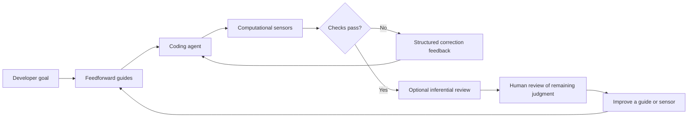

# TailTrail Harness Engineering

## Purpose

TailTrail's harness engineering work builds an outer quality harness around a
coding agent. It should increase the chance that an agent gets a change right on
the first attempt, then provide fast feedback that lets the agent correct issues
before they reach human review.

```text
TailTrail Harness = feedforward guides
                  + feedback sensors
                  + bounded self-correction loop
```

The harness is not a replacement for the coding model, developer judgment,
existing tests, CI, security review, or repository policy. It makes those
controls available to the agent at the right time and turns their results into
actionable feedback.

This design is informed by Birgitta Böckeler's
[Harness engineering for coding agent users](https://martinfowler.com/articles/harness-engineering.html).

## Outcome

A well-built harness should:

- improve first-pass agent quality with relevant rules, examples, tools, and
  acceptance checks before editing;
- catch deterministic problems quickly through local computational checks;
- present findings in a compact form an agent can use to self-correct;
- reserve human review for requirements and judgment automation cannot reliably
  decide; and
- improve its guides and sensors when the same failure happens repeatedly.

## Model



### Feedforward guides

Guides reduce the likelihood of a poor first implementation.

| Guide | TailTrail role |
| --- | --- |
| `AGENTS.md`, policy, skills, and guardrails | Explain repository rules, safeguards, conventions, and constraints. |
| Navigator plan | Turns a goal into a small, explicit plan and likely validation path. |
| Code Graph and context routing | Selects relevant source, callers, tests, and policy rather than loading an entire repository. |
| Test Precision | Identifies the smallest reliable checks before the agent edits. |
| Structural rules and harness templates | Define architecture boundaries, forbidden dependencies, and topology conventions. |

### Feedback sensors

Sensors observe the agent's change and report whether it is moving toward the
desired state.

| Sensor | Execution type | Feedback |
| --- | --- | --- |
| Focused tests | Computational | Failing test, expected/actual behavior, and relevant source and test paths. |
| Lint, format, type, and build checks | Computational | Rule ID, location, exact diagnostic, and next action. |
| AST and structural checks | Computational | Boundary violations, dependency drift, changed symbols, and affected tests. |
| Dependency and security checks | Computational | Exact component/finding, severity, and relevant policy gate. |
| TailTrail Review | Inferential | Requirement gaps, unnecessary complexity, weak validation, and missed project patterns. |
| Semantic/provider-backed analysis | Inferential or provider-backed | Advisory relationship evidence, explicitly labeled by source. |

## Computational first

| Execution type | Characteristics | Examples |
| --- | --- | --- |
| **Computational** | Deterministic, CPU-run, fast, and reliable enough for each relevant change. | Tests, linters, type checkers, builds, AST analysis, structural and architecture checks. |
| **Inferential** | Richer semantic judgment but slower, costlier, and non-deterministic. | Agent reasoning, AI code review, semantic analysis, LLM-as-judge. |

Computational controls should run first whenever they can answer the question.
They catch mechanical and structural problems without consuming model reasoning.
Inferential controls should then focus on requirements, overengineering,
trade-offs, and semantic intent.

## Correction loop

1. TailTrail selects applicable guides and computational sensors for the task.
2. The coding agent makes a small change.
3. TailTrail runs the smallest approved local checks.
4. TailTrail returns a compact correction packet with the exact command,
   affected path/symbol, evidence, failure reason, and next action.
5. The agent corrects the change and the selected checks run again.
6. The loop stops on pass, timeout, repeated failure, ambiguous output, scope
   expansion, or human escalation.
7. After fast checks pass, TailTrail Review can inspect semantic and
   requirement-level issues.

The loop must be bounded. TailTrail should never retry indefinitely or turn an
unrun, skipped, timed-out, or ambiguous control into a passing result.

## Planned implementation

### Phase 1 — Control contract and local fast checks

Define a machine-readable control contract describing trigger, command, timeout,
scope, result parser, severity, and whether a control is mandatory, advisory, or
approval-gated. Reuse repository-native tools; do not add dependencies merely to
fill out the framework.

```bash
python3 scripts/tailtrail.py harness plan "fix validation bug" --changed src/service/foo.py
python3 scripts/tailtrail.py harness check --changed src/service/foo.py
python3 scripts/tailtrail.py harness feedback --run <run-id>
```

### Phase 2 — Structured feedback and bounded correction

Create an LLM-ready feedback packet from exact local findings. Support a bounded
agent correction cycle only through an explicitly approved and capability-aware
adapter.

```bash
python3 scripts/tailtrail.py harness steer <run-id> --adapter codex --max-cycles 2 --approved
```

### Phase 3 — Maintainability and architecture sensors

Build on Code Graph, guardrails, and project policy to add configurable checks
for prohibited imports, dependency direction, module boundaries, protected paths,
and repeated structural failure patterns.

### Phase 4 — Steering-loop improvement

When a finding recurs, TailTrail proposes a better guide, focused test,
structural rule, or result parser. Human approval is required before it changes
repository policy or control configuration.

## Expected files

| File | Planned responsibility |
| --- | --- |
| `scripts/harness-controls.py` | Select, run, time-bound, and normalize computational controls. |
| `scripts/harness-feedback.py` | Build compact correction packets from exact local evidence. |
| `scripts/tailtrail.py` | Provide `harness plan`, `check`, `feedback`, and later `steer`. |
| `scripts/navigator_core.py`, `scripts/task-start.py` | Supply scope, policy, tests, graph, and validation recommendations. |
| `scripts/test-precision.py`, `scripts/ci-summary.py`, `scripts/quality-run.py` | Reused focused-test and local quality runners. |
| `scripts/guardrail-check.py`, `scripts/code-graph-mapper.py`, `scripts/review-run.py` | Structural sensors, policy evidence, and inferential review. |
| `schemas/harness-control.schema.json`, `schemas/harness-result.schema.json` | Versioned control and result contracts. |
| `templates/harness-feedback.md`, `templates/harness-template.example.yml` | Feedback output and project-local template example. |
| `tests/test_harness_controls.py`, `tests/test_harness_feedback.py` | Control selection, parsing, timeout, failure, and escalation tests. |

## Boundaries

- Prefer computational controls; inferential controls never replace source,
  tests, linters, type checks, or other deterministic evidence.
- Run only safe local commands allowed by project policy. Networked scanners,
  package installation, and destructive commands remain explicit approval paths.
- Do not create a background agent, daemon, hidden retry loop, or hidden
  telemetry service.
- Do not store raw prompts, source, secrets, PII, PHI, customer data, or
  unredacted logs in learning or outcome records.
- Do not claim defect prevention, review-time reduction, or token savings without
  measured evidence from real usage.

## Success criteria

- A task has visible selected guides and computational sensors before editing.
- Fast local checks produce precise `pass`, `fail`, `skipped`, or `blocked`
  results.
- Failed controls give an agent enough exact evidence to correct the issue
  without rereading unrelated repository content.
- Repeated failures escalate instead of producing unbounded correction loops.
- Human reviewers receive changes that have already passed relevant deterministic
  controls, plus a concise record of what was checked.
- Harness improvements are proposed from recurring evidence and remain
  human-approved, testable, and reversible.
