# TailTrail Harness Engineering

## Document status and reading guide

**Status:** design proposal. This document describes a future TailTrail harness;
it does not claim that the runtime, commands, schemas, adapters, or control loops
below already exist.

For the current testing assessment and the proposed unit-to-release-smoke
validation roadmap, see [Testing Confidence: Current State And Improvement
Plan](testing-confidence.md). That document is the source of truth for testing
tiers, validation contracts, environment evidence, and testing-runtime phases.

This document records the working decisions behind TailTrail Harness Engineering:

1. The hard agent-coding problem is not only syntax, lint, or type failures. It
   is proving that a multi-file change actually fulfills the requested behavior
   across callers, tests, and architectural boundaries.
2. Fast deterministic controls are important inputs, but the primary product
   value is a requirement-aware completion loop that reduces repeated human
   prompts such as "run it again and fix the next failure."
3. Drift awareness requires an approved anchor. TailTrail must compare each
   correction cycle against a user-approved desired state, not merely against
   the latest diff or a green test suite.
4. The anchor is represented by `approved.md`; the observed state of each agent
   attempt is represented by `actual.md`. Their comparison exposes behavior,
   architecture, scope, and evidence drift.
5. Maintainability, Architecture Fitness, and Behaviour are complementary
   harnesses. They should share one approved anchor and one correction loop,
   rather than become disconnected features.
6. Human judgment remains essential for ambiguous requirements, changed public
   contracts, design trade-offs, and approval of changed expected behavior.

### What exists today versus what this design proposes

TailTrail already has building blocks: Navigator planning, local policy and
guardrails, Code Graph impact hints, Test Precision, requirement-aware review,
quality/test command guidance, evaluation artifacts, and registry/governance
drift checks. Those features are useful inputs, but they are not yet one
persisted approved-anchor and correction-loop implementation.

| Capability | Current position | Proposed harness addition |
| --- | --- | --- |
| Task planning | Navigator can produce a scoped plan and likely impact. | Turn the approved plan into a versioned desired-state contract. |
| Requirements | Review can compare a diff with a compact goal. | Track every required outcome through explicit completion states across cycles. |
| Impact | Code Graph and Test Precision find likely callers/tests. | Compare actual changed paths and behavior against the approved impact boundary. |
| Validation | Tests, quality commands, and review are available separately. | Select controls, normalize results, and feed one bounded correction task to the agent. |
| Drift | Registry/governance drift checks protect TailTrail's own docs and feature inventory. | Add task-level requirement, architecture, behavior, scope, and evidence drift detection. |
| Agent control | Guidance files and commands influence an agent. | Keep the agent anchored without claiming a universal autonomous orchestration runtime. |

### Design decisions and rejected simplifications

| Decision | Reason |
| --- | --- |
| Do not make the harness primarily an approval workflow. | Approval is necessary, but it does not by itself tell whether a multi-file change is complete. |
| Do not make it only a fast lint/test wrapper. | Modern agents often repair simple diagnostics; the costly failures are incomplete logic, missed callers, and test/behavior mismatches. |
| Do not use one opaque drift score. | A score hides why work drifted. TailTrail must report requirement, architecture, behavior, scope, and evidence reasons separately. |
| Do not treat green tests as completion proof. | Tests may be narrow, missing, stale, or weakened by the agent. Requirements need linked evidence. |
| Do not let an agent overwrite expected behavior. | Silent updates to an approved fixture are behavior-level test-chasing. Only humans approve a changed desired state. |
| Do not cache the entire repository. | The anchor should be a compact, privacy-preserving contract and evidence index, not a raw source/prompt archive. |
| Do not create unbounded self-correction. | Correction loops must stop on pass, repeated failure, ambiguity, timeout, scope expansion, or human escalation. |

### Core vocabulary

| Term | Meaning |
| --- | --- |
| **Change Intent Anchor** | A user-approved local contract describing the relevant current state, desired state, boundaries, invariants, and required evidence. |
| **Approved state** | The desired behavior and architectural shape accepted by a human, stored in `approved.md`. |
| **Actual state** | The observed behavior, changed paths, control results, and unresolved gaps produced by the current agent attempt, stored in `actual.md`. |
| **Drift checkpoint** | A per-cycle comparison of actual state to approved state. |
| **Completion gap** | A requirement that is failed, blocked, ambiguous, or implemented without adequate evidence. |
| **Correction packet** | The smallest agent task that explains one gap, exact evidence, allowed scope, and next validation. |
| **Harness template** | A reusable set of guides, controls, scenario formats, and rules for a known project topology or technology stack. |

### End-to-end reference lifecycle

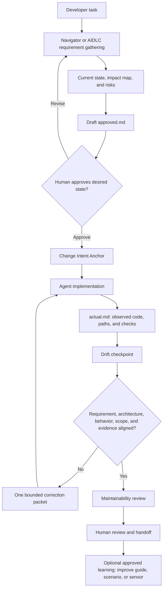
```mermaid
flowchart TB
    A[Developer task] --> B[Navigator or AIDLC requirement gathering]
    B --> C[Current state, impact map, and risks]
    C --> D[Draft approved.md]
    D --> E{Human approves desired state?}
    E -->|Revise| B
    E -->|Approve| F[Change Intent Anchor]
    F --> G[Agent implementation]
    G --> H[actual.md: observed code, paths, and checks]
    H --> I[Drift checkpoint]
    I --> J{Requirement, architecture, behavior, scope, and evidence aligned?}
    J -->|No| K[One bounded correction packet]
    K --> G
    J -->|Yes| L[Maintainability review]
    L --> M[Human review and handoff]
    M --> N[Optional approved learning: improve guide, scenario, or sensor]
```

## Navigator as Harness Router

Navigator should steer Harness Engineering; Harness Engineering should not replace
Navigator. Navigator decides whether a task needs no harness, a lightweight
anchor, a requirement-completion loop, or the full maintainability/architecture/
behaviour set. The harness then uses the selected anchor to evaluate the agent's
actual change and provide correction feedback.

```text
Navigator: What is the smallest harness level that makes this task trustworthy?
Harness:   Did the current change reach the approved desired state without drift?
```

The full harness must not run for every task. A typo, comment edit, formatting
change, or tiny configuration change with no behavior impact should retain the
normal lean TailTrail workflow. Requiring approval artifacts, scenarios, and
correction loops for such work would add friction and teach users to ignore the
harness.

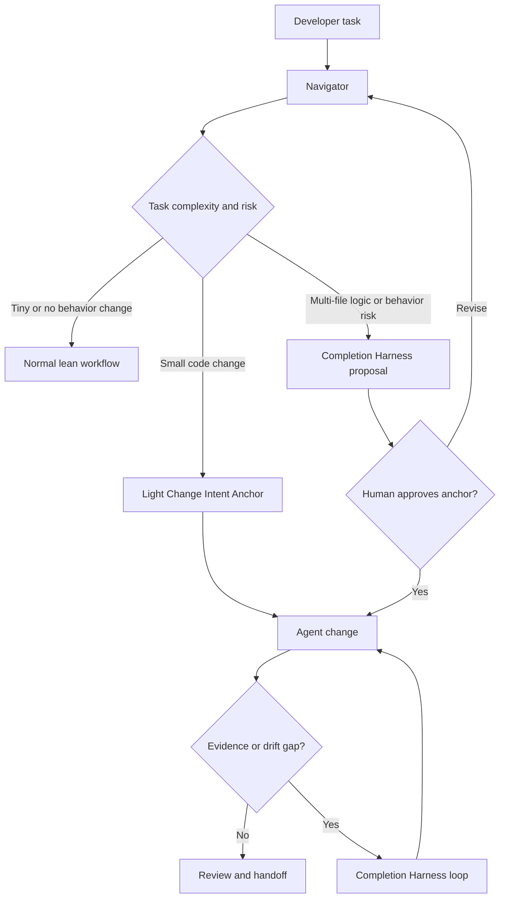
```mermaid
flowchart TB
    A[Developer task] --> B[Navigator]
    B --> C{Task complexity and risk}
    C -->|Tiny or no behavior change| D[Normal lean workflow]
    C -->|Small code change| E[Light Change Intent Anchor]
    C -->|Multi-file logic or behavior risk| F[Completion Harness proposal]
    E --> G[Agent change]
    F --> H{Human approves anchor?}
    H -->|Yes| G
    H -->|Revise| B
    G --> I{Evidence or drift gap?}
    I -->|No| J[Review and handoff]
    I -->|Yes| K[Completion Harness loop]
    K --> G
```

### Harness levels selected by Navigator

| Level | When Navigator selects it | What TailTrail creates | What it intentionally avoids |
| --- | --- | --- | --- |
| **No harness** | Documentation, comments, formatting, or a trivial non-behavioral configuration edit | Normal plan and proportional validation guidance | No anchor, scenario, or correction-loop state. |
| **Light Change Intent Anchor** | Small code fix with a clear requirement and one focused test path | Goal, one/two expected outcomes, changed-path boundary, focused evidence command | No multi-cycle correction loop unless a drift signal appears. |
| **Requirement Completion Harness** | Logic/validation/business-rule change, multiple files/callers, regression risk, tests likely to change | `approved.md`, `actual.md`, requirement matrix, focused evidence plan, bounded correction loop | No broad architecture template or expensive inference unless needed. |
| **Full three-lens harness** | Architecture boundary, Default behavior after implementationsecurity/data/API change, workflow/state-machine change, or risky multi-module work | Completion Harness plus Maintainability, Architecture Fitness, and Behaviour checks | No autonomous unlimited run; humans still approve material scope/intent changes. |
| **AIDLC-assisted harness** | Broad, ambiguous, regulated, multi-team, or long-running feature | AIDLC gathers/clarifies requirements before Navigator proposes the anchor | AIDLC is not added to small, well-scoped fixes. |

### Routing signals

Navigator should use explainable local signals rather than a hidden complexity
score. Any selected harness level must say why it was selected and which heavier
controls were intentionally skipped.

| Signal | Suggested routing implication |
| --- | --- |
| One known file, no behavior change, no affected caller/test | No harness or normal lean workflow. |
| Small code fix with a clear expected outcome and focused existing test | Light anchor. |
| More than one likely implementation file or important caller | Completion Harness. |
| Validation, business rule, state transition, or error-contract change | Completion Harness with Behaviour evidence. |
| Existing test failure or an expected test update | Completion Harness with failure classification and test-chasing protection. |
| Public API, schema/data model, dependency, auth/security, or architectural boundary | Full three-lens harness and explicit re-approval conditions. |
| Requirement says "all flows", "preserve", "do not break", or "regression" | Completion Harness because preserved behavior needs explicit evidence. |
| One failed agent correction attempt | Escalate the current run to a Completion Harness checkpoint. |

### Default behavior after implementation

For meaningful code changes, Navigator should default to a **light anchor**, not
a full correction loop. After the agent edits code, TailTrail evaluates the
available evidence:

| Post-change signal | Navigator handoff |
| --- | --- |
| Focused tests pass, approved paths were preserved, and no completion row is missing | Proceed to normal TailTrail Review and handoff. |
| Test/check fails | Enter the Requirement Completion Harness and produce one bounded correction packet. |
| Agent changes an unexpected path, dependency, protected file, API, schema, or security boundary | Mark scope/architecture drift; invalidate anchor when material and ask for re-approval. |
| Test change lacks a requirement link or weakens an assertion | Mark evidence drift and require review before treating it as proof. |
| Requirement row has no focused evidence | Mark `implemented-not-validated`; request/run the smallest adequate check. |

### Navigator requirement verification and impact proposal

Navigator is responsible for the **planning-side** of requirement verification:
it turns the request into an approval-ready, testable proposal. It is not the
final authority on whether implementation succeeded. The Requirement Completion
Harness and its checkpoints perform that comparison after code changes.

| Stage | Responsibility | Output posture |
| --- | --- | --- |
| Navigator | Decompose the request into atomic required and preserved outcomes; inspect likely symbols, callers, tests, policy, and protected paths; select proportional sensors. | Proposed / likely, with confidence and explicit unknowns. |
| Human approval | Confirm desired behavior, material scope, invariants, and acceptable evidence. | Approved desired state in `approved.md`. |
| Harness checkpoint | Resolve changed files/symbols again, execute selected controls, and compare actual work against the anchor and prior checkpoint. | Measured local evidence in checkpoint-specific `actual.md`. |
| Requirement Completion and Behaviour Harnesses | Verify that every approved outcome has adequate production-path and focused test/scenario evidence. | `validated`, gap state, or `needs-decision`; never an unsupported success claim. |
| Review | Assess justified discoveries, trade-offs, and residual uncertainty before handoff. | Human/inferential judgment, supported by the evidence record. |

Navigator must emit a **Requirement-to-Impact Matrix** before material edits.
This is the bridge between a natural-language request and the later completion
check. It becomes part of the proposed anchor and is frozen when the human
approves it.

| Requirement / preserve rule | Likely code path | Expected impact | Evidence plan | Confidence / unknown |
| --- | --- | --- | --- | --- |
| Reject a zero claim amount | `validate_claim_amount` -> `validate_claim` -> service caller | Validation, focused unit test, possibly service test | Invalid-zero unit case and submission-path check | High; caller path needs source confirmation |
| Preserve positive claims | Same validation and service path | Existing acceptance behavior must not regress | Positive-amount unit/service case | High |
| Do not add a dependency | Manifest and lockfile remain unchanged | No package/configuration changes | Changed-path/dependency sensor | High |

#### Requirement-to-Impact Matrix: required contract

The matrix is not a lightweight task checklist. It is the traceability contract
for one harness run: every approved requirement must identify what behavior
changes, what behavior is preserved, where that behavior is likely implemented,
and what proof would justify completion. A requirement without a row is not
approved for autonomous implementation; an implemented row without evidence is
not complete.

The human-readable Markdown matrix in `approved.md` and the normalized
`requirement-impact-matrix.json` must carry the same stable `requirement_id`.
The JSON is the machine contract; Markdown is the reviewable explanation. The
matrix is versioned with the anchor (`anchor-v1`, `anchor-v2` after material
re-approval) and must never be silently rewritten to make an actual result look
complete.

| Field | Required content | Why it is needed |
| --- | --- | --- |
| `requirement_id` | Stable ID such as `REQ-01`, never derived solely from row order | Links code, scenarios, evidence, corrections, and review across checkpoints. |
| `kind` | `change`, `preserve`, `constraint`, `safety`, or `decision` | Makes “keep existing behavior” as visible as new behavior. |
| `statement` | Atomic, observable outcome—not an implementation instruction | Allows a reviewer to judge completion independently of the chosen code shape. |
| `acceptance_criteria` | Inputs, outputs/errors, invariants, and relevant edge cases | Gives Behaviour Harness a concrete target. |
| `likely_implementation` | File, symbol, initial line range, fingerprint, and relationship type | Guides efficient inspection while preserving uncertainty. |
| `likely_callers_and_tests` | Important caller paths, existing tests, or missing-test hypothesis | Prevents a correct local edit that misses an integration path. |
| `expected_scope` | Expected files plus allowed discoveries and explicit non-goals | Supports scope drift and Task Recovery Boundary ownership checks. |
| `evidence_plan` | Required focused test/scenario/structural check and acceptable manual evidence | Prevents “tests passed” from being an undefined proof claim. |
| `confidence` and `unknowns` | `confirmed-by-local-source`, `likely`, or `unknown`, with explanation | Stops Navigator's inference being mistaken for fact. |
| `approval_state` | `proposed`, `approved`, `superseded`, or `needs-decision` | Controls when an agent may rely on a row. |
| `completion_state` | Checkpoint-owned state, never set by Navigator | Separates desired state from observed evidence. |

##### `kind` and `statement`: how to read a requirement row

`kind` and `statement` work together but serve different purposes:

| Field | Meaning | Example |
| --- | --- | --- |
| `kind` | The role this row plays in the approved contract. | `change`, `preserve`, `constraint`, `safety`, or `decision` |
| `statement` | The exact atomic outcome, rule, or question represented by that row. | “A claim amount of zero must raise the existing validation error.” |

`kind` tells TailTrail **how to interpret the row**. `statement` tells
TailTrail **what must be true**. A statement must describe an observable,
reviewable result, not an implementation suggestion. “Update `validation.py`”
is weak because the file can change while the required behavior remains wrong.
“A claim amount of zero must raise `ClaimValidationError`” is a testable result.

| Kind | Meaning | Claims example | Harness treatment |
| --- | --- | --- | --- |
| `change` | New or intentionally altered behavior. | “Zero-value claims are rejected.” | Prove changed production behavior and focused evidence. |
| `preserve` | Existing behavior that must continue working. | “Positive-value claims remain accepted.” | Require regression/prevention evidence, not only the new test. |
| `constraint` | Implementation boundary or non-functional rule. | “Do not add a dependency or duplicate the validator.” | Check diff, dependency, path, architecture, or review evidence. |
| `safety` | Safeguard that must not weaken. | “Invalid claims must not reach persistence.” | Require stronger flow evidence; escalate safety drift. |
| `decision` | Unresolved choice requiring human input before completion. | “Preserve old API error shape or introduce structured error?” | Do not guess; remain `needs-decision` until resolved. |

The `statement` should answer:

```text
What must be true after this work?
What existing behavior must remain true?
What can a test, source inspection, or reviewer observe?
```

Complete example:

| ID | Kind | Statement |
| --- | --- | --- |
| `REQ-01` | `change` | A claim amount of zero must raise the existing `ClaimValidationError`. |
| `REQ-02` | `preserve` | A positive claim amount must remain accepted through the existing validation and submission path. |
| `REQ-03` | `constraint` | The change must reuse the shared validation helper and must not introduce a second validator. |
| `REQ-04` | `safety` | A rejected claim must not be submitted to the persistence layer. |
| `DEC-01` | `decision` | Decide whether the API retains the existing validation-error format or introduces a new structured response. |

This distinction is essential for drift: a failed `change` is incomplete new
behavior; a failed `preserve` is regression; a failed `constraint` is
architecture/scope drift; a failed `safety` is safeguard drift; and an unresolved
`decision` requires a pause rather than agent guesswork.

#### Matrix lifecycle and ownership

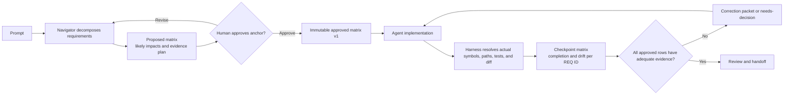
```mermaid
flowchart LR
    A[Prompt] --> B[Navigator decomposes requirements]
    B --> C[Proposed matrix\nlikely impacts and evidence plan]
    C --> D{Human approves anchor?}
    D -->|Revise| B
    D -->|Approve| E[Immutable approved matrix v1]
    E --> F[Agent implementation]
    F --> G[Harness resolves actual symbols, paths, tests, and diff]
    G --> H[Checkpoint matrix\ncompletion and drift per REQ ID]
    H --> I{All approved rows have adequate evidence?}
    I -->|No| J[Correction packet or needs-decision]
    J --> F
    I -->|Yes| K[Review and handoff]
```

Navigator owns only the **proposed** side of the matrix. After approval, the
approved requirement statement, preserve rules, and evidence standard are
immutable. The harness writes a separate checkpoint overlay keyed by
`requirement_id`; it records actual files/symbols, test receipts, drift, and
completion. A correction can update actual evidence, but cannot change a
requirement from “reject zero” to “accept zero” or remove a preserve rule. That
would be a material desired-state change and must produce an `anchor-v2`
proposal for human approval.

| Event | Matrix action | Approval needed? |
| --- | --- | --- |
| Navigator finds an additional likely caller before approval | Add it as a proposed impact with confidence and reason. | No, until the anchor is approved. |
| Agent discovers an in-scope helper after approval | Add as `justified-discovery` to the actual/checkpoint overlay. | No, if it does not change behavior, protected boundaries, or material scope. |
| Agent needs a new module, public API, dependency, schema, or security-path change | Mark `new-drift`; prepare revised matrix/anchor. | Yes, material re-approval. |
| Existing focused test does not cover a preserve rule | Mark `implemented-not-validated` or `needs-decision`; add an evidence gap. | No for a focused test; yes if expected behavior itself changes. |
| Test expectation must change | Create a proposed scenario/requirement revision. | Yes; never overwrite the approved row. |

#### Requirement identity and traceability

`requirement_id` is a readable anchor-local ID such as `REQ-01`. Every task may
begin with `REQ-01`, so it must not be the global key for recovery or evaluation.
At approval, TailTrail freezes the display ID and assigns an immutable
fully-qualified `requirement_uid`.

| Field | Example | Use |
| --- | --- | --- |
| `requirement_id` | `REQ-01` | Human-readable ID within one approved anchor. |
| `requirement_uid` | `tt://run-2026-07-23-claims-001/P-01/F-02/v1/REQ-01` | Global key for actual state, drift, patch ownership, recovery, and evaluation. |
| `requirement_type` | `behavior.validation.reject-invalid-value` | Cross-run evaluation category. |

```text
run_id:       run-2026-07-23-claims-001
program_id:   P-01
feature_id:   F-02
anchor:       v1
requirement:  REQ-01

requirement_uid:
tt://run-2026-07-23-claims-001/P-01/F-02/v1/REQ-01
```

An orders task can also use `REQ-01` without ambiguity:

```text
tt://run-2026-07-24-orders-004/P-01/F-01/v1/REQ-01
```

Navigator may propose provisional IDs, but identity becomes durable only when a
human approves the anchor. After approval, TailTrail never silently renames,
reuses, deletes, or redefines a requirement to make implementation look complete.

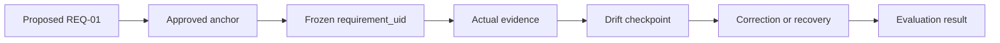
```mermaid
flowchart LR
    A["Proposed REQ-01"] --> B["Approved anchor"]
    B --> C["Frozen requirement_uid"]
    C --> D["Actual evidence"]
    D --> E["Drift checkpoint"]
    E --> F["Correction or recovery"]
    F --> G["Evaluation result"]
```

| Event | Rule |
| --- | --- |
| Missed caller/test or non-behavioral clarification | Keep UID and append evidence/history. |
| Split into independent outcomes | Mark original UID `superseded`; create UIDs with `derived_from`. |
| Material behavior change | Preserve old UID; create a new requirement under approved Anchor v2. |
| Approved removal | Mark `retired-by-approved-amendment`; never reuse the ID. |

##### Actual-state overlay

Every checkpoint attaches actual evidence using the same UID. It does not alter
the approved row:

```json
{
  "requirement_uid": "tt://run-2026-07-23-claims-001/P-01/F-01/v1/REQ-01",
  "requirement_id": "REQ-01",
  "status": "validated",
  "actual_files": ["src/claims_api/validation.py", "tests/test_claim_validation.py"],
  "actual_symbols": ["validate_claim_amount"],
  "evidence": [{"kind": "focused-test", "test": "test_rejects_zero_amount", "result": "pass", "receipt_ref": "controls/test-004.json"}]
}
```

An overlay can be `implemented-not-validated`, `failed`, `blocked`, or
`needs-decision`; it must not claim `validated` without the planned proof.

##### Drift, recovery, and Evaluation Harness linkage

Every drift record references one or more UIDs. A drift can affect several
requirements, and a requirement can have several drift events, so this is a
many-to-many relationship.

```json
{
  "drift_id": "DRIFT-014",
  "checkpoint_id": "F-02-checkpoint-003",
  "requirement_uids": ["tt://run-2026-07-23-claims-001/P-01/F-02/v1/REQ-01"],
  "state": "new-drift",
  "lens": "architecture",
  "reason": "API mapper bypasses the shared validation path.",
  "affected_files": ["src/claims_api/api.py", "src/claims_api/service.py"],
  "evidence_refs": ["checkpoints/F-02-checkpoint-003.json", "graph/graph-map-018.json", "controls/test-receipt-009.json"]
}
```

That produces an exact answer to “why did F-02 fail?”: `REQ-01` drifted because
the API path bypassed the approved validation route, with source, graph, and test
evidence.

Requirement identity informs recovery but is not recovery authority by itself.
In Mode A, the Task Recovery Boundary maps a requirement to its local Git
checkpoint/ref, validation receipt, and allowed active diff. In Mode B, it also
maps requirements to task-owned files, symbols, hunks, patches, and baseline
fingerprints. One requirement can affect many hunks and one hunk can support
several requirements.

```text
requirement_uid
  -> actual evidence
  -> Mode A: local requirement commit/ref + active diff receipt
  -> Mode B: file / symbol / task-owned hunk + baseline fingerprint
  -> recovery plan / recovery attempt
```

Recovery may plan “reverse verified task-owned changes linked to F-02 / REQ-01,”
but only if patch context and fingerprints match. This prevents overwriting Task
1's valid uncommitted work, later user edits, or another task's changes in the
same file.

Evaluation Harness uses `requirement_uid`, never only `REQ-01`:

```text
evaluation_run_id -> scenario_id -> program_run_id -> feature_id
  -> anchor_version -> requirement_uid -> checkpoint_id -> evidence/drift/outcome
```

It can learn across runs by `requirement_type` and tags. For example, claim,
order, and payment tasks may each have local `REQ-01`, while all share the type
`behavior.validation.reject-invalid-value`. The UID answers what happened to one
exact approved requirement; the normalized type supports safe aggregation.

Example amendment:

```text
F-02 v1 / REQ-01: API uses existing validation error contract.
F-02 v2 / REQ-03: API returns structured validation error response.

REQ-03 supersedes REQ-01 after human-approved public contract change.
```

The old UID remains visible with its historic actual/drift records, preserving
evaluation and recovery traceability while the revised program proceeds.

#### Impact references, lines, and resolution rules

Line numbers alone are too unstable to be a task boundary. Every impact record
uses a layered identity so TailTrail can preserve precise evidence without
pretending that line 21 will still be line 21 after a correction:

```text
impact reference =
  repository-relative file path
  + symbol identity (when available)
  + relationship (definition / caller / test / contract / config)
  + initial line span (human navigation only)
  + content or AST fingerprint (baseline identity)
  + confidence and discovery source
```

At each checkpoint, TailTrail resolves references in this order:

1. Match the repository-relative file path and baseline fingerprint.
2. Resolve the named symbol through local AST/code graph evidence.
3. Use nearby changed hunk context only when symbol resolution is unavailable.
4. Compare the actual diff and caller/test relationships to the approved
   requirement, expected scope, and previous checkpoint.
5. Record one of `confirmed`, `moved-but-confirmed`, `changed`, `missing`,
   `ambiguous`, or `new-discovery`—never silently substitute a nearby line.

If the file changed outside the task after the boundary, the Task Recovery
Boundary's ownership ledger decides whether a hunk is task-owned, later user
work, or ambiguous. The matrix may point to a file, but it never grants blanket
ownership of the whole file.

#### Worked multi-file example

For “reject zero claim amounts, preserve valid submissions, and add focused
validation,” Navigator should produce something at least this detailed before
implementation:

| ID | Kind and approved outcome | Likely impact and scope | Required proof | Initial confidence |
| --- | --- | --- | --- | --- |
| `REQ-01` | **Change:** amount `0` raises the existing validation error. | `src/claims_api/validation.py`, `validate_claim_amount`; allowed discovery: higher-level validation caller. | Focused zero-amount test asserts the existing error type/message contract. | Confirmed by local source for validator; caller likely. |
| `REQ-02` | **Preserve:** positive amount still passes the same validation route. | Validator plus `validate_claim` and its submission/service caller; do not create a parallel validator. | Existing or added positive-case unit test and one caller-path/service check. | Validator confirmed; service relation likely. |
| `REQ-03` | **Constraint:** use the existing error type and validation style. | Only existing claims validation/test paths; no new helper/module unless justified. | Diff/symbol scope check and source review. | Confirmed by local source. |
| `REQ-04` | **Constraint:** do not add a dependency or alter configuration. | Dependency manifests, lockfiles, CI/configuration are outside expected scope. | Changed-path and manifest sensor report no changes. | Confirmed. |

After the first agent attempt, a checkpoint could record:

| ID | Actual implementation/evidence | Completion | Drift decision |
| --- | --- | --- | --- |
| `REQ-01` | Validator comparison changed; zero-amount focused test passes. | `validated` | None. |
| `REQ-02` | Positive test passes, but no service-path check was executed. | `implemented-not-validated` | Issue one correction/evidence packet, not a completion claim. |
| `REQ-03` | Existing error type reused; no duplicate helper. | `validated` | None. |
| `REQ-04` | No manifest/configuration paths changed. | `validated` | None. |

The next packet is therefore precise: prove `REQ-02` through the expected
service path or explain, with local evidence, why that path cannot be affected.
It does not ask the agent to reread the entire project or modify unrelated
files.

#### Matrix validation rules

Before accepting an anchor, TailTrail should reject or flag a matrix when:

- a requirement bundles several independently testable outcomes into one row;
- a changed behavior has no preserve rule for an obvious existing contract;
- an expected code path has no source, caller, test, or explicit `unknown`
  evidence pointer;
- a requirement has no evidence plan, or its only proof is a vague “run all
  tests” instruction;
- an expected test change has no requirement ID and approved reason;
- a protected path, dependency, public contract, data schema, or security
  boundary is named without its material approval gate; or
- a row uses an implementation preference (“add a helper”) as the only
  acceptance criterion instead of the observable outcome it must support.

These rules keep the matrix practical. It should be as small as the task allows,
but detailed enough that a failed completion loop identifies the missing
requirement, impacted path, evidence, and next safe action without asking a
human to reconstruct the task from the entire conversation.

Accordingly, a Navigator impact is labelled `likely`,
`confirmed-by-local-source`, or `unknown`, while the checkpoint records the
actual changed lines, symbols, files, and evidence state. Prediction and proof
remain deliberately separate.

Navigator needs these implementation capabilities to create that proposal:

1. Requirement decomposition, including explicit preserved behavior and
   acceptance evidence.
2. Local impact discovery through repository search, Code Graph/AST evidence,
   relevant callers, tests, configuration, and project policy.
3. Confidence and ambiguity classification, with AIDLC routing only when the
   request is broad, risky, or genuinely unclear.
4. Scope proposal: expected paths, allowed discoveries, protected paths, and
   task ownership candidates.
5. Guide and computational-sensor selection, including an explanation of heavy
   controls intentionally skipped.
6. Anchor drafting and approval-fingerprint creation; after approval it triggers
   the Task Recovery Boundary before an execution agent writes source.

Navigator must remain a router and anchor proposer. It may invoke read-only
mapping tools, but it does not own the correction loop, mutate the approved
state, or declare requirements complete merely because its impact prediction
looked plausible.

### Navigator Feature Auto-Selection and Guided Delivery

The command surface must not require a developer to understand every TailTrail
harness before beginning ordinary work. `tailtrail start` is therefore the
**feature-selection entry point**: Navigator identifies task/scope/risk facts;
Start converts those facts into the smallest approval-ready delivery sequence.
This is routing, not an implementation agent or a background orchestrator.

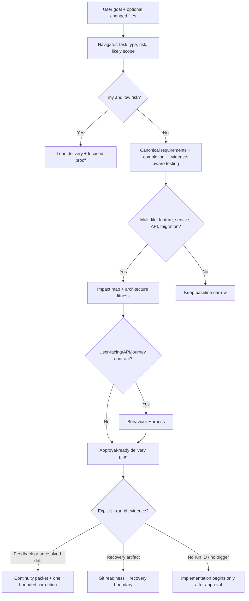
```mermaid
flowchart TB
    A["User goal + optional changed files"] --> B["Navigator: task type, risk, likely scope"]
    B --> C{"Tiny and low risk?"}
    C -->|"Yes"| D["Lean delivery + focused proof"]
    C -->|"No"| E["Canonical requirements + completion + evidence-aware testing"]
    E --> F{"Multi-file, feature, service, API, migration?"}
    F -->|"Yes"| G["Impact map + architecture fitness"]
    F -->|"No"| H["Keep baseline narrow"]
    G --> I{"User-facing/API/journey contract?"}
    I -->|"Yes"| J["Behaviour Harness"]
    I -->|"No"| K["Approval-ready delivery plan"]
    J --> K
    K --> L{"Explicit --run-id evidence?"}
    L -->|"Feedback or unresolved drift"| M["Continuity packet + one bounded correction"]
    L -->|"Recovery artifact"| N["Git readiness + recovery boundary"]
    L -->|"No run ID / no trigger"| O["Implementation begins only after approval"]
```

#### Selection contract

| Input signal | Select now | Defer until trigger | Reason |
| --- | --- | --- | --- |
| Tiny low-risk task | Lean delivery, exact target, focused proof | All broad controls | Small work must stay small. |
| Normal code task | Canonical requirements, Requirement Completion Harness, Evidence-Aware Testing | Architecture/behaviour unless scope requires them | Every non-trivial change needs an approved outcome and proof. |
| Multiple `--changed` paths or feature/service/API/migration wording | Requirement-to-Impact Map, Architecture Fitness | Recovery unless evidence requires it | Callers and layer boundaries are likely relevant. |
| UI/API/workflow/user journey wording | Behaviour Harness | Higher-tier environment proof unless evidence profile selects it | A passing unit test is not sufficient flow evidence. |
| Refactor wording | Maintainability Harness | Behaviour unless behavior changes | Detects abstraction/duplication/scope drift. |
| `hands-free` / `end-to-end` wording | Program Delivery Harness | Per-feature recovery/continuity unless triggered | Broad work needs feature sequencing and resume state. |
| Explicit `--run-id` with feedback or `unchanged`, `regressed`, `new-drift`, or `needs-decision` checkpoint | Context Continuity Harness, one Bounded Correction | More corrections after the budget/evidence gate | Prevents repeating the last incomplete approach. |
| Explicit `--run-id` with recovery plan/reconciliation artifact | Git Readiness / Task Recovery Boundary | Selective recovery execution until approved | Preserves active-task ownership and unrelated developer work. |

`--run-id` is intentionally required for run-state escalation. Auto-discovering
the newest failed run could attach another task's feedback, drift, or recovery
boundary to the user’s current request. The router therefore reports
`not-requested` without the flag, `missing` for an unknown run, or `found` with
exact local evidence pointers for a matching run.

#### Runtime implementation boundary

`scripts/task-start.py` owns the deterministic selection table and exposes it
as `guided_delivery` in the Markdown/JSON Start report. It reads only the named
run's compact feedback, checkpoint, and recovery artifact paths. It does not
render a continuity packet, apply a correction, initialize Git recovery, edit
source, run tests, invoke a model, or claim completion. Those actions remain
separate approved steps owned by the relevant harness/host agent.

The Start report must show four things compactly: selected controls and why;
later-only controls and their exact triggers; run-evidence status/pointers; and
the explicit approval sentence. This lets a developer challenge an overly heavy
route before code changes begin, while removing the need to memorize every
individual TailTrail command.

### Navigator Requirement Discovery and Approval Protocol

Navigator must not treat a rejected requirement proposal as permission to guess
again. A rejection is a requirement-gathering event. Before an anchor exists,
TailTrail records **requirement-discovery evolution** or a **proposal delta**;
it is not implementation drift because no approved intent or code execution yet
exists.

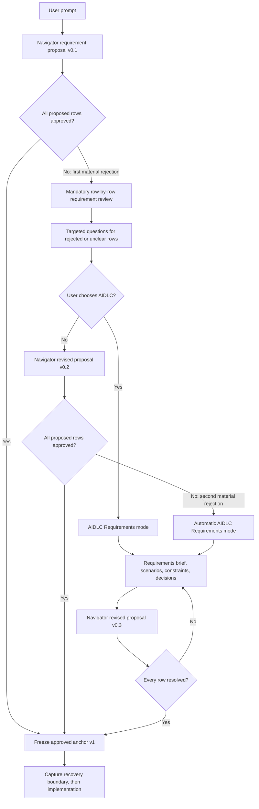
```mermaid
flowchart TB
    A["User prompt"] --> B["Navigator requirement proposal v0.1"]
    B --> C{"All proposed rows approved?"}
    C -->|"Yes"| D["Freeze approved anchor v1"]
    C -->|"No: first material rejection"| E["Mandatory row-by-row requirement review"]
    E --> F["Targeted questions for rejected or unclear rows"]
    F --> G{"User chooses AIDLC?"}
    G -->|"Yes"| H["AIDLC Requirements mode"]
    G -->|"No"| I["Navigator revised proposal v0.2"]
    I --> J{"All proposed rows approved?"}
    J -->|"Yes"| D
    J -->|"No: second material rejection"| K["Automatic AIDLC Requirements mode"]
    H --> L["Requirements brief, scenarios, constraints, decisions"]
    K --> L
    L --> M["Navigator revised proposal v0.3"]
    M --> N{"Every row resolved?"}
    N -->|"Yes"| D
    N -->|"No"| L
    D --> O["Capture recovery boundary, then implementation"]
```

#### Mandatory requirement-by-requirement review

On a material rejection, Navigator presents every proposed requirement for an
explicit disposition. A missing answer is not approval and must remain visible
as unresolved. Navigator must not infer that silence means agreement.

| Disposition | Meaning | Comment rule |
| --- | --- | --- |
| `approved` | User accepts the requirement as written. | A simple yes is sufficient. |
| `revise` | Relevant requirement, but behavior, scope, proof, or wording is wrong. | Comment required. |
| `rejected` | Requirement does not belong in this task. | Comment required. |
| `deferred` | Valid work, intentionally not part of this delivery. | Comment required. |
| `needs-decision` | User cannot approve without options or more context. | Question/comment required. |
| `not-reviewed` | No explicit response yet. | Navigator must ask; implementation is blocked for this row. |

Example review:

```text
P-REQ-01 — Reject zero claim amount
Disposition: approved

P-REQ-02 — Add a new API validation error response
Disposition: revise
Comment: Preserve the existing API error response; do not change the public contract.

P-REQ-03 — Persist valid claims
Disposition: rejected
Comment: Persistence is out of scope for this task.

P-REQ-04 — Preserve positive claim acceptance
Disposition: not-reviewed
Navigator action: ask for explicit approval or feedback.
```

For each `revise`, `rejected`, `deferred`, or `needs-decision` row without an
adequate comment, Navigator asks a focused follow-up. It may not invent the
reason for the rejection.

#### First rejection: targeted questions and optional AIDLC

After the row review, Navigator asks only questions required to resolve the
unclear rows. It should not re-interview the user about requirements already
approved.

```text
You revised P-REQ-02 because the API contract must remain unchanged.

Question:
Should this task:
A. preserve the existing API error format exactly, or
B. keep API behavior out of scope and change domain validation only?
```

Navigator also offers an explicit early escalation:

```text
The proposal has unresolved requirements.
Would you like to switch to AIDLC Requirements mode for structured gathering?
```

The developer can choose AIDLC after the first material rejection when the task
is broad, cross-team, regulated, behavior-heavy, or difficult to explain.

#### Second material rejection: automatic minimal AIDLC escalation

If a revised proposal is materially rejected a second time, Navigator enters
**AIDLC Requirements mode** automatically. This is not permission to start the
entire heavyweight lifecycle. The minimum AIDLC slice gathers only what ordinary
planning failed to establish:

```text
goal and stakeholders
-> behavior and preserve rules
-> constraints and non-goals
-> unresolved decisions
-> acceptance scenarios
-> dependency and risk assessment
-> revised Navigator proposal
```

The escalation threshold is a **material** rejection: rejected requirement
model, several rejected/revised rows, a user statement that Navigator
misunderstood the task, or unresolved coupled requirements. A typo, wording-only
correction, or one small clarification does not count toward automatic AIDLC.

#### Proposal history, deltas, and quality checks

Navigator must preserve rejected proposals and feedback. It must not overwrite a
draft `approved.md` and lose the reason the requirement model changed.

```text
proposal-v0.1
  -> user rejection and row feedback
  -> proposal-v0.2
  -> second material rejection and row feedback
  -> AIDLC requirements brief
  -> proposal-v0.3
  -> approved-v1
```

Suggested local discovery artifacts:

```text
.tailtrail/runs/<run-id>/discovery/
  proposal-v0.1.md
  proposal-v0.1.json
  requirement-feedback-v0.1.json
  proposal-delta-v0.1-to-v0.2.md
  proposal-v0.2.md
  requirement-feedback-v0.2.json
  aidlc-requirements-brief.md
  proposal-v0.3.md
  approval-decision.md
```

The delta records previous/revised version, user feedback, added/removed/modified
requirements, unresolved decisions, confidence changes, and source/evidence
references. It prevents later evaluation from treating intentionally rejected or
deferred work as an implementation omission.

Example:

```text
Proposal delta v0.1 -> v0.2

User feedback:
- Do not change API response yet.
- Existing service behavior must be preserved.
- Persistence is out of scope.

Removed:
- Persist valid claims.

Changed:
- “Add API validation error response” became
  “Preserve existing API and service error behavior.”

Added:
- Focused service-path proof for preserved error behavior.
```

Before presenting a revision for approval, Navigator performs a requirement
proposal quality check:

| Check | Question |
| --- | --- |
| Coverage | Is every meaningful prompt item represented as a requirement, preserve rule, constraint, non-goal, or decision? |
| Atomicity | Can each row be tested or judged independently? |
| No overlap | Are two rows requesting the same outcome? |
| Preservation | Did Navigator identify behavior that must not regress? |
| Scope clarity | Are exclusions and deferred work explicit? |
| Evidence plan | Does each change/preserve/safety row have proportional proof? |
| Ambiguity | Are unknown choices marked as `decision` instead of guessed? |
| Feasibility | Does the plan respect policy, protected paths, dependencies, and likely architecture? |
| Traceability | Can each final row be traced to prompt text, user feedback, or local evidence? |

Navigator renders a compact result, for example:

```text
Proposal quality: ready for approval

Coverage:
- 3 requested outcomes represented
- 2 preserve rules added
- 1 out-of-scope item recorded
- 0 unresolved decisions

Changes since v0.1:
- Removed persistence work per user feedback
- Added service behavior preservation
- Narrowed API work to existing error contract
```

#### AIDLC preservation and final implementation gate

AIDLC Requirements mode receives the rejected assumptions, accepted rows,
feedback, non-goals, and unresolved decisions. It must not overwrite prior
proposals:

```text
Rejected assumptions:
- API response must not change.
- Persistence is out of scope.

Accepted requirements carried forward:
- Reject zero amount.
- Preserve positive amount acceptance.

Unresolved:
- Whether service-level validation evidence is required.

New requirement discovered:
- Existing service error behavior must remain unchanged.
```

For a broad program, independent features can be approved separately only when
their boundaries do not depend on unresolved decisions. For example, F-01
validation may begin while F-02 API contract remains blocked; F-03 persistence
may be explicitly deferred. Navigator must report those states rather than
pretend the full program is approved.

Implementation begins only when each relevant row is one of:

```text
approved
or explicitly deferred/rejected with recorded reason
or resolved by an approved AIDLC decision record
```

`not-reviewed`, unanswered `revise` feedback, and unresolved `needs-decision`
rows block their feature boundary. Only after this gate does TailTrail create the
durable `approved-v1`/`requirement_uid` artifacts and capture a Task Recovery
Boundary before implementation.

### Navigator Reuse, Dependency, and Implementation-Strategy Checklist

Before Navigator proposes feature requirements, dependencies, or implementation
layout, it must establish whether the repository already contains the correct
path to reuse. Reuse-first behavior is a planning requirement, not a generic
coding preference applied only after the agent begins editing.

| Check | Navigator must determine |
| --- | --- |
| Existing behavior | Which current user flow, API/error contract, data path, and safeguard already solve part of the goal? |
| Reusable code | Which helpers, services, types, validators, components, utilities, error types, and test fixtures already fit? |
| Caller impact | Which callers, consumers, endpoints, jobs, UI paths, and tests depend on the reusable path? |
| Existing conventions | Which naming, error, validation, logging, authorization, persistence, and test patterns must be followed? |
| Native capability | Can the language, framework, database, or installed dependency solve this without new code/package? |
| Dependency posture | Is a new dependency genuinely required? If yes, mark Dependency Gate and material approval before planning. |
| New abstraction need | Is a helper/module/interface required now, or speculative/single-use complexity? |
| Scope boundary | Which files are expected, which existing paths must be reused, and which new files are prohibited unless justified? |
| Preserve rules | Which existing behavior must remain true when the reusable path changes? |
| Proof | Which focused tests prove reuse was correct and callers were not bypassed? |

Navigator follows this decision order and records why it moves past any earlier
option:

```text
1. Existing repository helper / service / type / component
2. Existing framework or platform capability
3. Existing installed dependency
4. Standard library / language-native implementation
5. Small direct implementation
6. New reusable abstraction
7. New dependency
```

New modules, helpers, abstractions, or dependencies are not rejected by default.
A proposal must state why an existing path is unsuitable. “It is cleaner” or
“it may be useful later” is insufficient evidence for a new abstraction.

#### Reuse and Dependency Decision Log

The Requirement-to-Impact Matrix remains focused on observable requirements.
Navigator records reuse, dependency, and implementation strategy in a
feature-level decision log beside the matrix.

```text
Feature: F-01 Claim amount validation

Reuse candidates checked:
- validate_claim_amount: suitable; reuse required.
- ClaimValidationError: suitable; reuse required.
- Existing claim validation tests: suitable; extend focused cases.
- Third-party validation package: not needed.

Decision:
- Change the existing shared validator.
- Do not add a helper, module, or dependency.
- Service/API callers must continue through the shared path.

Rejected alternatives:
- Controller-only validation: bypasses shared domain validation.
- New amount-validator module: duplicates existing helper.
- New validation package: existing implementation is sufficient.
```

The log identifies evidence source, confidence, callers/tests, rejected
alternatives, Dependency Gate status, and the smallest expected scope.

#### Requirement and dependency example

```text
REQ-01
Kind: change
Statement: Zero claim amount must raise existing ClaimValidationError.

Reuse requirement:
- Reuse validate_claim_amount and ClaimValidationError.

Architecture rule:
- Service/API must continue using validate_claim; do not add a parallel path.

Dependency posture:
- No dependency or configuration change allowed.

Proof:
- Zero-value unit test.
- Positive-value preserve test.
- Service-path test.
```

Feature dependency declarations explain *why*, not only order:

```text
F-02 API workflow depends on F-01 validation because:
- API must use the approved shared validation contract.
- API error mapping depends on the validation error type remaining stable.
- API tests cannot prove the final path until F-01 behavior is approved.
```

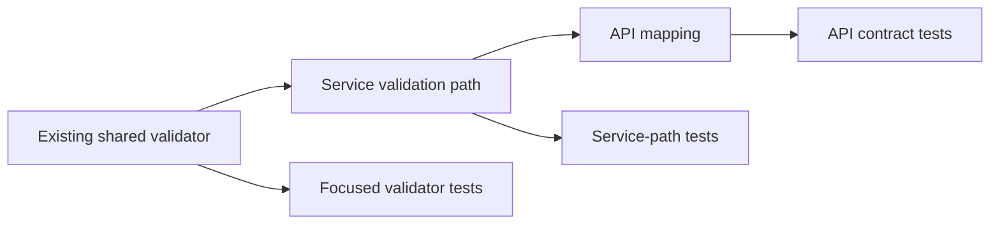
```mermaid
flowchart LR
    A["Existing shared validator"] --> B["Service validation path"]
    B --> C["API mapping"]
    A --> D["Focused validator tests"]
    B --> E["Service-path tests"]
    C --> F["API contract tests"]
```

#### Reuse-first proposal gate

Navigator cannot mark a proposal `ready for approval` when it recommends “add
helper,” “add module,” “add abstraction,” or “add dependency” without recording:

1. Existing helpers, framework capabilities, and installed dependencies checked.
2. Why the existing option does not fit the approved requirement.
3. Caller, test, architecture, and preserve-rule impact.
4. Whether the new path needs material approval or Dependency Gate.
5. The smallest implementation and evidence scope.

This gate composes existing `AGENTS.md`, Guardrails, Dependency Gate, Code Graph,
and Test Precision guidance into one Navigator planning control. It prevents a
feature plan from becoming an unreviewed abstraction or dependency proposal.

### Example Navigator output

For a task such as "change existing validation logic and add focused tests," a
Navigator report should look like this:

```text
Harness recommendation: Requirement Completion Harness

Why selected:
- logic change affects shared validation and its service caller
- focused tests must prove both changed and preserved behavior
- error propagation is a likely multi-file completion risk

Proposed anchor:
- desired behavior: zero rejected; positive amount remains accepted
- architecture: service uses shared validation path
- evidence: validation and service-path tests
- correction budget: at most two cycles before human escalation

Skipped for now:
- AIDLC: task is currently small and requirements are clear
- provider-backed semantic analysis: local graph and focused source inspection are sufficient

Next action:
Review and approve approved.md before implementation.
```

Navigator remains advisory and deterministic. It can recommend a harness level,
prepare the anchor, and explain its routing decision; it must not silently start
an expensive agent loop, rewrite expected behavior, expand scope, or declare
completion without the evidence defined by the approved anchor.

## Purpose

TailTrail's harness engineering work builds an outer quality harness around a
coding agent. It should increase the chance that an agent gets a change right on
the first attempt, then provide fast feedback that lets the agent correct issues
before they reach human review.

```text
TailTrail Harness = feedforward guides
                  + feedback sensors
                  + bounded self-correction loop
```

The harness is not a replacement for the coding model, developer judgment,
existing tests, CI, security review, or repository policy. It makes those
controls available to the agent at the right time and turns their results into
actionable feedback.

This design is informed by Birgitta Boeckeler's
[Harness engineering for coding agent users](https://martinfowler.com/articles/harness-engineering.html).

## Outcome

A well-built harness should:

- improve first-pass agent quality with relevant rules, examples, tools, and
  acceptance checks before editing;
- catch deterministic problems quickly through local computational checks;
- present findings in a compact form an agent can use to self-correct;
- reserve human review for requirements and judgment automation cannot reliably
  decide; and
- improve its guides and sensors when the same failure happens repeatedly.

## Model

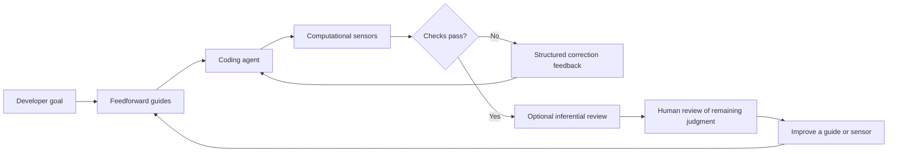
```mermaid
flowchart LR
    A[Developer goal] --> B[Feedforward guides]
    B --> C[Coding agent]
    C --> D[Computational sensors]
    D --> E{Checks pass?}
    E -->|No| F[Structured correction feedback]
    F --> C
    E -->|Yes| G[Optional inferential review]
    G --> H[Human review of remaining judgment]
    H --> I[Improve a guide or sensor]
    I --> B
```

### Feedforward guides

Guides reduce the likelihood of a poor first implementation.

| Guide | TailTrail role |
| --- | --- |
| `AGENTS.md`, policy, skills, and guardrails | Explain repository rules, safeguards, conventions, and constraints. |
| Navigator plan | Turns a goal into a small, explicit plan and likely validation path. |
| Code Graph and context routing | Selects relevant source, callers, tests, and policy rather than loading an entire repository. |
| Test Precision | Identifies the smallest reliable checks before the agent edits. |
| Structural rules and harness templates | Define architecture boundaries, forbidden dependencies, and topology conventions. |

### Feedback sensors

Sensors observe the agent's change and report whether it is moving toward the
desired state.

| Sensor | Execution type | Feedback |
| --- | --- | --- |
| Focused tests | Computational | Failing test, expected/actual behavior, and relevant source and test paths. |
| Lint, format, type, and build checks | Computational | Rule ID, location, exact diagnostic, and next action. |
| AST and structural checks | Computational | Boundary violations, dependency drift, changed symbols, and affected tests. |
| Dependency and security checks | Computational | Exact component/finding, severity, and relevant policy gate. |
| TailTrail Review | Inferential | Requirement gaps, unnecessary complexity, weak validation, and missed project patterns. |
| Semantic/provider-backed analysis | Inferential or provider-backed | Advisory relationship evidence, explicitly labeled by source. |

## Computational first

| Execution type | Characteristics | Examples |
| --- | --- | --- |
| **Computational** | Deterministic, CPU-run, fast, and reliable enough for each relevant change. | Tests, linters, type checkers, builds, AST analysis, structural and architecture checks. |
| **Inferential** | Richer semantic judgment but slower, costlier, and non-deterministic. | Agent reasoning, AI code review, semantic analysis, LLM-as-judge. |

Computational controls should run first whenever they can answer the question.
They catch mechanical and structural problems without consuming model reasoning.
Inferential controls should then focus on requirements, overengineering,
trade-offs, and semantic intent.

## Correction loop

1. TailTrail selects applicable guides and computational sensors for the task.
2. The coding agent makes a small change.
3. TailTrail runs the smallest approved local checks.
4. TailTrail returns a compact correction packet with the exact command,
   affected path/symbol, evidence, failure reason, and next action.
5. The agent corrects the change and the selected checks run again.
6. The loop stops on pass, timeout, repeated failure, ambiguous output, scope
   expansion, or human escalation.
7. After fast checks pass, TailTrail Review can inspect semantic and
   requirement-level issues.

The loop must be bounded. TailTrail should never retry indefinitely or turn an
unrun, skipped, timed-out, or ambiguous control into a passing result.

## Token Harness Integration

Token Harness is a supporting capability for Harness Engineering. It does not
decide whether a requirement is correct or complete. Its role is to make each
anchor, checkpoint, correction packet, and review packet small enough for an
agent to use efficiently while preserving the exact evidence required for trust.

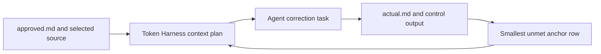
```mermaid
flowchart LR
    A[approved.md and selected source] --> B[Token Harness context plan]
    B --> C[Agent correction task]
    C --> D[actual.md and control output]
    D --> E[Smallest unmet anchor row]
    E --> B
```

### Token Harness responsibilities inside one run

| Harness stage | Token Harness responsibility | Safe context to provide |
| --- | --- | --- |
| Anchor proposal | Build the smallest exact context needed to understand current state and desired outcomes. | Compact goal, applicable policy, selected source/callers/tests, graph summary, known unknowns. |
| Initial implementation | Create an agent packet tied to approved scope and evidence plan. | Relevant `approved.md` rows, exact changed files, required helpers, focused tests, allowed commands. |
| Failed checkpoint | Prevent the agent from rereading unrelated history. | Unmet requirement row, relevant diff, exact failed output, affected source/caller/test, one next action. |
| Review | Keep semantic review focused on the completed change. | Compact diff summary, changed tests with rationale, checkpoint state, unresolved risks, exact retrieval pointers. |
| Retrospective | Produce privacy-safe evidence about context choices. | Context receipt metadata, selected/avoided artifact pointers, run ID, checkpoint number, evidence label. |

Example correction packet context:

```text
Load exactly:
- approved.md: zero-dollar submission behavior and architecture rule
- actual.md: service-path mismatch
- src/claims_api/service.py
- tests/test_claim_service.py
- exact focused test failure

Avoid:
- full roadmap and unrelated architecture documents
- unrelated repository modules
- previous long agent conversation
- unrelated scanner logs
```

### Exactness boundaries

Token reduction must never change the evidence that the harness uses to judge
completion. The following material remains exact and retrievable:

- approved requirements, invariants, allowed scope, and re-approval conditions;
- current diff, changed source, policy/security rules, dependency manifests, and
  lock files when relevant;
- exact failed test, build, lint, type, scanner, or structural-check evidence;
- public API/schema/security boundary changes; and
- the original approved and actual scenario content used by a checkpoint.

Safe bulky material can be reduced only when the Token Harness records a
retrieval pointer and does not remove a material fact. Examples include verbose
tool logs, repetitive scanner output, large JSON reports, or long documentation
that is not itself part of the requirement or evidence.

### Required Token Harness updates

The existing Token Harness concepts should be extended, not rebuilt:

| Update | Purpose |
| --- | --- |
| Run and checkpoint linkage | Associate context receipts and Token Harness ledger events with `run_id`, anchor fingerprint, and checkpoint number. |
| Anchor-aware classification | Mark anchor rows and exact failure evidence as `must-be-exact`; mark safely reducible background artifacts separately. |
| Correction-packet route | Build the next packet from the smallest unmet requirement row rather than prior chat history. |
| Per-cycle receipts | Record selected, avoided, and escalated context for each correction cycle without raw prompts/source. |
| Context-growth signal | Flag when repeated corrections require progressively broader context, which may indicate an unclear anchor, missed impact path, or loop drift. |
| Measured-claim boundary | Keep estimated/local context evidence separate from actual provider token telemetry. |

Useful local records could look like:

```text
.tailtrail/runs/<run-id>/context/checkpoint-01-receipt.json
.tailtrail/runs/<run-id>/context/checkpoint-02-receipt.json
.tailtrail/token-harness-events.jsonl
```

The harness may say that it loaded less irrelevant context or used a local
context receipt. It must not claim exact token savings, cost reduction, or model
efficiency unless normalized before/after provider usage telemetry exists.

## Evaluation Harness Integration

Evaluation Harness operates one level above a single harness run. The Change
Intent Anchor and Completion Harness ask whether **this change** reached the
approved desired state. Evaluation Harness asks whether using TailTrail Harness
Engineering improves outcomes across repeatable scenarios or approved local
portfolio evidence.

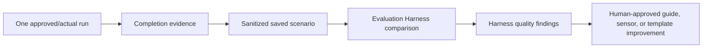
```mermaid
flowchart LR
    A[One approved/actual run] --> B[Completion evidence]
    B --> C[Sanitized saved scenario]
    C --> D[Evaluation Harness comparison]
    D --> E[Harness quality findings]
    E --> F[Human-approved guide, sensor, or template improvement]
```

| Layer | Primary question | Typical evidence |
| --- | --- | --- |
| Completion Harness | Did this agent change fulfill the approved task? | `approved.md`, `actual.md`, checkpoints, focused controls, review result. |
| Evaluation Harness | Does the harness improve completion quality across tasks? | Saved baseline/TailTrail artifacts, deterministic scenario scores, approved outcome records. |

### What Evaluation Harness should measure

Evaluation must not reduce the new harness to a generic "tests passed" score.
Its dimensions should reflect the actual design goals:

| Evaluation dimension | What it measures |
| --- | --- |
| Requirement completion | Share of required anchor rows that reach `validated` rather than missing, failed, or ambiguous. |
| Architecture preservation | Whether approved required paths and boundaries were preserved rather than bypassed. |
| Behaviour evidence | Whether approved scenarios have credible focused evidence, not only narrow agent-written tests. |
| Scope discipline | Unexpected files, dependencies, API/schema changes, or unapproved boundary expansion. |
| Test integrity | Requirement-linked test changes versus weakened, skipped, or suspicious assertions. |
| Correction efficiency | Number of bounded cycles before pass, escalation, or abandonment. |
| Escalation quality | Whether the harness stopped for an ambiguity instead of allowing the agent to invent behavior. |
| Review readiness | Whether a human receives approved intent, actual result, evidence, and unresolved risks in one handoff. |
| Context discipline | Whether receipts show relevant, bounded context; exact token savings remain a separate measured metric. |

### Deterministic evaluation scenarios

The first Evaluation Harness integration should use saved, sanitized artifacts,
not live model calls. Each scenario can compare a baseline outcome with a
TailTrail Harness outcome.

```text
Scenario: multi-file validation change

Baseline artifact:
- direct validation function changed
- service caller missed
- unit test passes
- required submission behavior remains incomplete

TailTrail Harness artifact:
- approved desired behavior and service-path architecture rule
- missing caller path detected at checkpoint
- one bounded correction packet issued
- focused service test passes
- requirement matrix becomes complete
```

“Deterministic” means the same saved input, scoring rules, and expected result
produce the same evaluation result every time. There is no live model randomness,
API cost, changing provider behavior, network dependency, or ambiguity about
whether the model rather than the Harness caused an outcome.

The baseline artifact represents a plausible incomplete coding outcome without
the requirement-completion loop:

```text
Agent changes only the direct validation function.
The direct unit test passes.
The agent misses the service caller.
The real submission flow still accepts the invalid claim.
```

The TailTrail Harness artifact represents what the surrounding workflow adds;
it does not claim that TailTrail magically makes a model correct:

```text
Navigator/anchor defines the required submission behavior.
The requirement matrix identifies the service path as relevant.
The checkpoint detects missing caller-path evidence.
One bounded correction packet targets the service propagation gap.
Focused service evidence passes after correction.
All required matrix rows become complete.
```

```text
Without TailTrail:
direct function change -> unit test passes -> hidden integration miss remains

With TailTrail:
approved requirement -> likely caller path -> checkpoint finds gap
-> focused correction -> service test proves final behavior
```

The scenario should test the Harness logic itself:

```text
Given a known incomplete baseline artifact, does TailTrail detect:
- the missing service caller;
- the incomplete requirement matrix;
- the relevant architecture/behavior drift; and
- the intended focused correction packet?
```

Typical fixture layout and expected outcome:

```text
benchmarks/evaluation/scenarios/multi-file-validation/
  scenario.json
  baseline-artifact.md
  tailtrail-artifact.md
  expected.json
  README.md
```

```json
{
  "requirements": {
    "REQ-01": "validated",
    "REQ-02": "validated",
    "REQ-03": "validated"
  },
  "baseline": {
    "completion": "incomplete",
    "missed_caller": true
  },
  "tailtrail": {
    "completion": "validated",
    "correction_packets": 1,
    "focused_service_test": "passed"
  }
}
```

This can prove a narrow, honest statement: for this saved multi-file scenario,
TailTrail identified the missing caller, marked the requirement incomplete, and
recommended the intended correction. It cannot by itself prove that TailTrail
always improves every coding agent, prevents defects at a measured percentage,
saves a specific number of tokens, or performs equally well in every real
repository. Those claims require later controlled live-agent evaluation and/or
measured real-task telemetry.

The scenario scorer should verify facts present in the artifacts. It should not
pretend to prove that a live model will always behave identically. Optional live
agent evaluation is a later explicit-approval mode, after deterministic scenario
scoring is stable.

### Required Evaluation Harness updates

| Update | Purpose |
| --- | --- |
| Harness scenario type | Add saved scenarios for approved/actual comparison, architecture drift, behavior drift, test-chasing, and escalation. |
| Anchor-aware event schema | Normalize run ID, anchor version/fingerprint, completion states, drift categories, checkpoint count, and evidence labels. |
| Baseline vs. harness rubric | Score the quality of completion evidence and handoff, not just code/test output. |
| Scenario fixtures | Commit sanitized `approved`, `actual`, baseline, and expected-score fixtures that are reproducible without a live model. |
| Portfolio reporting | Summarize recurring completion gaps, drift categories, correction cycles, and unresolved-decision rates using opt-in local evidence. |
| Claim guardrails | Separate observed local evidence from measured claims about defect reduction, review-time reduction, or token savings. |

Potential fixture layout:

```text
benchmarks/evaluation/scenarios/harness-completion-validation/
  scenario.json
  baseline-artifact.md
  tailtrail-artifact.md
  approved.md
  actual.md
  expected.json
  README.md
```

### Learning from evaluation without surveillance

Evaluation results should improve TailTrail only through a controlled steering
loop. For example, repeated service-path omissions could propose a stronger
Navigator caller check or a new approved scenario. Repeated false-positive
architecture findings could weaken or retire a noisy rule.

Any such change remains proposal-first, human-approved, test-backed, reversible,
and privacy-preserving. TailTrail should not upload raw prompts, source code,
customer data, logs, agent transcripts, or repository identities merely to
measure harness quality.

### Integration sequence

1. Implement the Change Intent Anchor and Requirement Completion Harness.
2. Link Token Harness receipts and ledger events to run IDs/checkpoints.
3. Add deterministic Evaluation Harness fixtures for approved/actual comparison
   and drift detection.
4. Gather opt-in local outcome evidence from real tasks.
5. Use the evidence to improve guides, sensors, and templates.
6. Make quality, review-effort, or token-efficiency claims only when the
   corresponding evidence is measured and credible.

## Change Intent Anchor

Drift awareness needs an anchor. Without an approved reference for the desired
result, a coding agent and a reviewer can only compare the latest diff with the
latest test output. That makes it easy to confuse "the suite is green" with
"the requested change is complete."

TailTrail should create a versioned, local **Change Intent Anchor** before
implementation. It is an approved contract connecting the current project
state, the desired project state, the allowed change boundary, and the evidence
required to demonstrate completion.

```text
Current state -> approved desired state -> observed result and evidence
```

The anchor is not a copy of the whole repository and should not be described as
only a cache. It is a small, reviewable change contract. Caching can make its
local representation fast to retrieve; the important property is that the user
approved the intent before an agent starts correcting toward it.

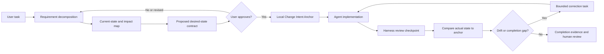
```mermaid
flowchart LR
    A[User task] --> B[Requirement decomposition]
    B --> C[Current-state and impact map]
    C --> D[Proposed desired-state contract]
    D --> E{User approves?}
    E -->|No or revised| B
    E -->|Yes| F[Local Change Intent Anchor]
    F --> G[Agent implementation]
    G --> H[Harness review checkpoint]
    H --> I[Compare actual state to anchor]
    I --> J{Drift or completion gap?}
    J -->|Yes| K[Bounded correction task]
    K --> G
    J -->|No| L[Completion evidence and human review]
```

### Creating the anchor

For a small task, Navigator, Code Graph, Test Precision, local policy, and exact
source inspection should produce the first anchor proposal. For a broad, risky,
or ambiguous task, AIDLC can deepen requirement gathering before the proposal is
shown to the user. AIDLC is not required for every small fix; the anchor must be
small enough to remain useful.

The user approves the desired state, not an implementation recipe. The agent
may choose a different small implementation if it still reaches the approved
behavior and preserves the approved architectural boundaries and invariants.

| Anchor element | Purpose | Example for a claim-validation change |
| --- | --- | --- |
| Goal | Compact statement of intended outcome | Reject zero-dollar claims while keeping positive claims valid. |
| Current state | Relevant observed baseline, including known failures | `validate_claim_amount(0)` is currently accepted; service behavior relies on it. |
| Desired behavior | Observable outcomes that must become true | Zero rejected through validation and submission; positive amount still accepted. |
| Architecture expectations | Required path, boundaries, and places that must not be bypassed | Submission continues through service to shared validation; no controller-only workaround. |
| Impact boundary | Expected source, caller, test, config, and public-contract scope | Validation, service, and focused claim tests; no dependency/API/schema change. |
| Invariants | Behavior that must remain true | Preserve error type/response contract and existing positive-amount flow. |
| Evidence plan | Focused checks that can prove each outcome | Validation and service-path tests; configured type/lint checks if relevant. |
| Known unknowns | Decisions the agent must not invent | Whether service maps validation errors into a public response. |
| Approval fingerprint | Inputs that make this exact approval valid | Goal/requirements, policy version, baseline revision, relevant paths, and selected controls. |

### Example anchor

```yaml
anchor_version: 1
run_id: claim-zero-amount-001
goal: Reject zero-dollar claim amounts while keeping positive claim amounts valid.

current_state:
  - validate_claim_amount accepts 0
  - claim submission calls validate_claim through the service path

desired_state:
  behaviour:
    - Zero amount raises ClaimValidationError.
    - Positive amount remains accepted.
    - Submission flow preserves the validation failure contract.
  architecture:
    - Use the existing shared validation path.
    - Do not implement a controller-only or caller-specific special case.

expected_scope:
  source:
    - src/claims_api/validation.py
    - src/claims_api/service.py
  tests:
    - tests/test_claim_validation.py
    - tests/test_claim_service.py
  prohibited_without_reapproval:
    - public API change
    - dependency change
    - schema/data migration

evidence_plan:
  - focused validation test for zero and positive amounts
  - focused submission-path test
  - diff review for unrelated scope expansion

known_unknowns:
  - Confirm expected public error mapping if the service currently catches validation errors.
```

The human-facing view should be Markdown, concise, and approval-ready. The
machine-readable view should be sanitized JSON or YAML that supports stable
comparison throughout the correction loop.

### Phased Anchor Activation and Context Slices

For a broad task, distinguish the **draft anchor**, the **approved anchor**, and
the active feature slice. “Creating the anchor” is the requirement-gathering and
planning process; `approved.md` is the human-readable rendering of the accepted
desired-state contract; `actual.md` is observed implementation evidence and is
not an anchor.

```text
Draft Change Intent Anchor
= Navigator requirement bifurcation, feature/dependency plan, reuse decisions,
  scope, invariants, evidence plan, and known unknowns before user approval.

Approved Change Intent Anchor
= The same contract after human acceptance, frozen as approved-v1.md and
  normalized anchor/matrix JSON.

Actual checkpoint
= What the code and selected controls demonstrate after one implementation or
  correction cycle, written as actual/checkpoint-<n>.md and checkpoint JSON.
```

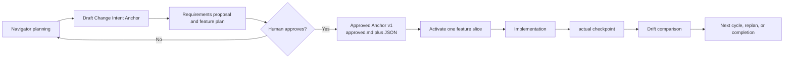
```mermaid
flowchart LR
    A["Navigator planning"] --> B["Draft Change Intent Anchor"]
    B --> C["Requirements proposal and feature plan"]
    C --> D{"Human approves?"}
    D -->|"No"| A
    D -->|"Yes"| E["Approved Anchor v1\napproved.md plus JSON"]
    E --> F["Activate one feature slice"]
    F --> G["Implementation"]
    G --> H["actual checkpoint"]
    H --> I["Drift comparison"]
    I --> J["Next cycle, replan, or completion"]
```

#### Full approved program, small active context

The root approved contract preserves the complete desired end state. TailTrail
must not create a phase-only `approved.md` that forgets future requirements,
global constraints, dependencies, or integration proof. Instead, it preserves a
full program anchor and activates one independently verifiable feature slice.

```text
program-approved-v1.md
  - complete approved end state
  - all features and dependencies
  - global constraints and integration definition of done

features/F-01-domain-validation/approved-v1.md
  - active requirements and requirement UIDs
  - inherited global constraints
  - focused expected scope, reuse decisions, and proof

features/F-01-domain-validation/actual/checkpoint-001.md
  - observed changes, evidence, failures, and drift for this slice
```

Example broad program plan:

```text
Program: Claims submission workflow

F-01 Domain validation
  REQ-01 Reject zero amount.
  REQ-02 Preserve positive amount acceptance.
  REQ-03 Reuse shared validator.

F-02 API and service flow (depends on F-01)
  REQ-04 API/service uses shared validation path.
  REQ-05 Preserve error contract.

F-03 Persistence (depends on F-01 and F-02)
  REQ-06 Persist only validated claims.
  REQ-07 Invalid claims have no persistence side effect.

F-04 Integration (depends on F-01 through F-03)
  REQ-08 Valid end-to-end submission works.
  REQ-09 Invalid end-to-end submission is rejected.
```

When F-01 is active, TailTrail loads only the context needed for safe work:

```text
Load:
- F-01 requirements, approved scope, reuse decisions, and evidence plan.
- Relevant inherited global constraints and upstream dependency facts.
- Relevant source, callers, focused tests, and latest F-01 checkpoint.

Avoid loading by default:
- Future persistence implementation detail.
- Unrelated API design detail.
- Completed feature history unless it affects F-01's active boundary.
```

This is a context-reduction strategy, not an exact token-savings claim. It keeps
the active coding context likely smaller and more relevant while the root anchor
retains full traceability. Exact token savings require measured telemetry.

#### Phase quality and activation gates

A phase is not an arbitrary file-edit batch such as “modify three files.” It is
a meaningful feature boundary with outcomes, preserve rules, scope, and proof.

| Strong phase | Weak phase |
| --- | --- |
| F-01 — Domain validation behavior and focused proof. | Phase 1 — Edit `validation.py` and `service.py`. |
| Has requirements, invariants, expected scope, and completion evidence. | Is a task list without an observable completion condition. |
| Can be independently validated and integrated later. | Cannot say whether its work is correct without the next arbitrary phase. |

The developer approves the full Program Anchor, feature sequence, global
constraints, and integration definition of done. TailTrail activates one feature
at a time. It asks for another approval only when a material requirement,
dependency, API/schema/security boundary, design gap, or recovery/replan decision
changes the accepted contract.

For a broad program, independent features may begin separately only when their
approved boundaries do not depend on unresolved decisions. For example, F-01
validation can proceed while F-02 API contract is `needs-decision`; F-03
persistence can be explicitly deferred. The program status must show this
honestly rather than claim that every feature is approved.

```text
Program P-01: approved
F-01 Domain validation: active
F-02 API contract: blocked by needs-decision
F-03 Persistence: deferred by developer
F-04 Integration: waiting on active/dependent features
```

### Validated Requirement Retention, Revalidation, and Amendment History

A validated requirement remains part of the approved anchor and final
reconciliation history, but it should not be loaded in full or retested on every
later cycle. For context discipline, TailTrail moves it into a
**preservation-only** posture: retain its compact statement, evidence pointer,
and impact triggers; reload detailed context only when current work can affect
it.

```text
approved -> active -> validated -> preservation-only -> complete
                              \-> revalidated when an impact trigger appears
```

Example active program state:

```text
REQ-01 to REQ-05: validated / preservation-only
REQ-06 to REQ-09: active or incomplete
REQ-10 to REQ-15: future or blocked by dependencies
```

For an active correction, TailTrail loads full context for REQ-06 through REQ-09,
relevant global constraints, and only the previously validated requirements
whose paths, symbols, callers, contracts, or dependency edges are impacted.
Unrelated validated/future requirement details remain outside the active context.

#### Targeted revalidation triggers

| Trigger | Revalidate a previously validated requirement? |
| --- | --- |
| Current work changes its file, symbol, or task-owned hunk | Yes. |
| Current work changes a caller, shared helper, dependency, API, schema, or contract it relies on | Yes. |
| Code Mapper/impact analysis finds a relevant relationship edge | Yes; label confidence and inspect exact source if needed. |
| Global constraint or policy affecting it changes | Yes. |
| Required feature/program integration phase begins | Usually through the selected integration proof. |
| Unrelated module/future feature changes | No. |
| Documentation-only or non-behavioral change | No, unless policy says otherwise. |

Example:

```text
Current cycle modifies service.py for REQ-04.

Impact analysis:
- REQ-04 is active and targets service.py.
- REQ-02 was previously validated but also relies on service.py for
  positive-amount submission.

Action:
- Load full REQ-04 context.
- Add compact REQ-02 preservation assertion.
- Rerun REQ-02 focused positive-value proof after correction.
```

#### Contradiction, duplication, and requirement design review

If later discovery shows that earlier requirements contradict, duplicate, or
otherwise make the approved design incoherent, this is a **requirement design
issue**, not ordinary implementation drift. TailTrail pauses the affected
feature boundary and creates an amendment proposal. It never silently edits or
deletes the previous approved requirement.

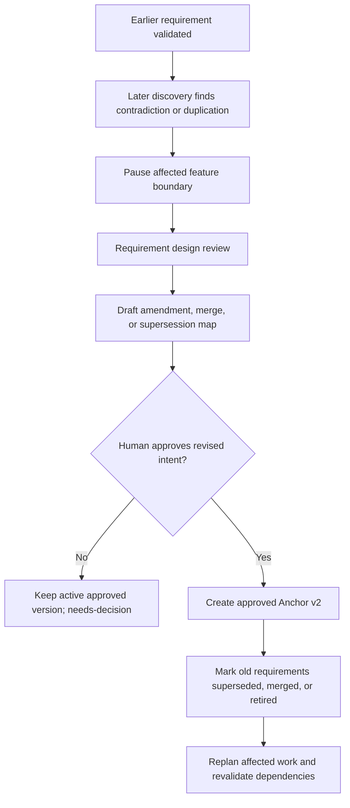
```mermaid
flowchart TB
    A["Earlier requirement validated"] --> B["Later discovery finds contradiction or duplication"]
    B --> C["Pause affected feature boundary"]
    C --> D["Requirement design review"]
    D --> E["Draft amendment, merge, or supersession map"]
    E --> F{"Human approves revised intent?"}
    F -->|"No"| G["Keep active approved version; needs-decision"]
    F -->|"Yes"| H["Create approved Anchor v2"]
    H --> I["Mark old requirements superseded, merged, or retired"]
    I --> J["Replan affected work and revalidate dependencies"]
```

Example contradiction:

```text
F-02 v1 / REQ-03:
API must preserve the existing validation error contract.

Later requirement/design discovery:
API must return a structured validation error response.

Result:
REQ-03 and the new behavior cannot both remain active.
Pause API feature; obtain a human-approved amendment.
```

#### Requirement Amendment Log

Prior requirement intent and evidence are never “revoked” by deletion. TailTrail
maintains a Requirement Amendment Log that records how the active contract
evolved. An earlier requirement can be `superseded`, `merged`,
`retired-by-approved-amendment`, or retained with a clarification; its historical
approval, actual evidence, and drift remain readable.

```json
{
  "amendment_id": "AMD-003",
  "anchor_from": "approved-v1",
  "anchor_to": "approved-v2",
  "change_type": "supersede",
  "old_requirement_uids": ["tt://run-001/P-01/F-02/v1/REQ-03"],
  "new_requirement_uids": ["tt://run-001/P-01/F-02/v2/REQ-08"],
  "reason": "Approved public API error-contract change.",
  "approval": "human-approved",
  "affected_features": ["F-02", "F-04"],
  "required_revalidation": ["API contract test", "service-path test", "invalid-submission integration scenario"]
}
```

```text
approved-v1:
REQ-03 — Preserve existing API validation error contract.
Status: superseded.

approved-v2:
REQ-08 — Return structured API validation error response.
Status: approved.

Relationship:
REQ-08 supersedes REQ-03 after human-approved public contract change.
```

#### Requirement intent rollback versus source rollback

These are separate operations:

| Need | Mechanism |
| --- | --- |
| Restore or inspect prior desired intent | Anchor versions and Requirement Amendment Log. |
| Explain why requirement changed | Proposal history, amendment record, and approval evidence. |
| Restore prior code | Git history or task-owned selective recovery. |
| Undo failed current-task work | Task Recovery Boundary and verified reverse patch. |
| Return to a prior approved contract | Explicit human decision to reactivate/supersede anchor version; never automatic. |

Validated/preservation-only, future/blocked, and superseded/retired requirements
are all retained in history. Only active requirements and relevant preservation
assertions consume active implementation context. This gives TailTrail a small
working set without losing final reconciliation, evaluation, recovery, or
requirement-version traceability.

### Desired state is not a frozen implementation

The anchor must not overconstrain good engineering. It should state outcomes,
invariants, and important boundaries, not prescribe exact line-by-line edits.

For example, the anchor can require that every claim submission uses shared
validation. It should not require a specific `if amount <= 0` expression if a
project's existing validation helper already provides the correct behavior.

This separation makes the anchor useful for both drift detection and reuse:

| Anchor says | Agent remains free to |
| --- | --- |
| Zero claims are rejected in all submission paths | Choose the smallest compatible validation implementation. |
| Shared validation path is preserved | Refactor within the validation layer when it reduces duplication. |
| Positive claims remain valid | Add the most focused regression coverage matching local test conventions. |
| No public API change without re-approval | Improve internal error handling without changing the external contract. |

### Checkpoints: detect drift during the loop

After each meaningful agent edit, TailTrail should create a **drift checkpoint**.
The checkpoint compares the actual diff, current source path, test results, and
review findings against the approved anchor. It should report explicit state and
reasons, not a single opaque "drift score."

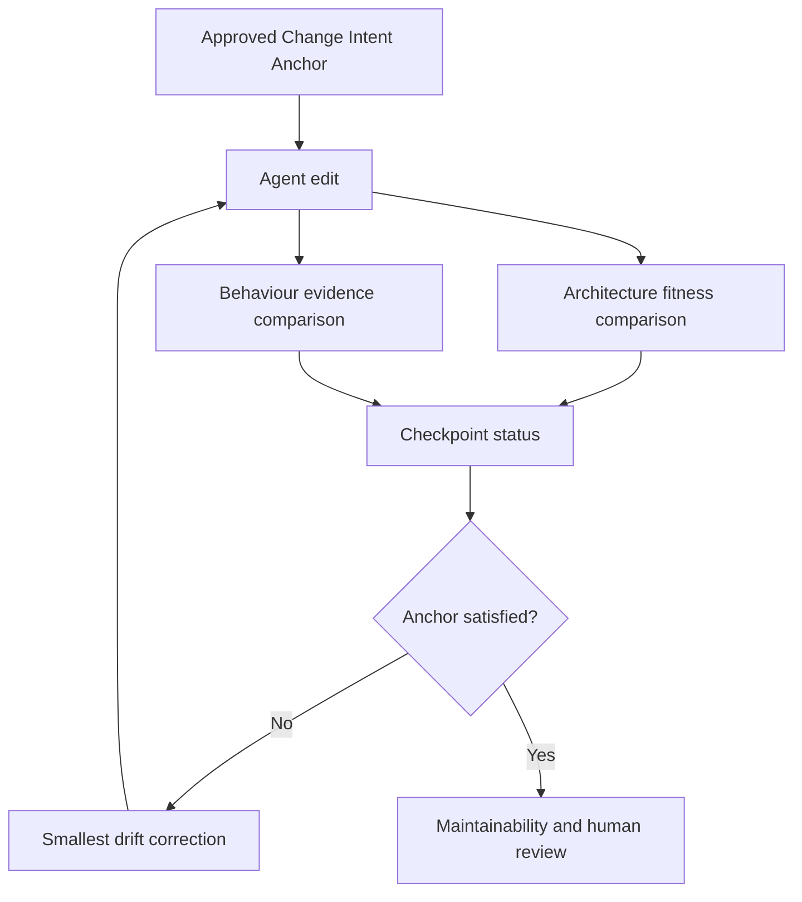
```mermaid
flowchart TB
    A[Approved Change Intent Anchor] --> B[Agent edit]
    B --> C[Architecture fitness comparison]
    B --> D[Behaviour evidence comparison]
    C --> E[Checkpoint status]
    D --> E
    E --> F{Anchor satisfied?}
    F -->|No| G[Smallest drift correction]
    G --> B
    F -->|Yes| H[Maintainability and human review]
```

Example checkpoint:

```text
Checkpoint 2 of 3

Anchor status: partially satisfied

Behaviour:
- Zero rejected by validation: validated
- Positive amount accepted: validated
- Submission preserves validation failure: failed

Architecture:
- Shared validation path: preserved
- Unexpected dependency or protected-path change: none

Drift:
- src/claims_api/service.py converts ClaimValidationError into a success result.

Next correction:
Preserve the validation error in the service path. Re-run the focused service
and validation tests. Do not expand into an API-contract change.
```

The checkpoint should separate these categories:

| Checkpoint category | Question | Typical response |
| --- | --- | --- |
| Requirement coverage | Is every approved outcome validated, failed, blocked, or awaiting a decision? | Correct the unmet outcome or ask the user a focused question. |
| Architecture fitness | Does the actual change preserve required paths and boundaries? | Move logic to the approved layer or request re-approval for a boundary change. |
| Behaviour evidence | Do tests and direct observations demonstrate the desired behavior and preserved invariants? | Add/run focused coverage or fix the behavior. |
| Scope drift | Did the diff move beyond the approved impact boundary? | Classify as required, regression, optional hardening, or unrelated; re-approve if material. |
| Evidence drift | Did a test change, skipped control, or weak assertion make proof less trustworthy? | Require a requirement-linked rationale or escalate. |

#### Checkpoint delta states

Every checkpoint compares the current actual state both to the approved anchor
and to the previous checkpoint. It must use explicit delta states rather than an
opaque drift score:

| Delta state | Meaning | Harness response |
| --- | --- | --- |
| `resolved` | A prior requirement, architecture, behavior, scope, or evidence gap is now validated. | Preserve the evidence and continue to remaining rows. |
| `improved` | Evidence is stronger or the gap is smaller, but the requirement is not fully proven. | Issue the next bounded correction or focused validation. |
| `unchanged` | The prior gap remains materially the same. | Count against correction budget; consider root-cause/recovery analysis. |
| `regressed` | A previously validated requirement or invariant now fails. | Stop broad progress claims and correct/diagnose the regression. |
| `new-drift` | The latest correction introduced an unexpected path, dependency, behavior, scope, or evidence problem. | Classify the drift; invalidate/re-approve if material. |
| `needs-decision` | Evidence supports more than one reasonable interpretation, or proof is insufficient. | Pause automated correction and request human judgment. |

Example:

```text
Checkpoint 01:
- service submission rejects zero: failed

Checkpoint 02:
- service submission rejects zero: resolved
- controller.py changed outside approved scope: new-drift

Result:
Behavior improved, but scope is no longer fully aligned. Do not mark the task
complete until the controller change is justified, reversed, or approved.
```

### Anchor invalidation and re-approval

An approval only applies to the precise desired state that was reviewed. TailTrail
must invalidate the anchor and request re-approval when a material input changes:

- the developer clarifies, narrows, or expands a requirement;
- a correction needs a new important source path, caller path, or test domain;
- the work changes a public API, security boundary, data model, schema, or
  dependency;
- project policy, an approved architectural rule, or a protected-path rule has
  changed since approval;
- a baseline failure previously considered unrelated is found to affect the
  requested behavior; or
- new evidence exposes two reasonable but incompatible interpretations of the
  desired behavior.

Minor implementation movement within an approved boundary should not force
re-approval. The point is to preserve developer control over material intent
changes, not to interrupt every normal correction.

Example invalidation:

```text
Anchor requires re-approval.

Reason: correction requires changing the public submission response contract.
The approved anchor preserved the existing error-response behavior.

New decision needed:
1. Return the validation error to callers as a client error.
2. Preserve the current response and narrow the requirement to internal validation.
```

### Local storage and privacy

The anchor should live with the local run as an approved/actual document pair:

```text
.tailtrail/runs/<run-id>/approved.md
.tailtrail/runs/<run-id>/actual.md
.tailtrail/runs/<run-id>/checkpoints/checkpoint-01.json
```

The stored form must be compact and privacy-preserving. It should retain exact
requirements, controlled paths, result summaries, approval state, and evidence
pointers. It should not automatically copy raw prompts, full source files,
secrets, customer data, or unredacted logs into durable learning or telemetry.

The approval fingerprint should include a stable baseline revision or diff
identity, applicable policy fingerprint, normalized requirement text, selected
paths, and selected controls. If these inputs materially change, TailTrail can
tell the developer exactly why the anchor is no longer valid.

### Approved and actual documents

`approved.md` is the human-approved desired-state anchor. `actual.md` is the
current observed state generated after an agent edit and its selected checks.
Together they combine the Change Intent Anchor and approved-scenario concepts:

```text
approved.md = what the project is approved to become
actual.md   = what the project currently does after this agent attempt
comparison  = where behavior, architecture, scope, or evidence has drifted
```

`approved.md` and `actual.md` are active implementation surfaces, not full run
archives. They should contain the minimum information needed to implement or
validate the active feature safely. Detailed scenario payloads, full graph output,
raw control output, recovery data, proposal history, and exhaustive scope/hunk
mapping belong in linked structured artifacts and reports.

```text
approved.md: active requirements, boundaries, reusable path, and required proof
actual.md: current status, smallest relevant evidence, drift, and next action
```

The root Program Anchor retains full desired-state traceability, while a feature
`approved.md` is a compact active slice. `actual.md` is checkpoint-specific and
compact; its JSON counterpart retains detailed provenance for later audit.

Every meaningful approved scope item, actual change, failure, drift record,
correction packet, recovery hunk, and evaluation result must reference a
`requirement_id` and immutable `requirement_uid`, plus a brief readable
requirement statement. This prevents users from having to remember what
`REQ-03` represented when reviewing the run later. Program-wide rules use an
explicit global ID such as `GLOBAL-01`; a new unapproved discovery uses a
temporary `DISC-01` identity until it maps to an approved requirement or is
rejected.

Minimal active-slice `approved.md`:

```md
# TailTrail Change Intent Anchor

**Feature:** F-01 Domain validation
**Goal:** Reject zero amount; preserve valid submission behavior.

| ID | Requirement | Scope / proof |
| --- | --- | --- |
| REQ-01 | Reject zero amount with existing `ClaimValidationError`. | `validation.py`; zero-value test. |
| REQ-02 | Preserve positive amount acceptance. | Service path; positive-value test. |
| REQ-03 | Reuse shared validation; no parallel validator. | Validation/service path; source + service test. |
| GLOBAL-01 | No API, dependency, schema, or config change. | Changed-path check. |

**Required path:** `service.submit_claim -> validate_claim -> validate_claim_amount`
**Allowed files:** `validation.py`, `service.py`, focused claim tests
**Detailed contract:** `approved-v1.json`, `requirement-impact-matrix-v1.json`
```

Minimal checkpoint-specific `actual.md`:

```md
# TailTrail Actual State

**Feature:** F-01 Domain validation
**Checkpoint:** F-01-checkpoint-002
**Status:** incomplete

| ID | Requirement | Result | Brief evidence |
| --- | --- | --- | --- |
| REQ-01 | Reject zero amount. | `implemented-not-validated` | Validator rejects zero; submission still accepts it. |
| REQ-02 | Preserve positive acceptance. | `validated` | Positive-value test passed. |
| REQ-03 | Reuse shared validation path. | `failed` | Service converts validation error to success. |
| GLOBAL-01 | No material scope change. | `validated` | No manifest/API/schema/config changes. |

**Changed:** `validation.py`, `service.py`, focused claim tests
**Drift:** `DRIFT-021` — REQ-01/REQ-03 service propagation gap
**Next:** CP-004 — stop service flow after `ClaimValidationError`
**Detailed evidence:** `checkpoint-002.json`, `controls/`, `graph/`
```

The longer examples below remain reference examples for scenario-rich work. They
should be rendered as linked detail or expanded only when a developer needs it,
not loaded into every implementation cycle.

Detailed scenario-rich `approved.md` reference:

```md
# TailTrail Change Intent Anchor

## Goal

Reject zero-dollar claim amounts while keeping positive claim amounts valid.

## Approved behaviour

## REQ-01 — Reject zero-dollar claim amount

**Requirement UID:** `tt://run-.../P-01/F-01/v1/REQ-01`
**Kind:** `change`
**Statement:** A claim amount of zero must raise the existing `ClaimValidationError`.

### Scenario: zero-dollar claim submission

**Input**

Claim amount: `0`

**Expected result**

Submission: rejected
Error type: `ClaimValidationError`
Message: `Claim amount must be greater than zero`

## REQ-02 — Preserve positive claim acceptance

**Requirement UID:** `tt://run-.../P-01/F-01/v1/REQ-02`
**Kind:** `preserve`
**Statement:** A positive claim amount remains accepted through the existing validation and submission path.

### Scenario: positive claim submission

**Input**

Claim amount: `100`

**Expected result**

Submission: accepted

## REQ-03 — Reuse shared validation path

**Requirement UID:** `tt://run-.../P-01/F-01/v1/REQ-03`
**Kind:** `constraint`
**Statement:** The change reuses shared validation and does not introduce a controller-only or duplicate validator path.

## GLOBAL-01 — Preserve public contract and dependency posture

**Global UID:** `tt://run-.../P-01/GLOBAL-01`
**Statement:** No public response-contract or dependency/configuration change occurs without re-approval.

## Architecture expectations

- Submission uses the existing service to shared-validation path.
- No controller-only special case.
- No public response-contract change without re-approval.

## Approved scope mapped to requirements

| Scope item | Requirement mapping | Reason |
| --- | --- | --- |
| `src/claims_api/validation.py` | `REQ-01`, `REQ-02`, `REQ-03` | Change zero behavior, preserve positive behavior, reuse shared validator. |
| `src/claims_api/service.py` | `REQ-02`, `REQ-03` | Preserve submission path and shared-validation propagation. |
| Focused claim tests | `REQ-01`, `REQ-02` | Prove changed and preserved behavior. |
| Dependency/configuration manifests | `GLOBAL-01` | Must remain unchanged. |

## Required evidence

- Zero-value validation and submission scenarios pass.
- Positive-value regression scenario passes.
```

Detailed scenario-rich `actual.md` reference after an incomplete agent attempt:

```md
# TailTrail Actual State

## REQ-01 — Reject zero-dollar claim amount

**Requirement UID:** `tt://run-.../P-01/F-01/v1/REQ-01`
**Checkpoint:** `F-01-checkpoint-002`
**Status:** `implemented-not-validated`

## Scenario: zero-dollar claim submission

**Observed result**

Validation: rejected
Submission: accepted

## REQ-02 — Preserve positive claim acceptance

**Requirement UID:** `tt://run-.../P-01/F-01/v1/REQ-02`
**Checkpoint:** `F-01-checkpoint-002`
**Status:** `validated`

## Scenario: positive claim submission

**Observed result**

Submission: accepted

## REQ-03 — Reuse shared validation path

**Requirement UID:** `tt://run-.../P-01/F-01/v1/REQ-03`
**Checkpoint:** `F-01-checkpoint-002`
**Status:** `failed`

## Actual scope mapped to requirements

| Actual item | Requirement mapping | Observation |
| --- | --- | --- |
| `src/claims_api/validation.py` | `REQ-01`, `REQ-02`, `REQ-03` | Shared validation rejects zero. |
| `src/claims_api/service.py` | `REQ-01`, `REQ-03` | Service converts validation error into success. |
| Submission-path test | `REQ-01`, `REQ-03` | Failed; invalid submission was accepted. |

## Architecture observation

- Shared validation rejects zero.
- Service converts the validation error into a success result.

## Failure and evidence mapped to requirements

| Requirement | Brief statement | Evidence | Result |
| --- | --- | --- | --- |
| `REQ-01` | Reject zero-dollar claim amount | Validation test | Passed locally; submission outcome incomplete. |
| `REQ-02` | Preserve positive claim acceptance | Positive-value test | Passed. |
| `REQ-03` | Reuse shared validation path | Submission-path test | Failed; error propagation bypassed. |
```

The comparison report can then state the gap without requiring a reviewer to
read all test assertion code or an agent to reread the whole task history:

```text
Anchor status: partially satisfied

Behaviour drift:
- Requirement: REQ-01 — Reject zero-dollar claim amount.
- Approved: zero-dollar submission is rejected.
- Actual: zero-dollar submission is accepted.

Architecture drift:
- Requirement: REQ-03 — Reuse shared validation path.
- Approved: service preserves the shared-validation outcome.
- Actual: service converts the validation error to success.
- Affected files: src/claims_api/service.py, focused submission-path test.

Next correction:
Fix service error propagation for REQ-01 and REQ-03. Do not change approved
behavior, GLOBAL-01 public-contract boundary, or dependency posture.
```

Implementation rule: no changed file, symbol, test receipt, failure, drift,
correction packet, recovery hunk, or evaluation result may be orphaned. Each must
link to a `requirement_uid`, a `GLOBAL-*` constraint, or a documented `DISC-*`
justified discovery. A single file/hunk may link to several requirements; the
Task Recovery Boundary still verifies exact task-owned hunk context before any
selective rollback.

### Multi-requirement checkpoints, correction, and drift history

A feature with several requirements is never simply “pass” or “fail.” Harness
Engineering preserves validated rows, isolates unresolved rows, and sends the
next correction only against the smallest unresolved requirement set. A locally
passing latest test cannot hide a failed safety requirement or a regression in a
previously validated preserve rule.

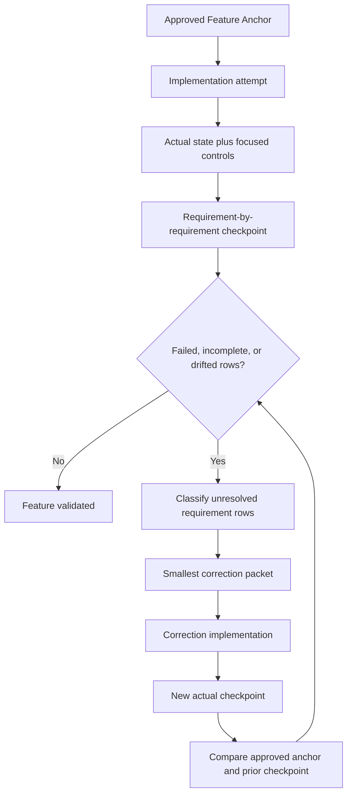
```mermaid
flowchart TB
    A["Approved Feature Anchor"] --> B["Implementation attempt"]
    B --> C["Actual state plus focused controls"]
    C --> D["Requirement-by-requirement checkpoint"]
    D --> E{"Failed, incomplete, or drifted rows?"}
    E -->|"No"| F["Feature validated"]
    E -->|"Yes"| G["Classify unresolved requirement rows"]
    G --> H["Smallest correction packet"]
    H --> I["Correction implementation"]
    I --> J["New actual checkpoint"]
    J --> K["Compare approved anchor and prior checkpoint"]
    K --> E
```

Example approved requirements:

```text
F-01 Claim amount validation

REQ-01 — Change
Zero claim amount must raise ClaimValidationError.

REQ-02 — Preserve
Positive claim amount remains accepted.

REQ-03 — Constraint
Reuse validate_claim_amount; do not create a parallel validator.

REQ-04 — Safety
Rejected claims must not reach persistence.

GLOBAL-01
No dependency, API, schema, or configuration change without approval.
```

#### First implementation attempt: partial success

| Requirement | Result | Evidence | Status |
| --- | --- | --- | --- |
| REQ-01 | Zero amount rejected in validator | Zero-value unit test passed | `validated` |
| REQ-02 | Positive amount accepted | Positive-value test passed | `validated` |
| REQ-03 | Shared validator reused | Source/diff inspection passed | `validated` |
| REQ-04 | Service catches error but still persists claim | Service-path test failed | `failed` |
| GLOBAL-01 | No dependency/API/configuration change | Changed-path check passed | `validated` |

```text
Feature status: incomplete

Validated:
- REQ-01
- REQ-02
- REQ-03
- GLOBAL-01

Unresolved:
- REQ-04

Next action:
Create a correction packet only for REQ-04.
```

Checkpoint example:

```md
# F-01 Checkpoint 001

## REQ-01 — Reject zero claim amount
Status: validated
Evidence: `test_rejects_zero_amount` passed; `validate_claim_amount` raises `ClaimValidationError`.

## REQ-02 — Preserve positive claim acceptance
Status: validated
Evidence: `test_accepts_valid_claim` passed.

## REQ-03 — Reuse shared validation path
Status: validated
Evidence: existing `validate_claim_amount` reused; no duplicate validator module.

## REQ-04 — Invalid claim must not reach persistence
Status: failed
Observed behavior: validation error is raised, but persistence still occurs.
Evidence: `test_invalid_claim_is_not_persisted` failed.
Affected files: `src/claims_api/service.py`, `tests/test_claim_service.py`.

## GLOBAL-01 — Dependency/API/schema/configuration posture
Status: validated
```

The failure creates a requirement-linked drift record:

```json
{
  "drift_id": "DRIFT-021",
  "checkpoint_id": "F-01-checkpoint-001",
  "requirement_uids": ["tt://run-.../P-01/F-01/v1/REQ-04"],
  "global_constraint_uids": ["tt://run-.../P-01/GLOBAL-02"],
  "state": "failed",
  "lens": "behavior-and-safety",
  "reason": "Validation failure does not stop persistence.",
  "affected_files": ["src/claims_api/service.py", "tests/test_claim_service.py"],
  "evidence_refs": ["controls/test-invalid-claim-not-persisted.json", "checkpoints/F-01-checkpoint-001.json"],
  "prior_status": "not-validated",
  "next_action": "correction-packet-004"
}
```

#### Correction packet: target only the unresolved work

TailTrail must not tell the agent “fix everything that is failing.” It produces a
narrow, evidence-backed packet:

```text
Correction packet: CP-004

Target:
REQ-04 — Invalid claim must not reach persistence.

Current failure:
Service catches ClaimValidationError but continues to persistence.

Allowed scope:
- src/claims_api/service.py
- tests/test_claim_service.py

Must preserve:
- REQ-01 zero amount rejection.
- REQ-02 positive amount acceptance.
- REQ-03 shared validator reuse.
- GLOBAL-01 no dependency/API/schema/configuration change.

Required correction:
Stop submission flow after ClaimValidationError.
Do not add controller-only validation or a duplicate validator.

Focused validation:
- test_invalid_claim_is_not_persisted
- test_rejects_zero_amount
- test_accepts_valid_claim
```

Previously validated requirements are preservation checks during correction; they
are not reopened as failures unless new evidence shows regression.

#### Second checkpoint: resolved versus regressed

If the correction succeeds without collateral damage:

| Requirement | Checkpoint 001 | Checkpoint 002 | Delta |
| --- | --- | --- | --- |
| REQ-01 | `validated` | `validated` | `preserved` |
| REQ-02 | `validated` | `validated` | `preserved` |
| REQ-03 | `validated` | `validated` | `preserved` |
| REQ-04 | `failed` | `validated` | `resolved` |
| GLOBAL-01 | `validated` | `validated` | `preserved` |

If the correction prevents persistence but accidentally rejects positive claims:

| Requirement | Checkpoint 001 | Checkpoint 002 | Delta |
| --- | --- | --- | --- |
| REQ-01 | `validated` | `validated` | `preserved` |
| REQ-02 | `validated` | `failed` | `regressed` |
| REQ-03 | `validated` | `validated` | `preserved` |
| REQ-04 | `failed` | `validated` | `resolved` |

The feature remains incomplete. The next packet targets REQ-02, while preserving
REQ-01, REQ-03, REQ-04, and GLOBAL-01. TailTrail must not declare success merely
because the latest failing requirement was fixed.

#### Iteration policy and feature completion

| Situation | Harness action |
| --- | --- |
| One row fails; others pass | Correct only failed row; rerun affected preservation evidence. |
| Related rows fail from one root cause | Use one packet when one path safely resolves them. |
| Separate root causes | Separate/prioritize packets; safety/public-contract first. |
| Correction resolves one row but breaks another | Record `regressed`; next packet targets regression. |
| Same row fails without new evidence | Stop retry; enter Recovery/Replan or `needs-decision`. |
| Unexpected API/dependency/schema/path change | Record `new-drift`; pause for approval if material. |
| All rows validate | Mark feature validated; run required integration evidence. |

Drift history remains append-only:

```text
REQ-04
  checkpoint-001: failed; invalid claim persisted; CP-004
  checkpoint-002: resolved; invalid-persistence test passed

REQ-02
  checkpoint-002: regressed; positive amount rejected; CP-005
  checkpoint-003: resolved
```

A feature is complete only when every approved `REQ-*` row is validated or
explicitly approved as deferred; every `GLOBAL-*` constraint is validated or has
an approved exception; no unresolved/new drift remains; no previously validated
row regressed in the latest checkpoint; required integration evidence passes; and
every changed file/symbol/test/hunk maps to a requirement, global constraint, or
justified discovery.

For a larger feature, the root `approved.md` can link to focused approved
scenarios, while `actual/` contains generated counterparts:

```text
.tailtrail/runs/<run-id>/
  approved.md
  scenarios/
    checkout.approved.md
    refund.approved.md
  actual.md
  actual/
    checkout.actual.md
    refund.actual.md
  comparison-report.md
```

Only a human can change an approved expected behavior. An agent may create a
proposal or regenerate `actual.md`, but it must never silently overwrite an
approved document. This prevents the scenario equivalent of test-chasing: an
agent cannot make a failing behavior check pass merely by rewriting the expected
output to match an incorrect implementation.

### Anchor Reconciliation and Closure

Implementation does not update the approved anchor to match the code. During
partial or complete work, TailTrail updates only actual checkpoints, requirement
evidence overlays, drift history, and feature status. At the end of a feature or
program, it performs an explicit **Anchor Reconciliation**: a final comparison of
the immutable approved anchor with final observed state and all relevant evidence.

```text
approved anchor = immutable desired-state contract
actual checkpoints = evolving observed implementation state
completion report = final reconciliation and closure record
```

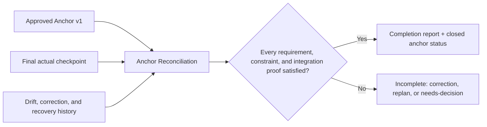
```mermaid
flowchart LR
    A["Approved Anchor v1"] --> D["Anchor Reconciliation"]
    B["Final actual checkpoint"] --> D
    C["Drift, correction, and recovery history"] --> D
    D --> E{"Every requirement, constraint, and integration proof satisfied?"}
    E -->|"Yes"| F["Completion report + closed anchor status"]
    E -->|"No"| G["Incomplete: correction, replan, or needs-decision"]
```

#### During partial implementation

Partial completion never removes or rewrites an approved requirement. TailTrail
records the current state against the anchor:

```text
Approved Anchor v1
- REQ-01 Reject zero amount.
- REQ-02 Preserve positive amount.
- REQ-03 Reuse shared validator.
- REQ-04 Prevent invalid persistence.

Checkpoint 001
- REQ-01 validated
- REQ-02 validated
- REQ-03 validated
- REQ-04 failed
```

The next correction targets REQ-04. The anchor remains unchanged because REQ-04
is still a required outcome. A correction updates actual evidence and drift
state, not approved desired behavior.

#### Final reconciliation inputs

The reconciler compares:

| Input | Question answered |
| --- | --- |
| Approved requirements and preserve rules | Did every `REQ-*` row reach its approved outcome or approved deferral? |
| Global constraints | Did every `GLOBAL-*` rule remain valid or receive an approved exception? |
| Final actual checkpoint | What code, paths, symbols, tests, and observed behavior exist now? |
| Drift/correction history | Is any drift unresolved, regressed, or hidden by a later change? |
| Requirement/evidence matrix | Does every required row have adequate linked proof? |
| Scope and recovery ownership | Is every changed file/symbol/test/hunk mapped to a requirement, global rule, or justified discovery? |
| Integration evidence | Do required cross-feature, service, API, persistence, or scenario checks pass? |
| Approval history | Did any material behavior/scope change receive the required Anchor v2 approval? |

#### Completion artifacts and statuses

Closing an anchor produces new artifacts; it does not mutate `approved-v1.md`:

```text
approved-v1.md                 immutable approved intent
actual/checkpoint-004.md       final observed state
anchor-completion-report.md    final reconciliation result
anchor-status.json             status and final checkpoint pointer
```

| Status | Meaning | Next action |
| --- | --- | --- |
| `complete-validated` | All approved requirements, constraints, and required integration evidence validate. | Handoff/review; close anchor. |
| `complete-with-decision` | A developer approved a documented exception, limitation, or deferral. | Handoff with decision clearly visible. |
| `incomplete` | One or more required rows/evidence remain failed or missing. | Continue bounded correction or replan. |
| `blocked` | Required authority, environment, dependency, or human decision is unavailable. | Preserve state and request the smallest decision. |
| `superseded` | Anchor v1 was materially replaced by approved Anchor v2. | Reconcile active version; retain v1 history. |

Example completion report:

```md
# Anchor Completion Report

Anchor: approved-v1
Final checkpoint: F-01-checkpoint-004
Status: complete-validated

## Requirements
- REQ-01 — Reject zero claim amount: validated
- REQ-02 — Preserve positive claim acceptance: validated
- REQ-03 — Reuse shared validation path: validated
- REQ-04 — Invalid claim must not reach persistence: validated

## Global constraints
- GLOBAL-01 — No dependency/API/schema/configuration change: validated

## Drift history
- DRIFT-021: resolved in checkpoint-002
- No unresolved or regressed drift remains.

## Integration evidence
- Valid submission scenario: passed
- Invalid submission scenario: passed

## Scope traceability
- Every changed file, symbol, test, and task-owned hunk maps to a requirement,
  global constraint, or justified discovery.
```

Example `anchor-status.json`:

```json
{
  "anchor_version": "approved-v1",
  "status": "complete-validated",
  "final_checkpoint": "F-01-checkpoint-004",
  "completion_report": "anchor-completion-report.md",
  "unresolved_requirement_uids": [],
  "unresolved_drift_ids": []
}
```

#### When an anchor version changes

| Situation | Anchor action |
| --- | --- |
| Partial implementation, failed test, or incomplete requirement | Keep anchor; update actual/drift/checkpoint evidence. |
| New internal caller discovered without material behavior/scope change | Keep anchor; record justified discovery and evidence. |
| Clarification without behavior change | Keep Anchor v1; record clarification history. |
| User changes desired behavior | Propose and approve Anchor v2. |
| API/schema/security/dependency/material architecture change | Propose and approve Anchor v2. |
| Work fully completes | Keep Anchor v1 immutable; create completion report/status. |

The governing rule is:

```text
The anchor does not move to match implementation.
Implementation is measured against the anchor.
Only human-approved desired-state change creates a new anchor version.
```

### Approved scenarios as behaviour anchors

For behavior that is easy to represent as domain data, `approved.md` can contain
or link to **approved scenarios** (also called approved fixtures). This approach
is based on the [Approved Scenarios pattern](https://lexler.github.io/augmented-coding-patterns/patterns/approved-scenarios/): validate the scenario runner once, then review human-readable input and expected output rather than large volumes of agent-written assertion code.

An approved scenario is not a generic snapshot. It should contain only the
domain-specific input, expected output, important side effects, and call sequence
that a reviewer can validate by eye.

| Scenario content | Why it belongs in the approved state |
| --- | --- |
| Input data, parameters, and initial state | Explains the condition the behavior must handle. |
| Expected result | Gives the agent and reviewer an unambiguous behavioral destination. |
| Expected side effects or service calls | Captures important workflow/order contracts where the final return value is insufficient. |
| Normalization rules | Excludes dynamic IDs, timestamps, ordering, or other non-deterministic values from false diffs. |
| Requirement link | Shows exactly which desired outcome the scenario proves. |
| Approval metadata | Makes clear who approved a changed expected behavior and why. |

Example approved scenario for a multi-step workflow:

```md
# Scenario: checkout with discount

## Input

User: premium member
Cart: laptop x1, mouse x1
Discount code: SAVE20

## Expected service calls

1. Reserve inventory for laptop and mouse.
2. Calculate pricing for the premium member and discount code.
3. Process payment for the discounted total.

## Expected result

Order: confirmed
Discount: applied
Email: order confirmation sent
```

When the scenario runner executes the current code, it writes the analogous
actual result. TailTrail then performs a domain-readable diff:

```text
Scenario: checkout with discount

Approved: pricing occurs before payment and discount is applied.
Actual: payment is attempted before pricing; no discount is applied.

Behaviour drift: required workflow order and price outcome are not satisfied.
Next correction: restore the pricing step before payment. Do not change the
approved scenario without human approval.
```

Approved scenarios are especially useful for API contracts, event payloads,
workflow transitions, CLI output, generated reports, call sequences, structured
JSON/YAML, and visually inspectable domain output. They are a poor fit for huge
opaque object graphs, unstable output, performance claims, or purely internal
implementation details. In those cases, the anchor should reference focused
tests, metrics, or another appropriate evidence type instead.

#### Scenario lifecycle

```text
1. Developer approves expected behavior in approved.md or <name>.approved.md.
2. Trusted runner executes the scenario against current code.
3. Runner writes actual.md or <name>.actual.md; it never overwrites approved.md.
4. TailTrail compares approved and actual state.
5. Agent receives a correction packet for a mismatch.
6. If the product requirement legitimately changes, the agent may draft a proposal.
7. Human reviews and explicitly promotes the proposal to approved state.
```

The runner itself is part of the harness and must be independently tested.
Otherwise a friendly fixture diff can provide false confidence because the
scenario execution logic is wrong.

## Task Recovery Boundary

Git remains TailTrail's long-term source of repository history, but a simple
rollback to Git `HEAD` is unsafe in a real developer workspace. A developer can
finish Task 1, leave its valid work uncommitted, then start Task 2 in the same
repository. If Task 2 fails, restoring the entire repository to `HEAD` would
erase Task 1 even though TailTrail did not need to undo it.

TailTrail therefore needs a **Task Recovery Boundary** for every approved
harness run:

> A local, append-only record of the current task's expected scope, pre-task
> state, task-owned changes, and recovery artifacts. It enables reversal of the
> current task without touching valid work that existed before that task began.

The recovery boundary is not a replacement for Git and must not claim to be a
repository backup service. In the default autonomous mode, it is a thin
requirement-to-Git-checkpoint ledger. It records which approved requirement is
represented by which local commit and what proof made that checkpoint valid.
Only the fallback mode needs exact source snapshots and hunk-level recovery
artifacts.

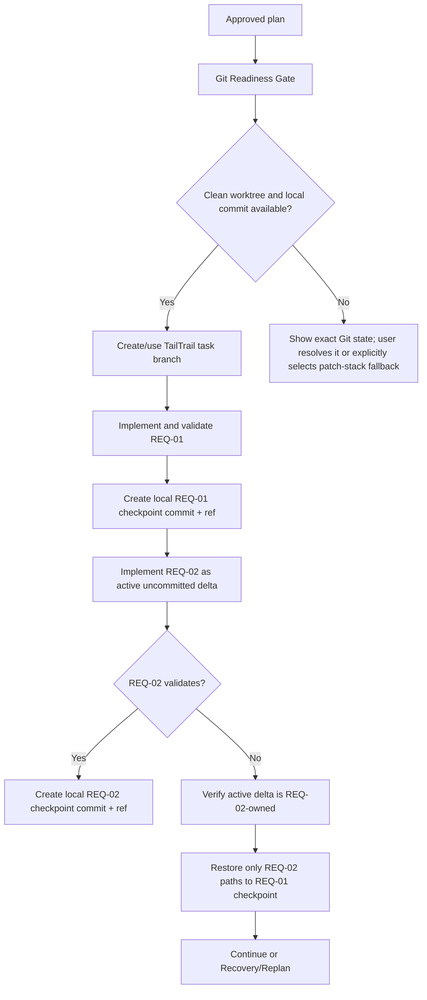
```mermaid
flowchart TB
    A["Approved plan"] --> B["Git Readiness Gate"]
    B --> C{"Clean worktree and local commit available?"}
    C -->|Yes| D["Create/use TailTrail task branch"]
    D --> E["Implement and validate REQ-01"]
    E --> F["Create local REQ-01 checkpoint commit + ref"]
    F --> G["Implement REQ-02 as active uncommitted delta"]
    G --> H{"REQ-02 validates?"}
    H -->|Yes| I["Create local REQ-02 checkpoint commit + ref"]
    H -->|No| J["Verify active delta is REQ-02-owned"]
    J --> K["Restore only REQ-02 paths to REQ-01 checkpoint"]
    K --> L["Continue or Recovery/Replan"]
    C -->|No| M["Show exact Git state; user resolves it or explicitly selects patch-stack fallback"]
```

### Why GitHub and Git `HEAD` are not enough

GitHub only knows pushed commits. Git `HEAD` only represents committed history.
Neither contains Task 1 if the developer has finished it locally but has not
committed it. A hash alone can detect a changed file but cannot restore the
pre-task bytes that are needed for exact recovery.

TailTrail has two explicit recovery modes. **Mode A is the default. Mode B is a
fallback, never an invisible downgrade.**

| Mode / option | Assessment |
| --- | --- |
| Reset repository to Git `HEAD` | Unsafe; destroys all uncommitted work. Never the default. |
| **Mode A: clean-worktree local requirement checkpoints** | **Default for autonomous delivery.** Each validated requirement is a local commit/ref on a TailTrail task branch. No network, credentials, or remote push are required. |
| Mode B: patch-stack snapshots and reconciliation | Explicit fallback for a workspace that cannot be made clean or cannot safely create a requirement commit. More evidence-heavy and used only after user selection. |

### Mode A (default): Git Readiness Gate and local requirement checkpoints

Navigator may inspect and plan in a dirty repository, but an autonomous writing
run cannot start until the **Git Readiness Gate** passes. This deliberately
makes the normal recovery path cheap: Git stores the validated state, and the
active requirement is the only uncommitted delta.

| Gate check | Required in Mode A | Reason |
| --- | --- | --- |
| Repository and current `HEAD` exist | Yes | A local checkpoint needs a valid Git base. |
| Working tree has no staged, unstaged, or untracked files (other than policy-approved ignored files) | Yes | Prevents TailTrail from accidentally committing, reverting, or masking prior work. |
| Current branch is known and a TailTrail task branch can be used | Yes | Keeps requirement commits isolated from the user's main branch. |
| Local commit can be created | Yes | Proves the primary recovery mechanism is available. |
| Remote, GitHub access, or credentials | No | Push is a later delivery action, not a recovery dependency. |

If the gate fails, TailTrail must show the exact paths and stop before writing.
It must never silently stash, commit, reset, discard, or delete user work.

```text
TailTrail Git Readiness Gate

Autonomous requirement checkpoints require a clean worktree.

Detected:
- Modified: src/claims_api/service.py
- Untracked: notes/experiment.md

Resolve before implementation:
1. Commit the existing work.
2. Stash the existing work.
3. Discard it yourself.
4. Explicitly select Mode B: patch-stack fallback.
```

After a requirement's focused proof passes, TailTrail stages only the approved,
requirement-owned change, creates a local checkpoint commit, and records an
immutable local ref such as
`refs/tailtrail/runs/<run-id>/requirements/<requirement_uid>`. The user may
later squash or reorganize commits during normal delivery; TailTrail keeps the
ref only for the active run's recovery/audit lifecycle.

```text
REQ-01 validates
  -> local commit on tailtrail/<run-id>
  -> ref: refs/tailtrail/runs/<run-id>/requirements/claims-v1/REQ-01
  -> REQ-02 starts with REQ-01 as its Git base

REQ-02 fails before validation
  -> verify current diff is only REQ-02-owned paths/hunks
  -> restore those paths to the REQ-01 checkpoint
  -> REQ-01 commit remains untouched
```

Mode A recovery is deliberately computational and low-context:

1. Read the active requirement's commit/ref and allowed path receipt.
2. Compute the current Git diff against the last validated requirement commit.
3. If that diff contains only the active requirement's approved paths and
   expected changes, restore **only those paths** to the last validated local
   checkpoint. No model reasoning, snapshot loading, or whole-repository reset
   is needed.
4. If the diff contains an unexpected path, hunk, staged change, or manual edit,
   stop the automatic restore. Preserve the worktree and offer Recovery/Replan
   or the explicit Mode B patch-stack fallback.
5. Create a recovery receipt. Re-run earlier requirement proof only if recovery
   required reconciliation or changed a dependency/path in its preservation
   matrix; an exact return to the validated Git checkpoint reuses its recorded
   proof receipt.

### Implemented V1: conflict classification and bounded reconciliation

Mode A now also supports a narrow overlap-aware recovery path through
`tailtrail harness reconcile`. The execution agent supplies the exact patch it
created for the active requirement. TailTrail never guesses task ownership from
line numbers, timestamps, or a whole-file hash; it asks Git whether that exact
patch can be reversed from the current workspace.

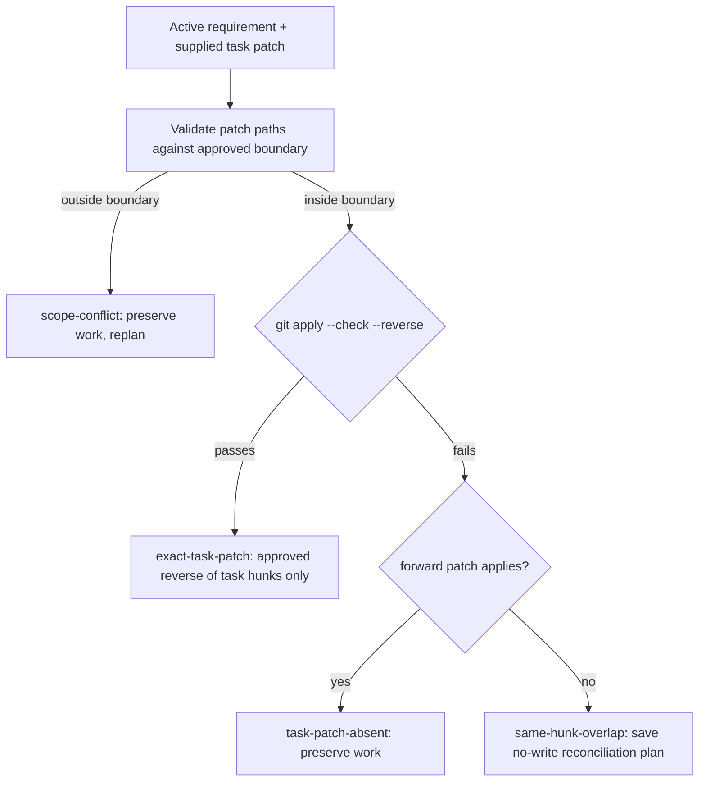
```mermaid
flowchart TB
    A["Active requirement + supplied task patch"] --> B["Validate patch paths against approved boundary"]
    B -->|"outside boundary"| C["scope-conflict: preserve work, replan"]
    B -->|"inside boundary"| D{"git apply --check --reverse"}
    D -->|"passes"| E["exact-task-patch: approved reverse of task hunks only"]
    D -->|"fails"| F{"forward patch applies?"}
    F -->|"yes"| G["task-patch-absent: preserve work"]
    F -->|"no"| H["same-hunk-overlap: save no-write reconciliation plan"]
```

An exact reverse is safe even if another tracked file has valid uncommitted
work: TailTrail records SHA-256 fingerprints for those unrelated changed paths,
reverses only the supplied patch after `--approved`, and verifies those
fingerprints stayed unchanged. A same-hunk overlap is deliberately *not*
auto-merged. The artifact records the classification, patch paths, unrelated
paths, reverse-check evidence, decision, and safety boundary at
`.tailtrail/runs/<run-id>/recovery/reconciliation/assessment-<n>.json`.

```powershell
py -3 scripts/tailtrail.py harness reconcile plan --root . --run-id claim-validation --task-patch .tailtrail/task.patch
py -3 scripts/tailtrail.py harness reconcile apply --root . --run-id claim-validation --task-patch .tailtrail/task.patch --approved
```

V1 rejects binary, copied, renamed, untracked, and unsafe-path patches. It does
not implement a three-way merge, synthesize a conflict resolution, reset the
repository, or alter a prior validated requirement commit. A later version may
add an agent-led reconciliation proposal, but only after it can prove a unique
approved-intent-preserving result.

This means SHA-256 file fingerprints and full snapshots are not normal
per-requirement costs in Mode A. Git's commit graph and diff are the source of
truth. Those additional artifacts exist only when Mode B is explicitly active.

The remote push happens only at a user-requested milestone, final delivery, or
explicit release workflow. A credential, network, or remote-conflict failure
cannot lose local requirement checkpoints; it only delays publication.

### Mode B (explicit fallback): patch-stack recovery

Use Mode B only when the user deliberately keeps a dirty worktree, a local
checkpoint commit is unavailable, or project policy prohibits the Mode A branch
workflow. It preserves earlier work using task-scoped snapshots, patches,
fingerprints, symbol anchors, and focused preservation proof. This is slower
and can require bounded AI reconciliation, which is why it is not the default.

**Implemented V1:** `tailtrail harness mode-b capture|seal|plan|apply` captures
the active requirement's approved-path baseline, seals its after-state
fingerprints and unified patch, then restores only paths whose current content
still exactly matches that sealed task state. Any later edit becomes an overlap
and a no-write plan. `tailtrail harness diagnose` is invoked only with repeated
failure artifacts; it derives local-evidence hypotheses and a bounded replan
direction, but cannot merge, modify source, or change approved intent.

### Boundary creation at anchor approval

Before the execution agent can edit source, TailTrail records the recovery
boundary alongside the approved anchor. In Mode A, it records the clean-worktree
receipt, task branch, base commit, expected requirement paths, and checkpoint
ref plan. In Mode B, it additionally captures the snapshots and hunk metadata
needed for patch-stack recovery. It should not map or copy the entire repository.

```text
Task Recovery Boundary

Run ID: claim-limit-002
Anchor: approved-v1
Mode: A (clean-worktree local Git checkpoints)
Git base: abc1234
Task branch: tailtrail/claim-limit-002
Worktree clean: yes

Expected task paths:
- src/claims_api/validation.py
- src/claims_api/service.py
- tests/test_claim_validation.py

Excluded by default:
- all other repository files
- protected/API/schema/dependency paths without explicit approval
```

The boundary must capture:

| Artifact | Why it is required |
| --- | --- |
| Mode A: Git base, task branch, local requirement commit/ref, and validation receipt | Primary recovery pointer and proof of the retained requirement state. |
| Mode A: expected paths and active requirement diff receipt | Verifies that an unvalidated requirement may be restored without touching prior checkpoint commits. |
| Mode B: pre-task content hash and exact pre-task file content/local baseline patch | Detects change and enables recovery when the worktree cannot be made clean. |
| Mode B: task-owned patch, unified diff context, and symbol/AST anchors | Identifies the current task's contribution when source moved or overlaps. |
| Mode B: ownership ledger and new/deleted file records | Separates pre-existing, current-task, user, and unknown changes. |
| Both modes: requirement recovery manifest | Links requirement, proof, checkpoint/ref, and (in Mode B) owned hunk/recovery evidence. |

Line numbers may be included for display, but they are not sufficient recovery
identifiers. Mode A normally recovers through a local checkpoint commit. Mode B
prefers exact patch context, content hashes, and symbol anchors.

### Recovery artifact layout by mode

```text
# Mode A: default clean-worktree Git checkpoint mode
.tailtrail/runs/<run-id>/
  approved-v1.md
  approved-v1.json
  git-readiness.json
  requirements/
    claims-v1--REQ-01.json  # branch, commit/ref, owned paths, proof receipt
    claims-v1--REQ-02.json

# Mode B only: explicit patch-stack fallback
  recovery-boundary/
    manifest.json
    ownership-ledger.json
    baseline/
      validation.py.before
      service.py.before
  checkpoints/
    001/
      actual.md
      checkpoint.json
      task-owned.patch
  recovery/
    reverse-current-task.patch
    recovery-plan.md
    requirement-recovery-manifest.json
```

These files are private local state and should be ignored by normal Git commits.
Mode B files may contain exact source necessary for recovery, so TailTrail must
not send them to telemetry, learning, model providers, or shared metadata by
default.

### Expected scope versus actual task ownership

`approved.md` defines the expected impact boundary. It does not need a list of
every non-impacted file in the repository. Everything outside the approved scope
is excluded by default and should be treated as a scope event if changed.

| Classification | Meaning | Recovery posture |
| --- | --- | --- |
| Expected task path | File was listed in the approved anchor. | In Mode A, include it in the active requirement diff receipt; in Mode B, track owned hunks. |
| Justified discovered path | Important caller/test discovered by Code Graph and allowed by the anchor's expansion rule. | In Mode A, add it to the active diff receipt before commit; in Mode B, add to ledger and baseline before edit. |
| Material scope expansion | API, schema, security, dependency, protected, or unrelated path. | Pause; require approval before adding it to task ownership. |
| Pre-existing changed path | File already had user/earlier-task changes before this run. | Mode A rejects it at readiness; Mode B preserves it as a baseline. |
| Unknown changed path | Changed after task start but no ownership/approval evidence exists. | Mode A rejects automatic restore and routes to Mode B/recovery planning; Mode B classifies ownership before any write. |

The actual-state report should compare expected and observed paths:

```text
Expected scope:
- validation.py
- service.py
- focused tests

Actual task-owned paths:
- validation.py
- service.py
- focused tests

Unexpected path:
- controller.py

Decision:
controller.py is outside the approved task. Treat as architecture/scope drift;
do not include it in automatic recovery until ownership is resolved.
```

### Mode B conflict reconciliation is agent-led, not an automatic human handoff

An overlap is not automatically a request for a person to inspect a merge.
Most conflicts have a safe answer already present in the approved anchor, the
requirement-to-impact matrix, the ownership ledger, current source, and focused
controls. TailTrail should use that evidence before it interrupts the user.

The recovery engine first classifies the conflict, then asks a bounded AI
Conflict Resolver (or the Recovery Diagnostician after repeated failures) to
produce a reconciliation plan. The resolver does not receive authority to
invent a new product decision or overwrite unrelated work.

| Conflict class | Typical cause | Default agent action | Requires a decision only when |
| --- | --- | --- | --- |
| Context/fingerprint mismatch | A formatter or nearby edit shifted the hunk. | Re-locate with symbol and AST/context anchors; rebuild a scoped reverse patch. | The intended symbol cannot be identified. |
| Same-file, non-overlapping change | Task 1 and Task 2 changed different regions of one file. | Preserve Task 1 baseline region and reverse/reconcile Task 2-owned hunks. | Never, if ownership remains clear. |
| Same-hunk overlap | A user or Task 1 edit shares lines with Task 2's patch. | Perform a three-way semantic merge from baseline, task-owned delta, and current file; validate preservation controls. | Both alternatives satisfy different approved requirements or the current edit has unknown intent. |
| Rename/move/delete | A symbol/path moved after the boundary. | Use AST/symbol anchors and Git-aware rename evidence to find the new location; rebuild the smallest patch. | The file/symbol was deliberately removed for an incompatible approved change. |
| Requirement/architecture conflict | Task 2's solution breaks REQ-01, a protected path, or a required call path. | Restore/reconstruct the approved REQ-01 behavior, then replan Task 2 within remaining boundaries. | The approved requirements themselves are incompatible. |
| Policy/dependency conflict | Recovery would add a package, change schema, or touch a protected boundary. | Do not make that expansion; seek an existing approved path or emit a replan. | A material dependency, schema, security, or public-contract choice is necessary. |
| Evidence conflict | Tests, source, and approved scenario disagree. | Run the smallest decisive computational check and inspect the exact path. | Evidence still supports multiple incompatible desired behaviors. |

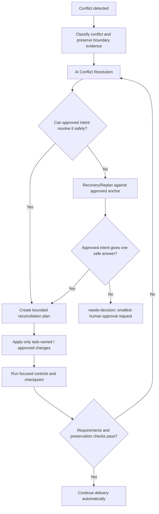
```mermaid
flowchart TB
    A["Conflict detected"] --> B["Classify conflict and preserve boundary evidence"]
    B --> C["AI Conflict Resolution"]
    C --> D{"Can approved intent resolve it safely?"}
    D -->|"Yes"| E["Create bounded reconciliation plan"]
    E --> F["Apply only task-owned / approved changes"]
    F --> G["Run focused controls and checkpoint"]
    G --> H{"Requirements and preservation checks pass?"}
    H -->|"Yes"| I["Continue delivery automatically"]
    H -->|"No"| C
    D -->|"No"| J["Recovery/Replan against approved anchor"]
    J --> K{"Approved intent gives one safe answer?"}
    K -->|"Yes"| E
    K -->|"No"| L["needs-decision: smallest human approval request"]
```

The status is therefore one of `reconciling`, `reconciled`,
`replan-required`, `needs-decision`, or `blocked`. `blocked` is reserved for a
real external inability such as a required unavailable credential or an
explicit policy prohibition; it is not a synonym for an ordinary merge conflict.

### Mode B selective recovery algorithm

Recovery should reverse the current task's delta, not restore entire files or
the entire repository. The algorithm must be conservative:

1. Freeze the latest checkpoint and record the current working-tree fingerprints.
2. Build the reverse patch from task-owned changes relative to the task baseline.
3. Check that the current file still matches the expected task-owned context.
4. If it matches, apply the reverse patch only to the owned hunks.
5. If context changed, classify the conflict and build a three-way
   reconciliation using baseline, latest task-owned state, and current
   working-tree state.
6. Give the Conflict Resolver only the approved requirement slice, recovery
   manifest, relevant source, and exact failed controls. It must choose the
   smallest patch that preserves pre-existing valid work and satisfies approved
   intent.
7. Run the preservation proof for previously validated requirements and the
   focused recovery proof for the active requirement.
8. Continue automatically when the result is evidenced. Enter
   `needs-decision` only if the evidence exposes a genuine product, authority,
   schema, public-contract, dependency, or incompatible-requirement choice.
9. Record recovery as a new checkpoint; never erase prior checkpoints.

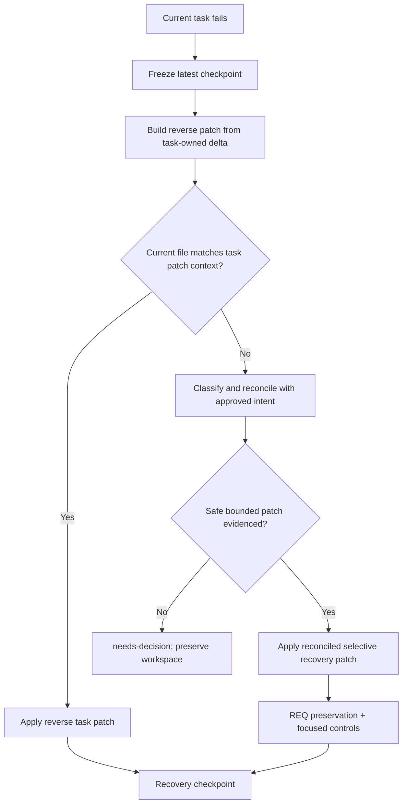
```mermaid
flowchart TB
    A["Current task fails"] --> B["Freeze latest checkpoint"]
    B --> C["Build reverse patch from task-owned delta"]
    C --> D{"Current file matches task patch context?"}
    D -->|Yes| E["Apply reverse task patch"]
    D -->|No| F["Classify and reconcile with approved intent"]
    F --> G{"Safe bounded patch evidenced?"}
    G -->|Yes| H["Apply reconciled selective recovery patch"]
    G -->|No| J["needs-decision; preserve workspace"]
    E --> I["Recovery checkpoint"]
    H --> K["REQ preservation + focused controls"]
    K --> I
```

### Mode B recovery modes

| Mode | Preconditions | TailTrail action |
| --- | --- | --- |
| Automatic reverse patch | Task-owned hunk context and file fingerprints still match expected state. | Reverse only current-task hunks. |
| Reconciled three-way recovery | File changed, but source, ownership, and approved intent yield one safe merged result. | Apply a bounded reconciliation patch, then run preservation and recovery controls. |
| Replan-required | A safe patch exists only after the active requirement's implementation approach changes. | Preserve all evidence, create a bounded replan packet, and continue automatically. |
| Needs decision | The evidence supports multiple incompatible behavior/authority choices. | Do not make the material choice; preserve workspace and present the exact decision. |

TailTrail must never silently overwrite a whole file because it belongs to the
current task. A file can contain valid prior work, user edits made during the
run, or overlapping work from another task.

### Mode B Requirement Recovery Manifest: enough evidence to preserve REQ-01 and undo REQ-02

This section applies when the user explicitly selected Mode B. File ownership
alone is not enough in that mode. It can prove that Task 2 edited a hunk, but it
cannot prove that reversing the hunk still preserves REQ-01's behavior. TailTrail
therefore needs two linked evidence layers:

1. **Mechanical recovery evidence** identifies exactly what REQ-02 changed and
   how to reverse or reconcile it.
2. **Semantic preservation evidence** proves that REQ-01 remains satisfied
   after that operation.

At the start of REQ-02, the Mode B harness captures a baseline *after REQ-01
has passed its checkpoint*. This makes the valid REQ-01 implementation the
retained state, even if it is uncommitted. Each REQ-02 patch hunk then points to
the requirement UID, its baseline and current fingerprints, relevant symbols,
and the exact proof that must keep REQ-01 valid.

```json
{
  "run_id": "claims-feature-018",
  "cycle_id": "F-02-C-01",
  "baseline_checkpoint": "F-01-checkpoint-004",
  "preserve_requirement_uids": ["claims-v1/REQ-01"],
  "active_requirement_uids": ["claims-v1/REQ-02"],
  "baseline_files": [
    {
      "path": "src/claims_api/service.py",
      "fingerprint": "sha256:task2-baseline",
      "local_snapshot_ref": "recovery-boundary/baseline/service.py.before"
    }
  ],
  "owned_hunks": [
    {
      "hunk_id": "H-02-003",
      "requirement_uid": "claims-v1/REQ-02",
      "path": "src/claims_api/service.py",
      "symbol": "submit_claim",
      "forward_patch_ref": "checkpoints/006/task-owned.patch#H-02-003",
      "reverse_patch_ref": "recovery/reverse-req-02.patch#H-02-003"
    }
  ],
  "required_preservation_proof": [
    "tests/test_customer_identifier.py::test_submit_preserves_customer_id",
    "tests/test_claim_validation.py::test_existing_positive_claim_still_submits"
  ],
  "active_recovery_proof": [
    "tests/test_claim_limit.py::test_limit_failure_is_not_reported_as_success"
  ]
}
```

#### Why the file fingerprint is captured

A SHA-256 fingerprint is a **safety detector**, not a rollback mechanism. The
exact local snapshot and REQ-02 reverse patch provide recovery material; the
fingerprints tell the harness whether that material can be applied directly or
must first be reconciled with newer work.

The preservation record created after REQ-01 validates, and before REQ-02 is
allowed to write, should be explicit about both states:

```json
{
  "requirement_uid": "claims-v1/REQ-01",
  "requirement_statement": "Preserve and submit customer identifier with every claim.",
  "checkpoint_id": "F-01-checkpoint-004",
  "status": "validated",
  "retained_baseline_for_next_requirement": true,
  "files": [
    {
      "path": "src/claims_api/service.py",
      "snapshot_ref": "recovery-boundary/baseline/service.py.before-req-02",
      "baseline_fingerprint": "sha256:aaa...",
      "req_02_after_fingerprint": "sha256:bbb...",
      "symbols": ["submit_claim"],
      "req_01_owned_hunks": ["H-01-001", "H-01-002"]
    }
  ],
  "required_preservation_proof": [
    "tests/test_customer_identifier.py::test_submit_preserves_customer_id",
    "tests/test_claim_validation.py::test_existing_positive_claim_still_submits"
  ]
}
```

During REQ-02 recovery, TailTrail calculates the current fingerprint of
`service.py` and compares it with `req_02_after_fingerprint`:

| Current-file result | Meaning | Safe next action |
| --- | --- | --- |
| Fingerprint matches | No later change is detected after the REQ-02 checkpoint. | Apply the known REQ-02 reverse patch to its owned hunks, then run REQ-01 preservation proof. |
| Fingerprint differs, but owned hunk context matches | A non-overlapping or nearby change occurred. | Keep the newer source, apply a scoped hunk-level reverse/reconciliation patch, then run preservation proof. |
| Fingerprint and hunk context differ | Later work overlaps or the source moved. | Use the snapshot, owned-hunk/symbol anchors, approved intent, and focused controls to build a three-way reconciliation; never replace the whole file. |

The fingerprint therefore answers **“may the old patch be applied as-is?”** It
never answers **“what should be restored?”**. The snapshot answers that second
question, the owned patch identifies what REQ-02 contributed, and REQ-01's
focused tests prove that the preserved behavior still holds.

The manifest is local, append-only, ignored by Git, and never sent to model
providers or telemetry by default. `requirement_uid`, not the display label
`REQ-01`, is the durable join key across the approved slice, actual state,
drift record, patch hunk, recovery checkpoint, and Evaluation Harness result.

```mermaid
flowchart LR
    A["REQ-01 validated checkpoint"] --> B["Capture REQ-02 baseline<br/>after REQ-01"]
    B --> C["REQ-02 owned hunks + reverse patch"]
    C --> D{"REQ-02 fails or is abandoned"}
    D --> E["Reconcile/reverse REQ-02 hunks only"]
    E --> F["Run REQ-01 preservation proof"]
    F --> G{"REQ-01 still valid?"}
    G -->|Yes| H["Record REQ-02 recovery; continue/replan"]
    G -->|No| I["Reconstruct approved REQ-01 state from baseline + evidence"]
    I --> J["Run focused proofs again"]
```

### Example: REQ-01 is retained; REQ-02 fails

```text
REQ-01 (already validated):
- Preserve and submit the customer identifier in src/claims_api/service.py.
- Work is correct but remains uncommitted.

REQ-02 (active):
- Add claim-limit behavior in src/claims_api/service.py.
- Agent fails after three correction cycles.
```

At REQ-02 approval, TailTrail captures the exact REQ-01-valid version of
`service.py` as the REQ-02 baseline. The REQ-02 patch contains only
claim-limit hunks, while the manifest lists the customer-ID proof as a required
preservation control.

```text
REQ-02 selective recovery:
- reverse only claim-limit hunks
- restore/reconcile service.py to its REQ-02 baseline
- preserve REQ-01 customer identifier work
- rerun the REQ-01 customer-ID test before the checkpoint is accepted
```

If the developer manually changed the same claim-limit hunk while REQ-02 was
running, TailTrail first attempts an intent-guided three-way reconciliation. It
may safely keep the manual change when it is compatible with the approved
requirements, or rebuild the REQ-02 patch around it. It asks for a decision only
if, for example, the manual edit deliberately changes the public error contract
while the approved anchor requires the old contract and neither choice has
authority over the other.

When REQ-02 changed the same lines that REQ-01 originally introduced, a raw
reverse patch may be insufficient. TailTrail must reconstruct the retained
state from the REQ-02 baseline, REQ-01's approved/actual evidence, and current
source; then it must rerun REQ-01 proof. This is why the recovery manifest keeps
both hunk-level provenance and requirement-level preservation proof.

### New and deleted files

New and deleted files need ownership rules too:

| File event | Safe recovery rule |
| --- | --- |
| New file created and modified only by current task | Remove automatically as part of the evidenced reverse patch; record the deletion in the recovery checkpoint. |
| New file changed later by user/another task | Classify ownership and reconcile. Do not delete unless the manifest and current evidence establish that the remaining content is current-task-owned. |
| Existing file deleted by current task | Restore from task baseline only when ownership/context is verified. |
| Generated file changed by current task | Follow project policy and regenerate through the approved generator when possible; enter `needs-decision` only when the generator, provenance, or policy authority is unavailable. |

### Recovery is not completion

Selective recovery restores a safe prior task boundary; it does not prove the
underlying requirement is solved. After recovery, Navigator should enter
Recovery/Replan mode with the preserved anchor, checkpoints, failures, and
recovery result. It should not restart from zero or discard evidence.

### Recovery Diagnostician: optional and threshold-triggered

TailTrail should not add another model call to every normal correction cycle.
The deterministic Harness controls and regular TailTrail Review are the default
first line of defense. A specialized **Recovery Diagnostician** is useful only
when the correction budget is exhausted, the same gap repeats, several approved
requirements regress, or the root cause remains semantically unclear.

Its role is not to make a new implementation. Its role is to analyze preserved
evidence and recommend the smallest next investigation or recovery strategy.

| Input | Purpose |
| --- | --- |
| Approved anchor and approved scenarios | Establish the intended behavior and boundaries. |
| Checkpoint deltas and task-owned patches | Show what changed, improved, repeated, or regressed. |
| Exact failed controls and focused tests | Ground hypotheses in observed evidence. |
| Relevant source/caller/impact map | Avoid rediscovering the entire repository. |
| Recovery boundary and conflict state | Prevent a diagnosis from proposing unsafe rollback. |

The Diagnostician should output:

```text
Root-cause hypotheses:
1. Service catches ClaimValidationError and maps it to success. Evidence: service test and call path.
2. Submission scenario expectation may be ambiguous. Evidence: existing contract test conflicts with approved behavior.

Recommendation:
- inspect service error-mapping branch before changing tests
- if public response contract is intentionally changing, create approved-v2
- otherwise issue a bounded service-path correction

Confidence: inferred, not confirmed
```

It must label hypotheses as inferred and stop at `needs-decision` where evidence
cannot determine the right product behavior. It receives a compact recovery
packet, not raw conversation history or the whole repository.

## Architecture Fitness Harness

The **Architecture Fitness Harness** compares the actual shape of a change to
the architectural expectations in the approved Change Intent Anchor. It answers:

> Did the agent achieve the desired behavior through the intended system path,
> while preserving the boundaries that make the project maintainable?

**Implementation status:** Architecture Fitness Harness V1 is implemented as a
deterministic local sensor. It evaluates approved required/protected paths and
Python AST forbidden-import rules, writes a run-linked assessment artifact, and
exposes that saved evidence for MCP inspection. The broader layer-direction,
runtime-path, and cross-language rules described below remain future extensions.

This matters because a change can appear to work in one test while being placed
in the wrong layer, bypassing shared validation, duplicating business logic, or
creating a forbidden dependency direction.

```text
Approved path:
request -> service -> shared validation -> domain error

Architecture drift:
request -> controller-only special case -> success response
```

The first path keeps the business rule reusable and consistent across callers.
The second may satisfy one local test while allowing other callers to bypass the
rule entirely.

### Architecture rules belong in the anchor

Architecture fitness is project-specific. TailTrail should not invent a universal
layering model. Instead, the user/team defines a small set of relevant rules in
policy, a harness template, or the anchor itself.

| Architecture expectation | Computational evidence | Example drift |
| --- | --- | --- |
| Layer direction | Import/call graph, AST rule, architecture test | Controller directly imports repository/database module. |
| Required business path | Call graph and focused integration test | Submission bypasses shared validation helper. |
| Forbidden dependency | Manifest/import diff and dependency gate | Small validation change adds a new validation package. |
| Protected boundary | Changed-path check and policy | Agent modifies auth, schema, or generated code without approval. |
| Module ownership | File structure, symbols, and local conventions | Domain logic is added to UI/controller instead of service/domain layer. |
| Public contract stability | API/schema diff and focused contract test | Error response shape changes unexpectedly. |

Architecture sensor output must name the boundary and the proof, not merely say
"architecture issue."

```text
Architecture drift: the zero-amount rule was added in the HTTP controller.

Anchor expectation:
All claim submissions use src/claims_api/validation.py through the service path.

Evidence:
- controller now checks amount == 0 directly
- service path remains unchanged
- another claim caller does not use the controller path

Required correction:
Move the rule to the shared validation path, then run the focused caller tests.
```

### Architecture fitness states

| State | Meaning | Next action |
| --- | --- | --- |
| `preserved` | Actual code follows approved boundaries and paths. | Continue behavior/completion review. |
| `drifted` | Actual code violates an approved boundary or bypasses a required path. | Issue bounded correction task. |
| `expanded-needs-approval` | A legitimate solution requires a new boundary, dependency, API, or data-model change. | Re-anchor and obtain approval. |
| `unknown` | Static evidence cannot establish the path or boundary. | Inspect exact source or run an approved focused check. |

Architecture fitness should begin with deterministic, explainable local signals:
changed paths, imports, AST relationships, known module rules, and focused
contract tests. Inferential review can then decide whether an unusual structure
is justified, but it should not replace direct source and structural evidence.

### Code Mapper: optional architecture evidence, not a Version 1 graph subsystem

Code Mapper is valuable for architecture fitness, but Harness Engineering Version
1 does not need persistent `approved-code-map`, `actual-code-map`, and
`graph-drift` artifacts for every task. The existing Requirement-to-Impact
Matrix, approved scope/architecture expectations, actual changed files/symbols,
diff/caller inspection, and focused controls already cover the core completion
loop.

The Version 1 position is:

```text
Use Code Mapper as an on-demand Navigator/Harness sensor.
Do not make a persistent graph-drift subsystem mandatory.
Do not treat graph output as source-of-truth completion proof.
```

Navigator uses Code Mapper when task complexity justifies it and carries the
relevant relationships into the approved matrix/anchor. Harness invokes it again
when scope or architecture ambiguity appears, then records its result as linked
checkpoint evidence.

```mermaid
flowchart LR
    A["Navigator + Code Mapper"] --> B["Approved impact and relationship assertions"]
    B --> C["Implementation"]
    C --> D["Actual diff, source, tests"]
    D --> E["Code Mapper only when relevant"]
    E --> F["Architecture/scope checkpoint evidence"]
    F --> G["Correction, replan, or review"]
```

Example approved relationship assertion:

```text
REQ-01: Reject zero claim amount

Expected path:
API -> service.submit_claim -> validate_claim -> validate_claim_amount

Expected files:
- src/claims_api/validation.py
- src/claims_api/service.py
- tests/test_claim_validation.py

Allowed discovery:
- Existing API mapper or service-path test only when local evidence confirms it.

Forbidden without approval:
- New validator module
- Dependency manifest change
- Public API, schema, or security path
```

After implementation, a lightweight checkpoint can record:

```text
REQ-01: validated
Architecture: preserved
Observed path: service.submit_claim -> validate_claim -> validate_claim_amount
Changed files: validation.py, test_claim_validation.py
Evidence: local AST map + focused test receipt
```

Or it can report a precise drift:

```text
REQ-01: new-drift
Lens: architecture + reuse

Expected path:
API -> service -> shared validator

Observed new path:
API -> api.validate_amount

Unexpected node:
src/claims_api/api_validation.py

Risk:
Duplicate validation and shared validation bypass.

Required correction:
Reuse validate_claim_amount through the service path.
```

#### When Code Mapper is selected

| Task shape | Code Mapper posture |
| --- | --- |
| Documentation, formatting, isolated test-only change | Skip. |
| One-file validation/bug fix with known caller | Lightweight/optional; use only if scope ambiguity appears. |
| Multi-file business logic, reuse constraint, or likely caller impact | Select local mapper evidence during Navigator and checkpoint comparison. |
| Public API, schema, security, dependency, architecture boundary, or refactor discovery | Select Code Mapper plus exact source and focused contract/integration proof. |
| Program Delivery integration checkpoint | Use relevant relationship assertions to validate cross-feature paths. |

Code Mapper is strong at new files/imports/modules, changed symbols/callers,
likely layer violations, duplicate/bypass paths, test proximity, and dependency
hints. It is weak at dynamic dispatch, reflection, dependency injection,
generated code, framework magic, and full runtime semantics. Every result must
therefore retain its evidence label such as `local-ast`, `local-source`,
`heuristic`, `provider-backed`, or `measured/validated`.

#### Promotion criteria and metrics

Do not build a persistent graph-drift layer until evidence from real Harness V1
runs shows it is needed. Promote relationship assertions into versioned graph
artifacts only if repeated tasks demonstrate that ordinary matrix/diff/caller
evidence misses material architecture drift.

| Metric | What to measure | Promotion signal |
| --- | --- | --- |
| Missed architecture drift | Later review/integration finds bypass, duplicate path, or wrong layer not caught by V1 evidence. | Recurring confirmed misses across representative multi-file tasks. |
| Mapper precision | Mapper findings confirmed by exact source/review divided by total findings. | High enough that added graph artifacts will not become noisy. |
| Correction value | Architecture findings that lead to a valid correction without another human rediscovery. | Repeated useful correction packets. |
| Manual investigation cost | Times developers must manually reconstruct caller/edge impact after Navigator planning. | Persistent friction on multi-module/refactor tasks. |
| Artifact overhead | Time/context/storage required to create, compare, and interpret graph slices. | Low enough relative to confirmed value. |

The next step, if warranted, is a small **relationship-assertion layer**, not a
full repository graph snapshot. It stores only approved expected paths and
observed relevant edges per requirement. Full `approved-code-map-slice`,
`actual-code-map-slice`, and graph-drift artifacts remain deferred until local
evidence proves they improve completion more than they add complexity.

## Behaviour Harness

**Implementation status:** Behaviour Harness V1 is implemented as a
requirement-linked scenario-evidence assessor. It records a scenario only as
validated when a local receipt matches the requirement UID, declared tier,
asserted behavior, and passing outcome. Environment provisioning, fixture
generation, and live E2E execution remain future work.

The **Behaviour Harness** compares the observed user- or system-visible behavior
to the desired behavior and invariants in the anchor. It answers:

> Does the system now do what the user requested across the relevant flows, and
> does it still preserve the behavior the change was not allowed to break?

It is the main defense against a change that passes a narrow unit test but fails
through a caller, adapter, serializer, API response, state transition, or edge
case that the agent missed.

### Behaviour contract

The desired-state behavior should be written as observable claims, not internal
implementation guesses. For the claims example:

```text
Requirement: zero-dollar claims are invalid.

Behaviour contract:
1. Direct amount validation rejects zero.
2. Claim submission also rejects zero.
3. Positive claims still succeed.
4. The expected validation error/response contract is preserved.
5. Unrelated claim flows retain their prior behavior.
```

TailTrail tracks the contract as a requirement-to-evidence matrix:

| Behaviour | Evidence | State |
| --- | --- | --- |
| Zero rejected by validator | Focused unit test passes | `validated` |
| Zero rejected by submission path | No service-path check has run | `implemented-not-validated` |
| Positive value accepted | Regression test passes | `validated` |
| Error response preserved | Service test shows success instead of expected error | `failed` |
| Unrelated claim flow unchanged | Pre-existing failure in another test | `blocked` or baseline issue |

The task cannot be marked complete merely because two rows are green. Every
required row must be `validated`, `not-applicable` with a reason, or explicitly
accepted as `blocked`/`needs-decision` by a human.

### Behaviour evidence hierarchy

Different requirements need different kinds of proof. TailTrail should state the
strength and limit of the evidence it has.

| Evidence type | Best for | Limitation |
| --- | --- | --- |
| Focused unit test | Local rules, edge cases, error types | May miss caller integration and public behavior. |
| Service/integration test | Cross-module flow and error propagation | May still miss deployment/runtime configuration. |
| Approved fixture or contract test | Stable API, serialization, event, or data-shape behavior | Requires a trusted fixture/contract. |
| Existing regression suite | Preserving nearby known behavior | May not cover the new requirement. |
| Manual verification | Ambiguous UX or externally visible behavior | Human evidence should be recorded as manual, not inferred. |

Tests generated or changed by the agent are evidence, not automatic truth. The
test-chasing protections in the Requirement Completion Harness apply to every
behavior row.

### Behaviour drift output

```text
Behaviour drift: requirement is only partially fulfilled.

Validated:
- validate_claim_amount rejects zero
- positive amount remains accepted

Missing/failed:
- claim submission returns success after ClaimValidationError

Anchor rule:
- zero-dollar claims must be rejected through every approved submission path

Next correction:
Repair error propagation in the service path. Do not alter the positive-amount
path or weaken the zero-value assertion. Re-run the two focused tests.
```

Behaviour harnessing is harder than maintainability or architecture fitness:
clear requirements and trusted tests are essential. When the desired behavior is
ambiguous, TailTrail must surface a decision rather than fabricate a test or
choose the easiest implementation path.

### Full walkthrough: a multi-file logic change

This walkthrough illustrates the expected experience when an agent changes
existing logic, touches multiple files, and encounters several test failures.

**Developer task:**

> Reject zero-dollar claim amounts. Positive amounts must remain valid. Apply the
> rule through all claim submission paths and add focused validation.

#### Step 1: build and approve the anchor

Navigator identifies `validation.py`, `service.py`, focused validation tests,
and likely submission-path tests. The proposed `approved.md` states:

```text
Required behavior
- zero is rejected by shared validation
- positive values remain valid
- submission preserves the validation failure

Architecture
- service uses shared validation
- no controller-only special case

Evidence
- validation test: zero rejected
- validation test: positive accepted
- service-path test: rejection preserved
```

The developer approves it. The agent now has a concrete destination without
being forced into a particular implementation.

#### Step 2: agent makes an incomplete first change

The agent updates `validate_claim_amount` to reject zero and adds a direct unit
test. It does not change the service, which catches `ClaimValidationError` and
returns a successful result.

TailTrail writes `actual.md` and creates checkpoint one:

```text
Requirement coverage
- zero rejected by validator: validated
- positive value accepted: validated
- zero rejected through submission: failed

Architecture
- shared validation changed: preserved
- service error path: behavior drift

Scope
- no unexpected paths

Next correction
Preserve ClaimValidationError through src/claims_api/service.py. Do not alter
the public contract or unrelated callers.
```

The developer does not need to discover or restate the next issue.

#### Step 3: agent corrects the service but changes a test

The agent updates the service and changes an existing test assertion. TailTrail
does not assume that a changed test is legitimate. It classifies the test change:

| Question | Result |
| --- | --- |
| Does the changed assertion link to the approved requirement? | Yes: zero must be rejected. |
| Does production code now exhibit the approved behavior? | Yes: service returns the expected validation error. |
| Was an assertion removed, output broadened, or test skipped? | No. |
| Do focused validation and service tests pass? | Yes. |

The test update becomes evidence rather than test-chasing.

#### Step 4: completion and human review

The next checkpoint reports every required behavior as `validated`, the shared
architecture path as `preserved`, no scope expansion, and focused checks passed.
TailTrail Review then spends its inferential effort on the remaining questions:

- Did the implementation reuse existing validation and error conventions?
- Did it introduce unnecessary abstraction or duplicate logic?
- Did the diff fulfill the request without unrelated churn?
- Is there any unresolved business or public-contract decision for a human?

Only then does the change reach human review. The human sees the approved intent,
actual evidence, changed tests with rationale, and any unresolved risks instead
of a sequence of raw failures and agent retries.

## Requirement Completion Harness

### Single Completion Report: end-of-task evidence without artifact hunting

The Harness retains detailed, requirement-linked artifacts because they are
needed for correction and recovery. At handoff, however, a developer should not
have to open the anchor, checkpoint, review, receipt, architecture assessment,
behaviour assessment, drift output, and recovery boundary separately. The
implemented `tailtrail harness completion-report --root . --run-id <run-id>`
creates one local `completion-reports/report-N.json` artifact and renders a short
Markdown report.

```mermaid
flowchart LR
    A["Approved anchor"] --> H["Completion Report"]
    B["Actual checkpoint + drift"] --> H
    C["Completion review + gate"] --> H
    D["Architecture / Behaviour assessments"] --> H
    E["Validation receipts"] --> H
    F["Recovery boundary"] --> H
    H --> I["One honest task handoff"]
```

The report normalizes only the delivery question: requirement count, approved
scope, architecture and behaviour posture, passed test tiers, unresolved drift,
and recovery checkpoint. It does **not** create proof, run checks, or silently
upgrade absent evidence. A missing architecture or behaviour assessment is
`not-assessed` when that lens was not selected; a required-but-missing artifact
is `unavailable`; failed findings remain `fail` or `unresolved`. `overall_status`
is `complete` only when all approved requirements are validated, scope is
approved, the completion gate passes, and no unresolved drift remains.

### Implemented Workflow Dashboard: trustable current state without orchestration

The Completion Report answers “did this run close?” The local Workflow Dashboard
answers “where is the run now?” `tailtrail harness dashboard --root . --run-id
<run-id>` reads the exact same saved run artifacts and presents the active
requirement, latest checkpoint, evidence counts, review/gate state, unresolved
drift, recovery availability, and latest Completion Report status.

```mermaid
flowchart LR
    A["Approved anchor"] --> D["Read-only dashboard"]
    B["Checkpoint + drift"] --> D
    C["Review / gate / recovery"] --> D
    D --> E["Terminal Markdown or explicit local HTML file"]
```

This is deliberately a **viewer**, not an orchestrator: no daemon, port,
network server, source edit, test execution, recovery apply, or completion claim
is introduced. The dashboard needs an approved anchor, so it cannot invent task
state for an unapproved plan. HTML output is written only to an explicit local
path. The read-only MCP companion exposes the same normalized state for hosts
that use MCP.

Fast computational feedback is necessary, but it is not the most difficult
agent-coding problem. Modern coding agents usually resolve syntax, formatting,
and straightforward type errors quickly. The harder failure mode is incomplete
requirement fulfillment across a real change path:

- a new rule changes the primary implementation but an important caller still
  assumes the old behavior;
- a test fails because the implementation is wrong, or because an existing test
  encodes behavior that the new requirement intentionally replaces;
- a fix for one failing test creates a regression in another flow; or
- the agent makes tests green by weakening an assertion rather than correcting
  the behavior.

For this class of work, TailTrail should provide a **Requirement Completion
Harness**. It sits after an initial implementation and before human review. Its
job is to determine whether the requested behavior is complete across impacted
code and tests, then give the agent the smallest useful correction task.

### Implemented local V2-V4 controls

The initial V1 loop is now extended with three local, inspectable layers. They
do not run a model, change source, or turn mapping evidence into a completion
claim.

| Version | Local artifact and command | Decision it supports | Boundary |
| --- | --- | --- | --- |
| V2 | `impact-maps/map-<n>.json` via `harness impact-map` | Requirement -> changed symbol -> candidate caller/test mapping and applicable architecture/behaviour controls. | Python AST and repository structure only; candidates still need focused proof. |
| V3 | `convergence/cycle-<n>.json` via `harness converge` | One bounded correction per requirement, then Mode A/Mode B recovery routing or replan. | Every cycle retains the approved anchor and prior evidence; replan remains approval-required. |
| V4 | `template-selections/selection-<n>.json` via `harness template` | Project-owned control and proof-tier selection by requirement kind/path. | Templates are additive: they union evidence tiers and never remove approved validation. |

This makes the completion loop more precise without making it autonomous by
default: implementation authority, command execution, recovery application,
and material requirement amendments retain their existing approval boundaries.

### Relationship to user requirement approval and AIDLC

The Requirement Completion Harness must not be confused with the earlier
**Navigator Requirement Discovery and Approval Protocol**. They use different
failure signals and have different owners:

| Stage | What failed | TailTrail response | When AIDLC enters |
| --- | --- | --- | --- |
| Before implementation: Navigator proposal | The user rejects the proposed requirement model, scope, preserve rule, or acceptance evidence. | Present every requirement row for explicit feedback; do not implement. | First material rejection: targeted questions and optional AIDLC Requirements mode. Second material rejection: automatically enter minimal AIDLC Requirements mode. |
| After implementation: Completion Harness | A test, requirement check, impact review, or computational control contradicts an already approved requirement. | Issue one bounded, evidence-backed correction packet and revalidate against the same approved anchor. | Not merely because a test failed. AIDLC/replanning is used only when repeated evidence shows that the approved requirement model or design is incomplete, ambiguous, or materially incompatible. |

The first stage is a **user approval gate**. The second stage is an
**implementation evidence loop**. A failed test does not automatically mean the
user must repeat requirement feedback: the agent should first correct a clear,
approved requirement using exact evidence.

However, if a completion failure reveals that the approved requirement is wrong
or incomplete, TailTrail must stop treating it as an ordinary code defect. It
returns to Navigator with the preserved anchor, actual state, test evidence, and
drift history. Navigator then applies the same approval protocol:

```mermaid
flowchart TB
    A["Approved requirement matrix"] --> B["Implementation and completion evidence"]
    B --> C{"Clear implementation defect?"}
    C -->|"Yes"| D["One bounded correction packet"]
    D --> B
    C -->|"No: requirement/design ambiguity"| E["Return to Navigator with preserved evidence"]
    E --> F["Requirement-by-requirement user feedback"]
    F --> G{"First or second material proposal rejection?"}
    G -->|"First"| H["Targeted questions; optional AIDLC Requirements mode"]
    G -->|"Second"| I["Automatic minimal AIDLC Requirements mode"]
    H --> J["Revised proposal and approval"]
    I --> J
    J --> A
```

The automatic AIDLC threshold is therefore **two material rejections of the
requirement proposal**, not two ordinary red test runs. This prevents an agent
from turning a straightforward implementation bug into a heavyweight lifecycle,
while still ensuring that a flawed requirement model is re-gathered with the
user rather than guessed.

```mermaid
flowchart TB
    A[Requirement and acceptance criteria] --> B[Initial agent change]
    B --> C[Impact-aware completion review]
    C --> D[Focused tests and diagnostics]
    D --> E{Completion gaps?}
    E -->|Yes| F[One bounded correction task]
    F --> B
    E -->|No| G[Requirement evidence report]
    G --> H[Human review of remaining judgment]
```

### The completion question

The completion harness does not ask only, "Are tests green?" It asks:

> For every requested outcome, what implementation path, caller behavior, test
> evidence, and unresolved decision show that this change is actually complete?

Every requirement should end in one of these explicit states:

| State | Meaning | Human action |
| --- | --- | --- |
| `validated` | Implementation and focused evidence support the requirement. | Review the result, not a missing proof. |
| `implemented-not-validated` | Code appears present, but no adequate focused evidence has run. | Run or approve the required check. |
| `failed` | A test, check, or direct observation contradicts the requirement. | Send one bounded correction task to the agent. |
| `needs-decision` | Requirement, expected behavior, or test expectation is ambiguous. | Make the decision; do not let the agent invent it. |
| `not-applicable` | Requirement does not apply to this path, with a recorded reason. | Confirm the reason during review. |
| `blocked` | A required environment, fixture, dependency, or permission prevents proof. | Resolve the blocker or accept explicit risk. |

Green tests are strong evidence, but they are not a complete requirement state
by themselves. A focused suite can be incomplete, an agent can update a test to
match incorrect logic, and some requirements depend on behavior in callers that
the selected test did not exercise.

### Requirement-to-evidence matrix

Before implementation, Navigator should transform the task into a small,
reviewable matrix. The matrix remains the completion harness's source of truth
after the agent edits code.

Example task:

> Reject zero-dollar claim amounts while keeping positive claim amounts valid.

| Requirement | Likely implementation path | Impacted caller or behavior | Required evidence | Completion state |
| --- | --- | --- | --- | --- |
| Zero amount is rejected | `validate_claim_amount` | `validate_claim` and claim submission | Zero-value test passes after the fix | Pending |
| Positive amount remains accepted | `validate_claim_amount` | Normal claim submission | Positive-value test passes | Pending |
| Error is preserved through the service | Validation/service path | Submission response | Focused service-path test or contract check | Pending |
| No unrelated behavior changes | Changed diff and existing suite | Nearby claims flows | Diff review and selected regression tests | Pending |

The matrix is deliberately small. It is not a speculative test plan for the
whole repository. Each row must tie directly to requested behavior, a meaningful
regression risk, or an explicit human decision.

### Impact-aware completion review

After the initial edit, the harness compares four local signals:

1. **Requirement matrix** - what had to become true.
2. **Actual diff** - which files, symbols, tests, and expectations changed.
3. **Impact map** - direct callers, validation paths, likely tests, and relevant
   contracts identified by Code Graph and exact source inspection.
4. **Focused evidence** - test, type, lint, build, structural, and review
   outcomes that actually ran.

This lets TailTrail ask useful completion questions:

| Observation | Completion interpretation | Next action |
| --- | --- | --- |
| Validation function changed but its main service caller was not inspected | Possible incomplete behavior path | Inspect the caller and run the focused service test. |
| A test fails after a rule change | Could be regression or obsolete expectation | Compare the assertion with the requirement before editing source or test. |
| Agent changed a test but not matching requirement evidence | Possible test-chasing | Require rationale and inspect whether production behavior is correct. |
| Tests pass but requested edge case is uncovered | `implemented-not-validated`, not complete | Add or select a focused edge-case test. |
| Several failures point to one shared helper | Root cause is probably shared | Repair the helper and rerun its direct callers/tests first. |
| Failure existed before the task and is unrelated to diff | Separate baseline issue | Record as pre-existing; do not absorb it without approval. |

### Bounded correction tasks

The harness should never give the agent an unstructured instruction such as
"Tests failed, fix everything." That invites broad edits, test-chasing, and
unnecessary token use.

Instead, it produces one bounded correction task at a time. A correction packet
contains the requirement, exact evidence, allowed scope, next action, and
focused validation command.

```text
Completion gap: service path still accepts a zero-dollar claim.

Requirement: zero-dollar amounts must be rejected while positive amounts remain valid.

Evidence:
- tests/test_claim_service.py:42 fails: expected ClaimValidationError
- src/claims_api/service.py:8 calls validate_claim but converts the error to success
- src/claims_api/validation.py already rejects amount <= 0

Allowed scope:
- src/claims_api/service.py
- tests/test_claim_service.py

Required next action:
Preserve the validation error in the service path. Do not change unrelated API
contracts or weaken the zero-value assertion.

Validation after correction:
python3 -m unittest tests.test_claim_service
python3 -m unittest tests.test_claim_validation
```

This packet gives the agent enough exact evidence to correct the next issue
without reloading unrelated repository history or guessing why the test failed.

### Classify failures before editing

When a logic change produces failing tests, TailTrail should classify the failure
before asking the agent to edit anything:

| Classification | What it means | Safe response |
| --- | --- | --- |
| `implementation-regression` | New code violates existing behavior that should remain true. | Fix production logic; preserve the existing test. |
| `required-expectation-change` | Test encodes behavior intentionally replaced by the new requirement. | Update the test with a requirement-linked explanation and cover the new behavior. |
| `incomplete-impact-change` | Direct change is correct, but a caller, adapter, serializer, config path, or related test was missed. | Fix the missing path and rerun the smallest related checks. |

If TailTrail cannot confidently classify a failure from requirement, source, and
test evidence, it must return `needs-decision`. This is safer than allowing the
agent to select the interpretation that makes the suite pass fastest.

### Test-chasing protection

Test changes deserve extra scrutiny during a correction loop because changing a
test can hide a defect. A test modification is allowed only when it is tied to an
explicit requirement change, a corrected invalid fixture, a documented
production contract, or newly required edge-case coverage.

For each changed test, the completion report should show:

| Test change | Requirement link | Production behavior checked | Review posture |
| --- | --- | --- | --- |
| Assertion changed from accept-zero to reject-zero | Zero amounts must be rejected | Validation and service response both reject zero | Review required |
| Added positive-amount regression case | Positive amounts remain valid | Validation and submission still accept positive amount | Focused evidence |

TailTrail should flag a test change as `needs-decision` when it only removes an
assertion, broadens accepted output, skips a failing case, or lacks a clear link
to the requested behavior.

### Stopping rules and human escalation

Completion loops must protect quality and developer time. Default stopping rules
should include:

- no more than two or three correction cycles for one requirement without a
  human review point;
- immediate escalation when a correction expands into a new feature, dependency,
  data migration, security boundary, public API change, or broad refactor;
- immediate escalation when test evidence and requirement text support competing
  interpretations;
- stop when a selected test/check times out, is unavailable, or has ambiguous
  output; report `blocked` rather than treating it as a pass; and
- stop when a failure is established as pre-existing and outside the approved
  task scope, unless the developer explicitly expands scope.

The human should receive a decision packet, not a raw pile of logs:

```text
Human decision needed: existing service test expects zero amounts to be accepted,
but the new requirement says they must be rejected.

Evidence:
- Product requirement: reject zero-dollar claims.
- Existing test: expects successful submission for zero.
- Current implementation: validation rejects zero; service behavior is undecided.

Decision options:
1. Treat the new requirement as authoritative and update the service contract/test.
2. Preserve service acceptance and narrow the requirement to direct validation only.
```

### Benefits and risks of review-phase completion harnessing

| Benefit | Why it matters |
| --- | --- |
| Less repeated prompting | Agent receives a precise next correction rather than repeated human instructions to rerun and fix tests. |
| Better multi-file completion | Code Graph and the matrix connect logic changes to callers, tests, and behavior paths. |
| More trustworthy green tests | Test changes are linked to requirements and inspected for test-chasing. |
| Lower human review toil | Review begins with completion evidence and unresolved decisions, not an unknown set of failures. |
| Better agent learning loop | Repeated gaps can become new guides, focused tests, or structural sensors. |

| Risk | Mitigation |
| --- | --- |
| Scope creep from continuously discovered related work | Classify findings as required, regression, optional hardening, or unrelated; only the first two stay in the loop by default. |
| Test-chasing | Require requirement-linked reasons for changed tests and inspect production behavior alongside assertions. |
| False completion from a green narrow suite | Use the requirement-to-evidence matrix and mark uncovered requirements `implemented-not-validated`. |
| Unbounded agent loops | Enforce correction-cycle limits and escalate to a concise human decision packet. |
| Wrong interpretation of an ambiguous requirement | Return `needs-decision`; do not let the agent choose the easiest interpretation. |
| Excess context and token use | Send only the requirement row, relevant diff, caller/test evidence, and next action in each correction packet. |

## Higher-tier testing and release confidence (implemented V1)

TailTrail now extends its receipt model beyond focused unit proof without
pretending that every repository has the same integration environment. A testing
profile declares the repository-owned command and adapter type for
`integration`, `contract`, `e2e`, `infrastructure`, and `release-smoke` work.
The higher-tier runner executes only that argv command, honors approval gates,
requires separate remote approval plus a declared safe test account for remote
adapters, and saves a sanitized requirement-linked receipt.

`release-confidence` compares every approved requirement's validation contract
with saved receipts across all tiers. Missing, unavailable, blocked, timed-out,
or failed higher-tier evidence remains visible as incomplete. The assessment is
evidence completeness only—it never means that a deployment is approved or
that production behavior has been proven.

## Maintainability Harness

**Implementation status (V1): implemented.** TailTrail now provides
`tailtrail harness maintainability`: a local post-change assessment that records
approved-scope and test-only-change findings, plus duplicate-definition and
specialised-abstraction advisories from the changed Python source. It writes a
versioned local artifact and an append-only ledger event; source review remains
the final decision for every advisory.

The **Maintainability Harness** is the first concrete TailTrail harness category.
It regulates whether an agent-generated change remains understandable,
consistent, safe to modify, and inexpensive to review after it lands.

It includes code standards and code quality, but it is broader than formatting or
linting. A formatter can identify whitespace drift and a linter can identify an
unused import. TailTrail should also ask whether a small bug fix became a broad
refactor, whether an existing helper was ignored, whether a new abstraction is
actually needed, and whether the tests still prove the requested behavior.

The maintainability question is:

> Will this change be easy for the next developer or agent to understand,
> validate, modify, and review without rediscovering its intent?

### What it regulates

| Area | What TailTrail should protect | Typical signals |
| --- | --- | --- |
| Readability | Clear names, focused functions, conventional error handling, direct control flow | Long or deeply nested functions, vague names, inconsistent error paths |
| Consistency | Reuse existing helpers, types, validation style, APIs, and local patterns | Duplicate helper, parallel implementation, incompatible naming or exception style |
| Complexity | Smallest maintainable solution; no speculative layers or configuration | New wrapper, abstraction, configuration flag, or broad rewrite for a small task |
| Test quality | Focused regression proof and meaningful assertions | Missing edge-case test, weakened assertion, skipped test, test changed only to turn green |
| Change hygiene | Scoped diff with no unrelated formatting churn or generated-file edits | Changed paths outside task scope, unrelated renames, large line count for a small fix |
| Dependency hygiene | Platform/native and existing capabilities before new packages | New dependency when an existing helper or standard-library path is sufficient |
| Documentation hygiene | Public feature changes update their command, registry, guide, and release notes | New command/script with no test, registry entry, or documentation |

### Three control levels

TailTrail should use three complementary levels instead of pretending every
maintainability problem is computable.

| Level | When it runs | Controls | Purpose |
| --- | --- | --- | --- |
| Computational baseline | Every relevant change | Focused tests, formatter/linter/type checks, diff scope, changed-test detection, simple complexity/duplicate/forbidden-import checks | Catch fast, deterministic mechanical and structural problems. |
| Local rule checks | When policy or repository conventions define a rule | Protected paths, dependency gate, module boundaries, no-unrelated-file rule, required docs/tests for a feature change | Enforce project-specific maintainability safeguards consistently. |
| Inferential maintainability review | After fast checks pass or on demand | Reuse-first analysis, abstraction necessity, requirement-linked test review, complexity and overengineering review | Exercise semantic judgment that tools cannot decide reliably. |

This ordering matters. Inferential review should not spend model reasoning on
formatting, obvious diagnostics, or checks the CPU can run in seconds. It should
focus on the questions with real judgment: whether the change is overbuilt,
whether a test is meaningful, and whether the chosen implementation matches the
repository's existing design.

### Example: more than a lint rule

Task:

> Reject zero-dollar claim amounts and add focused validation.

An agent changes `validation.py`, adds a new `ClaimAmountValidator` class,
duplicates existing exception handling, modifies three unrelated modules, and
updates a test assertion to pass.

The computational controls may report a green test suite. The Maintainability
Harness should still surface this review finding:

```text
Maintainability gap: the task is a targeted validation change, but the diff adds
a single-use validator abstraction and duplicates the existing validation error
path. Reuse validate_claim_amount and keep the change in the established
validation/service flow. The changed test needs a requirement-linked explanation
before it can be treated as evidence.
```

That is TailTrail's differentiated value: it turns generic code-quality signals
into a requirement- and repository-aware correction task.

### Maintainability correction packet

When the harness finds a maintainability issue, it should send a focused repair
task rather than a vague request to "clean up the code."

```text
Maintainability gap: duplicate validation helper introduced.

Evidence:
- src/claims_api/validation.py already exposes validate_claim_amount.
- src/claims_api/amount_validator.py duplicates the positive-amount rule.
- The requested change concerns zero-value validation only.

Required correction:
Reuse validate_claim_amount and remove the duplicate helper if it has no other
approved use. Keep existing error types and public behavior unchanged.

Focused validation:
python3 -m unittest tests.test_claim_validation
```

### Guardrails against false positives

Maintainability controls can become a noisy style gate if they are too broad.
TailTrail should report only high-value, evidence-backed findings:

- do not flag personal style preferences as defects;
- do not demand shorter code if it would weaken validation, readability, or a
  necessary business rule;
- do not require reuse when the existing helper is unsuitable for the new
  behavior; explain the mismatch instead;
- separate `required` findings from `optional hardening` and `style note` items;
- preserve exact diff, policy, test, and source evidence behind each finding;
- allow a project to opt out of a low-value rule without disabling unrelated
  safeguards; and
- measure false-positive rate and recurring review findings before promoting a
  rule to an always-on gate.

### Initial implementation focus

The first Maintainability Harness release should compose existing TailTrail
features instead of building a new monolithic reviewer:

1. Use Navigator, Code Graph, policy, and changed-path scope as feedforward
   guides.
2. Run existing focused tests and repository-configured lint/type/build commands
   as computational sensors.
3. Add deterministic diff checks for unexpected paths, changed tests, dependency
   manifests, and generated/protected files.
4. Run TailTrail Review with the task, compact diff summary, impacted callers,
   test changes, and computational findings.
5. Return only the highest-value correction task, then rerun focused checks.
6. Record repeated approved findings as candidates for a future policy rule,
   structural check, or harness template.

Success for this harness is not a larger number of comments. It is fewer
avoidable human review comments, smaller and more consistent agent diffs, and
clearer evidence that the requested change is maintainable.

## Required changes to the current Harness Engineering plan

The original harness proposal correctly introduced anchors, approved/actual
state, checkpoints, correction packets, and recovery/review concepts. The
following additions are required before implementation because a real workspace
can contain valid uncommitted work from several tasks.

| Current design area | Required change | Why it matters |
| --- | --- | --- |
| `approved.md` / `actual.md` | Version anchors and make actual state checkpoint-specific instead of a single overwritten file. | Preserves auditability and supports comparison across correction cycles. |
| Anchor approval | Run the Git Readiness Gate and capture a Mode A Task Recovery Boundary before execution writes source. | A clean worktree and local checkpoint commits make normal recovery fast and deterministic. |
| Scope model | Record expected paths, active requirement paths, justified discoveries, protected paths, and unexpected changes. | Prevents an agent from committing or restoring unrelated work. |
| Recovery | Make local requirement checkpoint commits the primary rollback mechanism; retain requirement-linked reverse patches and intent-guided reconciliation only as explicit Mode B fallback. | `git reset` to `HEAD` can destroy earlier uncommitted work; expensive conflict logic should not be normal-path work. |
| Checkpoints | Compare current state to both the approved anchor and the previous checkpoint. | Detects whether the latest correction resolved, preserved, or worsened drift. |
| Approval model | Require approval at material intent/scope/behavior changes, not after every normal correction. | Keeps the loop useful without removing human control. |
| Failed-loop handling | Add Recovery/Replan mode that preserves run history and resumes Navigator/AIDLC from evidence. | Avoids starting from zero and repeating earlier mistakes. |
| Evaluation Harness | Capture recovery/replan outcome, correction count, scope conflicts, and task-boundary safety in deterministic scenarios. | Lets TailTrail prove the recovery design is safe and useful. |
| Token Harness | Link context receipts to run, anchor, checkpoint, and recovery packet. | Prevents repeated failures from causing uncontrolled context growth. |
| Agent graph | Keep Harness deterministic by default; use the implemented opt-in graph-plan artifact for bounded role routing, and reserve the Diagnostician for repeated failure or semantic ambiguity. | Prevents expensive, self-chatting loops from becoming a default. |

### Required artifact lifecycle

```text
Task approved
  -> Git Readiness Gate passes
  -> approved-v1.md, task branch, and Mode A boundary created
  -> REQ-01 validates and receives local checkpoint commit/ref
  -> REQ-02 validates and receives local checkpoint commit/ref
  -> recovery/replan if needed; Mode B only when explicitly selected
  -> approved-v2.md only after material human-approved intent change
```

### Implemented Mode A commands and safeguards

The local Mode A command surface provides explicit recovery planning. No
branch-changing, committing, or restore command is implicit:

```bash
tailtrail harness git-readiness --root .
tailtrail harness boundary init --root . --run-id <run-id> --expected-path src/service --approved
tailtrail harness boundary activate --root . --run-id <run-id> --requirement-uid <uid>
tailtrail harness boundary checkpoint --root . --run-id <run-id> --requirement-uid <uid> --approved
tailtrail harness recovery plan --root . --run-id <run-id>
tailtrail harness recovery apply --root . --run-id <run-id> --approved
```

`git-readiness` must run before an autonomous writing run. `recovery apply` in
Mode A must verify that the active Git diff belongs only to the current
requirement before restoring its approved paths to the previous checkpoint. If
that condition does not hold, it must preserve the worktree and enter
Recovery/Replan or the explicit Mode B path. Mode B recovery must verify task
ownership and context before changing any file, then reconcile against approved
intent. It stops at `needs-decision` only when a material behavior or authority
choice has no approved answer.

### Additional acceptance criteria

- Mode A refuses to begin autonomous implementation in a dirty worktree and
  never silently resolves it through a stash, commit, reset, discard, or delete.
- A validated REQ-01 has a local Git checkpoint commit/ref before REQ-02 starts;
  a failed active REQ-02 can be restored without touching that REQ-01 commit.
- Mode B is entered only by explicit user selection or a documented policy
  constraint. In Mode B, a REQ-02 recovery stores a requirement-linked
  mechanical delta *and* executes REQ-01 preservation proof before it can claim
  the retained work is safe.
- TailTrail never performs a repository-wide reset or checkout as normal task
  recovery.
- In Mode A, recovery uses the local requirement checkpoint and active-diff
  receipt. Mode B patch reversal succeeds only when patch context/fingerprints
  match; otherwise it attempts deterministic classification and intent-guided
  reconciliation before it considers `needs-decision`.
- A manual edit or separate task edit made after the recovery boundary is never
  silently overwritten.
- A conflict is not treated as an automatic human handoff. Human input is needed
  only for an unresolved material choice: incompatible approved requirements,
  product behavior, public contract, schema, dependency, security authority, or
  a genuinely unknown edit intent.
- Every recovery attempt is recorded as a checkpoint and remains available to
  Navigator, Review, AIDLC, Token Harness, and Evaluation Harness.
- Local recovery snapshots are ignored by Git and excluded from telemetry,
  learning, shared metadata, and model context unless the developer explicitly
  supplies exact material needed for a correction.

### True Version 1 boundary

Version 1 must prove the core loop on real multi-file tasks before TailTrail adds
more agents or infrastructure.

| Build in Version 1 | Defer until Version 1 has measured evidence |
| --- | --- |
| Light/approved Change Intent Anchor | Multi-agent autonomous execution graph |
| Git Readiness Gate, local requirement checkpoint refs, and checkpoint-specific actual state | Broad architecture-template catalog |
| Requirement-to-evidence matrix | Large approved-scenario library across every domain |
| Focused local tests/checks and one bounded correction packet | Live model evaluation as the default evaluation method |
| Two/three-cycle recovery limit and Recovery/Replan packet | Always-on diagnostic agent; the implemented Diagnostician remains threshold-triggered |
| Explicit Mode B patch-stack recovery planning | Vector database, graph database, background daemon, or cloud service |
| Deterministic saved-artifact Evaluation Harness fixtures | Claims about defect prevention, review-time reduction, or token savings without measurement |

The implementation order is therefore:

1. Git Readiness Gate, TailTrail task branch, expected scope, and Mode A task recovery boundary.
2. Local requirement checkpoint refs, checkpoint-specific actual state, and requirement matrix.
3. Focused controls, drift deltas, and one correction packet.
4. Recovery limit, no-write-safe recovery plan, and Navigator Recovery/Replan.
5. Deterministic baseline-versus-harness evaluation fixtures.
6. Only then add specialized agents, broader templates, or live evaluation when
   observed evidence shows they solve a recurring gap.

## Operational guardrails, boundaries, and loop configuration

Harness Engineering needs two complementary kinds of protection. **Guardrails**
decide whether a proposed action is permitted at all. **Boundary checks** compare
the work that happened with the approved task contract. Neither is a generic
quality score: each result must name its source, rule, and consequence.

### Guardrail catalogue

| Guardrail | Question it answers | Typical computational evidence | Harness response |
| --- | --- | --- | --- |
| Approval | Is there an approved desired state for this level of change? | Anchor fingerprint and approval record | Do not execute a full harness run without the required approval. |
| Scope and ownership | Is the agent changing only paths, symbols, and tests this task owns or has justified discovering? | Diff, changed-path ledger, task recovery boundary | Mark `new-drift`; stop automatic correction on protected or unexplained scope. |
| Policy and safety | Is the action allowed by repository policy and universal TailTrail safety rules? | `AGENTS.md`, local policy, protected-path and command allowlists | Block unsafe commands, networked tools, secret-bearing artifacts, or forbidden paths. |
| Dependency and supply chain | Did the task add/change a package, lockfile, build tool, or external service? | Manifest/lockfile diff and Dependency Gate result | Require explicit dependency review and material re-approval. |
| Architecture | Does the change preserve approved layers, contracts, ownership, and dependency direction? | Import/dependency checks, AST/code graph, protected API/schema paths | Mark architecture drift; request a justified anchor revision or focused repair. |
| Behaviour and requirements | Does every required outcome have production and focused-evidence support? | Requirement matrix, scenarios, tests, service/contract checks | Mark a completion gap; create one correction packet, never silently alter the expected scenario. |
| Test integrity | Did a changed test prove the approved behavior rather than weaken or redefine it? | Test diff, assertion comparison, requirement link, baseline result | Escalate test-chasing or unlinked expectation changes for human review. |
| Evidence and claims | Is a success, token, quality, or recovery claim supported by exact evidence? | Command receipts, output hashes, source/test pointers | Label as `validated`, `local estimate`, `inferred`, or `unknown`; never overclaim. |
| Recovery | Can a failed task be reversed without touching validated work or unrelated edits? | Mode A: Git readiness receipt, local checkpoint/ref, active diff; Mode B: task-owned patch, fingerprint, hunk context, ownership ledger | Restore the active requirement only in Mode A when the diff is verified; otherwise use explicit Mode B planning or preserve the workspace. |
| Loop and escalation | Is another correction likely to add information and remain within the approved budget? | Checkpoint delta, repeated-failure classifier, elapsed-time/context receipts | Stop and escalate rather than retrying blindly. |

Universal safety rules are non-overridable: TailTrail must not silently run
destructive recovery, change protected security/data contracts, install
dependencies, use external services, weaken tests, or expose exact source and
secrets merely to keep a loop moving. A repository may add stricter rules, but
cannot relax these rules.

### Boundary checks

The approved anchor supplies the boundaries. Each checkpoint evaluates the
following concrete comparisons; it does not read or claim ownership of every
file in the repository.

| Boundary | Anchor records | Checkpoint compares | Example failure |
| --- | --- | --- | --- |
| File and symbol | Expected files, allowed discoveries, relevant symbols/callers | Actual diff and code-graph references | A validation task unexpectedly edits an unrelated deployment workflow. |
| Requirement | Atomic required outcomes and preserved outcomes | Requirement-to-evidence matrix | Zero amounts are rejected, but a valid positive-amount service flow is no longer proven. |
| Behaviour | Approved scenarios, invariants, inputs/outputs, error contracts | Focused test/contract result and changed assertions | Agent changes a fixture so zero amounts are accepted instead of fixing validation. |
| Architecture | Layer direction, shared helper, public/schema/protected boundaries | Imports, paths, API/schema diff, structural sensors | Service bypasses the shared validator and duplicates business logic. |
| Dependency and environment | Approved packages, commands, external access | Manifest/lockfile/configuration and command receipts | A small fix adds a validation library without Dependency Gate approval. |
| Evidence | Required proof and evidence freshness | Test/control receipt, source pointer, scenario linkage | A stale green test is cited although the relevant assertion was removed. |
| Recovery ownership | Baseline fingerprint, task-owned hunks, later external edits | Patch applicability and three-way merge context | Task 2 recovery would overwrite Task 1's uncommitted lines in the same file. |

The harness must classify an unexpected change before deciding what to do:
`justified-discovery` can extend the boundary only with a recorded reason;
`new-drift` requires correction or re-approval; `protected` or `unknown` stops
automatic execution. This is the key distinction between a useful completion
loop and an over-broad automated reviewer.

### Selected guides and computational sensors

Navigator selects only the guides and sensors that answer a real task question.
It should display both selected and intentionally skipped controls, including
why. A guide provides feedforward context; a sensor produces an observable
result. The two must not be confused.

| Task signal | Applicable guides | Computational sensors | Normally skipped |
| --- | --- | --- | --- |
| Tiny non-behavioural edit | Local policy, normal TailTrail plan | Diff scope; optionally formatting check | Anchor, scenarios, correction loop, broad scans |
| One-file validation/bug fix | Light anchor, Code Graph, Test Precision, policy | Focused unit test, diff/symbol scope, changed-test integrity | AIDLC and full architecture scan unless a drift signal appears |
| Multi-file logic change | Completion Harness, requirement matrix, Code Graph, Test Precision | Focused unit/service tests, caller paths, AST/import and diff scope checks | Broad repository scans unless policy requires them |
| Public API/schema/security/dependency change | Full three-lens harness, Guardrails, Dependency Gate, AIDLC when requirements are unclear | Contract/type tests, migration/schema/API diff, dependency and protected-path checks | Automatic material approval or autonomous recovery |
| Repeated failed correction | Recovery/Replan packet; optional Recovery Diagnostician | Delta comparison, failure clustering, task-owned recovery applicability | Another identical correction with no new evidence |

The guide set can include `AGENTS.md`, `tailtrail-policy.md`, Navigator's impact
map, Code Graph, Test Precision, the approved anchor, AIDLC requirements,
approved scenarios, Dependency Gate, and Token Harness context receipts.
Computational sensors can include focused tests, build/lint/type commands,
AST/import/dependency analysis, structural checks, changed-path and changed-test
analysis, scenario fixtures, security/configuration checks, and recovery
ownership checks. Review remains inferential and advisory; it interprets the
evidence but must not replace deterministic proof.

### Where controls live: root, repository, and task

Controls should be designed as one layered system, rather than copied entirely
into every harness run or centralized so far away that repositories cannot state
their real rules.

```mermaid
flowchart TB
    A[Universal TailTrail root rules\nsafety, schemas, default stop conditions] --> B[Repository policy and templates\ncommands, protected paths, architecture rules]
    B --> C[Approved task anchor\nrequirements, expected scope, scenarios, evidence]
    C --> D[Navigator selection\napplicable guides and sensors]
    D --> E[Checkpoint and bounded correction loop]
```

| Layer | Owns | May override | Must not override |
| --- | --- | --- | --- |
| TailTrail root | Result schemas, evidence labels, universal safety, default recovery semantics, default loop limits | Default sensor sets and presentation | No-destructive-write, no hidden network/telemetry, approval and evidence integrity rules |
| Repository | Allowed commands, timeouts, protected files, test/build conventions, architecture rules, approved templates | Root defaults by becoming stricter or more specific | Universal safety and required evidence labels |
| Harness template | Reusable technology/domain control bundles | Sensor selection for matching repositories | Repository policy or task intent |
| Approved task anchor | Exact requirements, scope, scenarios, invariants, material approval gates, task-specific budget | Which approved optional controls run | Root/repository safety and protected boundaries |
| Checkpoint | Observed results and delta status | Nothing; it is evidence, not policy | The approved state or prior evidence |

The precedence rule is explicit: **user instruction and universal safety first,
then approved task anchor, repository policy, selected template, and TailTrail
defaults.** A narrower rule wins when it adds protection; an anchor cannot use a
task-specific exception to bypass a repository-protected path.

### Bounded loop validation and cycle budget

An implementation attempt is not a correction cycle. The default configuration
is **one initial implementation plus at most two automatic correction cycles**.
That gives the agent a meaningful chance to use newly observed test/behaviour
evidence without turning TailTrail into an unbounded retry system.

| Harness level | Initial attempt | Default automatic corrections | Maximum without fresh explicit approval | Rationale |
| --- | ---: | ---: | ---: | --- |
| No harness | 1 | 0 | 0 | Normal review/validation is enough. |
| Light anchor | 1 | 1 | 1 | One focused failure is often locally repairable. |
| Requirement Completion / full three-lens | 1 | 2 | 2 | Multi-file behaviour changes may need one correction from fresh evidence and one final convergence attempt. |
| Regulated, security, schema, or public-contract work | 1 | 1 | 1 | Human decision is safer than repeated autonomous contract changes. |
| Explicit experimental run | 1 | Up to 3 | 3 | Only with a declared budget, retained checkpoints, and no material drift. |

Before any correction, TailTrail validates that it has **new, actionable
evidence**, the correction remains in scope, and the previous checkpoint is not
`regressed`, `needs-decision`, or an unresolved `new-drift`. It then emits one
minimal packet: the failed requirement, exact observed evidence, allowed files,
invariants, and one next check. It should never issue a vague “try again” prompt.

The loop stops immediately—before consuming another cycle—when any of these
conditions occurs:

- a requirement or expected behavior is ambiguous, or the proposed change alters
  a public API, schema, dependency, security boundary, or protected file;
- the same failure recurs without materially new evidence, a checkpoint
  regresses, or the agent begins test-chasing;
- a task-owned recovery patch has no safe, evidence-backed reconciliation after
  conflict classification;
- a command times out, its result is ambiguous, or policy does not authorize
  the needed sensor; or
- the approved cycle/time/context budget is exhausted.

At a stop condition, TailTrail writes a Recovery/Replan packet with the
preserved anchor, checkpoint deltas, exact failed controls, and the next bounded
agent action. It creates a `needs-decision` record only when a material human
choice truly remains. Navigator may then re-route the task; it does not erase
the prior anchor, `actual.md`, recovery boundary, or evidence.

## Planned implementation

### Phase 1 — Control contract and local fast checks

Define a machine-readable control contract describing trigger, command, timeout,
scope, result parser, severity, and whether a control is mandatory, advisory, or
approval-gated. Reuse repository-native tools; do not add dependencies merely to
fill out the framework.

Create the Change Intent Anchor in this phase. `harness plan` should propose the
current state, desired behavior, architecture expectations, impact boundary,
invariants, known unknowns, evidence plan, and approval fingerprint. It remains
read-only until the developer approves the desired state.

```bash
python3 scripts/tailtrail.py harness plan "fix validation bug" --changed src/service/foo.py
python3 scripts/tailtrail.py harness check --changed src/service/foo.py
python3 scripts/tailtrail.py harness feedback --root . --run-id <run-id> --review review.json
```

### Phase 2 — Structured feedback and bounded correction

Create an LLM-ready feedback packet from exact local findings. Support a bounded
agent correction cycle only through an explicitly approved and capability-aware
adapter.

Add the Requirement Completion Harness in this phase: build the
requirement-to-evidence matrix, compare it with the observed diff, caller/test
impact map, and actual check results, then issue one classified correction task
per gap. Require explicit treatment of changed tests so a green suite cannot be
created by weakening assertions without a requirement-linked reason.

Persist a drift checkpoint after each correction cycle. Compare actual code,
tests, architecture path, scope, and evidence to the approved anchor. Invalidate
the anchor and require re-approval when a material requirement, policy, path,
public contract, dependency, data-model, or security-boundary change appears.

```bash
python3 scripts/tailtrail.py harness steer <run-id> --adapter codex --max-cycles 2 --approved
```

### Phase 3 — Maintainability and architecture sensors

Build on Code Graph, guardrails, and project policy to add configurable checks
for prohibited imports, dependency direction, module boundaries, protected paths,
and repeated structural failure patterns. Add behavior-contract checks that map
each desired outcome to focused unit, service/integration, fixture/contract, or
manual evidence; distinguish a passing narrow test from full requirement proof.

### Phase 4 — Steering-loop improvement

When a finding recurs, TailTrail proposes a better guide, focused test,
structural rule, or result parser. Human approval is required before it changes
repository policy or control configuration.

### Implemented command contract and later targets

The Phase 1–4 local commands below are implemented: `ledger`, `anchor`,
`harness plan`, `harness check`, `harness checkpoint`, `harness
completion-review`, `harness feedback`, `harness testing-profile`, `harness
validation-receipt`, `harness requirement-completion`, `harness git-readiness`,
`harness boundary`, and `harness recovery`. They write versioned
local JSON artifacts and append-only run events; they do not edit source. The
later `steer` command remains a future target and is intentionally not implied
by the implemented commands.

```bash
# Create and approve the local desired-state contract.
tailtrail ledger init --run-id claims --goal "reject zero-dollar claims"
tailtrail anchor draft --run-id claims --input proposal.json
tailtrail anchor approve --run-id claims

# Select then run only approved repository-native controls.
tailtrail harness plan --run-id claims --controls controls.json --changed src/claims_api/validation.py
tailtrail harness check --run-id claims --controls controls.json --changed src/claims_api/validation.py --approved --output results.json

# Compare approved.md with actual.md and render a drift checkpoint.
tailtrail harness checkpoint --run-id claims --changed src/claims_api/validation.py --results results.json

# Produce exactly one bounded next task when a completion gap exists.
tailtrail harness completion-review --run-id claims --output review.json
tailtrail harness feedback --root . --run-id claims --review review.json --output feedback.json

# Later, with explicit approval and a supported adapter, send that bounded task
# to an agent for no more than the configured number of correction cycles.
tailtrail harness steer <run-id> --adapter codex --max-cycles 2 --approved

# Draft but never automatically promote a changed expected behavior.
tailtrail harness scenario propose <run-id> --scenario zero-dollar-submission
```

### Minimal local data contract

The first implementation should use simple versioned JSON for machine state and
Markdown for human review. It should avoid a database, daemon, cloud service, or
new dependency.

| Artifact | Writer | Contents | Mutability |
| --- | --- | --- | --- |
| `approved.md` | TailTrail drafts; human approves | Goal, desired behavior, scenarios, architecture expectations, scope, invariants, evidence plan, known unknowns | Immutable after approval; human re-approval required for material change. |
| `requirement-impact-matrix.json` | Navigator; frozen with anchor approval | Atomic requirements and preserve rules, likely file/symbol/line/fingerprint references, confidence, expected scope, and evidence plan | Proposed before approval; versioned and immutable within an approved anchor. |
| `change-intent-anchor.json` | TailTrail | Same anchor in normalized, fingerprinted machine form | Rewritten only when a new/re-approved anchor is created. |
| `actual.md` | TailTrail after each check | Observed behavior, changed paths, controls run, results, and gaps | Regenerated each cycle. |
| `checkpoint-<n>.json` | TailTrail | Requirement/architecture/behavior/scope/evidence comparison and correction state | Append-only per cycle. |
| `comparison-report.md` | TailTrail | Human-readable diff between approved and actual state | Regenerated each cycle. |
| `proposal.md` | Agent/TailTrail | Proposed changed expected behavior or scope expansion | Never becomes approved state without human action. |

### Compatibility with existing TailTrail surfaces

The harness should compose existing surfaces rather than reimplement them:

| Existing surface | Harness use |
| --- | --- |
| Navigator / `start` | Produces initial goal decomposition, impact boundary, risk posture, and suggested validation. |
| AIDLC | Adds deeper requirement gathering and acceptance criteria only for broad, risky, or ambiguous tasks. |
| Code Graph | Supplies likely callers, shared helpers, impacted symbols, and candidate tests for anchor/checkpoint comparison. |
| Test Precision | Produces focused test matrix and commands for behavioral evidence. |
| Guardrails / policy | Defines allowed controls, protected paths, dependency rules, and escalation conditions. |
| Review | Performs requirement, maintainability, and semantic judgment after computational findings are available. |
| Evaluation Harness | Provides deterministic fixtures and later measures whether harness controls improve outcomes. |
| Learning / Meta-Harness | Proposes better guides/sensors only from approved, privacy-safe recurring evidence. |

## Expected files

| File | Planned responsibility |
| --- | --- |
| `scripts/harness-controls.py` | Select, run, time-bound, and normalize computational controls. |
| `scripts/harness-feedback.py` | Build compact correction packets from exact local evidence. |
| `scripts/change-intent-anchor.py` | Propose, validate, fingerprint, approve, invalidate, and compare the local current/desired-state contract. |
| `scripts/navigator_core.py`, `scripts/task-start.py` | Decompose requirements, produce the Requirement-to-Impact Matrix, label local impact confidence, select guides/sensors, and draft the anchor without declaring completion. |
| `scripts/harness-checkpoint.py` | Persist and render requirement, architecture, scope, and evidence drift after each correction cycle. |
| `scripts/git-readiness.py` | Verify repository, clean worktree, branch/ref capability, and policy-approved ignored paths before autonomous writes. |
| `scripts/task-recovery-boundary.py` | Persist Mode A task branch, Git base, requirement commit/ref, expected paths, and validation receipts; capture Mode B artifacts only when selected. |
| `scripts/task-recovery.py` | Restore a verified active requirement delta to the previous local checkpoint in Mode A; plan selective patch-stack recovery and reconciliation only in Mode B. |
| `scripts/requirement-recovery-manifest.py` | Persist requirement-to-checkpoint/proof linkage in Mode A and requirement-to-hunk/preservation provenance in Mode B. |
| `scripts/completion-review.py` | Compare requirements, diff, impact map, tests, and review evidence; classify gaps and emit bounded correction tasks. |
| `scripts/tailtrail.py` | Provide `harness plan`, `check`, `feedback`, and later `steer`. |
| `scripts/test-precision.py`, `scripts/ci-summary.py`, `scripts/quality-run.py` | Reused focused-test and local quality runners. |
| `scripts/guardrail-check.py`, `scripts/code-graph-mapper.py`, `scripts/review-run.py` | Structural sensors, policy evidence, and inferential review. |
| `schemas/harness-control.schema.json`, `schemas/harness-result.schema.json` | Versioned control and result contracts. |
| `schemas/change-intent-anchor.schema.json`, `schemas/harness-checkpoint.schema.json` | Versioned approved target-state, fingerprint, invalidation, and checkpoint contracts. |
| `schemas/git-readiness.schema.json`, `schemas/task-recovery-boundary.schema.json`, `schemas/task-recovery-plan.schema.json`, `schemas/requirement-recovery-manifest.schema.json` | Versioned readiness, task branch/ref, ownership, fallback baseline, requirement-linked patch, conflict classification, preservation proof, and recovery contracts. |
| `schemas/requirement-evidence.schema.json` | Versioned requirement matrix, completion state, test-change rationale, and escalation contract. |
| `templates/harness-feedback.md`, `templates/harness-template.example.yml` | Feedback output and project-local template example. |
| `templates/change-intent-anchor.md`, `templates/harness-checkpoint.md` | Human-readable approved intent and per-cycle drift report. |
| `templates/task-recovery-plan.md`, `templates/task-recovery-conflict.md` | Human-readable reconciliation plan and concise `needs-decision` record for the rare unresolved material choice. |
| `templates/completion-review.md` | Human- and agent-readable requirement completion report. |
| `tests/test_git_readiness.py`, `tests/test_task_recovery_boundary.py`, `tests/test_task_recovery.py`, `tests/test_requirement_recovery_manifest.py`, `tests/test_change_intent_anchor.py`, `tests/test_harness_checkpoint.py`, `tests/test_harness_controls.py`, `tests/test_harness_feedback.py`, `tests/test_completion_review.py` | Dirty-worktree refusal, local REQ checkpoint/reversion, Mode B REQ-01 preservation/REQ-02 reversion, uncommitted-work protection, conflict classification, anchor approval/invalidation, checkpoint comparison, controls, failure classification, test-chasing, and escalation tests. |

## Boundaries

- Prefer computational controls; inferential controls never replace source,
  tests, linters, type checks, or other deterministic evidence.
- Run only safe local commands allowed by project policy. Networked scanners,
  package installation, and destructive commands remain explicit approval paths.
- Do not create a background agent, daemon, hidden retry loop, or hidden
  telemetry service.
- Do not store raw prompts, source, secrets, PII, PHI, customer data, or
  unredacted logs in learning or outcome records.
- Do not claim defect prevention, review-time reduction, or token savings without
  measured evidence from real usage.

## Success criteria

- A task has visible selected guides and computational sensors before editing.
- Fast local checks produce precise `pass`, `fail`, `skipped`, or `blocked`
  results.
- Failed controls give an agent enough exact evidence to correct the issue
  without rereading unrelated repository content.
- Each requested outcome is tracked as `validated`, `failed`,
  `implemented-not-validated`, `needs-decision`, `not-applicable`, or `blocked`.
- Every correction checkpoint compares the actual change to a user-approved
  Change Intent Anchor and names requirement, architecture, behavior, scope, or
  evidence drift rather than emitting an opaque score.
- Material scope, policy, public-contract, dependency, data-model, or security
  changes invalidate the anchor and require re-approval.
- Every autonomous approved run passes the Git Readiness Gate before an
  execution agent edits source, then captures its task branch, Git base,
  expected scope, and local requirement checkpoint/ref plan.
- A validated requirement receives a local checkpoint commit/ref before the
  next requirement begins. A failed active requirement can restore only its
  verified paths to that prior checkpoint without touching validated work.
- Mode B snapshot/fingerprint/patch provenance is created only when the user
  explicitly selects fallback recovery or policy prevents Mode A.
- When recovery context overlaps later user/other-task edits, TailTrail
  classifies the overlap and automatically reconciles only when approved intent,
  ownership, and focused controls prove one safe result. Otherwise it preserves
  the workspace and emits a `needs-decision` record naming the material choice.
- A changed test has a requirement-linked rationale and production-behavior
  evidence, or it is escalated for human review.
- Repeated failures escalate instead of producing unbounded correction loops.
- Human reviewers receive changes that have already passed relevant deterministic
  controls, plus a concise record of what was checked.
- Harness improvements are proposed from recurring evidence and remain
  human-approved, testable, and reversible.
