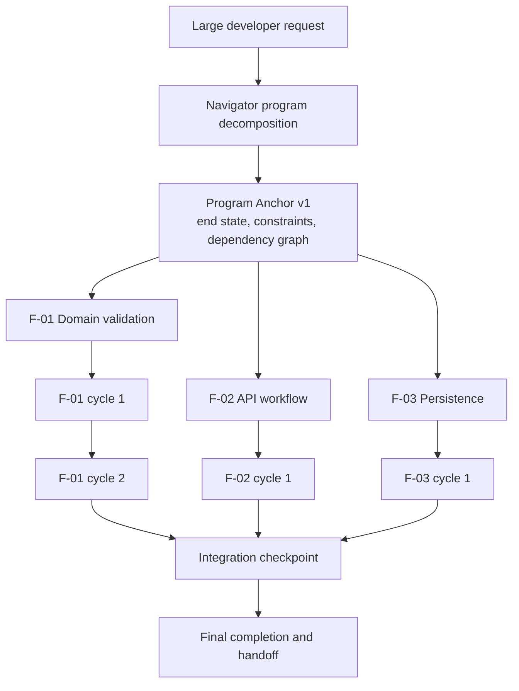
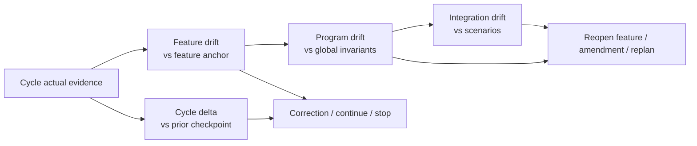
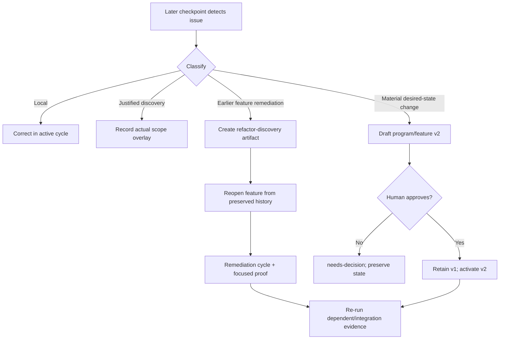
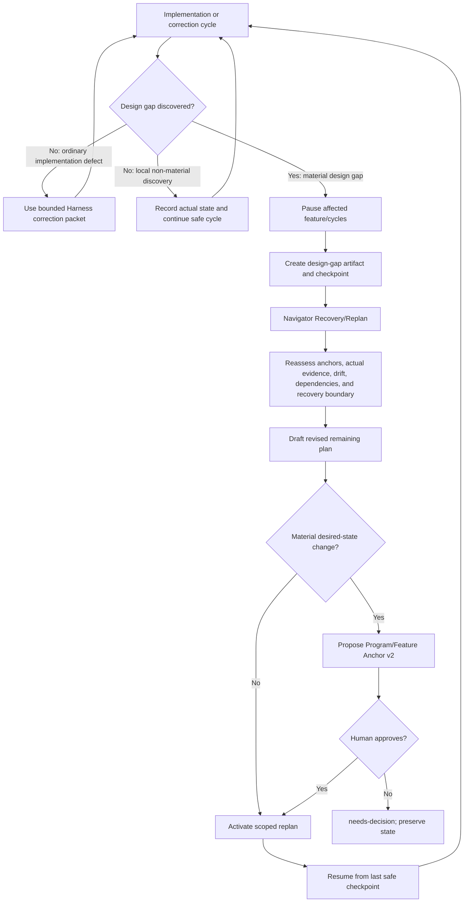

# TailTrail Program Delivery Harness

## Status and purpose

**Status:** future design proposal for broad, one-prompt, end-to-end delivery.

This document extends [Harness Engineering](harness-engineering.md) for a task
that spans many features, files, integrations, and correction cycles. It does
not claim that this program-level runtime exists today.

Related documents: [Harness Engineering](harness-engineering.md),
[TailTrail MCP Architecture](tailtrail-mcp.md), [Token Harness](TOKEN-HARNESS.md),
and [Evaluation Harness](EVALUATION-HARNESS.md).

## Core model

A long task has three durable truths. They must stay separate throughout the
delivery run.

| Truth | Question | Rule |
| --- | --- | --- |
| Approved desired state | What did the developer agree the system should become? | Immutable after approval; changes create a new approved version. |
| Actual observed state | What code, tests, controls, and results existed at a point in time? | Append a new checkpoint; never overwrite history. |
| Drift interpretation | How does actual state differ from approved intent, prior state, and program invariants? | Name the evidence and reason; do not hide it behind one score. |

> Implementation may change the route to the goal. It must never silently change
> the goal, erase previous evidence, or treat a green local test as end-to-end
> completion.

The required hierarchy is:

```text
Program goal
  -> feature requirements
     -> bounded implementation cycles
        -> append-only actual evidence and drift checkpoints
  -> cross-feature integration verification
  -> final completion report
```

## Navigator planning for broad work

Navigator is the delivery planner and router, not an always-running autonomous
implementation engine. It breaks a large prompt into three levels:

| Level | Purpose | Contents | Example |
| --- | --- | --- | --- |
| Program | Full desired result | Outcomes, constraints, feature map, dependencies, integration definition of done | Claims submission workflow. |
| Feature | Independently reviewable capability | Atomic requirements, preserve rules, local scope, proof, prerequisites | Validation or API workflow. |
| Implementation cycle | Smallest evidence-producing change | One objective, allowed paths, invariants, focused controls | Reject zero amount + prove it. |



### Navigator output contract

1. **Program Requirement Map:** user-visible outcomes, preserve rules,
   constraints, non-goals, and unresolved decisions.
2. **Feature decomposition:** meaningful capabilities, dependencies, and a
   recommended execution order.
3. **Feature Requirement-to-Impact Matrix:** atomic requirements mapped to
   likely symbols, callers, tests, expected scope, proof, confidence, and
   unknowns.
4. **Cycle plan:** small work packets rather than one giant edit.
5. **Guide/sensor plan:** selected policy, graph, tests, type/build,
   architecture/dependency controls, and intentionally skipped controls.
6. **Approval plan:** program/feature anchors, material approval gates,
   correction budget, and Task Recovery Boundaries.
7. **Integration plan:** scenarios and global invariants required before final
   completion.

Navigator labels findings as `confirmed-by-local-source`, `likely`, or
`unknown`. The program plan is a living plan, not a false promise that every
implementation detail is known before coding.

### Worked decomposition example

For: “Implement claims submission end to end: validate amount, expose an API,
persist valid claims, preserve errors, add focused tests, and add no dependency”:

```text
P-01 Claims submission workflow

Global invariants
- Every submission follows shared validation.
- Existing validation error contract remains compatible.
- No dependency, API/schema, or security change without material approval.
- Positive claims remain valid; invalid claims are never persisted.

F-01 Domain validation
  F-01.1 Reject zero amount with existing error type.
  F-01.2 Prove negative/zero rejection and positive acceptance.

F-02 Service and API workflow (depends on F-01)
  F-02.1 Map request through shared validation/service path.
  F-02.2 Preserve authorization and error response behavior.
  F-02.3 Prove submission-path behavior.

F-03 Persistence (depends on F-01 and F-02)
  F-03.1 Persist only validated claims.
  F-03.2 Decide whether a schema/migration amendment is required.
  F-03.3 Prove invalid claim has no persistence side effect.

F-04 Integration and handoff (depends on F-01..F-03)
  F-04.1 Run valid and invalid end-to-end scenarios.
  F-04.2 Revalidate program invariants and scope.
F-04.3 Review and final report.
```

## Anchors and versioned history

### Program Anchor

`program-approved-v1.md` is the durable full-request contract. It contains the
goal and definition of done; global requirements, preserve rules, and non-goals;
architecture, security, API, data, dependency, and policy invariants; feature
dependency graph; known, likely, and unknown evidence; material approval gates;
global correction budget; and integration proof plan.

### Feature Anchor

Each feature has an approved artifact inherited from the Program Anchor. It
contains its goal and prerequisites; atomic IDs; a Requirement-to-Impact Matrix;
expected files and symbols, allowed discoveries, protected paths, and non-goals;
local architecture expectations; selected controls; proof expectations; and its
correction budget. It can specialize Program intent but never weaken a global
safety, dependency, architecture, or approval boundary.

### Cycle packet

An implementation cycle narrows an approved feature; it does not create a new
desired state by default.

```text
Cycle: F-02.2
Goal: Preserve validation error response through API mapping.
Allowed scope: mapper, service caller, focused API tests.
Must preserve: shared validation, authorization, existing error contract.
Proof: focused API error + service-path test + changed-test integrity.
Stop: public API/schema/dependency/security/protected-path change or no new evidence.
```

### Artifact mutability

| Artifact | Versioning rule |
| --- | --- |
| Program approved state | Immutable after approval; create `program-approved-v2` only after material human re-approval. |
| Feature approved state | Immutable within Program Anchor version; create feature v2 only after material amendment. |
| Actual state | Create a checkpoint after every implementation/control cycle; never overwrite prior state. |
| Drift report | Append one comparison per checkpoint. |
| Requirement matrix | Freeze approved rows; write actual evidence as checkpoint overlays keyed by stable requirement ID. |
| Recovery boundary | Capture before source edits; append recovery attempts and conflicts. |

```text
.tailtrail/runs/<program-run-id>/
  program/
    program-approved-v1.md
    program-approved-v1.json
    program-requirement-map-v1.json
    feature-dependency-graph-v1.json
    integration-plan-v1.md
  features/
    F-01-domain-validation/
      approved-v1.md
      requirement-impact-matrix-v1.json
      recovery-boundary.json
      actual/checkpoint-001.md
      checkpoints/checkpoint-001.json
      drift/checkpoint-001.md
    F-02-api-workflow/
      ...
  integration/
    checkpoint-001.json
    drift-report-001.md
    final-completion-report.md
  amendments/
    amendment-001-refactor-discovery.md
    program-approved-v2.md
```

These artifacts are normally local and Git-ignored. Git remains the source of
repository rollback history; TailTrail stores task intent, evidence, ownership,
and recovery decisions for a potentially dirty worktree.

## Requirement-to-Impact Matrix at program scale

The matrix remains the backbone of `approved.md`, but large work needs two
levels:

| Matrix | Purpose |
| --- | --- |
| Program Requirement Map | Maps global outcomes/invariants to owning features and integration proof. |
| Feature Requirement-to-Impact Matrix | Maps atomic requirements to likely code paths, preserve rules, scope, proof, confidence, and checkpoint evidence. |

Example Program Requirement Map:

| Requirement | Owner features | Preserve rule | Integration proof |
| --- | --- | --- | --- |
| Valid claim submits end to end | F-01, F-02, F-03 | Shared validation route | Valid submission scenario. |
| Zero amount is rejected | F-01, F-02 | Existing error contract | Unit and API invalid scenario. |
| Invalid claim is not persisted | F-02, F-03 | No side effect after failure | Service/persistence scenario. |
| No dependency is added | All | Manifests unchanged | Program changed-path check. |

Example feature matrix:

| ID | Requirement / preserve rule | Likely code path | Proof |
| --- | --- | --- | --- |
| F01-REQ-01 | Reject zero with existing error. | `validate_claim_amount` -> `validate_claim` | Zero-value unit test. |
| F01-REQ-02 | Preserve positive acceptance. | Same path and service caller | Positive unit + service test. |
| F01-CON-01 | No duplicate validator/dependency. | Validation package | Scope/dependency check. |

Navigator impact is a proposal, not proof. It records file + symbol +
relationship + initial line span + fingerprint + confidence. The Harness
resolves symbols, hunks, files, and tests again after editing and attaches actual
evidence to stable requirement IDs.

## Drift: cycle, feature, program, and integration

| Lens | Comparison | Question |
| --- | --- | --- |
| Cycle drift | Checkpoint vs prior checkpoint | Did this correction improve the active work? |
| Feature drift | Checkpoint vs Feature Anchor | Does this feature meet its requirements and boundaries? |
| Program drift | Features vs Program Anchor | Do accumulated changes still reach the requested end state? |
| Integration drift | Cross-feature behavior vs integration plan | Do locally valid features work together? |



Each requirement and invariant receives an explicit state:

| State | Meaning | Response |
| --- | --- | --- |
| `resolved` | Required evidence now meets approved intent. | Close row or continue. |
| `improved` | Gap is smaller but incomplete. | One focused correction if budget remains. |
| `unchanged` | Latest attempt did not alter the gap. | Stop repetition; seek new evidence/decision. |
| `regressed` | Previously valid behavior/evidence is worse. | Stop and repair/analyze. |
| `new-drift` | Unapproved scope, architecture, behavior, dependency, or protected path. | Classify and re-approve if material. |
| `needs-decision` | Evidence cannot determine correct action. | Ask the smallest human question. |

Example: F-01 validation tests pass, F-02 API test passes, F-03 persistence
test passes, but integration shows the API bypasses the shared validator. F-03
may be locally resolved while F-02 has feature drift and the program has a
violated global invariant. Completion stays blocked until F-02 remediation and
integration revalidation complete.

## Refactor discovery and amendment protocol

Refactoring discovered mid-program is normal. The dangerous behavior is silently
rewriting an earlier feature's approved or actual history merely because later
evidence finds a better design.

| Discovery class | Example | Action |
| --- | --- | --- |
| Local correction | Simplify active-cycle code. | Record in actual checkpoint; no new anchor. |
| Justified discovery | A missed caller needs the same approved change. | Add actual scope overlay; continue only if non-material. |
| Feature remediation | Earlier API wiring duplicates validation. | Create discovery artifact; reopen affected feature. |
| Feature amendment | New component/material architecture expectation needed. | Draft feature anchor v2; require approval. |
| Program amendment | User behavior, API/schema/security/dependency/feature map changes. | Draft Program Anchor v2; require approval. |



Worked example:

1. F-01 validation is locally validated.
2. F-02 API work introduces or reveals a duplicate validator route.
3. F-03 integration proves an API submission can bypass F-01.
4. TailTrail creates `amendment-001-refactor-discovery.md` with exact source,
   caller, and test evidence, marking shared validation `regressed`.
5. It reopens F-02 as a remediation cycle, preserving original approvals and
   checkpoints.
6. It restores the shared path, removes duplication only if safe, then runs API,
   service, and integration proof.
7. P-01 remains incomplete until the invariant resolves.

History should say: F-02 was locally valid, later found to violate a Program
Anchor invariant, then remediated and revalidated. It must not pretend the first
implementation was never made.

## Design-gap pause and Navigator Recovery/Replan

A failed test is not automatically a design gap. Normal implementation defects
should stay in the active Harness correction loop. A design gap exists when the
current approved implementation route is no longer trustworthy: new evidence
shows that continuing it would likely violate requirements, architecture,
contracts, safety boundaries, or completed work.

The default rule is:

> Pause the **affected implementation loop** for a material design gap; do not
> abandon the program, erase its history, or restart Navigator from zero.

This avoids two expensive outcomes: continuing to add code against a flawed
design, and discarding completed work/evidence when the original plan needs to
evolve.

### Classify before pausing

| Discovery type | Example | Pause implementation? | Response |
| --- | --- | --- | --- |
| Local implementation detail | Helper extraction or naming change inside the approved cycle | Usually no | Finish the safe cycle, record it in actual state, continue. |
| Missed internal caller/test | Existing caller needs the same approved validation update | Usually no | Record `justified-discovery`; add focused evidence if needed. |
| Incorrect feature design | API cannot use shared validation without duplicating rules | Yes, pause affected feature | Create design-gap artifact; enter Recovery/Replan. |
| Cross-feature architecture conflict | Persistence or API bypasses an invariant established by validation | Yes, pause dependent work | Reassess dependencies and reopen affected feature/remediation work. |
| Changed user behavior, API, schema, security, or dependency need | Existing error contract must become a new public response shape | Yes, stop at safe boundary | Draft amended Program/Feature Anchor and require approval. |
| Ambiguous requirement | Two valid designs produce materially different customer behavior | Yes | Record `needs-decision`; do not guess. |

TailTrail may finish a currently running cycle only when the remaining work is
independent of the gap, remains inside the approved boundary, and produces safe
evidence. It must not finish a cycle merely to make a status report appear
complete when the same design assumption underlies the remaining edits.

### State transition



The program itself remains `active`. Only the affected feature and dependent
work change state. For example:

```text
Program P-01: active
F-01 validation: completed, subject to dependent revalidation
F-02 API workflow: paused-for-replan
F-03 persistence: blocked-by-F-02
Current correction loop: exited
Program history: retained
```

### What a design-gap artifact records

`design-gap-<n>.md` and its normalized JSON companion must be append-only. They
should contain:

- affected program/feature/cycle IDs and anchor versions;
- the exact requirement, preserve rule, invariant, or scope rule at risk;
- source, caller, test, control, and checkpoint evidence;
- classification and confidence: confirmed, likely, or unknown;
- current state: paused feature, blocked dependents, and completed work subject
  to revalidation;
- options considered, including smallest safe route and consequences;
- whether the gap changes desired behavior or only the implementation route;
- approval requirement and the smallest decision needed from the developer; and
- recovery-boundary/ownership information if wrong task-owned work may need
  selective reversal.

This artifact must point to existing anchors/checkpoints rather than duplicate
their full raw source or conversation history.

### Navigator Recovery/Replan is stateful

Navigator should receive a compact replan packet, not the original user prompt
alone:

```text
Original Program Anchor: P-01 v1
Affected feature: F-02 API workflow
Completed dependencies: F-01
Blocked dependents: F-03
Current checkpoint: F-02 checkpoint-002
Design gap: API error mapping conflicts with shared validation contract
Program invariant at risk: every submission uses the shared validation path
Evidence: mapper source, caller graph, existing API tests, failed invariant check
Recovery boundary: F-02 task-owned hunks available; no conflict detected
```

Navigator uses this packet to determine:

1. Which Program and Feature Anchor requirements remain unchanged.
2. Which completed work remains valid and which dependencies require
   revalidation.
3. Whether the gap is a local remediation, feature amendment, or program
   amendment.
4. The smallest safe remaining feature/cycle sequence.
5. Which evidence and integration scenarios must run after resumption.
6. Whether a Task Recovery Boundary permits selective reversal of wrong
   task-owned changes, or requires a no-write assisted recovery plan.

Navigator does not erase `approved-v1`, `actual` checkpoints, drift reports,
Requirement-to-Impact Matrices, or recovery artifacts. It creates a proposal for
the next safe state.

### Complete claims-workflow scenario

Developer request:

> “Build claims submission end to end: validate claims, expose API, persist
> valid claims, and preserve existing errors.”

#### 1. F-01 completes

F-01 changes shared validation and proves zero/negative rejection plus positive
acceptance.

```text
F-01 checkpoint-002
Status: validated
Program invariant: all claims use shared validation
Evidence: focused validation tests passed
```

#### 2. F-02 finds a design gap

While wiring the API, the agent learns that the existing error mapper cannot
satisfy the new flow without either duplicating validation in the API layer or
changing the shared domain error contract used by current callers.

This is not a normal test failure. Continuing implementation would either create
architecture drift or silently change existing behavior.

```text
F-02 status: paused-for-replan

Reason:
- Existing API error mapping cannot satisfy the flow without duplicate
  validation or a changed shared error contract.

Affected requirements:
- F-02-REQ-01: API uses shared validation path
- F-02-PRES-01: Existing error contract remains compatible
- P-01-INV-01: No duplicate validation route

Evidence:
- API mapper source pointer
- shared validator caller graph
- existing API error tests
- F-02 actual checkpoint
```

#### 3. Exit the correction loop, not the delivery run

TailTrail exits the F-02 correction loop because another “try again” edit has no
new design guidance. It does not abandon P-01:

```text
P-01: active
F-01: completed but subject to revalidation
F-02: paused-for-replan
F-03: blocked-by-F-02
All anchors, checkpoints, matrices, drift reports, and recovery boundaries: retained
```

#### 4. Navigator proposes the smallest route

Navigator evaluates options:

1. Adapt the API mapper to the existing domain error without changing the
   shared contract.
2. Introduce an internal translation boundary that preserves both contracts.
3. Change the shared domain/API error contract.

If option 2 preserves approved behavior and only adds an internal justified
file, Navigator creates a non-material scoped replan:

```text
F-02 revised remaining plan v1.1
- Add internal error translation adapter.
- Preserve shared validator and existing error contract.
- Add API mapping test.
- Re-run API/service integration evidence.
```

No new approved desired-state version is needed if the original anchor allowed
such internal scope discovery and all user-visible behavior/invariants remain
unchanged.

If only option 3 is viable, Navigator instead creates Program Anchor v2 and
Feature F-02 Anchor v2 proposals. The developer must approve the public/shared
contract change before implementation resumes.

#### 5. Resume safely

After non-material replanning or material approval, TailTrail resumes from the
last safe checkpoint. It retains already-valid F-01 work, selectively remediates
only F-02 task-owned code when necessary, and re-runs F-02 plus dependent F-03
and integration evidence. Program completion remains blocked until the shared
validation invariant is revalidated.

### Implementation state machine

```text
planned -> approved -> implementing -> checkpointed -> correcting -> validated

On a material design gap:
implementing/correcting -> paused-for-replan -> Navigator Recovery/Replan
  -> revised-plan-proposed -> approved or needs-decision -> implementing
```

The distinction matters: a correction loop handles a known implementation gap;
Recovery/Replan handles a discovered flaw in the route to completion. The latter
preserves current reality and asks Navigator to route from it, rather than
starting over or allowing the agent to drift.

## Approval and bounded autonomy

Hands-free means fewer unnecessary interruptions, not no authority boundaries.

| Approval required | Why |
| --- | --- |
| Program Anchor v1 | Developer accepts end state, feature plan, constraints, and budget. |
| Material feature/program amendment | Changes behavior, API/schema/data/security/dependency boundary, core architecture, or feature scope. |
| External service, dependency, network scanner, protected path | Changes authority, privacy, cost, or risk. |
| Recovery conflict or repeated unresolved failure | No safe evidence-grounded next action exists. |

No repeated approval is needed for expected implementation cycles, policy-allowed
focused controls, one/two corrections based on new evidence, or non-material
missed callers that preserve the approved behavior.

| Level | Default budget | Stop condition |
| --- | --- | --- |
| Cycle | Initial attempt + at most 2 evidence-based corrections | Same failure, regression, ambiguity, material drift, timeout, or no new evidence. |
| Feature | Planned cycles + one bounded remediation pass | Feature budget exhausted or dependent/program invariant affected. |
| Program | Feature sequence + integration pass + one cross-feature remediation | Material amendment or repeated unresolved integration failure. |

For regulated/public API/security work, lower automatic limits and escalate
earlier. An explicit experimental internal run may allow up to three corrections
only while every checkpoint remains within the approved boundary.

## Task Recovery Boundary in a dirty repository

Consider this case: F-01 is valid but uncommitted; F-02 modifies the same file
and fails. A repository-wide rollback would destroy valid F-01 work.

Before every execution unit writes source, TailTrail captures a feature/cycle
Task Recovery Boundary: expected scope, baseline fingerprints, task-owned hunks,
new/deleted files, and later external edits. A matrix pointing to a file never
grants ownership of the entire file.

1. Git remains the repository recovery source of truth.
2. TailTrail reverses only verified task-owned changes.
3. It uses hunk context, symbols, and fingerprints, not a file snapshot alone.
4. Overlap with later user/other-task work yields `RECOVERY_CONFLICT` and a
   **no-write** assisted recovery plan.
5. Recovery/Replan retains all anchors, checkpoints, drift reports, and
   evidence; it never restarts the program from zero.

## Integration and final completion

Feature completion is not Program completion. A final integration checkpoint
compares all feature matrices and actual evidence to program requirements,
architecture/integration invariants, changed-path scope, test integrity,
dependency/security evidence, and end-to-end scenarios.

| Final state | Meaning |
| --- | --- |
| `complete-validated` | All approved requirements and integration evidence are satisfied. |
| `complete-with-decision` | Developer approved a documented limitation or deferral. |
| `incomplete` | A requirement/evidence row remains missing or failed. |
| `blocked` | Needed authority, environment, dependency, or decision is unavailable. |
| `superseded` | A newer Program Anchor replaces this version. |

The final report separates validated evidence, inferred review judgment, skipped
controls, local estimates, and unresolved decisions. It never promises universal
correctness.

## Token Harness, Evaluation Harness, and MCP

**Token Harness** links context receipts to program, feature, and checkpoint IDs.
It loads relevant anchors and requirement history instead of replaying all chat
history; preserves must-be-exact material; reduces only eligible artifacts; and
never claims measured savings without telemetry.

**Evaluation Harness** should test this design using deterministic fixtures:
multi-feature work, later remediation, valid uncommitted Task 1 plus failed
same-file Task 2, material amendment, test-chasing, and integration failure
despite green feature checks. It measures completion, preservation, scope,
correction, recovery, and context growth before benefit claims.

**MCP** exposes stable operations only after the CLI/domain logic exists. Useful
read-first tools include `navigator.plan_program`,
`navigator.propose_feature_matrix`, `program.status`,
`program.create_integration_checkpoint`, `program.record_refactor_discovery`,
and `program.replan`. No MCP tool starts a full autonomous delivery chain or
writes source by default.

## Implementation sequence

This layer comes after Harness Engineering V1 proves itself on real multi-file
features.

1. **PDH-0 prerequisite:** feature anchor, matrix, append-only checkpoints,
   focused controls, bounded correction, and safe recovery plan work.
2. **PDH-1 planning:** Program Requirement Map, dependency graph, program to
   feature to cycle decomposition, integration plan, read-only fixtures.
3. **PDH-2 artifacts:** Program Anchor, feature inheritance, append-only actual
   state, drift views, amendments, and supersession.
4. **PDH-3 integration:** dependency-aware starts, downstream revalidation,
   program invariants, and final completion report.
5. **PDH-4 remediation:** refactor discovery, feature reopening, recovery
   boundaries, and no-write conflict/replan tests.
6. **PDH-5 MCP/evaluation:** stable read-only MCP projection, then
   approval-gated artifacts and deterministic evaluation fixtures.

Likely planned artifacts: `schemas/program-anchor.schema.json`,
`schemas/program-requirement-map.schema.json`,
`schemas/feature-dependency-graph.schema.json`,
`schemas/refactor-discovery.schema.json`,
`schemas/integration-checkpoint.schema.json`,
`scripts/program-delivery-plan.py`, `scripts/program-anchor.py`,
`scripts/program-drift.py`, `scripts/program-integration.py`,
`scripts/refactor-discovery.py`, `scripts/program-replan.py`, templates, and
focused program/drift/refactor tests.

## Boundaries and success criteria

Do not use this model for small fixes. Do not create a background autonomous
agent, overwrite history, silently widen material scope, reset a whole dirty
repository, store raw chat/source by default, or claim hands-free correctness or
productivity benefit without evaluation evidence.

It succeeds when Navigator produces a clear hierarchy; every requirement and
preserve rule remains traceable; approved state is immutable/versioned; actual
and drift evidence are append-only; later discoveries remediate earlier work
without erasing history; integration catches locally green but globally wrong
behavior; and the final report states what was validated, inferred, skipped,
deferred, or needs a human decision.
