# TailTrail and Official AI-DLC: Current State and Integration Design

## Purpose

This document separates:

1. **TailTrail AIDLC Lifecycle Lite** — the portable local lifecycle subset implemented here.
2. **Official AWS AI-DLC Workflows** — the external workflow engine published by AWS Labs.
3. **The proposed integration** — official AI-DLC owns lifecycle routing; TailTrail owns requirements traceability, computational evidence, drift control, recovery, and closure.

It is an integration design, not a claim that TailTrail already ships the full official engine.

## Reference and version boundary

The external reference is [AWS Labs AI-DLC Workflows](https://github.com/awslabs/aidlc-workflows), with its [official guide](https://awslabs.github.io/aidlc-workflows/guide/00-introduction/). The project evolves quickly: public materials describe its 2.0 release and a five-phase, 32-stage engine. TailTrail must pin an official release or commit and record it per run. It must never claim compatibility with an unpinned moving target.

## 1. TailTrail AIDLC implemented today

TailTrail has a **Lifecycle Lite** implementation. It provides enough lifecycle structure for broad work, while keeping small fixes small.

| Capability | Local implementation | Purpose |
| --- | --- | --- |
| Lifecycle contract | `AIDLC.md` | Depth, artifacts, gates, and lifecycle principles |
| Stage playbooks | `aidlc/stages/` | Workspace, reverse engineering, requirements, planning, design, implementation, test, handoff, operations |
| Initialization | `scripts/aidlc-init.py` | Creates `aidlc-docs/` |
| Validation | `scripts/aidlc-check.py` | Validates lifecycle artifacts and strict question answers |
| Requirements adapter | `scripts/aidlc-requirements.py` | Generates questions, recommendations/reasoning, validates answers, revises proposal |
| Planning bridge | `scripts/task-start.py`, `scripts/planning-lock.py` | Connects AIDLC requirements mode to a planning run |
| Assurance controls | Requirement/harness/recovery/closure scripts | Tests completion against approved intent |

### Local lifecycle flow

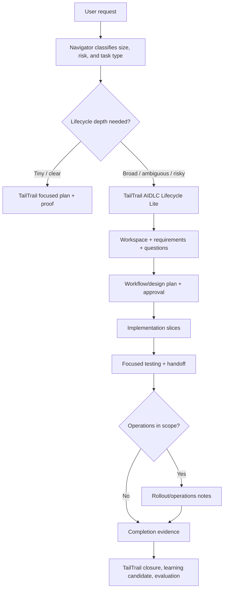

### Local depth and artifacts

| Depth | Use | Typical output |
| --- | --- | --- |
| Minimal | Clear, low-risk change | State note, focused validation, compact handoff |
| Standard | Feature, bug, or refactor with meaningful scope | Requirements, workflow plan, implementation/validation handoff, gates |
| Comprehensive | Production-sensitive, regulated, multi-team, or system-wide work | Standard artifacts plus questions, design, NFR/risk, operations notes |

AIDLC lifecycle docs live in `aidlc-docs/`. TailTrail’s run controls remain separate in `.tailtrail/runs/<run-id>/`: Planning Lock, approved anchor, requirement IDs, checkpoints, receipts, drift, recovery, closure, and evaluation.

### Current requirements behavior

A rejected TailTrail plan requests approve/reject feedback per requirement. A first material rejection can enter **AIDLC Requirements mode**; repeated material rejection requires it before another material proposal.

A hands-free or end-to-end request runs the local AIDLC requirements adapter during planning. It can ask delivery questions on idempotency, failure handling, contract behavior, authorization, concurrency, observability, rollout, and proof.

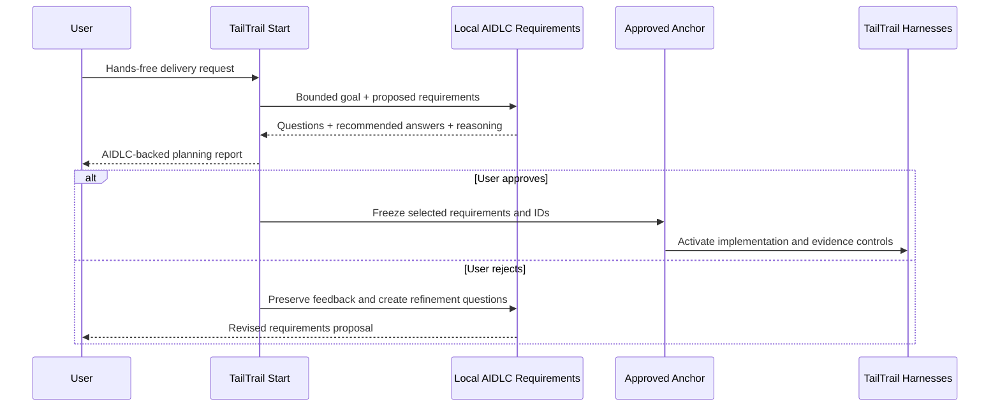

Example:

```text
tailtrail start "hands-free: add order cancellation and refund end to end" --verbose
```

Today this creates a planning boundary, an AIDLC-backed question/recommendation brief, an approval gate, and then TailTrail’s requirement/drift/evidence controls after approval.

### What TailTrail does not currently provide

TailTrail is not feature-equivalent to official AI-DLC Workflows:

- no official deterministic 32-stage state machine;
- no official agent roster or multi-agent topologies;
- no official spaces/intents/session model;
- no official skill/runner/plugin system;
- no official audit-shard format;
- no release-pinned compatibility contract;
- no full stage-by-stage official approval traversal.

The accurate product term is **TailTrail AIDLC Lifecycle Lite**, not “official AIDLC.”

## 2. What official AWS AI-DLC Workflows offers

Official AI-DLC is a lifecycle engine, rather than just a requirements questionnaire. Its guide describes a deterministic orchestrator that loads stage definitions and agent perspectives, manages state/audit, delegates selected work topologies, and presents approval gates.

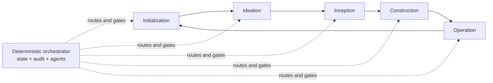

| Official capability | Why it matters |
| --- | --- |
| Adaptive scope, depth, and test strategy | Adjusts process to delivery risk |
| Stage state machine | Decides a next stage deterministically |
| Agent roles and selected multi-agent topologies | Brings appropriate product, design, developer, quality, platform, and operations perspectives |
| Intent/session/audit model | Enables resume, redo, jump, and traceability |
| Official artifacts and runner skills | Keeps workflow consistent across supported hosts |
| Stage approval gates | Ensures major lifecycle decisions are explicit |

Example:

```text
/aidlc Build an inventory cancellation API with refund and audit evidence.
```

The official engine routes intent through requirements, design, construction, testing, and operations as needed. It governs lifecycle flow, but does not replace TailTrail’s requirement-to-evidence, drift, and safe recovery capabilities.

## 3. Proposed integration: one lifecycle engine, one assurance layer

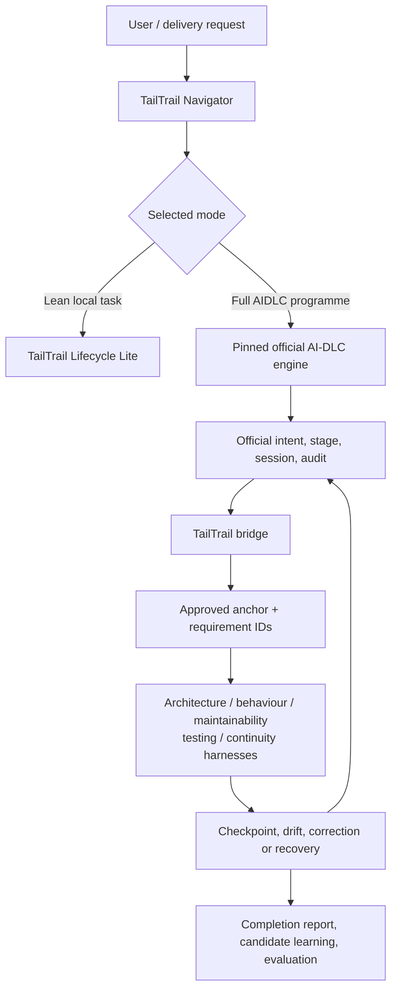

### Authority boundary

| Decision | Owner | TailTrail role |
| --- | --- | --- |
| Scope/depth and next lifecycle stage | Official AI-DLC | Observe and link |
| Requirement questions/refinement | Official AI-DLC | Carry feedback; map accepted requirements to TailTrail IDs |
| Official stage approval | Official AI-DLC | Mirror the result; never ask twice |
| Requirement identity/preservation | TailTrail | Create immutable IDs and anchor mapping |
| Impact, computational checks, test evidence, drift | TailTrail | Run selected controls and return a bounded correction packet |
| Replan after evidence failure | Official AI-DLC + bridge | Route to the right prior stage without destroying history |
| Closure, acceptance, learning/evaluation | TailTrail | Create report first; never invent CI proof |

The non-negotiable rule: **one user decision must produce one approval prompt only**.

### Perspective registry and on-demand build services

Official AI-DLC demonstrates the value of product, design, architecture,
development, quality, security, platform, and operations perspectives. TailTrail
should use the same principle without creating a permanently active fleet of
independent agents. The implementation model is a **Perspective Registry**:
versioned, named guidance and output contracts that Navigator activates only
when the approved requirements and evidence plan need them.

This is deliberately a perspective/lens model first. A perspective may be
carried out by the primary host agent plus deterministic local tools. It does
not imply an additional model call, subagent, or parallel process unless a
future host explicitly supports and approves that execution topology.

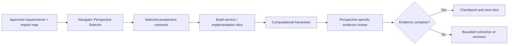

| Perspective | Activation signals | Required output | Default execution |
| --- | --- | --- | --- |
| Product / Requirement | Ambiguity, user journey, conflicting outcomes | Testable behaviour, acceptance criteria, non-goals | Host reasoning + approved requirement contract |
| Architect | Multi-file change, shared caller, API/data/event boundary | Impact/preservation map, layer and dependency decisions | Code Graph Lite + architecture fitness checks |
| Developer | Every active implementation slice | Smallest maintainable implementation plan | Host implementation using existing project patterns |
| Quality | Non-trivial logic, a changed invariant, or missing proof | Requirement-linked test/evidence plan | Test tier selector + validation receipts |
| Behaviour | User-facing/API/workflow terminology | Declared journey, expected effects, failure boundary | Behaviour Harness + integration/contract evidence |
| DevSecOps | Auth, secrets, dependency, CI, deployment, security risk | Applicable safeguards and release/security evidence | Guardrails, dependency gate, CI/security receipts |
| Platform / Infrastructure | Terraform, cloud, migration, environment, deployment | Lifecycle/compatibility/rollback constraints | Higher-tier testing + release/recovery controls |
| Operations | Monitoring, rollout, incident, handoff, production wording | Ownership, observability, rollback, support evidence | Release confidence + operations handoff |
| Maintainability | Refactor, broad diff, correction churn | Complexity/scope findings and reuse guidance | Maintainability Harness |
| Recovery Diagnostician | Repeated failure, contradiction, non-convergence | Root-cause hypothesis and bounded replan recommendation | Recovery evidence analysis; model use is opt-in |

Navigator must render both selected and skipped perspectives, including the
reason. “Skipped” is useful evidence: it tells a user that Platform was not
needed because no infrastructure boundary was found, or that Recovery was not
needed because no correction cycle has failed.

Example for a cancellation/refund delivery:

```text
Selected perspectives
- Product: define cancellation eligibility and customer-visible refund state.
- Architect: map order → inventory → payment → notification dependencies.
- Developer: implement the smallest idempotent orchestration boundary.
- Quality: prove duplicate release/refund cannot occur.
- Behaviour: prove a successful customer cancellation journey.
- DevSecOps: preserve ownership checks, audit trail, and provider-failure handling.
- Operations: require reconciliation and staged rollout evidence.

Skipped perspectives
- Platform: no infrastructure change found in the approved boundary.
- Maintainability: no refactor or broad-complexity signal yet.
- Recovery Diagnostician: no repeated failure or contradiction yet.
```

### Perspective activation contract

The approved anchor should retain selection as an auditable plan, not a hidden
prompting choice. Example:

```json
{
  "type": "tailtrail-perspective-selection",
  "run_id": "start-20260811-abc123",
  "requirement_uids": ["REQ-start-20260811-abc123-r1-01"],
  "selected": [
    {
      "name": "architect",
      "reason": "The requirement crosses API, service, inventory, and payment boundaries.",
      "required_outputs": ["requirement-impact-map", "architecture-fitness-result"],
      "execution": "local-tools-plus-host"
    },
    {
      "name": "quality",
      "reason": "Idempotency and partial-failure behaviour require requirement-linked proof.",
      "required_outputs": ["testing-profile", "validation-evidence-receipt"],
      "execution": "local-tools-plus-host"
    }
  ],
  "skipped": [
    {
      "name": "platform",
      "reason": "No approved infrastructure, deployment, migration, or environment change."
    }
  ],
  "boundary": "A perspective is not an autonomous model agent. It cannot edit source, run external systems, or override policy merely by being selected."
}
```

### Build-service execution rules

1. **Navigator selects; it does not execute.** Selection is planning-only and
   becomes active only when the approved anchor activates the run.
2. **Every perspective has an output contract.** Generic advice is not a valid
   result. Architect yields an impact/preservation decision; Quality yields a
   requirement-linked proof plan; Operations yields an ownership/rollback
   boundary.
3. **Computational controls take priority.** When a local test, type checker,
   contract validator, scanner, AST mapper, or Git check can evaluate a claim,
   use that deterministic result instead of a model opinion.
4. **No redundant reviews.** The same requirement must not receive both a
   generic “quality agent review” and a TailTrail Quality/Behaviour Harness
   unless each has a distinct declared output.
5. **Context is scoped.** A perspective loads only the requirement rows,
   affected paths, prior checkpoints, and applicable evidence. Context
   Continuity supplies a short failure/drift memory packet only when needed.
6. **Failure is routed by ownership.** A missing caller goes to Architect; a
   missing test/receipt goes to Quality; a failed journey goes to Behaviour; a
   repeated contradiction can arm Recovery Diagnostician.
7. **Completion reports show status.** Each selected perspective is reported as
   pass, gap, not-triggered, or not-needed, with its evidence reference.

### Official approval-gate adapter

Official AI-DLC approval gates should become an optional underlying transition
mechanism for TailTrail. TailTrail must expose them as a small number of
meaningful user decisions, rather than presenting every internal lifecycle
transition as a prompt. This lets normal requirements benefit from deliberate
approval without turning a focused bugfix into a waterfall workflow.

TailTrail already has related controls: Planning Lock approval, AIDLC
requirements approval, immutable anchors, decision amendments, and
Completion-Report acceptance. The adapter unifies those controls with a pinned
official AIDLC stage gate when an official session is attached to the run.

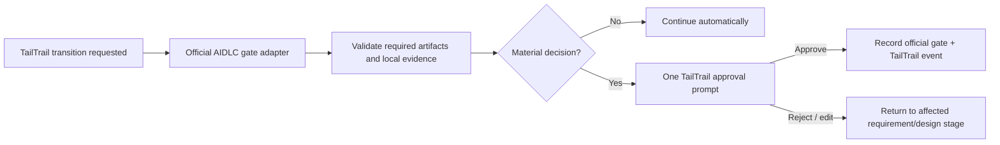

### Adaptive gate profiles

| Work type | Required user gates | Automatic work inside approved boundary |
| --- | --- | --- |
| Small focused fix | Approve Start plan; accept/reopen after Completion Report | Reads, implementation, focused test corrections, harness checkpoints |
| Medium multi-file change | Approve requirements; approve a material design decision only when one exists; accept/reopen at closure | Normal implementation slices and non-material test corrections |
| Hands-free programme | Requirements; material architecture/design amendments; release/rollout readiness when in scope; closure | Bounded correction loops, evidence collection, routine slice progression |
| Regulated/production-sensitive delivery | Pinned official AIDLC stage gates plus TailTrail evidence attached | Only transitions declared non-material by the official and TailTrail policies |

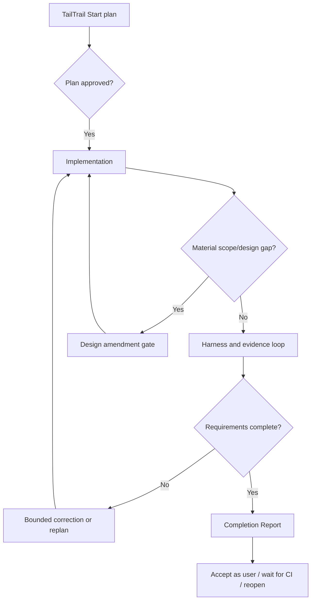

### Gate materiality rules

A failed command or test does **not** automatically require a new approval.
TailTrail can continue a bounded correction loop when the correction stays
within the same approved requirement, design decision, affected boundary, and
evidence plan.

A gate is required when evidence reveals a change to approved intent, for
example:

- a new requirement, actor, affected system, dependency, or side effect;
- a public API/contract, data-model, authorization, privacy, security, or
  compliance change outside approved boundaries;
- a material architecture alternative or a decision that contradicts an
  approved decision record;
- a recovery/reconciliation path that changes behaviour rather than merely
  returning task-owned code to the approved checkpoint;
- release, migration, rollout, or rollback work that was not in the approved
  delivery boundary.

### Gate record and single-prompt rule

When official AIDLC is attached, the bridge records both systems' references in
one event. The user sees one prompt; TailTrail never asks again for the same
official stage decision.

```json
{
  "type": "tailtrail-official-aidlc-gate",
  "run_id": "start-20260811-abc123",
  "official_stage": "construction-to-build-and-test",
  "official_gate_ref": "gate-3-6-approval",
  "tailtrail_transition": "implementation-slice-to-evidence-validation",
  "requirement_uids": ["REQ-start-20260811-abc123-r1-02"],
  "required_artifacts": ["approved-anchor", "requirement-impact-map", "testing-profile"],
  "local_evidence": ["architecture-fitness-result:pass"],
  "materiality": "material",
  "decision": "approved",
  "boundary": "A selected gate does not authorize source edits or external actions beyond the approved run boundary."
}
```

For a normal TailTrail run without an official installed/session-attached pack,
the same Gate Profile and materiality rules remain useful, but the record is a
TailTrail-native gate event. This is an honest fallback; it must not be labelled
as an official AIDLC gate.

### Official test-strategy bridge

Official AI-DLC test strategy becomes the **test-planning authority** in Full
mode. TailTrail remains the **test-evidence authority**: it maps the planned
proof to approved requirement IDs, selects executable local checks, records
only commands that actually ran, and determines whether completion evidence is
complete. This avoids two test planners independently choosing incompatible
coverage levels.

Official AI-DLC separates test strategy from lifecycle depth. Depth controls
artifact detail; test strategy controls test volume and test types. The bridge
must preserve that distinction rather than assuming that a comprehensive
planning artifact always requires comprehensive testing.

| Official AI-DLC strategy | Official planning intent | TailTrail execution and evidence role |
| --- | --- | --- |
| Minimal / Nyquist | At least one requirement-driven test plus a happy-path test per component | Require a focused, requirement-linked test receipt for every approved requirement. |
| Standard | Unit plus integration coverage at important component boundaries | Select focused unit checks and service/API/integration proof where the requirement crosses a boundary. |
| Comprehensive | Unit, integration, E2E, plus performance/security tests when NFRs require them | Activate the appropriate Higher-Tier Testing, Behaviour Harness, architecture, CI, and release evidence controls. |

Official guidance gives test-count ranges as soft planning guidelines. TailTrail
must not treat a count of tests as proof of completion. The controlling rule is
still: **each requirement receives the minimum evidence tier needed to prove
its intended outcome and preservation boundary**.

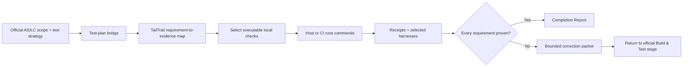

Example mapping for cancellation/refund delivery:

| Requirement | Official test intent | TailTrail required receipt |
| --- | --- | --- |
| Cancellation is blocked after shipment | Unit plus service boundary | Validator/service receipt linked to the eligibility requirement UID |
| Inventory releases exactly once | Integration | Inventory/idempotency integration receipt |
| Refund happens exactly once | Integration | Payment retry/idempotency receipt |
| Notification occurs only after durable success | Behaviour/integration | Declared journey or service-flow receipt |
| API remains compatible | Contract | OpenAPI/schema/contract receipt |
| Rollout is safe | Comprehensive/release | CI, deployment, monitoring, or rollback receipt as applicable |

The bridge should persist a requirement-level plan after the official
requirements/design approval and before official Build & Test execution:

```json
{
  "type": "tailtrail-official-aidlc-test-plan-bridge",
  "tailtrail_run_id": "start-20260811-abc123",
  "official_stage": "build-and-test",
  "official_test_strategy": "standard",
  "requirements": [
    {
      "requirement_uid": "REQ-start-20260811-abc123-r1-02",
      "official_test_intent": "Prove idempotent inventory release.",
      "required_tiers": ["unit", "integration"],
      "planned_receipt_types": ["validation-evidence-receipt"],
      "status": "planned"
    }
  ],
  "boundary": "The official engine chooses strategy; TailTrail records only supplied, actually executed evidence."
}
```

When a required receipt is missing or fails, TailTrail creates a bounded packet
with requirement UID, missing or failed evidence, impacted symbols/files, and
the recommended official return stage. For test-evidence gaps that stage is
normally **Build & Test**, not a new independent TailTrail plan. The official
intent/session and all TailTrail anchor, drift, receipt, and checkpoint history
remain intact.

## 4. Artifact bridge

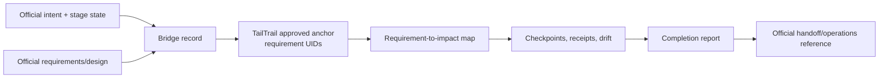

Example bridge record:

```json
{
  "type": "tailtrail-official-aidlc-bridge",
  "tailtrail_run_id": "start-20260811-abc123",
  "official_source": "awslabs/aidlc-workflows",
  "official_version": "pinned-release-or-commit",
  "official_intent_id": "inventory-cancellation",
  "official_session_id": "session-42",
  "official_stage": "construction",
  "official_approval_ref": "stage-gate-id",
  "requirement_map": [
    {
      "tailtrail_requirement_uid": "REQ-start-20260811-abc123-r1-01",
      "summary": "Reject cancellation after shipment.",
      "official_requirement_ref": "REQ-02"
    }
  ],
  "boundary": "Official AI-DLC routes lifecycle stages; TailTrail controls local evidence and drift."
}
```

Store IDs, sanitized summaries, and retrieval references only. Do not copy raw prompts, source, customer data, or full external audit content into TailTrail by default.

## 5. Target user experience

### Small task

```text
tailtrail start "reject zero quantity and add a focused test"
```

Navigator selects Lifecycle Lite. It does not load the official engine.

### Full lifecycle task

```text
tailtrail start "hands-free: add cancellation and refund end to end" --aidlc full
```

1. Navigator reports selected official AI-DLC mode and pinned version.
2. Official AI-DLC owns questions and lifecycle stages.
3. The user approves the official stage gate once.
4. The bridge creates TailTrail approved-anchor mappings.
5. Official execution proceeds while TailTrail captures selected evidence at stage boundaries.
6. Evidence gaps return to the proper official stage with a bounded correction packet.
7. TailTrail produces Completion Report first, then asks accept as user, wait for CI, or reopen.

## 6. Navigator Requirements Deepening: the middle tier

### Why this improvement is needed

Navigator already produces a requirement matrix and can escalate to the local
AIDLC Requirements stage. Its first-pass requirement gathering is still often
too shallow for medium-sized work: a generic goal can become one oversized
requirement, while preservation rules, dependencies, user-visible behaviour,
and proof are left implicit. Full official AI-DLC would solve more of this, but
would be unnecessarily heavy for many multi-file changes.

**Navigator Requirements Deepening** is the middle tier. It borrows the useful
AIDLC requirements disciplines—testable intent, assumptions, non-goals,
dependencies, meaningful questions, recommendation reasoning, and explicit
proof—without invoking a full external lifecycle engine.

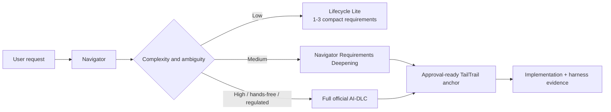

### Automatic selection rules

Navigator should select Deepening when local planning detects one or more of
the following signals. It must report the reason in the Start Plan.

| Signal | Example | Why Deepening helps |
| --- | --- | --- |
| Multiple independent outcomes | API change plus validation plus notification | Separates independently provable behaviour. |
| More than one technical boundary | API, service, data store, queue, infrastructure | Identifies dependency order and preservation rules. |
| User-facing/contract effect | Endpoint, workflow, integration, migration | Requires observable behaviour and contract proof. |
| Unclear preservation boundary | “Update existing logic safely” | Makes unchanged behaviour explicit. |
| Material side effect | Payments, inventory, audit, email, access control | Surfaces idempotency, failure and ownership questions. |
| Repository discovery suggests several callers/tests | Shared helper or service operation | Converts likely impact into an approval-ready requirement map. |

It should remain skipped for a clear one-file change with one observable
outcome. A user can override it with `--requirements lite`,
`--requirements deepen`, or `--aidlc full` once those command options exist.

### Requirement contract

Deepening must create no more than **six to eight parent requirements** on the
first pass. Implementation details belong underneath the relevant parent
requirement, not as artificial new requirements. Every row must have the
following fields before it can enter an approved anchor:

| Field | Meaning |
| --- | --- |
| `display_id` / later immutable UID | Stable identity for approval, drift, receipt and recovery mapping. |
| Required outcome | User-observable change stated as a testable result. |
| Preserve / constraint | Existing behaviour, security, compatibility, or scope that must remain true. |
| Likely path | Read-only code graph hint; not an edit allow-list. |
| Dependencies | Caller, service, data, event, external contract, or rollout dependency. |
| Proof plan | Minimum evidence tier: unit, integration, contract, behaviour, release. |
| Assumption / ambiguity | A clearly labelled unknown, never a hidden default. |

Example output for order cancellation:

| ID | Required outcome | Preserve / constraint | Dependency | Proof |
| --- | --- | --- | --- | --- |
| REQ-01 | Permit cancellation only before shipment | Shipped orders remain unchanged | Order and shipment state | Service test |
| REQ-02 | Release stock exactly once | Retry must not duplicate release | Inventory service | Integration receipt |
| REQ-03 | Refund exactly once | Payment contract remains stable | Payment gateway | Idempotency test |
| REQ-04 | Notify only after durable success | No success message for partial completion | Notification service | Behaviour scenario |
| REQ-05 | Update API contract and audit record | Existing endpoints remain compatible | API and audit store | Contract test |

### Focused question policy

Deepening must not make every plan feel like an AIDLC workshop. It asks
questions only when the answer changes the requirement boundary, safety,
ownership, data semantics, side-effect/recovery behaviour, contract, or proof.

- Ask **one to three** targeted questions in the normal deepening path.
- Provide meaningful choices, a recommended option, and concise reasoning.
- Do not silently convert a recommendation into an approved decision.
- Escalate to local AIDLC Requirements after repeated material rejection.
- Escalate to full official AI-DLC only for explicit full mode or clearly
  lifecycle-heavy, hands-free, regulated, or programme-scale work.

Example question:

```text
Q1. If a payment refund fails after inventory release, should cancellation:
    A. remain pending and reconcile later  [recommended]
    B. immediately roll back inventory
    C. use another business rule

Reasoning: external payment completion cannot always be atomically rolled back.
A durable pending/reconciliation state keeps the mismatch visible and avoids a
duplicate refund or hidden stock loss on retry.
```

### Approval and rejection flow

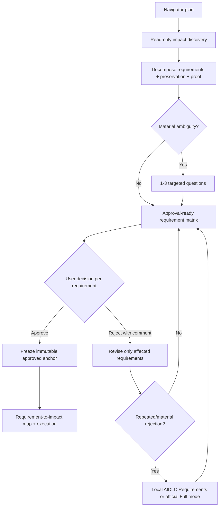

Accepted requirement rows remain preserved while rejected rows are revised.
The revised proposal records its amendment/revision relationship, and later
drift, evidence, recovery, and closure artifacts use the same immutable
requirement UID. This prevents a correction or rollback from guessing which
part of a broad request it belongs to.

### Discovery, stories, acceptance, and design decisions

Navigator Deepening should add the useful upstream parts of AIDLC without
forcing a full official lifecycle. The output is an approval-ready discovery
and design packet—not code and not a substitute for source evidence.

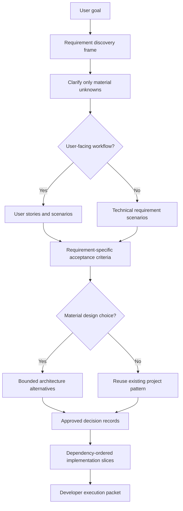

#### 1. Requirement discovery frame

Before it writes requirement rows, Navigator should identify the smallest set
of facts that define delivery intent:

| Discovery field | Purpose |
| --- | --- |
| Actors / consumers | Who triggers, observes, or depends on the behaviour. |
| Desired outcome | What must become observably true. |
| Explicit constraints | User-stated boundaries, technology constraints, deadlines, policy. |
| Preserve rules | What must remain unchanged and compatible. |
| Dependencies | Callers, services, data, events, external contracts, rollout dependencies. |
| Assumptions | Provisional facts visibly marked for validation or approval. |
| Material unknowns | Unknowns that would change requirement scope, safety, design, or proof. |

Navigator should ask a question only for a material unknown. It must not ask
for information that a bounded read-only code graph, project policy, approved
anchor, or existing contract can answer.

#### 2. Conditional user stories and technical scenarios

User stories are valuable for user-facing workflows, API consumer behaviour,
or stakeholder-facing features. They should not be forced on a one-line bugfix
or internal refactor. For a technical-only change, use the equivalent
requirement scenario without inventing an end user.

```text
User story
As a customer,
I want to cancel an order before shipment,
so that I can recover payment and unused inventory is released safely.

Technical scenario
Given an order has already shipped,
when a cancellation request reaches the order service,
then the service rejects it without releasing inventory or issuing a refund.
```

Stories and scenarios must reference their parent requirement UID after the
anchor is approved. They are not separate delivery requirements unless the
user explicitly approves them as such.

#### 3. Requirement-specific acceptance criteria

Replace generic acceptance text such as “the behaviour is observable” with
concrete, independently provable scenarios. A compact Given/When/Then form is
enough for most work.

```text
REQ-02 — Release inventory exactly once

Given a cancellable paid order with reserved inventory,
when the same cancellation request is retried,
then inventory is returned once only and the response remains idempotent.

Proof: inventory integration receipt + idempotency service test.
Preserve: shipment, payment, and notification behaviour outside cancellation.
```

The requirement matrix stores the criteria and proof plan; TailTrail’s testing
and closure flows later map actual receipts back to this UID.

#### 4. Bounded architecture/design alternatives

Navigator must compare alternatives only when there is a genuine material
choice: a new boundary, changed public contract, shared-state coordination,
new data model, cross-service dependency, or non-trivial migration. It should
not manufacture alternatives to make a simple fix look architectural.

- Show at most **two or three** options.
- Include reuse potential, affected boundaries, risk, validation implications,
  migration/rollback impact, and why one option is recommended.
- Prefer an existing project pattern when it satisfies the approved outcome.
- Escalate to full official AI-DLC when the alternatives cannot be evaluated
  from available source/context or require broader stakeholder decisions.

| Option | Benefits | Risk / cost | Recommendation |
| --- | --- | --- | --- |
| Extend existing order service | Reuses ownership, transaction, and authorization patterns | Service can grow | Recommended if it already owns order lifecycle transitions. |
| Add cancellation orchestrator | Isolates multi-side-effect flow | New abstraction, more caller changes, more recovery surface | Use only if side effects are already separately orchestrated. |

#### 5. Decision records

Every approved material decision must be persisted separately from raw chat
reasoning and linked to requirement IDs. A decision record explains *why* the
approved implementation shape exists, while the requirement states *what*
must be true.

```json
{
  "type": "tailtrail-navigator-design-decision",
  "decision_id": "DEC-start-20260811-abc123-r1-01",
  "requirement_uids": ["REQ-start-20260811-abc123-r1-02"],
  "decision": "Extend the existing order service cancellation boundary.",
  "alternatives_considered": ["new cancellation orchestrator"],
  "reason": "The existing service already owns order lifecycle validation and transaction boundaries.",
  "preserve_rules": ["Do not alter shipped-order processing."],
  "validation_implication": "Require inventory/payment integration and idempotency proof.",
  "status": "approved"
}
```

If later evidence disproves a decision, TailTrail opens an explicit amendment
against the affected requirement/decision IDs. It does not silently rewrite
the old rationale or discard the original approved boundary.

#### 6. Post-approval implementation slices and developer execution packet

Navigator planning stays separate from code generation. Detailed execution
planning is created only after the requirement boundary and material decisions
are approved. It is a dependency-ordered set of small slices, not an invitation
to rewrite the entire feature in one pass.

```text
Slice 1 — Eligibility and order state transition
Slice 2 — Idempotent inventory and payment effects
Slice 3 — API, notification, and audit contract
Slice 4 — Integration, behaviour, and rollout evidence
```

Each active slice receives a compact developer execution packet:

| Packet field | Purpose |
| --- | --- |
| Active requirement UIDs | Limits implementation to the current approved objective. |
| Approved decision references | Explains required implementation shape and avoids repeating design debate. |
| Likely paths and protected paths | Guides reads; does not become an unsafe edit allow-list. |
| Preservation rules | States behaviours/security/contracts that must not regress. |
| Required evidence | Names test/receipt tiers needed before the slice can close. |
| Prior drift/correction memory | Prevents a repeated failure only when relevant to the slice. |
| Escalation route | Identifies whether a discovered design gap returns to Navigator Deepening, local AIDLC, or official Full mode. |

Code generation remains the responsibility of the host/developer perspective.
Navigator supplies a bounded, traceable execution packet; TailTrail harnesses
verify the resulting evidence rather than trusting that the agent followed it.

### Navigator features and implementation changes

| Improvement | Current gap | Proposed implementation |
| --- | --- | --- |
| Complexity classifier | Lite versus full AIDLC is too coarse | Add a deterministic `requirements_mode` decision: `lite`, `deepen`, `official-full`. |
| Requirement decomposition | Generic goals can yield one broad row | Extend `scripts/navigator.py` and `scripts/planning-lock.py` with bounded feature/side-effect/contract decomposition. |
| Requirement quality checks | Outcome, preservation, dependency, and proof can be missing | Add a validator that marks incomplete rows and triggers only targeted questions. |
| Dependency/impact mapping | Current likely paths can be a flat list | Use Code Graph Lite results to attach likely caller, contract, and test relationships to each row. |
| Discovery frame | Initial plans may miss actors, assumptions, non-goals, or material unknowns | Add a bounded discovery object populated from the request, policy, and read-only graph evidence. |
| User stories/scenarios | No structured workflow representation | Generate conditional user stories for user-facing work and technical Given/When/Then scenarios otherwise. |
| Acceptance criteria | Existing criteria can be generic defaults | Validate requirement-specific observable criteria and proof plans before an anchor can be approved. |
| Architecture alternatives | Navigator maps impact but does not compare choices | Add a maximum-three-option decision matrix only for material design choices. |
| Decision capture | Approved rationale is not a first-class Navigator artifact | Persist requirement-linked approved design decision records with amendment history. |
| Execution handoff | Host agents can receive a broad plan rather than active-slice context | Generate a post-approval developer execution packet and dependency-ordered slices. |
| Question selection | Current AIDLC questions are all-or-escalation | Add a local question budget and materiality filter before AIDLC escalation. |
| Approval rendering | Plan may not show why a feature was selected | Render selected mode, selected TailTrail controls, requirement matrix, and only open assumptions. |
| Requirement revision | Rejection behavior exists but is not mode-aware | Preserve approved rows, revise rejected rows, escalate only after the defined rejection threshold. |
| Evidence planning | Tests can appear as a generic command | Derive minimum evidence tier per requirement and pass it to the harness/checkpoint layer. |

Suggested file scope for a V1:

- `scripts/navigator.py` — select `requirements_mode`, identify complexity
  signals, and produce bounded structured requirement candidates.
- `scripts/planning-lock.py` — persist the candidate matrix, targeted questions,
  revisions, and approved anchor mapping.
- `scripts/task-start.py` — render the compact/verbose plans without duplicating
  the full AIDLC questionnaire.
- `scripts/change-intent-anchor.py` plus new decision/packet helpers — persist
  requirement-linked decisions, amendments, scenarios, active slices, and
  compact execution packets without changing approved history in place.
- `schemas/` — add a versioned requirements-deepening proposal schema if the
  existing planning/anchor schemas cannot hold discovery, scenarios, decisions,
  and execution packet contracts cleanly.
- `tests/test_navigator_core.py`, `tests/test_planning_lock.py`, and
  `tests/test_start_entrypoints.py` — test selection, bounded questions,
  rejection escalation, approved-row preservation, and output shape.
- `TAILTRAIL-COMMANDS.md`, `USER-GUIDE.md`, and the automation guide — document
  selection rules and user overrides.

### Definition of done

1. A medium multi-file request produces independently testable requirement rows
   with preservation, dependency, and proof fields.
2. A small bug fix remains Lite and does not receive unnecessary questions.
3. The first plan asks at most three material questions.
4. Recommendations are visibly advisory until user approval.
5. Per-requirement feedback revises only rejected rows and preserves accepted
   requirements/IDs.
6. Repeated or large ambiguity moves to AIDLC rather than endlessly expanding
   the Navigator plan.
7. The resulting approved anchor maps every requirement to later impact, drift,
   evidence, recovery, and closure records.
8. User-facing work gets conditional user stories and scenario-based acceptance
   criteria; technical work gets technical scenarios without invented personas.
9. Material architecture choices have a bounded, approved decision record;
   simple work reuses an existing pattern without manufactured alternatives.
10. Implementation begins from an active-slice developer packet, not a broad
    generic plan.

## 7. Implementation phases

### Phase A — Official-pack compatibility foundation — implemented

Phase A is deliberately **detection only**. It does not download, attach,
execute, or modify an official pack. This keeps official-pack provenance
separate from TailTrail's local Lifecycle Lite until a later phase explicitly
introduces an approved bridge.

- `scripts/aidlc-official-detect.py` validates a local manifest at
  `.tailtrail/official-aidlc/manifest.json` (or an explicitly supplied,
  in-root manifest).
- `templates/official-aidlc-pack.manifest.example.json` and
  `schemas/official-aidlc-pack.schema.json` define the required official
  source, pinned commit/version, MIT-0 license record, supported host adapter,
  and SHA-256 declarations for all required pack files.
- `tailtrail aidlc official status --root .` returns `not-installed`,
  `compatible`, `altered`, or `incompatible`, with evidence and the next safe
  action. `aidlc_official_status` exposes the same inspection through the
  read-only MCP surface.
- Focused tests cover a missing manifest, a compatible pinned pack, integrity
  alteration, incompatible source metadata, and attempts to point outside the
  selected project root.

Phase A never treats a template as an installed pack and never labels a pack
as official merely because files happen to be present.

### Phase B — Mode selection and bridge identity — implemented

TailTrail Start now has four lifecycle depths: Lite, Standard, Full, and Off.
An optional flag accepts `--aidlc lite|standard|medium|full|off`; `medium` is a
command alias for Standard.

| Mode | Behavior | Safety boundary |
| --- | --- | --- |
| `lite` | Uses the existing TailTrail AIDLC Lifecycle Lite selection rules. | No external pack is required or invoked. |
| `standard` | Uses local AIDLC requirements, acceptance criteria, dependencies, design/evidence planning, and approval-aware delivery. | No external pack is required or invoked. |
| `full` | Requires a Phase A-compatible pinned official pack and writes a planning-only bridge identity. | Explicit opt-in only. It does **not** execute or attach the official engine in Phase B. |
| `off` | Suppresses AIDLC lifecycle routing for this Start run. | Other TailTrail planning and harness controls remain available. |

### Feature boundary by mode

Task-selected TailTrail controls—Navigator, Planning Lock, impact mapping,
Requirement Completion, testing, architecture/behaviour lenses, review, and
completion reporting—remain independently selected from the task. The table
below names the additional controls that the **AIDLC mode itself** contributes.

| Mode | Included mode controls | Explicitly not included yet |
| --- | --- | --- |
| Lite | Navigator/Planning Lock baseline; local Lifecycle Lite only when Navigator selects it. | A mandatory AIDLC requirements workshop; official pack verification; bridge identity. |
| Standard | Lite baseline; local AIDLC Requirements stage with assumptions, non-goals, questions, recommendations, answer revision; canonical approved anchor and requirement-linked handoff; hands-free programme requirements/slices/checkpoints when requested. | External official engine execution, official host session attachment, and official stage traversal. |
| Full | Common TailTrail controls; Phase A pack compatibility; immutable source/revision/intent/session bridge; append-only activation; Phase I receipt-driven runtime attachment and stage traversal. | Arbitrary official-pack script execution by TailTrail and unverified host-runtime claims. |
| Off | Common TailTrail controls, with AIDLC routing suppressed. | Local AIDLC requirement stage, official verification, and bridge identity. |

Every Start report now renders this mode-feature matrix beside its selected
TailTrail controls, so users can distinguish “selected because of task scope”
from “included because of the chosen AIDLC depth.”

### Deterministic intent routing

| Start wording | Selected mode | Selection reason |
| --- | --- | --- |
| No AIDLC wording | Lite | Default route keeps ordinary tasks lightweight. |
| `using AIDLC`, `use AIDLC`, or `with AIDLC` | Standard | The user asked for stronger lifecycle support without asking for the external engine. |
| `hands-free` or `end-to-end` | Standard | Programme planning, requirement breakdown, slices, checkpoints, and local AIDLC requirement gathering are selected. |
| `full AIDLC` or `official AIDLC` | Full | Explicit Full request; Phase A compatibility is mandatory. |
| `do not use AIDLC` | Off | Explicit opt-out wins. |

For a hands-free request, Navigator additionally evaluates Full escalation. It
requires at least two programme-scale signals—such as regulated/compliance,
production/release, rollout, migration, infrastructure/Terraform, security,
operations, or multi-team delivery—and a compatible pinned pack. If the pack
is absent or incompatible, the report stays Standard and records
`eligible-awaiting-compatible-pack`; it does not fail ordinary planning.

An explicit mode flag always wins over natural-language routing. Therefore,
`--aidlc standard` keeps even a high-signal hands-free task in Standard, while
`--aidlc full` requires compatibility and refuses an unverified pack.

For Full mode, `scripts/aidlc-official-bridge.py` creates the immutable
`.tailtrail/runs/<run-id>/aidlc-official/bridge-v1.json` identity. It maps the
TailTrail run ID to the verified official source/revision, official intent ID,
host session ID, and starting stage. If the caller does not supply intent or
session IDs, TailTrail creates a deterministic intent label and an explicitly
labelled `pending-host-session` placeholder; it never pretends a real official
session has begun.

On Planning Lock approval, a separate append-only
`aidlc-official/activation-v1.json` and run-ledger event record
`approved-awaiting-host-attachment`. The bridge can be inspected through
`tailtrail aidlc official bridge show --root . --run-id <run-id>` or the
read-only `aidlc_official_bridge_show` MCP tool.

Phase B deliberately stops at bridge identity. Official requirements execution
and the first linked stage gate are implemented by Phase C below.

### Phase C — Requirements and approval adapter

**Implemented — Requirements Analysis adapter V1.** Full mode now reads the
verified official-pack Requirements Analysis, question-format, content
validation, and session-continuity rules through
`scripts/official-aidlc-requirements.py`. It does not call the local
`scripts/aidlc-requirements.py` engine.

The adapter writes a small, auditable set of run-local artifacts:

- `planning/official-aidlc-requirements-v1.json` — sanitized proposed
  requirements, official rule references, and questions;
- `aidlc-official/requirements/questions-v1.md` — official-format question
  sheet for the host/user;
- `planning/official-aidlc-revised-requirements-v1.json` — answers and only
  the imported official requirement references/decisions;
- `aidlc-official/requirements/approval-v1.json` — the explicit official
  stage decision that authorizes TailTrail to freeze `anchors/approved-v1.json`.

There is one approval, not two: approving the revised official Requirements
Analysis stage writes the official gate artifact, freezes the TailTrail anchor,
activates the existing Planning Lock, and creates the normal execution handoff.
Direct `activate` is intentionally blocked until the official revision exists.

When a Full-mode plan is rejected, TailTrail keeps the run and its evidence.
Requirement feedback routes to **official requirements**. Feedback that names a
design or architecture boundary records an **official-design** route in
`aidlc-official/revisions/route-v1.json`; Phase D will execute that design
stage. TailTrail does not substitute its own parallel questionnaire.

- [x] In Full mode, use the official requirements stage instead of `scripts/aidlc-requirements.py`.
- [x] Import sanitized requirement references and approved decisions.
- [x] Freeze TailTrail anchor after official-stage approval.
- [x] Send rejection/revision to official requirements/design, not a parallel TailTrail questionnaire.
- [x] Implement the Requirements-stage Official Approval-Gate Adapter that maps the official gate to
  TailTrail requirement/decision/evidence transitions and records one linked
  event per decision.
- [ ] Add adaptive gate profiles for focused, medium, hands-free, and
  regulated/production-sensitive work. Apply gates only for material scope or
  design transitions; permit bounded correction within the approved boundary.
- [x] Add the Requirements-stage single-prompt guarantee, gate artifact/evidence preflight, rejection
  routing, and an explicitly labelled TailTrail-native fallback when no pinned
  official session is attached.

### Phase D — Evidence checkpoint adapter

**Implemented — deterministic checkpoint adapter V1.**
`scripts/official-aidlc-checkpoint.py` bridges the approved Full-mode anchor to
versioned local design, test-strategy, evidence, correction, and handoff
artifacts. It is deliberately computational and receipt-driven: it does not
execute the remote official workflow, source edits, tests, CI, deployments, or
model agents.

```text
approved official requirements
  -> design-plan / explicit design decision
  -> requirement-linked test-plan bridge
  -> supplied evidence receipts
  -> evidence checkpoint
  -> complete handoff OR Build & Test correction packet
```

Available commands:

```bash
tailtrail aidlc official checkpoint design-plan --root . --run-id <run-id>
tailtrail aidlc official checkpoint design-approve --root . --run-id <run-id> --approved
tailtrail aidlc official checkpoint construction --root . --run-id <run-id> --checkpoint <saved-harness-checkpoint.json>
tailtrail aidlc official checkpoint test-plan --root . --run-id <run-id> --strategy standard
tailtrail aidlc official checkpoint evidence --root . --run-id <run-id> --receipt <saved-receipt.json>
tailtrail aidlc official checkpoint handoff --root . --run-id <run-id>
```

The design plan selects applicable Product, Developer, Quality, Architect,
DevSecOps, Platform, and Operations perspectives deterministically from the
approved requirements. They are traceability records and routing guidance, not
claims that autonomous sub-agents ran. The test-plan bridge maps `minimal`,
`standard`, and `comprehensive` strategy to requirement-level evidence tiers.
Missing evidence creates one bounded correction packet that returns to
**Build & Test** while preserving the anchor, design record, receipts, drift,
and recovery history.

- [x] Define hooks for design approval, validation/build-and-test, and operations/release handoff.
- Implement Navigator Discovery and Design: a bounded discovery frame,
  conditional user stories/technical scenarios, requirement-specific acceptance
  criteria, materiality-gated architecture alternatives, immutable
  requirement-linked decision records, and post-approval developer execution
  packets with dependency-ordered active slices.
- Add amendment handling so a decision disproved by later evidence is revised
  with a new decision version and preserved history, rather than silently
  altering the approved design.
- [x] Add a versioned perspective selection record and deterministic selector.
  Persist selected/skipped perspectives, their requirement UID mappings,
  activation reasons, required outputs, and execution boundary in the approved
  run state.
- Map perspective outputs to existing TailTrail controls where possible:
  Architect to Code Graph/Architecture Fitness, Quality to testing profiles and
  receipts, Behaviour to Behaviour Harness, DevSecOps to guardrail/dependency/CI
  evidence, Operations/Platform to release/recovery controls, and
  Maintainability to its existing harness.
- [x] Extend dashboard and Completion Report rendering with the selected
  perspective table plus checkpoint status (`pass`, `gap`, or `not-triggered`).
- Keep model-backed or multi-agent perspective execution optional and
  separately approved; V1 uses host reasoning plus deterministic local tools.
- [x] Add an official test-strategy bridge after requirements/design approval. Map
  each official test intent to a TailTrail requirement UID, minimum evidence
  tiers, planned receipt types, and applicable harnesses.
- [x] Translate official `minimal`, `standard`, and `comprehensive` test strategy
  into TailTrail evidence tiers without treating test-count guidance as proof.
- [x] Route missing or failed requirement-linked test evidence back to the official
  Build & Test stage through a bounded correction packet.
- [x] Run only applicable TailTrail computational sensors through existing harnesses; this adapter itself does not run them.
- [x] Convert a gap into: requirement UID, evidence gap, affected symbols/files, recommended prior official stage.
- [x] Preserve both histories; never restart from zero because one test failed.

### Phase E — Closure adapter

**Implemented — closure adapter V1.** Full-mode closure now augments the
normal TailTrail Completion Report with selected official perspectives,
evidence-checkpoint status, and reference-only handoff/operations links. It
does not copy receipt bodies, source, prompts, logs, or deployment data.

The established close-out choices remain unchanged for the user:

```text
Completion Report
  -> accept-user: candidate-only learning + paired local evaluation
  -> wait-ci: no learning; await linked CI ingestion
  -> reopen: retain evidence and return to correction/replan
```

After `wait-ci`, an explicit `accept-ci` control accepts only a linked
`tailtrail-ci-evidence-ingestion` artifact for the same run with provenance and
saved receipts. It then creates the same candidate-only learning and
deterministic paired evaluation as user acceptance. Neither acceptance path
promotes learning into future guidance automatically.

- [x] Create TailTrail Completion Report from mapped official and local evidence.
- [x] Preserve existing acceptance choices: user, wait for linked CI, reopen.
- [x] Link official handoff/operations references without copying sensitive artifacts.
- [x] Create candidate-only learning/evaluation only after acceptance.

### Phase F — Host adapters and conformance suite

**Implemented — composed host surface V1.** The versioned matrix at
`adapters/host-compatibility-v1.json` defines one precedence order and six
conformance scenarios. `scripts/host-adapter-conformance.py --write` generates
the composed surfaces for Codex, Copilot, and Claude under `adapters/generated/`.
`tailtrail adapters conformance` validates that generated output still matches
the matrix and that all three host source surfaces exist.

The precedence order is fixed:

```text
host safety -> user request -> official stage rules -> TailTrail assurance rules
```

The suite is intentionally an instruction/conformance check, not a claim that
different commercial hosts execute tools identically. Runtime behavior remains
host-dependent and must be evaluated separately.

- [x] Generate a composed instruction surface for Codex, Copilot, and Claude.
- [x] Precedence: host safety → user request → official stage rules → TailTrail assurance rules.
- [x] Test small bug, hands-free feature, rejected requirement, evidence failure, recovery, and CI wait as deterministic conformance scenarios.
- [x] Publish a versioned compatibility matrix.

## 8. Risks and controls

| Risk | Control | Status |
| --- | --- | --- |
| Two orchestrators disagree | Official AI-DLC receipts route stages in Full mode; TailTrail remains assurance-only and never invents a transition | Implemented locally in Phase I |
| Official changes break integration | Pin release/commit, hash assets, and revalidate compatibility before attachment and every transition | Implemented locally in Phases A and I |
| Host instruction collision | Generate one composed host adapter, then validate real behavior with a separate sanitized receipt contract | Instruction composition implemented in Phase F; Phase J runtime intake/reporting implemented locally; actual hosts remain evidence-dependent |
| Duplicate/conflicting state | Define one source of truth per field and validate every runtime projection | Implemented locally in Phases G and I |
| Sensitive lifecycle content leaks | Sanitize bridge/session/transition records and store references rather than raw artifacts | Implemented locally in Phases H and I |
| Full lifecycle overloads simple work | Lifecycle Lite remains default; Standard remains local; Full runtime is explicit | Implemented in mode selection and Phase I isolation tests |

Phases G-J now enforce local state ownership, sanitization, official-session
attachment, and receipt-backed host-runtime evaluation. The implementation is
complete locally, but universal cross-host compatibility is never inferred:
each Codex, Copilot, or Claude host/version remains `not-validated` until all
six current scenarios supply fresh passing receipts.

## 9. Risk-control implementation phases

### Phase G - Canonical state ownership and conflict detection - implemented

**Implementation status:** completed end to end for the local canonical-state
contract. TailTrail now has a versioned ownership registry, canonical run-state
schema, deterministic read-only projector/validator, CLI and MCP inspection,
consumer gates, dashboard/completion visibility, installer/registry coverage,
and focused conflict/legacy compatibility tests.

**Goal:** eliminate duplicate or contradictory state across the Planning Lock,
official bridge, approved anchor, checkpoints, evidence, closure, evaluation,
and learning artifacts.

#### Required contract

Create a versioned field-ownership registry. Every shared field must have one
authoritative artifact; all other artifacts contain projections or references.

| Field | Authoritative artifact | Consumers |
| --- | --- | --- |
| `run_id` | Planning Lock | Every run artifact |
| `requirement_uid` and approved statement | Immutable approved anchor | Checkpoints, drift, evidence, closure |
| Official source, revision, intent, session, and current stage | Official bridge/session artifact | Checkpoints, dashboard, closure |
| Requirement delivery status | Latest valid Harness checkpoint | Dashboard, completion, correction |
| Test and behavior result | Saved requirement-linked evidence receipt | Harness, completion, evaluation |
| Drift status | Latest valid drift checkpoint | Correction, recovery, completion |
| Delivery acceptance | Closure acceptance artifact | Learning and evaluation |

The validator must never silently choose between conflicting values. A conflict
produces a structured issue naming the field, owning artifact, conflicting
projection, and recovery action. It must not overwrite either artifact.

#### Implementation

1. Add `adapters/official-aidlc-field-ownership-v1.json` as the versioned field
   ownership registry.
2. Add `schemas/official-aidlc-run-state.schema.json` for the canonical projected
   state returned to consumers.
3. Add `scripts/official-aidlc-state.py` with deterministic `show` and `validate`
   operations.
4. Resolve artifacts by run ID, validate schema/version compatibility, verify
   cross-references, and identify missing, stale, or contradictory projections.
5. Update official requirements, checkpoints, completion, and closure code to
   consume the canonical projection rather than infer the same values separately.
6. Surface conflicts in the Workflow Dashboard and Completion Report without
   mutating project source or choosing an arbitrary winner.

Implemented files:

- `adapters/official-aidlc-field-ownership-v1.json` - new ownership registry.
- `schemas/official-aidlc-run-state.schema.json` - new state contract.
- `scripts/official-aidlc-state.py` - new projector and validator.
- `scripts/official-aidlc-requirements.py` - emit owned requirement references.
- `scripts/official-aidlc-checkpoint.py` - consume canonical requirement/stage state.
- `scripts/completion-report.py` - report state conflicts and source references.
- `scripts/closure-close.py` - refuse closure with unresolved canonical conflicts.
- `scripts/tailtrail.py` - expose the state commands.
- `tests/test_official_aidlc_state.py` - ownership and conflict fixtures.
- `scripts/mcp-server.py` - expose read-only `aidlc_official_state_show`.
- `tailtrail-registry.json` and `scripts/check-tailtrail.py` - installation and
  registry coverage.

Proposed commands:

```powershell
py -3 scripts/tailtrail.py aidlc official state show --root . --run-id <run-id>
py -3 scripts/tailtrail.py aidlc official state validate --root . --run-id <run-id>
```

Validation must cover valid projection, missing owner, stale projection, changed
official revision, duplicate requirement UID, conflicting acceptance status,
unknown schema version, and legacy-run read compatibility.

Implemented behavior:

- Manifest run identity is authoritative across anchor, bridge, activation,
  checkpoints, receipts, closure, and learning projections.
- The immutable approved anchor owns requirement UIDs and statements.
- Anchor fingerprint mismatches, unknown requirement projections, duplicate UIDs,
  official identity/stage contradictions, and mismatched evidence receipts are
  blocking conflicts.
- Missing legacy checkpoint fingerprints are warnings, preserving compatibility
  without presenting them as exact canonical proof.
- Official checkpoint creation, Completion Report, closure, and Workflow
  Dashboard consume the same deterministic projection. Closure refuses unresolved
  conflicts, while inspection never modifies or auto-reconciles artifacts.
- The CLI returns exit code `1` for a validated conflict and `2` for an invalid
  invocation or artifact read error.

**Completion evidence:** focused Phase G and affected-consumer regression tests
pass. Phase H remains responsible for deeper sensitive-data enforcement; Phase I
remains responsible for live official-session attachment.

### Phase H - Sensitive-data enforcement - implemented

**Implementation status:** completed end to end for the local official AI-DLC
artifact boundary. The control is dependency-free, read-only during validation,
and fail-closed before persistence. Rejected values are never returned in the
validation report or error message.

**Goal:** convert the current "sanitized references only" policy into an enforced
trust boundary for all official AI-DLC bridge inputs and outputs.

#### Allowed bridge content

- TailTrail-generated run and requirement identifiers.
- Strictly validated official intent/session identifiers.
- Approved short summaries that pass the sanitizer.
- Evidence type, status, hash, command label, and requirement linkage.
- Local retrieval references constrained to the project root.
- External references using explicitly allowed URI schemes without credentials.

Raw prompts, source, diffs, logs, environment dumps, credentials, customer data,
PII/PHI, unrestricted official metadata, and full deployment receipts remain
blocked by default.

#### Implementation

1. Add `schemas/official-aidlc-sanitized-reference.schema.json` with an allowlist
   of fields and bounded string sizes.
2. Add `scripts/official-aidlc-sanitize.py` for field validation, safe path/URI
   handling, and common secret-pattern detection.
3. Validate official intent and session IDs so arbitrary prompt content cannot be
   stored in identifier fields.
4. Require local references to resolve inside the selected project root. Reject
   URL credentials and unsupported URI schemes.
5. Fail closed when unsafe content is found. The error artifact records only an
   issue code and field name; it never repeats a detected secret.
6. Apply the boundary at bridge creation, official requirements intake,
   checkpoint intake, handoff, closure, learning, and evaluation.
7. Preserve exact source and evidence outside the bridge. Sanitization must not
   rewrite authoritative source or pretend that reduced evidence is exact proof.

Implemented files:

- `schemas/official-aidlc-sanitized-reference.schema.json` - new allowlisted contract.
- `scripts/official-aidlc-sanitize.py` - new deterministic sanitizer/validator.
- `scripts/aidlc-official-bridge.py` - validate bridge identity fields.
- `scripts/official-aidlc-requirements.py` - sanitize imported references and decisions.
- `scripts/official-aidlc-checkpoint.py` - sanitize evidence and handoff references.
- `scripts/closure-close.py` - enforce reference-only official closure links.
- `scripts/closure-learning.py` - consume only accepted sanitized closure fields.
- `tests/test_official_aidlc_sanitize.py` - valid and adversarial fixtures.
- `scripts/closure-evaluation.py` - validate deterministic evaluation output.
- `scripts/mcp-server.py` - expose read-only artifact validation.
- `tailtrail-registry.json` and `scripts/check-tailtrail.py` - installation and
  registry coverage.

Validation must include bearer tokens, private keys, connection strings, URL
credentials, path traversal, overlong identifiers, raw prompt-shaped values,
unknown fields, safe local references, and error-message non-disclosure.

Implemented behavior:

- Official intent/session IDs are bounded simple identifiers; overlong, prompt-
  shaped, or credential-bearing values fail before bridge creation.
- Local references must remain repository-relative. Traversal and absolute input
  paths are rejected, and required artifacts must already exist.
- External references are HTTPS-only, must have a hostname, and cannot contain
  credentials or fragments.
- Private keys, bearer/JWT/GitHub/AWS tokens, secret assignments, credentialed
  connection strings, email addresses, and SSN-shaped values are rejected.
- Raw prompts, source bodies, diffs, patches, logs, stdout/stderr, stack traces,
  environment dumps, credentials, customer data, PII/PHI, receipt bodies, and
  deployment bodies are blocked field names at every nesting level.
- Context-specific top-level allowlists reject unknown bridge, requirements,
  checkpoint, closure, learning, and evaluation fields.
- Bridge creation/activation, official requirement gathering/revision,
  construction/evidence checkpoint intake, every official checkpoint write,
  official closure links, positive-learning candidates, and deterministic
  closure evaluations all pass through the shared boundary.
- Exact authoritative source and evidence are inspected in place; the sanitizer
  never rewrites them or presents reduced metadata as exact proof.

Inspection commands:

```powershell
py -3 scripts/tailtrail.py aidlc official sanitize validate --root . --input <artifact.json> --context checkpoint
```

The equivalent `aidlc_official_sanitize_validate` MCP tool is read-only and
returns only validation status, context, type, and field count.

**Completion evidence:** focused adversarial and compatibility tests cover safe
references, bearer/private-key/connection-string patterns, URL credentials,
path traversal, overlong identifiers, prompt-shaped values, unknown fields,
non-disclosure, and pre-write bridge rejection. Phase I validates sanitized,
ordered, integrity-checked official-runtime transition receipts; Phase J applies
the same fail-closed boundary to separately supplied real-host observations.

### Phase I - Official AI-DLC runtime attachment - implemented

**Goal:** close the gap between detecting a compatible official pack and proving
that a Full-mode run is attached to an official lifecycle session.

#### Ownership boundary

```text
official AI-DLC: lifecycle stage selection and official transition authority
TailTrail: approved anchor, scope, evidence, drift, correction, recovery, closure
host: safe command execution and honest execution receipts
```

TailTrail must not execute arbitrary scripts merely because a pack was detected.
Runtime attachment requires a declared host adapter or a validated receipt
interface from the pinned compatible pack.

#### Implemented runtime contract

1. A versioned `v1` runtime-adapter contract wraps the pinned official pack
   through a declared host adapter and receipt interface.
2. Require Phase A compatibility and Phase G canonical-state validation before
   creating a runtime attachment.
3. One immutable session attachment contains the pinned revision,
   official session/intent references, current stage, TailTrail run ID, adapter
   version, and attachment state.
4. Official stage transitions are imported as sanitized, ordered, SHA-256
   integrity-checked receipts. The digest detects post-issuance alteration; it
   is not represented as a cryptographic identity signature.
5. Prevent TailTrail from inventing official transitions and prevent official
   transitions from weakening TailTrail safeguards or changing the approved
   requirement anchor implicitly.
6. Resume, redo, jump, and recovery require explicit official transition
   receipts while preserving prior artifacts and requirement history.
7. Stale, altered-pack, mismatched-run/session/revision/anchor, out-of-order,
   duplicate, invalid-integrity, and invalid-stage receipts are rejected.
   Redo/recovery receipts add an explicit recovery-routing ledger event while
   preserving all earlier receipts.
8. Leave Lite and Standard modes independent of external-engine availability.

Implemented files:

- `schemas/official-aidlc-session.schema.json` - new attachment contract.
- `schemas/official-aidlc-transition-receipt.schema.json` - new transition contract.
- `scripts/official-aidlc-runtime.py` - new attach/status/import/resume surface.
- `scripts/aidlc-official-bridge.py` - supplies immutable bridge identity to attachment.
- `scripts/official-aidlc-checkpoint.py` - refuses Full lifecycle checkpoint claims
  until the verified runtime session is attached.
- `scripts/task-start.py` - distinguishes planning-only Full mode from the
  receipt-driven post-approval runtime.
- `scripts/tailtrail.py` - expose runtime commands.
- `tests/test_official_aidlc_runtime.py` - transition and recovery fixtures.

Commands:

```powershell
py -3 scripts/tailtrail.py aidlc official runtime attach --root . --run-id <run-id>
py -3 scripts/tailtrail.py aidlc official runtime status --root . --run-id <run-id>
py -3 scripts/tailtrail.py aidlc official runtime import-transition --root . --run-id <run-id> --receipt <file>
py -3 scripts/tailtrail.py aidlc official runtime resume --root . --run-id <run-id> --receipt <file>
py -3 scripts/tailtrail.py aidlc official runtime redo --root . --run-id <run-id> --receipt <file>
py -3 scripts/tailtrail.py aidlc official runtime jump --root . --run-id <run-id> --receipt <file>
py -3 scripts/tailtrail.py aidlc official runtime recovery --root . --run-id <run-id> --receipt <file>
```

The attachment is saved at
`.tailtrail/runs/<run-id>/aidlc-official/runtime/session-v1.json`. Accepted
receipts are copied without rewriting into
`runtime/transitions/transition-NNNN.json`. `status` reconstructs the current
stage from those append-only artifacts, so restarting TailTrail resumes the
same session without a mutable stage pointer.

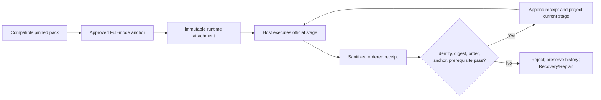

Stage motion is explicit: `advance` moves exactly one stage, `resume` stays on
the current stage, `redo` and `recovery` stay or move backward, and `jump`
moves forward by more than one stage only when the target's TailTrail evidence
prerequisite already exists. Entering implementation requires the approved
design decision; Build & Test requires construction evidence; handoff requires
a complete evidence checkpoint; operations requires a ready handoff.

Validation must cover compatible attachment, missing pack, altered pack, wrong run
ID, stale stage, out-of-order transition, duplicate receipt, resume, redo, jump,
recovery, and Lite/Standard isolation.

**Implementation status:** complete locally. Full-mode official checkpoint
claims require a valid attachment, every accepted lifecycle transition has an
official receipt, and a restarted TailTrail process derives the same session,
stage, transition count, and approved anchor. This is deterministic local
evidence; Phase J separately validates supplied real-host observations.

### Phase J - Real host runtime conformance - implemented locally

**Goal:** validate observable TailTrail behavior in Codex, Copilot, and Claude
instead of treating matching generated instruction files as runtime proof.

The existing deterministic instruction-conformance suite remains useful. This
phase adds a separate runtime evidence layer; the two results must never be
collapsed into one status.

#### Required scenarios

| Scenario | Required observable behavior |
| --- | --- |
| Small bug | Planning Lock and complete Start Report; no write before approval |
| Hands-free feature | Programme requirements, dependency order, first slice, and approval gate |
| Rejected requirement | Same run preserved and rejected rows routed to requirements/design |
| Evidence failure | Requirement remains incomplete and correction/replan is offered |
| Recovery | Approved work is preserved and only task-owned failed work is recovered |
| CI wait | No acceptance learning until a linked CI receipt is validated |

#### Implementation

1. Add a portable runtime scenario package with host-independent observable
   outcomes rather than exact model wording.
2. Generate a host-specific execution bundle without embedding secrets or source.
3. Ingest a sanitized runtime receipt containing host/adapter version, run ID,
   observed state transitions, artifact references, and pass/fail outcome.
4. Validate receipts against the canonical run state and scenario contract.
5. Compare observed outcomes with the versioned compatibility matrix.
6. Publish separate host/version statuses: `passed`, `failed`, `not-validated`,
   `stale`, or `incompatible`.
7. Never report runtime compatibility from generated Markdown alone.

Implemented files:

- `schemas/host-runtime-receipt.schema.json` - new sanitized receipt contract.
- `scripts/host-runtime-conformance.py` - new prepare/record/report surface.
- `adapters/runtime-scenarios-v1.json` - new observable scenario definitions.
- `adapters/host-compatibility-v1.json` - link instruction and runtime versions.
- `scripts/host-adapter-conformance.py` - keep instruction checks distinct.
- `tests/test_host_runtime_conformance.py` - deterministic receipt evaluation.
- `tests/fixtures/host-runtime/` - sanitized pass/fail/stale fixtures.

Commands:

```powershell
py -3 scripts/tailtrail.py adapters runtime prepare --host codex
py -3 scripts/tailtrail.py adapters runtime record --host codex --receipt <file>
py -3 scripts/tailtrail.py adapters runtime report
```

**Complete when:** compatibility is reported per host and adapter version, missing
runtime evidence produces `not-validated`, all six scenarios have observable
pass/fail evidence, and a host failure cannot alter approved state or fabricate
delivery evidence.

#### Implemented runtime contract

`adapters/runtime-scenarios-v1.json` is the host-independent contract. Each of
its six scenarios declares observable outcomes and deterministic canonical-state
probes. Exact assistant wording is intentionally excluded: conformance concerns
state transitions, approval boundaries, saved evidence, and recovery behavior.

`prepare` creates a host-specific bundle under
`.tailtrail/host-runtime/bundles/`. The bundle binds the adapter version,
scenario version, host instruction hash, receipt schema, and scenario set into a
SHA-256 digest. It contains no project source, prompt, secret, runtime outcome,
or pass claim.

After a scenario is exercised in the named host, `record` accepts a sanitized
receipt containing the host version, current bundle digest, scenario and run
identities, ordered observed transitions, named observations, repository-local
artifact references, and a declared outcome. The receipt has its own integrity
digest. At least one referenced artifact must belong to the canonical run.

The validator then projects the saved TailTrail run and checks the scenario's
required probes. A claimed pass cannot override missing Planning Lock,
rejection, checkpoint, recovery, or CI-wait evidence. Validated receipts and
evaluations are stored by host, scenario, and immutable receipt ID; the run
ledger records the evaluation sequence so the report selects the newest
evidence deterministically.

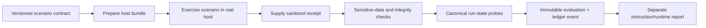

#### Status calculation and evidence boundary

| Status | Meaning |
| --- | --- |
| `passed` | All six current scenarios have fresh passing evaluations for the host. |
| `failed` | A receipt declares failure, omits an observation, or fails a canonical probe. |
| `not-validated` | One or more current scenarios has no supplied runtime receipt. |
| `stale` | The receipt targets an older scenario contract or bundle digest. |
| `incompatible` | The receipt targets an incompatible adapter/runtime contract. |

Instruction conformance is a deterministic repository check. Runtime
conformance is receipt-backed observed evidence. The report preserves both
fields and never converts a generated Markdown match into a runtime pass.
Current hosts therefore remain `not-validated` until actual Codex, Copilot, and
Claude executions supply all required receipts; this is an honest external
evidence state, not an implementation gap.

#### Product integration and validation

- CLI: `tailtrail adapters runtime prepare|record|report`.
- MCP: read-only `host_conformance_report`; receipt recording remains an
  explicit CLI trust-boundary action.
- Installation: the extended pack includes the runtime evaluator, schema,
  scenario contract, matrix, and fixtures required by installed hosts.
- Registry: `host-runtime-conformance` records commands, scripts, docs, MCP,
  dependencies, and evidence boundaries.
- Tests: bundle portability, all-six pass, missing/failed/stale/incompatible
  classification, sensitive input rejection, canonical-state preservation,
  public CLI dispatch, MCP inspection, and installed-pack inventory.

**Implementation status:** complete locally. The prepare, sanitize, validate,
record, ledger, report, CLI, MCP, installation, registry, and deterministic test
paths are implemented. Recording real-host receipts is deliberately an
external conformance activity and cannot be fabricated by this repository.

### Delivery order and release gate

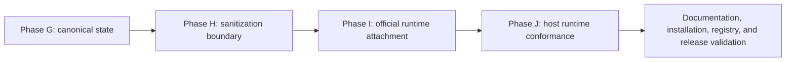

The order is deliberate. Runtime attachment and host evaluation must not be
built on ambiguous state ownership or an unenforced data boundary.

Phases G-J are implemented locally. The Risks and Controls table, roadmap,
command reference, installer manifests, MCP inspection, compatibility matrix,
registry, changelog, and focused conformance tests now reflect that state.
External host/version rows remain evidence-dependent and must not be promoted
from `not-validated` without six real passing receipts.

## Recommendation

Phases A-J now provide the local compatibility, mode, requirement, checkpoint,
closure, state-ownership, sanitization, official-runtime, instruction, and
real-host receipt foundation. TailTrail Lifecycle Lite and Standard mode remain
the portable fallback for projects that do not install or attach the official
AI-DLC engine. Full mode and runtime-conformance claims remain bounded by the
specific official pack and host receipts actually validated.
