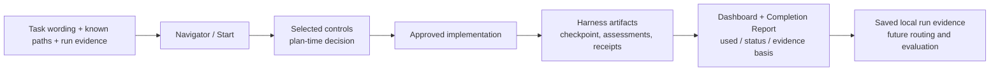

# TailTrail Automatic Routing and Trigger Guide

## What is automatic today

TailTrail currently provides **automatic workflow selection**, not hidden
autonomous execution. `tailtrail start`/Navigator reads task wording, known
changed paths, and optional local run evidence to choose the smallest relevant
controls. After approval, the host or coding agent performs implementation and
the selected checks.

```text
task -> Navigator selection -> user approval -> agent/check execution -> saved evidence -> report/dashboard
```

This separation keeps unclear prompts from silently running tests, recovery,
source edits, or expensive tooling.

## Normal starting point

```text
Using TailTrail Navigator, plan "add payment retry handling" before implementation.
```

CLI users can use:

```bash
tailtrail start "add payment retry handling" --changed src/payments/worker.py
```

`--changed` is optional, but it makes impact mapping and architecture routing
more accurate. `--run-id` is required when retry/recovery must read evidence
from one particular prior run.

## Planning Lock: `tailtrail start` never implements

An explicit `tailtrail start` creates a local Planning Lock and returns a plan
only. This precedence rule wins even when the same prompt says `implement`,
`set up`, `create`, `replicate`, or `do similar`.

```text
tailtrail start -> Start Report + Planning Lock (awaiting-approval)
                -> no source edits / Git mutations / Terraform or Sonar execution
                -> explicit approval for the exact run ID
                -> managed writes become permitted for that run only
```

The lock is stored under `.tailtrail/runs/<run-id>/planning/lock-v1.json` and
can include read-only reference repositories. The plan response names the run
ID and prints the exact separate approval command:

```bash
tailtrail planning approve --root . --run-id <run-id> --approved
```

`tailtrail planning assert-write --root . --run-id <run-id>` is the managed
execution gate. The controlled MCP patch and computational-control tools both
require `approved: true` and an approved matching Planning Lock; without them
they refuse source changes or project-command execution. This is a real
boundary for TailTrail-managed actions. A host agent with
unrestricted shell/file tools can still bypass it, so adapters also repeat the
planning-only rule as a behavioral guardrail.

### Host-neutral persistence

Codex, GitHub Copilot, Claude, Cursor, Gemini, and ChatGPT do not all have the
same execution permissions. TailTrail therefore uses one artifact protocol,
not a Codex-only behavior:

| Host capability | Required action after the user says `tailtrail start` | Persisted result |
| --- | --- | --- |
| Can execute local commands | Run `tailtrail start "<goal>"` in the target repository. | Planning Lock and run ledger under `.tailtrail/runs/<run-id>/`. |
| Has local TailTrail MCP | Call `planning_lock_start` with the goal and `approved: true`, then obtain the plan through `start_report` or `navigator_plan`. | The same Planning Lock and run ledger. |
| Cannot execute commands or MCP | Return a plan only and state that it is not persisted; show the exact local command. | No artifact and no claim of a saved run. |

Every adapter carries this rule. A later `planning_lock_approve` MCP call or
`tailtrail planning approve` CLI command is still required before managed
execution.

### Hands-free is planning-first

Treat `tailtrail start,`, `tailtrail start:`, and `tailtrail start -` as the
same explicit Start request. `hands-free` or `end-to-end` does not mean that an
agent may silently begin work. It means the initial Start report must select the
Program Delivery Harness and show the proposed feature requirements, dependency
order, first active slice, and approval gate. Only a later approval permits the
first slice to execute.

## Trigger matrix

| Capability | Trigger | Inputs/evidence required | Result | Never automatic |
| --- | --- | --- | --- | --- |
| Canonical requirements + Completion Harness | Any non-tiny code task | Goal, then approved anchor | Requirement boundary, checkpoint/review path | Source edits, test execution, approval |
| Impact Map + Architecture Fitness | Multiple changed paths, or feature/service/API/migration wording | Changed paths and approved architecture contract | Caller/test/path mapping and structural assessment | Assumed callers or correction writes |
| Behaviour Harness | UI/API/endpoint/workflow/journey wording | Approved scenario plus matching receipt | Behaviour evidence assessment | Invented integration/E2E proof |
| Maintainability Harness | Navigator classifies a refactor | Approved requirement and changed scope | Complexity/scope assessment | Style-only blocking |
| Program Delivery | Prompt includes `hands-free` or `end-to-end` | Broad goal and feature/phase plan | Program sequence and resume state | Unapproved long-running work |
| Context Continuity + correction | Explicit `--run-id` has feedback or drift | Feedback/checkpoint artifacts | Compact packet and one bounded correction route | Guessed run ID or endless retry |
| Recovery Boundary | Explicit `--run-id` has recovery evidence | Recovery/reconciliation artifacts | Safe recovery route | Reset, overwrite, commit, or push |
| Completion Report | Explicit closure command | Anchor, checkpoint, review/gate, receipts, lens/recovery artifacts | One fail-closed handoff | Creating missing proof |
| Evaluation dataset | Explicit evaluation command | Curated or measured paired dataset | Cross-task metrics | Deciding current-task completion |

## How TailTrail shows selected and used harnesses

TailTrail reports feature use at two distinct points. The Start Report answers
**what Navigator selected and why** before implementation. It lists selected
controls, deferred controls, and their trigger reasons. The Dashboard and
Completion Report answer **what actually produced evidence** after or during
the run.



The final Harness Usage table uses the following terms:

| Value | Meaning |
| --- | --- |
| `used: yes`, `pass` | A saved assessment/checkpoint exists and its deterministic completion result passed. |
| `used: yes`, `fail` | The selected harness ran and found an unresolved gap. |
| `used: no`, `not-selected` | No matching saved artifact exists and the task did not declare that harness as required. This is not a failure. |
| `used: no`, `required-evidence-missing` | The approved task required the control, but no required evidence artifact exists. Completion must remain incomplete. |
| `in-progress` | The Requirement Completion path has started, but checkpoint/review/gate evidence is not yet complete. |

The table includes Requirement Completion, Architecture Fitness, Behaviour,
Maintainability, and Evidence-Aware Testing. Each row contains the selection or
evidence basis, so a later TailTrail evaluation can distinguish “a harness was
not needed” from “a needed harness was selected but never produced proof.” This
is saved local evidence for tuning future routing; it is not a claim that one
run proves a global quality or token improvement.

## 1. Canonical requirements and Completion Harness

For a normal code task that is not classified as a tiny lean edit, Start selects
Canonical Requirements, Requirement Completion Harness, and Evidence-Aware
Testing. After approval, the run receives an immutable anchor with requirement
IDs, scope, preservation rules, and evidence expectations. A checkpoint maps
each requirement ID to observed implementation state and control evidence;
completion review names omissions; the evidence gate refuses to turn missing,
blocked, or unavailable proof into a pass.

You must approve the proposed requirement boundary and run/record the relevant
repository-owned checks. TailTrail does not silently execute commands because
commands and environments are project-owned.

## 2. Impact Map and Architecture Fitness

This is selected when multiple paths are known or the wording signals a
cross-layer change: feature, service, endpoint, API, or migration. The
Requirement-to-Impact Map links a requirement ID to likely symbols, callers,
tests, and controls. Architecture Fitness compares actual changed paths with
approved rules such as required callers, protected paths, and forbidden imports.

Provide `--changed` paths when known. Navigator can discover more paths, but it
cannot prove an unknown runtime caller without source/evidence. Architecture
Fitness is only a required pass when the approved anchor has a real architecture
contract; otherwise it stays a route recommendation, not invented proof.

## 3. Behaviour Harness

UI, page, screen, endpoint, API, workflow, journey, or user-facing wording
selects Behaviour Harness. It prevents a green unit test from being presented as
user-flow evidence.

It needs an approved scenario tied to a requirement ID and a matching passing
receipt with the stated tier and asserted behavior. Example:

```text
REQ-02: Retry payment only after a retryable gateway error.
Scenario: API submission -> worker -> retry schedule.
Proof: passing integration receipt asserting the retry schedule behavior.
```

You declare the scenario and supply real local/CI proof. Without it, the result
is incomplete; TailTrail never invents integration or E2E evidence.

## 4. Maintainability Harness

Maintainability is selected when Navigator classifies the work as a refactor.
It checks requirement-linked unnecessary abstractions, duplicated logic, scope
creep, weakened tests, and avoidable dependencies. It is not a style linter.

Use clear wording such as `refactor`, or edit the Navigator plan if intent is
missed. For multi-layer refactors, select Architecture Fitness too: maintainable
code alone does not prove caller/contract preservation.

## 5. Program Delivery and hands-free mode

Only an explicit `hands-free` or `end-to-end` phrase selects Program Delivery.
This is a consent signal for broad work that needs features, dependencies,
phases, cycles, resume state, and final reconciliation.

```text
Using TailTrail Navigator, hands-free end-to-end implement payment retry handling.
```

Do not use it for a small fix. It plans broad delivery but is not a background
agent: material requirement/design boundaries remain approval-controlled.

## 6. Context Continuity and bounded correction

Start reads correction evidence only when `--run-id` identifies a run containing
feedback or checkpoint drift (`unchanged`, `regressed`, `new-drift`, or
`needs-decision`). The explicit ID prevents one task from loading another task's
requirements or local work.

The continuity packet is produced by a separate, non-writing **Context
Continuity Watcher**. It contains the active requirement, allowed scope,
preservation rules, prior failure evidence, and smallest next correction. The
Watcher reminds the main coding agent only when a checkpoint or task event shows
a new risk; it never edits source, approves its own work, or claims missing
proof passed. A correction remains bounded: repeated failure routes to
recovery/replan instead of retrying forever.

## 7. Recovery Boundary

Recovery is selected only for a named run with recovery-plan or reconciliation
evidence. It protects task-owned changes from earlier valid but uncommitted work
by using recorded scope, requirements, checkpoints, and safe reconciliation
rules. TailTrail may produce a no-write plan, but never performs `git reset`, a
broad rollback, a commit, or a push automatically.

## 8. Completion Report

At deliberate closure, run:

```bash
tailtrail harness completion-report --root . --run-id payment-retry
```

It aggregates requirement completion, approved scope, Architecture/Behaviour
posture, test tiers, drift, and recovery availability. It is explicit because a
host may finish an edit before all required receipts or assessments exist. It is
fail-closed: missing evidence is `unavailable` or `not-assessed`, never pass.

## 9. Evaluation dataset

The paired delivery dataset evaluates **TailTrail**, not the current repository
change:

```bash
tailtrail eval dataset validate
tailtrail eval dataset report
```

It aggregates requirement completion, missed caller/test cases, correction
cycles, scope drift, false interventions, and review time across 12 curated
multi-file task fixtures. V1 proves metric shape and aggregation only; it is not
a live-model benchmark or productivity claim. Blinded repeated observations
belong in a separately versioned measured dataset.

## First-run guidance and Workflow Dashboard

First-run guidance is before task routing. It checks the installed profile and
gives one simple first action. The Workflow Dashboard is available after an
approved anchor exists and shows saved active requirement/checkpoint/evidence/
drift/recovery state without doing work:

```text
install -> first-run smoke -> Navigator/Start -> approved anchor
       -> implementation/checkpoint -> dashboard during work
       -> explicit Completion Report at closure
       -> optional evaluation dataset for product-level evidence
```

## Remaining automation gap

The remaining piece is an approved execution orchestrator: it would carry a
selected Start plan through implementation, checks, checkpoint, and correct
closure. Today TailTrail selects/explains the route well, but the host/agent
still executes it. Any future orchestrator must preserve current approval gates
and never hide edits, tests, recovery writes, or external calls.
