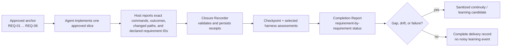
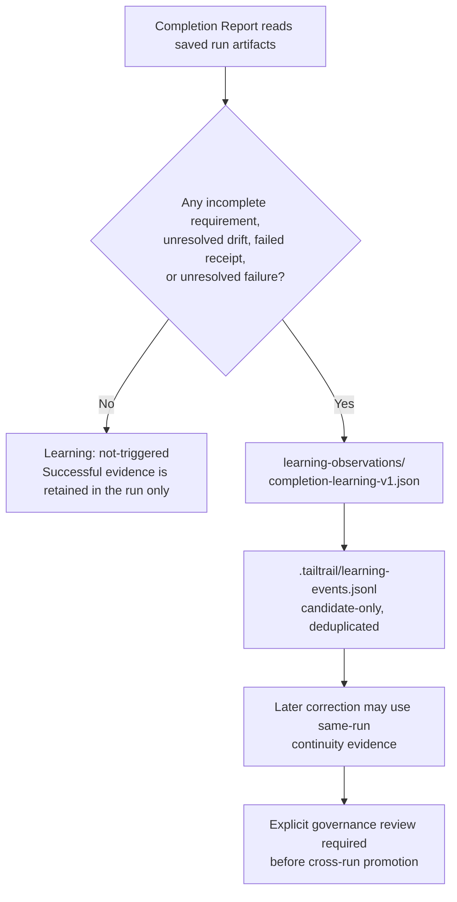
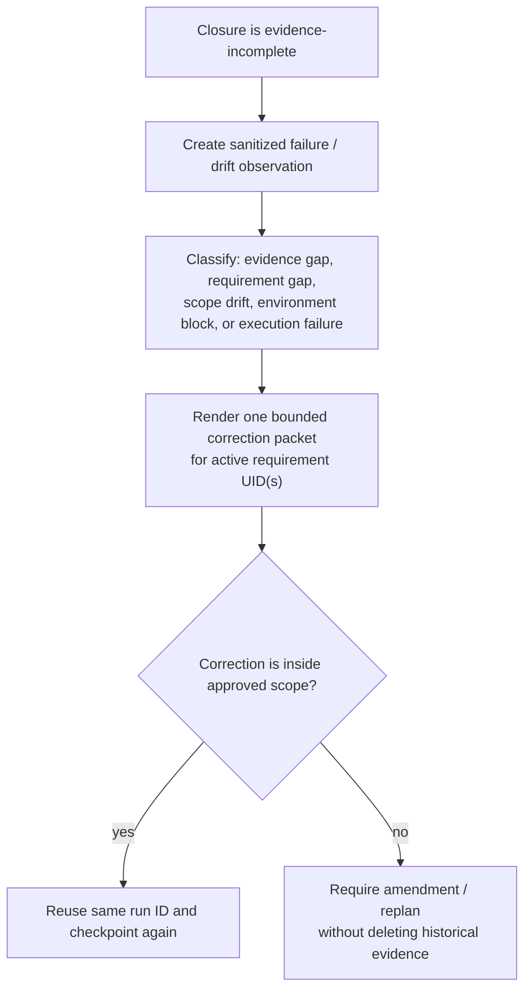
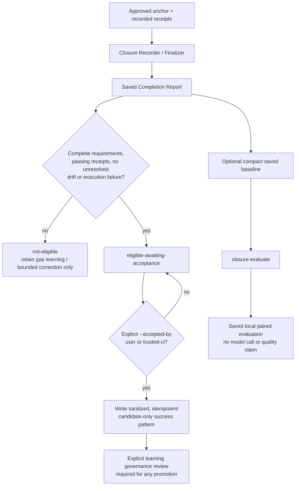
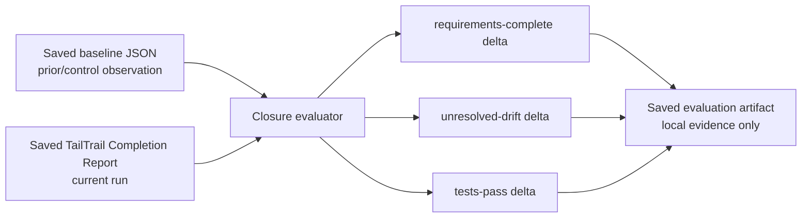

# TailTrail Closure, Learning, and Evidence Automation Plan

## Purpose

TailTrail already has the pieces needed to make an end-of-task claim honest:
an approved anchor, requirement IDs, checkpoints, validation receipts, review
artifacts, harness assessments, drift findings, a Completion Report, and a
privacy-gated learning store. The remaining problem is **handoff automation**.

Today an agent can run tests successfully yet return a generic summary unless it
also records those commands as TailTrail evidence and creates the selected
harness artifacts. The target is a reliable, visible closing path:



The design must remain local-first, deterministic where possible, and
approval-aware. It must never claim a test, token count, recovery action, or
requirement is complete without an exact saved artifact.

---

## Current state: implemented today

| Capability | Status | Current behavior |
| --- | --- | --- |
| Planning Lock | Implemented | `start` persists one run and blocks managed writes until approval. |
| Canonical approved anchor | Implemented | Normal and hands-free runs create an immutable anchor with requirement UIDs. |
| Hands-free requirement decomposition | Implemented | New hands-free anchors preserve the displayed feature rows as separate requirements. |
| Checkpoint | Implemented | Captures changed paths, file fingerprints, requirement states, test outcomes, and checkpoint drift. |
| Validation receipts | Implemented | Records a requirement UID, tier, command, outcome, environment, and asserted behavior. |
| Completion gate / review | Implemented | Fails closed when a required tier or requirement evidence is missing. |
| Architecture / Behaviour / Maintainability harnesses | Implemented | Each has a deterministic local assessment command and saved artifact format. |
| Completion Report | Implemented | Renders requirement status, selected controls, evidence tiers, drift, recovery, learning, and token posture. |
| Gap-driven learning | Implemented | An incomplete closure creates a run-local sanitized observation and a deduplicated candidate. |
| Guarded positive learning | Implemented | A complete closure becomes a candidate only after explicit user or trusted-CI acceptance; it is never auto-promoted. |
| Calibrated closure evaluation | Implemented | Compares saved baseline facts with a saved closure report; no live model or baseline inference. |
| Actual model token boundary | Implemented | Only host/provider telemetry linked by `task_id == run_id` is called measured. |

### Current closure-learning behavior



The current observation intentionally excludes raw prompts, source, logs,
secrets, repository names, and user identity. It stores only the run ID,
requirement UID, safe failure/drift classification, and a next-iteration rule.

### Example: a good current evidence record

```json
{
  "requirement_uid": "req-7be1e35b8ef2",
  "tier": "integration",
  "command": "python -m unittest tests.integration.test_order_service -v",
  "outcome": "pass",
  "environment": "local",
  "asserted_behavior": "Cancellation releases stock once and refunds only once.",
  "evidence_label": "local-command"
}
```

### Example: current incomplete-closure learning observation

```json
{
  "type": "tailtrail-completion-learning-observation",
  "run_id": "start-20260809-example",
  "signals": [
    {
      "kind": "requirement-drift",
      "requirement_uid": "req-03",
      "classification": "regressed"
    },
    {
      "kind": "evidence-gap",
      "status": "unavailable"
    }
  ],
  "next_iteration_rule": "Reuse the approved boundary and named evidence gaps before another completion claim.",
  "promotion": "sanitized candidate only; explicit review is required"
}
```

---

## Historical gaps and remaining boundaries

Phases 0–4 resolve the original closure automation gaps below. The remaining
items are intentional product boundaries, not missing evidence that can be
silently filled by an agent.

| Original gap | Delivered resolution | Remaining boundary |
| --- | --- | --- |
| Closure Recorder | Implemented by `closure record`: receipts, checkpoint, gate, and review are persisted from validated input. | The host still must supply truthful command outcomes; TailTrail never invents telemetry. |
| Selected-harness completion | Implemented by `closure finalize`: selected deterministic lenses run or fail closed. | A real environment/journey receipt still cannot be inferred from a unit test. |
| Requirement-to-command mapping | Implemented by requirement UID(s) on every validated receipt. | Broad suites must still declare which requirements their result supports. |
| Corrected failure loop | Implemented by `closure correct`: one fingerprinted bounded correction handoff. | It proposes no source patch, retry, Git recovery, or anchor amendment itself. |
| Positive-pattern learning | Implemented by `closure learn` after explicit acceptance. | Curated promotion remains a separate governance decision. |
| Calibrated evaluation | Implemented by `closure evaluate` with an optional saved baseline. | One paired artifact is not a general performance or quality claim. |
| Host token bridge | Existing run-linked telemetry support remains available. | Copilot/Codex/Claude usage must be exposed by the host before it can be measured. |
| Adapter enforcement | Installed guidance and CLI surface are updated. | A host cannot prove an agent actually executed a command without supplied receipt evidence. |

---

## Proposed implementation plan

## Phase 0 — Closure contract hardening — implemented

**Goal:** make all existing closure inputs explicit and machine-readable before
adding automation.

### Delivered scope

- Added `schemas/execution-receipt.schema.json`.
- Added the reusable `scripts/closure-contract.py` library for validating:
  - run ID;
  - approved requirement UID(s);
  - repository-relative changed paths;
  - exact command label and command text;
  - outcome (`pass`, `fail`, `blocked`, `unavailable`);
  - local environment label;
  - evidence tier;
  - optional host token telemetry pointer.
- Extended `execution-handoff-v1.json` with required closure inputs and selected
  harnesses. It must say which items are required, armed, or not applicable.
- Added the read-only `tailtrail closure validate --root . --input
  closure-input.json` command. It performs no writes and no execution.
- Added core/extended pack registration, source health checks, documentation,
  and regression coverage.
- Kept existing Completion Report and harness commands compatible.

### Example contract

```json
{
  "run_id": "start-20260809-example",
  "changed_paths": ["src/orders/service.py", "tests/integration/test_orders.py"],
  "receipts": [
    {
      "requirement_uids": ["req-01", "req-02"],
      "tier": "integration",
      "command": "python -m unittest tests.integration.test_orders -v",
      "outcome": "pass",
      "asserted_behavior": "Eligible cancellation releases inventory exactly once."
    }
  ]
}
```

### Acceptance checks — passed

- Invalid or unknown requirement UIDs fail clearly.
- Absolute paths and raw command output are rejected.
- A receipt can support multiple requirement UIDs without duplicating it.
- The validator is read-only: no source change, execution, receipt, or report
  write is performed.

## Phase 1 — Closure Recorder V1 — implemented

**Goal:** turn an agent’s completed execution facts into all required TailTrail
artifacts through one explicit local action.

### New command

```powershell
tailtrail closure record --root . --input closure-input.json
```

The command must be a **recorder**, not an executor. It may read the input,
validate it, and write TailTrail artifacts. It must not run arbitrary commands,
edit project source, commit, push, deploy, or invent evidence.

### Delivered deterministic work

1. Validate the input against Phase 0 contract.
2. Write requirement-linked validation receipts.
3. Create one checkpoint with exact changed paths and fingerprints.
4. Run the deterministic Completion Review.
5. Run Requirement Completion Gate.
6. Return a compact artifact index and the exact recommended next action.

The record ID is a stable hash of the validated input. Replaying the same input
for the same run returns the saved record rather than creating another
checkpoint or duplicate receipts. A multi-requirement receipt is retained as
one input fact but is fanned out into per-requirement receipt artifacts so the
existing completion gate can evaluate each requirement precisely.

### Delivered implementation scope

| File | Change |
| --- | --- |
| `scripts/closure-recorder.py` | New command implementation. |
| `scripts/closure-contract.py` | Reused Phase 0 validation helpers before every record. |
| `scripts/tailtrail.py` | Adds `closure record` alongside read-only `closure validate`. |
| `scripts/run-ledger.py` | Add recorder event types. |
| `schemas/execution-receipt.schema.json` | New input schema. |
| `schemas/closure-record.schema.json` | Closure record artifact contract. |
| `schemas/run-event.schema.json` | New event enum values. |
| `tests/test_closure_recorder.py` | Approved-run, public CLI, idempotent replay, and blocked-lock coverage. |
| `TAILTRAIL-COMMANDS.md`, `USER-GUIDE.md` | User-facing command documentation. |

### Acceptance checks — passed

- An unapproved Planning Lock is rejected before artifacts are written.
- One validated receipt linked to two requirements creates two requirement
  receipt artifacts and validates both requirements at the checkpoint.
- The deterministic Completion Review and Requirement Completion Gate run from
  the saved evidence, not from a claimed test result.
- Public `tailtrail closure record` coverage proves the command does not invoke
  the input command.
- Replaying the same evidence is idempotent and appends only one
  `closure_recorded` run-ledger event.

### Deliberate V1 boundary

V1 identifies selected Architecture, Behaviour, and Maintainability lenses and
names them as the next action. It does not run them and it does not create the
final Completion Report. Those are Phase 2 Finalizer responsibilities, so
missing higher-tier or journey evidence cannot be accidentally converted into a
successful completion claim.

### Example result

```text
TailTrail closure record
Run: start-20260809-example
Receipts recorded: 4
Checkpoint: checkpoint-2.json
Requirement gate: pass
Completion review: pass
Next: run selected Architecture and Behaviour assessments, then finalize.
```

## Phase 2 — Selected Harness Finalizer V1 — implemented

**Goal:** make the controls selected in Start visible and impossible to silently
skip at closure.

### New command

```powershell
tailtrail closure finalize --root . --run-id <run-id>
```

The Finalizer calls only deterministic local harnesses selected in the approved
Execution Handoff. Pass `--input closure-input.json` only when the input has not
already been recorded; it is recorded idempotently before finalization.

| Selected control | Finalizer behavior |
| --- | --- |
| Architecture Fitness | Run against exact changed paths and the approved architecture profile/contract. |
| Behaviour Harness | Require declared scenario evidence. It cannot infer a journey from prose. |
| Maintainability Harness | Run only when selected for a refactor/maintainability task. |
| Higher-tier testing | Require saved integration/contract/E2E/infrastructure receipts; never pretend a missing environment passed. |
| Recovery Boundary | Show `not-needed` for clean runs, `available` only when a real boundary artifact exists. |
| Context Continuity | Show `not-triggered` for clean runs; render a same-run packet only for actual drift/failure. |

### Important guardrail

The Finalizer may not decide that a required UI, deployment, or cloud test
passed merely because a unit test passed. Missing evidence remains
`evidence-incomplete`.

### Delivered implementation

- Added `scripts/closure-finalizer.py` and `tailtrail closure finalize`.
- Requires an approved Planning Lock, saved Execution Handoff, and a closure
  record (or a validated input supplied through `--input`).
- Runs Architecture Fitness and Maintainability only when selected, using the
  exact changed paths from the closure record.
- Runs Behaviour Harness only with declared scenario evidence. When selected
  scenarios are absent, persists a fail-closed behaviour assessment instead of
  treating lower-tier receipts as a user-journey pass.
- Reads higher-tier receipt coverage without invoking integration, contract,
  E2E, infrastructure, or release commands.
- Saves an idempotent finalizer artifact, a `closure_finalized` ledger event,
  and the existing Completion Report. Clean runs show recovery as `not-needed`
  and continuity as not triggered; incomplete runs retain their evidence gaps.

### Acceptance checks — passed

- A complete selected Architecture + Behaviour + Maintainability path produces
  a complete Completion Report.
- Replaying the same finalizer input creates no duplicate harness assessments,
  report, or finalizer event.
- A selected Behaviour Harness without scenarios remains
  `evidence-incomplete`; it never receives a synthetic pass.

### Example detailed report after finalizer

| Requirement | Status | Proof | Drift |
| --- | --- | --- |
| REQ-01 Cancellation eligibility | complete | unit + integration receipts | none |
| REQ-02 Inventory release | complete | integration receipt | none |
| REQ-03 Refund idempotency | partial | refund failure receipt missing | unresolved |
| REQ-04 One notification | complete | behaviour journey receipt | none |
| REQ-05 API contract | complete | contract receipt | none |
| REQ-06 Rollout evidence | complete | rollout plan artifact | none |

Because REQ-03 is partial, overall status remains `evidence-incomplete` even
when five other requirements pass.

## Phase 3 — Failure-to-correction handoff — implemented

**Goal:** make a failed closure resume the same delivery run safely rather than
starting from zero or looping blindly.

### Trigger conditions

- requirement is incomplete;
- checkpoint says `regressed`, `new-drift`, or `needs-decision`;
- a required evidence tier failed or is unavailable;
- an execution failure is recorded.

### Flow



### Required boundaries

- Never auto-retry the same failure fingerprint indefinitely.
- Never overwrite unrelated working-tree changes.
- Never mutate the immutable approved anchor; material scope changes create an
  amendment/replan artifact.
- Do not promote a failure observation globally without governance review.

### Delivered implementation

- Added `scripts/closure-correction.py` and `tailtrail closure correct`.
- An evidence-incomplete `closure finalize` automatically invokes the handoff;
  an operator can invoke the same command later to inspect or safely reuse it.
- The handoff reads the saved Completion Report, selects one incomplete
  requirement-scoped signal, preserves other signals as deferred evidence, and
  uses the existing Harness Convergence limit for the active requirement.
- It renders a Context Continuity packet containing the approved boundary,
  preservation rules, prior gap, relevant checkpoints/review, and next focused
  validation direction.
- A sanitized stable fingerprint over requirement ID, category, drift state,
  and reason prevents the identical failure from opening another correction
  cycle. New evidence or a materially different gap produces a new packet.
- Scope drift or an unclear selected Behaviour requirement routes to replan;
  it does not silently expand code scope or invent a journey.

### Acceptance checks — passed

- A failed requirement receipt creates one `bounded-correction` convergence
  route, one continuity packet, and one closure-correction ledger event.
- Re-reading the same incomplete closure reuses its packet without another
  convergence cycle.
- The handoff remains control-plane only: no source patch, command retry, Git
  recovery, or approved-anchor mutation is performed.

## Phase 4 — Guarded positive learning and calibrated evaluation — implemented

**Goal:** learn from successful delivery patterns without treating one success
as universal truth.

### Positive learning candidate requirements

All must be true:

- every required requirement is complete;
- no unresolved drift or execution failure;
- tests have saved receipts;
- change is accepted/reviewed by the user or trusted CI process;
- artifact is sanitized and contains no raw source/prompt/log content.

### Candidate example

```json
{
  "type": "tailtrail-success-pattern-candidate",
  "task_shape": "multi-file cancellation workflow",
  "requirements_completed": 6,
  "evidence_tiers": ["unit", "integration", "contract", "e2e"],
  "pattern": "Use service orchestration plus a contract receipt for user-facing cancellation flows.",
  "promotion": "candidate-only; explicit learning review required"
}
```

This is not a claim that TailTrail improved quality. Evaluation Harness must
measure such a claim against saved baseline-vs-TailTrail scenarios.

### Delivered implementation

`tailtrail closure learn --root . --run-id <run-id> --accepted-by user|trusted-ci`
is the only positive-learning write path. It reads the saved Completion Report
without executing tests or reading source, and refuses to create a candidate
unless every approved requirement is complete, passing receipts are saved, drift
and execution failures are resolved, and the caller supplies an explicit
acceptance signal. The candidate is run-local, sanitized, idempotent, and marked
`candidate-only`; it cannot alter future guidance or curated learnings by itself.

`tailtrail closure evaluate --root . --run-id <run-id> --baseline baseline.json`
creates a deterministic paired evaluation from saved closure artifacts. A
baseline is a compact declared observation containing requirement completion,
unresolved-drift count, and test status. TailTrail records deltas, never runs a
model or infers a baseline, and explicitly labels a no-baseline invocation as a
run observation rather than an evaluation claim.

Completion Reports now show **Guarded positive learning** as
`not-eligible`, `eligible-awaiting-acceptance`, or
`captured-candidate-only`. This makes the required acceptance boundary visible
before any cross-run learning candidate exists.

**Files delivered:** `scripts/closure-learning.py`,
`scripts/closure-evaluation.py`, their JSON schemas, command/install/registry
surfaces, and `tests/test_closure_learning.py`.

### Closure close-out automation — implemented

`tailtrail closure close --root .` is now the user-facing close-out entry
point. It resolves the active run only when exactly one approved run has saved
closure evidence, finalizes the existing evidence, and returns the Completion
Report **before** it returns an acceptance menu. A complete report offers
`accept-user`, `wait-ci`, or `reopen`; an incomplete report returns only the
bounded correction/replan path.

After the host presents the report and the user selects `accept-user`, it calls:

```powershell
tailtrail closure close --root . --decision accept-user
```

TailTrail then derives a transparent `approved-anchor-delivery-start` baseline
from the immutable anchor, captures candidate-only positive learning, and writes
the paired evaluation. It never asks the user to type a run ID or baseline JSON
in the unambiguous normal path. `wait-ci` does not pretend that CI has passed;
it preserves the completed evidence and awaits a future linked CI receipt.

### Implementation status

| Capability | Status | Evidence and boundary |
| --- | --- | --- |
| Candidate eligibility check | Implemented | Reads the saved Completion Report and fails closed unless all approved requirements are complete, saved test receipts pass, drift is resolved, and execution failures are absent or resolved. |
| Explicit acceptance gate | Implemented | `--accepted-by user` or `--accepted-by trusted-ci` is required. Completion itself is never treated as acceptance. |
| Sanitized candidate storage | Implemented | Writes one idempotent artifact beneath `.tailtrail/runs/<run-id>/positive-learning/`; the candidate omits raw source, prompt, logs, repository name, identity, and customer data. |
| Learning-store event | Implemented | Writes a scored candidate-only event only after the run-local candidate is valid. The event has no file list or repository identifier. |
| Completion Report visibility | Implemented | Shows `not-eligible`, `eligible-awaiting-acceptance`, or `captured-candidate-only` in the TailTrail control table. |
| Baseline comparison | Implemented | `closure evaluate` reads a declared compact baseline and the saved closure report, then writes a deterministic paired evaluation. |
| Packaging and verification | Implemented | CLI dispatch, core/extended install surfaces, registry, schemas, documentation, and focused regression coverage are included. |

### Delivered lifecycle



This separates two different kinds of learning deliberately:

1. An incomplete closure creates **same-run negative/gap memory** used to avoid
   repeating a known failure in a bounded correction loop.
2. An accepted complete closure creates a **candidate-only positive pattern**.
   It may be reviewed later, but it cannot silently steer the next task.

### Candidate eligibility algorithm

`scripts/closure-learning.py` evaluates the current saved Completion Report; it
does not rerun commands or read the repository’s application source. The
candidate is rejected when any one of these conditions is false:

| Check | Required value | Why it exists |
| --- | --- | --- |
| Overall closure | `complete` | A partially evidenced delivery is not a success pattern. |
| Requirement matrix | `complete == total` | A green aggregate test cannot hide an incomplete REQ row. |
| Drift | `none-unresolved` | A pattern that still contains scope/contract drift is unsafe to generalize. |
| Execution failures | `none-recorded` or `resolved` | Unresolved host/setup failures make the result ambiguous. |
| Test evidence | gate `pass` plus at least one saved passing tier | A claim must be backed by recorded requirement-linked proof. |
| Acceptance | `user` or `trusted-ci` supplied explicitly | The local CLI cannot infer human/CI acceptance from a pass. |

If any condition fails, the command returns an error and writes neither a
positive-learning candidate nor a learning event. This avoids “partial success”
becoming a reusable instruction.

### Positive-learning artifact example

The delivered candidate is intentionally generic. It records the shape of the
evidence, not the application implementation:

```json
{
  "schema_version": "1",
  "type": "tailtrail-success-pattern-candidate",
  "candidate_id": "success-4da7f9ad18fbf02c",
  "run_id": "start-20260809-cancel-demo",
  "acceptance": {
    "accepted_by": "trusted-ci",
    "required": true
  },
  "requirements_completed": 6,
  "evidence_tiers": ["contract", "integration", "unit"],
  "selected_harnesses": [
    "Requirement Completion Harness",
    "Architecture Fitness Harness",
    "Behaviour Harness"
  ],
  "pattern": "For a 6-requirement delivery, retain requirement-linked contract, integration, unit receipts and selected harness evidence before declaring completion.",
  "promotion": "candidate-only; explicit learning review required",
  "sanitization": "No raw source, prompt, log, repository name, user identity, or customer data is stored."
}
```

The artifact does **not** contain code, a prompt, a stack trace, an absolute
path, a repository identity, a customer identifier, or a command-output body.
The run ID remains only as the local lineage key needed to inspect the saved
evidence for that same run.

### Candidate capture examples

Successful accepted closure:

```powershell
tailtrail closure learn --root . --run-id start-20260809-cancel-demo --accepted-by trusted-ci
```

Expected outcome:

```text
candidate_id: success-4da7f9ad18fbf02c
promotion: candidate-only; explicit learning review required
reused: false
```

Replay of the exact accepted outcome returns the saved candidate with
`reused: true`; it does not create duplicate learning events or ledger events.

Incomplete closure:

```powershell
tailtrail closure learn --root . --run-id start-20260809-cancel-demo --accepted-by user
```

Expected fail-closed result when a requirement or receipt remains incomplete:

```text
Closure positive learning error: positive learning is not eligible:
completion report is not complete; saved passing validation receipts are missing
```

The correct next action in this case is `tailtrail closure correct --root .
--run-id <run-id>` or an approved replan—not a positive learning capture.

### Calibrated evaluation design

The evaluator accepts an optional saved baseline. It does not score model output
or manufacture an “AI baseline”; both sides are compact, declared local facts.



Baseline contract example:

```json
{
  "type": "tailtrail-closure-baseline",
  "requirements_complete": 4,
  "requirements_total": 6,
  "unresolved_drift": 1,
  "tests_pass": false
}
```

Command:

```powershell
tailtrail closure evaluate --root . --run-id start-20260809-cancel-demo --baseline baseline.json
```

Representative saved result:

```json
{
  "type": "tailtrail-closure-calibrated-evaluation",
  "mode": "paired",
  "evidence_label": "saved-local-artifacts",
  "tailtrail_outcome": {
    "requirements_complete": 6,
    "requirements_total": 6,
    "unresolved_drift": 0,
    "tests_pass": true,
    "overall_status": "complete"
  },
  "comparison": {
    "requirement_completion_delta": 2,
    "unresolved_drift_delta": -1,
    "tests_pass_delta": 1
  }
}
```

When `--baseline` is omitted, TailTrail writes `mode: run-observation` with no
comparison. That is useful for later calibration but is explicitly not presented
as proof of improvement.

### Artifact layout and traceability

```text
.tailtrail/
├── learning-events.jsonl                    # sanitized candidate event; candidate-only
├── learning-scores.jsonl                    # local confidence calculation
└── runs/<run-id>/
    ├── completion-reports/report-<n>.json   # eligibility authority
    ├── positive-learning/success-<hash>.json
    ├── closure-evaluations/evaluation-<hash>.json
    └── events.jsonl                          # append-only capture/evaluation events
```

The event ledger records `closure_positive_learning_captured` and
`closure_evaluation_calibrated`. Stable hash identifiers make replay
idempotent: the same run, acceptance mode, evidence tiers, and baseline produce
the same artifact rather than noisy duplicates.

### Delivered file-level design

| File | Responsibility |
| --- | --- |
| `scripts/closure-learning.py` | Eligibility checks, acceptance gate, sanitized candidate write, candidate-only learning event, and ledger event. |
| `scripts/closure-evaluation.py` | Validates compact baseline facts, reads current closure state, calculates three deterministic deltas, and persists the evaluation. |
| `scripts/completion-report.py` | Surfaces positive-learning eligibility and captured state in the final TailTrail control table. |
| `scripts/tailtrail.py` | Exposes `tailtrail closure learn` and `tailtrail closure evaluate`. |
| `scripts/run-ledger.py` and `schemas/run-event.schema.json` | Define the two append-only Phase 4 event types. |
| `schemas/closure-positive-learning.schema.json` | Defines the candidate artifact contract. |
| `schemas/closure-evaluation.schema.json` | Defines the local evaluation artifact contract. |
| Install and registry files | Make the commands available in packaged Core/Extended installations and verify their ownership. |
| `tests/test_closure_learning.py` | Covers accepted capture, incomplete-run rejection, idempotent replay, and deterministic paired evaluation. |

### Acceptance and regression status — passed

- A complete accepted run creates exactly one sanitized candidate-only artifact.
- Replaying that capture returns the prior artifact and does not append another
  `closure_positive_learning_captured` event.
- An incomplete run cannot create a positive candidate.
- A paired evaluation saves deterministic deltas and reuses the same result on
  replay.
- The public commands, install profiles, run ledger, Completion Report, and
  registry drift checks passed focused validation.

### Deliberate Phase 4 boundaries and future work

- Candidate capture is CLI/domain-authority only today. The existing MCP surface
  can read the Completion Report; a future write-capable MCP tool must retain
  the same explicit acceptance argument and candidate-only boundary.
- TailTrail does not auto-promote a candidate into curated instructions, alter a
  Navigator rule, or modify any project source from this evidence.
- Evaluation does not replace the larger multi-scenario Evaluation Harness
  dataset. It provides a per-run deterministic receipt that can later feed a
  carefully curated dataset.
- The evaluator does not measure review time, quality, cost, or model tokens;
  those require separately collected and appropriately labelled telemetry.

---

## Host and MCP integration plan

The local CLI remains the domain authority. MCP and host instructions should
only call or render the same deterministic results.

| Surface | Needed addition | Authority |
| --- | --- | --- |
| CLI | `closure record`, `closure finalize`, `closure show` | Writes only run-local artifacts after an approved run. |
| MCP | `closure_record`, `closure_finalize`, `completion_report_show` | Input is schema-validated; no arbitrary command execution. |
| Codex/Copilot/Claude adapters | After implementation, require one closure-input payload and the final report verbatim. | Guidance only; cannot fabricate host telemetry. |
| Workflow Dashboard | Per-requirement matrix and per-harness status. | Read-only projection of saved artifacts. |
| Evaluation Harness | Fixtures for complete, partial, drifted, and blocked closures. | No live model calls by default. |

---

## Recommended delivery order

1. **Phase 0** — contracts and schemas; no behavior change to execution.
2. **Phase 1** — recorder; eliminates manual receipt/checkpoint/review steps.
3. **Phase 2** — finalizer; makes selected harness usage visible and fail-closed.
4. **Phase 3** — bounded correction integration; prevents repeated blind loops.
5. **Phase 4** — implemented positive learning and evaluation calibration from
   real saved closure artifacts.

The first valuable release is Phases 0–2. It solves the immediate user problem:
an agent can finish work and produce a trustworthy, detailed Completion Report
without manually assembling TailTrail artifacts.

---

## Definition of done for the full plan

- A hands-free plan creates multiple immutable requirement rows.
- Each executed proof is linked to one or more requirement UIDs.
- One controlled recorder action creates checkpoint, receipts, gate, and review.
- Every selected harness appears as pass, fail, not-triggered, not-needed, or
  evidence-missing—never silently absent.
- Completion Report shows the requested per-requirement and TailTrail-control
  tables.
- A partial result remains partial; complete requirements remain visible.
- Failed closure creates only sanitized, deduplicated same-run learning.
- Actual tokens remain `unavailable` until linked host/provider telemetry exists.
- All new commands have unit tests and deterministic fixture coverage.
