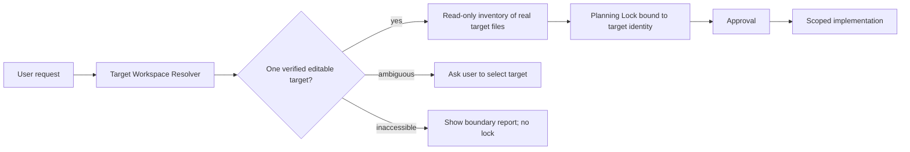
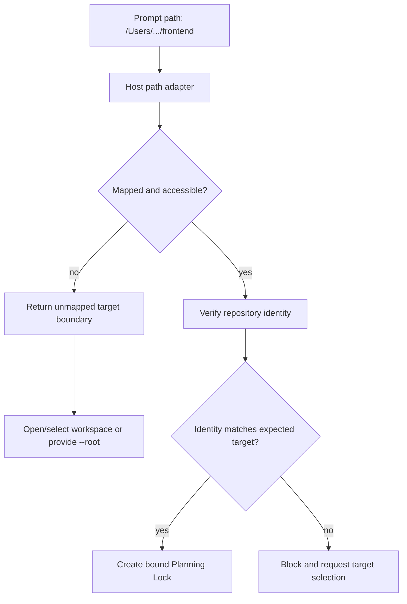

# TailTrail Enterprise Target Workspace Design

Status: TW-1 through TW-5 implemented. The current
Start implementation provides a safe local resolver and a fail-closed
Planning-Lock identity boundary:
an explicitly named inaccessible target stops planning rather than silently
falling back to the current repository. This document defines the enterprise
upgrade: **Target Workspace Resolution** as a trusted control plane.

## Problem

An enterprise request may mention an editable target repository, one or more
read-only reference repositories, a Figma design, a requirements document, CI
evidence, and local paths from another operating system. A path-shaped string
in a prompt is not enough to decide where an agent may read or write.

The failure to prevent is simple and serious:

```text
User asks for a change in Repository A
        -> path is unavailable or ambiguous
        -> agent plans against current Repository B
        -> plan looks credible but has the wrong scope
```

TailTrail must fail closed: no Planning Lock, discovery, Git inspection, or
implementation may occur in a substitute repository.

## Product outcome

Every TailTrail run has one verified editable target and explicit input roles.



## Resolution precedence

The resolver evaluates candidates in this order. Higher-trust sources always
win over lower-trust sources.

| Priority | Source | Result |
| --- | --- | --- |
| 1 | Explicit `--root` or UI-selected workspace | authoritative editable target |
| 2 | Codex, Copilot, or Claude host workspace metadata | authoritative editable target |
| 3 | Registered repository alias | trusted target after identity verification |
| 4 | Explicit prompt path or repository name | candidate only |
| 5 | Current working directory | fallback only when no other target is named |

Prompt parsing must never override an explicit host workspace or `--root`.
If several candidates remain, TailTrail asks the user rather than guessing.

## Repository identity

Folder existence is insufficient. Before a Planning Lock is created, TailTrail
captures safe, non-source identity facts.

```json
{
  "target_id": "repo_famas_frontend",
  "root": "D:/work/famas-aws-frontend-service",
  "access": "read-write",
  "git": {
    "remote_host": "github.com",
    "remote_path": "company/famas-aws-frontend-service",
    "head": "a1b2c3d"
  },
  "project": {
    "manifests": ["package.json"],
    "languages": ["TypeScript"],
    "framework_signals": ["React"]
  },
  "fingerprint": "sha256:...",
  "verified_at": "2026-08-12T12:00:00Z"
}
```

The identity contains no source content, credentials, remote URL query values,
or raw prompt. Git remote fields are optional: a non-Git project may be
verified from its root, manifest inventory, and local fingerprint.

## Input roles and permissions

Inputs are not interchangeable. The resolver classifies each one before the
Navigator uses it.

| Input | Role | Permission |
| --- | --- | --- |
| Selected application repository | `target` | read/write only after approval |
| Sibling service repository | `related-repo` | read-only unless separately selected |
| Existing implementation | `reference-repo` | read-only pattern source |
| Figma URL | `design-reference` | inspect only when host access is approved |
| DOCX/PDF/specification | `requirement-artifact` | read-only sanitized extraction |
| CI log, build receipt, Sonar report | `evidence-artifact` | read-only evidence |

For example, an Eventure request should become:

```text
Target: famas-aws-frontend-service (must be verified)
Design reference: Figma audit-events page (external, unread until available)
Requirement artifact: Pipeline Audit Events Generator.docx (read-only)
No source files are in scope until the target is verified.
```

## Scope confidence

TailTrail must display why a file appears in a plan.

| Evidence | Confidence | Planning behavior |
| --- | --- | --- |
| User-supplied `--changed` file | explicit | normal approval |
| Verified target plus goal-matched code/test | high | normal approval |
| Repository structure inventory | candidate | label and confirm feature boundary |
| Multiple plausible repositories | ambiguous | target selection required |
| Inaccessible or identity-mismatched target | blocked | no Planning Lock |

Structure inventory may list only existing files. It must not manufacture
typical files, adopt uncommitted changes, include lockfiles merely because they
are large, or label a file as a caller without source/graph evidence.

## Planning Lock binding

The Planning Lock must bind the approved scope to the verified target.

```json
{
  "run_id": "start-20260812-001",
  "target": {
    "target_id": "repo_famas_frontend",
    "root": "D:/work/famas-aws-frontend-service",
    "fingerprint": "sha256:...",
    "git_head": "a1b2c3d"
  },
  "scope_confidence": "goal-matched",
  "references": [
    {"kind": "design-reference", "status": "unread"},
    {"kind": "requirement-artifact", "status": "unread"}
  ]
}
```

Before implementation, TailTrail compares the live target with the saved
identity. A changed commit alone is not necessarily an error, but a different
root, repository identity, or materially different inventory requires a
refresh or explicit user decision. TailTrail must not carry an approved run
across repositories.

## Cross-platform and host behavior

Paths are host-dependent. `/Users/...`, `D:\...`, `/workspace/...`, WSL paths,
and network shares must be resolved by a host adapter, not interpreted as
portable filesystem truth.



The current local V1 implements the `unmapped target boundary` behavior. It
does not attempt unsafe automatic mappings.

## Repository registry and policy

Teams should be able to register approved aliases and boundaries locally or
through an enterprise-managed policy source.

```yaml
repositories:
  famas-frontend:
    root: D:\work\famas-aws-frontend-service
    identity: github.com/company/famas-aws-frontend-service
    access: read-write
    owners: [famas-ui-team]
  design-system:
    root: D:\work\design-system
    access: read-only
    purpose: reference

policies:
  allowed_target_roots: [D:\work]
  deny_external_paths: true
  require_identity_verification: true
  require_target_selection_on_ambiguity: true
```

Initial implementation should keep this local, versioned, and dependency-free.
Central policy retrieval is a later enterprise integration and must preserve
offline-safe behavior.

## Audit record

Store a small, sanitized resolution receipt for every Start run:

```text
Run: start-20260812-001
Target: famas-frontend
Target verification: passed
Scope origin: verified target + repository discovery
References: design-reference unread; requirement artifact unread
Planning Lock: awaiting approval
```

Do not store raw prompt text, source, logs, credentials, user identity, or
unredacted external URLs in shared telemetry.

## Implementation phases

### Phase TW-1 — Resolver contract — implemented

Delivered files:

- `scripts/target_workspace.py`: dependency-free resolver and read-only CLI.
- `scripts/task-start.py`: consumes the exact same resolver before Navigator
  discovery or Planning Lock creation.
- `scripts/tailtrail.py`: exposes `tailtrail target resolve`.
- `tests/test_target_workspace.py`: precedence, alias, inaccessible-target,
  and CLI receipt coverage.

Delivered contract:

- accepts explicit `--root`, supplied `--host-workspace`, repeatable local
  `--workspace-alias NAME=PATH` values, and a qualified prompt-path candidate;
- precedence is `--root` → host workspace → alias → prompt candidate → host
  current directory;
- returns deterministic `verified`, `inaccessible`, or `unmapped` outcomes;
  the `ambiguous` and `blocked` result values are reserved by the stable schema
  for multi-candidate and policy phases;
- returns JSON or Markdown without reading source, running Git, creating a
  Planning Lock, or editing files;
- preserves the existing fail-closed Start behavior for inaccessible paths.

Examples:

```bash
python3 scripts/tailtrail.py target resolve "add audit events" --root /path/to/frontend
python3 scripts/tailtrail.py target resolve "add audit events" --host-workspace /path/to/frontend
python3 scripts/tailtrail.py target resolve "add audit events" --alias famas --workspace-alias famas=/path/to/frontend
```

TW-1 deliberately does not persist aliases, infer hidden host metadata,
fingerprint a repository, bind a Planning Lock, or enforce enterprise policy.
Those stateful and authorization-sensitive controls belong to later phases.

### Phase TW-2 — Identity and lock binding — implemented

TW-2 binds every newly created Planning Lock to the exact local target it was
planned against. It is deliberately a local, deterministic boundary: it does
not upload repository information, read source bodies, or infer a cloud-host
identity.

Delivered files:

- `scripts/target_workspace.py`: creates and verifies a sanitized target
  identity.
- `scripts/planning-lock.py`: writes the identity into new schema-v2 locks,
  checks it before activation, and checks it again before a managed write.
- `schemas/planning-lock.schema.json`: accepts lock schemas v1 and v2 so
  existing runs remain readable.
- `scripts/task-start.py`: displays the Planning Lock fingerprint in compact
  and verbose Start reports.
- `tests/test_planning_lock.py`: covers matched execution, activation block,
  write block, and legacy lock behavior.

The saved identity contains only the resolved root, repository kind, a
sanitized Git remote host/path when available, current Git HEAD, top-level
manifests, detected language families, a count of eligible source files, and a
SHA-256 fingerprint over stable identity fields. It excludes source contents,
credentials, complete remote URLs, `.git`, `.tailtrail`, dependencies, virtual
environments, and caches.

```text
Planning Lock created
  -> capture target identity and stable fingerprint
  -> user approves the saved plan
  -> activation compares current target identity
  -> managed-write control compares it again
  -> mismatch blocks execution and requires lock refresh/recreation
```

A changed Git HEAD is visible as `head-changed` but is not blocking by itself:
the repository target is still the same. A different root, sanitized Git
identity, or source inventory fingerprint is a blocking mismatch. This avoids
mistaking an ordinary commit for a target switch while still preventing an
approved plan from silently editing a different or materially changed
workspace.

Existing schema-v1 locks remain usable and report `legacy` identity status.
They are never silently rewritten; a new Start run creates a schema-v2 lock.

### Phase TW-3 — Input-role registry — implemented

TW-3 makes every non-target input explicit before Navigator planning. A
Planning Lock now contains a canonical `input_roles` registry with exactly one
`target`; all other inputs are read-only by contract.

Supported roles are `target`, `related-repo`, `reference-repo`,
`design-reference`, `requirement-artifact`, and `evidence-artifact`. Local
repositories may not overlap the editable target. External design references
are stored only as a sanitized host locator, never as an unredacted URL or
query string.

Delivered behavior:

- `tailtrail target roles --root <target> ...` creates a read-only registry
  and can emit a bounded metadata-only reference summary with `--summary`.
- `tailtrail start` accepts repeatable `--reference-root`, `--related-repo`,
  `--design-reference`, `--requirement-artifact`, and `--evidence-artifact`
  flags, then persists the resulting registry in its Planning Lock.
- Compact Start reports state the editable target and read-only input count;
  verbose reports render every role, access boundary, and availability state.
- Lock activation and managed-write checks validate that the active workspace
  remains the declared target and that no non-target role gained write access.

```text
Target selected
  -> classify supplied inputs by role
  -> reject overlapping reference/target repositories
  -> persist one target + read-only inputs in Planning Lock
  -> permit managed writes only inside that target after approval
```

This registry does not automatically fetch Figma, documents, CI, or external
repositories. It records their role and availability; later approved tools may
produce bounded, read-only summaries.

### Phase TW-4 — Host adapters — implemented

TW-4 introduces a local-only workspace adapter for Codex, GitHub Copilot, and
Claude. A host can provide its selected workspace through a normal TailTrail
command or Start flag; TailTrail does not inspect hidden host state, call a
host API, or guess an unavailable path mapping.

Delivered behavior:

- `tailtrail target host-workspace --host <codex|copilot|claude> --workspace
  <path>` reports a deterministic host-workspace receipt.
- It classifies Windows, macOS, Linux, WSL, container, and network-share path
  shapes. A WSL `/mnt/<drive>/...` path can map to Windows only when the local
  host is Windows; an unavailable container workspace remains `unmapped`.
- `tailtrail start` accepts `--host`, `--host-workspace`, and
  `--host-platform`. A verified adapter workspace takes precedence over a
  prompt path, while an explicit `--root` still has highest priority.
- New locks retain the sanitized host resolution receipt alongside target
  identity and input roles. Identity binding remains the enforcement control;
  host metadata never grants write access by itself.

```text
Host-selected workspace
  -> adapter classifies path and mapping state
  -> verified local workspace becomes resolver input
  -> explicit --root may override it
  -> Planning Lock stores adapter receipt + target identity
  -> identity and role checks protect activation/writes
```

The adapter returns `not-provided`, `verified`, `inaccessible`, or `unmapped`.
For anything except `verified`, Start fails closed when no explicit `--root`
was supplied. This makes host workspace ambiguity visible instead of silently
planning in the current directory.

### Phase TW-5 — Enterprise policy and audit — implemented

TW-5 adds an opt-in, local JSON enterprise target policy. It is deliberately
separate from `tailtrail-policy.md`: the latter is project guidance, while this
policy is a deterministic target-workspace authorization boundary.

The versioned template is
`templates/enterprise-target-policy.example.json`. It supports approved target
roots, restricted roots, local aliases, alias access level, optional declared
owner checks, and identity-verification posture. TailTrail never treats an
`--actor` label as authentication; it is only an explicit value checked against
the locally configured owner list when that policy opts in.

Delivered behavior:

- `tailtrail start` accepts `--enterprise-policy`, `--target-alias`, and
  `--actor`. The policy is checked before Navigator discovery; a blocked root
  produces a no-lock boundary report.
- Policy aliases provide a local, versioned target registry. An explicit
  `--root` still wins; a selected policy alias must resolve to a writable alias
  record before it can be the target.
- New Planning Locks retain the policy path, SHA-256 policy fingerprint,
  selected alias, and decision. Activation and managed-write checks fail closed
  if that policy changes or newly blocks the target.
- Every persisted Start writes
  `planning/target-resolution-receipt-v1.json`, containing only target
  fingerprint, policy status, role counts, and host mapping summary. It omits
  raw prompts, source, logs, credentials, user identity, and external URLs.
- `tailtrail target policy --root <target> --policy <policy.json>` and the
  read-only MCP `enterprise_target_policy_inspect` tool expose deterministic
  inspection without creating a lock or receipt.

```text
Policy supplied
  -> resolve explicit root / host workspace / policy alias
  -> enforce allowed + restricted roots and optional owner rule
  -> create bound Planning Lock
  -> save sanitized resolution receipt
  -> recheck policy fingerprint before activation and managed writes
```

There is no central policy download, remote identity lookup, or hidden
telemetry. Team-managed policy distribution can be added later only if it keeps
this offline-safe local evaluation contract.

## Acceptance criteria

- A request naming an inaccessible target cannot produce a plan from the
  current workspace.
- Explicit `--root` wins over all prompt-derived candidates.
- Multiple plausible targets require a selection.
- Reference repositories and documents cannot become editable by inference.
- A Planning Lock records the verified target identity.
- Implementation fails closed if the active workspace does not match the lock.
- Reports explain target status and scope confidence in plain language.
- All resolution and policy checks are deterministic, local by default, and
  preserve TailTrail's no-hidden-telemetry rule.
