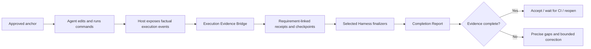

# TailTrail Execution Evidence Bridge

**Status:** EB-0 through EB-5 implemented.

## EB-0 delivery

EB-0 adds `schemas/execution-evidence.schema.json`, committed no/partial/
complete evidence fixtures, and evidence-oriented Completion Report language.
It changes no host execution behavior: EB-1 remains responsible for collecting
and validating real host facts.

## EB-1 delivery

`scripts/execution-evidence.py` now provides an append-only run-local evidence
stream with `record` and `show` commands. It accepts only explicitly approved,
host-supplied events, checks requirement IDs against the approved anchor,
normalizes repository-relative paths, deduplicates replay by fingerprint, and
writes a compact changed-path/requirement index. It does not execute commands,
assess completion, or automatically capture host actions; those integration
steps remain EB-2 and EB-4.

## EB-2 delivery

`closure record` now accepts either its existing explicit `--input` file or an
active `--run-id`. In run-ID mode it reads only saved EB-1 command-result and
CI-receipt events, combines their recorded changed paths, rebuilds the existing
validated closure input, and runs the same recorder/checkpoint/review/gate
path. If the stream lacks a requirement-linked command receipt, validation
fails closed; it never turns edit events or prose into test evidence.

## EB-3 delivery

`closure finalize --run-id <id>` now falls back to the EB-1 evidence stream if
no closure record exists. It first uses the EB-2 validated recorder, then runs
only selected deterministic Harnesses: Architecture Fitness and Maintainability
consume recorded changed paths; Behaviour uses declared scenarios and saved
receipts or writes a fail-closed assessment. It never treats unit evidence as a
user-journey pass without a matching declared scenario.

## EB-4 delivery

`scripts/mcp-server.py` now exposes `execution_evidence_show` as a read-only
run-local inspection tool and `execution_evidence_record` as the one controlled
host receipt-ingestion tool. Recording requires `approved: true`, the exact
approved Planning Lock, and the strict EB-1 event validator; the server never
executes, reinterprets, or fabricates the test, CI, edit, or Harness event it
stores. Codex, Copilot, and Claude instruction surfaces now require approved
runs to record only host-visible facts and to invoke closure finalization before
returning a Completion Report.

## EB-5 delivery

`tailtrail closure close --root . --run-id <id>` now finalizes and records the
Completion Report before exposing a single acceptance choice. A complete run
automatically derives a sanitized delivery-start baseline from its immutable
pre-implementation approved anchor and presents `accept-user`, `wait-ci`, or
`reopen`. Every state is retained as a run-local acceptance artifact. Only an
accepted complete run creates candidate-only positive learning and a paired
saved-artifact evaluation. `wait-ci`, `reopen`, and `evidence-incomplete` never
create positive learning; incomplete closure remains an evidence-gap/correction
path within the same run.

## Problem

TailTrail's Completion Report correctly fails closed when it has no saved
changed-path, requirement, test, or Harness evidence. A common host failure is
that an agent edits code and writes a conversational summary such as “tests
pass,” but does not create the structured local receipts required by closure.

The report must remain honest. The fix is an execution-to-evidence bridge, not
a more optimistic report renderer.



## Current truth boundary

The existing closure path already has the correct fail-closed contract:

- `closure record` accepts validated, supplied execution facts.
- `closure finalize` consumes saved receipts and selected Harness evidence.
- `completion-report` renders evidence status rather than guessing success.
- incomplete closure creates same-run gap learning; it is not positive learning.

The missing link is reliable host delivery of facts between execution and
`closure record`.

## Desired user experience

The user should not need to create a JSON baseline, copy file lists, or remember
the run ID after normal execution. The host retains the active run ID and calls
one close-out action when implementation stops.

```text
TailTrail closure is ready to assess this run.

1. Accept as user
2. Wait for CI confirmation
3. Reopen / correct a requirement
```

This question appears only after the Completion Report is generated and is
complete. An incomplete report instead shows missing facts and the same-run
correction path.

## Execution evidence contract

The bridge receives events; it never infers an event from prose. Each event is
sanitized, bounded, run-local, and linked to the active immutable requirement.

| Event | Minimum facts | Never infer |
| --- | --- | --- |
| Source edit | changed path, approved requirement IDs, patch/edit reference | that a requirement is complete |
| Command result | exact command label, outcome, tier, requirement IDs | that a command passed from chat text |
| Harness result | Harness name, status, saved artifact | a missing assessment |
| Drift/failure | requirement ID, classification, checkpoint, route | that no drift happened |
| CI receipt | linked run ID, provider receipt reference, outcome | CI completion without a receipt |

Example receipt stream record:

```json
{
  "type": "tailtrail-execution-evidence",
  "run_id": "start-20260815-120501",
  "sequence": 4,
  "kind": "command-result",
  "requirement_uids": ["req-02", "req-04"],
  "tier": "integration",
  "command_label": "order cancellation integration tests",
  "command": "python -m unittest tests.integration.test_order_cancellation -v",
  "outcome": "passed",
  "changed_paths": ["src/orders/service.py", "tests/integration/test_order_cancellation.py"],
  "evidence_boundary": "Host-supplied execution fact; TailTrail did not execute or reinterpret this command."
}
```

Proposed storage:

```text
.tailtrail/runs/<run-id>/execution/
├── evidence-stream.jsonl
├── changed-scope-v1.json
├── receipt-index-v1.json
└── host-handoff-v1.json
```

Raw prompts, source text, secrets, full logs, personal data, and unbounded host
telemetry are excluded.

## Requirement-aware closure

Navigator should avoid treating a multi-part page as one requirement. It should
create individually provable rows before approval.

| Requirement | Likely path | Proof |
| --- | --- | --- |
| Session summary | page/component | render test |
| Validation status | page/state model | state/error test |
| Export options | interaction component | interaction test |
| All-events JSON preview | preview component | render/format test |
| Preserve UI conventions | shared tokens/components | UI consistency assessment |

At closure, the bridge maps receipts to these IDs. A changed file alone is not
completion; each requirement needs its declared proof.

```text
REQ-01 complete: page change + render receipt
REQ-02 complete: state change + focused validation receipt
REQ-03 unavailable: no export interaction receipt
```

## Selected Harness finalization

The finalizer must use only the controls selected in the approved plan.

| Control | Bridge/finalizer responsibility |
| --- | --- |
| Requirement Completion Harness | Map changed scope and proof receipts to requirement IDs. |
| Architecture Fitness Harness | Compare actual paths/symbols against approved impact boundaries. |
| Behaviour Harness | Require an approved journey/interaction receipt; no unit-test substitution. |
| Evidence-Aware Testing | Confirm planned test tier receipts and outcomes. |
| Context Continuity | Render only after drift, failed correction, feature transition, or recovery. |
| Safe Git Recovery | Remain available only when a recovery boundary is recorded. |

No selected Harness may silently become pass because it was not run.

## Host adapter responsibilities

Codex, Copilot, and Claude adapters need the same control-plane behavior:

1. Retain the approved run ID through execution.
2. Record factual edit and command outcomes as they occur when the host exposes
   them.
3. At stop/closure, invoke the controlled closure recorder with collected
   receipts.
4. Run the existing finalizer and return its Completion Report verbatim.
5. Never replace that report with a generic “Changes made / tests passed”
   summary.

If a host cannot expose edits or command outcomes, it must create an
`evidence-incomplete` report and name the missing bridge facts. It must not
fabricate completion.

## Report language improvements

The report should distinguish absence of evidence from a negative result.

| Current wording | Better wording |
| --- | --- |
| `Learning: captured` | `Gap learning: recorded — incomplete-delivery observation only` |
| `Drift: unavailable / none recorded` | `Drift: not assessed — no implementation checkpoint exists` |
| `Requirement: unavailable` | `Not evidenced — no linked change or validation receipt` |
| `Tests unavailable` | `No test receipt recorded — no pass/fail claim` |

Positive learning remains unavailable until complete requirement coverage,
passing saved evidence, no unresolved drift/failure, and explicit acceptance.

## Implementation phases

### EB-0 — Contract and report wording

- Add the versioned execution evidence schema and sanitized event kinds.
- Clarify missing-evidence, drift, and gap-learning labels.
- Add fixtures for no execution evidence, partial evidence, and complete
  evidence.

### EB-1 — Run-local evidence collector

- Add `scripts/execution-evidence.py` with append-only validation.
- Add requirement ID/path bounds from the approved anchor.
- Build changed-scope and receipt indexes without parsing arbitrary logs.
- Add idempotency/fingerprint protection for repeated host events.

### EB-2 — Closure recorder integration

- Let `closure record` consume the collector index by default.
- Preserve an explicit input path for hosts that cannot stream events.
- Reject incompatible run IDs, unapproved paths, unknown requirement IDs, and
  unsupported command outcomes.

### EB-3 — Selected Harness bridge

- Feed recorded evidence to requirement, architecture, behaviour, and testing
  finalizers.
- Emit `not assessed` rather than `none` when no checkpoint exists.
- Keep recovery and continuity conditional/armed.

### EB-4 — Host and MCP convergence

- Add one controlled MCP receipt-recording tool with a strict schema.
- Update Codex, Copilot, and Claude instructions to record facts and return the
  real Completion Report.
- Add real-host receipt conformance cases for success, partial evidence,
  failure, and CI wait.

### EB-5 — Acceptance and learning

- Generate the report before asking user/CI acceptance.
- Automatically derive baseline data from saved pre-implementation checkpoints.
- Permit only candidate-positive learning after complete accepted closure.
- Retain incomplete closure as same-run gap memory only.

## Likely implementation surface

- `scripts/execution-evidence.py` — new collector and indexer.
- `scripts/closure-contract.py`, `closure-recorder.py`, `closure-finalizer.py`,
  `closure-close.py` — consume evidence collector output.
- `scripts/completion-report.py` — clearer status wording and per-requirement
  evidence explanation.
- `scripts/mcp-server.py` — controlled schema-validated receipt ingestion.
- `scripts/planning-lock.py` — execution handoff declares bridge contract.
- `AGENTS.md`, `adapters/*`, `adapters/prompts/*` — host closure behavior.
- focused closure, Completion Report, MCP, and adapter-conformance tests.

## Acceptance criteria

1. A generic chat claim cannot create passing tests or completed requirements.
2. Real host-supplied edit/test events produce requirement-linked closure facts.
3. A partial UI delivery reports partial completion requirement by requirement.
4. Selected Harnesses fail closed when their necessary evidence is absent.
5. Gap learning is visibly distinct from positive learning.
6. Only a complete report exposes acceptance choices.
7. All evidence remains local, sanitized, run-scoped, and replay-safe.
