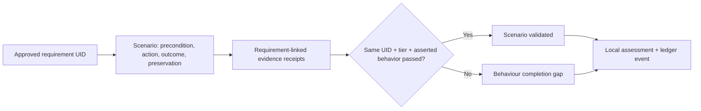
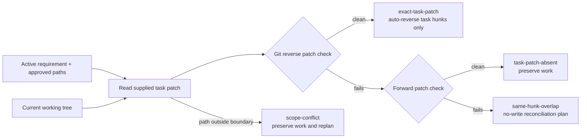
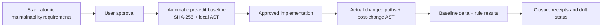
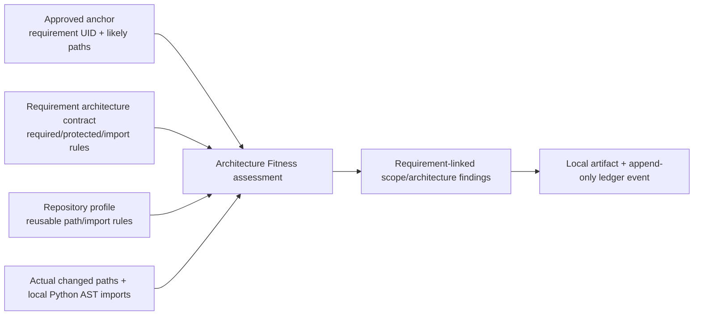
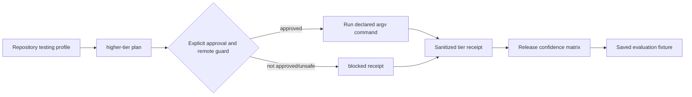

# TailTrail Implementation Backlog And Delivery Order

## Status and purpose

**Status:** active delivery backlog. Phases 1–8 have implemented local
foundations, including Requirement Completion V2–V4, Evidence-Aware Testing
V2–V5, and Phase 8.2–8.8 extensions. It records remaining integration depth
and safety-bounded future work without overclaiming provider/cloud autonomy.

The guiding product definition is:

```text
TailTrail is a requirement-completion and drift-control system
for AI-assisted software delivery.

approved intent -> scoped implementation -> computational evidence
-> drift detection -> bounded correction -> safe recovery
-> integration proof
```

The backlog deliberately avoids building every idea at once. TailTrail should
first prove that it reliably improves one multi-file requirement in one local
repository before adding broad orchestration, environment automation, or
multi-agent execution.

**Implementation update:** The advanced runtime now has explicit opt-in local
surfaces for bounded agent-graph planning, declared cloud/Kubernetes command
execution, live-evaluation receipt recording, and claim auditing. These are not
always-on: graph artifacts do not spawn agents, declared remote commands require
two approvals, live model evaluation is never default, and unmeasured quality,
time, or token claims are rejected.

## Source design files

| File | What it contains | Implementation status |
| --- | --- | --- |
| [harness-engineering.md](harness-engineering.md) | Approved anchors, requirement matrices/UIDs, completion, drift, correction, maintainability, architecture, behaviour, Git checkpoint recovery, and safety boundaries. | Design plus implemented local V1–V4 controls. |
| [tailtrail-mcp.md](tailtrail-mcp.md) | MCP tool families, authority tiers, schemas, host-neutral callable surfaces, and staged rollout. | Implemented inspection/control surface; broader host integrations remain planned. |
| [testing-confidence.md](testing-confidence.md) | Current testing assessment, validation tiers, testing profiles, evidence receipts, integration/E2E/infra plan. | Design plus implemented local V1–V5 and Phase 8 evidence controls. |
| [program-delivery-harness.md](program-delivery-harness.md) | One large prompt broken into program -> feature -> requirement -> cycle, including cross-feature drift and integration proof. | Implemented deterministic Program Delivery V1; advanced orchestration remains planned. |
| [tailtrail-runtime-foundation.md](tailtrail-runtime-foundation.md) | Local append-only Run Ledger, derived state, locks, resume, and execution-adapter boundary. | Architecture proposal. |
| [harness-engineering-workflow.md](harness-engineering-workflow.md) | A maximum-coverage reference scenario combining most TailTrail capabilities. | Reference workflow, not a runtime. |
| [EVALUATION-HARNESS.md](EVALUATION-HARNESS.md) | Existing evaluation-artifact direction and future deterministic evaluation expansion. | Partially implemented artifact tooling; broader integration is planned. |
| [TOKEN-HARNESS.md](TOKEN-HARNESS.md) | Existing token/context controls and planned links to anchors, checkpoints, and recovery packets. | Existing tools; Harness integration is planned. |

## What already exists and should be reused

These are foundations, not reasons to rebuild duplicate features:

| Existing capability | Reuse in future work |
| --- | --- |
| Navigator / `start` | Requirement routing, local impact hints, selected feature explanation, and approval-first plan. |
| AIDLC | Requirement gathering for broad/ambiguous work; use a minimal requirements slice, not the entire lifecycle for small tasks. |
| Code Graph Mapper | Local AST/Semantic impact hints, callers, symbols, tests, and scope evidence. |
| Test Precision Planner | Focused regression/happy/negative/boundary/guard test planning. |
| `quality-run`, CI/Sonar summaries | Approved command execution and truthful local/CI evidence summarization. |
| Review and Guardrails | Requirement-aware review, policy/safety checks, and implementation-quality feedback. |
| Token Harness | Context routing, exactness boundaries, receipts, and telemetry discipline. |
| Evaluation Harness | Saved-artifact evaluation and compact evidence normalization. |
| MCP server foundation | Existing callable host surface that future MCP tools should extend rather than replace. |

## Product phases at a glance

```mermaid
flowchart LR
    P1["Phase 1<br/>Canonical local state"] --> P2["Phase 2<br/>Requirement Completion V1"]
    P2 --> P3["Phase 3<br/>Evidence-aware testing V1"]
    P3 --> P4["Phase 4<br/>Safe Git checkpoints and recovery"]
    P4 --> P5["Phase 5<br/>Thin inspectable MCP tools"]
    P5 --> P6["Phase 6<br/>Fallback recovery and harness lenses"]
    P6 --> P7["Phase 7<br/>Program Delivery and Orchestrator"]
    P7 --> P8["Phase 8<br/>Integration, E2E, infra, and release proof"]
```



The order is intentional:

- State must be reliable before an agent can resume, compare, recover, or be
  orchestrated.
- Requirement completion must work before broad delivery orchestration.
- Safe local Git checkpoints should be the normal recovery path before expensive
  patch-stack conflict reconciliation.
- Testing tiers should become requirement-linked before TailTrail operates
  environments or release checks.
- MCP exposes proven internal capabilities; it should not become a second
  implementation of them.

### Delivered status: Phases 1–6

| Phase | Status | Implemented local capability | Explicit boundary |
| --- | --- | --- | --- |
| **1 — Canonical state** | Implemented | Append-only run ledger, immutable approved anchor, requirement UIDs, proposal feedback/invalidation, and graph receipts. | No source edit, test execution, branch, database, network, or completion claim. |
| **2 — Completion harness** | Implemented | Approval-gated repository-native controls, actual checkpoints, drift classification, completion review, one bounded feedback packet, and one fail-closed Completion Report. | No automatic retry, source edit, or broad completion claim from a narrow test. |
| **3 — Evidence-aware testing** | Implemented | Repository testing profile, requirement/tier receipts, exact environment labels, and evidence completion gate. | Missing/blocked integration, E2E, or infrastructure proof remains incomplete. |
| **4 — Safe Git recovery** | Implemented (Mode A + Mode B V1) | Clean-worktree recovery plus explicit requirement-owned fallback manifests and selective recovery planning. | No remote push, stash, repository-wide reset, or recovery of untracked/renamed/out-of-scope work. |
| **5 — MCP layer** | Implemented | Stdio inspection tools, an approval-gated control runner, and an approval-gated path-validated unified-patch apply tool. | No commit, push, arbitrary shell, network listener, or autonomous chain. |
| **6 — Architecture + Behaviour + Maintainability V1** | Implemented | Requirement-linked architecture rules, scenario-to-receipt user-flow evidence, maintainability signals, Mode B support, and threshold-triggered local Recovery Diagnostician. | No always-on model diagnostician, provider execution, or runtime-architecture claim. |

| **Evaluation dataset — paired delivery evidence** | Implemented | A 12-task realistic multi-file dataset, baseline/TailTrail outcome shape, deterministic aggregation, validation command, and six delivery-quality metrics. | Curated fixtures are not live-agent performance, token-saving, or productivity claims. |

| **First-run guidance + workflow dashboard** | Implemented | Installer completion smoke check, profile-aware first action, CLI/HTML read-only run dashboard, and MCP inspection view. | No automatic implementation, test execution, web server, source change, or recovery apply. |

**Mode A prerequisite:** `.tailtrail/` must already be ignored by the repository
before a run starts, so its local audit artifacts do not make the Git worktree
dirty. TailTrail never edits `.gitignore` or commits that prerequisite for the
user.

---

## Phase 1 - Canonical local state and requirements

**Status:** implemented end to end (local-only V1).

**Priority:** P0 - start here.

**Goal:** create the smallest durable local state model that lets later features
know what was approved, what happened, and which requirement it belongs to.

### Implemented features

1. **Run Ledger V1**
   - Local run manifest plus append-only JSONL event log.
   - Atomic writes, schema version, deterministic event IDs, and one-writer lock.
   - Derived read-only state/projection command.

2. **Change Intent Anchor V1**
   - Draft and approve a compact anchor.
   - Immutable approved version/fingerprint after approval.
   - Explicit material invalidation rules.

3. **Requirement-to-Impact Matrix and durable IDs**
   - Requirement UID, local display ID, statement, kind, acceptance criteria,
     preserve rules, likely path, evidence plan, and status.
   - The UID joins approved state, actual state, drift, recovery, and evaluation.

4. **Navigator Requirement Discovery protocol**
   - First material proposal rejection: mandatory row-by-row feedback, targeted
     questions, optional AIDLC Requirements mode.
   - Second material rejection: automatic minimal AIDLC Requirements mode.
   - Preserve proposal versions and feedback as discovery history, separate from
     implementation drift.

5. **Explicit Navigator invocation and response depth**
   - Treat `using TailTrail Navigator`, `tailtrail navigator`, and `navigator:`
     as a control instruction that overrides generic keyword classification.
   - Support short context/discovery, Navigator-plan, and implementation-proposal
     forms such as `navigator Phase 1`, `navigator plan Phase 1`, and
     `navigator implement Phase 1`.
   - Always return selected/skipped TailTrail features. Keep Navigator-plan
     approval separate from detailed-plan generation and implementation approval.

6. **Read-only Code Graph evidence receipt**
   - Store only the selected impacted symbols/callers/tests and evidence labels,
     not a whole-repository graph snapshot.

### Implemented files

| File | Responsibility |
| --- | --- |
| `scripts/run-ledger.py` | Create/read/validate append-only local run events and derived state. |
| `scripts/change-intent-anchor.py` | Draft, approve, fingerprint, invalidate, and compare anchors. |
| `scripts/navigator_core.py`, `scripts/task-start.py` | Produce matrix, confidence labels, and proposal-feedback protocol. |
| `schemas/run-event.schema.json` | Canonical event schema. |
| `schemas/change-intent-anchor.schema.json` | Anchor and requirement matrix contract. |
| `schemas/requirement-evidence.schema.json` | Requirement UID, evidence, completion-state contract. |
| `templates/change-intent-anchor.md` | Human-readable anchor projection. |
| `tests/test_run_ledger.py`, `tests/test_change_intent_anchor.py` | Event ordering, resume, UID, approval, invalidation, and feedback tests. |

### Delivered boundary

- State lives only under `.tailtrail/runs/<run-id>/`; no database, daemon,
  cloud service, source-writing agent, or network call was introduced.
- `ledger` provides `init`, `append`, `state`, and `validate`; `anchor` provides
  `draft`, row-by-row `feedback`, `approve`, `invalidate`, and `graph-receipt`.
- The durable requirement UID is assigned at local-anchor draft time and remains
  unchanged in the immutable approved anchor and graph-evidence receipt.
- Completion, drift, recovery, and broad computational controls remain Phase 2+
  work; Phase 1 records intent and local evidence, but does not claim completion.

### Implemented command flow

```powershell
# Create one local run and draft the requirement matrix from proposal.json.
py -3 scripts/tailtrail.py ledger init --run-id claim-validation --goal "Reject zero claim amounts"
py -3 scripts/tailtrail.py anchor draft --run-id claim-validation --input proposal.json

# If a draft is rejected, feedback must cover every requirement UID. A second
# material rejection returns the AIDLC Requirements escalation state.
py -3 scripts/tailtrail.py anchor feedback --run-id claim-validation --feedback '[{"requirement_uid":"req-...","decision":"approve"}]'

# Approval creates the immutable local anchor. State is read-only afterwards.
py -3 scripts/tailtrail.py anchor approve --run-id claim-validation
py -3 scripts/tailtrail.py ledger state --run-id claim-validation
```

Artifacts: `manifest.json`, append-only `events.jsonl`, proposal history under
`anchors/draft-v<n>.json`, and immutable `anchors/approved-v1.json`. This phase
does not create a branch, execute a test, modify source, or claim completion.

### Acceptance criteria

- A small multi-file task can be proposed, reviewed requirement-by-requirement,
  approved, and resumed from local state.
- A requirement has one durable UID across all artifacts.
- No implementation starts with unresolved required rows.
- No database, daemon, cloud service, or source-writing agent is introduced.

---

## Phase 2 - Requirement Completion Harness V1

**Status:** implemented end to end through V4 (local computational controls).

**Priority:** P0 - build immediately after Phase 1.

**Goal:** prove whether an approved multi-file requirement was completed, not
merely whether one test is green.

### Implemented features

1. **Computational control contract**
   - Repository-native commands only.
   - Trigger, scope, timeout, parser, severity, evidence label, and approval
     requirement.

2. **Harness plan and check**
   - `harness plan`: selected guides, sensors, impacted paths, skipped controls.
   - `harness check`: focused test + configured lint/type/structural checks.
   - Exact `pass`, `fail`, `skipped`, `blocked`, or `timed-out` result per control.

3. **Checkpoint-specific actual state**
   - Actual changed paths/symbols/tests.
   - Control receipts and requirement state.
   - Compare current checkpoint to anchor and preceding checkpoint.

4. **Drift classification**
   - `resolved`, `improved`, `unchanged`, `regressed`, `new-drift`,
     `needs-decision`.
   - Name requirement, scope, architecture, behaviour, or evidence drift rather
     than emitting one opaque score.

5. **Bounded correction packet**
   - One highest-value correction at a time.
   - Exact evidence, allowed scope, preserve rules, and next validation command.
   - No unbounded retry loop.

### Implemented files

| File | Responsibility |
| --- | --- |
| `scripts/harness-controls.py` | Select/run/normalize local computational controls. |
| `scripts/harness-checkpoint.py` | Write actual state and compare checkpoint deltas. |
| `scripts/harness-feedback.py` | Create compact correction packets. |
| `scripts/completion-review.py` | Compare matrix, diff, impact map, tests, and controls. |
| `schemas/harness-control.schema.json`, `schemas/harness-result.schema.json` | Control/result contracts. |
| `schemas/harness-checkpoint.schema.json` | Checkpoint and drift contract. |
| `templates/harness-feedback.md`, `templates/harness-checkpoint.md` | Reviewable artifacts. |
| `tests/test_harness_controls.py`, `tests/test_harness_checkpoint.py`, `tests/test_harness_feedback.py`, `tests/test_completion_review.py` | Deterministic control, drift, and correction tests. |

### V2-V4 delivered extensions

- **V2:** `harness impact-map` creates a requirement-linked local AST map of
  approved paths, changed symbols, candidate callers, and candidate focused
  tests. It selects architecture/behaviour controls from approved contracts but
  labels all mappings as advisory local evidence.
- **V3:** `harness converge` records requirement-level checkpoint delta history
  (`resolved`, `improved`, `unchanged`, `regressed`, `new-drift`, or
  `needs-decision`). It permits only the configured bounded correction cycles,
  then routes to Mode B, Mode A, or an approval-required replan while retaining
  every prior anchor and checkpoint artifact.
- **V4:** `harness template` selects project-owned JSON templates by requirement
  kind and approved paths. Template controls and validation tiers are additive:
  they cannot remove required evidence from `approved-v1.json`.

### Delivered boundary

- Controls execute only an explicit repository-native command array after
  `--approved`; outcomes are exact `pass`, `fail`, `skipped`, or `timed-out`.
- A checkpoint compares the immutable approved anchor with actual paths and
  control receipts. It records requirement-level evidence drift, not a global
  confidence score.
- Completion review produces at most one correction packet. It does not retry,
  edit source, infer a new requirement, or promote a green unit test to a broad
  completion claim.
- Phase 2/3 plans, control results, checkpoints, validation receipts, and
  completion gates are retained under the active run directory and linked by
  append-only ledger events when the shared `--run-id` is supplied.

### Implemented command flow

```powershell
# Plan is inspectable; check execution is explicitly approval-gated.
py -3 scripts/tailtrail.py harness plan --run-id claim-validation --controls controls.json --changed src/claims_api/validation.py
py -3 scripts/tailtrail.py harness check --run-id claim-validation --controls controls.json --changed src/claims_api/validation.py --approved --output results.json

# Convert exact control outcomes into requirement state and completion findings.
py -3 scripts/tailtrail.py harness checkpoint --run-id claim-validation --changed src/claims_api/validation.py --results results.json
py -3 scripts/tailtrail.py harness completion-review --run-id claim-validation --output review.json
py -3 scripts/tailtrail.py harness completion-report --root . --run-id claim-validation
py -3 scripts/tailtrail.py harness feedback --root . --run-id claim-validation --review review.json --output feedback.json
```

### Completion Report implementation detail

`harness completion-report --root . --run-id <run-id>` is the final readout for
a completed delivery run. It reads the immutable approved anchor, the latest
actual checkpoint and drift entries, completion review, completion gate,
Architecture Fitness and Behaviour assessments when selected, requirement-linked
validation receipts, and any captured recovery boundary. It writes a versioned
`completion-reports/report-N.json` artifact and appends a
`completion_report_created` ledger event.

The report is intentionally an aggregator, not a new source of truth:

```text
approved anchor + actual checkpoint + completion gate
        + architecture/behaviour assessments + receipts + recovery boundary
                                  |
                                  v
                       single fail-closed Completion Report
```

It marks absent evidence as `unavailable` or `not-assessed`, not pass. Overall
completion requires every approved requirement to be validated, approved scope,
a passing completion gate, and no unresolved drift. This impacts the harness
CLI dispatcher, run-ledger vocabulary, MCP read-only inspection, feature
registry, schema contract, user commands/docs, and focused completion-report
tests; it does not edit source or run project checks on its own.

Artifacts: `plans/`, `controls/`, `checkpoints/`, `reviews/`, and `feedback/`.
The feedback packet contains only the highest-value unresolved requirement; it
does not edit source or start another correction cycle automatically.

### Requirement Completion Harness version path

The V1 requirement UID, approved-anchor fingerprint, actual checkpoint shape,
drift vocabulary, and bounded-correction-packet contract are compatibility
boundaries. Later versions must extend them compatibly rather than create a
second, disconnected completion model.

| Version | Status | Scope | What it deliberately does not claim |
| --- | --- | --- | --- |
| **V1** | Implemented | Approved local anchor, repository-native controls, checkpoint actual state, requirement-level evidence gaps, and one correction packet. | That a passing focused test proves architecture, integration, or end-to-end behavior. |
| **V2** | Implemented | Architecture and behaviour drift sensors, requirement-to-symbol/caller/test mapping, and more precise control selection from local graph evidence. | A provider/model inference is required or authoritative. Local source and tests remain final proof. |
| **V3** | Implemented | Bounded multi-cycle convergence policy, recovery/replan routing, checkpoint delta history, and integration with Phase 4 safe Git checkpoints. | Unlimited autonomous retries or broad rollback of unrelated user work. |
| **V4** | Implemented | Project-specific harness templates and requirement-linked integration, contract, E2E, and infrastructure proof as Phase 3 environments become available. | That unavailable environments count as a pass or that every repository needs every test tier. |

#### V2 - Architecture and behaviour precision

V2 should consume the selected Phase 1 Code Graph evidence receipt and compare
actual changed symbols, callers, tests, and public boundaries to the approved
matrix. It should distinguish missing caller-path behavior, unapproved new-file
scope, preservation-rule regression, and insufficient evidence. This is where
the Architecture Fitness and Behaviour harness lenses become computationally
useful, while maintainability review remains advisory unless a project elects a
specific blocking rule.

#### V3 - Bounded convergence and safe recovery

V3 should add a small, configured correction budget rather than an autonomous
loop without a stop condition. Each retry must be tied to one unresolved
requirement UID and a new checkpoint. Repeated unchanged or regressed outcomes
route to recovery/replan using the original approved anchor; Phase 4 Git
checkpoints preserve validated earlier work and avoid reverting unrelated local
changes.

#### V4 - Project templates and fuller proof tiers

V4 should let a repository declare reusable harness profiles for its framework,
commands, environment prerequisites, and cleanup rules. It builds on Phase 3
testing confidence so requirement proof can progress from focused unit checks to
component, contract, integration, E2E, and infrastructure evidence only when
those environments are explicitly available and approved.

### Explicit boundary

A failed test is normally an **implementation evidence failure**, not a reason
to ask the user to repeat requirements. The agent gets a bounded correction
packet first. Return to Navigator/AIDLC only when the failure exposes an
incomplete, ambiguous, or materially incompatible approved requirement.

---

## Phase 3 - Evidence-aware testing V1

**Status:** implemented end to end (local evidence V1).

**Priority:** P0/P1 - implement alongside or immediately after Phase 2.

**Goal:** connect each requirement to the minimum adequate proof tier and make
the resulting validation truthful and inspectable.

### Implemented features

1. **Repository testing profile**
   - Project-defined unit/component/integration/contract/E2E/infra commands.
   - Prerequisites, approvals, environment labels, and cleanup rules.

2. **Validation Contract in each requirement row**
   - `required`, `conditional`, `not-applicable`, `unavailable`, and
     `insufficient` evidence states.
   - A multi-boundary change cannot be accepted with unit-only proof unless the
     anchor contains an explicit justification.

3. **Validation Evidence Receipts**
   - Requirement UID, tier, exact command, exit result, environment label,
     asserted behavior, artifact path, and evidence label.

4. **Completion evidence gate**
   - Report missing/blocked/insufficient required evidence.
   - Do not make missing integration/E2E environment appear as a pass.

### Implemented files

| File | Responsibility |
| --- | --- |
| `schemas/testing-profile.schema.json` | Validate project testing profile. |
| `schemas/validation-evidence-receipt.schema.json` | Validate execution receipt. |
| `templates/testing-profile.example.yml` | Repository-native example configuration. |
| `scripts/testing-profile.py` | Read/validate profile and list applicable tiers. |
| `scripts/validation-receipt.py` | Normalize command results into receipts. |
| `scripts/requirement-completion.py` | Compare required evidence to received evidence. |
| `scripts/test-precision.py`, `scripts/quality-run.py` | Reuse for tier planning and approved command execution. |
| `tests/test_testing_profile.py`, `tests/test_validation_receipt.py` | Profile and evidence-gate tests. |

### Delivered boundary

- Testing tiers are declared by the repository in a local profile; TailTrail
  does not install test frameworks or invent environment commands.
- Receipts name the requirement UID, exact command, asserted behavior, tier,
  environment, artifact pointer, outcome, and evidence label.
- Missing, blocked, unavailable, and insufficient higher-tier evidence remain
  incomplete. A unit pass is labeled unit evidence only.

### Evidence-aware testing version path

V1 is deliberately the evidence foundation, not a claim that TailTrail already
executes or provisions every testing environment. Later versions add proof
coverage in layers while keeping the requirement UID, approved validation
contract, exact command, environment, and artifact pointer as the common join
key.

| Version | Status | Adds | Still does not claim |
| --- | --- | --- | --- |
| **V1 — local evidence foundation** | Implemented | Repository testing profile; requirement-level validation contracts; normalized receipts; a completion gate that leaves missing higher-tier proof incomplete. | A unit pass proves integration, E2E, infrastructure, or release readiness. |
| **V2 — applicable-tier planning and controlled execution** | Implemented | `tier-select` chooses the minimum declared tiers from the approved matrix and changed paths; existing higher-tier execution remains approval-gated. | That TailTrail can invent commands, start services, or bypass environment approvals. |
| **V3 — behavior and integration proof** | Implemented | The Behaviour Harness keeps scenarios linked to requirement UIDs; declared behaviour scenarios select declared integration proof. | That a synthetic scenario replaces production behavior or that every change needs full E2E coverage. |
| **V4 — infrastructure and release confidence** | Implemented | Higher-tier/release controls plus `ci-ingest` normalize saved CI evidence into the receipt trail. | Production deployment approval, live production testing, or a pass when an approved environment was unavailable. |
| **V5 — evaluation and confidence calibration** | Implemented | `flaky` retains test outcome history; `evidence-metrics` gives calibrated receipt-completeness metrics. | Live model evaluation as truth, exact quality gains without measured data, or autonomous policy changes. |

#### V2 — applicable-tier planning and controlled execution

V2 closes the gap between a declared testing profile and a repeatable local
run. Given an approved requirement row and its likely paths, TailTrail selects
only the profile tiers that are applicable, explains why each was selected or
skipped, and requires explicit approval before executing commands. Every
attempt produces a receipt with one of `pass`, `fail`, `blocked`, `unavailable`,
or `insufficient`; cleanup must run according to the declared profile even when
the command fails. This is orchestration of existing repository commands, not a
new test runner or an environment-provisioning system.

#### V3 — behavior and integration proof

V3 adds approved behavioral scenarios, especially for multi-file changes where
a focused unit test can pass while a caller, API contract, event flow, or
database boundary remains wrong. A scenario states the precondition, action,
observable outcome, preservation rule, required fixture, and linked
requirement UID. The harness records the exact fixture/environment used and
reports the failing requirement rather than a generic “test suite failed.”

#### V4 — infrastructure and release confidence

V4 is for repositories that already have approved integration environments or
CI/deployment checks. It imports or records their evidence without pretending a
local machine reproduces them. Environment provenance, configuration identity,
artifact links, compatibility/migration checks, and safe smoke-test results are
all explicitly scoped. A blocked environment remains a visible completion gap.

#### V5 — evaluation and confidence calibration

V5 evaluates TailTrail itself using saved, sanitized artifacts: compare a
baseline outcome against a harness outcome, then measure requirement coverage,
missed integration paths, unnecessary controls, time-to-diagnosis, and flaky or
stale evidence. Recommendations remain proposal-only until a project owner
approves a profile or policy change.

### V2-V5 implementation status

Evidence-Aware Testing V2-V5 is implemented as a local, receipt-first layer:

| Command | Artifact | Purpose |
| --- | --- | --- |
| `harness tier-select` | `testing-selections/selection-<n>.json` | Select approved, repository-declared minimum tiers by requirement and changed path. Declared behaviour scenarios can add declared integration proof. |
| `harness ci-ingest` | `ci-ingestion/ingestion-<n>.json` plus validation receipts | Normalize a supplied local CI JSON artifact into requirement-linked receipts; no CI network call occurs. |
| `harness flaky` | `flaky-tests/observation-<n>.json` | Record pass/fail history and label mixed history as flaky without suppressing the latest failure. |
| `harness evidence-metrics` | `evidence-metrics/metrics-<n>.json` | Report exact approved-receipt completeness and outcome totals, explicitly not a probability of correctness. |

The existing `harness behavior` command supplies V3 requirement-linked scenario
assessment. The existing `harness higher-tier` and `harness release-confidence`
commands supply guarded V4 integration, infrastructure, and release evidence.
All external command execution retains explicit approval and remote safeguards.

### Implemented Phase 1–3 execution and audit trail

The first three phases are one local, run-ID-scoped workflow. Use the same
`run_id` for every command; it is the join key for intent, controls, observed
state, validation proof, and completion status.

```text
Navigator proposal
  -> ledger init
  -> anchor draft / row feedback / anchor approve
  -> harness plan (selected controls)
  -> approved harness check (exact results)
  -> checkpoint (actual requirement state and drift)
  -> validation receipts (per requirement and tier)
  -> requirement-completion gate
  -> one correction packet only when a gap remains
```

Canonical local artifacts:

```text
.tailtrail/runs/<run-id>/
├── manifest.json                    # goal and run identity
├── events.jsonl                     # append-only event sequence
├── anchors/
│   ├── draft-v<n>.json              # proposal history
│   └── approved-v1.json             # immutable approved matrix/fingerprint
├── plans/harness_plan-<n>.json      # selected and skipped controls
├── controls/harness_check-<n>.json  # normalized command outcomes
├── checkpoints/checkpoint-<n>.json  # actual paths, requirement state, drift
├── reviews/review-<n>.json           # requirement-completion findings
├── feedback/feedback-<n>.json        # one bounded correction packet
├── validation-receipts/<uid>-<tier>-<n>.json
└── completion-gates/gate-<n>.json   # missing or sufficient evidence
```

The ledger stores event metadata and artifact pointers; full normalized command
results remain in the linked artifact. This preserves auditability without
copying source files into the ledger. `ledger state --run-id <run-id>` returns
the event count, activity counts, anchor state, and latest invalidation.

#### Complete local example

```powershell
py -3 scripts/tailtrail.py ledger init --run-id claim-validation --goal "Reject zero claim amounts"
py -3 scripts/tailtrail.py anchor draft --run-id claim-validation --input proposal.json
py -3 scripts/tailtrail.py anchor approve --run-id claim-validation
py -3 scripts/tailtrail.py harness plan --run-id claim-validation --controls controls.json --changed src/claims_api/validation.py
py -3 scripts/tailtrail.py harness check --run-id claim-validation --controls controls.json --changed src/claims_api/validation.py --approved --output results.json
py -3 scripts/tailtrail.py harness checkpoint --run-id claim-validation --changed src/claims_api/validation.py --results results.json
py -3 scripts/tailtrail.py harness completion-review --run-id claim-validation --output review.json
py -3 scripts/tailtrail.py harness feedback --root . --run-id claim-validation --review review.json --output feedback.json
py -3 scripts/tailtrail.py harness validation-receipt --root . --run-id claim-validation --requirement-uid req-... --tier unit --command "py -3 -m unittest" --outcome pass --environment local --asserted-behavior "Zero amount is rejected"
py -3 scripts/tailtrail.py harness requirement-completion --run-id claim-validation --receipts receipts.json
py -3 scripts/tailtrail.py ledger state --run-id claim-validation
```

### Acceptance criteria

- TailTrail can say *which requirement* was tested, *what behavior* was
  observed, and *which environment* participated.
- It labels green unit tests as unit evidence, not as integration or release
  proof.

---

## Phase 4 - Safe Git checkpoints and normal recovery

**Status:** implemented end to end (Mode A local recovery plus explicit Mode B
fallback V1).

**Priority:** P1 - build before any autonomous source-writing/recovery loop.

**Goal:** make recovery inexpensive and safe in the normal case.

### Implemented features

1. **Git Readiness Gate**
   - Require a repository, current `HEAD`, known branch, clean worktree, and
     ability to create local commits for autonomous mode.
   - Report exact dirty paths; never silently stash, commit, reset, discard, or
     delete user work.

2. **TailTrail task branch and local requirement checkpoint refs**
   - Create/use `tailtrail/<run-id>` branch.
   - After each validated requirement, create a local checkpoint commit and
     immutable local ref.
   - Remote push is not part of normal recovery.

3. **Active-diff receipt and selective restore**
   - Verify the current uncommitted diff belongs to the active requirement.
   - Restore only verified active paths to the prior requirement checkpoint.
   - Reuse earlier validation receipt for an exact checkpoint return; rerun
     preservation proof only after reconciliation/shared-path change.

### Implemented files

| File | Responsibility |
| --- | --- |
| `scripts/git-readiness.py` | Read-only Git preflight and safe-state report. |
| `scripts/task-recovery-boundary.py` | Record task branch, base, refs, expected paths, and receipts. |
| `scripts/task-recovery.py` | Plan/apply verified Mode A local checkpoint recovery. |
| `schemas/git-readiness.schema.json` | Readiness report contract. |
| `schemas/task-recovery-boundary.schema.json` | Mode A boundary contract. |
| `tests/test_git_readiness.py`, `tests/test_task_recovery.py` | Dirty worktree refusal, checkpoint, and selective restore tests. |

### Command flow

```powershell
# Read-only preflight. It refuses a dirty worktree, detached HEAD, or missing
# local committer identity.
py -3 scripts/tailtrail.py harness git-readiness --root .

# This is the one branch-changing step. It requires a clean repository, an
# approved anchor, and explicit approval. It creates tailtrail/<run-id>.
py -3 scripts/tailtrail.py harness boundary init --root . --run-id claim-validation --expected-path src/claims_api --approved

# Work one approved requirement at a time, then create a local commit/ref only
# for its verified changed paths.
py -3 scripts/tailtrail.py harness boundary activate --root . --run-id claim-validation --requirement-uid req-...
py -3 scripts/tailtrail.py harness boundary checkpoint --root . --run-id claim-validation --requirement-uid req-... --approved

# If the next active requirement fails, inspect first. Apply is approval-gated
# and restores only its tracked, verified paths to the prior local checkpoint.
py -3 scripts/tailtrail.py harness recovery plan --root . --run-id claim-validation
py -3 scripts/tailtrail.py harness recovery apply --root . --run-id claim-validation --approved
```

Each validated requirement receives an immutable local ref at
`refs/tailtrail/<run-id>/<requirement-uid>`. Boundary state, recovery plans,
and append-only events remain under `.tailtrail/runs/<run-id>/recovery/`.

### Acceptance criteria

- A validated REQ-01 local checkpoint remains intact while unvalidated REQ-02
  is restored.
- Credential, network, and remote-push failures cannot lose local checkpoints.
- No repository-wide reset is used as normal recovery.
- Mode A intentionally refuses untracked, renamed, copied, out-of-scope, or
  concurrent changes during checkpoint/recovery. Those states remain preserved
  for inspection and can enter the explicit implemented Mode B fallback path;
  neither mode guesses ownership.

---

## Phase 5 - Thin MCP tools for inspection and controlled execution

**Status:** implemented end to end (inspection-first MCP V1 plus an
approval-gated, patch-only source-apply tool).

**Priority:** P1 - expose capabilities after their scripts/contracts are real.

**Goal:** make the workflow callable and inspectable across Codex and other
MCP hosts without duplicating core logic.

### Implemented features

1. **Navigator tools (read-only)**
   - Requirement matrix proposal, impact evidence, selected guides/sensors,
     proposal-feedback status.

2. **Harness tools (approval-gated where needed)**
   - Anchor/checkpoint display, control plan/check, completion gaps, correction
     packet rendering.

3. **Testing, Token, and Evaluation projections**
   - Testing profile/receipt visibility.
   - Token context receipt lookup.
   - Evaluation scenario/evidence access.

4. **Recovery tools - read-only first**
   - Git readiness report and boundary display.
   - Recovery planning/apply and steering stay CLI-only until Mode B evidence is proven.

### Implemented tool contract

| Tool group | Tools | Authority |
| --- | --- | --- |
| Existing planning/review | `navigator_plan`, `start_report`, `guardrail_check`, `graph_map` | Read-only local inspection. |
| Phase 1–2 run inspection | `ledger_state`, `anchor_show`, `harness_checkpoint_show`, `completion_feedback_show` | Read-only local artifact access. |
| Phase 3 testing evidence | `profile_view`, `validation_receipt_show` | Read-only local profile/receipt access. |
| Phase 4 recovery inspection | `git_readiness`, `recovery_boundary_show` | Read-only local Git/artifact access. |
| Controlled computation | `harness_control_check` | Requires `approved: true`; executes only the supplied repository-native control file and writes evidence, never source. |

### Implemented files

| File | Responsibility |
| --- | --- |
| `scripts/mcp-server.py` | Typed stdio JSON-RPC handlers that delegate to existing scripts or read existing local artifacts. |
| `tests/test_mcp_server.py` | Tool list, schema, authority, approval, and no-write behavior tests. |
| `tailtrail-registry.json` | Tool ownership, maturity, and authority metadata. |

### Command flow

```powershell
py -3 scripts/tailtrail.py mcp doctor
py -3 scripts/tailtrail.py mcp tools --format json
py -3 scripts/tailtrail.py mcp serve
```

The MCP client first obtains the tool list over stdio JSON-RPC. Inspection tools
need no approval. `harness_control_check` rejects calls without
`"approved": true`, accepts a repository-relative control-file path rather
than a raw command, and delegates to the existing control contract.

### Explicit boundary

Do not use MCP to create a second harness implementation. MCP is a transport
and inspection surface over proven local core logic.

---

## Phase 6 - Mode B recovery and the three Harness lenses

**Status:** Mode B recovery, Conflict classification/reconciliation, Recovery
Diagnostician, Architecture Fitness, Behaviour, and Maintainability Harness V1
are implemented.

**Priority:** P2 - add only after Mode A checkpoint recovery works in real use.

**Goal:** handle explicit dirty-worktree fallback and strengthen semantic
completion without forcing expensive inference into every task.

### Features to implement

1. **Mode B patch-stack recovery — implemented V1**
   - Explicit user-selected fallback for dirty worktrees or projects that cannot
     use local checkpoint commits.
   - Task/requirement-owned patches, snapshots, hunk/symbol anchors, fingerprints,
     and preservation tests.

2. **Conflict classification and reconciliation — implemented V1**
   - Classifies exact task patch, same-hunk overlap, absent patch, and patch scope
     conflict; only an exact Git-verified task-patch reversal is automated.
   - Preserves unrelated changed paths and records their fingerprints; overlap
     returns a no-write bounded reconciliation plan rather than guessing.

3. **Maintainability Harness — implemented V1**
   - Deterministic approved-scope and test-only-change findings, plus local AST
     duplicate-definition and small specialised-abstraction advisories.

4. **Architecture Fitness Harness — implemented V1**
   - Deterministic approved-path, required-caller-path, protected-path, and
     forbidden-import checks linked to requirement UIDs.
   - Writes a local architecture assessment and append-only event; no source
     edit, semantic-provider execution, or architecture guess is treated as proof.
   - The Start planning bridge is implemented: explicit architectural wording
     becomes requirement-linked invariants, file-role hypotheses,
     implementation guidance, proof expectations, and post-change checks.
   - The architecture contract is preserved through Start report, immutable
     approved anchor, and execution handoff. Caller/parallel-boundary contracts
     require a linked graph receipt; no-new-dependency contracts check actual
     manifest/lockfile scope.

5. **Behaviour Harness — implemented V1**
   - Requirement-linked user-flow scenarios with preconditions, action,
     observable outcome, preservation checks, and tier-specific proof.
   - Unavailable or missing integration/E2E evidence remains incomplete.

6. **Optional Recovery Diagnostician — implemented V1**
   - Only after repeated failure/ambiguity; diagnoses from compact evidence but
     does not invent a new implementation or product decision.

### Implemented files

| File | Responsibility |
| --- | --- |
| `scripts/requirement-recovery-manifest.py` | Implemented Mode B capture, seal, fingerprint comparison, selective plan, and approved restore. |
| `schemas/requirement-recovery-manifest.schema.json` | Implemented Mode B manifest contract. |
| `scripts/recovery-diagnostician.py` | Implemented threshold-gated local-artifact diagnosis for repeated failure; never edits code. |
| `scripts/recovery-reconcile.py` | Implemented exact-patch conflict classification for the normal recovery path. |
| `scripts/architecture_planning.py` | Builds the planning-only requirement-linked Architecture Fitness contract and renders its Start insights. |
| `scripts/architecture-fitness.py` | Evaluates changed scope, approved path/import/dependency rules, and required graph receipts after implementation. |
| `scripts/task-start.py` | Carries architecture insights into compact/verbose Start reports and exposes every requested validation tier. |
| `scripts/planning-lock.py` | Preserves architecture and validation contracts in the immutable execution handoff. |
| `tests/test_architecture_planning.py` | Covers architecture role discovery, invariant rendering, validation gaps, anchor persistence, and execution steering. |
| `tests/test_requirement_recovery_manifest.py` | Implemented baseline preservation, later-overlap refusal, and repeated-evidence diagnosis tests. |

Mode B V1 uses structured JSON artifacts instead of Markdown templates so a
host can inspect and replay the exact recovery state without parsing prose.

### Architecture Fitness Harness V1 command

```powershell
py -3 scripts/tailtrail.py harness architecture --root . --run-id claim-validation --changed src/claims_api/validation.py --changed src/claims_api/service.py --profile architecture-profile.json
```

The approved anchor may include an `architecture_contract` per requirement:
`required_paths` catches a missed caller/boundary update, `protected_paths`
blocks prohibited scope, and `forbidden_imports` defines deterministic local AST
import boundaries. A repository profile can add the same rules across tasks.
Findings are requirement-linked `architecture` or `scope` drift and are stored
at `.tailtrail/runs/<run-id>/architecture/assessment-<n>.json`.
MCP hosts can retrieve the latest artifact with `architecture_assessment_show`.

Before approval, Start now displays an **Architecture Fitness Plan** whenever
Navigator selects this Harness. It is explicitly labeled
`planning-hypothesis`: file inventory can identify likely interface,
orchestration, adapter, dependency, and evidence roles, but cannot claim a real
caller relationship or required edit before source inspection is approved.
The plan includes:

- requirement IDs for every architecture invariant;
- the boundary that should remain authoritative;
- implementation guidance that prevents wrong-layer or parallel paths;
- expected unit/integration/contract or graph proof;
- file roles and confidence;
- deterministic checks to run against actual changed scope.

Explicitly requested proof tiers are never collapsed into one convenient test.
If unit evidence is requested but no focused unit target is known, Start shows
`must be discovered after approval` next to the valid integration command.

### Behaviour Harness V1: implementation design

Behaviour Harness V1 converts a user-facing requirement into an explicit local
scenario, then verifies that a matching receipt exists for the same requirement,
proof tier, and asserted behavior. It does not run an undisclosed environment or
promote a unit pass into integration proof.

The implemented planning layer is `scripts/behaviour_planning.py`. Navigator
activates it for user/customer journeys, workflows, state/status transitions,
notifications, user-facing surfaces, and API behaviour. Before approval it:

- separates functional, preservation, side-effect, and evidence requirements;
- inventories likely interface, orchestration, authoritative-state, transition,
  side-effect, behaviour-test, integration-test, and contract-test roles;
- stores observable scenarios with preconditions, actions, expected outcomes,
  preservation rules, and exact required evidence tiers;
- carries those contracts into the immutable anchor and execution handoff; and
- rejects stale domain-specific planning language unsupported by the current
  goal or repository inventory.

The planner never claims that an inventory candidate is a confirmed caller or
required edit. Post-approval source inspection must confirm the actual path.



Scenario input is local JSON:

```json
{"scenarios":[{"scenario_id":"zero-rejected-through-service","requirement_uid":"req-...","preconditions":["a draft claim exists"],"action":"submit amount 0","expected_outcome":"validation error","preservation":["positive amounts remain valid"],"evidence":[{"tier":"integration","asserted_behavior":"zero rejected through service"}]}]}
```

Evidence input is a compact receipt collection. A scenario passes only when a
receipt matches its `requirement_uid`, tier, `asserted_behavior`, and `pass`
outcome. Missing proof is emitted as `behaviour` / `unchanged` drift rather than
silently treated as green.

```powershell
py -3 scripts/tailtrail.py harness behavior --root . --run-id claim-validation --scenarios behavior-scenarios.json --evidence behavior-evidence.json
```

The command writes `.tailtrail/runs/<run-id>/behavior/assessment-<n>.json` and
a `behavior_assessed` append-only ledger event. V1 is an evidence-assessment
layer: it does not provision services, generate fixtures, execute E2E commands,
or replace testing tiers. Those remain Phase 3/Behaviour Harness V2 work.

### Conflict classification and reconciliation V1: implementation design

Conflict classification answers a narrow recovery question safely: **can the
agent reverse only its current requirement without disturbing valid work that
already exists in the workspace?** V1 requires an explicit task-owned Git patch
captured for the active requirement. It does not infer ownership from timestamps,
line numbers, or a broad file fingerprint.



```powershell
py -3 scripts/tailtrail.py harness reconcile plan --root . --run-id claim-validation --task-patch .tailtrail/task.patch
py -3 scripts/tailtrail.py harness reconcile apply --root . --run-id claim-validation --task-patch .tailtrail/task.patch --approved
```

The planner rejects binary, rename, copy, untracked, and unsafe-path patches.
It verifies every task-patch path is inside the active requirement boundary,
records unrelated current changed paths with SHA-256 fingerprints, and runs
`git apply --check --reverse` before declaring an automatic decision safe. The
only write operation is the approved `git apply --reverse` of that exact patch;
it then verifies that preserved-path fingerprints did not change.

| Classification | Automated decision | Source mutation |
| --- | --- | --- |
| `exact-task-patch` | Reverse the supplied task hunks after `--approved`. | Yes, task patch only. |
| `same-hunk-overlap` | Save bounded reconciliation evidence for the next correction/replan step. | No. |
| `task-patch-absent` | Preserve current workspace; no recovery required. | No. |
| `scope-conflict` | Preserve workspace and replan because patch ownership is outside approved scope. | No. |

Artifacts are append-only at
`.tailtrail/runs/<run-id>/recovery/reconciliation/assessment-<n>.json` with a
`recovery_reconciled` ledger event. `recovery_reconciliation_show` is the
corresponding read-only MCP inspector. V1 deliberately does not perform a
three-way merge, synthesize conflict edits, recover renamed/binary/untracked
files, or claim that a same-hunk merge has a unique correct answer.

### Maintainability Harness V2: implementation design — implemented

Maintainability Harness V2 adds the planning and baseline contracts that V1 was
missing. It remains a local assessment, not a style bot or a second test runner.
`scripts/maintainability_planning.py` turns only explicit user wording into
atomic requirement-linked rules for refactor ownership, reuse, preservation,
abstraction restraint, demonstrated duplication reduction, and bounded scope.
The Start report names the proof and failure condition for each rule before the
user approves implementation.



```powershell
py -3 scripts/tailtrail.py harness maintainability --root . --run-id claim-validation --baseline
py -3 scripts/tailtrail.py harness maintainability --root . --run-id claim-validation --changed src/claims_api/validation.py --changed tests/test_claim_validation.py
```

| Check | Evidence | Result | Why it matters |
| --- | --- | --- | --- |
| Scope creep | Changed paths vs. approved `likely_paths` | Blocking `scope` / `new-drift` finding | A small requirement must not quietly become an unrelated rewrite. |
| Test chasing | Changed test paths with no changed production path | Blocking `test-chasing` / `needs-decision` finding | A test-only change needs an explicit reason before it can count as proof. |
| Duplicate logic | Local AST definitions repeated across changed production paths | Advisory `duplicate-logic` item | It prompts a reuse comparison without falsely declaring all same-named functions defective. |
| Unnecessary abstraction | Local AST finds a small changed `*Validator`, `*Manager`, `*Handler`, `*Factory`, or `*Adapter` class | Advisory `unnecessary-abstraction` item | It makes a possible single-use layer reviewable, not automatically forbidden. |
| Requested duplication reduction | Approved pre-edit exact body/call-sequence groups vs. post-change groups | Requirement-linked `improved`, `regressed`, or `evidence-incomplete` result | A refactor cannot claim improvement from a green test alone. |
| Baseline identity | Approved candidate file SHA-256 plus anchor fingerprint | Immutable `baseline-v1.json` | The comparison cannot silently move to a post-edit starting point. |

If no exact AST group exists for semantically duplicated orchestration, the
assessment does not invent improvement. It requires a saved, requirement-linked
execution-evidence `harness-result` with classification
`maintainability-improved` or `duplication-reduced`; otherwise MNT-01 remains
`evidence-incomplete`.

Approval automatically writes
`.tailtrail/runs/<run-id>/maintainability/baseline-v1.json` and appends
`maintainability_baseline_captured`. The assessment writes
`.tailtrail/runs/<run-id>/maintainability/assessment-<n>.json` and appends a
`maintainability_assessed` event. Scope, test-only changes, missing baselines,
and unchanged/regressed exact duplication are actionable findings when their
approved rule requires them. Abstraction necessity and semantic equivalence
remain advisory because local syntax cannot decide a domain boundary. MCP hosts
can inspect the latest saved assessment with
`maintainability_assessment_show`; the tool cannot edit source.

V2 does not infer semantic duplication, run lint or
tests, infer dependency intent, or auto-remove an abstraction. Existing
testing profiles, dependency gate, Code Graph, policy, and TailTrail Review
remain the appropriate complementary controls. Future versions can add
repository-owned rules only after their false-positive rate is understood.

### Architecture Fitness Harness V1: implementation design

#### Purpose and operating model

The implemented V1 checks whether a change followed the **approved local
architecture contract**, rather than attempting to infer a complete repository
architecture. It is a deterministic sensor invoked after a candidate change is
known. It combines four small evidence sources:



The assessment does not change code, run an external provider, start a language
server, or execute tests. Its `local-ast + approved-contract` result is
structural evidence only; current source and focused behavioral tests remain
the final proof.

#### Approved requirement contract

`change-intent-anchor.py` now preserves an optional `architecture_contract` in
every requirement row. It is intentionally compact, versioned with the
immutable approved anchor, and linked by `requirement_uid`:

```json
{
  "requirement_uid": "req-9b1f...",
  "statement": "Reject zero claim amounts through the shared submission path",
  "likely_paths": [
    "src/claims_api/validation.py",
    "src/claims_api/service.py"
  ],
  "architecture_contract": {
    "required_paths": ["src/claims_api/service.py"],
    "protected_paths": ["src/claims_api/public_api.py"],
    "forbidden_imports": [
      {"source_prefix": "src/claims_api", "target_prefix": "storage"}
    ]
  }
}
```

`required_paths` are explicit caller/boundary assertions: if a validation rule
must flow through the service, the service path must appear in the actual
change. `protected_paths` prevent the task from quietly extending into a public
or sensitive boundary. `forbidden_imports` are local Python AST constraints;
they are compared against imports in the changed source file only.

#### Optional reusable repository profile

A repository may supplement an anchor with an `architecture-profile.json`.
This keeps project-wide rules out of every individual requirement:

```json
{
  "rules": [
    {"id": "no-controller-storage", "type": "forbidden-import", "source_prefix": "src/controllers", "target_prefix": "storage"},
    {"id": "generated-boundary", "type": "protected-path", "path": "src/generated"},
    {"id": "claim-service-path", "type": "required-path", "requirement_uid": "req-9b1f...", "path": "src/claims_api/service.py"}
  ]
}
```

Only three profile rule types are implemented in V1: `forbidden-import`,
`protected-path`, and `required-path`. Unknown rule shapes are not converted
into guessed findings. Project policy and the approved anchor remain more
specific than a reusable profile.

#### Assessment algorithm and findings

For each command invocation, TailTrail normalizes the explicit `--changed`
paths, reads the approved anchor, optionally reads the profile, and evaluates:

| Check | Evidence | Finding when it fails |
| --- | --- | --- |
| Approved scope | Changed path versus all anchor `likely_paths` | `scope` / `new-drift`: unexpected changed path. |
| Required caller/boundary | Required path versus actual changed paths | `architecture` / `unchanged`: expected caller path missing. |
| Protected path | Protected prefix versus actual changed paths | `architecture` / `new-drift`: protected boundary changed. |
| Dependency direction | Python AST import versus forbidden target prefix | `architecture` / `new-drift`: forbidden import detected. |

Example output for an incomplete multi-file fix:

```json
{
  "complete": false,
  "findings": [
    {
      "requirement_uid": "req-9b1f...",
      "category": "architecture",
      "classification": "unchanged",
      "path": "src/claims_api/service.py",
      "message": "required caller or boundary path was not changed",
      "evidence": "approved-architecture-contract"
    }
  ]
}
```

This is a correction signal, not automatic proof that `service.py` must be
edited in every implementation. If the approved contract itself is wrong, the
correct response is anchor invalidation/re-approval—not suppressing the
finding.

#### Artifacts, ledger, CLI, and MCP flow

```text
approved anchor + changed paths + optional profile
  -> harness architecture
  -> .tailtrail/runs/<run-id>/architecture/assessment-<n>.json
  -> architecture_assessed ledger event
  -> completion/review or one bounded correction packet
  -> architecture_assessment_show (MCP inspection)
```

The artifact follows `schemas/architecture-fitness.schema.json` and retains the
run ID, exact changed paths, profile pointer, findings, completion flag,
evidence label, and an explicit boundary statement. The ledger event stores an
artifact pointer and summary count, not source text. The CLI is
`tailtrail harness architecture`; the MCP tool only reads the latest saved
assessment and cannot launch the assessment or mutate source.

#### Implemented source, packaging, and tests

| Area | Implemented change |
| --- | --- |
| Core | `scripts/architecture-fitness.py` performs the deterministic assessment and persists its local artifact/event. |
| Anchor | `scripts/change-intent-anchor.py` preserves `architecture_contract` in an approved requirement row. |
| Ledger/schema | `architecture_assessed` is an allowed run event; `schemas/architecture-fitness.schema.json` defines the assessment contract. |
| CLI | `scripts/tailtrail.py` dispatches `tailtrail harness architecture`. |
| MCP | `architecture_assessment_show` provides read-only artifact inspection. |
| Distribution | Core and Copilot install manifests include the architecture script. |
| Tests | `tests/test_architecture_fitness.py` proves missed-caller, forbidden-import, unexpected-scope, and ledger-event behavior. |

#### Explicit V1 boundaries and deferred work

- V1 supports Python `ast` imports only. Dynamic dispatch, reflection,
  dependency injection, generated code, non-Python language semantics, and
  runtime call paths are `unknown`, not automatically passed or failed.
- It does not make Code Mapper mandatory. Navigator may add local graph
  evidence where a multi-file task needs it, but no persistent graph-drift
  database is created.
- It does not replace behaviour, integration, contract, security, or focused
  tests. Those remain separate evidence tiers.
- It does not provide Mode B recovery, maintainability rules, behaviour
  scenarios, conflict reconciliation, or a Recovery Diagnostician. Those four
  Phase 6 items remain planned.

---

## Phase 7 - Program Delivery Harness and Deterministic Orchestrator

**Status:** Implemented V1: explicit hands-free activation, versioned program
plan/state, feature dependency checkpoints, material amendment preservation,
and deterministic next-action routing.

**Priority:** P2/P3 - only after one-feature Harness V1 is trusted.

**Goal:** manage one broad, hands-free implementation request without losing
requirements, phase state, earlier completed work, or cross-feature drift.

### Explicit activation requirement

Hands-free program delivery is **opt-in only**. Navigator activates this Phase 7
mode only when the user explicitly says `hands-free` or `end-to-end` in the
request (or selects an equivalent explicit command/flag added by this phase).
It must not infer hands-free authority solely from task size, number of files,
or AIDLC selection. A broad request without this phrase still receives normal
Navigator/AIDLC planning and the ordinary approval gates.

When activated, Navigator must state that it selected Hands-Free Program
Delivery, show the planned feature slices and material approval boundaries, and
record the activation reason in program state.

### Features to implement

1. **Program hierarchy — implemented V1**
   - Program -> feature -> requirement -> implementation cycle.
   - Activated feature slices instead of loading every requirement into every
     agent context.

2. **Cross-feature dependencies and integration checkpoints — implemented V1**
   - Track prerequisites, shared invariants, and integration evidence.
   - Preserve previous validated feature checkpoints while the next feature is
     active.

3. **Refactor/discovery handling — implemented V1**
   - Pause implementation for a material design gap.
   - Return to Navigator/AIDLC, amend the plan, preserve prior approved/actual
     state, and resume rather than restarting from zero.

4. **Deterministic Delivery Orchestrator — implemented V1**
   - Compute the next safe action from ledger state, budgets, dependencies,
     evidence gaps, recovery state, and approvals.
   - It is not another coding model and must not create an uncontrolled agent
     graph.

5. **Explicit Hands-Free activation and fallback — implemented V1**
   - Detect only explicit `hands-free` / `end-to-end` user intent or the later
     equivalent command/flag.
   - Explain selected mode, scope, budgets, approval boundaries, and the safe
     fallback to normal Navigator/AIDLC when the signal is absent.

### Implemented files

| File | Responsibility |
| --- | --- |
| `scripts/program-plan.py` | Program/feature hierarchy validation, explicit activation, immutable versioned plans, and approved amendment history. |
| `scripts/program-checkpoint.py` | Append-only feature actual/checkpoint state and dependency-safe activation. |
| `scripts/delivery-orchestrator.py` | Deterministic next action from dependencies, feature state, and correction budget. |
| `schemas/program-plan.schema.json`, `schemas/program-state.schema.json` | Program plan and durable state contracts. |
| `tests/test_program_delivery.py` | Dependency order, resume, pause/replan, and explicit activation behavior. |

---

## Phase 8 - Higher-tier testing and release confidence

**Status:** Implemented V1 through repository-declared adapter commands,
tier-labelled sanitized receipts, receipt-based release confidence, and a saved
Evaluation Harness scenario. It does not provision an environment or authorize
a release.

**Priority:** P3 - grow through proven repository-native adapters.

**Goal:** improve confidence for integration-heavy, user-facing, and
infrastructure-dependent deliverables without building a generic cloud platform.

### Features to implement

1. **Project-native integration adapters — implemented V1**
   - Existing Docker Compose, test database, localstack, queue, emulator, or
     service-fixture commands.

2. **Contract adapters — implemented V1**
   - Existing HTTP/event/schema compatibility commands.

3. **E2E adapters — implemented V1**
   - Existing Playwright/Cypress/WebDriver commands with journey-to-requirement
     mapping. Do not install a browser framework automatically.

4. **Infrastructure and release-smoke evidence — implemented V1**
   - Project-owned validate/plan/render/migration/container-health/smoke commands.
   - Explicit remote/deployment approval, safe test accounts, no credentials in
     receipts.

5. **Deterministic Evaluation Harness expansion — implemented V1**
   - Saved baseline-versus-harness fixtures measuring evidence completeness,
     missed-caller detection, correction count, recovery safety, and validation
     tier selection.

### Acceptance criteria

- TailTrail distinguishes unit, integration, E2E, infrastructure, and
  release-smoke evidence in every report; a receipt's environment identifies
  whether it is local, staging, or another declared target.
- A passing configuration lint/plan is never described as production behavior.
- No deployment, migration, cloud provisioning, or live smoke test occurs
  without explicit approval and repository-defined command ownership.

### Implemented V1 design

One adapter contract covers integration, contract, E2E, infrastructure, and
release-smoke work. The repository declares each exact argv command in its
testing profile, including environment, prerequisites, cleanup, adapter type,
and whether it is remote. TailTrail never manufactures a Compose, browser,
cloud, database, queue, or deployment command.



```powershell
py -3 scripts/tailtrail.py harness higher-tier plan --profile testing-profile.json --tier integration
py -3 scripts/tailtrail.py harness higher-tier run --root . --run-id claim-validation --profile testing-profile.json --tier integration --requirement-uid req-... --asserted-behavior "claim persists through service" --approved
py -3 scripts/tailtrail.py harness release-confidence --root . --run-id claim-validation --receipts receipts.json
py -3 scripts/tailtrail.py eval scenario run --scenario higher-tier-release-confidence
```

Remote adapters additionally require `--remote-approved` and
`safe_test_account: true` in the repository profile. The receipt stores the
exact declared command, tier, adapter, environment, outcome, exit code, and
asserted behavior—but never stdout/stderr, credentials, tokens, or test-account
identifiers. A non-zero command becomes `fail`; absent tools become
`unavailable`; timeout becomes `timed-out`; missing remote authority becomes
`blocked`. None becomes a pass by default.

`release-confidence` renders every requirement across `unit`, `component`,
`integration`, `contract`, `e2e`, `infrastructure`, and `release-smoke`. It is
complete only when every required validation-contract tier has a passing
receipt. Its explicit boundary is important: it is evidence completeness, not
deployment permission, production behavior proof, or release authorization.
The saved `higher-tier-release-confidence` evaluation scenario compares baseline
and TailTrail artifacts on evidence completeness, missed-caller detection,
bounded correction count, recovery safety, and tier selection.

### Phase 8.2-8.8 implementation record

**Status:** Implemented as local, structured, approval-boundary controls.
`harness phase8` adds journey mapping for Playwright/Cypress/WebDriver reports,
OpenAPI/AsyncAPI/Pact/schema result parsing, repository-owned lifecycle command
execution, deployment/migration/rollback planning, release-policy evaluation and
local sign-off recording, and supplied-real-run calibration. `harness ci-ingest`
supplies Phase 8.4 receipt ingestion with visible provenance gaps.

The original design increments below now describe delivered artifact contracts.
They do not authorize deployment, migrations, remote lifecycle execution, or a
release merely because an artifact is present.

The following are deliberately **not implemented** by the generic adapter
foundation. They are the next Phase 8 increments, in this order, and must remain
repository-native, approval-gated, and evidence-labelled.

| Increment | What to add | Why it is not folded into V1 | Completion evidence |
| --- | --- | --- | --- |
| **8.2 — Journey mapping** | Import or declare Playwright/Cypress/WebDriver journey IDs, steps, fixtures, and preservation assertions mapped to `requirement_uid`. | A command result alone cannot identify which user journey or requirement it actually exercised. | A journey artifact links requirement, test ID, environment, outcome, and exact tier receipt. |
| **8.3 — Contract evidence adapters** | Parsers for repository-owned OpenAPI, AsyncAPI, schema-registry, Pact, and event-compatibility outputs. | Output formats and compatibility semantics differ by tool; generic text parsing would create false confidence. | Structured compatibility findings retain contract ID, producer/consumer boundary, version, and result. |
| **8.4 — CI receipt ingestion** | Read approved CI artifacts from local exports or provider APIs, with run URL/ID, commit SHA, job, environment, and expiry/freshness. | V1 deliberately executes local declared commands only and has no provider connector. | Imported receipts are provenance-labelled and tied to the approved revision. |
| **8.5 — Environment lifecycle adapters** | Repository-owned setup/health/cleanup adapters for Compose, test databases, emulators, LocalStack, queues, and fixtures. | Provisioning is stateful and can create cost, data, and cleanup risk; it needs per-repository policy and idempotence checks. | Preflight, health, cleanup, timeout, and leftover-resource receipts all pass. |
| **8.6 — Deployment and migration safety** | Explicit deployment/migration plans, canary or staging smoke paths, rollback verification, and migration compatibility checks. | A generic runner must never infer deployment authority or rollback semantics. | Approved target, safe account, change window, rollback receipt, and post-change smoke evidence are all present. |
| **8.7 — Release policy and sign-off** | Repository policy for required tiers, approvers, change windows, risk exceptions, evidence freshness, and release decision records. | `confidence_complete` is evidence coverage, not organizational authorization. | A policy evaluation artifact distinguishes ready, blocked, exception-approved, and expired evidence. |
| **8.8 — Evaluation calibration** | Multiple saved fixtures plus measured false-confidence, false-block, flaky-test, correction-count, and tier-selection metrics from real sanitized runs. | One deterministic fixture proves wiring, not quality across repositories. | Versioned scenario corpus and measured metric reports with explicit confidence limits. |

Until these increments are implemented, TailTrail must not claim automatic E2E
journey coverage, CI integration, environment provisioning, deployment safety,
release approval, or measured quality improvement. V1 should be used to capture
the repository-owned command outcome and make evidence gaps obvious—not to hide
them.

---

## Deferred until evidence proves the need

These ideas should not enter early phases:

| Deferred capability | Why defer it |
| --- | --- |
| Autonomous multi-agent graph for Navigator/Review/Harness | Adds coordination cost before the deterministic core is proven. |
| Always-on Recovery Diagnostician | Extra model calls should follow repeated failure evidence, not every loop. |
| Generic Docker/Kubernetes/cloud runner | Target repositories already have different operational conventions and risks. |
| Vector database / graph database / cloud state service | Local JSON/JSONL and targeted Code Graph evidence are sufficient for V1. |
| Automatic source-writing MCP `steer` tool | Needs mature ownership, checkpoint, approval, and recovery evidence first. |
| Live model evaluation as default | Use saved artifacts before expensive/non-deterministic evaluation. |
| Claims of defect prevention, time savings, or token savings | Require measured real-world evidence. |

## Recommended first implementation slice

If work begins now, implement only this small vertical slice:

```text
1. Run Ledger + approved Change Intent Anchor + requirement UID/matrix.
2. Read-only Git Readiness Gate.
3. Harness control plan/check using existing focused test + quality commands.
4. Checkpoint-specific actual state and requirement completion report.
5. One correction packet with a two-cycle limit.
6. Local Git requirement checkpoint commit/ref after validated REQ-01.
7. Dry-run recovery plan for unvalidated REQ-02.
```

This is the smallest implementation that can demonstrate TailTrail's central
claim on a real multi-file task:

```text
approved requirement -> focused implementation -> computational evidence
-> completion gap -> bounded correction -> safe retained checkpoint
```

Do not begin Mode B reconciliation, broad MCP source-writing, Program Delivery,
or E2E/infra adapters until this slice has been used on several real tasks and
its failure modes are understood.
