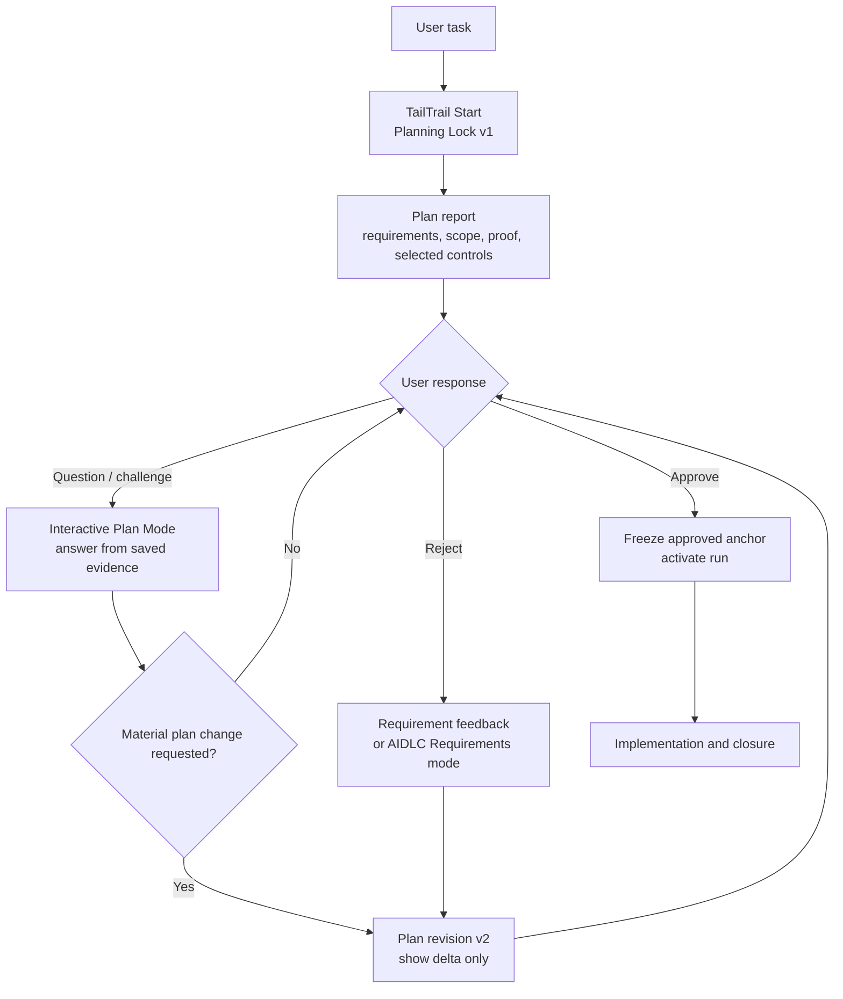
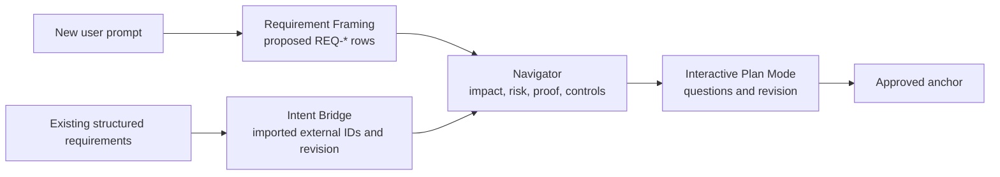
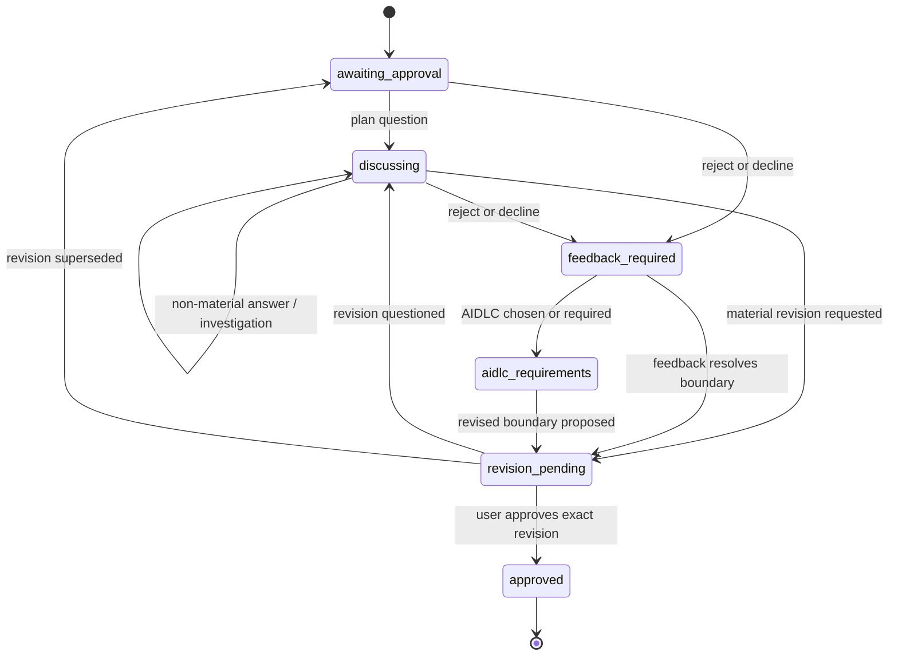
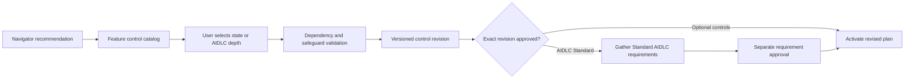

# TailTrail Interactive Plan Mode

## Purpose

Interactive Plan Mode is TailTrail's **Plan Decision Explorer**. It lets a user
discuss an awaiting-approval TailTrail Start plan without having to approve it,
reject it, create a new run, or let an agent begin implementation.

The problem it solves is simple: a Start plan can include files, requirements,
tests, risks, or harnesses that the user does not yet understand. Today, the
user has a hard choice between approving a plan they doubt and rejecting the
whole plan. Neither is a good collaboration model.

Interactive Plan Mode adds a bounded planning conversation:

```text
ask why -> inspect saved planning evidence -> answer with evidence
ask a technical question -> explain scope, alternatives, and risk
provide new clarification -> record a proposed requirement change
request a revision -> render a versioned plan delta -> approve or continue discussion
```

It is a control-plane feature. It never edits project source, runs tests,
scanners, builds, Terraform, Git mutations, or implementation commands.

## Product boundary

This mode is not an implementation chat and is not a weaker form of approval.

| Concern | Interactive Plan Mode | Implementation / activated run |
| --- | --- | --- |
| Purpose | Understand, challenge, clarify, or revise a plan | Change source under an approved anchor |
| Source edits | Never | Allowed only inside approved scope |
| Tests/scanners | Never run | Run only when selected/approved |
| Git actions | Never | Governed by recovery/readiness rules |
| Authority | Awaiting-approval Planning Lock | Immutable approved anchor |
| Output | Evidence-backed answer or revised plan | Requirement-linked delivery and closure evidence |

It does not replace existing rejection feedback, AIDLC Requirements mode,
Intent Bridge, or the Harnesses. It sits before approval and makes those paths
less disruptive.

## Why it matters

Consider this plan row:

```text
REQ-03: Prevent duplicate payment adjustment.
Likely files: payments.py, service.py, notifications.py.
Proof: idempotency integration test.
```

A user may reasonably ask:

```text
Why is notifications.py in scope? Can we keep this to payments.py only?
```
 
The desired response is not a generic explanation. TailTrail should respond
from saved planning evidence:

```text
notifications.py is an inspection target, not an approved edit target.

Evidence:
- service.py coordinates payment completion and customer notification.
- The requirement says effects happen at most once.
- A duplicate payment path can also create a duplicate notification.

Alternative:
- Keep notifications.py read-only if the existing service-level idempotency
  guard demonstrably covers notification publication.

Plan impact:
- No revision is needed unless you want the preservation/proof boundary changed.
```

This gives the user a meaningful choice without forcing them to reject the
whole plan.

## Position in the lifecycle



Interactive Plan Mode operates only while the run state is
`awaiting-approval` or `feedback-required`. Once an anchor is approved, normal
failure, correction, amendment, and recovery flows remain authoritative.

## Requirement-source model

Navigator must receive one requirement boundary before it maps files and
selects evidence. Interactive Plan Mode explains and revises that boundary; it
does not invent a second one.



| Requirement source | Interactive Plan Mode behaviour |
| --- | --- |
| Requirement Framing | May revise proposed TailTrail requirements after user clarification. |
| Intent Bridge | Must not rewrite imported wording. It may explain mappings, record clarifications, or propose an external-source amendment path. |
| AIDLC Requirements | Routes material requirement discovery back to the appropriate AIDLC stage rather than maintaining a parallel questionnaire. |

For an Intent Bridge run, a user may say, “Why does `FR-003` need a payment
test?” The answer can explain TailTrail's local mapping. But a user request to
change `FR-003` itself must be treated as a source amendment; TailTrail cannot
silently alter an external authoritative requirement.

## User experience

The feature should be natural-language first. Users should not need to learn a
new command merely to ask a question. Host adapters recognize that an active
run is awaiting approval and classify the current message as one of these
intent types.

| User message | Classification | Result |
| --- | --- | --- |
| `Why was service.py selected?` | `explain-scope` | Evidence-backed explanation; no revision. |
| `Which caller makes API work necessary?` | `explain-impact` | Show call/contract evidence; no revision. |
| `Can we avoid a new dependency?` | `technical-alternative` | Explain alternatives and trade-offs; no revision. |
| `Positive quantities must remain valid.` | `requirement-clarification` | Propose an added preservation rule. |
| `Remove API changes and update the plan.` | `revision-request` | Create a revised plan proposal and delta. |
| `Reject all — this changes the wrong behaviour.` | `rejection` | Existing requirement feedback flow. |
| `Use AIDLC Requirements mode.` | `aidlc-escalation` | Existing AIDLC requirements flow. |

The assistant must acknowledge the mode explicitly:

```text
Interactive Plan Mode — run start-20260815-123456
No source, tests, scanners, or Git actions were run.
```

That acknowledgement prevents a user from wondering whether their question was
seen as planning discussion, rejection, or permission to implement.

## Plan Decision Explorer coverage

Interactive Plan Mode must explain the complete TailTrail decision, not merely
why a file was listed in scope. Every item displayed in a Start Plan needs an
inspectable rationale, evidence label, and change path.

| Decision area | Example user question | Required answer |
| --- | --- | --- |
| Selected TailTrail feature | `Why is Architecture Fitness selected?` | Trigger, requirement/risk evidence, expected output, and whether it is required or advisory. |
| Deferred feature | `Why is Behaviour Harness deferred?` | Missing activation condition and the exact event that would arm it. |
| AIDLC mode | `Why did Lite AIDLC win over Standard?` | Mode-selection signals, included capabilities, excluded capabilities, and explicit escalation choices. |
| Drift posture | `Will drift be captured?` | Per-lens state: selected, armed, triggered, not-needed, or not-applicable. |
| Testing decision | `Why are focused unit tests enough?` | Requirement proof contract, selected minimum tier, gaps that would raise the tier, and tests not yet run. |
| Token posture | `Why is the estimated context high?` | Local estimate inputs, exactness-boundary files, and the difference between estimated and measured usage. |
| Risk classification | `Why is this release risk?` | Detected risk signals, evidence, and the control selected in response. |
| Requirement authority | `Are these generated or imported requirements?` | Requirement Framing, Intent Bridge, or AIDLC authority and revision identity. |
| Scope and technical rationale | `Why service.py?` | Caller/symbol/configuration/test relationship and alternative scope. |
| Approval consequences | `What changes if I approve?` | Anchor, active slice, allowed controls, and the closure/revision path. |

### Example: AIDLC mode decision

```text
User: Why did TailTrail choose Lite AIDLC rather than Standard?

TailTrail:
Mode decision: Lite

Evidence:
- The request is one bounded feature with no explicit “using AIDLC” request.
- Navigator found a local implementation and focused proof path.
- No programme-scale dependency, regulated requirement, or unresolved
  requirement contradiction was detected in the current plan.

Lite includes:
- Planning Lock, Navigator mapping, requirement/proof planning, and selected
  TailTrail Harnesses.

Lite does not include:
- A mandatory requirements workshop, architecture alternatives workshop, or
  lifecycle-stage artifacts.

Plan impact: no change.
Escalation: request “using AIDLC” for Standard, or “full AIDLC” when the
official lifecycle is explicitly required and compatible.
```

### Example: drift decision

```text
User: Will drift be captured for this task?

TailTrail:
Drift posture:
- Requirement Completion: selected; activates after approved evidence exists.
- Architecture Fitness: selected; checks scope/callers after implementation.
- Behaviour: deferred; activates if the approved proof includes a user journey.
- Context Continuity: armed; triggers only after correction, repeated gap,
  failed evidence, scope drift, or a slice transition.
- Recovery Boundary: available; triggers after recovery risk, conflict, or
  failed bounded correction.
- Source-intent drift: not applicable; this plan has no Intent Bridge source.

No drift has been detected. Implementation has not started.
```

## Decision posture vocabulary

The same word must not mean different things in different reports. Interactive
Plan Mode, Workflow Dashboard, Completion Report, and host adapters should use
these exact states:

| State | Meaning |
| --- | --- |
| `selected` | Chosen in the approved/proposed workflow for this task. |
| `armed` | Applicable later, but waiting for its trigger condition. |
| `triggered` | Actively running because its condition occurred. |
| `not-needed` | Evaluated against the current approved task and unnecessary. |
| `not-applicable` | The task lacks the prerequisite condition. |
| `deferred` | Potentially useful, but intentionally outside the current approval boundary. |
| `unknown` | Saved evidence cannot support a decision; do not imply an answer. |

For example, a Behaviour Harness can be `deferred` in a service-only plan,
`selected` once a customer journey is approved, and `triggered` only when an
actual behaviour receipt is required. A deferred feature has not failed and has
not been forgotten.

## Evidence hierarchy for answers

Every answer must distinguish evidence from inference.

| Evidence label | May support | Cannot support |
| --- | --- | --- |
| `planning-lock` | Saved goal, requirements, scope, selected controls | A new source-code fact not in the plan |
| `graph-cache` | Saved caller, symbol, test, and dependency relationships | Fresh repository state after cache staleness |
| `local-source` | A read-only, explicitly requested plan investigation | Claims that tests or runtime behaviour passed |
| `heuristic` | A likely impact or risk explanation | A mandatory implementation claim without corroboration |
| `imported-intent` | External requirement wording and source revision | Permission to rewrite that source |
| `decision-record` | Saved Navigator/AIDLC/mode/feature-selection rationale | A claim that a later control actually ran |

The standard answer shape is:

```text
Answer
<direct response>

Evidence
- <saved planning/graph/intent evidence>

Impact on the plan
- no change | proposed change to REQ-02 | requires a source amendment

Next choice
- continue discussion | request revision | reject / use AIDLC
```

## Read-only plan investigation

Saved plan evidence will sometimes be insufficient for a technical question.
For example, the user may ask whether an existing idempotency guard already
covers both a payment adapter and notification publisher, but the initial plan
only selected the files as likely inspection targets.

Interactive Plan Mode may offer one bounded action:

```text
I cannot prove that from the saved plan. Would you like a read-only plan
investigation of service.py, payments.py, and notifications.py? It will not
change source, run tests, or create a new plan.
```

Only an explicit affirmative answer authorizes this investigation. Its receipt
must record:

```json
{
  "type": "tailtrail-plan-investigation",
  "run_id": "start-20260815-123456",
  "status": "completed",
  "paths_read": [
    "src/order_service/service.py",
    "src/order_service/payments.py",
    "src/order_service/notifications.py"
  ],
  "commands_run": [],
  "source_changed": false,
  "tests_run": false,
  "boundary": "Read-only planning evidence only; no approval or implementation authority was created."
}
```

This is deliberately narrower than generic repository discovery. It exists to
answer a declared planning question and must be scoped to that question.

## Revision semantics

Not every conversation message should create a plan version. A revision is
required only when the proposed delivery contract materially changes.

### Material changes

- requirement added, removed, split, merged, or materially reworded;
- preservation rule added, removed, or changed;
- approved implementation scope expanded, narrowed, or a protected file added;
- proof tier changed, such as focused unit proof becoming contract/integration proof;
- dependency, security, migration, rollout, or recovery expectation changed;
- requirement-source authority changes, including an Intent Bridge amendment.

### Non-material discussion

- explanation of an existing file/caller selection;
- explanation of a selected Harness;
- comparison of alternatives where the user has not chosen one;
- formatting or ordering request that does not change meaning;
- a read-only investigation whose findings do not alter the plan.

### Versioned artifact lifecycle

```text
.tailtrail/runs/<run-id>/planning/
├── lock-v1.json
├── start-report-v1.md
├── plan-conversations.jsonl
├── investigations/
│   └── investigation-001.json
├── revisions/
│   ├── plan-v2.json
│   ├── plan-v2-delta.md
│   └── plan-v2-rationale.json
└── approved/
    └── approved-v2.json
```

`lock-v1.json` and the original report stay immutable. Conversation messages
are recorded as sanitized structured receipts, not raw chat transcripts.
`plan-v2` is a proposed successor—not an approved anchor. Only explicit user
approval may create `approved-v2.json` and activate implementation.

### Revision example

Original requirement:

```text
REQ-03: Update API contract for order amendment.
Proof: contract test.
```

User says:

```text
Do not add an API endpoint. This work is internal service support only.
Update the plan.
```

TailTrail renders:

```text
# TailTrail Plan Revision

Run: start-20260815-123456
Revision: v1 -> v2
State: awaiting approval

Changed requirements
- REQ-03: API contract update -> removed by user direction.

Changed scope
- api.py: inspection target removed.

Changed validation
- Contract test removed.
- Service integration preservation proof retained.

Unchanged
- REQ-01 eligibility.
- REQ-02 inventory release.
- REQ-04 payment idempotency.

Approve plan v2 to begin implementation, or continue the plan discussion.
```

## State machine and authority



Authority rules:

1. Only `awaiting-approval`, `discussing`, `revision-pending`, and
   `feedback-required` may use this feature.
2. The active run ID remains stable across discussion and revisions.
3. Approval must name the current displayed revision, not merely say `approve`
   after a stale v1 plan has been replaced by v2.
4. Previous proposed revisions are retained for audit but cannot be activated.
5. Once execution begins, a desired scope/requirement change uses amendment,
   failure/correction, or recovery controls—not Interactive Plan Mode.

## Command and MCP design

Natural language is the primary user surface. Commands are the deterministic
host-independent control plane.

```text
tailtrail planning discuss --run-id <run-id> --question "Why was service.py selected?"
tailtrail planning investigate --run-id <run-id> --question-id <id> --approved-read-only
tailtrail planning revise --run-id <run-id> --changes revision.json
tailtrail planning revision-show --run-id <run-id> --revision v2
tailtrail planning revision-approve --run-id <run-id> --revision v2 --approved
tailtrail planning aidlc-standard --run-id <run-id> --approved-proposal
tailtrail planning aidlc-standard-approve --run-id <run-id> --revision 2 --approved
```

Suggested MCP tools:

| Tool | Access | Purpose |
| --- | --- | --- |
| `planning_discussion_show` | Read-only | Show sanitized discussion receipts and active revision. |
| `planning_explain` | Read-only | Explain scope, requirement, evidence, or selected control from saved state. |
| `planning_investigate` | Controlled, explicit read-only approval | Create a bounded local-source investigation receipt. |
| `planning_revision_propose` | Controlled, explicit approval | Persist a versioned proposed revision. |
| `planning_revision_approve` | Controlled, explicit approval | Freeze the current revision into the approved anchor. |
| `planning_aidlc_standard_propose` | Controlled, explicit approval | Propose Lite -> Standard AIDLC without beginning implementation. |
| `planning_aidlc_standard_approve` | Controlled, explicit approval | Approve the exact switch and begin Standard AIDLC requirements. |

### Lite-to-Standard AIDLC switch

When a user asks to switch the active awaiting-approval Lite plan to Standard
AIDLC, TailTrail creates `revision-vN.json` with type
`tailtrail-aidlc-mode-switch`; it does not silently replace the plan or begin
source work. Approving that exact revision preserves the run ID and begins the
Standard AIDLC Requirements stage. The user must still answer and separately
approve the revised requirement boundary before any execution can activate.

The route intentionally rejects a run that is already active, already Standard
or Full, or backed by Intent Bridge source-owned wording. Those cases must stay
with their existing authority and amendment controls.

Host adapters must treat `why`, `explain`, `could we`, `what if`, `clarify`,
and `update the plan` as candidate interactive-plan messages only when an
awaiting-approval run exists in the current task context. A pasted stack trace,
an unrelated question, or a message after approval must not be misclassified.

## Required data model

### Conversation receipt

```json
{
  "schema_version": "1",
  "type": "tailtrail-plan-conversation",
  "conversation_id": "plan-q-001",
  "run_id": "start-20260815-123456",
  "plan_revision": 1,
  "classification": "explain-impact",
  "references": [
    {"kind": "requirement", "id": "REQ-03"},
    {"kind": "path", "value": "src/order_service/service.py"}
  ],
  "evidence_labels": ["planning-lock", "graph-cache"],
  "material_change": false,
  "source_changed": false,
  "sanitized_summary": "Explained why the service orchestration path is an inspection target.",
  "created_at": "2026-08-15T00:00:00Z"
}
```

### Proposed revision

```json
{
  "schema_version": "1",
  "type": "tailtrail-plan-revision",
  "run_id": "start-20260815-123456",
  "revision": 2,
  "base_revision": 1,
  "state": "awaiting-approval",
  "changes": [
    {
      "kind": "scope-remove",
      "requirement_uid": "REQ-03",
      "path": "src/order_service/api.py",
      "reason": "User clarified that the delivery is internal-only."
    }
  ],
  "delta_summary": {
    "requirements_changed": ["REQ-03"],
    "scope_added": [],
    "scope_removed": ["src/order_service/api.py"],
    "proof_changed": ["contract -> service integration"]
  },
  "approval_required": true
}
```

Raw prompts, full source, secrets, user identity, unrelated chat text, and
unbounded logs must not be stored in either artifact.

## Implementation plan

### Phase IP-0 — Contract and routing foundation — implemented

Goal: establish the state and security contract before changing host behaviour.

Files:

- `schemas/planning-conversation.schema.json`
- `schemas/planning-revision.schema.json`
- `scripts/planning-discussion.py`
- `scripts/planning-lock.py`
- `scripts/tailtrail.py`
- `tests/test_planning_discussion.py`

Deliver:

- valid run-state transitions;
- deterministic intent classification using an active run plus message shape;
- sanitized conversation receipts;
- no raw-chat persistence;
- no source/tool action on explanation-only requests.

Implementation:

- `tailtrail planning discuss --run-id <run-id> --question "..."` is the
  deterministic local control plane. It operates only on a saved
  awaiting-approval Planning Lock and preserves that lock's run ID and status.
- A discussion receipt is appended to
  `.tailtrail/runs/<run-id>/planning/plan-conversations.jsonl`; the derived
  `discussion-state-v1.json` records discussion activity without changing the
  canonical lock state used by approval and activation.
- Receipts keep classification, bounded REQ/FR/path references, evidence
  labels, fixed sanitized summaries, and metadata. They do not retain raw chat,
  source content, logs, command output, identity, or secret-like values.
- Rejection and AIDLC wording return an existing-route hint without writing a
  discussion receipt. Stack traces/errors and ambiguous ordinary chat are also
  excluded. An approved run receives a clear state error instead of a second
  planning conversation.
- IP-0 does not answer from source, create a revision, or update the Start
  report. Those remain later phases; this foundation is source- and plan-content
  read-only.

Acceptance checks:

- a plan question preserves the same run ID;
- a past error does not become a discussion event;
- an approved run rejects the interactive-plan route;
- an unknown/ambiguous message remains ordinary chat guidance.

Validation completed: `tests/test_planning_discussion.py` covers same-run
receipt capture, raw-chat exclusion, error exclusion, approved-run rejection,
ordinary-chat routing, and existing rejection/AIDLC routes.

### Phase IP-1 — Evidence-backed explanation

Goal: answer planning questions from saved evidence without silently discovering
or changing the project.

Status: **implemented**.

Files:

- `scripts/planning-discussion.py`
- `scripts/task-start.py`
- `scripts/review-graph.py`
- `scripts/code-graph-mapper.py`
- `tests/test_planning_discussion.py`

Deliver:

- explanations for selected files, requirement rows, validation choices,
  selected/deferred Harnesses, AIDLC mode, drift posture, token estimate,
  requirement authority, risk classification, approval consequences, and
  assumptions;
- evidence labels and direct/alternative/risk response shape;
- explicit `unknown` where saved evidence is insufficient.

Implementation:

- `tailtrail planning explain --run-id <run-id> --question "..."` uses the
  existing discussion control plane and returns a direct response, labelled
  evidence, alternative, risk, plan impact, and next choice. `planning discuss`
  returns the same answer so a host needs no second interaction.
- It reads only run-local `lock-v1.json` and immutable `start-report-v1.json`.
  Saved Navigator impacts, requirement/import rows, selected/deferred controls,
  suggested validation, AIDLC mode, token posture, risk posture, and lock
  boundary are reused. It deliberately does not rerun `review-graph.py` or
  `code-graph-mapper.py`, which would create fresh repository evidence after
  the reviewed plan.
- Saved graph-reason relationships are labelled `graph-cache`; saved Navigator,
  AIDLC, and validation decisions are `decision-record`; imported requirements
  are `imported-intent`; and the approval boundary is `planning-lock`. Missing
  evidence is returned as `unknown`, never promoted to a source fact.
- The persisted receipt stores the structured response but not raw chat. A
  clarification or revision request remains a proposal only; IP-1 does not
  mutate the Start Report or approved anchor.

Acceptance checks:

- `Why was service.py selected?` cites saved planning/graph evidence;
- a heuristic is not rendered as proof;
- an explanation does not alter the plan or touch source state.

Validation completed: focused tests cover saved file evidence, missing-evidence
`unknown`, token/drift exactness boundaries, raw-chat exclusion, and unchanged
source content.

### Phase IP-1A — Decision posture projection

Goal: make every selected, deferred, armed, triggered, not-needed,
not-applicable, and unknown TailTrail decision visible and queryable from one
canonical planning projection.

Files:

- `scripts/planning-decision-posture.py`
- `scripts/task-start.py`
- `scripts/navigator.py`
- `scripts/planning-lock.py`
- `schemas/planning-decision-posture.schema.json`
- `scripts/workflow-dashboard.py`
- `tests/test_planning_decision_posture.py`

Deliver:

- one versioned decision-posture artifact per plan revision;
- stable decision IDs linking each displayed feature, AIDLC selection, risk,
  testing tier, token posture, requirement authority, and approval consequence
  to its evidence and trigger conditions;
- a concise non-verbose plan table plus complete verbose decision table;
- a read-only `tailtrail planning decision-show --run-id <id>` surface.

Acceptance checks:

- a user can ask why Lite, not Standard, was chosen and receive mode evidence;
- each deferred/armed Harness reports its trigger condition;
- token estimates never appear as measured tokens;
- an unselected control cannot be shown as triggered;
- completion output distinguishes selected-but-never-triggered from pass/fail.

### Phase IP-2 — Bounded read-only investigation

Goal: allow deeper technical answers only with explicit user permission.

Status: **implemented**.

Files:

- `scripts/planning-investigation.py`
- `scripts/planning-discussion.py`
- `schemas/planning-investigation.schema.json`
- `scripts/mcp-server.py`
- `tests/test_planning_investigation.py`

Deliver:

- path-limited read-only source investigation;
- command-free receipt with read paths, evidence labels, and boundary;
- stale graph detection before reusing graph evidence;
- no tests, scanners, builds, package manager, Git, or source mutation.

Implementation:

- `tailtrail planning investigate --run-id <run-id> --path <planned-path>
  --approved-read-only` performs the only IP-2 read. It remains available only
  while the Planning Lock awaits approval and preserves that exact run ID.
- Each requested path must be repository-relative, inside the selected root,
  an existing regular UTF-8 text file, and already present in the saved Start
  Report impact/requirement boundary. Parent traversal, absolute paths,
  unplanned paths, binary files, credential-like names, files over 512 KiB, and
  batches above 12 files are rejected before a source read.
- The receipt at
  `.tailtrail/runs/<run-id>/planning/investigations/investigation-###.json`
  stores only paths, SHA-256 fingerprints, line counts, bounded symbol names,
  graph-cache status, and the no-command/no-mutation boundary. It never stores
  raw source or the raw user question.
- If a Code Graph Mapper cache exists, IP-2 checks only the approved paths'
  cached source hashes. `fresh` may be labelled reused; `stale`, `invalid`, and
  `missing` are reported honestly and never cause a graph refresh, rebuild, or
  repository-wide cache scan.
- MCP exposes `planning_investigate` as controlled and approval-gated, and
  `planning_investigation_show` as read-only. The controlled action writes only
  the sanitized local receipt.

Acceptance checks:

- investigation refuses outside-root and unplanned path expansion;
- requires `--approved-read-only` or equivalent MCP approval;
- creates no new Start run and changes no project source;
- reports stale source/graph evidence honestly.

Validation completed: focused tests cover explicit approval, planned-path-only
enforcement, source preservation, raw-source exclusion from receipts, stale
graph detection, CLI routing, MCP tool safety, and registry projection.

### Phase IP-3 — Revision proposal and approval

Goal: turn material conversation conclusions into a small, reviewable plan diff.

Status: **implemented**.

Files:

- `scripts/planning-revision.py`
- `scripts/planning-lock.py`
- `scripts/change-intent-anchor.py`
- `scripts/task-start.py`
- `schemas/planning-revision.schema.json`
- `tests/test_planning_revision.py`

Deliver:

- explicit materiality classifier;
- versioned proposed plan/revision/delta/rationale artifacts;
- preservation of v1 and all previous revisions;
- approval binding to an exact revision;
- approved anchor derived from the selected revision only.

Implementation:

- `tailtrail planning revise --run-id <id> --changes <json>
  --approved-proposal` accepts only six explicit material change kinds:
  `scope-add`, `scope-remove`, `requirement-add`, `requirement-remove`,
  `requirement-update`, and `proof-update`. Every change is linked to a stable
  requirement UID/display ID where applicable and includes a bounded rationale.
- The proposal is stored as
  `.tailtrail/runs/<id>/planning/revisions/revision-vN.json`. It contains the
  base/revised report fingerprints, requirement continuity map, concise delta,
  sanitized rationale, and revised planning report. The v1 Start report is
  immutable and all earlier revision artifacts remain available for audit.
- `plan-revision-state-v1.json` records the active report revision and at most
  one pending revision. While pending, both ordinary Planning Lock approval and
  activation refuse, preventing a stale v1 approval from bypassing v2.
- `tailtrail planning revision-approve --run-id <id> --revision N --approved`
  verifies the exact pending revision and report fingerprint, selects a
  versioned Start-report snapshot, creates the normal immutable anchor, and
  activates the same run. It does not edit project source or run project
  commands.
- Intent Bridge and AIDLC-bound reports are not locally revised: their
  authoritative amendment/requirements paths remain the source of truth. IP-4
  now routes material conversation outcomes into those authorities.
- MCP provides approval-gated `planning_revision_propose` and
  `planning_revision_approve`, plus read-only `planning_revision_show`.

Acceptance checks:

- removing API scope produces a v2 delta and requires approval;
- a v1 approval cannot activate v2;
- non-material explanations do not create a revision;
- revision retains requirement UID continuity and links changed rows.

Validation completed: focused tests cover explicit proposal authority, immutable
v1 preservation, exact revision approval, pending-revision stale-approval
blocking, requirement UID continuity, authority routing without local rewrite,
CLI routing, MCP safety, registry projection, and Planning Lock compatibility.

### Phase IP-4 — AIDLC and Intent Bridge integration

Goal: preserve source ownership and avoid competing requirement processes.

Status: **implemented**.

Files:

- `scripts/aidlc-requirements.py`
- `scripts/official-aidlc-requirements.py`
- `scripts/spec-kit-bridge.py` (internal implementation name)
- `scripts/spec-kit-amendment.py` (internal implementation name)
- `tests/test_planning_discussion.py`
- `tests/test_spec_kit_amendment.py`

Deliver:

- Ordinary TailTrail-owned requirements continue through the versioned local
  revision flow from IP-3.
- AIDLC-bound work creates a versioned authority-route receipt and starts or
  resumes the existing AIDLC Requirements stage with a sanitized material-change
  context. Full AIDLC uses the verified official Requirements stage; a material
  design/architecture request is explicitly routed to the configured official
  Design stage instead of producing a parallel TailTrail questionnaire.
- Intent Bridge runs retain source ownership. A material wording request writes
  an `intent-bridge-amendment` route with the source/import revision comparison;
  it never rewrites imported requirements, the source artifact, or the immutable
  Start report.
- `tailtrail planning authority-show --root . --run-id <id>` and read-only MCP
  `planning_authority_show` expose the authority, route, bounded requested
  change, next action, and no-source-change boundary.
- `planning_authority_routed` is a ledger event, and authority-route receipts
  are saved under `.tailtrail/runs/<id>/planning/authority-routes/`.

Acceptance checks:

- imported requirements are never rewritten by a plan conversation;
- an external source change creates an amendment, not a local plan rewrite;
- second material rejection follows the current AIDLC escalation rule.
- AIDLC route context is visible on resumed requirement gathering and can shape
  the existing AIDLC questions without retaining raw conversation text.

### Phase IP-5 — Host UX, MCP, and evaluation

Goal: make the experience natural across Codex, Copilot, and Claude and prove
that it reduces unnecessary rejection without loosening approval.

Status: **implemented**.

Files:

- `adapters/prompts/codex.md`
- `adapters/prompts/copilot.md`
- `adapters/prompts/claude.md`
- `AGENTS.md`
- `scripts/mcp-server.py`
- `scripts/planning-discussion.py`
- `scripts/workflow-dashboard.py`
- `scripts/host-adapter-conformance.py`
- `scripts/host-runtime-conformance.py`
- `benchmarks/evaluation/scenarios/interactive-plan-mode/`
- `tests/test_mcp_server.py`
- `tests/test_host_runtime_conformance.py`

Deliver:

- composed Host UX v2 instructions, checked for Codex, Copilot, and Claude;
- read-only MCP `planning_decision_show`, containing Planning Lock status,
  discussion count, active/pending revision, revision history count, and
  AIDLC/Intent Bridge authority routes;
- deterministic `interactive-plan-mode` fixture covering saved-evidence
  explanation, explicit investigation approval, versioned revision, stale
  approval blocking, rejection/AIDLC, Intent Bridge and official AIDLC routes,
  deferred Harness explanation, and token-estimate boundary;
- workflow-dashboard JSON and Markdown visibility of revision, discussion, and
  authority-route history after activation;
- `adapters conformance` for generated instruction surfaces and existing
  receipt-based `adapters runtime` verification for actual host behavior.

Acceptance checks:

- all hosts preserve the current run ID during discussion;
- no host starts implementation after `why` or `update the plan`;
- evaluation shows plan revisions are explicit, bounded, and approved;
- no quality, time, or token-savings claim is made without measured evidence.

Validation completed: focused tests cover decision summaries, read-only MCP
projection, dashboard planning history, generated host surfaces, runtime receipt
versioning, CLI routing, and the deterministic evaluation fixture.

## First implementation scope

## Expert Plan Customization — implemented

Expert Plan Customization is the single feature-selection surface for an
awaiting Planning Lock. Navigator always creates the recommended workflow
first. Users who understand TailTrail can then choose a different setting for
catalogued optional controls without creating a feature-specific workflow.



The catalog is derived from the saved Navigator and delivery selections, then
augmented with supported reusable controls. It uses one data shape for every
choice:

```json
{"feature":"Behaviour Harness","value":"selected","reason":"Customer journey proof is needed."}
```

Optional feature values are `selected`, `armed`, or `disabled`. `selected`
adds the control to the approved delivery path; `armed` preserves it as a later
conditional control; `disabled` records reduced coverage. Core controls such
as Navigator, Canonical Requirements, Requirement Completion Harness, and
Evidence-Aware Testing are locked. AIDLC is a catalogued choice: Lite may move
to Standard, which starts requirements gathering after the control revision is
approved; it never skips the separate requirement approval. Full AIDLC remains
an explicit new Full-mode Start run.

Implementation files are `scripts/planning-feature-controls.py`, the shared
Planning Lock revision state, CLI dispatch, and the run ledger. The artifact is
saved as a normal versioned planning revision, so it blocks stale approvals and
remains visible to the approved anchor and handoff. No source code, test, Git,
or runtime tool is accessed during catalog display or proposal creation.

```text
tailtrail planning feature-controls-show --run-id <run-id>
tailtrail planning feature-controls-propose --run-id <run-id> --changes <json> --approved-proposal
tailtrail planning feature-controls-approve --run-id <run-id> --revision <n> --approved
```

Acceptance checks cover optional feature enablement, locked safeguard refusal,
unknown-control refusal, same-run versioning, ledger events, and the special
Standard AIDLC requirement boundary.

The first useful version should be deliberately small:

```text
IP-0 + IP-1 + one revision path
```

That means:

- answer “why was this file/requirement/test selected?” from saved evidence;
- answer “what is the risk/alternative?” with labelled inference;
- let a user request one material revision;
- render a concise plan delta;
- require approval of that revision before implementation.

Read-only source investigation, full MCP support, host-specific language
classification, AIDLC handoff, and evaluation fixtures should follow after the
core path proves usable.

## Failure and edge-case handling

| Situation | Required response |
| --- | --- |
| User asks an unrelated technical question | Answer normally; do not attach it to the run. |
| No awaiting plan exists | Offer ordinary guidance or Start; do not invent a run. |
| User asks why a file was selected but no evidence exists | State `unknown`; offer bounded read-only investigation. |
| User changes a requirement during discussion | Mark it as a proposed revision; no automatic plan mutation. |
| User changes imported intent wording | Route to Intent Bridge amendment. |
| User rejects the plan | Use existing feedback/AIDLC rules, not a conversation summary. |
| User approves an old plan after v2 exists | Ask them to approve the current exact revision. |
| Source changes after v2 but before approval | Mark revision stale; rerun the appropriate source/amendment check. |
| A plan discussion repeats without progress | Offer a concise decision summary, feedback template, or AIDLC escalation. |

## Metrics and evaluation

Interactive Plan Mode should not claim that it improves productivity until it
has evidence. Local deterministic data can record:

- questions per planning run;
- explanations resolved without revision;
- revisions per planning run;
- direct approvals after discussion;
- rejections avoided only when the user explicitly marks the explanation as
  sufficient;
- requirement/scope/proof changes by category;
- stale-approval prevention events;
- AIDLC escalations after unresolved discussion.

Never treat fewer questions as automatically better. A useful question that
prevents an unsafe approval is a positive outcome.

## Non-goals

- No unrestricted conversational memory or raw transcript archive.
- No source implementation before approval.
- No automatic plan approval after the assistant answers a question.
- No repeated requirement gathering that competes with AIDLC or Intent Bridge.
- No autonomous decision to narrow security, testing, migration, or release
  scope when a user is uncertain.
- No hidden repository scan, test run, external API call, or model telemetry.

## Definition of done

Interactive Plan Mode is ready when a user can ask why a file, requirement,
proof, TailTrail feature, AIDLC mode, drift state, risk, token estimate, or
approval consequence was selected; receive an evidence-labelled answer; request
a material plan update; review a concise versioned delta; approve the current
revision; and continue under the same run ID with no accidental source action
or loss of prior planning evidence.
