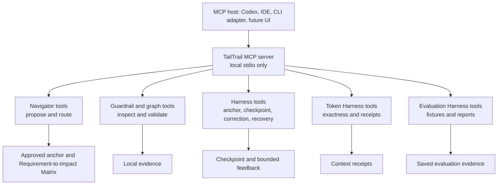
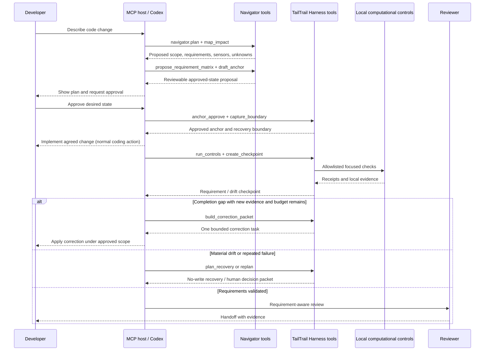

# TailTrail MCP Architecture

## Document status

**Status:** detailed design and staged implementation plan.

TailTrail already has an opt-in, local stdio MCP server for a deliberately
small read-only surface. This document defines how that server can grow into a
clear, inspectable tool layer for Navigator, Harness Engineering, Token Harness,
Evaluation Harness, and existing TailTrail controls—without turning TailTrail
into an opaque autonomous agent, a background service, or a remote control
plane.

This is a design document. A tool described here is not implemented merely
because it appears in a table. Every planned tool must be marked `planned` in
its registry/schema until its handler, tests, documentation, and safety checks
actually exist.

Related design sources:

- [Harness Engineering](harness-engineering.md): approved anchors,
  Requirement-to-Impact Matrix, checkpoints, bounded correction, and recovery.
- [Token Harness](TOKEN-HARNESS.md): exactness, context receipts, reductions,
  proof labels, and measured-claim boundaries.
- [Evaluation Harness](EVALUATION-HARNESS.md): deterministic scenarios,
  evidence normalization, and outcome evaluation.
- [MCP Server](MCP-SERVER.md): current setup and the existing read-only tool
  contract.
- [Roadmap](roadmap.md): BL-9 scope, delivery sequencing, and feature status.

## Executive decision

Build MCP as a **thin, local capability layer over shared TailTrail modules**.
It should expose a small number of meaningful operations with typed inputs,
structured outputs, evidence pointers, explicit mutability, and stable tool
names. It must not duplicate CLI business logic or expose arbitrary shell
execution.

```text
Good MCP tool:  propose_requirement_matrix
                -> structured plan, confidence, evidence pointers, unknowns

Bad MCP tool:   run_tailtrail_everything
                -> opaque chain, unclear authority, hard to test or debug
```

The result should be easier to inspect than a Markdown-only workflow:

```text
Codex / another MCP host
       |
       v
TailTrail MCP tool (typed contract + permission tier)
       |
       v
Shared deterministic TailTrail module
       |
       +--> local source / policy / saved artifacts / approved command result
       |
       v
Structured result + run ID + evidence/artifact pointers + next action
```

## Why MCP helps—and where it does not

MCP is valuable when the same TailTrail capability should be callable from
Codex, other coding assistants, a future UI, or a CLI wrapper without each host
reinterpreting a long instruction document. It makes decisions observable:
tools have schemas, tool-call traces, validation, isolated tests, and a precise
failure contract.

It does **not** make an agent inherently correct. Requirements can still be
ambiguous, repository conventions can still be incomplete, and deterministic
checks can still be insufficient proof of behavior. The approved anchor,
human approval gates, focused evidence, and review remain necessary.

| MCP improves | MCP does not replace |
| --- | --- |
| Discoverability of TailTrail capabilities | Clear user requirements and acceptance criteria |
| Structured, repeatable Navigator decisions | Human approval for material desired-state changes |
| Tool-level tests, schemas, logs, and debugging | Source inspection, tests, policy, or review evidence |
| Consistent behavior across MCP-capable hosts | The CLI and Markdown fallback path |
| Narrow permission boundaries around mutating actions | Repository safety and user authority |

## Core principles

1. **One meaningful operation per tool.** A tool should answer one decision or
   produce one evidence-bearing result. Do not create a tool for every internal
   helper, but do not hide several material decisions behind one mega-tool.
2. **Shared implementation, multiple surfaces.** MCP handlers call importable
   TailTrail modules; the CLI calls those same modules. No duplicate planner,
   graph, check, or recovery implementation.
3. **Read-only and deterministic first.** Tool families begin by inspecting,
   proposing, validating, and rendering. Writes, execution, and recovery are
   later, explicit, capability-gated phases.
4. **Evidence first.** Every result names its evidence type, repository-relative
   pointer, command receipt where applicable, and confidence. Prose alone is
   not sufficient for a completion or safety claim.
5. **Approval is data, not conversational guesswork.** Mutating tools require a
   run ID, approved anchor/recovery boundary where relevant, and an explicit
   approval field. A host saying “the user probably wants it” is not enough.
6. **No arbitrary shell interface.** TailTrail exposes allowlisted operations
   and repository-policy-selected commands—not `run_command`.
7. **Local and privacy-preserving by default.** No daemon, remote listener,
   automatic upload, raw prompt capture, secret forwarding, or background
   observer.
8. **Graceful fallback.** Every MCP operation has a CLI/library or Markdown
   equivalent. A repository must remain usable when MCP is not installed.
9. **Stable contracts over clever routing.** Add a tool only when its input,
   output, error states, permissions, and test fixtures are clear.
10. **Registry-backed inventory.** Tool status, owner feature, schema, tests,
    mutability, and capability tier are declared in the TailTrail Feature
    Registry once the registry projection is proven stable.

## Role boundaries

Navigator, Harness Engineering, Token Harness, and Evaluation Harness should
not each become their own MCP server. They are tool families within one local
`tailtrail-mcp` server, sharing a run/artifact vocabulary.



### What Navigator owns

Navigator is a planner and router. It can inspect local source and policy,
decompose requirements, map likely impact, select proportional guides/sensors,
and draft the anchor. It never declares implementation complete and never
silently starts a correction loop.

### What Harness Engineering owns

Harness Engineering compares approved desired state to actual observed state.
It captures the Task Recovery Boundary, runs already-approved computational
controls, records checkpoint deltas, produces one correction packet, and plans
safe recovery. It does not rewrite requirements or use a green test suite as
automatic proof of full completion.

### What Token Harness owns

Token Harness classifies context exactness, produces receipts, safely reduces
eligible artifacts, and reports the distinction between local estimates and
measured usage. It must never compress source, diffs, policy, dependency,
security, or other `must-be-exact` material merely for tool convenience.

### What Evaluation Harness owns

Evaluation Harness runs deterministic saved-artifact scenarios and normalizes
evidence. It evaluates the TailTrail workflow; it does not quietly launch live
model evaluations or make productivity claims without measurement.

## Tool design rules

### Tool granularity

Use a dedicated MCP tool when all of these are true:

- it represents a user-meaningful decision or evidence operation;
- it has a stable typed input and structured output;
- it has an independent safety posture or approval boundary;
- it can be tested with fixtures without a live model; and
- exposing it makes an agent easier to debug than asking it to infer a CLI
  sequence.

Keep an internal helper when it is merely a parsing step, format conversion, or
implementation detail with no independent user decision. For example, parsing a
Python AST belongs inside `map_impact`; it does not need to be an MCP tool.

### Mutability tiers

Every tool declares a tier in its schema and `tools/list` description.

| Tier | Meaning | Examples | Default availability |
| --- | --- | --- | --- |
| `R0-read` | Reads local permitted artifacts and returns analysis. | `navigator_plan`, `map_impact`, `token_classify` | Available in current local MCP baseline. |
| `R1-render` | Writes only a disposable result to the tool response or a caller-supplied temporary output, never repository state. | `render_checkpoint_preview` | Later; local-only. |
| `W1-approved-artifact` | Writes a versioned local TailTrail artifact, not source code. | `anchor_approve`, `capture_recovery_boundary` | Requires explicit approval and repository policy permission. |
| `X1-approved-control` | Runs a policy-allowlisted deterministic command and records its receipt. | `run_focused_controls` | Requires approved run, command allowlist, timeout, and explicit approval. |
| `W2-source-change` | Applies a verified task-owned patch or correction to source. | `apply_recovery` | Deferred; requires explicit approval and safe ownership checks. |

The initial server remains R0-only. A later tool cannot claim R0 merely because
its normal path is usually harmless: a tool that may write, run commands, or
change user state belongs to its stricter tier.

### Common request fields

Every planned tool should accept only the fields it needs, but shared fields
must keep the same meaning:

| Field | Meaning |
| --- | --- |
| `root` | Explicit repository root; must resolve within an approved local workspace. |
| `run_id` | TailTrail run identifier for anchor/checkpoint/receipt linkage. Required after planning begins. |
| `anchor_version` | Approved desired-state version, such as `anchor-v1`. |
| `changed_paths` | Repository-relative candidate paths, never broad filesystem globs. |
| `format` | `json` or `markdown`; JSON is canonical for host use. |
| `approved` | Explicit boolean used only by approval-gated tiers; never implied by a natural-language prompt. |
| `timeout_seconds` | Bounded timeout for approved controls, constrained by repository policy. |

### Common result envelope

All tools should return a versioned JSON envelope. Hosts can render a concise
summary, but must retain the full structured result for the current run.

```json
{
  "contract_version": "1",
  "tool": "tailtrail.navigator.propose_requirement_matrix",
  "run_id": "tt-2026-07-22-001",
  "status": "pass",
  "mutability": "R0-read",
  "summary": "Proposed four requirements and three focused sensors.",
  "evidence": [
    {
      "label": "local-ast",
      "path": "src/claims_api/validation.py",
      "symbol": "validate_claim_amount",
      "line_start": 9,
      "line_end": 14,
      "confidence": "confirmed-by-local-source"
    }
  ],
  "artifacts": [
    {
      "kind": "requirement-impact-matrix",
      "path": ".tailtrail/runs/tt-2026-07-22-001/proposed-matrix.json",
      "state": "proposed"
    }
  ],
  "warnings": [],
  "next_actions": ["review_anchor", "approve_anchor"],
  "blocked_reason": null
}
```

`status` is restricted to `pass`, `fail`, `partial`, `skipped`, `blocked`, or
`needs-decision`. A tool must not return a fabricated `pass` if a relevant
sensor was not run. `evidence` must identify whether it is `local-ast`,
`local-source`, `heuristic`, `provider-backed`, `measured`, `validated`, or
another registered label.

### Error contract

Expected failures are part of the tool design, not generic exceptions:

| Code | Meaning | Safe host response |
| --- | --- | --- |
| `ROOT_NOT_ALLOWED` | Root is outside the allowed workspace or unreadable. | Stop; ask for an allowed local root. |
| `POLICY_REQUIRED` | Required policy/guidance is missing or could not be read. | Report the gap; do not guess policy. |
| `ANCHOR_NOT_APPROVED` | A W1/X1/W2 action lacks approved desired state. | Present the draft anchor for review. |
| `SCOPE_DRIFT` | Actual or proposed path is outside the approved boundary. | Produce a justified-discovery/re-approval decision. |
| `CONTROL_NOT_ALLOWED` | Command, network path, or scanner is not approved by policy. | Do not run it; show the required approval. |
| `RECOVERY_CONFLICT` | Task-owned patch overlaps later user/other-task work. | No write; return assisted recovery plan. |
| `EVIDENCE_INSUFFICIENT` | A requirement has no adequate proof. | Return a correction/evidence packet, not completion. |
| `EXACTNESS_VIOLATION` | A reduction would alter must-be-exact material. | Return exact pass-through or refuse reduction. |
| `TOOL_NOT_IMPLEMENTED` | Planned surface has no shipped handler. | Clearly report planned status; do not simulate it. |

## Planned tool catalogue

The names below use a dotted presentation for readability. The actual MCP wire
names may use the existing repository naming convention (for example,
`navigator_plan`) but must retain a one-to-one registry mapping and documented
alias policy.

### Navigator tool family

| Tool | Tier | Inputs | Output / decision | Notes |
| --- | --- | --- | --- | --- |
| `navigator.plan` | R0 | goal, root, changed paths | Harness level, risk, guides/sensors, likely impact, skipped controls | Existing `navigator_plan` evolves toward this structured contract. |
| `navigator.inspect_policy` | R0 | root, paths | Applicable `AGENTS.md`, local policy, restricted paths, commands | Reads only relevant hierarchy; no policy synthesis beyond evidence. |
| `navigator.map_impact` | R0 | root, changed paths, goal | Likely symbols, callers, tests, line/fingerprint references, confidence | Reuses Code Graph and local AST; labels inference. |
| `navigator.propose_requirement_matrix` | R0 | goal, plan/impact references | Atomic requirements, preserve rules, scope, evidence plan, unknowns | New backbone output for `approved.md`. |
| `navigator.select_sensors` | R0 | matrix, policy, risk | Selected/omitted computational controls and reasons | Cannot authorize an otherwise prohibited control. |
| `navigator.draft_anchor` | R0 | approved candidate matrix, scope, evidence plan | Reviewable `approved.md` preview and fingerprint | Draft only; approval is a separate W1 action. |
| `navigator.explain_route` | R0 | run ID | Why a harness level/tool set was selected | Debugging tool; avoids hidden routing logic. |

`navigator.propose_requirement_matrix` is the critical addition. Each row must
contain a stable requirement ID, kind (`change`, `preserve`, `constraint`,
`safety`, or `decision`), observable outcome, likely code path, expected scope,
evidence plan, confidence, and unknowns. It is a proposal—not a completion
claim.

### Guardrail and code-intelligence family

| Tool | Tier | Inputs | Output / decision | Notes |
| --- | --- | --- | --- | --- |
| `guardrails.check_diff` | R0 | approved diff or safe staged diff, policy context | Structured safeguards/scope/dependency findings | Existing `guardrail_check` remains read-only. |
| `graph.map` | R0 | root, target paths/symbols, depth | Local graph evidence, callers/tests, confidence labels | Existing `graph_map`; no hidden cache refresh/provider startup. |
| `graph.semantic_report` | R0 | approved local provider artifact, target | V2/V3 evidence table and provenance | External provider execution remains separate and approval-gated. |
| `scope.validate` | R0 | run ID, actual changed paths/symbols | In-scope, justified-discovery, new-drift, protected, unknown | Uses approved matrix + recovery boundary. |
| `tests.integrity_check` | R0 | run ID, test diff, matrix | Requirement linkage and assertion-change findings | Detects test-chasing; it does not run tests. |
| `dependencies.check` | R0 | diff/manifests, policy | Dependency-Gate status | Never installs packages or calls a registry. |

### Harness Engineering family

| Tool | Tier | Inputs | Output / decision | Why it is separate |
| --- | --- | --- | --- | --- |
| `harness.anchor_preview` | R0 | proposed Navigator artifacts | Rendered anchor plus gaps | Lets the host show exactly what will be approved. |
| `harness.anchor_approve` | W1 | run ID, anchor fingerprint, `approved: true` | Immutable approved anchor version | Records human approval explicitly. |
| `harness.capture_boundary` | W1 | approved run, `approved: true` | Task Recovery Boundary, baseline fingerprints, ownership ledger | Must occur before an execution agent edits source. |
| `harness.run_controls` | X1 | run ID, selected control IDs, timeout, `approved: true` | Normalized command receipts and `actual.md` evidence | Runs only policy allowlisted computational controls. |
| `harness.create_checkpoint` | W1 | run ID, actual evidence | Requirement/scope/architecture/behavior/evidence delta | Append-only checkpoint state. |
| `harness.build_correction_packet` | R0 | checkpoint ID | One bounded, exact next task or `needs-decision` | Does not apply a fix. |
| `harness.plan_recovery` | R0 | run ID, checkpoint ID | Selective reverse patch plan, safety/conflict classification | Never writes source. |
| `harness.apply_recovery` | W2 | recovery plan fingerprint, `approved: true` | Verified selective recovery receipt | Deferred until patch ownership/conflict tests are strong. |
| `harness.replan` | R0 | failed run, preserved evidence | Navigator Recovery/Replan proposal | Preserves anchor/checkpoints; does not restart from zero. |

### Token Harness family

| Tool | Tier | Inputs | Output / decision | Exactness boundary |
| --- | --- | --- | --- | --- |
| `token.classify` | R0 | path/text label | Content type, exactness class, safe strategy | Existing routing capability; no reduction. |
| `token.context_receipt_preview` | R0 | selected/avoided references | Receipt preview, local estimate, retrieval pointers | No raw source/prompt capture. |
| `token.capture_receipt` | W1 | run ID, receipt, `approved: true` | Local append-only receipt | Privacy-safe metadata only. |
| `token.reduce_artifact` | R1 | eligible artifact, strategy | Reduced representation plus preservation receipt | Refuses `must-be-exact` content. |
| `token.proof_report` | R0 | receipts/ledger/telemetry path | Estimate versus measured labels and limits | Never invents measured savings. |

### Evaluation Harness family

| Tool | Tier | Inputs | Output / decision | Notes |
| --- | --- | --- | --- | --- |
| `evaluation.scenario_list` | R0 | optional category | Available deterministic saved scenarios | Existing read-only surface. |
| `evaluation.scenario_report` | R0 | scenario ID, format | Fixture-backed result/report | Existing read-only surface. |
| `evaluation.run_fixture` | R1 or X1 | scenario ID, explicit mode | Deterministic local scoring result | No live agent/model by default. |
| `evaluation.compare_baseline` | R0 | baseline and harness artifacts | Per-dimension delta and evidence limits | Supports benchmark claims only when fixture-backed. |
| `evaluation.normalize_event` | W1 | local event, `approved: true` | Privacy-safe normalized event | Must follow Evaluation Harness schema. |
| `evaluation.portfolio_report` | R0 | saved event/scenario inputs | Aggregated local evidence report | No automatic upload or cross-repo service. |

## End-to-end MCP workflow

The normal workflow is intentionally not an autonomous chain. The MCP host calls
the next tool only after it has shown the relevant plan or result and the
required approval condition is satisfied.



## Debuggability and observability

MCP is only an improvement if failures are easier to understand. Each tool call
therefore needs a compact trace that can be inspected locally without recording
raw source or conversational history.

| Trace field | Purpose |
| --- | --- |
| `run_id`, `tool_call_id`, and parent checkpoint | Connect a result to one task/run. |
| Tool/version/schema version | Diagnose host/server mismatch. |
| Mutability tier and approval state | Explain why a write/control did or did not run. |
| Policy/anchor fingerprints | Prove which decision context governed the call. |
| Selected/skipped controls | Make omissions visible, not mysterious. |
| Exact evidence pointers and hashes | Enable retrieval without copying full artifacts into logs. |
| Duration, timeout, exit status, parser status | Debug local command execution honestly. |
| Error code and safe next action | Let a host recover without improvising. |

Local trace metadata belongs under a Git-ignored `.tailtrail/runs/<run-id>/`
directory. It must exclude raw prompts, raw source, secrets, customer data,
unredacted logs, and model conversation. Full source and command output remain
at their original repository locations and are retrieved only when necessary.

## Security and authority model

### Root and path safety

- `root` must be explicit, canonicalized, and within the host-approved
  workspace.
- Input paths are repository-relative; reject absolute paths, path traversal,
  ambiguous globs, and paths outside the selected root.
- Tool output must not expose content from unapproved paths merely because a
  graph relationship references them.
- Protected paths from repository policy are returned as metadata, never
  bypassed by a task anchor.

### Command safety

- `harness.run_controls` accepts a stable **control ID**, not a command string.
- The repository policy maps control IDs to exact allowlisted command templates,
  supported working directories, input shapes, timeouts, and result parsers.
- The server rejects unknown IDs, command substitutions, networked controls,
  package installation, destructive commands, and shell redirection in the
  initial phases.
- Command receipts record that a command was attempted and its actual status;
  they do not translate a timeout or unavailable dependency into a pass.

### Source mutation safety

No MCP source-write tool is part of the initial design. If `apply_recovery` is
added later, it must require all of the following:

1. An approved recovery-plan fingerprint and explicit `approved: true`.
2. A Task Recovery Boundary captured before the failed task began editing.
3. Task-owned hunks with matching context and file fingerprints.
4. No overlap with later user/other-task work; overlap produces
   `RECOVERY_CONFLICT` and **no write**.
5. An append-only checkpoint receipt of the attempt/result.

Git remains the repository's source of rollback history. TailTrail's recovery
artifacts only protect the narrower problem of reversing one failed task while
preserving other valid uncommitted work.

## CLI, library, and MCP relationship

The correct layering prevents MCP drift:

```text
TailTrail domain modules
  - navigator_core
  - requirement_impact_matrix
  - harness_controls
  - harness_checkpoint
  - task_recovery_boundary
  - token_harness
  - evaluation_harness
        ^                 ^
        |                 |
CLI adapters          MCP handlers
tailtrail.py          mcp-server.py
```

Rules:

- Domain modules return structured data and do not print host-specific prose.
- CLI adapters format the same data for humans and preserve existing commands.
- MCP handlers validate schemas, mutability/approval, path safety, and return
  the common envelope.
- No MCP handler shells out to a CLI just to parse its text output when an
  importable module can be used.
- A temporary wrapper may exist while refactoring legacy code, but it should be
  tracked as migration debt with fixture parity tests.

## Registry and schema model

Once the existing Feature Registry projection is stable, each tool should have
one registry entry or a sub-entry under its owning feature:

```json
{
  "id": "navigator-propose-requirement-matrix",
  "owner_feature": "harness-engineering",
  "status": "planned",
  "mcp_name": "navigator.propose_requirement_matrix",
  "mutability": "R0-read",
  "input_schema": "schemas/mcp/navigator-propose-requirement-matrix.schema.json",
  "result_schema": "schemas/mcp/result-envelope.schema.json",
  "cli_equivalent": "tailtrail harness plan",
  "tests": ["tests/test_mcp_server.py", "tests/test_requirement_impact_matrix.py"],
  "policy_gate": "none"
}
```

Required schema contracts:

- `schemas/mcp/result-envelope.schema.json`
- `schemas/mcp/error.schema.json`
- `schemas/mcp/navigator-plan.schema.json`
- `schemas/mcp/requirement-impact-matrix.schema.json`
- `schemas/mcp/harness-control-request.schema.json`
- `schemas/mcp/harness-checkpoint.schema.json`
- `schemas/mcp/task-recovery-plan.schema.json`
- `schemas/mcp/token-receipt.schema.json`
- `schemas/mcp/evaluation-request.schema.json`

Do not introduce a schema solely for a one-field wrapper. Prefer a stable
domain-level schema shared by CLI, MCP, saved artifact, and tests.

## Staged implementation plan

### MCP-0: Inventory and contract audit

Goal: stabilize the existing BL-9 read-only server before expansion.

1. Inventory current tools, CLI equivalents, handlers, docs, tests, input
   shapes, output shapes, and mutability.
2. Mark whether each tool is a thin wrapper or still parses CLI text.
3. Introduce the common result/error envelope without changing the meaning of
   existing tool responses unexpectedly; use compatibility aliases where needed.
4. Add tool-level `mcp doctor` checks for duplicate names, missing schemas,
   handler coverage, documented mutability, unknown error codes, and registry
   drift.
5. Confirm no existing handler permits arbitrary command execution or writes.

Acceptance: current read-only tools retain behavior and gain clear contract
tests; a host can distinguish `not implemented`, `blocked`, and `fail`.

### MCP-1: Navigator decision tools

Goal: make Navigator's important planning decisions structured and inspectable.

Build in order:

1. Extract reusable policy/impact/sensor-selection functions from existing
   Navigator/Code Graph paths.
2. Add `navigator.inspect_policy`, `navigator.map_impact`,
   `navigator.propose_requirement_matrix`, `navigator.select_sensors`, and
   `navigator.draft_anchor` as R0 tools.
3. Add confidence/provenance labels and the Requirement-to-Impact Matrix
   validation rules from Harness Engineering.
4. Render the same matrix in `tailtrail start`/`harness plan` outputs.

Acceptance: a multi-file task produces a stable matrix with atomic change and
preserve requirements, likely paths, evidence plan, unknowns, and skipped
controls; no source or TailTrail run artifact is written by the MCP call.

### MCP-2: Harness artifact and control tools

Goal: connect approved planning to deterministic evidence without autonomous
implementation.

1. Add W1 `harness.anchor_approve` and `harness.capture_boundary` with explicit
   approval/fingerprint tests.
2. Add X1 `harness.run_controls`, accepting only control IDs selected by the
   approved anchor and allowed by repository policy.
3. Add `harness.create_checkpoint`, `scope.validate`, and
   `tests.integrity_check` with requirement-level evidence overlay.
4. Add `harness.build_correction_packet` with the standard two-correction
   default and stop conditions.

Acceptance: an MCP host can inspect why a requirement is
`validated`, `implemented-not-validated`, `failed`, `new-drift`, or
`needs-decision` without giving any tool arbitrary shell authority.

### MCP-3: Recovery and replan—read-only first

Goal: make failed multi-file work diagnosable and safe before enabling any
selective source write.

1. Add R0 `harness.plan_recovery` and `harness.replan`.
2. Test Task 1 valid uncommitted work + Task 2 failure in the same file.
3. Test context mismatch, new/deleted file, protected file, and later user edit
   cases.
4. Add optional Recovery Diagnostician output only after repeated failure or
   ambiguity; it must label hypotheses as inferred vs confirmed.

Acceptance: conflicts always return a no-write plan. `apply_recovery` remains
absent until selective-recovery fixtures have proven safe over real tasks.

### MCP-4: Token and Evaluation projections

Goal: make existing local evidence systems discoverable through the same
contract without changing their claim boundaries.

1. Expose R0 Token Harness classification and proof report.
2. Add approval-gated context-receipt capture; ensure exactness violations
   return pass-through/refusal rather than a lossy reduction.
3. Standardize existing Evaluation Harness scenario list/report results under
   the envelope.
4. Add deterministic fixture run/compare only when it does not require a live
   model, API key, network service, scanner, or repository mutation.

Acceptance: a host can retrieve token/evaluation evidence with correct labels;
no output implies exact savings, live agent quality, or uploaded telemetry.

### MCP-5: Gated mutation and host adapters

Goal: consider W2 source write only after the prior phases prove useful and
safe.

Preconditions:

- recovery fixtures show no unsafe overwrite;
- R0/W1/X1 tool precision and false-positive rates are acceptable;
- all tool schemas, doctor checks, and registry projection are stable;
- users can understand and approve the action in host UX; and
- a full audit trail and no-write conflict behavior are demonstrated.

Only then evaluate `harness.apply_recovery` or a host adapter that sends one
bounded correction packet to a supported coding agent. This is not an
always-running Navigator Orchestrator; it remains opt-in, budgeted, and
approval-gated.

## Files likely to change

This is a future implementation inventory, not an instruction to create all
files at once.

| Area | Likely files | Responsibility |
| --- | --- | --- |
| Server | `scripts/mcp-server.py`, `scripts/mcp_registry.py` | Transport, tool registration, schema validation, tier enforcement, doctor. |
| Domain logic | `scripts/navigator_core.py`, `scripts/requirement_impact_matrix.py`, `scripts/harness_controls.py`, `scripts/harness_checkpoint.py`, `scripts/task_recovery*.py` | Shared deterministic implementation used by CLI and MCP. |
| Token / evaluation | Existing Token and Evaluation Harness modules | Return normalized structured data rather than MCP-specific prose. |
| CLI | `scripts/tailtrail.py` | Preserve command compatibility; expose same functions locally. |
| Schemas | `schemas/mcp/*.schema.json` | Tool input, common output, errors, artifact formats. |
| Tests | `tests/test_mcp_server.py` plus focused domain fixtures | Contract, safety, path, approval, recovery, and parity coverage. |
| Docs | `MCP-SERVER.md`, `TAILTRAIL-COMMANDS.md`, `USER-GUIDE.md`, `harness-engineering.md`, `TOKEN-HARNESS.md`, `EVALUATION-HARNESS.md` | Actual capabilities, boundaries, and host configuration. |
| Registry / CI | `tailtrail-registry.json`, schemas, checks, CI workflow | Prevent undocumented or unsafe tool drift. |

## Test strategy

Every tool needs three levels of proof.

| Test level | What it proves | Example |
| --- | --- | --- |
| Domain fixture | The underlying TailTrail decision is correct and deterministic. | A zero-amount task produces `REQ-01` change plus positive-amount preserve requirement. |
| MCP contract | Schema validation, tool discovery, stable envelope, and error code behavior. | Missing root returns `ROOT_NOT_ALLOWED`, not a stack trace. |
| Safety / integration | The handler cannot bypass policy, paths, approval, or mutability. | `harness.run_controls` rejects a raw shell command or unapproved control ID. |

Critical fixture cases:

- unknown tool, malformed schema, incompatible contract version, and duplicate
  name rejection;
- policy hierarchy and protected-path detection;
- matrix requirements that are non-atomic, lack proof, or omit preserve rules;
- moved symbols/line changes resolved by fingerprint rather than stale line
  number;
- scope discovery classified as justified, new drift, protected, or unknown;
- test assertion weakening detected as an evidence gap;
- command timeout/unavailable executable/ambiguous result reported as failure or
  blocked—not pass;
- exactness gate refusing source/diff/policy reduction;
- Task 1 uncommitted changes preserved while Task 2 recovery plan is computed;
- recovery conflict producing no write;
- CLI/MCP output parity for the same fixture; and
- `mcp doctor` failing when a tool lacks schema, tests, registry metadata, or a
  safe mutability declaration.

## Risks and mitigations

| Risk | Why it matters | Mitigation |
| --- | --- | --- |
| Tool explosion | Too many tools create model selection overhead and documentation burden. | Admit only user-meaningful, typed, independently testable operations. |
| Mega-tool opacity | One tool hides approvals, commands, and scope changes. | Split at material decision/authority boundaries; retain compact workflows in host guidance. |
| CLI/MCP drift | Two implementations produce contradictory plans. | Shared domain modules and parity fixtures; registry/doctor checks. |
| Permission confusion | A host could mistake an inspection tool for authority to edit. | Tier labels, explicit approval fields, policy checks, and no write defaults. |
| Unsafe command execution | A generic tool becomes a shell bypass. | Control IDs and policy allowlists only; never expose raw command execution. |
| Recovery data loss | Task-specific rollback can overlap earlier uncommitted work. | Task Recovery Boundary, task-owned patches, no-write conflict behavior, Git as baseline history. |
| False certainty | Heuristics or provider data can look like proof. | Evidence labels, confidence, requirement-level proof rules, source/tests as final proof. |
| Context/privacy leakage | Tool traces can become raw prompt/source logging. | Metadata-only local receipts, Git-ignore state, explicit retrieval pointers. |
| Premature automation | A correction loop becomes an unbounded agent orchestrator. | Default two correction cycles, stop conditions, human escalation, phased W2 deferral. |

## Non-goals

- No mandatory MCP installation for TailTrail users.
- No separate remote service, HTTP listener, cloud control plane, or background
  daemon.
- No arbitrary shell, file-write, package-install, scanner, or model-call tool.
- No automatic source edits, commits, pushes, or pull requests in initial MCP
  phases.
- No raw prompt/source/log telemetry or cross-repository data collection.
- No claim that MCP itself improves code quality, token usage, or review time
  without measured Evaluation Harness evidence.
- No replacement of `AGENTS.md`, repository policy, CLI, or human review.

## Success criteria

The MCP architecture is succeeding when:

1. A host can obtain an explainable Navigator plan and Requirement-to-Impact
   Matrix without loading broad TailTrail documentation or changing source.
2. Each material harness decision is represented by a typed tool result with
   evidence, run linkage, status, and next action.
3. The same request produces equivalent CLI and MCP decisions from shared
   deterministic domain logic.
4. Approval, scope, command, exactness, and recovery boundaries fail safely and
   visibly.
5. A developer can diagnose why a run stopped, drifted, or needs a decision from
   local tool traces and checkpoint artifacts.
6. Non-MCP TailTrail workflows remain fully supported.
7. Any future write/control tool earns admission only after focused safety tests
   and real usage evidence show that it reduces friction without weakening
   safeguards.

## Recommended first implementation slice

Do **not** build every planned MCP tool now. The smallest high-value next slice
is MCP-1:

1. Standardize the existing read-only result envelope.
2. Add `navigator.map_impact` and
   `navigator.propose_requirement_matrix` using shared local code.
3. Add `navigator.select_sensors` and `navigator.explain_route`.
4. Add fixture tests for a small validation change and a multi-file logic
   change.
5. Update `mcp doctor`, Feature Registry, MCP docs, and the command guide.

That slice makes TailTrail's most differentiated idea—the approved,
requirement-aware path from prompt to evidence—available to MCP hosts while
keeping all source changes, command execution, recovery, and autonomous loops
out of scope until the underlying Harness Engineering Version 1 proves itself.
