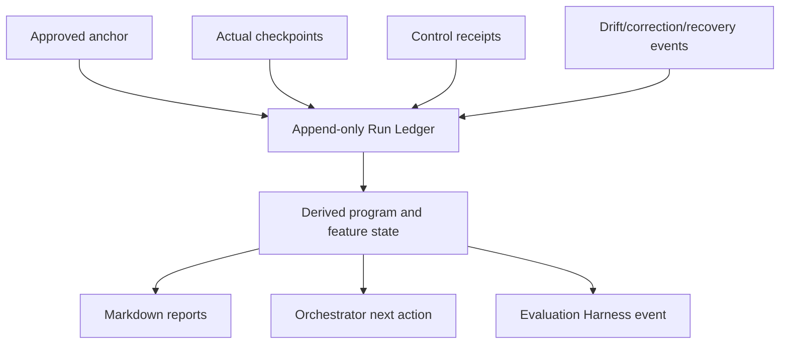

# TailTrail Runtime Foundation

## Status and purpose

**Status:** architecture proposal. This document defines the small runtime core
TailTrail needs before adding more Harness types, advanced MCP tools, broad graph
snapshots, or multi-agent execution.

TailTrail already has a strong conceptual system: Navigator and AIDLC clarify
intent; approved anchors define requirements; Harnesses collect evidence; drift,
recovery, Program Delivery, Token Harness, Evaluation Harness, MCP, and the
future Orchestrator define how work should progress. The primary missing piece is
not another feature. It is a reliable, resumable, inspectable state foundation
that makes these artifacts one coherent system.

Related documents:

- [Harness Engineering](harness-engineering.md)
- [Program Delivery Harness](program-delivery-harness.md)
- [TailTrail MCP Architecture](tailtrail-mcp.md)
- [Evaluation Harness](EVALUATION-HARNESS.md)

## Executive decision

Build a small, local, append-only **Run Ledger** before building a full Delivery
Orchestrator. Markdown remains the review surface, but canonical status comes
from versioned machine events and projections—not several manually mutable files.

```text
Human-readable Markdown = review projection
Canonical machine state = run manifest + append-only events + derived state
```

This is deliberately not a database, cloud service, daemon, workflow engine, or
telemetry platform. Version 1 can be local JSON/JSONL with atomic writes and a
single-writer lock.

## Why this is needed

The design now includes:

```text
approved anchors
requirement matrices and UIDs
actual checkpoints
control receipts
drift records
correction packets
recovery boundaries and plans
feature/program state
completion reports
evaluation events
```

Without one state model, these may disagree. For example, a Markdown checkpoint
could say `REQ-04` is validated while a drift report still marks it failed, or an
Orchestrator may activate a feature that is actually blocked by an unresolved
approval. The ledger makes state derivable and auditable.



## 1. Canonical Run Ledger

### Artifact layout

```text
.tailtrail/runs/<run-id>/
  run-manifest.json
  events.jsonl
  state.json
  locks/
    active-write.lock
  anchors/
    approved-v1.md
    approved-v1.json
  requirements/
    requirement-impact-matrix-v1.json
  checkpoints/
    checkpoint-001.json
  receipts/
    controls/test-001.json
  recovery/
    boundary.json
    plan-001.json
  reports/
    current-status.md
    anchor-completion-report.md
```

| Artifact | Role | Mutability |
| --- | --- | --- |
| `run-manifest.json` | Run identity, root fingerprint, schema versions, creation facts. | Immutable except explicit lifecycle metadata. |
| `events.jsonl` | Ordered source of truth for approvals, checkpoints, control results, drift, decisions, recovery, and closure. | Append-only. |
| `state.json` | Deterministic projection of valid events into current status. | Rebuilt/atomically replaced; never hand-edited. |
| Markdown reports | Human-readable renderings of anchor, current state, and completion. | Regenerated projections; approved documents stay immutable. |

### Core entities

```text
Run -> Program -> Feature -> Cycle -> Requirement UID
                                 -> Control receipt
                                 -> Actual checkpoint
                                 -> Drift event
                                 -> Correction packet
                                 -> Recovery plan
                                 -> Completion state
```

Every event must link to the smallest relevant identity:

```text
run_id
program_id when applicable
feature_id when applicable
cycle_id/checkpoint_id when applicable
requirement_uid or GLOBAL-* / DISC-* identity when applicable
anchor_version and policy fingerprint
```

### Example events

```json
{"event_id":"EVT-001","type":"anchor_approved","run_id":"run-001","anchor_version":"v1","requirements":["tt://run-001/P-01/F-01/v1/REQ-01"],"timestamp":"2026-07-25T10:00:00Z"}
{"event_id":"EVT-002","type":"control_completed","checkpoint_id":"F-01-checkpoint-001","requirement_uids":["tt://run-001/P-01/F-01/v1/REQ-01"],"control_id":"focused-validation-test","result":"pass"}
{"event_id":"EVT-003","type":"drift_detected","checkpoint_id":"F-01-checkpoint-001","requirement_uids":["tt://run-001/P-01/F-01/v1/REQ-04"],"state":"failed","lens":"behavior-and-safety"}
```

`state.json` derives, rather than invents, values such as:

```json
{
  "program_state": "active",
  "active_feature": "F-01",
  "requirement_states": {"REQ-01": "validated", "REQ-04": "failed"},
  "next_allowed_action": "issue_correction_packet"
}
```

## 2. Execution Adapter Contract

TailTrail also needs a host-neutral bridge between an approved work packet and a
coding agent. The agent may be Codex, another MCP host, CLI workflow, or future
adapter, but it must receive bounded authority and return structured facts—not a
self-certified success claim.

### Input packet

```json
{
  "run_id":"run-001",
  "feature_id":"F-01",
  "cycle_id":"F-01-C-02",
  "target_requirements":["REQ-04"],
  "allowed_scope":["src/claims_api/service.py","tests/test_claim_service.py"],
  "must_preserve":["REQ-01","REQ-02","REQ-03","GLOBAL-01"],
  "required_controls":["focused-service-test"],
  "stop_conditions":["new dependency","public API change","protected path"]
}
```

### Agent return packet

```json
{
  "run_id":"run-001",
  "cycle_id":"F-01-C-02",
  "changed_paths":["src/claims_api/service.py"],
  "claimed_requirement_links":["REQ-04"],
  "controls_requested":["focused-service-test"],
  "unknowns":[],
  "implementation_complete":false
}
```

The Harness independently verifies the return against current source, diff,
policy, approved scope, control receipts, and requirement evidence. The adapter
cannot mark a feature complete.

## 3. Concurrency, ownership, pause, and resume

Program delivery becomes unsafe without explicit rules for multiple sessions,
agents, and user edits.

Version 1 rules:

| Situation | Rule |
| --- | --- |
| Write-capable cycle | One active write-capable cycle per repository/worktree. |
| Read-only actions | Multiple planning, inspection, and evaluation actions may run if they do not mutate run state. |
| User edit during active cycle | Re-fingerprint affected path; classify as task-owned, pre-existing, later user work, or ambiguous before continuation. |
| Interrupted run | Keep append-only events; release stale lock only after ownership/fingerprint check; resume from derived state. |
| Competing agent work | Block overlapping feature/cycle paths or require explicit feature partition. |
| Unknown edit overlap | No automated recovery/write; produce assisted plan. |

The lock protects ledger mutation, not the entire repository. Task Recovery
Boundary continues to protect selective rollback at hunk level.

```text
One active write cycle
  + append-only event order
  + path/hunk ownership
  + explicit resume state
= safe enough local orchestration without a distributed workflow engine
```

## 4. Reproducible evidence receipts

An important result should be reproducible enough to explain what environment
produced it. Every significant control receipt records:

- exact control ID and command template;
- working directory and allowed root;
- anchor/checkpoint and policy fingerprint;
- relevant source, manifest, and lockfile fingerprints where practical;
- runtime/tool version when available;
- timeout, exit status, parser status, and sanitized output pointer; and
- evidence labels and linked requirement/global IDs.

Example:

```json
{
  "receipt_id":"test-004",
  "control_id":"focused-service-test",
  "checkpoint_id":"F-01-checkpoint-002",
  "requirement_uids":["tt://run-001/P-01/F-01/v1/REQ-04"],
  "policy_fingerprint":"sha256:...",
  "command":"python3 -m unittest tests.test_claim_service",
  "working_directory":"buildweek-demo-project",
  "exit_status":0,
  "result":"pass",
  "timeout_seconds":60
}
```

This does not require recording raw prompts, full source, secrets, or raw logs.

## 5. Product complexity budget

The runtime must hide architecture complexity in ordinary use. A developer
should generally see only:

```text
Current feature: F-02 API workflow
Status: needs correction
Why: REQ-04 failed; invalid claim still persists
Next safe action: fix service propagation
Proof needed: focused service test
```

Anchors, UIDs, ledgers, graphs, recovery boundaries, and orchestration states are
expandable evidence, not default UI vocabulary. This is a product requirement,
not polish: if normal use feels like operating a workflow engine, TailTrail will
lose its core promise of making coding work clearer and smaller.

## Delivery order

1. Define run manifest, event schema, identity, and atomic local-write rules.
2. Make existing anchors, checkpoints, receipts, and drift reports write events
   and render Markdown projections.
3. Implement the execution adapter contract and independent verification path.
4. Add single-worktree concurrency/pause/resume semantics.
5. Prove Harness V1 on real multi-file tasks.
6. Implement the read-only deterministic Delivery Orchestrator.
7. Add deterministic evaluation fixtures for state transitions and recovery.
8. Only then expand MCP state tools, graph persistence, or multi-agent execution.

## Non-goals

- No database, cloud service, HTTP listener, or background daemon in Version 1.
- No raw prompt/source/log collection, central telemetry, or surveillance.
- No automatic source writes, recovery, commits, pushes, installs, or scans.
- No model-driven state decisions in the first Orchestrator.
- No second parallel source of truth outside the Run Ledger.

## Success criteria

- Every report can be regenerated from canonical event/state artifacts.
- Resume after interruption selects the same safe next action as an uninterrupted run.
- No status can claim completion while linked requirement/global/drift evidence is unresolved.
- An execution adapter cannot self-certify completion.
- Concurrent or user edits fail safely into an ownership/replan decision.
- Important validation results identify their environment and evidence provenance.
- The ordinary user view remains compact while full evidence stays retrievable.
