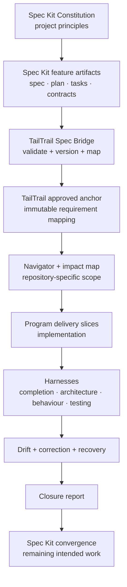
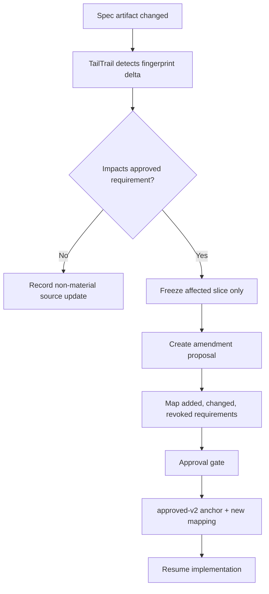

# TailTrail and GitHub Spec Kit: Enterprise Integration Plan

## Purpose

This document defines an optional, enterprise-grade bridge between
[GitHub Spec Kit](https://github.com/github/spec-kit) and TailTrail.

Spec Kit is the upstream system for human-readable product intent: a
constitution, feature specification, clarification, technical plan, task
breakdown, and convergence. TailTrail is the delivery-assurance system:
repository-aware scope, approved anchors, computational evidence, drift
detection, bounded correction, recovery, closure, and learning.

The integration must not create competing requirement documents or make small
TailTrail tasks heavy.



## Spec Kit capabilities used by this bridge

Spec Kit's core sequence is:

```text
constitution -> specify -> clarify -> plan -> tasks -> implement -> converge
```

It provides project principles, feature specifications, prioritized user
stories, acceptance scenarios, functional requirements, measurable success
criteria, technical plans, contracts, and task lists organized by independently
testable stories. See the [Spec Kit repository](https://github.com/github/spec-kit),
the [spec template](https://raw.githubusercontent.com/github/spec-kit/main/templates/spec-template.md),
the [plan template](https://raw.githubusercontent.com/github/spec-kit/main/templates/plan-template.md),
and the [tasks template](https://raw.githubusercontent.com/github/spec-kit/main/templates/tasks-template.md).

## Non-negotiable design rules

### One owner per concern

| Concern | Owner |
| --- | --- |
| Constitution, product intent, stories, acceptance criteria, plan, and task list | Spec Kit |
| Run ID, Planning Lock, approved anchor, scope, evidence, drift, recovery, and closure | TailTrail |
| Source code and tests | The repository |
| Build, CI, deployment, and release truth | CI/CD receipts |

### No duplicate truth documents

TailTrail must never generate a competing `spec.md`, `plan.md`, or `tasks.md`
when a valid selected Spec Kit feature already has those artifacts. TailTrail
imports normalized references and derives execution controls from them.

### Approval freezes a source version

TailTrail approval binds a run to a fingerprinted Spec Kit source revision. A
later edit to `spec.md`, `plan.md`, `tasks.md`, or a contract does not silently
change active delivery intent. It triggers a source amendment assessment.

### No blind Spec Kit process execution

The bridge reads and validates artifacts by default. It does not automatically
run `specify` commands, install its CLI, create GitHub issues, or alter Spec Kit
documents. Such actions are explicit, receipt-backed, and separately approved.

### Stable requirement identity

`FR-001` alone is not globally unique. The canonical external key is:

```text
spec_source_uid + feature_uid + artifact_revision + external_requirement_id
```

Example:

```text
speckit://payments-platform/014-order-amendment@sha256:abc123#FR-002
```

TailTrail maps it to the active-run requirement UID:

```text
TT-RUN-20260814-001 / REQ-03
```

## Example: order-amendment feature

Spec Kit may define:

```text
US-01: Customer changes quantity before fulfilment
US-02: Customer corrects delivery address
US-03: Operations user corrects address after shipment
FR-01: Quantity increases are forbidden after allocation
FR-02: Excess inventory is released when quantity decreases
AC-04: A repeated request does not double-charge or double-refund
```

The bridge converts this into traceable TailTrail delivery evidence:

```text
Spec Kit FR-002
  -> TailTrail REQ-03
  -> inventory.py, service.py, payment orchestration
  -> integration + idempotency + behaviour evidence
  -> drift/correction/closure status
```

# Implementation phases

## SK-0 - Product contract and security boundary - implemented

Define the bridge contract before feature code is written.

### Deliverables

- `tailtrail-spec-kit-integration.md` - this design.
- `schemas/spec-kit-source.schema.json`
- `schemas/spec-kit-import.schema.json`
- `schemas/spec-kit-mapping.schema.json`
- `schemas/spec-kit-amendment.schema.json`
- `schemas/spec-kit-convergence.schema.json`
- `templates/spec-kit-bridge-policy.example.json`
- Versioned Spec Kit CLI/template compatibility matrix.

### Implementation

SK-0 is implemented as a local, dependency-free policy boundary. The five
versioned schemas are committed under `schemas/`, the safe default policy is
`templates/spec-kit-bridge-policy.example.json`, and
`scripts/spec-kit-policy.py` exposes the contract through:

```text
tailtrail spec-kit policy check --root .
tailtrail spec-kit policy init --root .
tailtrail spec-kit policy contracts
```

`check` is read-only and falls back to the committed safe policy when a project
has not opted into a local policy. `init` creates
`.tailtrail/spec-kit-policy.json` only when absent. It refuses unsafe roots,
oversized artifact limits, unsupported extensions, raw artifact/prompt/log
storage, invalid deny patterns, missing source-lock/amendment gates, automatic
Spec Kit execution, and weak snapshot retention. `contracts` verifies the
committed schema set is readable. Import, detection, and execution remain out
of scope until SK-1 and SK-2.

### Required policy decisions

- Supported Spec Kit CLI version range and pinned compatibility policy.
- Supported artifact locations:
  - `.specify/memory/constitution.md`
  - `specs/<feature>/spec.md`
  - `specs/<feature>/plan.md`
  - `specs/<feature>/tasks.md`
  - `specs/<feature>/research.md`
  - `specs/<feature>/contracts/`
- Maximum artifact sizes and allowed file types.
- Sanitization rules: no raw prompts, secrets, credentials, production logs,
  customer data, or private URLs in TailTrail state.
- Requirement namespace, amendment, conflict, retention, and recovery rules.

### Acceptance criteria

- Imported paths remain inside the selected workspace.
- Every referenced source file has a SHA-256 fingerprint.
- Malformed, oversized, untrusted, or path-escaping inputs are rejected.
- TailTrail stores normalized references rather than unrestricted raw copies.

## SK-1 - Read-only workspace detection and compatibility - implemented

Add discovery without changing user files.

### Public command surface

```text
tailtrail spec-kit detect --root .
tailtrail spec-kit status --root .
tailtrail spec-kit inspect --root . --feature 014-order-amendment
```

### Behavior

Navigator discovers `.specify/`, a constitution, feature folders, available
`spec.md`/`plan.md`/`tasks.md`/contracts, known integration metadata, artifact
freshness, fingerprints, and missing prerequisites.

Example:

```text
Spec Kit: detected
Feature: 014-order-amendment
Artifacts:
  constitution.md  present
  spec.md          present
  plan.md          present
  tasks.md         present
  contracts/       present
Readiness: importable
```

### Implementation

`scripts/spec-kit-detect.py` implements the three commands through the public
`tailtrail spec-kit` route. It reads only the selected workspace and returns a
versioned JSON receipt; it never creates `.tailtrail/`, runs `specify`, creates
a Planning Lock, or stores imported content. Detection is deliberately limited
to the SK-0 policy roots and known artifact names. It reports relative paths,
artifact kinds, byte counts, SHA-256 fingerprints, a deterministic aggregate
source revision, feature readiness, and explicit issues—never source text.

```text
tailtrail spec-kit detect --root .
tailtrail spec-kit status --root .
tailtrail spec-kit inspect --root . --feature 014-order-amendment
```

States are `not-detected` for an ordinary repository, `compatible` when a
read-only artifact-only source can be selected later, and `incompatible` when
an explicit selected feature is absent or the policy detects a path, extension,
or size boundary violation. `inspect` restricts its receipt to the named
feature. Importing or persisting this receipt remains SK-2 work.

### Acceptance criteria

- The commands are read-only.
- They do not run `specify`, create a TailTrail run, or write a lock.
- Spec Kit absence returns `not-detected`, not a failure.

## SK-2 - Canonical import and versioned source snapshots - implemented

Create an explicit source import operation:

```text
tailtrail spec-kit import --root . --feature 014-order-amendment --mode review
```

### Stored artifacts

```text
.tailtrail/spec-kit/
└── sources/
    └── 014-order-amendment/
        ├── source-v1.json
        ├── import-v1.json
        ├── requirements-v1.json
        ├── stories-v1.json
        ├── tasks-v1.json
        ├── contracts-v1.json
        └── fingerprints-v1.json
```

### Implementation

`scripts/spec-kit-import.py` imports only an explicitly named, SK-1-compatible
feature. It first reruns the policy-bound detector, then creates seven atomic
JSON artifacts under `.tailtrail/spec-kit/sources/<feature>/`: source, import,
requirements, stories, tasks, contracts, and fingerprints. These are normalized
references and hashes, never raw Markdown, prompts, logs, or copied contracts.

The importer preserves external requirement IDs, requires identifiable
requirements or user stories plus acceptance criteria, rejects duplicate IDs,
unknown story references, broken contract references, privacy-pattern matches,
and retention overflow before creating a snapshot. The aggregate source hash is
the idempotency key: the same source returns `already-imported`; a changed source
creates `v2`, `v3`, and so on without rewriting prior evidence. Spec Kit remains
the authoritative source owner.

### Import contract example

```json
{
  "type": "tailtrail-spec-kit-import",
  "source_uid": "speckit://payments-platform/014-order-amendment",
  "source_revision": "sha256:8fa1...",
  "constitution_revision": "sha256:02bc...",
  "requirements": [
    {
      "external_id": "FR-002",
      "statement": "The system must release only excess reservation after a quantity decrease.",
      "source_path": "specs/014-order-amendment/spec.md",
      "source_locator": "FR-002"
    }
  ],
  "boundary": "Imported content is normalized and traceable; Spec Kit remains the source owner."
}
```

### Acceptance criteria

- Identical imports are idempotent.
- Changed source creates a new version, never overwrites prior evidence.
- External IDs are preserved exactly.
- The importer detects duplicate requirement IDs, missing acceptance criteria,
  unknown story references, and inconsistent contract links.

## SK-3 - Navigator and requirement-gathering integration - implemented

### Trigger rules

| User request | Navigator behavior |
| --- | --- |
| Normal small bug | Do not use Spec Kit |
| “Use existing Spec Kit feature 014...” | Detect and import the named feature |
| Large hands-free work in a Spec Kit repository | Recommend Spec Kit-first planning |
| “Use Spec Kit and TailTrail” | Require source selection before planning |
| Imported feature changed | Require amendment review |

### Navigator report additions

```text
Selected source: Spec Kit feature 014-order-amendment
Source revision: sha256:8fa1...
Imported requirements: 12
Imported stories: 3
Imported tasks: 28

TailTrail controls:
- Navigator impact map
- Requirement Completion Harness
- Architecture Fitness Harness
- Behaviour Harness
- Evidence-Aware Testing
- Program Delivery Harness
```

### Mapping format

```text
Spec Kit FR-002
  -> TailTrail REQ-03
  -> likely code: inventory.py, service.py
  -> preserve: cancellation stock-release behavior
  -> proof: integration + idempotency scenario
```

### Implementation

`scripts/spec-kit-bridge.py` reads only the latest imported snapshot and compares
its fingerprint to the current SK-1 discovery receipt. A user must select a
feature with `--spec-kit-feature <feature>` or the exact phrase `Spec Kit feature
<feature>` in a Start goal; a vague “Use Spec Kit and TailTrail” request is
rejected before a Planning Lock, rather than guessing or auto-importing source.

When the source is current, Navigator replaces its generated requirement matrix
with the imported external IDs and statements. Each TailTrail anchor row retains
the external ID, source UID, source revision, path, and locator while TailTrail
adds likely code paths and proof contracts. Standard AIDLC does not run a
parallel requirement questionnaire for this path. If the selected source changes
before activation, the Planning Lock refuses execution and requires a new SK-2
import plus the later amendment-review flow.

### AIDLC interaction

- Lite ignores Spec Kit unless the user explicitly requests it.
- Standard treats imported artifacts as strong input and asks only unresolved
  questions.
- Full Official AIDLC imports sanitized decisions into the official
  requirements stage; it never bypasses official stage approval.

### Acceptance criteria

- Navigator does not create a competing requirement list for a valid source.
- It asks questions only for genuine gaps, contradictions, or material choices.
- Every approved TailTrail requirement retains its Spec Kit reference.

## SK-4 - Approved anchor and task-slice bridge - implemented

TailTrail approval writes an immutable mapping between source revision,
Spec Kit requirement/story/task IDs, TailTrail requirement IDs, code/test
scope, proof plan, and delivery phase.

```text
.tailtrail/runs/<run-id>/
├── spec-kit/
│   ├── source-lock-v1.json
│   ├── requirement-mapping-v1.json
│   ├── task-slice-mapping-v1.json
│   └── amendment-state-v1.json
└── anchors/
    └── approved-v1.json
```

| Spec Kit unit | TailTrail use |
| --- | --- |
| Setup/foundation tasks | dependency gate and first active slice |
| User Story P1 | first delivery slice |
| P2/P3 stories | later slices |
| Contract tasks | Architecture Fitness required proof |
| Integration tasks | Evidence-Aware Testing minimum tier |
| Independent tests | Behaviour Harness scenarios |
| Parallel marker `[P]` | advisory graph execution opportunity |

### Implementation

On Planning Lock activation for an SK-3-bound run, `scripts/spec-kit-slices.py`
automatically creates the four immutable run artifacts shown above. The source
lock binds the imported feature/snapshot/revision to the approved anchor; the
requirement mapping proves that every imported external ID maps exactly once to
an approved TailTrail requirement UID; the slice map activates only `slice-1`;
and amendment state records that no source amendment is accepted silently.

`tailtrail spec-kit slices assert-active` is a deterministic execution guard:
it rejects a requirement outside the active slice. `slices advance --approved`
marks the active slice complete and opens the next one, never activating future
requirements at once. Imported tasks without an explicit requirement mapping
remain unassigned and non-executable rather than being guessed into scope.

### Acceptance criteria

- Only the approved active slice may execute.
- Future tasks cannot silently run.
- Completed stories are not repeatedly checked unless a later change affects a
  declared preservation boundary.

## SK-5 - Harness and evidence integration - implemented

### Requirement Completion Harness

```text
FR-002 -> REQ-03 -> changed symbols -> evidence -> status
```

### Architecture Fitness Harness

Reads the Spec Kit plan, contracts, data model, and stated constraints. It
detects missed callers, wrong-layer changes, unexpected files, contract
mismatch, and missing migration/compatibility work.

### Behaviour Harness

Converts acceptance scenarios into declarative journeys:

```text
Given allocated order quantity is 5
When customer changes quantity to 3
Then release exactly 2 reserved units
And issue at most one payment adjustment
And preserve an immutable audit record
```

### Evidence-Aware Testing matrix

| Imported intent | Minimum evidence |
| --- | --- |
| Functional requirement | Focused test |
| API contract | Contract test |
| User journey | Behaviour or integration test |
| Data model or migration | Compatibility proof |
| Rollout requirement | Release/rollback receipt |
| Security constraint | Relevant static/security evidence |

### Acceptance criteria

- Coverage is reported per external requirement ID.
- A generic passing test suite cannot complete an unmapped requirement.
- Missing required evidence blocks closure.

### Implementation

`scripts/spec-kit-evidence.py` creates an immutable requirement-linked evidence
plan immediately after SK-4 activation. It selects Requirement Completion and
Evidence-Aware Testing for every imported requirement, adds Architecture Fitness
when imported contracts exist, and adds Behaviour Harness only where an imported
user-story requirement is present. The active slice is the only slice allowed to
record completion.

`tailtrail spec-kit evidence record` consumes an existing Harness checkpoint and
optional completed Architecture/Behaviour assessment artifacts. It records
`complete`, `incomplete`, or `deferred` per external requirement ID. A generic
passing checkpoint cannot complete a contract requirement without the required
Architecture Fitness receipt; the bridge never runs tests, fabricates a journey,
or infers missing proof.

## SK-6 - Amendment, drift, correction, and recovery - implemented

### Source change detection

Before an implementation slice and at closure, compare current artifact hashes
with `source-lock-v1.json`.



### Revocation example

```json
{
  "external_requirement": "FR-002",
  "tailtrail_requirement_uid": "REQ-03",
  "status": "revoked",
  "revoked_by_source_revision": "sha256:new...",
  "replacement": "FR-014",
  "preserve_evidence": [
    "checkpoint-02.json",
    "inventory-integration-receipt.json"
  ]
}
```

### Recovery rules

- Preserve unrelated valid uncommitted work.
- Prefer Git checkpoint recovery.
- Apply task-owned hunk/symbol reconciliation only as fallback.
- Never silently revert source code because a Spec Kit document changed.

### Implementation

`tailtrail spec-kit amendment check` compares the immutable run source lock with
the current detected source. A changed source must first be explicitly imported;
then `propose` writes a versioned amendment that classifies requirement IDs as
`added`, `changed`, `revoked`, or `unchanged`. Material changes require
`approve --approved`.

Approval preserves `approved-v1.json`, prior evidence, and unrelated repository
work. It writes `approved-v2.json`, `source-lock-v2.json`, a fresh mapping and
slice state, a new requirement-linked evidence plan, and one bounded correction
packet. Unchanged completed slices remain completed; changed and added work is
reopened one slice at a time. `recovery` creates a plan only: it prefers an
existing TailTrail Git requirement checkpoint, otherwise requires task-owned
hunk/symbol reconciliation. It never runs Git or reverts source automatically.

```text
tailtrail spec-kit amendment check --root . --run-id <run-id>
tailtrail spec-kit import --root . --feature <feature> --mode planning
tailtrail spec-kit amendment propose --root . --run-id <run-id>
tailtrail spec-kit amendment approve --root . --run-id <run-id> --approved
tailtrail spec-kit amendment recovery --root . --run-id <run-id>
```

### Acceptance criteria

- Material source changes block affected work until approved.
- Historical source versions and evidence remain queryable.
- No requirement ID collision occurs across feature, version, or run.

## SK-7 - Spec Kit convergence at closure - implemented

Implement an evidence-aware convergence command:

```text
tailtrail spec-kit converge --root . --run-id <run-id>
```

It compares approved/current source revisions, imported requirements/stories/
tasks, TailTrail closure states, changed symbols, validation receipts,
unresolved drift, and deferred work.

Example:

```text
Feature: 014-order-amendment
Source revision: locked and current

Requirements: 12 / 12 complete
Stories:
  US-01 P1  complete
  US-02 P2  complete
  US-03 P3  deferred by approved scope

Tasks:
  24 complete
  3 deferred
  1 superseded

Architecture: pass
Behaviour: pass
Contract: pass
Drift: none unresolved
Closure: ready for acceptance
```

### Acceptance criteria

- Convergence proposes follow-up tasks but never changes Spec Kit artifacts.
- It distinguishes complete, deferred-by-approval, superseded, incomplete,
  source-amended, and needs-decision states.

### Implementation

`tailtrail spec-kit converge` writes a versioned TailTrail-only convergence
artifact. It reads the active source lock/mapping/slices, the latest
requirement-linked evidence record, imported stories/tasks, amendment drift,
and any saved checkpoint metadata. It reports `ready` only when the source is
locked and all mapped requirements have complete or explicitly deferred proof;
otherwise it returns `gaps` or `blocked` with narrow follow-up tasks. It never
updates a Spec Kit artifact, runs tests, or treats a missing receipt as proof.

## SK-8 - MCP, host adapters, and CI integration - implemented

### MCP tools

Read-only:

```text
spec_kit_detect
spec_kit_status
spec_kit_inspect
spec_kit_mapping_show
spec_kit_convergence_show
```

Controlled writes:

```text
spec_kit_import
spec_kit_amendment_propose
spec_kit_anchor_approve
spec_kit_convergence_record
```

### Host adapters

- Codex skill: `$tailtrail-spec-import`
- Copilot prompt: `/tailtrail-spec-import`
- Claude command: `/tailtrail-spec-import`

Each host calls the same local CLI and receives the same structured report.

### CI policy

```text
tailtrail spec-kit validate --root .
tailtrail spec-kit drift --run-id <run-id>
tailtrail spec-kit converge --run-id <run-id> --format json
```

Configurable merge blocks apply only when an approved requirement lacks
required proof, contract/architecture evidence is incomplete, source changed
materially after approval, or closure claims success with unresolved drift.

### Implementation

The local MCP server now exposes read-only Spec Kit detection, active
mapping/slice inspection, and saved convergence inspection. Its controlled
operations require `approved: true` and are limited to normalized imports,
amendment proposal/approval, convergence recording, and supplied CI receipt
ingestion. Every controlled operation writes TailTrail-local state only.

Existing Codex, Copilot, and Claude adapters continue to share the same CLI and
MCP contract. CI is supplied as a local JSON receipt through the existing
requirement-linked CI ingestion surface; convergence includes those receipts but
does not mistake receipt presence for missing Harness proof or make a network
request.

## SK-9 - Evaluation, observability, governance, and release - implemented

### Paired evaluation scenarios

| Scenario | Baseline failure | Bridge outcome |
| --- | --- | --- |
| Missed API caller | Unit test passes, caller missed | Contract map catches gap |
| Requirement omitted | Story never implemented | Closure reports incomplete |
| Spec amended mid-run | Old behaviour delivered | Amendment gate stops unsafe closure |
| Unrelated work exists | Broad rollback risks valid work | Recovery preserves it |
| False test confidence | Acceptance journey missing | Behaviour proof blocks closure |

### Metrics

- Requirement completion rate.
- Spec-to-evidence coverage.
- Missed caller and contract rate.
- Scope drift rate.
- Amendment frequency.
- Correction cycles per requirement.
- False intervention rate.
- Developer review time.
- Approval burden.
- Actual token telemetry only when a host/provider exposes it.

### Enterprise governance

- Pinned Spec Kit version compatibility matrix.
- Signed/hashed source-lock artifacts.
- Role-based permissions for import, amendment, and approval.
- Retention policy and sanitized audit logs.
- No raw prompt/source/log export by default.
- CI provenance links and policy-as-code controls.
- Recovery audit records.
- Quarterly compatibility and fixture refresh.

### Implementation

`tailtrail spec-kit observe` creates a versioned local observability artifact.
It composes the saved convergence result, requirement-linked CI receipts,
calibrated evidence completeness, amendment/correction/approval counts, source
lock integrity checks, and an advisory release-confidence assessment. The same
artifact powers `release`, `governance`, and `evaluate`; `evaluate` may compare
only against a supplied saved baseline JSON. It never calls models, CI, or a
deployment system, and it never turns a local report into release authorization.

```text
tailtrail spec-kit observe --root . --run-id <run-id>
tailtrail spec-kit release --root . --run-id <run-id>
tailtrail spec-kit governance --root . --run-id <run-id>
tailtrail spec-kit evaluate --root . --run-id <run-id> --baseline baseline.json
tailtrail spec-kit ci-gate --root . --run-id <run-id> --format json
```

The committed `spec-kit-closure` Evaluation Harness scenario compares a weak
saved delivery artifact against requirement mapping, evidence, amendment,
recovery, convergence, and advisory-release evidence. The optional
`.github/workflows/spec-kit-closure.yml` workflow is reusable (`workflow_call`)
or manually dispatched. It accepts a saved run ID and uses the deterministic
gate exit code. The calling workflow must first persist or restore that run's
sanitized `.tailtrail/runs/<run-id>/` state and linked CI receipt into its
workspace; the gate intentionally fails closed when those inputs are absent.
It is not triggered automatically by pull requests because artifact retention
and receipt provenance are an enterprise CI policy decision.

## Delivery order

| Phase | Status | Outcome | Blocking exit condition |
| --- | --- | --- | --- |
| SK-0 | Implemented | Contracts and governance | Policy, contracts, registry, and security fixtures pass |
| SK-1 | Implemented | Read-only detection | Safe detection and no-write fixtures pass |
| SK-2 | Implemented | Versioned import | Source fingerprint, privacy, and ID-validation fixtures pass |
| SK-3 | Implemented | Navigator integration | Imported-boundary, anchor-provenance, and stale-source fixtures pass |
| SK-4 | Implemented | Anchor/task mapping | Source-lock, mapping, slice-guard, and advance fixtures pass |
| SK-5 | Implemented | Harness evidence | Requirement-linked plan and missing-proof fixtures pass |
| SK-6 | Implemented | Amendment/recovery | Material-change, versioned-anchor, slice, correction, and recovery-plan fixtures pass |
| SK-7 | Implemented | Closure convergence | Complete, deferred, superseded, gaps, and source-drift fixtures pass |
| SK-8 | Implemented | MCP/host/CI | MCP safety, host conformance, and CI receipt fixtures pass |
| SK-9 | Implemented | Evaluation/release | Saved-artifact evaluation, governance, and advisory-release fixtures pass |

## Definition of done

The bridge is complete only when:

1. A Spec Kit feature imports without duplicating its source artifacts.
2. Every external requirement maps to a TailTrail requirement UID.
3. Every approved requirement maps to code scope and proof.
4. Source amendments create versioned approval decisions.
5. Architecture, behaviour, testing, drift, recovery, and closure consume the
   mapping.
6. CI independently validates coverage and unresolved gaps.
7. Codex, Copilot, and Claude use one CLI/MCP contract.
8. Paired evaluation shows fewer missed requirements/callers than baseline.
9. No runtime, token, or quality claim is made without supporting evidence.

## Deliberate non-goals

- Spec Kit is not bundled, installed, upgraded, or invoked automatically.
- TailTrail does not overwrite Spec Kit artifacts.
- TailTrail does not create GitHub issues unless explicitly directed.
- Small focused fixes do not activate this integration by default.

The core proposition is simple: **Spec Kit owns intent; TailTrail proves
delivery.**
