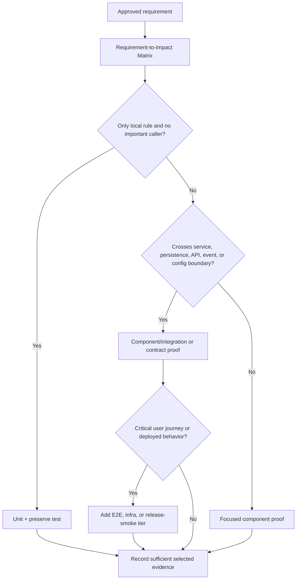
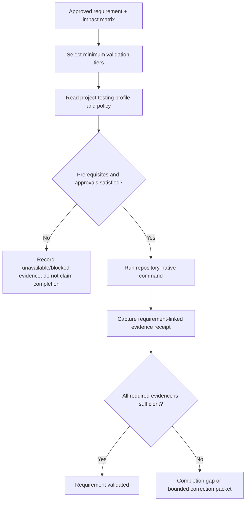

# TailTrail Testing Confidence: Current State And Improvement Plan

## Document status

> **Implementation update:** Evidence-Aware Testing V2-V5 is now available.
> TailTrail selects declared minimum tiers, ingests saved CI evidence, tracks
> flaky history without hiding failures, and reports calibrated receipt metrics.
> Higher-tier execution and release confidence retain explicit approval and
> remote guards.

> **Phase 8.2-8.8 update:** TailTrail accepts requirement-linked
> Playwright/Cypress/WebDriver journey reports, parses supplied contract
> artifacts, runs only approved repository-owned local lifecycle commands,
> creates deployment/migration/rollback plans, records local policy sign-off,
> and labels real-run calibration metrics as measured only when supplied input
> explicitly identifies them as measured.

**Status:** design and prioritization document. It distinguishes what TailTrail
can do today from proposed work. It does not claim that the testing runtime,
environment adapters, validation contracts, or release gates described below
already exist.

This document answers one question:

> What evidence is sufficient to say an AI-assisted implementation is ready to
> deliver, rather than merely saying that one test passed?

The companion document [Harness Engineering](harness-engineering.md) describes
the approved intent, drift, correction, and recovery loop. This document defines
the testing evidence that loop should select, run, and interpret.

## Executive assessment

TailTrail currently has a useful **focused-validation toolchain**, but it does
not yet have a full integration, end-to-end, or infrastructure behavioural
testing system.

**Current deliverable-confidence rating: 4.5 / 10.**

This is not a criticism of focused unit tests. They are the right fast first
check for many changes. The gap is that a passing local test rarely proves the
complete requirement across callers, persistence, contracts, asynchronous
workflows, configuration, or a deployed environment.

```text
Current question:
Did the changed rule pass its focused test?

Target question:
Did each approved requirement work through the relevant real path,
in the environment and dependencies that make the deliverable meaningful?
```

## Core principles

1. **Green tests are evidence, not a completion claim by themselves.** A test
   can be narrow, stale, weakened, or disconnected from the production path.
2. **Select the smallest adequate validation tier.** Do not run browser E2E for
   a pure formatter change; do not accept unit-only proof for a changed
   multi-service business workflow without an explicit reason.
3. **Use the target repository's native test system.** TailTrail should select,
   explain, and record project-defined commands instead of replacing Docker,
   Playwright, pytest, Gradle, Terraform, or cloud tooling with a generic
   framework.
4. **Requirements own proof.** Every approved requirement needs a stated proof
   obligation, evidence tier, and result. “The suite passed” is not enough.
5. **Environment is part of the result.** An integration test against a test
   database, a mocked dependency, and a deployed staging system prove different
   things and must not be labeled as equivalent.
6. **Keep destructive and remote actions approval-gated.** Tests may create
   data, start containers, use credentials, provision infrastructure, or send
   traffic. TailTrail must not hide these actions behind generic validation.

## Current capability inventory

The following are implemented today and are useful building blocks.

| Capability | Current behavior | Evidence value | Limitation |
| --- | --- | --- | --- |
| Navigator | Selects relevant features and suggests focused validation for a task. | Establishes likely scope and next command. | It does not prove runtime behavior. |
| Test Precision Planner | Proposes regression, happy-path, negative-path, boundary, safeguard, and configuration-load cases. | Makes focused unit/regression testing more complete. | It plans tests; it does not operate an integration environment. |
| Code Graph | Maps local symbols, likely callers, imports, and likely tests. | Finds likely missing caller/test paths. | Static/local evidence; it does not execute the path. |
| `quality-run` | Runs one explicitly approved, allowlisted local test/build/lint/type command and records result. | Preserves truth about the exact command and exit code. | It does not decide whether that command is sufficient proof. |
| Review and Guardrails | Review changed scope for missing safeguards, unnecessary complexity, risky test changes, and scope drift. | Helps catch test-chasing and missing requirement coverage. | Review is not runtime evidence. |
| CI/Sonar summaries | Normalize supplied CI, test, and scanner output. | Makes existing external evidence readable. | They do not run or poll CI/scanners. |
| Evaluation Harness | Compares saved TailTrail workflow artifacts and normalizes compact evidence events. | Evaluates whether TailTrail guidance helps. | It does not run the target application's tests, infrastructure, or E2E flow. |

### Current Test Precision coverage

The current planner can propose the following test cases:

| Case | Current purpose |
| --- | --- |
| Regression | Capture the exact broken/requested behavior so it would fail before the fix. |
| Happy path | Confirm valid input still works. |
| Negative path | Confirm invalid input, dependency failure, or rejected state behaves safely. |
| Boundary path | Cover the most relevant empty/null/min/max/duplicate/edge value. |
| Guard preservation | Added for detected security, validation, data-integrity, or API-contract risks. |
| Configuration load | Added for configuration/IaC/manifest changes; recommends a repository-native parse, validate, plan, or lint command. |

This is a good starting point. It is primarily **unit/component test planning**
with static impact awareness, not a full validation orchestration layer.

## Current confidence ratings

| Area | Rating | Reason |
| --- | ---: | --- |
| Focused unit and regression planning | 7/10 | Clear focused case matrix and command recommendations. |
| Validation truth | 7/10 | TailTrail does not claim a command passed unless the command was actually run. |
| Static impact/caller awareness | 6/10 | Local Code Graph and review identify likely callers and tests. |
| Test integrity / anti-test-chasing | 6/10 | Requirement/preserve rules and review can flag weak proof, but no executable completion gate exists yet. |
| Requirement-to-test traceability | 5/10 | Strong Harness Engineering design; not yet an implemented runtime contract. |
| Integration testing | 2/10 | TailTrail can run a repository-provided integration command, but does not model prerequisites or integration evidence. |
| E2E/user-journey validation | 1/10 | No first-class browser, API-journey, or workflow runner. |
| Infrastructure behavioural validation | 1/10 | No environment lifecycle, migration, queue, container, or deployment validation harness. |
| Release confidence | 3/10 | CI artifacts can be summarized; there is no unified requirement-aware release proof gate. |

## Validation tiers

TailTrail should use explicit tiers. A higher tier does not replace a lower tier;
each answers a different question.

| Tier | What it proves | Typical examples | Does not prove |
| --- | --- | --- | --- |
| `unit` | A function/rule makes the correct local decision. | Zero amount raises `ClaimValidationError`. | Service wiring, database behavior, API contract. |
| `component` | A module works with its direct collaborators. | Service calls shared validator and maps its error. | Real database/network/browser behavior. |
| `integration` | Real local boundaries work together. | Service + repository + test database; consumer + queue emulator. | Complete user journey or deployed runtime. |
| `contract` | API/event/schema compatibility remains valid. | HTTP error shape; message schema; consumer/provider contract. | Internal implementation quality or production availability. |
| `e2e` | A critical user/business journey completes. | Sign in -> submit claim -> see rejection/success. | Every edge case or deployment reliability. |
| `infra` | Configuration/environment behavior is structurally and operationally valid. | Migration against disposable DB; container health; Terraform plan; manifest render. | Safe production rollout unless a deployment-specific check runs. |
| `release-smoke` | A deployed environment can perform a critical safe operation. | Health endpoint, authenticated smoke journey, version/config check. | Broad load, resilience, or security certification. |

### Tier selection rule

Navigator should select the lowest tier that can prove the requirement's real
path, then add only the tiers required by the risk and impact map.



## Proposed Validation Contract

The first implementation should introduce a small, repository-local contract.
This is the bridge between an approved requirement and its required test proof.

```yaml
# .tailtrail/testing.yml -- proposed, not implemented
version: 1

tiers:
  unit:
    command: "pytest tests/unit"
    approval_required: false

  integration:
    command: "docker compose --profile test run --rm app-tests"
    prerequisites: ["docker", "test database"]
    approval_required: true

  e2e:
    command: "npm run test:e2e"
    prerequisites: ["local application", "test user"]
    approval_required: true

  infra:
    command: "terraform validate"
    approval_required: true
```

Each anchor requirement would name the minimum evidence needed:

```yaml
requirement_uid: claims-v1/REQ-02
statement: "A positive claim remains submittable through the service path."
kind: preserve

required_evidence:
  - tier: unit
    target: "tests/test_claim_validation.py::test_positive_claim_is_valid"
    proves: "The shared validator still accepts a positive amount."

  - tier: component
    target: "tests/test_claim_service.py::test_submit_claim_uses_validator"
    proves: "The service reaches the shared validation path."

  - tier: integration
    required_when: "service persistence or request mapping changed"
    target: "tests/integration/test_claim_submission.py"
    proves: "A valid claim follows the production submission path and persists."

preserve:
  - "customer identifier remains attached to the submitted claim"
```

The contract must support `required`, `conditional`, `not-applicable`, and
`unavailable` states. It must not pretend that an E2E test exists in a project
that does not have one.

## Validation Evidence Receipt

Every executed check should produce a compact, requirement-linked receipt.

```json
{
  "requirement_uid": "claims-v1/REQ-02",
  "tier": "integration",
  "command": "pytest tests/integration/test_claim_submission.py",
  "status": "passed",
  "environment": {
    "kind": "local-test-database",
    "dependencies": ["postgres-test-container"],
    "external_network": false
  },
  "asserted_behavior": "A positive claim reaches the service path and persists.",
  "artifacts": [".tailtrail/quality-runs/quality-run-20260727.log"],
  "evidence_label": "measured/validated"
}
```

This receipt answers four questions that a raw test exit code cannot:

1. Which requirement did this prove?
2. What production behaviour did it observe?
3. Which environment and dependencies participated?
4. What exactly ran and where is the result artifact?

## Example scenarios

### Scenario A: a simple validation bug

**Change:** reject zero claim amount while preserving valid positive claims.

| Requirement | Minimum evidence | Why |
| --- | --- | --- |
| Reject zero amount | Unit regression + negative case | The rule lives in shared validation. |
| Preserve positive amount | Unit happy path | Existing accepted behavior must remain true. |
| Service uses validation | Component/service-path test | A correct validator is insufficient if submission bypasses it. |

An E2E test is not automatically required if the API/controller path did not
change and the existing service-path test provides adequate proof.

### Scenario B: API plus database behaviour

**Change:** add a new claim status and persist it when an API request is made.

| Tier | Required proof |
| --- | --- |
| Unit | Status transition rules reject invalid transitions. |
| Component | Service maps request to domain state correctly. |
| Integration | Real repository/test DB persists and reloads the status. |
| Contract | API response and error format match the public contract. |
| E2E | Required only if the user-facing journey or client interaction changed. |

A unit test that constructs an in-memory object can pass while the database
mapping, migration, transaction, or serialization is wrong. The integration
receipt is what raises delivery confidence here.

### Scenario C: asynchronous event workflow

**Change:** successful claim submission emits an event consumed by a notification
worker.

| Tier | Required proof |
| --- | --- |
| Unit | Event payload builder contains the expected fields. |
| Integration | Submission writes/outboxes the event and a test broker/consumer receives it. |
| Contract | Event schema is compatible with the consumer version. |
| E2E | Optional critical journey: submit claim -> notification visible. |

The harness should record whether the broker is a real local container, an
approved emulator, or a mock. A mock consumer cannot be labeled as proof of a
real broker configuration.

### Scenario D: infrastructure/configuration change

**Change:** update a service environment variable and container health check.

| Tier | Required proof |
| --- | --- |
| Configuration | Parse/render/lint the changed configuration. |
| Infra | Build/start disposable local environment; confirm health check and required configuration load. |
| Integration | Run one application path against that environment if the configuration affects runtime behavior. |
| Release-smoke | Only after an explicitly approved deployment. |

`terraform validate` proves syntax and internal consistency. It does not prove
that cloud permissions, a deployed endpoint, or a migration behaves correctly.
The receipt must name this limit.

### Scenario E: critical browser journey

**Change:** a user can submit a claim through the UI and sees the correct
validation error.

| Tier | Required proof |
| --- | --- |
| Unit/component | Client validation and API error mapping. |
| Contract | API error shape remains compatible with the client. |
| E2E | Browser submits the form, receives the error, and renders the expected message. |
| Accessibility check | Required if the changed UI affects an interactive/error state and the project has an approved accessibility command. |

The E2E result is valuable because UI state, routing, auth, request mapping,
and error display can all be wrong while unit tests remain green.

## Proposed execution model

TailTrail should not build one universal test runner. It should provide a small
orchestrator around repository-defined commands and environments.



### Selection, not indiscriminate execution

The system should run tiers in increasing cost only when needed:

1. Fast focused unit/component checks first.
2. Integration/contract checks when impact crosses a boundary.
3. E2E only for an affected critical journey or explicit requirement.
4. Infra/release-smoke only with the required environment and explicit approval.

This is how TailTrail improves confidence without making every edit slow or
expensive.

## Implementation plan

### Phase T1: requirement-linked validation contracts

Goal: make validation obligations visible before implementation.

- Add a proposed `.tailtrail/testing.yml` schema and template.
- Extend the Requirement-to-Impact Matrix with `required_evidence` tiers.
- Extend Test Precision output from “likely test command” to “recommended tier,
  reason, and proof statement.”
- Add evidence states: `planned`, `passed`, `failed`, `unavailable`,
  `not-applicable`, and `insufficient`.
- Do not execute new commands automatically.

**Acceptance:** a multi-file requirement can state why unit-only validation is
adequate or why an integration/contract tier is mandatory.

### Phase T2: evidence receipts and completion gate

Goal: turn exact commands into requirement-level proof records.

- Add a normalized Validation Evidence Receipt schema.
- Let `quality-run` emit/import a receipt with command, exit status, artifact,
  tier, requirement UID, and environment label.
- Add a deterministic completion check: every `required` evidence item must
  pass or be explicitly approved as unavailable/not applicable.
- Ensure changed tests have a requirement link and an asserted production
  behavior statement.

**Acceptance:** TailTrail can explain why a requirement is validated,
implemented-not-validated, or blocked without relying on a vague green suite.

### Phase T3: project-native integration adapters

Goal: support existing local integration environments without inventing one.

- Read project-supplied commands for test databases, Docker Compose, localstack,
  message brokers, emulators, or service fixtures.
- Check declared prerequisites before execution.
- Make container/process/network actions explicit approval paths.
- Capture environment identity and cleanup result in the receipt.
- Start with adapters that invoke existing project commands; do not manage cloud
  accounts or production-like environments directly.

**Acceptance:** a repository with a documented integration command can produce
a truthful integration receipt tied to a requirement.

### Phase T4: contract and E2E integration

Goal: prove externally observable behavior where the repository already has
contract or journey tooling.

- Add adapters for repository-owned API/event contract commands.
- Add browser E2E command profiles for existing Playwright/Cypress/Webdriver
  projects; do not introduce a browser framework automatically.
- Require explicit journey/requirement mapping so an E2E run has a stated
  purpose.
- Capture safe test-account/environment labels; never store credentials in the
  receipt.

**Acceptance:** TailTrail can state that a specific user journey or contract was
tested, with the project-native command and environment noted.

### Phase T5: infrastructure and release-smoke evidence

Goal: distinguish static infrastructure validity from runtime confidence.

- Support repository-provided `validate`, `plan`, manifest-render, migration,
  container-health, and smoke-test commands.
- Separate local disposable-environment evidence from deployed-environment
  evidence.
- Require explicit deployment/remote approval before any live smoke test.
- Add rollback/version/config references to release handoff material.

**Acceptance:** TailTrail never describes `terraform validate` or a passing
container build as a successful deployment or production behavioural proof.

## Suggested implementation artifacts

| Artifact | Purpose |
| --- | --- |
| `schemas/testing-profile.schema.json` | Validate project-defined tier commands, prerequisites, approvals, and environment labels. |
| `schemas/validation-evidence-receipt.schema.json` | Validate requirement-linked execution evidence. |
| `templates/testing-profile.example.yml` | Give projects a small native-command configuration starting point. |
| `scripts/testing-profile.py` | Discover and validate the profile; list applicable tiers without running them. |
| `scripts/validation-receipt.py` | Normalize command/environment results into evidence receipts. |
| `scripts/requirement-completion.py` | Compare required evidence from the anchor with receipts and emit gaps. |
| `scripts/quality-run.py` | Reuse as an approved local command executor; extend only through explicit tier/profile inputs. |
| `scripts/test-precision.py` | Reuse for focused case planning and tier recommendations. |
| `templates/validation-handoff.md` | Extend with requirement/tier/environment/receipt links. |

## Guardrails and non-goals

### Guardrails

- Never infer that a test command represents integration, E2E, or production
  evidence without a project profile or explicit user declaration.
- Never run Docker, cloud, deployment, migration, browser, network, or
  credential-bearing commands without policy and explicit approval.
- Never store raw credentials, source, prompts, customer data, test database
  contents, or unredacted logs in receipts or evaluation events.
- Never turn a missing E2E environment into a false pass. Record
  `unavailable`/`blocked` and leave the completion gap visible.
- Do not require expensive tiers for requirements that the impact matrix proves
  are local and isolated.

### Non-goals for the first implementation

- A universal Docker/Kubernetes/cloud orchestrator.
- Automatic installation of Playwright, browser binaries, databases, or test
  dependencies.
- Silent deployment, remote smoke tests, migrations, or infrastructure apply.
- A false numeric “coverage confidence” score that hides missing requirements.
- Replacing repository-native CI or test ownership.

## Measures of improvement

The Evaluation Harness should evaluate saved, sanitized artifacts before making
claims about quality improvement. Candidate metrics:

| Metric | Meaning |
| --- | --- |
| Requirement evidence completeness | Percentage of required evidence items with an adequate receipt. |
| Unit-only exception rate | Multi-boundary requirements accepted without higher-tier proof, with recorded justification. |
| Escaped integration gap rate | Later failures caused by a missed caller, persistence, contract, environment, or journey path. |
| Test-chasing detection rate | Changed tests without requirement-linked production-behavior rationale. |
| Validation cost by tier | Time, command count, and environment setup cost; not model-token claims. |
| Unavailable evidence rate | Requirements blocked by missing environment/tooling, useful for prioritizing project test investment. |

## Definition of a credible deliverable

A deliverable is not “done” because all available tests are green. For a given
approved requirement, TailTrail should be able to say:

```text
Requirement: what behavior was expected?
Impact: which production path and boundaries were relevant?
Evidence: which unit/component/integration/contract/E2E/infra checks ran?
Environment: what did those checks actually exercise?
Result: validated, insufficient, unavailable, blocked, or needs-decision?
```

When TailTrail can answer those questions with compact, requirement-linked,
truthful receipts, the testing phase will support meaningful deliverable
confidence rather than only local test confidence.
